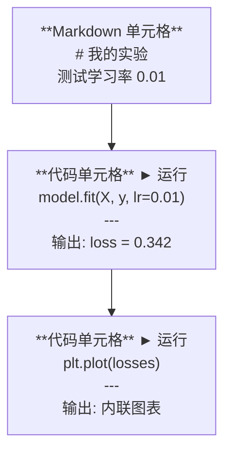
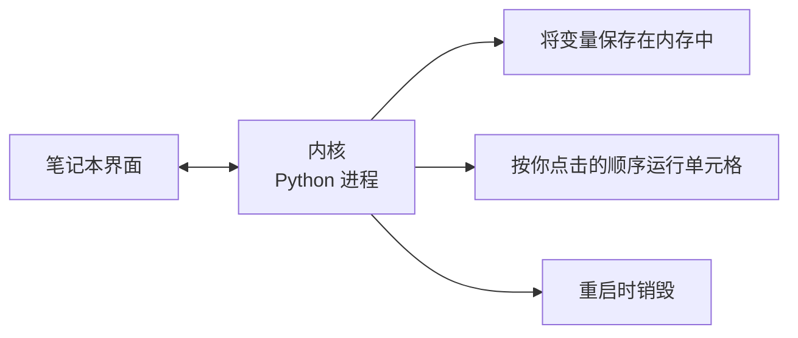

# Jupyter 笔记本

> 笔记本是 AI 工程的实验台。你在这里做原型，然后把可行的方案迁移到生产环境。

**类型：** 构建
**语言：** Python
**前置条件：** 第 0 阶段，第 01 课
**时间：** ~30 分钟

## 学习目标

- 安装并启动 JupyterLab、Jupyter Notebook，或在 VS Code 中使用 Jupyter 扩展
- 使用魔法命令（`%timeit`、`%%time`、`%matplotlib inline`）进行内联基准测试和可视化
- 区分何时使用笔记本、何时使用脚本，并应用「在笔记本中探索，在脚本中交付」的工作流
- 识别并避免常见的笔记本陷阱：乱序执行、隐藏状态和内存泄漏

## 问题

每篇 AI 论文、每个教程、每场 Kaggle 竞赛都在使用 Jupyter 笔记本。它们让你分段运行代码、内联查看输出、将代码与说明混合在一起，并快速迭代。如果你尝试不用笔记本学习 AI，就像做数学作业没有草稿纸。

但笔记本也有真正的陷阱。人们把它们用于所有事情，包括它们根本不擅长的事情。知道何时使用笔记本、何时使用脚本，能让你避免日后的调试噩梦。

## 概念

笔记本是一系列单元格（cell）的列表。每个单元格要么是代码，要么是文本。



内核（kernel）是一个在后台运行的 Python 进程。当你运行一个单元格时，代码被发送到内核执行，内核再将结果返回。所有单元格共享同一个内核，因此变量会在单元格之间持久化。



「按你点击的顺序运行」这一点既是超能力，也是自伤武器。

## 动手构建

### 第一步：选择你的界面

三种选项，一种格式：

| 界面 | 安装 | 最适合 |
|-----------|---------|----------|
| JupyterLab | `pip install jupyterlab` 然后 `jupyter lab` | 完整 IDE 体验，多标签页、文件浏览器、终端 |
| Jupyter Notebook | `pip install notebook` 然后 `jupyter notebook` | 简单、轻量，一次一个笔记本 |
| VS Code | 安装 "Jupyter" 扩展 | 在编辑器内直接使用，Git 集成、调试 |

三者读写相同的 `.ipynb` 文件。选你喜欢的即可。JupyterLab 在 AI 工作中最为常见。

```bash
pip install jupyterlab
jupyter lab
```

### 第二步：重要的键盘快捷键

你在两种模式下操作。按 `Escape` 进入命令模式（左侧蓝条），按 `Enter` 进入编辑模式（左侧绿条）。

**命令模式（最常用）：**

| 按键 | 操作 |
|-----|--------|
| `Shift+Enter` | 运行单元格，跳到下一个 |
| `A` | 在上方插入单元格 |
| `B` | 在下方插入单元格 |
| `DD` | 删除单元格 |
| `M` | 转换为 Markdown |
| `Y` | 转换为代码 |
| `Z` | 撤销单元格操作 |
| `Ctrl+Shift+H` | 显示所有快捷键 |

**编辑模式：**

| 按键 | 操作 |
|-----|--------|
| `Tab` | 自动补全 |
| `Shift+Tab` | 显示函数签名 |
| `Ctrl+/` | 切换注释 |

`Shift+Enter` 是你每天会用上千次的快捷键。先记住它。

### 第三步：单元格类型

**代码单元格** 运行 Python 并显示输出：

```python
import numpy as np
data = np.random.randn(1000)
data.mean(), data.std()
```

输出：`(0.0032, 0.9987)`

**Markdown 单元格** 渲染格式化文本。用它们记录你在做什么以及为什么做。支持标题、粗体、斜体、LaTeX 数学公式（`$E = mc^2$`）、表格和图片。

### 第四步：魔法命令

这些不是 Python。它们是 Jupyter 特有的命令，以 `%`（行魔法）或 `%%`（单元格魔法）开头。

**为代码计时：**

```python
%timeit np.random.randn(10000)
```

输出：`45.2 us +/- 1.3 us per loop`

```python
%%time
model.fit(X_train, y_train, epochs=10)
```

输出：`Wall time: 2.34 s`

`%timeit` 多次运行代码并取平均值。`%%time` 只运行一次。微基准测试用 `%timeit`，训练运行用 `%%time`。

**启用内联绘图：**

```python
%matplotlib inline
```

现在每个 `plt.plot()` 或 `plt.show()` 都会直接在笔记本中渲染。

**无需离开笔记本即可安装包：**

```python
!pip install scikit-learn
```

`!` 前缀可以运行任何 shell 命令。

**检查环境变量：**

```python
%env CUDA_VISIBLE_DEVICES
```

### 第五步：内联显示富输出

笔记本会自动显示单元格中的最后一个表达式。但你可以控制它：

```python
import pandas as pd

df = pd.DataFrame({
    "model": ["Linear", "Random Forest", "Neural Net"],
    "accuracy": [0.72, 0.89, 0.94],
    "training_time": [0.1, 2.3, 45.6]
})
df
```

这会渲染一个格式化的 HTML 表格，而不是文本转储。绘图也是一样：

```python
import matplotlib.pyplot as plt

plt.figure(figsize=(8, 4))
plt.plot([1, 2, 3, 4], [1, 4, 2, 3])
plt.title("内联图表")
plt.show()
```

图表直接显示在单元格下方。这就是笔记本主导 AI 工作的原因——数据、图表和代码尽收眼底。

对于图片：

```python
from IPython.display import Image, display
display(Image(filename="architecture.png"))
```

### 第六步：Google Colab

Colab 是一个免费的云端 Jupyter 笔记本。它提供 GPU、预装库和 Google Drive 集成。无需任何设置。

1. 访问 [colab.research.google.com](https://colab.research.google.com)
2. 从本课程上传任意 `.ipynb` 文件
3. 运行时 > 更改运行时类型 > T4 GPU（免费）

Colab 与本地 Jupyter 的区别：
- 文件在会话之间不会持久化（保存到 Drive 或下载）
- 预装：numpy、pandas、matplotlib、torch、tensorflow、sklearn
- `from google.colab import files` 用于上传/下载文件
- `from google.colab import drive; drive.mount('/content/drive')` 用于持久化存储
- 免费版在 90 分钟无活动后超时

## 使用它

### 笔记本 vs 脚本：何时用哪个

| 用笔记本 | 用脚本 |
|-------------------|-----------------|
| 探索数据集 | 训练流水线 |
| 模型原型 | 可复用工具 |
| 可视化结果 | 带 `if __name__` 的程序 |
| 解释你的工作 | 定时运行的代码 |
| 快速实验 | 生产代码 |
| 课程练习 | 包和库 |

规则：**在笔记本中探索，在脚本中交付。**

AI 中的常见工作流：
1. 在笔记本中探索数据
2. 在笔记本中做模型原型
3. 一旦可行，将代码移到 `.py` 文件
4. 将这些 `.py` 文件导回笔记本进行进一步实验

### 常见陷阱

**乱序执行。** 你先运行单元格 5，再运行单元格 2，然后单元格 7。笔记本在你的机器上能跑，但别人从上到下运行时就崩了。解决方法：分享前，先执行 内核 > 重启并全部运行。

**隐藏状态。** 你删除了一个单元格，但它创建的变量仍在内存中。笔记本看起来很干净，但依赖着一个「幽灵单元格」。解决方法：定期重启内核。

**内存泄漏。** 加载一个 4GB 数据集，训练模型，再加载另一个数据集。没有任何东西被释放。解决方法：`del variable_name` 和 `gc.collect()`，或者重启内核。

## 交付产出

本课产出：
- `outputs/prompt-notebook-helper.md` 用于调试笔记本问题

## 练习

1. 打开 JupyterLab，创建一个笔记本，用 `%timeit` 对比列表推导式和 numpy 创建 100,000 个随机数组的速度
2. 创建一个同时包含 Markdown 和代码单元格的笔记本，加载 CSV、显示 DataFrame、绘制图表。然后运行 内核 > 重启并全部运行，验证它能从上到下正确执行
3. 将 `code/notebook_tips.py` 中的代码复制到 Colab 笔记本中，用免费 GPU 运行

## 关键术语

| 术语 | 人们怎么说 | 实际含义 |
|------|----------------|----------------------|
| 内核（Kernel） | "运行我代码的东西" | 一个独立的 Python 进程，执行单元格并将变量保存在内存中 |
| 单元格（Cell） | "一个代码块" | 笔记本中可独立运行的单元，要么是代码，要么是 Markdown |
| 魔法命令（Magic command） | "Jupyter 技巧" | 以 `%` 或 `%%` 为前缀的特殊命令，用于控制笔记本环境 |
| `.ipynb` | "笔记本文件" | 包含单元格、输出和元数据的 JSON 文件。代表 IPython Notebook |

## 延伸阅读

- [JupyterLab 文档](https://jupyterlab.readthedocs.io/) 了解完整功能
- [Google Colab 常见问题](https://research.google.com/colaboratory/faq.html) 了解 Colab 特有的限制和功能
- [28 个 Jupyter Notebook 技巧](https://www.dataquest.io/blog/jupyter-notebook-tips-tricks-shortcuts/) 了解高级用户快捷键
