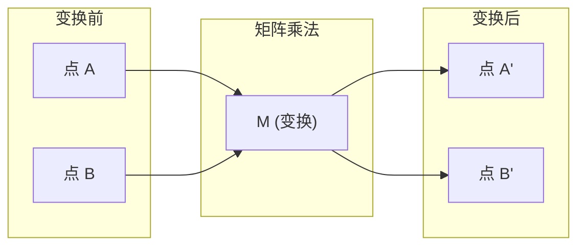
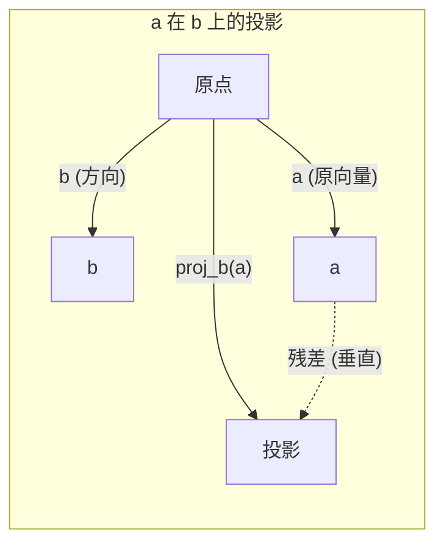

# 线性代数直觉

> 每个 AI 模型本质上都是披着花哨外衣的矩阵运算。

**类型：** 学习
**语言：** Python, Julia
**前置要求：** 第 0 阶段
**时长：** ~60 分钟

## 学习目标

- 用 Python 从零实现向量与矩阵运算（加法、点积、矩阵乘法）
- 从几何角度解释点积、投影和格拉姆-施密特正交化的含义
- 通过行约简判断一组向量的线性无关性、秩和基
- 将线性代数概念与 AI 应用联系起来：词嵌入、注意力分数、LoRA

## 问题

打开任意一篇机器学习论文，第一页就会看到向量、矩阵、点积和变换。没有线性代数的直觉，这些只是符号；有了直觉，你就能看透神经网络在做什么——在空间中移动点。

你不需要成为数学家。你需要从几何角度理解这些运算的含义，然后亲手编码实现。

## 概念

### 向量是点（也是方向）

向量就是一个数字列表。但这些数字是有意义的——它们是空间中的坐标。

**二维向量 [3, 2]：**

| x | y | 含义 |
|---|---|------|
| 3 | 2 | 向量从原点 (0,0) 指向平面上的 (3, 2) |

该向量的模长为 sqrt(3² + 2²) = sqrt(13)，方向朝右上方。

在 AI 中，向量可以表示一切：
- 一个词 → 768 维的数字向量（它在嵌入空间中的"含义"）
- 一张图 → 数百万像素值组成的向量
- 一个用户 → 偏好向量

### 矩阵是变换

矩阵将一个向量变换成另一个向量。它可以旋转、缩放、拉伸或投影。



在 AI 中，矩阵**就是**模型本身：
- 神经网络权重 → 将输入变换为输出的矩阵
- 注意力分数 → 决定关注什么的矩阵
- 词嵌入 → 将词映射到向量的矩阵

### 点积衡量相似度

两个向量的点积告诉你它们有多相似。

```
a · b = a₁×b₁ + a₂×b₂ + ... + aₙ×bₙ

同方向：    a · b > 0  （相似）
垂直：      a · b = 0  （无关）
反方向：    a · b < 0  （不相似）
```

搜索引擎、推荐系统和 RAG 的底层原理就是如此——找点积高的向量。

### 线性无关

如果一组向量中没有任何一个能表示为其余向量的线性组合，那么它们就是线性无关的。若 v1, v2, v3 无关，则它们张成一个三维空间；若其中一个是其余的组合，则它们只能张成一个平面。

为什么这对 AI 很重要：你的特征矩阵的列应该是线性无关的。如果两个特征完全相关（线性相关），模型无法区分它们各自的影响。这会导致回归中的多重共线性——权重矩阵变得不稳定，输入的微小变化就会引起输出的剧烈波动。

**具体例子：**

```
v1 = [1, 0, 0]
v2 = [0, 1, 0]
v3 = [2, 1, 0]   # v3 = 2*v1 + v2
```

v1 和 v2 是无关的——谁都不是另一个的标量倍数或组合。但 v3 = 2*v1 + v2，所以 {v1, v2, v3} 是相关组。这三个向量都躺在 xy 平面上。无论你怎样组合它们，都到不了 [0, 0, 1]。你有三个向量，却只有两个自由度。

在数据集中：如果 feature_3 = 2*feature_1 + feature_2，加入 feature_3 不会给模型带来任何新信息。更糟的是，它会让正规方程奇异——权重没有唯一解。

### 基与秩

**基**是张成整个空间的最小线性无关向量组。基向量的个数就是空间的维度。

三维空间的标准基是 {[1,0,0], [0,1,0], [0,0,1]}。但三维空间中任意三个无关向量都能构成有效的基。选择基就是选择坐标系。

**矩阵的秩** = 线性无关的列数 = 线性无关的行数。如果秩 < min(行数, 列数)，矩阵就是**秩亏**的。这意味着：
- 方程组有无穷多解（或无解）
- 变换过程中信息丢失
- 矩阵不可逆

| 情况 | 秩 | 对 ML 的含义 |
|------|------|-------------|
| 满秩（秩 = min(m, n)） | 最大可能值 | 唯一最小二乘解存在，模型条件良好 |
| 秩亏（秩 < min(m, n)） | 低于最大 | 特征冗余，权重解无穷多，需要正则化 |
| 秩 1 | 1 | 每列都是一个向量的缩放拷贝，所有数据落在一条线上 |
| 近似秩亏（奇异值很小） | 数值上偏低 | 矩阵病态，微小输入噪声导致大幅输出变化，需用 SVD 截断或岭回归 |

### 投影

将向量 **a** 投影到向量 **b** 上，得到的是 **a** 在 **b** 方向上的分量：

```
proj_b(a) = (a · b / b · b) * b
```

残差 (a - proj_b(a)) 与 b 垂直。这种正交分解是最小二乘拟合的基础。

投影在 ML 中无处不在：
- 线性回归最小化观测值到列空间的距离——解**就是**一个投影
- PCA 将数据投影到方差最大的方向上
- Transformer 中的注意力计算查询到键的投影



**例子：** a = [3, 4], b = [1, 0]

proj_b(a) = (3*1 + 4*0) / (1*1 + 0*0) * [1, 0] = 3 * [1, 0] = [3, 0]

投影丢掉了 y 分量。这是最简单的降维——扔掉你不关心的方向。

### 格拉姆-施密特正交化

将任意一组无关向量转换成**标准正交基**。标准正交意味着每个向量长度为 1，且两两垂直。

算法：
1. 取第一个向量，归一化
2. 取第二个向量，减去它在第一个向量上的投影，再归一化
3. 取第三个向量，减去它在所有前面向量上的投影，再归一化
4. 对剩余向量重复

```
输入：v1, v2, v3, ... （线性无关）

u1 = v1 / |v1|

w2 = v2 - (v2 · u1) * u1
u2 = w2 / |w2|

w3 = v3 - (v3 · u1) * u1 - (v3 · u2) * u2
u3 = w3 / |w3|

输出：u1, u2, u3, ... （标准正交基）
```

这就是 QR 分解的内部工作原理。Q 是标准正交基，R 记录投影系数。QR 分解用于：
- 解线性方程组（比高斯消元更稳定）
- 计算特征值（QR 算法）
- 最小二乘回归（标准数值方法）

## 动手实现

### 步骤 1：从零实现向量（Python）

```python
class Vector:
    def __init__(self, components):
        self.components = list(components)
        self.dim = len(self.components)

    def __add__(self, other):
        return Vector([a + b for a, b in zip(self.components, other.components)])

    def __sub__(self, other):
        return Vector([a - b for a, b in zip(self.components, other.components)])

    def dot(self, other):
        return sum(a * b for a, b in zip(self.components, other.components))

    def magnitude(self):
        return sum(x**2 for x in self.components) ** 0.5

    def normalize(self):
        mag = self.magnitude()
        return Vector([x / mag for x in self.components])

    def cosine_similarity(self, other):
        return self.dot(other) / (self.magnitude() * other.magnitude())

    def __repr__(self):
        return f"Vector({self.components})"


a = Vector([1, 2, 3])
b = Vector([4, 5, 6])

print(f"a + b = {a + b}")
print(f"a · b = {a.dot(b)}")
print(f"|a| = {a.magnitude():.4f}")
print(f"余弦相似度 = {a.cosine_similarity(b):.4f}")
```

### 步骤 2：从零实现矩阵（Python）

```python
class Matrix:
    def __init__(self, rows):
        self.rows = [list(row) for row in rows]
        self.shape = (len(self.rows), len(self.rows[0]))

    def __matmul__(self, other):
        if isinstance(other, Vector):
            return Vector([
                sum(self.rows[i][j] * other.components[j] for j in range(self.shape[1]))
                for i in range(self.shape[0])
            ])
        rows = []
        for i in range(self.shape[0]):
            row = []
            for j in range(other.shape[1]):
                row.append(sum(
                    self.rows[i][k] * other.rows[k][j]
                    for k in range(self.shape[1])
                ))
            rows.append(row)
        return Matrix(rows)

    def transpose(self):
        return Matrix([
            [self.rows[j][i] for j in range(self.shape[0])]
            for i in range(self.shape[1])
        ])

    def __repr__(self):
        return f"Matrix({self.rows})"


rotation_90 = Matrix([[0, -1], [1, 0]])
point = Vector([3, 1])

rotated = rotation_90 @ point
print(f"原始点: {point}")
print(f"旋转 90°: {rotated}")
```

### 步骤 3：为什么这对 AI 重要

```python
import random

random.seed(42)
weights = Matrix([[random.gauss(0, 0.1) for _ in range(3)] for _ in range(2)])
input_vector = Vector([1.0, 0.5, -0.3])

output = weights @ input_vector
print(f"输入 (3D): {input_vector}")
print(f"输出 (2D): {output}")
print("这就是神经网络层在做的事——矩阵乘法。")
```

### 步骤 4：Julia 版本

```julia
a = [1.0, 2.0, 3.0]
b = [4.0, 5.0, 6.0]

println("a + b = ", a + b)
println("a · b = ", a ⋅ b)       # Julia 支持 Unicode 运算符
println("|a| = ", √(a ⋅ a))
println("余弦 = ", (a ⋅ b) / (√(a ⋅ a) * √(b ⋅ b)))

# 矩阵-向量乘法
W = [0.1 -0.2 0.3; 0.4 0.5 -0.1]
x = [1.0, 0.5, -0.3]
println("Wx = ", W * x)
println("这就是一个神经网络层。")
```

### 步骤 5：线性无关与投影（Python）

```python
def is_linearly_independent(vectors):
    n = len(vectors)
    dim = len(vectors[0].components)
    mat = Matrix([v.components[:] for v in vectors])
    rows = [row[:] for row in mat.rows]
    rank = 0
    for col in range(dim):
        pivot = None
        for row in range(rank, len(rows)):
            if abs(rows[row][col]) > 1e-10:
                pivot = row
                break
        if pivot is None:
            continue
        rows[rank], rows[pivot] = rows[pivot], rows[rank]
        scale = rows[rank][col]
        rows[rank] = [x / scale for x in rows[rank]]
        for row in range(len(rows)):
            if row != rank and abs(rows[row][col]) > 1e-10:
                factor = rows[row][col]
                rows[row] = [rows[row][j] - factor * rows[rank][j] for j in range(dim)]
        rank += 1
    return rank == n


def project(a, b):
    scalar = a.dot(b) / b.dot(b)
    return Vector([scalar * x for x in b.components])


def gram_schmidt(vectors):
    orthonormal = []
    for v in vectors:
        w = v
        for u in orthonormal:
            proj = project(w, u)
            w = w - proj
        if w.magnitude() < 1e-10:
            continue
        orthonormal.append(w.normalize())
    return orthonormal


v1 = Vector([1, 0, 0])
v2 = Vector([1, 1, 0])
v3 = Vector([1, 1, 1])
basis = gram_schmidt([v1, v2, v3])
for i, u in enumerate(basis):
    print(f"u{i+1} = {u}")
    print(f"  |u{i+1}| = {u.magnitude():.6f}")

print(f"u1 · u2 = {basis[0].dot(basis[1]):.6f}")
print(f"u1 · u3 = {basis[0].dot(basis[2]):.6f}")
print(f"u2 · u3 = {basis[1].dot(basis[2]):.6f}")
```

## 用现成库

下面是同样的操作，用 NumPy——你实际工作中会用的工具：

```python
import numpy as np

a = np.array([1, 2, 3], dtype=float)
b = np.array([4, 5, 6], dtype=float)

print(f"a + b = {a + b}")
print(f"a · b = {np.dot(a, b)}")
print(f"|a| = {np.linalg.norm(a):.4f}")
print(f"余弦 = {np.dot(a, b) / (np.linalg.norm(a) * np.linalg.norm(b)):.4f}")

W = np.random.randn(2, 3) * 0.1
x = np.array([1.0, 0.5, -0.3])
print(f"Wx = {W @ x}")
```

### NumPy 中的秩、投影与 QR 分解

```python
import numpy as np

A = np.array([[1, 2], [2, 4]])
print(f"秩: {np.linalg.matrix_rank(A)}")

a = np.array([3, 4])
b = np.array([1, 0])
proj = (np.dot(a, b) / np.dot(b, b)) * b
print(f"{a} 在 {b} 上的投影: {proj}")

Q, R = np.linalg.qr(np.random.randn(3, 3))
print(f"Q 是正交矩阵: {np.allclose(Q @ Q.T, np.eye(3))}")
print(f"R 是上三角: {np.allclose(R, np.triu(R))}")
```

### PyTorch —— 带自动求导的向量

```python
import torch

x = torch.randn(3, requires_grad=True)
y = torch.tensor([1.0, 0.0, 0.0])

similarity = torch.dot(x, y)
similarity.backward()

print(f"x = {x.data}")
print(f"y = {y.data}")
print(f"点积 = {similarity.item():.4f}")
print(f"d(点积)/dx = {x.grad}")
```

点积对 x 的梯度就是 y。PyTorch 自动算好了。神经网络中的每个操作都是由这样的运算构建的——矩阵乘法、点积、投影——而自动求导会追踪所有这些运算的梯度。

你刚刚从零实现了 NumPy 一行代码就能做的事情。现在你知道底层发生了什么。

## 产出

本课产出：
- `outputs/prompt-linear-algebra-tutor-zh.md` —— 一个用于 AI 助手通过几何直觉教授线性代数的提示词

## 联系

本课中的每个概念都与现代 AI 的具体部分相连：

| 概念 | 在 AI 中的出现位置 |
|------|------------------|
| 点积 | Transformer 中的注意力分数、RAG 中的余弦相似度 |
| 矩阵乘法 | 每个神经网络层、每个线性变换 |
| 线性无关 | 特征选择、避免多重共线性 |
| 秩 | 判断方程组是否可解、LoRA（低秩适配） |
| 投影 | 线性回归（投影到列空间）、PCA |
| 格拉姆-施密特 / QR | 数值求解器、特征值计算 |
| 标准正交基 | 稳定数值计算、白化变换 |

LoRA 值得特别一提。它通过将权重更新分解为低秩矩阵来微调大语言模型。与其更新一个 4096×4096 的权重矩阵（1600 万参数），LoRA 只更新两个 4096×16 和 16×4096 的矩阵（13.1 万参数）。秩-16 的约束意味着 LoRA 假设权重更新生活在完整 4096 维空间的一个 16 维子空间中。这就是线性代数在干实事。

## 练习

1. 实现 `Vector.angle_between(other)`，返回两个向量之间的夹角（度数）
2. 创建一个二维缩放矩阵，将 x 坐标翻倍、y 坐标翻三倍，然后作用于向量 [1, 1]
3. 给定 5 个随机的"类词"向量（50 维），用余弦相似度找出最相似的一对
4. 验证格拉姆-施密特输出确实是标准正交的：检查每对向量的点积为 0，每个向量的模长为 1
5. 创建一个秩为 2 的 3×3 矩阵。用 `rank()` 方法验证。然后解释这些列张成了什么样的几何对象。
6. 将向量 [1, 2, 3] 投影到 [1, 1, 1] 上。结果在几何上代表什么？

## 关键术语

| 术语 | 人们怎么说的 | 实际含义 |
|------|-------------|---------|
| 向量 | "一个箭头" | 代表 n 维空间中一个点或方向的数字列表 |
| 矩阵 | "一张数表" | 将向量从一个空间映射到另一个空间的变换 |
| 点积 | "相乘再相加" | 衡量两个向量有多对齐——相似度搜索的核心 |
| 嵌入 | "某种 AI 魔法" | 代表某个东西（词、图、用户）含义的向量 |
| 线性无关 | "它们不重叠" | 组中没有任何一个向量能写成其余向量的组合 |
| 秩 | "多少维度" | 矩阵中线性无关的列（或行）的数量 |
| 投影 | "影子" | 一个向量在另一个向量方向上的分量 |
| 基 | "坐标轴" | 张成空间的最小无关向量组 |
| 标准正交 | "垂直的单位向量" | 两两垂直且每个长度都为 1 的向量 |
