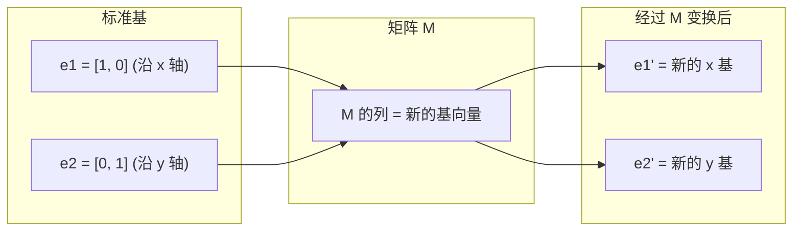
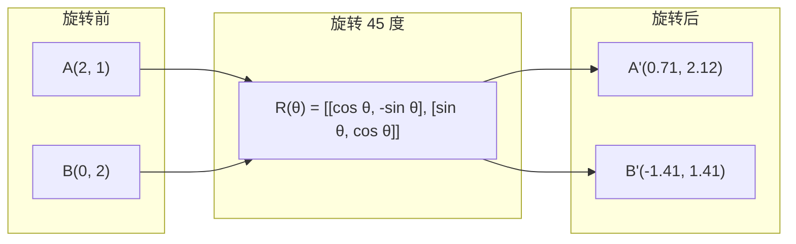
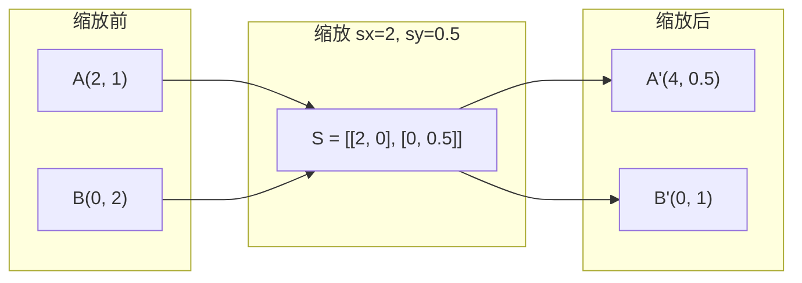
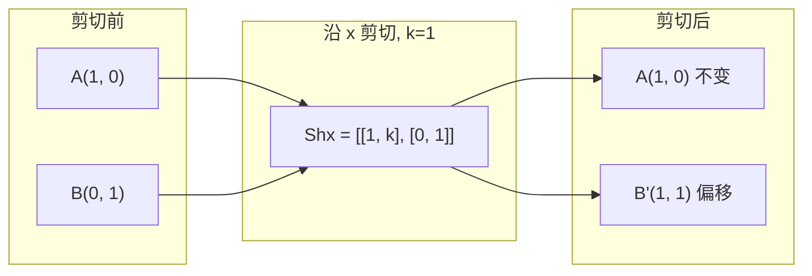
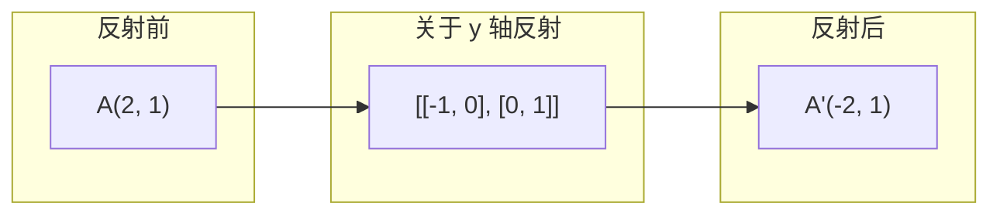
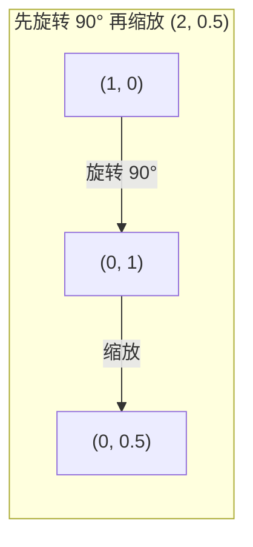
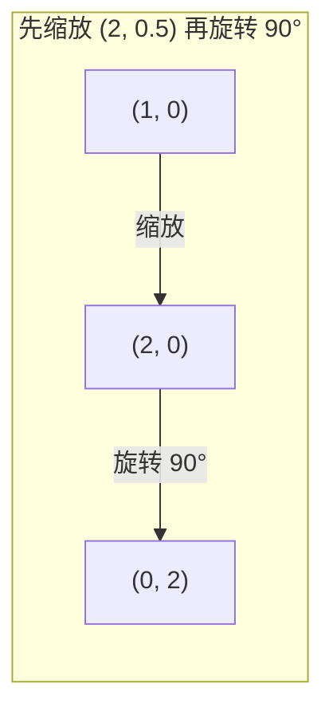

# 矩阵变换与特征值

> 矩阵是一台重塑空间的机器。搞清楚它对每个点做了什么，你就理解了整个变换。

**类型：** 动手实现
**语言：** Python, Julia
**前置要求：** 第 1 阶段第 1~2 课（线性代数直觉、向量矩阵与运算）
**时长：** ~75 分钟

## 学习目标

- 构造旋转、缩放、剪切和反射矩阵，并作用于二维和三维点
- 通过矩阵乘法组合多个变换，验证顺序的重要性
- 从特征方程出发，计算 2×2 矩阵的特征值和特征向量
- 解释特征值如何决定 PCA 方向、RNN 稳定性和谱聚类行为

## 问题

你读到 PCA 时看到"求协方差矩阵的特征向量"。你读到模型稳定性时看到"检查所有特征值的模是否小于 1"。你读到数据增强时看到"施加随机旋转"。在搞懂矩阵对空间的几何作用之前，这些都没有意义。

矩阵不只是数字网格。它们是**空间机器**。旋转矩阵让点转圈。缩放矩阵让点拉伸。剪切矩阵让点倾斜。神经网络对数据施加的每个变换，都是这些操作之一，或它们的组合。这节课把这些操作变得具体可感。

## 概念

### 变换即矩阵

二维中的每个线性变换都能写成一个 2×2 矩阵。矩阵告诉你基向量 [1, 0] 和 [0, 1] 被搬到了哪里。其他一切由此推导。



### 旋转

二维旋转矩阵保持距离和角度不变。每个点沿圆弧移动。



三维中，你绕某条轴旋转。每条轴有自己的旋转矩阵：

```
Rz(theta) = | cos  -sin  0 |     绕 z 轴旋转
            | sin   cos  0 |     (x-y 平面转，z 不变)
            |  0     0   1 |

Rx(theta) = | 1   0     0    |   绕 x 轴旋转
            | 0  cos  -sin   |   (y-z 平面转，x 不变)
            | 0  sin   cos   |

Ry(theta) = |  cos  0  sin |     绕 y 轴旋转
            |   0   1   0  |     (x-z 平面转，y 不变)
            | -sin  0  cos |
```

### 缩放

缩放沿各轴独立地拉伸或压缩。



### 剪切

剪切让一条轴倾斜，同时保持另一条轴固定。它把矩形变成平行四边形。



剪切矩阵：
- `Shx = [[1, k], [0, 1]]` 把 x 按 k * y 偏移
- `Shy = [[1, 0], [k, 1]]` 把 y 按 k * x 偏移

### 反射

反射把点关于某条轴或某条直线做镜像。



反射矩阵：
- 关于 y 轴反射：`[[-1, 0], [0, 1]]`
- 关于 x 轴反射：`[[1, 0], [0, -1]]`

### 组合：变换链

先施加变换 A 再施加 B，等价于矩阵相乘：`result = B @ A @ point`。顺序很重要。先旋转再缩放，和先缩放再旋转，结果不同。



组合结果：`S @ R = [[0, -2], [0.5, 0]]`



组合结果：`R @ S = [[0, -0.5], [2, 0]]`

结果不同。矩阵乘法不满足交换律。

### 特征值与特征向量

大多数向量被矩阵乘了之后方向会变。特征向量是特殊的：矩阵只缩放它们，从不旋转它们。缩放因子就是特征值。

```
A @ v = lambda * v

v 是特征向量（幸存下来的方向）
lambda 是特征值（拉伸了多少倍）

例子：A = | 2  1 |
         | 1  2 |

特征向量 [1, 1]，特征值 3：
  A @ [1,1] = [3, 3] = 3 * [1, 1]     （同方向，拉长了 3 倍）

特征向量 [1, -1]，特征值 1：
  A @ [1,-1] = [1, -1] = 1 * [1, -1]  （同方向，长度不变）
```

这个矩阵沿 [1, 1] 方向把空间拉长了 3 倍，沿 [1, -1] 方向保持不变。其他所有方向都是这两个方向的混合。

### 特征分解

如果一个矩阵有 n 个线性无关的特征向量，它可以被分解：

```
A = V @ D @ V^(-1)

V = 以特征向量为列的矩阵
D = 特征值构成的对角矩阵
V^(-1) = V 的逆矩阵

含义：旋转到特征向量坐标系，沿各轴缩放，再旋转回去。
```

### 为什么特征值很重要

**PCA。** 协方差矩阵的特征向量就是主成分。特征值告诉你每个成分捕获了多少方差。按特征值排序，保留前 k 个，就是降维。

**稳定性。** 在循环神经网络和动力系统中，模大于 1 的特征值导致输出爆炸。模小于 1 导致输出消失。这就是梯度消失/爆炸问题的一句话总结。

**谱方法。** 图神经网络使用邻接矩阵的特征值。谱聚类使用拉普拉斯矩阵的特征值。特征向量揭示了图的结构。

### 行列式作为面积/体积缩放因子

变换矩阵的行列式告诉你它把面积(2D)或体积(3D)缩放了多少。

```
det = 1:   面积不变（旋转）
det = 2:   面积翻倍
det = 0:   空间被压扁到更低维度（奇异）
det = -1:  面积不变但方向翻转（反射）

| det(旋转) | = 1        （永远）
| det(缩放 sx, sy) | = sx * sy
| det(剪切) | = 1           （面积不变）
| det(反射) | = -1     （方向翻转）
```

## 动手实现

### 步骤 1：从零写变换矩阵（Python）

```python
import math

def rotation_2d(theta):
    c, s = math.cos(theta), math.sin(theta)
    return [[c, -s], [s, c]]

def scaling_2d(sx, sy):
    return [[sx, 0], [0, sy]]

def shearing_2d(kx, ky):
    return [[1, kx], [ky, 1]]

def reflection_x():
    return [[1, 0], [0, -1]]

def reflection_y():
    return [[-1, 0], [0, 1]]

def mat_vec_mul(matrix, vector):
    return [
        sum(matrix[i][j] * vector[j] for j in range(len(vector)))
        for i in range(len(matrix))
    ]

def mat_mul(a, b):
    rows_a, cols_b = len(a), len(b[0])
    cols_a = len(a[0])
    return [
        [sum(a[i][k] * b[k][j] for k in range(cols_a)) for j in range(cols_b)]
        for i in range(rows_a)
    ]

point = [1.0, 0.0]
angle = math.pi / 4

rotated = mat_vec_mul(rotation_2d(angle), point)
print(f"把 (1,0) 旋转 45°: ({rotated[0]:.4f}, {rotated[1]:.4f})")

scaled = mat_vec_mul(scaling_2d(2, 3), [1.0, 1.0])
print(f"把 (1,1) 缩放 (2,3): ({scaled[0]:.1f}, {scaled[1]:.1f})")

sheared = mat_vec_mul(shearing_2d(1, 0), [1.0, 1.0])
print(f"把 (1,1) 沿 x 剪切 k=1: ({sheared[0]:.1f}, {sheared[1]:.1f})")

reflected = mat_vec_mul(reflection_y(), [2.0, 1.0])
print(f"把 (2,1) 关于 y 轴反射: ({reflected[0]:.1f}, {reflected[1]:.1f})")
```

### 步骤 2：变换的组合

```python
R = rotation_2d(math.pi / 2)
S = scaling_2d(2, 0.5)

rotate_then_scale = mat_mul(S, R)
scale_then_rotate = mat_mul(R, S)

point = [1.0, 0.0]
result1 = mat_vec_mul(rotate_then_scale, point)
result2 = mat_vec_mul(scale_then_rotate, point)

print(f"先旋转 90° 再缩放: ({result1[0]:.2f}, {result1[1]:.2f})")
print(f"先缩放再旋转 90°: ({result2[0]:.2f}, {result2[1]:.2f})")
print(f"一样吗? {result1 == result2}")
```

### 步骤 3：从零算特征值（2×2）

对 2×2 矩阵 `[[a, b], [c, d]]`，特征值满足特征方程：`lambda² - (a+d)*lambda + (ad - bc) = 0`。

```python
def eigenvalues_2x2(matrix):
    a, b = matrix[0]
    c, d = matrix[1]
    trace = a + d
    det = a * d - b * c
    discriminant = trace ** 2 - 4 * det
    if discriminant < 0:
        real = trace / 2
        imag = (-discriminant) ** 0.5 / 2
        return (complex(real, imag), complex(real, -imag))
    sqrt_disc = discriminant ** 0.5
    return ((trace + sqrt_disc) / 2, (trace - sqrt_disc) / 2)

def eigenvector_2x2(matrix, eigenvalue):
    a, b = matrix[0]
    c, d = matrix[1]
    if abs(b) > 1e-10:
        v = [b, eigenvalue - a]
    elif abs(c) > 1e-10:
        v = [eigenvalue - d, c]
    else:
        if abs(a - eigenvalue) < 1e-10:
            v = [1, 0]
        else:
            v = [0, 1]
    mag = (v[0] ** 2 + v[1] ** 2) ** 0.5
    return [v[0] / mag, v[1] / mag]

A = [[2, 1], [1, 2]]
vals = eigenvalues_2x2(A)
print(f"矩阵: {A}")
print(f"特征值: {vals[0]:.4f}, {vals[1]:.4f}")

for val in vals:
    vec = eigenvector_2x2(A, val)
    result = mat_vec_mul(A, vec)
    scaled = [val * vec[0], val * vec[1]]
    print(f"  lambda={val:.1f}, v={[round(x,4) for x in vec]}")
    print(f"    A@v = {[round(x,4) for x in result]}")
    print(f"    l*v = {[round(x,4) for x in scaled]}")
```

### 步骤 4：行列式作为面积缩放因子

```python
def det_2x2(matrix):
    return matrix[0][0] * matrix[1][1] - matrix[0][1] * matrix[1][0]

print(f"det(旋转 45°) = {det_2x2(rotation_2d(math.pi/4)):.4f}")
print(f"det(缩放 2,3)   = {det_2x2(scaling_2d(2, 3)):.1f}")
print(f"det(剪切 kx=1)  = {det_2x2(shearing_2d(1, 0)):.1f}")
print(f"det(反射 y)     = {det_2x2(reflection_y()):.1f}")

singular = [[1, 2], [2, 4]]
print(f"det(奇异矩阵)   = {det_2x2(singular):.1f}")
print("奇异：列成比例，空间被压扁成一条线。")
```

## 用现成库

NumPy 用优化的例程处理所有这些。

```python
import numpy as np

theta = np.pi / 4
R = np.array([[np.cos(theta), -np.sin(theta)],
              [np.sin(theta),  np.cos(theta)]])

point = np.array([1.0, 0.0])
print(f"把 (1,0) 旋转 45°: {R @ point}")

S = np.diag([2.0, 3.0])
composed = S @ R
print(f"先旋转 45° 再缩放 (2,3): {composed @ point}")

A = np.array([[2, 1], [1, 2]], dtype=float)
eigenvalues, eigenvectors = np.linalg.eig(A)
print(f"\n特征值: {eigenvalues}")
print(f"特征向量 (列):\n{eigenvectors}")

for i in range(len(eigenvalues)):
    v = eigenvectors[:, i]
    lam = eigenvalues[i]
    print(f"  A @ v{i} = {A @ v}, lambda * v{i} = {lam * v}")

print(f"\ndet(R) = {np.linalg.det(R):.4f}")
print(f"det(S) = {np.linalg.det(S):.1f}")

B = np.array([[3, 1], [0, 2]], dtype=float)
vals, vecs = np.linalg.eig(B)
D = np.diag(vals)
V = vecs
reconstructed = V @ D @ np.linalg.inv(V)
print(f"\n特征分解 A = V @ D @ V^-1:")
print(f"原矩阵:\n{B}")
print(f"重构:\n{reconstructed}")
```

### NumPy 做三维旋转

```python
def rotation_3d_z(theta):
    c, s = np.cos(theta), np.sin(theta)
    return np.array([[c, -s, 0], [s, c, 0], [0, 0, 1]])

def rotation_3d_x(theta):
    c, s = np.cos(theta), np.sin(theta)
    return np.array([[1, 0, 0], [0, c, -s], [0, s, c]])

point_3d = np.array([1.0, 0.0, 0.0])
rotated_z = rotation_3d_z(np.pi / 2) @ point_3d
rotated_x = rotation_3d_x(np.pi / 2) @ point_3d

print(f"\n三维点: {point_3d}")
print(f"绕 z 轴旋转 90°: {np.round(rotated_z, 4)}")
print(f"绕 x 轴旋转 90°: {np.round(rotated_x, 4)}")
```

## 产出

本课为 PCA（第 2 阶段）和神经网络权重分析奠定了几何基础。这里手写的特征值/特征向量代码，与生产级 ML 系统中驱动降维、谱聚类和稳定性分析的算法是同一个。

## 练习

1. 对单位正方形（顶点 [0,0], [1,0], [1,1], [0,1]）分别施加旋转、缩放和剪切。打印每种变换后的顶点坐标。验证旋转后顶点之间的距离保持不变。

2. 用手工推导特征方程的方法，求矩阵 [[4, 2], [1, 3]] 的特征值。然后用你的手写函数和 NumPy 验证。

3. 组合三种变换（旋转 30°、缩放 [1.5, 0.8]、剪切 kx=0.3），作用于圆周上均匀分布的 8 个点。打印变换前后的坐标。计算组合矩阵的行列式，验证它等于各矩阵行列式的乘积。

## 关键术语

| 术语 | 人们怎么说的 | 实际含义 |
|------|-------------|---------|
| 旋转矩阵 | "让东西转起来" | 正交矩阵，让点沿圆弧移动，保持距离和角度不变。行列式永远为 1。 |
| 缩放矩阵 | "让东西变大" | 对角矩阵，沿各轴独立拉伸或压缩。行列式等于缩放因子的乘积。 |
| 剪切矩阵 | "让东西倾斜" | 把一个坐标按比例偏移到另一个坐标上，把矩形变成平行四边形。行列式为 1。 |
| 反射 | "镜像" | 关于某条轴或某个平面对称翻转空间。行列式为 -1。 |
| 组合 | "做两件事" | 把变换矩阵相乘以链接操作。顺序很重要：B @ A 表示先 A 后 B。 |
| 特征向量 | "特殊方向" | 矩阵只缩放、不旋转的方向。是变换的"指纹"。 |
| 特征值 | "拉伸了多少倍" | 矩阵缩放其特征向量的标量因子。可以是负数（翻转）或复数（旋转）。 |
| 特征分解 | "把矩阵拆开" | 把矩阵写成 V @ D @ V^(-1)，分离出基本的缩放方向和幅度。 |
| 行列式 | "从矩阵里蹦出来的一个数" | 变换把面积(2D)或体积(3D)缩放了多少倍。为零意味着变换不可逆。 |
| 特征方程 | "特征值从哪来的" | det(A - lambda * I) = 0。特征值就是这个多项式的根。 |

## 延伸阅读

- [3Blue1Brown: 线性变换](https://www.3blue1brown.com/lessons/linear-transformations) -- 矩阵如何重塑空间的可视化直觉
- [3Blue1Brown: 特征向量与特征值](https://www.3blue1brown.com/lessons/eigenvalues) -- 特征向量几何含义的最佳可视化解释
- [MIT 18.06 第 21 讲: 特征值与特征向量](https://ocw.mit.edu/courses/18-06-linear-algebra-spring-2010/) -- Gilbert Strang 的经典讲解
