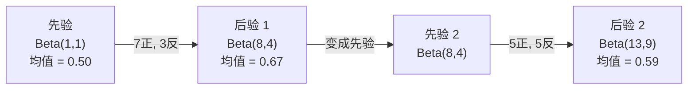

# 贝叶斯定理

> 概率关乎你的预期。贝叶斯定理关乎你的学习。

**类型：** 构建
**语言：** Python
**前置知识：** 第 1 阶段，第 06 课（概率基础）
**耗时：** ~75 分钟

## 学习目标

- 应用贝叶斯定理，从先验、似然和证据计算后验概率
- 从零构建朴素贝叶斯文本分类器，带拉普拉斯平滑和对数空间计算
- 对比 MLE 和 MAP 估计，解释 MAP 如何对应 L2 正则化
- 用 Beta-二项共轭先验实现序贯贝叶斯更新，用于 A/B 测试

## 问题所在

一项医学检测准确率 99%。你测出了阳性。你真正患病的概率是多少？

大多数人答 99%。真实答案取决于这种疾病有多罕见。如果每 10,000 人中只有 1 人患病，阳性结果只给你约 1% 的患病概率。其余 99% 的阳性结果来自健康人群的误报。

这不是脑筋急转弯。这就是贝叶斯定理。每个垃圾邮件过滤器、每个医学诊断、每个量化不确定性的机器学习模型都用的是这套推理。你从一个信念出发，看到证据，然后更新。

如果你不理解这个就构建 ML 系统，你会误读模型输出、设定糟糕的阈值、交付过度自信的预测。

## 核心概念

### 从联合概率到贝叶斯

你已在第 06 课学过条件概率：

```
P(A|B) = P(A 且 B) / P(B)
```

对称地：

```
P(B|A) = P(A 且 B) / P(A)
```

两个表达式共享同一个分子：P(A 且 B)。令它们相等并重新排列：

```
P(A 且 B) = P(A|B) * P(B) = P(B|A) * P(A)

因此：

P(A|B) = P(B|A) * P(A) / P(B)
```

这就是贝叶斯定理。四个量，一个公式。

### 四个部分

| 部分 | 名称 | 含义 |
|------|------|------|
| P(A\|B) | 后验 | 看到证据 B 后，你对 A 的更新信念 |
| P(B\|A) | 似然 | 如果 A 为真，证据 B 有多可能 |
| P(A) | 先验 | 看到任何证据之前，你对 A 的信念 |
| P(B) | 证据 | 在所有可能性下看到 B 的总概率 |

证据项 P(B) 充当归一化因子。你可以用全概率定律展开它：

```
P(B) = P(B|A) * P(A) + P(B|非 A) * P(非 A)
```

### 医学检测示例

一种疾病影响每 10,000 人中的 1 人。检测准确率 99%（99% 的患病者被检出，1% 的健康者被误报）。

```
P(患病)          = 0.0001     (先验：疾病罕见)
P(阳性|患病)      = 0.99       (似然：检测能抓住)
P(阳性|健康)      = 0.01       (误报率)

P(阳性) = P(阳性|患病) * P(患病) + P(阳性|健康) * P(健康)
      = 0.99 * 0.0001 + 0.01 * 0.9999
      = 0.000099 + 0.009999
      = 0.010098

P(患病|阳性) = P(阳性|患病) * P(患病) / P(阳性)
           = 0.99 * 0.0001 / 0.010098
           = 0.0098
           = 0.98%
```

不到 1%。先验占主导。当一种疾病罕见时，即使准确的检测也会产生大量假阳性。这就是为什么医生会要求做确认检测。

### 垃圾邮件过滤示例

你收到一封包含"lottery"一词的邮件。它是垃圾邮件吗？

```
P(垃圾邮件)                = 0.3      (30% 的邮件是垃圾邮件)
P("lottery"|垃圾邮件)      = 0.05     (5% 的垃圾邮件包含"lottery")
P("lottery"|非垃圾邮件)    = 0.001    (0.1% 的合法邮件包含"lottery")

P("lottery") = 0.05 * 0.3 + 0.001 * 0.7
           = 0.015 + 0.0007
           = 0.0157

P(垃圾邮件|"lottery") = 0.05 * 0.3 / 0.0157
                    = 0.955
                    = 95.5%
```

一个词就把概率从 30% 推到了 95.5%。真正的垃圾邮件过滤器会同时对数百个词应用贝叶斯。

### 朴素贝叶斯：独立性假设

朴素贝叶斯通过假设所有特征在已知类别条件下相互独立，将上述思想扩展到多个特征：

```
P(类别 | 特征_1, 特征_2, ..., 特征_n)
  = P(类别) * P(特征_1|类别) * P(特征_2|类别) * ... * P(特征_n|类别)
    / P(特征_1, 特征_2, ..., 特征_n)
```

"朴素"之处就在于独立性假设。在文本中，词的出现并不独立（"New"和"York"是相关的）。但这个假设在实践中出奇地有效，因为分类器只需要给类别排序，不需要输出校准的概率。

由于分母对所有类别相同，你可以跳过它，直接比较分子：

```
score(类别) = P(类别) * P(特征_i | 类别) 的乘积
```

选得分最高的类别。

### 最大似然估计（MLE）

你怎么从训练数据得到 P(特征|类别)？计数。

```
P("free"|垃圾邮件) = (包含"free"的垃圾邮件数) / (垃圾邮件总数)
```

这就是 MLE：选择使观测数据最可能的参数值。你在最大化似然函数，对于离散计数来说就是相对频率。

问题：如果一个词在训练时从未出现在垃圾邮件中，MLE 给它的概率是零。一个未见过的新词就能让整个乘积归零。用拉普拉斯平滑修复：

```
P(词|类别) = (count(词, 类别) + 1) / (类别总词数 + 词表大小)
```

给每个计数加 1，确保没有任何概率是零。

### 最大后验估计（MAP）

MLE 问：什么参数最大化 P(数据|参数)？

MAP 问：什么参数最大化 P(参数|数据)？

根据贝叶斯定理：

```
P(参数|数据) 正比于 P(数据|参数) * P(参数)
```

MAP 给参数本身加了一个先验。如果你相信参数应该小，你就编码一个惩罚大值的先验。这和 ML 中的 L2 正则化是同一回事。岭回归里的"ridge"惩罚本质上就是对权重的高斯先验。

| 估计 | 优化目标 | ML 对应 |
|------|----------|---------|
| MLE | P(数据\|参数) | 无正则化训练 |
| MAP | P(数据\|参数) * P(参数) | L2 / L1 正则化 |

### 贝叶斯 vs 频率学派：实际差异

频率学派把参数当作固定的未知量。他们问："如果我重复这个实验很多次，会发生什么？"

贝叶斯学派把参数当作分布。他们问："给定我已观测到的，我对参数相信什么？"

对于构建 ML 系统，实际差异：

| 方面 | 频率学派 | 贝叶斯学派 |
|------|----------|------------|
| 输出 | 点估计 | 值的分布 |
| 不确定性 | 置信区间（关于过程） | 可信区间（关于参数） |
| 小数据 | 可能过拟合 | 先验充当正则化 |
| 计算 | 通常更快 | 常需要采样（MCMC） |

大多数生产 ML 是频率学派的（SGD、点估计）。贝叶斯方法在需要校准不确定性时发光（医学决策、安全关键系统）或数据稀缺时（少样本学习、冷启动）。

### 为什么贝叶斯思维对 ML 至关重要

联系比类比更深：

**先验就是正则化。** 对权重的高斯先验就是 L2 正则化。拉普拉斯先验就是 L1。每次你加一个正则项，你就是在做贝叶斯陈述，表达你对参数值的预期。

**后验就是不确定性。** 单一预测概率告诉你模型对这个估计有多自信，什么都没说。贝叶斯方法给你一个分布："我认为 P(垃圾邮件) 在 0.8 到 0.95 之间。"

**贝叶斯更新是在线学习。** 今天的后验变成明天的先验。当你的模型看到新数据时，它增量更新信念，而不是从头重训。

**模型比较是贝叶斯的。** 贝叶斯信息准则（BIC）、边缘似然、贝叶斯因子都用贝叶斯推理来选模型而不发生过拟合。

## 动手实现

### 第 1 步：贝叶斯定理函数

```python
def bayes(prior, likelihood, false_positive_rate):
    """贝叶斯定理：从先验、似然和误报率计算后验"""
    evidence = likelihood * prior + false_positive_rate * (1 - prior)
    posterior = likelihood * prior / evidence
    return posterior

result = bayes(prior=0.0001, likelihood=0.99, false_positive_rate=0.01)
print(f"P(患病|阳性) = {result:.4f}")
```

### 第 2 步：朴素贝叶斯分类器

```python
import math
from collections import defaultdict

class NaiveBayes:
    """朴素贝叶斯文本分类器，带拉普拉斯平滑和对数概率"""
    
    def __init__(self, smoothing=1.0):
        self.smoothing = smoothing  # 拉普拉斯平滑参数
        self.class_counts = defaultdict(int)          # 每个类别的文档数
        self.word_counts = defaultdict(lambda: defaultdict(int))  # 类别→词→计数
        self.class_word_totals = defaultdict(int)     # 每个类别的总词数
        self.vocab = set()                            # 词表

    def train(self, documents, labels):
        """训练：统计每个类别中每个词的出现次数"""
        for doc, label in zip(documents, labels):
            self.class_counts[label] += 1
            words = doc.lower().split()
            for word in words:
                self.word_counts[label][word] += 1
                self.class_word_totals[label] += 1
                self.vocab.add(word)

    def predict(self, document):
        """预测：返回概率最高的类别"""
        words = document.lower().split()
        total_docs = sum(self.class_counts.values())
        vocab_size = len(self.vocab)
        best_class = None
        best_score = float("-inf")
        
        for cls in self.class_counts:
            # log P(类别)
            score = math.log(self.class_counts[cls] / total_docs)
            # sum log P(词|类别)
            for word in words:
                count = self.word_counts[cls].get(word, 0)
                total = self.class_word_totals[cls]
                score += math.log((count + self.smoothing) / (total + self.smoothing * vocab_size))
            
            if score > best_score:
                best_score = score
                best_class = cls
        
        return best_class
```

对数概率防止下溢。将许多小概率相乘会产生浮点数无法表示的极小数。求和对数概率数值稳定，数学上等价。

### 第 3 步：在垃圾邮件数据上训练

```python
train_docs = [
    "win free money now",
    "free lottery ticket winner",
    "claim your prize today free",
    "urgent offer free cash",
    "congratulations you won free",
    "meeting tomorrow at noon",
    "project update attached",
    "can we schedule a call",
    "quarterly report review",
    "lunch on thursday sounds good",
    "team standup notes attached",
    "please review the pull request",
]

train_labels = [
    "spam", "spam", "spam", "spam", "spam",
    "ham", "ham", "ham", "ham", "ham", "ham", "ham",
]

classifier = NaiveBayes()
classifier.train(train_docs, train_labels)

test_messages = [
    "free money waiting for you",
    "meeting rescheduled to friday",
    "you won a free prize",
    "please review the attached report",
]

for msg in test_messages:
    print(f"  '{msg}' -> {classifier.predict(msg)}")
```

### 第 4 步：查看学到的概率

```python
def show_top_words(classifier, cls, n=5):
    """显示某个类别中概率最高的词"""
    vocab_size = len(classifier.vocab)
    total = classifier.class_word_totals[cls]
    probs = {}
    for word in classifier.vocab:
        count = classifier.word_counts[cls].get(word, 0)
        probs[word] = (count + classifier.smoothing) / (total + classifier.smoothing * vocab_size)
    sorted_words = sorted(probs.items(), key=lambda x: x[1], reverse=True)
    for word, prob in sorted_words[:n]:
        print(f"    {word}: {prob:.4f}")

print("\n垃圾邮件 Top 词:")
show_top_words(classifier, "spam")
print("\n正常邮件 Top 词:")
show_top_words(classifier, "ham")
```

## 用现成库

Scikit-learn 自带生产级朴素贝叶斯实现：

```python
from sklearn.feature_extraction.text import CountVectorizer
from sklearn.naive_bayes import MultinomialNB
from sklearn.metrics import classification_report

vectorizer = CountVectorizer()
X_train = vectorizer.fit_transform(train_docs)
clf = MultinomialNB()
clf.fit(X_train, train_labels)

X_test = vectorizer.transform(test_messages)
predictions = clf.predict(X_test)
for msg, pred in zip(test_messages, predictions):
    print(f"  '{msg}' -> {pred}")
```

同一算法。CountVectorizer 处理分词和词表构建。MultinomialNB 内部处理平滑和对数概率。你的手写版 40 行代码做的是同样的事。

## 产出

这里构建的 NaiveBayes 类展示了完整流程：分词、带拉普拉斯平滑的概率估计、对数空间预测。`code/bayes.py` 中的代码端到端运行，仅依赖 Python 标准库。

### 共轭先验

当先验和后验属于同一分布族时，该先验称为"共轭"先验。这让贝叶斯更新在代数上很简洁——你得到一个闭式后验，无需数值积分。

| 似然 | 共轭先验 | 后验 | 示例 |
|-----------|----------------|-----------|---------|
| 伯努利 | Beta(a, b) | Beta(a + 成功数, b + 失败数) | 估计硬币偏差 |
| 正态（已知方差） | 正态(mu_0, sigma_0) | 正态（加权均值，更小方差） | 传感器校准 |
| 泊松 | Gamma(a, b) | Gamma(a + 计数之和, b + n) | 建模到达率 |
| 多项分布 | Dirichlet(alpha) | Dirichlet(alpha + 计数) | 主题建模、语言模型 |

为什么重要：没有共轭先验，你需要蒙特卡洛采样或变分推断来近似后验。有了共轭先验，你只需要更新两个数字。

Beta 分布是实践中最常用的共轭先验。Beta(a, b) 代表你对一个概率参数的信念。均值是 a/(a+b)。a+b 越大，分布越集中（越自信）。

Beta 先验的特例：
- Beta(1, 1) = 均匀分布。你对参数没有任何看法。
- Beta(10, 10) = 在 0.5 处尖峰。你强烈相信参数接近 0.5。
- Beta(1, 10) = 偏向 0。你相信参数很小。

更新规则简单到极点：

```
先验:     Beta(a, b)
数据:     s 次成功, f 次失败
后验:     Beta(a + s, b + f)
```

不需要积分。不需要采样。只是加法。

### 序贯贝叶斯更新

贝叶斯推断天然是序贯的。今天的后验变成明天的先验。这就是真实系统如何增量学习，无需重新处理全部历史数据。

具体示例：估计一枚硬币是否公平。

**第 1 天：尚无数据。**
从 Beta(1, 1) 开始——均匀先验。你没有看法。
- 先验均值：0.5
- 先验在 [0, 1] 上平坦

**第 2 天：观测到 7 次正面，3 次反面。**
后验 = Beta(1 + 7, 1 + 3) = Beta(8, 4)
- 后验均值：8/12 = 0.667
- 证据表明硬币偏向正面

**第 3 天：又观测到 5 次正面，5 次反面。**
用昨天的后验作为今天的先验。
后验 = Beta(8 + 5, 4 + 5) = Beta(13, 9)
- 后验均值：13/22 = 0.591
- 新的平衡数据把估计拉回了 0.5



观测顺序无关紧要。Beta(1,1) 一次性更新全部 12 次正面和 8 次反面，得到 Beta(13, 9)——同样的结果。序贯更新和批量更新在数学上等价。但序贯更新让你可以在每一步做决策，无需存储原始数据。

这是生产 ML 系统中在线学习的基础。Thompson 采样 bandit、增量推荐系统和流式异常检测器都用这个模式。

### 与 A/B 测试的联系

A/B 测试本质上就是贝叶斯推断。

场景：你在测试两种按钮颜色。变体 A（蓝色）和变体 B（绿色）。你想知道哪个获得更多点击。

贝叶斯 A/B 测试：

1. **先验。** 两个变体都从 Beta(1, 1) 开始。没有先验偏好。
2. **数据。** 变体 A：1000 次展示中 50 次点击。变体 B：1000 次展示中 65 次点击。
3. **后验。**
   - A：Beta(1 + 50, 1 + 950) = Beta(51, 951)。均值 = 0.051
   - B：Beta(1 + 65, 1 + 935) = Beta(66, 936)。均值 = 0.066
4. **决策。** 计算 P(B > A)——B 的真实转化率高于 A 的概率。

解析计算 P(B > A) 很难。但蒙特卡洛让它变得简单：

```
1. 从 Beta(51, 951) 抽取 100,000 个样本  -> samples_A
2. 从 Beta(66, 936) 抽取 100,000 个样本  -> samples_B
3. P(B > A) = B > A 的样本比例
```

如果 P(B > A) > 0.95，就上线变体 B。如果在 0.05 到 0.95 之间，继续收集数据。如果 P(B > A) < 0.05，就上线变体 A。

相比频率学派 A/B 测试的优势：
- 你得到直接的概率陈述："B 更好的概率是 97%"
- 没有 p 值的困惑。没有"无法拒绝原假设"的含糊其辞。
- 你可以随时查看结果而不会膨胀假阳性率（没有"偷看问题"）
- 你可以纳入先验知识（例如，之前的测试表明转化率通常在 3-8%）

| 方面 | 频率学派 A/B | 贝叶斯 A/B |
|------|-------------|------------|
| 输出 | p 值 | P(B > A) |
| 解释 | "如果 A=B，这数据有多令人惊讶？" | "B 比 A 好的可能性有多大？" |
| 提前停止 | 膨胀假阳性 | 任何时点都安全（给定合适的先验和正确指定的模型） |
| 先验知识 | 不使用 | 编码为 Beta 先验 |
| 决策规则 | p < 0.05 | P(B > A) > 阈值 |

## 练习题

1. **多次检测。** 一位患者在两次独立检测中都呈阳性（两次准确率都是 99%，疾病流行率 1/10,000）。两次检测后 P(患病) 是多少？用第一次的后验作为第二次的先验。

2. **平滑的影响。** 用平滑值 0.01、0.1、1.0 和 10.0 运行垃圾邮件分类器。Top 词概率如何变化？当 smoothing=0 且一个词只出现在 ham 中时会发生什么？

3. **增加特征。** 扩展 NaiveBayes 类，同时使用邮件长度（短/长）作为特征，与词计数一起。从训练数据估计 P(短|垃圾邮件) 和 P(短|ham)，并将其纳入预测得分。

4. **手算 MAP。** 给定观测数据（10 次抛硬币中 7 次正面），使用 Beta(2,2) 先验计算偏差参数的 MAP 估计。与 MLE 估计（7/10）对比。

## 关键术语

| 术语 | 大家怎么说的 | 实际上是什么意思 |
|------|-------------|---------------|
| 先验 | "我的初始猜测" | P(假设)，观测证据之前。在 ML 中：正则化项。 |
| 似然 | "数据拟合得多好" | P(证据\|假设)。在特定假设下，观测数据有多可能。 |
| 后验 | "我的更新信念" | P(假设\|证据)。先验乘以似然，然后归一化。 |
| 证据 | "归一化常数" | 所有假设下的 P(数据)。确保后验之和为 1。 |
| 朴素贝叶斯 | "那个简单的文本分类器" | 假设特征在已知类别条件下独立的分类器。尽管假设不成立，效果却很好。 |
| 拉普拉斯平滑 | "加一平滑" | 给每个特征加一个小计数，防止未见数据导致零概率。 |
| MLE | "直接用频率" | 选择最大化 P(数据\|参数) 的参数。无先验。小数据时可能过拟合。 |
| MAP | "带先验的 MLE" | 选择最大化 P(数据\|参数) * P(参数) 的参数。等价于正则化 MLE。 |
| 对数概率 | "在对数空间工作" | 用 log(P) 代替 P，避免将许多小数相乘时的浮点数下溢。 |
| 假阳性 | "误报" | 检测说阳性，但真实状态是阴性。驱动基础比率谬误。 |

## 延伸阅读

- [3Blue1Brown：贝叶斯定理](https://www.youtube.com/watch?v=HZGCoVF3YvM) —— 医学检测示例的可视化解释
- [Stanford CS229：生成学习算法](https://cs229.stanford.edu/notes2022fall/cs229-notes2.pdf) —— 朴素贝叶斯及其与判别模型的联系
- [Think Bayes](https://greenteapress.com/wp/think-bayes/) —— 免费书籍，用 Python 代码讲贝叶斯统计
- [scikit-learn 朴素贝叶斯](https://scikit-learn.org/stable/modules/naive_bayes.html) —— 生产级实现及何时使用哪种变体
