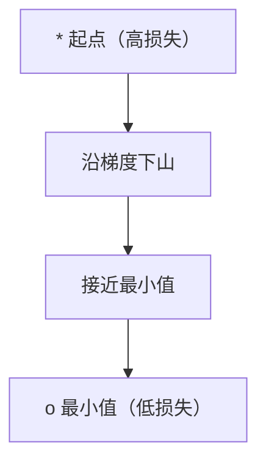
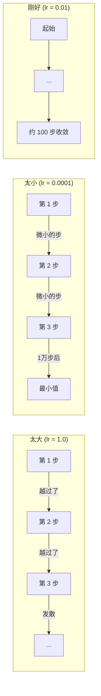
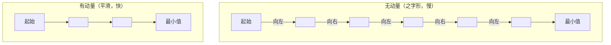
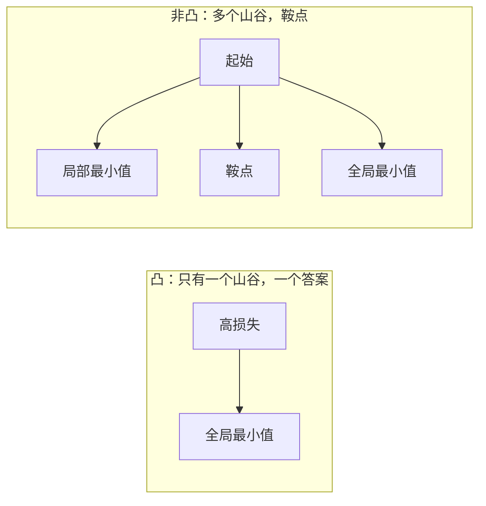
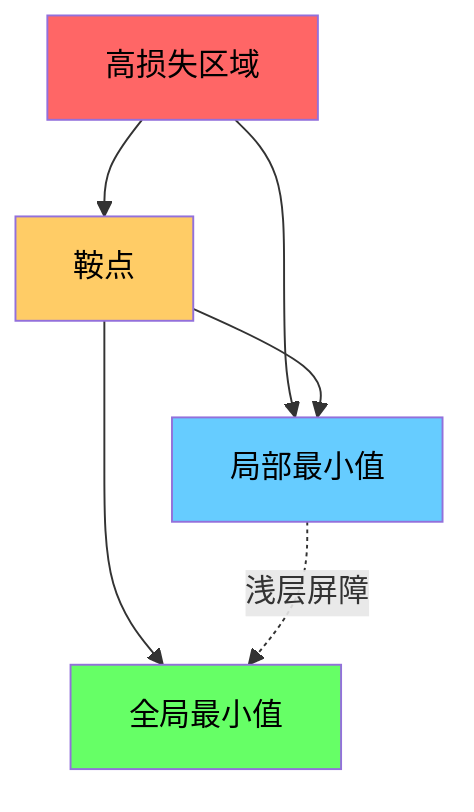

# 优化

> 训练神经网络，就是寻找山谷的底部。

**类型：** 构建
**语言：** Python
**前置要求：** 阶段一，第 04-05 课（导数、梯度）
**时间：** 约 75 分钟

## 学习目标

- 从零实现普通梯度下降、带动量的 SGD 和 Adam
- 在 Rosenbrock 函数上比较优化器收敛效果，并解释 Adam 如何实现每个权重自适应学习率
- 区分凸函数与非凸损失曲面，解释高维空间中鞍点的作用
- 配置学习率衰减策略（阶梯衰减、余弦退火、预热）以保证训练稳定性

## 问题

你有一个损失函数，它告诉你模型有多错。你有梯度，它们告诉你哪个方向会让损失变大。现在你需要一种策略来下山。

朴素的做法很简单：沿梯度的反方向移动，用一个叫做学习率的数字缩放步长，然后重复。这就是梯度下降，而且它确实有效。但"有效"是有条件的。学习率太大，你会越过山谷，在墙壁之间弹跳。学习率太小，你会在数万步的不必要过程中缓慢爬向答案。遇到鞍点就会停止移动，尽管你还没有找到最小值。

深度学习中每一个优化器都在回答同一个问题：如何更快、更可靠地到达山谷底部？

## 概念

### 优化的含义

优化是找到使函数最小（或最大）的输入值。在机器学习中，这个函数就是损失，输入就是模型的权重。训练就是优化。

```
最小化 L(w)，其中：
  L = 损失函数
  w = 模型权重（可能有数百万个参数）
```

### 梯度下降（普通版）

最简单的优化器。计算损失关于每个权重的梯度，然后将每个权重沿梯度的反方向移动，用学习率缩放步长。

```
w = w - lr * gradient
```

这就是整个算法。一行代码。



### 学习率：最重要的超参数

学习率控制步长。它决定了收敛的一切。



没有公式可以计算出正确的学习率。你通过实验来找到它。常见的起点：Adam 用 0.001，带动量的 SGD 用 0.01。

### SGD vs 批量 vs 小批量

普通梯度下降在采取一步之前要计算整个数据集的梯度。这叫批量梯度下降。它稳定但慢。

随机梯度下降（SGD）对单个随机样本计算梯度，然后立即迈出一步。它嘈杂但快。

小批量梯度下降介于两者之间。计算一个小批量（32、64、128、256 个样本）的梯度，然后迈出一步。这是实际上每个人都在使用的方法。

| 变体 | 批量大小 | 梯度质量 | 每步速度 | 噪声 |
|------|---------|---------|---------|------|
| 批量 GD | 整个数据集 | 精确 | 慢 | 无 |
| SGD | 1 个样本 | 噪声大 | 快 | 高 |
| 小批量 | 32-256 | 良好估计 | 平衡 | 中等 |

SGD 和小批量中的噪声不是缺陷。它帮助跳出浅层局部最小值和鞍点。

### 动量：滚下山坡的球

普通梯度下降只看当前梯度。如果梯度之字形前进（在狭窄山谷中很常见），进展就会很慢。动量通过将历史梯度累积到速度项来解决这个问题。

```
v = beta * v + gradient
w = w - lr * v
```

类比：一个球滚下山坡。它不会在每个凸起处停下来再启动。它在一致的方向上建立速度，抑制振荡。



`beta`（通常为 0.9）控制保留多少历史记录。beta 越高，动量越大，路径越平滑，但对方向变化的响应越慢。

### Adam：自适应学习率

不同的权重需要不同的学习率。一个很少得到大梯度的权重，在终于得到时应该迈更大的步。一个不断得到大梯度的权重应该迈更小的步。

Adam（自适应矩估计）追踪每个权重的两个量：

1. 一阶矩（m）：梯度的移动平均值（类似于动量）
2. 二阶矩（v）：梯度平方的移动平均值（梯度幅度）

```
m = beta1 * m + (1 - beta1) * gradient
v = beta2 * v + (1 - beta2) * gradient^2

m_hat = m / (1 - beta1^t)    偏置修正
v_hat = v / (1 - beta2^t)    偏置修正

w = w - lr * m_hat / (sqrt(v_hat) + epsilon)
```

除以 `sqrt(v_hat)` 是关键洞察。大梯度的权重被一个大数除（有效步长小）。小梯度的权重被一个小数除（有效步长大）。每个权重都有自己自适应的学习率。

默认超参数：`lr=0.001, beta1=0.9, beta2=0.999, epsilon=1e-8`。这些默认值在大多数问题上效果良好。

### 学习率衰减策略

固定学习率是一种妥协。训练早期，你想迈大步以快速取得进展。训练后期，你想迈小步以在最小值附近微调。

常见策略：

| 策略 | 公式 | 适用场景 |
|------|------|---------|
| 阶梯衰减 | lr = lr * factor 每 N 个 epoch | 简单，手动控制 |
| 指数衰减 | lr = lr_0 * decay^t | 平滑衰减 |
| 余弦退火 | lr = lr_min + 0.5 * (lr_max - lr_min) * (1 + cos(pi * t / T)) | Transformer、现代训练 |
| 预热 + 衰减 | 线性预热，然后衰减 | 大模型，防止早期不稳定 |

### 凸函数 vs 非凸函数

凸函数只有一个最小值。梯度下降总是能找到它。像 `f(x) = x^2` 这样的二次函数是凸的。

神经网络损失函数是非凸的。它们有很多局部最小值、鞍点和平坦区域。



实际上，高维神经网络中的局部最小值很少是问题。大多数局部最小值的损失值接近全局最小值。鞍点（在某些方向平坦，在其他方向弯曲）才是真正的障碍。动量和来自小批量的噪声帮助跳出它们。

### 损失曲面可视化

损失是所有权重的函数。对于一个有一百万个权重的模型，损失曲面存在于 1,000,001 维空间中。我们通过在权重空间中选取两个随机方向并沿这些方向绘制损失来可视化它，从而生成一个 2D 曲面。



尖锐的最小值泛化差。平坦的最小值泛化好。这是带动量的 SGD 在最终测试准确率上经常优于 Adam 的原因之一：它的噪声防止陷入尖锐的最小值。

## 构建

### 步骤 1：定义测试函数

Rosenbrock 函数是一个经典的优化基准。它的最小值在 (1, 1)，位于一个易于找到但难以跟随的狭窄弯曲山谷中。

```
f(x, y) = (1 - x)^2 + 100 * (y - x^2)^2
```

```python
def rosenbrock(params):
    x, y = params
    return (1 - x) ** 2 + 100 * (y - x ** 2) ** 2

def rosenbrock_gradient(params):
    x, y = params
    df_dx = -2 * (1 - x) + 200 * (y - x ** 2) * (-2 * x)
    df_dy = 200 * (y - x ** 2)
    return [df_dx, df_dy]
```

### 步骤 2：普通梯度下降

```python
class GradientDescent:
    def __init__(self, lr=0.001):
        self.lr = lr

    def step(self, params, grads):
        return [p - self.lr * g for p, g in zip(params, grads)]
```

### 步骤 3：带动量的 SGD

```python
class SGDMomentum:
    def __init__(self, lr=0.001, momentum=0.9):
        self.lr = lr
        self.momentum = momentum
        self.velocity = None

    def step(self, params, grads):
        if self.velocity is None:
            self.velocity = [0.0] * len(params)
        self.velocity = [
            self.momentum * v + g
            for v, g in zip(self.velocity, grads)
        ]
        return [p - self.lr * v for p, v in zip(params, self.velocity)]
```

### 步骤 4：Adam

```python
class Adam:
    def __init__(self, lr=0.001, beta1=0.9, beta2=0.999, epsilon=1e-8):
        self.lr = lr
        self.beta1 = beta1
        self.beta2 = beta2
        self.epsilon = epsilon
        self.m = None
        self.v = None
        self.t = 0

    def step(self, params, grads):
        if self.m is None:
            self.m = [0.0] * len(params)
            self.v = [0.0] * len(params)

        self.t += 1

        self.m = [
            self.beta1 * m + (1 - self.beta1) * g
            for m, g in zip(self.m, grads)
        ]
        self.v = [
            self.beta2 * v + (1 - self.beta2) * g ** 2
            for v, g in zip(self.v, grads)
        ]

        m_hat = [m / (1 - self.beta1 ** self.t) for m in self.m]
        v_hat = [v / (1 - self.beta2 ** self.t) for v in self.v]

        return [
            p - self.lr * mh / (vh ** 0.5 + self.epsilon)
            for p, mh, vh in zip(params, m_hat, v_hat)
        ]
```

### 步骤 5：运行和比较

```python
def optimize(optimizer, func, grad_func, start, steps=5000):
    params = list(start)
    history = [params[:]]
    for _ in range(steps):
        grads = grad_func(params)
        params = optimizer.step(params, grads)
        history.append(params[:])
    return history

start = [-1.0, 1.0]

gd_history = optimize(GradientDescent(lr=0.0005), rosenbrock, rosenbrock_gradient, start)
sgd_history = optimize(SGDMomentum(lr=0.0001, momentum=0.9), rosenbrock, rosenbrock_gradient, start)
adam_history = optimize(Adam(lr=0.01), rosenbrock, rosenbrock_gradient, start)

for name, history in [("GD", gd_history), ("SGD+M", sgd_history), ("Adam", adam_history)]:
    final = history[-1]
    loss = rosenbrock(final)
    print(f"{name:6s} -> x={final[0]:.6f}, y={final[1]:.6f}, loss={loss:.8f}")
```

期望输出：Adam 收敛最快。带动量的 SGD 沿着更平滑的路径。普通 GD 在狭窄山谷中进展缓慢。

## 应用

实际上，使用 PyTorch 或 JAX 的优化器。它们处理参数组、权重衰减、梯度裁剪和 GPU 加速。

```python
import torch

model = torch.nn.Linear(784, 10)

sgd = torch.optim.SGD(model.parameters(), lr=0.01, momentum=0.9)
adam = torch.optim.Adam(model.parameters(), lr=0.001)
adamw = torch.optim.AdamW(model.parameters(), lr=0.001, weight_decay=0.01)

scheduler = torch.optim.lr_scheduler.CosineAnnealingLR(adam, T_max=100)
```

经验法则：

- 从 Adam 开始（lr=0.001）。它对大多数问题有效，不需要调参。
- 当你需要最佳最终准确率且愿意花更多时间调参时，切换到带动量的 SGD（lr=0.01，momentum=0.9）。
- Transformer 用 AdamW（带解耦权重衰减的 Adam）。
- 训练超过几个 epoch 时，始终使用学习率衰减策略。
- 如果训练不稳定，减小学习率。如果训练太慢，增大学习率。

## 发布

本课生成一个用于选择正确优化器的提示词。参见 `outputs/prompt-optimizer-guide.md`。

这里构建的优化器类在第三阶段从头训练神经网络时会再次出现。

## 练习

1. **学习率扫描。** 用学习率 [0.0001, 0.0005, 0.001, 0.005, 0.01] 在 Rosenbrock 函数上运行普通梯度下降。每个学习率在 5000 步后打印或绘制最终损失。找出仍然能收敛的最大学习率。

2. **动量比较。** 用动量值 [0.0, 0.5, 0.9, 0.99] 在 Rosenbrock 函数上运行带动量的 SGD。追踪每一步的损失。哪个动量值收敛最快？哪个会越过（overshoot）？

3. **鞍点逃脱。** 定义函数 `f(x, y) = x^2 - y^2`（原点处有一个鞍点）。从 (0.01, 0.01) 开始。比较普通 GD、带动量的 SGD 和 Adam 的行为。哪个能逃出鞍点？

4. **实现学习率衰减。** 给 GradientDescent 类添加指数衰减策略：`lr = lr_0 * 0.999^step`。在 Rosenbrock 函数上比较有衰减和无衰减的收敛效果。

## 关键术语

| 术语 | 人们怎么说 | 实际含义 |
|------|----------|---------|
| 梯度下降 | "下山" | 通过减去按学习率缩放的梯度来更新权重。最基本的优化器。 |
| 学习率 | "步长" | 控制每次更新将权重移动多远的标量。太大会导致发散，太小会浪费计算。 |
| 动量 | "保持滚动" | 将历史梯度累积到速度向量中。抑制振荡，加速在一致方向上的移动。 |
| SGD | "随机采样" | 随机梯度下降。在随机子集上计算梯度而非整个数据集。实际上几乎总是指小批量 SGD。 |
| 小批量 | "一块数据" | 用于估计梯度的一小部分训练数据（32-256 个样本）。平衡速度和梯度准确性。 |
| Adam | "默认优化器" | 自适应矩估计。追踪梯度和梯度平方的每个权重移动平均值，为每个权重提供自己的学习率。 |
| 偏置修正 | "修正冷启动" | Adam 的一阶和二阶矩初始化为零。偏置修正除以 (1 - beta^t) 以补偿早期步骤。 |
| 学习率衰减策略 | "随时间改变 lr" | 在训练期间调整学习率的函数。早期大步，后期小步。 |
| 凸函数 | "一个山谷" | 任何局部最小值都是全局最小值的函数。梯度下降总是能找到它。神经网络损失不是凸的。 |
| 鞍点 | "平坦但不是最小值" | 梯度为零但在某些方向是最小值在其他方向是最大值的点。在高维空间中很常见。 |
| 损失曲面 | "地形" | 损失函数在权重空间上的图像。通过沿两个随机方向切片来可视化。 |
| 收敛 | "到达了" | 优化器到达了一个点，进一步的步骤不会显著减少损失。 |

## 延伸阅读

- [Sebastian Ruder: 梯度下降优化算法综述](https://ruder.io/optimizing-gradient-descent/) — 所有主要优化器的全面综述
- [Why Momentum Really Works (Distill)](https://distill.pub/2017/momentum/) — 动量动力学的交互式可视化
- [Adam: A Method for Stochastic Optimization (Kingma & Ba, 2014)](https://arxiv.org/abs/1412.6980) — 原始 Adam 论文，可读且简短
- [Visualizing the Loss Landscape of Neural Nets (Li et al., 2018)](https://arxiv.org/abs/1712.09913) — 展示尖锐 vs 平坦最小值的论文