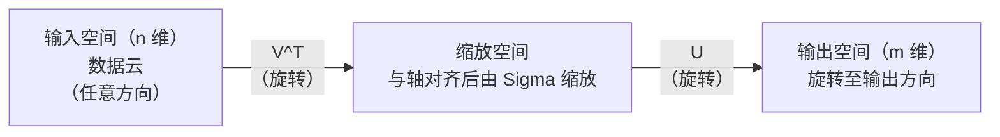
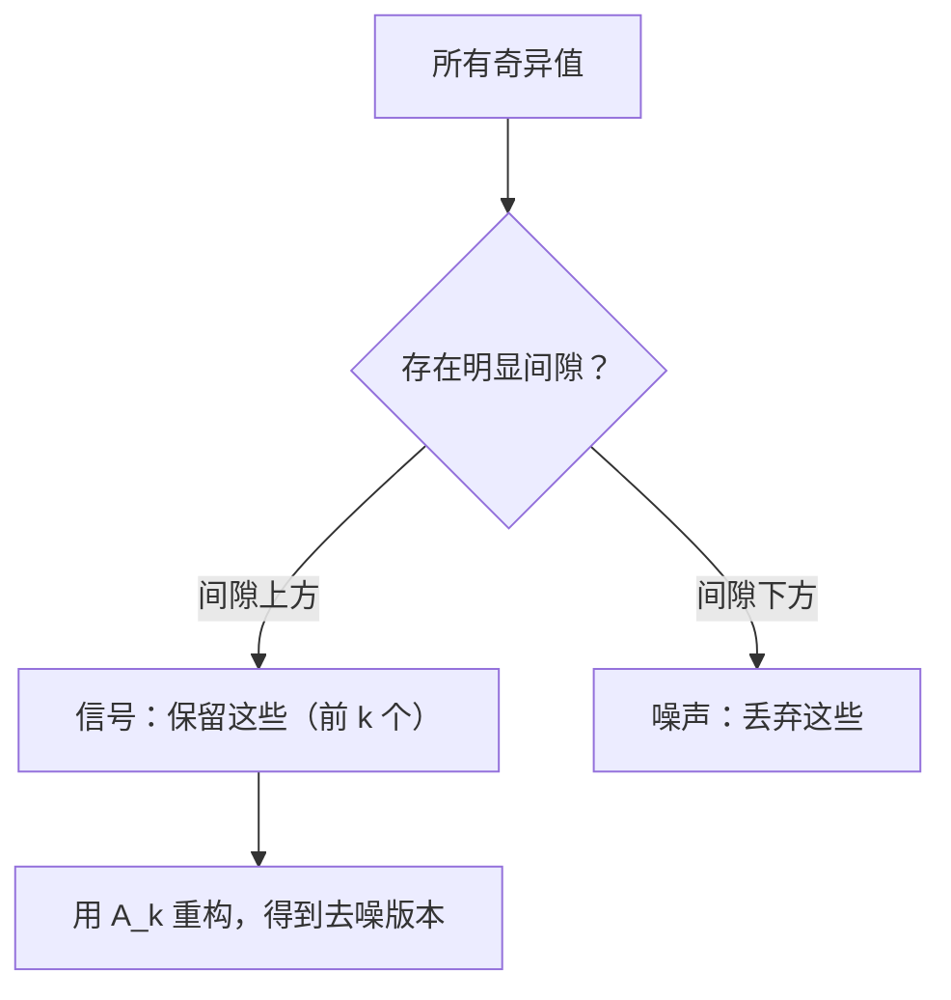

# 奇异值分解

> SVD 是线性代数中的瑞士军刀。每个矩阵都有一个。每个数据科学家都需要它。

**类型：** 构建
**语言：** Python、Julia
**前置要求：** Phase 1，课程 01（线性代数直觉）、02（向量与矩阵运算）、03（矩阵变换）
**时间：** 约 120 分钟

## 学习目标

- 通过幂迭代实现 SVD，并解释 U、Sigma 和 V^T 的几何含义
- 应用截断 SVD 进行图像压缩，并测量压缩率与重构误差的关系
- 通过 SVD 计算 Moore-Penrose 伪逆，以求解超定最小二乘系统
- 关联 SVD 与 PCA、推荐系统（隐因子）以及 NLP 中的潜在语义分析

## 问题背景

你有一个 1000×2000 的矩阵。它可能是用户-电影评分矩阵，可能是文档-词频表，也可能是图像的像素值。你需要压缩它、去噪、发现隐藏结构，或者用它来求解最小二乘系统。特征分解只能作用于方阵，而且要求矩阵拥有一组线性无关的特征向量。

SVD 可以作用于任意矩阵——任意形状、任意秩，无任何条件。它将矩阵分解为三个因子，揭示了矩阵对空间所做的几何操作。这是线性代数中最通用、最有用的分解方式。

## 核心概念

### SVD 的几何含义

任意矩阵，无论形状如何，都依次执行三个操作：旋转、缩放、旋转。SVD 将这一分解显式地表达出来。

```
A = U * Sigma * V^T

      m × n     m × m    m × n    n × n
     (任意)    (旋转)   (缩放)   (旋转)
```

对于任意矩阵 A，SVD 将其分解为：
- V^T 在输入空间（n 维）中旋转向量
- Sigma 沿各轴进行缩放（拉伸或压缩）
- U 将结果旋转到输出空间（m 维）



可以这样理解：你把一个矩阵交给 SVD，它告诉你："这个矩阵接收一个球面输入，首先用 V^T 将其旋转，然后用 Sigma 将其拉伸成椭球，最后用 U 旋转椭球。"奇异值就是椭球各轴的长度。

### 完整分解

对于形状为 m×n 的矩阵 A：

```
A = U * Sigma * V^T

其中：
  U     为 m×m，正交矩阵（U^T U = I）
  Sigma 为 m×n，对角矩阵（奇异值在对角线上）
  V     为 n×n，正交矩阵（V^T V = I）

奇异值满足 sigma_1 >= sigma_2 >= ... >= sigma_r > 0
其中 r = rank(A)
```

U 的列称为左奇异向量，V 的列称为右奇异向量，Sigma 对角线上的元素称为奇异值。奇异值始终非负，习惯上按递减顺序排列。

### 左奇异向量、奇异值、右奇异向量

SVD 的每个组成部分都有独特的几何含义。

**右奇异向量（V 的列）：** 构成输入空间（ℝ^n）的一组标准正交基。它们是将输入空间的方向映射到输出空间中正交方向的方向向量。可以将其视为定义域的自然坐标系。

**奇异值（Sigma 的对角线）：** 缩放因子。第 i 个奇异值告诉你矩阵沿第 i 个右奇异向量方向拉伸多少。奇异值为零意味着矩阵将该方向完全压扁。

**左奇异向量（U 的列）：** 构成输出空间（ℝ^m）的一组标准正交基。第 i 个左奇异向量是第 i 个右奇异向量（在缩放后）映射到的输出空间方向。

它们之间的关系：

```
A * v_i = sigma_i * u_i

矩阵 A 取第 i 个右奇异向量 v_i，
按 sigma_i 进行缩放，然后映射到第 i 个左奇异向量 u_i。
```

这给了你任意矩阵作用的逐坐标描述。

### 外积形式

SVD 可以写成秩一矩阵之和：

```
A = sigma_1 * u_1 * v_1^T + sigma_2 * u_2 * v_2^T + ... + sigma_r * u_r * v_r^T

每一项 sigma_i * u_i * v_i^T 是一个秩一矩阵（外积）。
完整的矩阵是 r 个这样的矩阵之和，其中 r 是秩。
```

这一形式是低秩逼近的基础。每一项增加一层结构。第一项捕获最重要的模式，第二项捕获次重要的，依此类推。在任意给定秩下，截断这个和就得到该秩下的最佳逼近。

```
秩-1 近似：   A_1 = sigma_1 * u_1 * v_1^T
              （捕获主要模式）

秩-2 近似：   A_2 = sigma_1 * u_1 * v_1^T + sigma_2 * u_2 * v_2^T
              （捕获两个最重要的模式）

秩-k 近似：   A_k = 前 k 项之和
              （由 Eckart-Young 定理保证最优）
```

### 与特征分解的关系

SVD 与特征分解有着深刻的联系。A 的奇异值和奇异向量直接来自 A^T A 和 A A^T 的特征值和特征向量。

```
A^T A = V * Sigma^T * U^T * U * Sigma * V^T
      = V * Sigma^T * Sigma * V^T
      = V * D * V^T

其中 D = Sigma^T * Sigma，是对角矩阵，对角线上是 sigma_i^2。

因此：
- 右奇异向量（V）是 A^T A 的特征向量
- 奇异值的平方（sigma_i^2）是 A^T A 的特征值

同样地：
A A^T = U * Sigma * V^T * V * Sigma^T * U^T
      = U * Sigma * Sigma^T * U^T

因此：
- 左奇异向量（U）是 A A^T 的特征向量
- A A^T 的特征值也是 sigma_i^2
```

这一联系告诉我们三件事：
1. 奇异值始终是实数且非负（因为它是半正定矩阵特征值的平方根）。
2. 可以通过 A^T A 的特征分解来计算 SVD，但这会使条件数平方并损失数值精度。专用的 SVD 算法避免了这一问题。
3. 当 A 是方阵且对称半正定时，SVD 与特征分解相同。

### 截断 SVD：低秩逼近

Eckart-Young-Mirsky 定理指出，在 Frobenius 范数和谱范数下，对 A 的最佳秩-k 逼近是保留前 k 个奇异值及其对应向量：

```
A_k = U_k * Sigma_k * V_k^T

其中：
  U_k     为 m×k（U 的前 k 列）
  Sigma_k 为 k×k（Sigma 左上角的 k×k 块）
  V_k     为 n×k（V 的前 k 列）

逼近误差 = sigma_{k+1}（谱范数）
          = sqrt(sigma_{k+1}^2 + ... + sigma_r^2)（Frobenius 范数）
```

这不仅仅是"一个不错的"近似。它是秩 k 的最佳可能近似。没有其他秩-k 矩阵更接近 A。

| 分量 | 相对大小 | 秩-3 近似中是否保留？ |
|------|---------|--------------------|
| sigma_1 | 最大 | 是 |
| sigma_2 | 大 | 是 |
| sigma_3 | 中大 | 是 |
| sigma_4 | 中等 | 否（误差） |
| sigma_5 | 中小 | 否（误差） |
| sigma_6 | 小 | 否（误差） |
| sigma_7 | 很小 | 否（误差） |
| sigma_8 | 微小 | 否（误差） |

保留前 3 个：A_3 捕获三个最大的奇异值。误差 = 其余值（sigma_4 到 sigma_8）。

如果奇异值衰减很快，较小的 k 就能捕获大部分矩阵信息。如果衰减很慢，则矩阵没有低秩结构。

### 用 SVD 进行图像压缩

灰度图像是像素强度的矩阵。800×600 的图像有 480,000 个值。SVD 可以用少得多的值来逼近它。

```
原始图像：800 × 600 = 480,000 个值

秩 k 的 SVD：
  U_k：     800 × k 个值
  Sigma_k： k 个值
  V_k：     600 × k 个值
  总计：    k × (800 + 600 + 1) = k × 1401 个值

  k=10：   14,010 个值   （原始的 2.9%）
  k=50：   70,050 个值  （原始的 14.6%）
  k=100： 140,100 个值  （原始的 29.2%）

  k 越小压缩率越高，
  但视觉质量会下降。
```

关键洞见：自然图像的奇异值衰减很快。前几个奇异值捕获整体结构（形状、梯度）。后面的奇异值捕获细节和噪声。在秩 50 处截断通常产生与原始图像几乎无法区分的图像，同时节省 85% 的存储空间。

### SVD 用于推荐系统

Netflix 大赛使这一方法闻名。你有一个用户-电影评分矩阵，其中大多数条目是缺失的。

```
             电影1  电影2  电影3  电影4  电影5
  用户1      [  5      ?       3       ?       1  ]
  用户2      [  ?      4       ?       2       ?  ]
  用户3      [  3      ?       5       ?       ?  ]
  用户4      [  ?      ?       ?       4       3  ]

  ? = 未知评分
```

其思想是：这个评分矩阵具有低秩。用户并不是完全独立地拥有品味。只有少数几个隐因子（动作 vs 剧情、老片 vs 新片、理性 vs 感性）就能解释大部分偏好。

对（填充后的）评分矩阵进行 SVD，将其分解为：
- U：隐因子空间中的用户画像
- Sigma：各隐因子的重要性
- V^T：隐因子空间中的电影画像

用户对电影的预测评分是其用户画像与电影画像的点积（按奇异值加权）。低秩近似填充了缺失的条目。

在实践中，你需要使用处理缺失数据的变体，如 Simon Funk 的增量 SVD 或 ALS（交替最小二乘）。但核心思想是相同的：基于 SVD 的隐因子分解。

### SVD 在 NLP 中的应用：潜在语义分析

潜在语义分析（LSA），也称潜在语义索引（LSI），将 SVD 应用于词-文档矩阵。

```
             文档1  文档2  文档3  文档4
  "cat"      [  3      0      1      0  ]
  "dog"      [  2      0      0      1  ]
  "fish"     [  0      4      1      0  ]
  "pet"      [  1      1      1      1  ]
  "ocean"    [  0      3      0      0  ]

  秩 k=2 的 SVD 之后：

  每个文档成为 2D"概念空间"中的一个点。
  每个词成为同一 2D 空间中的一个点。
  相似主题的文档聚集在一起。
  含义相似的词聚集在一起。

  "cat" 和 "dog" 最终彼此接近（陆地宠物）。
  "fish" 和 "ocean" 最终彼此接近（水相关概念）。
  如果 Doc1 和 Doc3 共享相似主题，它们会聚集在一起。
```

LSA 是最早成功从原始文本中捕获语义相似性的方法之一。它之所以有效，是因为同义词倾向于出现在相似文档中，所以 SVD 将它们分组到相同的隐维度中。现代词嵌入（Word2Vec、GloVe）可以看作是这一思想的后代。

### SVD 用于去噪

有噪数据中，信号集中在顶部奇异值上，而噪声分布在所有奇异值上。截断可以去噪。

**清洁信号奇异值：**

| 分量 | 大小 | 类型 |
|------|------|------|
| sigma_1 | 非常大 | 信号 |
| sigma_2 | 大 | 信号 |
| sigma_3 | 中等 | 信号 |
| sigma_4 | 接近零 | 可忽略 |
| sigma_5 | 接近零 | 可忽略 |

**有噪信号奇异值（噪声叠加到所有分量上）：**

| 分量 | 大小 | 类型 |
|------|------|------|
| sigma_1 | 非常大 | 信号 |
| sigma_2 | 大 | 信号 |
| sigma_3 | 中等 | 信号 |
| sigma_4 | 小 | 噪声 |
| sigma_5 | 小 | 噪声 |
| sigma_6 | 小 | 噪声 |
| sigma_7 | 小 | 噪声 |



这用于信号处理、科学测量和数据清洗。任何时候只要你有一个被加性噪声破坏的矩阵，截断 SVD 都是有原则地区分信号与噪声的方法。

### 通过 SVD 求伪逆

Moore-Penrose 伪逆 A⁺ 将矩阵求逆推广到非方阵和奇异矩阵。SVD 使其计算变得简单。

```
如果 A = U * Sigma * V^T，则：

A⁺ = V * Sigma⁺ * U^T

其中 Sigma⁺ 的构造方式为：
  1. 转置 Sigma（交换行和列）
  2. 将每个非零对角元素 sigma_i 替换为 1/sigma_i
  3. 零保持为零

对于 A（m×n）：      A⁺ 为（n×m）
对于 Sigma（m×n）：  Sigma⁺ 为（n×m）
```

伪逆可求解最小二乘问题。如果 Ax = b 无精确解（超定系统），则 x = A⁺ b 是最小二乘解（使 ‖Ax - b‖ 最小）。

```
超定系统（方程数多于未知数）：

  [1  1]         [3]
  [2  1] x   =   [5]       不存在精确解。
  [3  1]         [6]

  x_ls = A⁺ b = V * Sigma⁺ * U^T * b

  这给出使残差平方和最小的 x。
  与正规方程（A^T A）⁻¹ A^T b 的结果相同，
  但数值上更稳定。
```

### 数值稳定性优势

计算 A^T A 的特征分解会将奇异值（平方成 A^T A 的特征值）平方。这会将条件数平方，放大数值误差。

```
示例：
  A 的奇异值为 [1000, 1, 0.001]
  A 的条件数：1000 / 0.001 = 10^6

  A^T A 的特征值为 [10^6, 1, 10^{-6}]
  A^T A 的条件数：10^6 / 10^{-6} = 10^{12}

  直接计算 SVD：工作在条件数 10^6 上
  通过 A^T A 计算：工作在条件数 10^{12} 上
                 （损失 6 位额外精度）
```

现代 SVD 算法（Golub-Kahan 双对角化）直接在 A 上工作，从不显式形成 A^T A。这就是为什么你应该始终优先选择 `np.linalg.svd(A)` 而不是 `np.linalg.eig(A.T @ A)`。

### 与 PCA 的联系

PCA 就是对中心化数据的 SVD。这不是类比，而是完全相同的计算。

```
给定数据矩阵 X（n_samples × n_features），已中心化（减去均值）：

协方差矩阵：C = (1/(n-1)) * X^T X

PCA 寻找 C 的特征向量。但：

  X = U * Sigma * V^T    （X 的 SVD）

  X^T X = V * Sigma^2 * V^T

  C = (1/(n-1)) * V * Sigma^2 * V^T

因此，主成分恰好就是右奇异向量 V。
每个分量的解释方差为 sigma_i^2 / (n-1)。

在 sklearn 中，PCA 使用 SVD 实现，而非特征分解。
它更快且数值更稳定。
```

这意味着你在课程 10 中学到的关于降维的一切，在底层都是 SVD。PCA 是机器学习中最常见的 SVD 应用。

## 构建实现

### 步骤 1：使用幂迭代从零实现 SVD

原理：要找到最大的奇异值及其向量，在 A^T A（或 A A^T）上使用幂迭代。然后对矩阵进行舒张（deflate），重复以找到下一个奇异值。

```python
import numpy as np

def power_iteration(M, num_iters=100):
    n = M.shape[1]
    v = np.random.randn(n)
    v = v / np.linalg.norm(v)

    for _ in range(num_iters):
        Mv = M @ v
        v = Mv / np.linalg.norm(Mv)

    eigenvalue = v @ M @ v
    return eigenvalue, v

def svd_from_scratch(A, k=None):
    m, n = A.shape
    if k is None:
        k = min(m, n)

    sigmas = []
    us = []
    vs = []

    A_residual = A.copy().astype(float)

    for _ in range(k):
        AtA = A_residual.T @ A_residual
        eigenvalue, v = power_iteration(AtA, num_iters=200)

        if eigenvalue < 1e-10:
            break

        sigma = np.sqrt(eigenvalue)
        u = A_residual @ v / sigma

        sigmas.append(sigma)
        us.append(u)
        vs.append(v)

        A_residual = A_residual - sigma * np.outer(u, v)

    U = np.column_stack(us) if us else np.empty((m, 0))
    S = np.array(sigmas)
    V = np.column_stack(vs) if vs else np.empty((n, 0))

    return U, S, V
```

### 步骤 2：测试并与 NumPy 对比

```python
np.random.seed(42)
A = np.random.randn(5, 4)

U_ours, S_ours, V_ours = svd_from_scratch(A)
U_np, S_np, Vt_np = np.linalg.svd(A, full_matrices=False)

print("Our singular values:", np.round(S_ours, 4))
print("NumPy singular values:", np.round(S_np, 4))

A_reconstructed = U_ours @ np.diag(S_ours) @ V_ours.T
print(f"Reconstruction error: {np.linalg.norm(A - A_reconstructed):.8f}")
```

### 步骤 3：图像压缩演示

```python
def compress_image_svd(image_matrix, k):
    U, S, Vt = np.linalg.svd(image_matrix, full_matrices=False)
    compressed = U[:, :k] @ np.diag(S[:k]) @ Vt[:k, :]
    return compressed

image = np.random.seed(42)
rows, cols = 200, 300
image = np.random.randn(rows, cols)

for k in [1, 5, 10, 20, 50]:
    compressed = compress_image_svd(image, k)
    error = np.linalg.norm(image - compressed) / np.linalg.norm(image)
    original_size = rows * cols
    compressed_size = k * (rows + cols + 1)
    ratio = compressed_size / original_size
    print(f"k={k:>3d}  error={error:.4f}  storage={ratio:.1%}")
```

### 步骤 4：去噪

```python
np.random.seed(42)
clean = np.outer(np.sin(np.linspace(0, 4*np.pi, 100)),
                 np.cos(np.linspace(0, 2*np.pi, 80)))
noise = 0.3 * np.random.randn(100, 80)
noisy = clean + noise

U, S, Vt = np.linalg.svd(noisy, full_matrices=False)
denoised = U[:, :5] @ np.diag(S[:5]) @ Vt[:5, :]

print(f"Noisy error:    {np.linalg.norm(noisy - clean):.4f}")
print(f"Denoised error: {np.linalg.norm(denoised - clean):.4f}")
print(f"Improvement:    {(1 - np.linalg.norm(denoised - clean) / np.linalg.norm(noisy - clean)):.1%}")
```

### 步骤 5：伪逆

```python
A = np.array([[1, 1], [2, 1], [3, 1]], dtype=float)
b = np.array([3, 5, 6], dtype=float)

U, S, Vt = np.linalg.svd(A, full_matrices=False)
S_inv = np.diag(1.0 / S)
A_pinv = Vt.T @ S_inv @ U.T

x_svd = A_pinv @ b
x_lstsq = np.linalg.lstsq(A, b, rcond=None)[0]
x_pinv = np.linalg.pinv(A) @ b

print(f"SVD pseudoinverse solution:  {x_svd}")
print(f"np.linalg.lstsq solution:   {x_lstsq}")
print(f"np.linalg.pinv solution:    {x_pinv}")
```

## 使用方法

完整的工作演示在 `code/svd.py` 中。运行它可以看到 SVD 在图像压缩、推荐系统、潜在语义分析和去噪中的应用。

```bash
python svd.py
```

Julia 版本在 `code/svd.jl` 中，展示了如何使用 Julia 的原生 `svd()` 函数和 `LinearAlgebra` 包来演示相同的概念。

```bash
julia svd.jl
```

## 交付成果

本课程产出：
- `outputs/skill-svd.md` —— 一份技能文档，用于了解何时以及如何在实际项目中应用 SVD

## 练习

1. 不使用幂迭代，从零实现完整的 SVD。改为计算 A^T A 的特征分解以获得 V 和奇异值，然后计算 U = A V Sigma^{-1}。将数值精度与幂迭代版本及 NumPy 进行比较。

2. 加载一张真实的灰度图像（或将其转换为灰度）。在秩 1、5、10、25、50、100 处压缩。对于每个秩，计算压缩率和相对误差。找出图像在视觉上可接受所需的秩。

3. 构建一个小型推荐系统。创建一个 10×8 的用户-电影评分矩阵，其中包含一些已知条目。用行均值填充缺失条目。计算 SVD 并重构一个秩-3 近似。用重构矩阵预测缺失评分。验证预测是合理的。

4. 创建一个 100×50 的词-文档矩阵，包含 3 个合成主题。每个主题有 5 个关联词。添加噪声。应用 SVD 并验证前 3 个奇异值远大于其余的。将文档投影到 3D 隐空间中，并检查来自同一主题的文档是否聚集在一起。

5. 生成一个清洁的低秩矩阵（秩 3，大小 50×40）并在不同水平的高斯噪声下测试（sigma = 0.1、0.5、1.0、2.0）。对于每个噪声水平，通过从 1 到 40 扫描 k 并测量对清洁矩阵的重构误差，找到最优截断秩。绘制最优 k 如何随噪声水平变化。

## 核心术语

| 术语 | 通常说法 | 实际含义 |
|------|---------|---------|
| SVD | "分解任意矩阵" | 将 A 分解为 U Sigma V^T，其中 U 和 V 是正交的，Sigma 是非负对角矩阵。适用于任意形状的矩阵。 |
| 奇异值 | "该分量有多重要" | Sigma 的第 i 个对角元素。衡量矩阵沿第 i 个主方向拉伸多少。始终非负，按递减顺序排列。 |
| 左奇异向量 | "输出方向" | U 的一列。是第 i 个右奇异向量（按 sigma_i 缩放后）映射到的输出空间方向。 |
| 右奇异向量 | "输入方向" | V 的一列。是矩阵将第 i 个左奇异向量映射到的输入空间方向（按 sigma_i 缩放后）。 |
| 截断 SVD | "低秩近似" | 仅保留前 k 个奇异值及其向量。产生对原始矩阵的、冯·艾克-杨定理所保证的最佳秩-k 逼近。 |
| 秩 | "真实维度" | 非零奇异值的数量。告诉你矩阵实际使用了多少个独立方向。 |
| 伪逆 | "广义逆" | V Sigma⁺ U^T。对非零奇异值求逆，零保持为零。为非方阵或奇异矩阵求解最小二乘问题。 |
| 条件数 | "对误差的敏感程度" | sigma_max / sigma_min。大的条件数意味着输入的微小变化导致输出的大变化。SVD 直接揭示这一点。 |
| 隐因子 | "隐藏变量" | SVD 发现的低秩空间中的维度。在推荐中，隐因子可能对应类型偏好。在 NLP 中，可能对应主题。 |
| Frobenius 范数 | "矩阵总大小" | 各元素平方和的平方根。等于奇异值平方和的平方根。用于测量近似误差。 |
| Eckart-Young 定理 | "SVD 给出最佳压缩" | 对于任意目标秩 k，截断 SVD 在所有可能的秩-k 矩阵中最小化近似误差。 |
| 幂迭代 | "找最大特征向量" | 反复将随机向量乘以矩阵并归一化。收敛到最大特征值对应的特征向量。许多 SVD 算法的构建块。 |

## 拓展阅读

- [Gilbert Strang: Linear Algebra and Its Applications, Chapter 7](https://math.mit.edu/~gs/linearalgebra/) — SVD 的详尽处理与应用
- [3Blue1Brown: But what is the SVD?](https://www.youtube.com/watch?v=vSczTbgc8Rc) — SVD 的几何直觉
- [We Recommend a Singular Value Decomposition](https://www.ams.org/publicoutreach/feature-column/fcarc-svd) — 美国数学学会的易读概述
- [Netflix Prize and Matrix Factorization](https://sifter.org/~simon/journal/20061211.html) — Simon Funk 关于 SVD 用于推荐的原始博文
- [Latent Semantic Analysis](https://en.wikipedia.org/wiki/latent_semantic_analysis) — SVD 的原始 NLP 应用
- [Numerical Linear Algebra by Trefethen and Bau](https://people.maths.ox.ac.uk/trefethen/text.html) — 理解 SVD 算法及其数值性质的权威参考