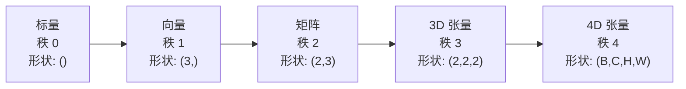
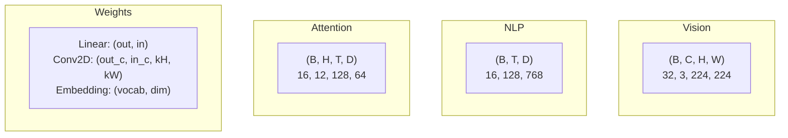
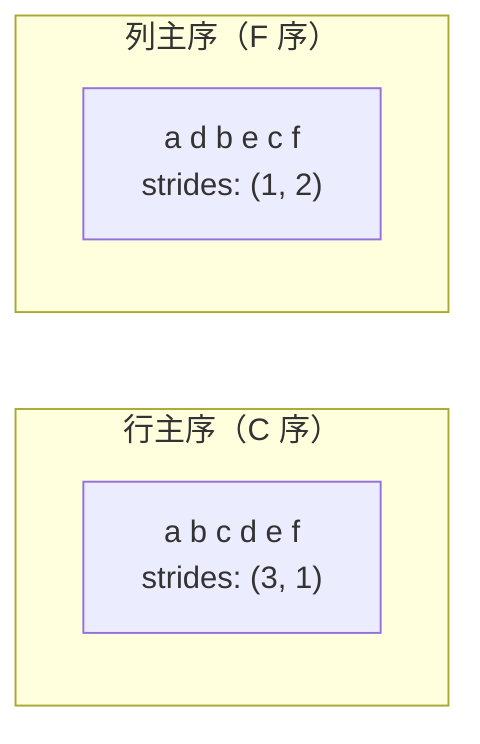
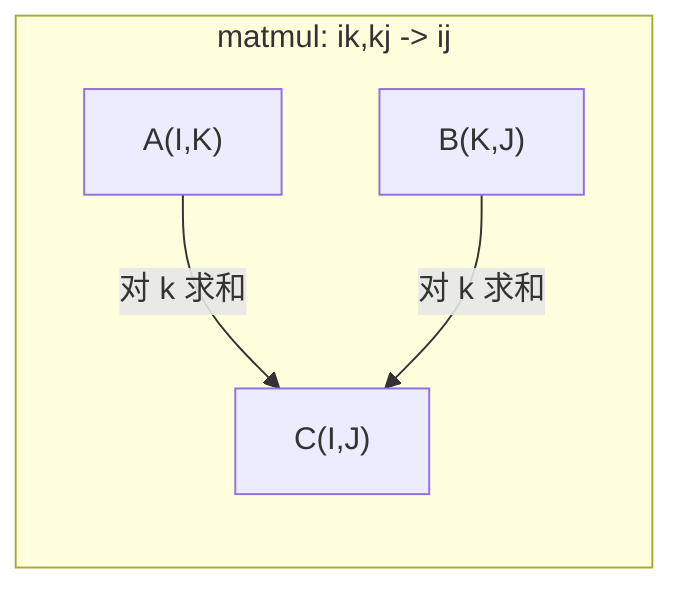

# 张量运算

> 张量是数据与深度学习之间的通用语言。每张图像、每句话、每个梯度都流经它们。

**类型：** 构建
**语言：** Python
**前置要求：** Phase 1，课程 01（线性代数直觉）、02（向量、矩阵与运算）
**时间：** 约 90 分钟

## 学习目标

- 从零实现一个带有 shape、stride、reshape、transpose 和逐元素运算的张量类
- 应用广播规则，在不复制数据的情况下对不同形状的张量进行运算
- 编写 einsum 表达式以实现点积、矩阵乘法、外积和批处理操作
- 追踪多头注意力中每一步的精确张量形状

## 问题背景

你构建了一个 transformer。前向传播看起来很干净。运行后得到：`RuntimeError: mat1 and mat2 shapes cannot be multiplied (32x768 and 512x768)`。你盯着形状看，尝试转置。现在它说 `Expected 4D input (got 3D input)`。你加了一个 unsqueeze，然后别的又出问题了。

形状错误是深度学习代码中最常见的 bug。它们在概念上并不难——每个操作都有形状契约——但它们传播很快。一个 transformer 有几十个 reshape、transpose 和 broadcast 链在一起。一个轴错了，错误就会级联。更糟的是，有些形状错误根本不会抛出错误。它们通过在错误的维度上广播或对错误的轴求和悄悄地产生垃圾结果。

矩阵处理两组事物之间的成对关系。真实数据不适合二维。一批 32 张 224×224 的 RGB 图像是一个 4D 张量：`(32, 3, 224, 224)`。带 12 个头的自注意力也是 4D：`(batch, heads, seq_len, head_dim)`。你需要一种数据结构，能推广到任意维度，且其运算在所有维度上都能干净地组合。这个结构就是张量。掌握它的运算，形状错误变得 trivially debuggable。

## 核心概念

### 什么是张量

张量是具有统一数据类型的多维数字数组。维数称为**秩**（或**阶**）。每个维度是一个**轴**。**形状**是一个元组，列出每个轴的大小。



总元素数 = 所有维度的乘积。形状 `(2, 3, 4)` 包含 `2 * 3 * 4 = 24` 个元素。

### 深度学习中的张量形状

不同数据类型按惯例映射到特定张量形状。



PyTorch 使用 NCHW（通道在前）。TensorFlow 默认使用 NHWC（通道在后）。布局不匹配会导致静默减速或错误。

### 内存布局的工作原理

内存中的 2D 数组是一维字节序列。**步幅（stride）** 告诉你沿每个轴移动一步需要跳过多少个元素。



转置不移动数据。它交换步幅，使张量变得**非连续**——一行的元素在内存中不再相邻。

### 广播规则

广播让你在不复制数据的情况下对不同形状的张量进行运算。从右对齐形状。两个维度兼容的条件是相等或其中一个为 1。维度较少的张量在左边填充 1。

```
张量 A：     (8, 1, 6, 1)
张量 B：        (7, 1, 5)
填充后的 B： (1, 7, 1, 5)
结果：       (8, 7, 6, 5)
```

### Einsum：通用张量运算

爱因斯坦求和约定用字母标记每个轴。出现在输入中但不在输出中的轴会被求和。出现在两者中的轴会被保留。



关键模式：`i,i->`（点积）、`i,j->ij`（外积）、`ii->`（迹）、`ij->ji`（转置）、`bij,bjk->bik`（批矩阵乘）、`bhtd,bhsd->bhts`（注意力分数）。

## 构建实现

代码在 `code/tensors.py` 中。每个步骤都参考其中的实现。

### 步骤 1：张量存储和步幅

张量存储一个扁平数字列表加上形状元数据。步幅告诉索引逻辑如何将多维索引映射到扁平位置。

```python
class Tensor:
    def __init__(self, data, shape=None):
        if isinstance(data, (list, tuple)):
            self._data, self._shape = self._flatten_nested(data)
        elif isinstance(data, np.ndarray):
            self._data = data.flatten().tolist()
            self._shape = tuple(data.shape)
        else:
            self._data = [data]
            self._shape = ()

        if shape is not None:
            total = reduce(lambda a, b: a * b, shape, 1)
            if total != len(self._data):
                raise ValueError(
                    f"Cannot reshape {len(self._data)} elements into shape {shape}"
                )
            self._shape = tuple(shape)

        self._strides = self._compute_strides(self._shape)

    @staticmethod
    def _compute_strides(shape):
        if len(shape) == 0:
            return ()
        strides = [1] * len(shape)
        for i in range(len(shape) - 2, -1, -1):
            strides[i] = strides[i + 1] * shape[i + 1]
        return tuple(strides)
```

对于形状 `(3, 4)`，步幅是 `(4, 1)`——前进一行跳过 4 个元素，前进一列跳过 1 个元素。

### 步骤 2：Reshape、squeeze、unsqueeze

Reshape 改变形状但不改变元素顺序。元素总数必须保持不变。使用 `-1` 让一个维度自动推断其大小。

```python
t = Tensor(list(range(12)), shape=(2, 6))
r = t.reshape((3, 4))
r = t.reshape((-1, 3))
```

Squeeze 移除大小为 1 的轴。Unsqueeze 插入一个。在广播中，unsqueeze 至关重要——偏置向量 `(D,)` 添加到批 `(B, T, D)` 需要 unsqueeze 到 `(1, 1, D)`。

```python
t = Tensor(list(range(6)), shape=(1, 3, 1, 2))
s = t.squeeze()
v = Tensor([1, 2, 3])
u = v.unsqueeze(0)
```

### 步骤 3：Transpose 和 permute

Transpose 交换两个轴。Permute 重排所有轴。这是你在 NCHW 和 NHWC 之间转换的方式。

```python
mat = Tensor(list(range(6)), shape=(2, 3))
tr = mat.transpose(0, 1)

t4d = Tensor(list(range(24)), shape=(1, 2, 3, 4))
perm = t4d.permute((0, 2, 3, 1))
```

转置或 permute 后，张量在内存中是非连续的。在 PyTorch 中，`view` 在非连续张量上会失败——先调用 `.contiguous()` 或使用 `.reshape`。

### 步骤 4：逐元素运算和归约

逐元素运算（加、乘、减）独立应用于每个元素并保持形状。归约（sum、mean、max）折叠一个或多个轴。

```python
a = Tensor([[1, 2], [3, 4]])
b = Tensor([[10, 20], [30, 40]])
c = a + b
d = a * 2
s = a.sum(axis=0)
```

CNN 中的全局平均池化：`(B, C, H, W).mean(axis=[2, 3])` 产生 `(B, C)`。NLP 中的序列平均池化：`(B, T, D).mean(axis=1)` 产生 `(B, D)`。

### 步骤 5：使用 NumPy 进行广播

`tensors.py` 中的 `demo_broadcasting_numpy()` 函数展示了核心模式。

```python
activations = np.random.randn(4, 3)
bias = np.array([0.1, 0.2, 0.3])
result = activations + bias

images = np.random.randn(2, 3, 4, 4)
scale = np.array([0.5, 1.0, 1.5]).reshape(1, 3, 1, 1)
result = images * scale

a = np.array([1, 2, 3]).reshape(-1, 1)
b = np.array([10, 20, 30, 40]).reshape(1, -1)
outer = a * b
```

通过广播计算成对距离：将 `(M, 2)` 重整为 `(M, 1, 2)` 和 `(N, 2)` 为 `(1, N, 2)`，相减，平方，沿最后一个轴求和，取平方根。结果：`(M, N)`。

### 步骤 6：Einsum 运算

`demo_einsum()` 和 `demo_einsum_gallery()` 函数逐步讲解每个常见模式。

```python
a = np.array([1.0, 2.0, 3.0])
b = np.array([4.0, 5.0, 6.0])
dot = np.einsum("i,i->", a, b)

A = np.array([[1, 2], [3, 4], [5, 6]], dtype=float)
B = np.array([[7, 8, 9], [10, 11, 12]], dtype=float)
matmul = np.einsum("ik,kj->ij", A, B)

batch_A = np.random.randn(4, 3, 5)
batch_B = np.random.randn(4, 5, 2)
batch_mm = np.einsum("bij,bjk->bik", batch_A, batch_B)
```

收缩的计算是所有索引大小（保留的和求和的）的乘积。对于 `bij,bjk->bik` 且 B=32, I=128, J=64, K=128：`32 * 128 * 64 * 128 = 33,554,432` 次乘加运算。

### 步骤 7：通过 einsum 实现注意力机制

`demo_attention_einsum()` 函数从头到尾实现多头注意力。

```python
B, H, T, D = 2, 4, 8, 16
E = H * D

X = np.random.randn(B, T, E)
W_q = np.random.randn(E, E) * 0.02

Q = np.einsum("bte,ek->btk", X, W_q)
Q = Q.reshape(B, T, H, D).transpose(0, 2, 1, 3)

scores = np.einsum("bhtd,bhsd->bhts", Q, K) / np.sqrt(D)
weights = softmax(scores, axis=-1)
attn_output = np.einsum("bhts,bhsd->bhtd", weights, V)

concat = attn_output.transpose(0, 2, 1, 3).reshape(B, T, E)
output = np.einsum("bte,ek->btk", concat, W_o)
```

每一步都是张量运算：投影（通过 einsum 的矩阵乘法）、头分割（reshape + transpose）、注意力分数（通过 einsum 的批矩阵乘法）、加权求和（通过 einsum 的批矩阵乘法）、头合并（transpose + reshape）、输出投影（通过 einsum 的矩阵乘法）。

## 使用方法

### 从零实现 vs NumPy

| 操作 | 从零实现（Tensor 类） | NumPy |
|------|----------------------|-------|
| 创建 | `Tensor([[1,2],[3,4]])` | `np.array([[1,2],[3,4]])` |
| Reshape | `t.reshape((3,4))` | `a.reshape(3,4)` |
| Transpose | `t.transpose(0,1)` | `a.T` 或 `a.transpose(0,1)` |
| Squeeze | `t.squeeze(0)` | `np.squeeze(a, 0)` |
| Sum | `t.sum(axis=0)` | `a.sum(axis=0)` |
| Einsum | 不适用 | `np.einsum("ij,jk->ik", a, b)` |

### 从零实现 vs PyTorch

```python
import torch

t = torch.tensor([[1, 2, 3], [4, 5, 6]], dtype=torch.float32)
t.shape
t.stride()
t.is_contiguous()

t.reshape(3, 2)
t.unsqueeze(0)
t.transpose(0, 1)
t.transpose(0, 1).contiguous()

torch.einsum("ik,kj->ij", A, B)
```

PyTorch 添加了 autograd、GPU 支持和优化的 BLAS 内核。形状语义是相同的。如果你理解了从零实现的版本，PyTorch 的形状错误就变得可读了。

### 每个神经网络层作为张量运算

| 操作 | 张量形式 | Einsum |
|------|---------|--------|
| 线性层 | `Y = X @ W.T + b` | `"bd,od->bo"` + 偏置 |
| 注意力 QKV | `Q = X @ W_q` | `"btd,dh->bth"` |
| 注意力分数 | `Q @ K.T / sqrt(d)` | `"bhtd,bhsd->bhts"` |
| 注意力输出 | `softmax(scores) @ V` | `"bhts,bhsd->bhtd"` |
| 批归一化 | `(X - mu) / sigma * gamma` | 逐元素 + 广播 |
| Softmax | `exp(x) / sum(exp(x))` | 逐元素 + 归约 |

## 交付成果

本课程产生两个可复用的 prompt：

1. **`outputs/prompt-tensor-shapes.md`** —— 用于调试张量形状不匹配的系统化 prompt。包括每个常见操作（matmul、broadcast、cat、Linear、Conv2d、BatchNorm、softmax）的决策表以及修复查找表。

2. **`outputs/prompt-tensor-debugger.md`** —— 当形状错误阻塞你时，粘贴到任何 AI 助手的逐步调试 prompt。将错误信息和你的张量形状输入，它会返回确切的修复方案。

## 练习

1. **简单——Reshape 往返。** 取形状为 `(2, 3, 4)` 的张量。重整为 `(6, 4)`，然后为 `(24,)`，再回到 `(2, 3, 4)`。在每一步通过打印扁平数据来验证元素顺序被保留。

2. **中等——实现广播。** 扩展 `Tensor` 类，添加 `broadcast_to(shape)` 方法，将大小为 1 的维度扩展以匹配目标形状。然后修改 `_elementwise_op` 以在运算前自动广播。用形状 `(3, 1)` 和 `(1, 4)` 产生 `(3, 4)` 来测试。

3. **困难——从头构建 einsum。** 实现一个基本的 `einsum(subscripts, *tensors)` 函数，至少处理：点积（`i,i->`）、矩阵乘法（`ij,jk->ik`）、外积（`i,j->ij`）和转置（`ij->ji`）。解析下标字符串，识别收缩索引，循环遍历所有索引组合。将结果与 `np.einsum` 进行比较。

4. **困难——注意力形状追踪器。** 编写一个函数，以 `batch_size`、`seq_len`、`embed_dim` 和 `num_heads` 作为输入，在多头注意力的每一步打印精确形状：输入、Q/K/V 投影、头分割、注意力分数、softmax 权重、加权求和、头合并、输出投影。针对 `demo_attention_einsum()` 的输出进行验证。

## 核心术语

| 术语 | 通常说法 | 实际含义 |
|------|---------|---------|
| 张量 | "矩阵但有更多维度" | 具有统一类型和定义形状、步幅和运算的多维数组 |
| 秩 | "维数" | 轴的数量。矩阵秩为 2，不是其矩阵秩的大小 |
| 形状 | "张量的大小" | 列出每个轴大小的元组。`(2, 3)` 表示 2 行 3 列 |
| 步幅 | "内存如何布局" | 沿每个轴移动一步需要跳过的元素数 |
| 广播 | "形状不同时它就工作了" | 一套严格的规则：从右对齐，每个维度必须相等或为 1 |
| 非连续 | "张量是正常的" | 元素在内存中按逻辑布局顺序连续存储，无间隙或重排 |
| Einsum | "写 matmul 的花哨方式" | 一种通用记号，用一行表达任意张量收缩、外积、迹或转置 |
| View | "与 reshape 相同" | 共享相同内存缓冲区但具有不同形状/步幅元数据的张量。在非连续数据上失败 |
| 收缩 | "对一个索引求和" | 通用运算，其中张量之间共享的索引被乘加，产生低秩结果 |
| NCHW / NHWC | "PyTorch vs TensorFlow 格式" | 图像张量的内存布局约定。NCHW 将通道放在空间维之前，NHWC 将其放在之后 |

## 拓展阅读

- [NumPy Broadcasting](https://numpy.org/doc/stable/user/basics.broadcasting.html) — 带有可视化示例的规范规则
- [PyTorch Tensor Views](https://pytorch.org/docs/stable/tensor_view.html) — view 何时工作，何时复制
- [einops](https://github.com/arogozhnikov/einops) — 使张量重整变得可读且安全的库
- [The Illustrated Transformer](https://jalammar.github.io/illustrated-transformer/) — 可视化流经注意力的张量形状
- [Einstein Summation in NumPy](https://numpy.org/doc/stable/reference/generated/numpy.einsum.html) — 完整的 einsum 文档和示例