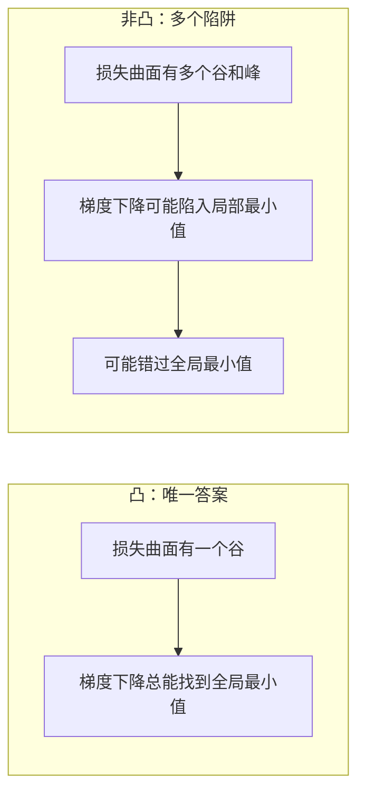
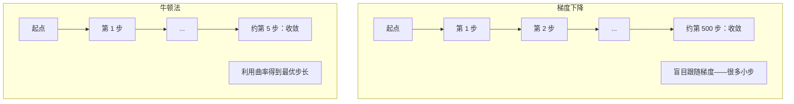
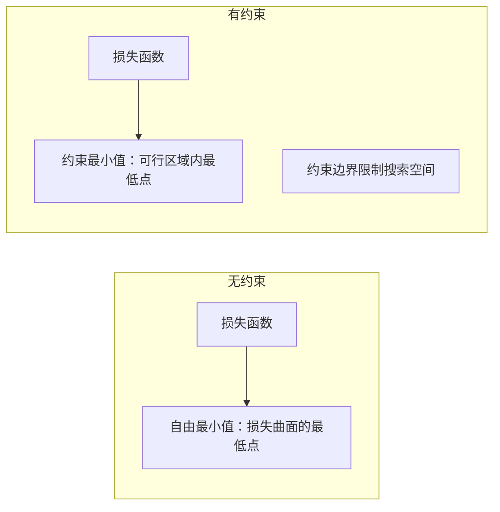
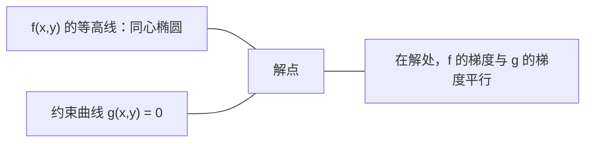

# 凸优化

> 凸问题只有一个谷。神经网络有无数个。知道它们的区别很重要。

**类型：** 构建
**语言：** Python
**前置要求：** Phase 1，课程 04（机器学习中的微积分）、08（优化）
**时间：** 约 90 分钟

## 学习目标

- 使用定义、二阶导数和 Hessian 准则测试函数是否凸
- 实现牛顿法并将其二次收敛与梯度下降进行比较
- 使用拉格朗日乘数求解约束优化问题并解释 KKT 条件
- 解释为什么神经网络损失曲面是非凸的但 SGD 仍然能找到好解

## 问题所在

课程 08 教了你梯度下降、动量和 Adam。那些优化器在任何曲面上向下走。但它们没有任何保证。在非凸曲面上，梯度下降可能陷入坏的局部最小值、卡在鞍点，或永远振荡。你还是用了它，因为神经网络是非凸的，没有替代方案。

但机器学习中的许多问题是凸的。线性回归、逻辑回归、SVM、LASSO、岭回归。对于这些，存在更强的东西：带数学保证的优化。凸问题只有一个谷。任何向下走的算法都会达到全局最小值。不需要重启。不需要学习率调度。不需要祈祷。

理解凸性有三个作用。第一，它告诉你问题容易（凸）还是难（非凸）。第二，它给你更快的工具，如牛顿法，用于凸问题。第三，它解释了贯穿 ML 的概念：正则化作为约束、SVM 中的对偶性，以及尽管违背了凸性给予的所有好性质，深度学习仍然有效的原因。

## 核心概念

### 凸集

如果集合 S 中任意两点之间的线段也完全落在 S 中，则 S 是凸的。

| 凸集 | 非凸 |
|---|---|
| **矩形**：内部任意两点可以用一条完全在内部的线段连接 | **星形/月牙形**：内部两点之间的线可能到达集合外部 |
| **三角形**：所有内部点同样满足此性质 | **甜甜圈/圆环**：由于有孔，某些线段会离开集合 |
| 任意两点之间的线段保持在集合内 | 某些两点之间的线段会离开集合 |

形式化检验：对于 S 中任意点 x, y 和任意 t ∈ [0, 1]，点 tx + (1-t)y 也在 S 中。

凸集的示例：
- 一条直线、一个平面、整个 R^n
- 一个球（圆、球面、超球面）
- 半空间：{x : a^T x <= b}
- 任意数量凸集的交集

非凸集的示例：
- 甜甜圈（圆环）
- 两个不相交圆的并集
- 任何有"缺口"或"洞"的集合

### 凸函数

如果函数 f 的定义域是凸集，且对于定义域中任意两点 x, y 和任意 t ∈ [0, 1]：

```
f(tx + (1-t)y) <= t*f(x) + (1-t)*f(y)
```

几何上：曲线上任意两点之间的线段位于曲线之上或曲线上。

| 性质 | 凸函数 | 非凸函数 |
|---|---|---|
| **线段检验** | 曲线上任意两点之间的线位于曲线**之上或之上** | 曲线上某些点之间的线**低于**曲线 |
| **形状** | 向上弯曲的单一碗/谷 | 具有混合曲率的多个峰和谷 |
| **局部最小值** | 每个局部最小值都是全局最小值 | 多个局部最小值可能处于不同高度 |

常见凸函数：
- f(x) = x^2（抛物线）
- f(x) = |x|（绝对值）
- f(x) = e^x（指数）
- f(x) = max(0, x)（ReLU，虽然分段线性）
- f(x) = -log(x) 对 x > 0（负对数）
- 任何线性函数 f(x) = a^T x + b（既凸又凹）

### 凸性检验

三个实用检验，从易到难。

**检验 1：二阶导数检验（一维）。** 如果 f''(x) >= 0 对所有 x，则 f 是凸的。

- f(x) = x^2：f''(x) = 2 >= 0。凸。
- f(x) = x^3：f''(x) = 6x。x < 0 时为负。不是凸。
- f(x) = e^x：f''(x) = e^x > 0。凸。

**检验 2：Hessian 检验（多元）。** 如果 Hessian 矩阵 H(x) 对所有 x 半正定，则 f 是凸的。Hessian 是二阶偏导数的矩阵。

**检验 3：定义检验。** 直接检查不等式 f(tx + (1-t)y) <= t*f(x) + (1-t)*f(y)。当导数难计算时有用。

### 为什么凸性很重要

凸优化的中心定理：

**对于凸函数，每个局部最小值都是全局最小值。**

这意味着梯度下降不会被困住。任何向下走的路径通向同一个答案。算法保证收敛到最优解。



后果：
- 不需要随机重启
- 不需要复杂的学习率调度
- 可以证明收敛速度（取决于函数性质）
- 解是唯一的（到平坦区域为止）

### ML 中的凸 vs 非凸

| 问题 | 凸？ | 为什么 |
|---------|---------|-----|
| 线性回归（MSE） | 是 | 损失对权重是二次的 |
| 逻辑回归 | 是 | 对数损失对权重是凸的 |
| SVM（铰链损失） | 是 | 线性函数的最大值 |
| LASSO（L1 回归） | 是 | 凸函数之和 |
| 岭回归（L2） | 是 | 二次 + 二次 = 凸 |
| 神经网络（任意损失） | 否 | 非线性激活产生非凸曲面 |
| k-means 聚类 | 否 | 离散赋值步骤 |
| 矩阵分解 | 否 | 未知数的乘积 |

带凸损失的线性模型是凸的。加上带非线性激活的隐藏层，凸性就被破坏了。

### Hessian 矩阵

函数 f: R^n -> R 的 Hessian H 是二阶偏导数的 n × n 矩阵。

```
H[i][j] = d^2 f / (dx_i dx_j)
```

对于 f(x, y) = x^2 + 3xy + y^2：

```
df/dx = 2x + 3y       d^2f/dx^2 = 2      d^2f/dxdy = 3
df/dy = 3x + 2y       d^2f/dydx = 3      d^2f/dy^2 = 2

H = [ 2  3 ]
    [ 3  2 ]
```

Hessian 告诉你曲率：
- 所有特征值为正：函数在每个方向都向上弯曲（该点凸）
- 所有特征值为负：每个方向都向下弯曲（凹，局部最大）
- 混合符号：鞍点（某些方向向上，某些向下）
- 零特征值：该方向平坦（退化）

对于凸性，Hessian 必须在每处都半正定（所有特征值 >= 0），而不仅仅是在某一点。

### 牛顿法

梯度下降使用一阶信息（梯度）。牛顿法使用二阶信息（Hessian）。它在当前点拟合一个二次近似，然后直接跳到该二次近似的最小值。

```
更新规则：
  x_new = x - H^(-1) * gradient

对比梯度下降：
  x_new = x - lr * gradient
```

牛顿法用逆 Hessian 替换标量学习率。这根据局部曲率自动调整步长和方向。



优点：
- 在最小值附近二次收敛（每步误差平方）
- 不需要调学习率
- 尺度不变（无论你如何参数化问题都有效）

缺点：
- 计算 Hessian 需要 O(n^2) 内存，O(n^3) 求逆
- 对于有 100 万权重的神经网络，那是 10^12 个条目和 10^18 次运算
- 对深度学习不实用

### 约束优化

无约束优化：最小化所有 x 上的 f(x)。
约束优化：在约束下最小化 f(x)。

现实问题有约束。你想最小化成本但预算有限。你想最小化误差但模型复杂度有界。



### 拉格朗日乘数

拉格朗日乘数法将约束问题转化为无约束问题。

问题：在 g(x) = 0 的约束下最小化 f(x)。

解：引入新变量（拉格朗日乘数 lambda）并求解无约束问题：

```
L(x, lambda) = f(x) + lambda * g(x)
```

在解处，L 的梯度为零：

```
dL/dx = df/dx + lambda * dg/dx = 0
dL/dlambda = g(x) = 0
```

几何直觉：在约束最小值处，f 的梯度必须与约束 g 的梯度平行。如果它们不平行，你可以沿约束面移动进一步减小 f。



示例：在 x + y = 1 的约束下最小化 f(x,y) = x^2 + y^2。

```
L = x^2 + y^2 + lambda(x + y - 1)

dL/dx = 2x + lambda = 0  =>  x = -lambda/2
dL/dy = 2y + lambda = 0  =>  y = -lambda/2
dL/dlambda = x + y - 1 = 0

从前两个：x = y
代入：2x = 1, 所以 x = y = 0.5, lambda = -1
```

到原点最近的直线 x + y = 1 上的点是 (0.5, 0.5)。

### KKT 条件

Karush-Kuhn-Tucker（KKT）条件将拉格朗日乘数法扩展到不等式约束。

问题：在 g_i(x) <= 0 对 i = 1, ..., m 的约束下最小化 f(x)。

KKT 条件（最优性的必要条件）：

```
1. 平稳性：    df/dx + sum(lambda_i * dg_i/dx) = 0
2. 原问题可行性：  g_i(x) <= 0  对所有 i
3. 对偶可行性：    lambda_i >= 0  对所有 i
4. 互补松驰性：  lambda_i * g_i(x) = 0  对所有 i
```

互补松驰性是核心洞察：要么约束是活跃的（g_i = 0，解在边界上），要么乘数为零（约束无关紧要）。不影响解的约束有 lambda = 0。

KKT 条件是 SVM 的核心。支持向量是约束活跃（lambda > 0）的数据点。所有其他数据点有 lambda = 0，不影响决策边界。

### 正则化作为约束优化

L1 和 L2 正则化不是随意的技巧。它们是伪装成约束优化问题。

**L2 正则化（岭回归）：**

```
最小化  Loss(w)  满足  ||w||^2 <= t

等价无约束形式：
最小化  Loss(w) + lambda * ||w||^2
```

约束 ||w||^2 <= t 定义一个球（二维是圆，三维是球面）。解是损失等高线首次接触这个球的地方。

**L1 正则化（LASSO）：**

```
最小化  Loss(w)  满足  ||w||_1 <= t

等价无约束形式：
最小化  Loss(w) + lambda * ||w||_1
```

约束 ||w||_1 <= t 定义一个菱形（二维是旋转的正方形）。

| 性质 | L2 约束（圆） | L1 约束（菱形） |
|---|---|---|
| **约束形状** | 圆（高维是球面） | 菱形（二维是旋转正方形） |
| **损失等高线接触点** | 平滑边界——圆上任意点 | 角点——与轴对齐 |
| **解行为** | 权重小但非零 | 某些权重精确为零（稀疏） |
| **结果** | 权重收缩 | 特征选择 |

这解释了为什么 L1 产生稀疏模型（特征选择）而 L2 只收缩权重。菱形有与轴对齐的角点。损失等高线更可能接触角点，将一个或多个权重精确设置为零。

### 对偶性

每个约束优化问题（原始问题）都有一个伴随问题（对偶问题）。对于凸问题，原始问题和对偶问题有相同的最优值。这就是强对偶性。

拉格朗日对偶函数：

```
原始问题：在 g(x) <= 0 的约束下最小化 f(x)
拉格朗日：L(x, lambda) = f(x) + lambda * g(x)
对偶函数：d(lambda) = min_x L(x, lambda)
对偶问题：在 lambda >= 0 的约束下最大化 d(lambda)
```

为什么对偶性重要：
- 对偶问题有时比原始问题更容易求解
- SVM 在对偶形式中求解，问题取决于数据点之间的点积（支持核技巧）
- 对偶提供原始问题最优值的下界，可用于检查解质量

对于 SVM：

```
原始问题：找到 w, b 使间隔 2/||w|| 最大，满足
        y_i(w^T x_i + b) >= 1 对所有 i

对偶问题：最大化 sum(alpha_i) - 0.5 * sum_ij(alpha_i * alpha_j * y_i * y_j * x_i^T x_j)
        满足 alpha_i >= 0 且 sum(alpha_i * y_i) = 0

对偶问题只涉及点积 x_i^T x_j。
将 x_i^T x_j 替换为 K(x_i, x_j) 得到核技巧。
```

### 为什么深度学习尽管非凸仍然有效

神经网络的损失函数严重非凸。按每个经典度量，优化它们应该失败。然而随机梯度下降可靠地找到好解。有几个因素解释这个现象。

**大多数局部最小值足够好。** 在高维空间中，随机临界点（梯度为零的点）压倒性地是鞍点，而不是局部最小值。存在的少数局部最小值往往损失值接近全局最小值。当参数空间有数百万维时，陷入糟糕的局部最小值是极其不可能的。

**鞍点，而不是局部最小值，才是真正的障碍。** 在有 n 个参数的函数中，鞍点有正负混合的曲率方向。对于高维中的随机临界点，所有 n 个特征值为正（局部最小值）的概率约为 2^(-n)。几乎所有临界点都是鞍点。SGD 的噪声帮助逃离它们。

**过度参数化平滑了曲面。** 参数多于训练示例的网络有更平滑、更连通的损失曲面。更宽的网络有更少的坏局部最小值。这违反直觉但与经验一致。

**损失曲面结构：**

| 性质 | 低维空间 | 高维空间 |
|---|---|---|
| **曲面** | 许多孤立的峰和谷 | 平滑连通的谷 |
| **最小值** | 许多孤立的局部最小值 | 几乎没有坏的局部最小值；大多数接近最优 |
| **导航** | 难以找到全局最小值 | 许多路径通向好解 |
| **临界点** | 局部最小值和鞍点混合 | 压倒性地是鞍点，不是局部最小值 |

**随机噪声充当隐式正则化。** 小批量 SGD 添加的噪声防止陷入尖锐的最小值。尖锐的最小值过拟合；平坦的最小值泛化。噪声使优化偏向损失曲面的平坦区域。

### 实践中的二阶方法

纯牛顿法对大模型不实用。几种近似使二阶信息可用。

**L-BFGS（有限内存 BFGS）：** 使用最后 m 个梯度差近似逆 Hessian。需要 O(mn) 内存而不是 O(n^2)。对最多约 10,000 个参数的问题效果很好。用于经典 ML（逻辑回归、CRF），但不用于深度学习。

**自然梯度：** 使用Fisher信息矩阵（对数似然的期望 Hessian）而不是标准 Hessian。这考虑了概率分布的几何。K-FAC（Kronecker 因子分解近似曲率）将 Fisher 矩阵近似为 Kronecker 积，使其对神经网络实用。

**Hessian-free 优化：** 使用共轭梯度求解 Hx = g 而不显式形成 H。只需 Hessian-向量积，可通过自动微分在 O(n) 时间内计算。

**对角近似：** Adam 的二阶矩是 Hessian 对角线的对角近似。AdaHessian 通过 Hutchinson 估计器使用实际 Hessian 对角元素扩展了这一方法。

| 方法 | 内存 | 每步成本 | 何时使用 |
|--------|--------|--------------|-------------|
| 梯度下降 | O(n) | O(n) | 基线，大模型 |
| 牛顿法 | O(n^2) | O(n^3) | 小规模凸问题 |
| L-BFGS | O(mn) | O(mn) | 中等规模凸问题 |
| Adam | O(n) | O(n) | 深度学习默认 |
| K-FAC | O(n) | 每层 O(n) | 研究，大批量训练 |

## 从零构建

### 步骤 1：凸性检验器

构建一个通过采样点并检验定义来经验性地测试凸性的函数。

```python
import random
import math

def check_convexity(f, dim, bounds=(-5, 5), samples=1000):
    violations = 0
    for _ in range(samples):
        x = [random.uniform(*bounds) for _ in range(dim)]
        y = [random.uniform(*bounds) for _ in range(dim)]
        t = random.uniform(0, 1)
        mid = [t * xi + (1 - t) * yi for xi, yi in zip(x, y)]
        lhs = f(mid)
        rhs = t * f(x) + (1 - t) * f(y)
        if lhs > rhs + 1e-10:
            violations += 1
    return violations == 0, violations
```

### 步骤 2：二维牛顿法

使用显式 Hessian 实现牛顿法。与梯度下降的收敛速度进行比较。

```python
def newtons_method(f, grad_f, hessian_f, x0, steps=50, tol=1e-12):
    x = list(x0)
    history = [x[:]]
    for _ in range(steps):
        g = grad_f(x)
        H = hessian_f(x)
        det = H[0][0] * H[1][1] - H[0][1] * H[1][0]
        if abs(det) < 1e-15:
            break
        H_inv = [
            [H[1][1] / det, -H[0][1] / det],
            [-H[1][0] / det, H[0][0] / det],
        ]
        dx = [
            H_inv[0][0] * g[0] + H_inv[0][1] * g[1],
            H_inv[1][0] * g[0] + H_inv[1][1] * g[1],
        ]
        x = [x[0] - dx[0], x[1] - dx[1]]
        history.append(x[:])
        if sum(gi ** 2 for gi in g) < tol:
            break
    return history
```

### 步骤 3：拉格朗日乘数求解器

使用对拉格朗日函数的梯度下降求解约束优化。

```python
def lagrange_solve(f_grad, g_val, g_grad, x0, lr=0.01,
                   lr_lambda=0.01, steps=5000):
    x = list(x0)
    lam = 0.0
    history = []
    for _ in range(steps):
        fg = f_grad(x)
        gv = g_val(x)
        gg = g_grad(x)
        x = [
            xi - lr * (fgi + lam * ggi)
            for xi, fgi, ggi in zip(x, fg, gg)
        ]
        lam = lam + lr_lambda * gv
        history.append((x[:], lam, gv))
    return history
```

### 步骤 4：比较一阶与二阶方法

在同一二次函数上运行梯度下降和牛顿法。统计收敛步数。

```python
def quadratic(x):
    return 5 * x[0] ** 2 + x[1] ** 2

def quadratic_grad(x):
    return [10 * x[0], 2 * x[1]]

def quadratic_hessian(x):
    return [[10, 0], [0, 2]]
```

牛顿法将在 1 步内收敛（对二次函数是精确的）。梯度下降需要数百步，因为 Hessian 的特征值相差 5 倍，形成一个拉长的谷。

## 实际应用

凸性分析在选择 ML 模型和求解器时直接适用。

对于凸问题（逻辑回归、SVM、LASSO）：
- 使用专用求解器（liblinear、CVXPY、scipy.optimize.minimize 使用 method='L-BFGS-B'）
- 期望唯一全局解
- 二阶方法是实用且快速的

对于非凸问题（神经网络）：
- 使用一阶方法（SGD、Adam）
- 接受解取决于初始化和随机性
- 使用过度参数化、噪声和学习率调度作为隐式正则化
- 不要浪费时间寻找全局最小值。好的局部最小值就够了。

```python
from scipy.optimize import minimize

result = minimize(
    fun=lambda w: sum((y - X @ w) ** 2) + 0.1 * sum(w ** 2),
    x0=np.zeros(d),
    method='L-BFGS-B',
    jac=lambda w: -2 * X.T @ (y - X @ w) + 0.2 * w,
)
```

对于 SVM，对偶形式使你可以使用核技巧：

```python
from sklearn.svm import SVC

svm = SVC(kernel='rbf', C=1.0)
svm.fit(X_train, y_train)
print(f"Support vectors: {svm.n_support_}")
```

## 练习

1. **凸性画廊。** 用检验器测试这些函数的凸性：f(x) = x^4，f(x) = sin(x)，f(x,y) = x^2 + y^2，f(x,y) = x*y，f(x) = max(x, 0)。解释每个结果为什么有意义。

2. **牛顿法 vs 梯度下降赛跑。** 在 f(x,y) = 50*x^2 + y^2 上从起点 (10, 10) 运行两种方法。各自需要多少步达到 loss < 1e-10？当条件数（Hessian 最大与最小特征值之比）增加时，梯度下降会发生什么？

3. **拉格朗日乘数几何。** 在 x + 2y = 4 的约束下最小化 f(x,y) = (x-3)^2 + (y-3)^2。通过在解处检验 f 的梯度与 g 的梯度平行来验证解。

4. **正则化约束。** 实现 L1 约束优化：最小化 (x-3)^2 + (y-2)^2 满足 |x| + |y| <= 1。展示解有一个坐标等于零（来自菱形约束的稀疏性）。

5. **Hessian 特征值分析。** 在 (1,1) 和 (-1,1) 处计算 Rosenbrock 函数的 Hessian。计算两点的特征值。特征值告诉你最小值处与远离它时的曲率有什么区别？

## 关键术语

| 术语 | 含义 |
|------|---------------|
| 凸集 | 线段连接集合中任意两点仍在集合内的集合 |
| 凸函数 | 曲线上任意两点之间的线位于曲线上方或曲线上的函数。等价地，Hessian 处处半正定 |
| 局部最小值 | 比所有附近点都低的点。对于凸函数，每个局部最小值都是全局最小值 |
| 全局最小值 | 函数在整个定义域上的最低点 |
| Hessian 矩阵 | 所有二阶偏导数的矩阵。编码曲率信息 |
| 半正定 | 所有特征值非负的矩阵。是"二阶导数 >= 0"的多维类比 |
| 条件数 | Hessian 最大与最小特征值之比。高条件数意味着拉长的谷和慢的梯度下降 |
| 牛顿法 | 使用逆 Hessian 确定步方向和大小的二阶优化器。在最小值附近二次收敛 |
| 拉格朗日乘数 | 引入的变量，用于将约束优化问题转化为无约束问题 |
| KKT 条件 | 不等式约束下最优性的必要条件。推广拉格朗日乘数法 |
| 互补松驰性 | 在解处，要么约束活跃，要么其乘数为零。两者不会同时非零 |
| 对偶性 | 每个约束问题都有一个伴随对偶问题。对于凸问题，两者的最优值相同 |
| 强对偶性 | 原始问题和对偶问题最优值相等。满足 Slater 条件的凸问题成立 |
| L-BFGS | 近似二阶方法，存储最后 m 个梯度差而不是完整 Hessian |
| 鞍点 | 梯度为零但在某些方向是最小值而在其他方向是最大值的点 |
| 过度参数化 | 使用多于训练示例的参数。平滑损失曲面并减少坏的局部最小值 |

## 扩展阅读

- [Boyd & Vandenberghe: Convex Optimization](https://web.stanford.edu/~boyd/cvxbook/) - 標準教材，可在线免费获取
- [Bottou, Curtis, Nocedal: Optimization Methods for Large-Scale Machine Learning (2018)](https://arxiv.org/abs/1606.04838) - 桥接凸优化理论和深度学习实践
- [Choromanska et al.: The Loss Surfaces of Multilayer Networks (2015)](https://arxiv.org/abs/1412.0233) - 为什么非凸神经网络曲面不像看起来那么糟糕
- [Nocedal & Wright: Numerical Optimization](https://link.springer.com/book/10.1007/978-0-387-40065-5) - 牛顿法、L-BFGS 和约束优化的综合参考
