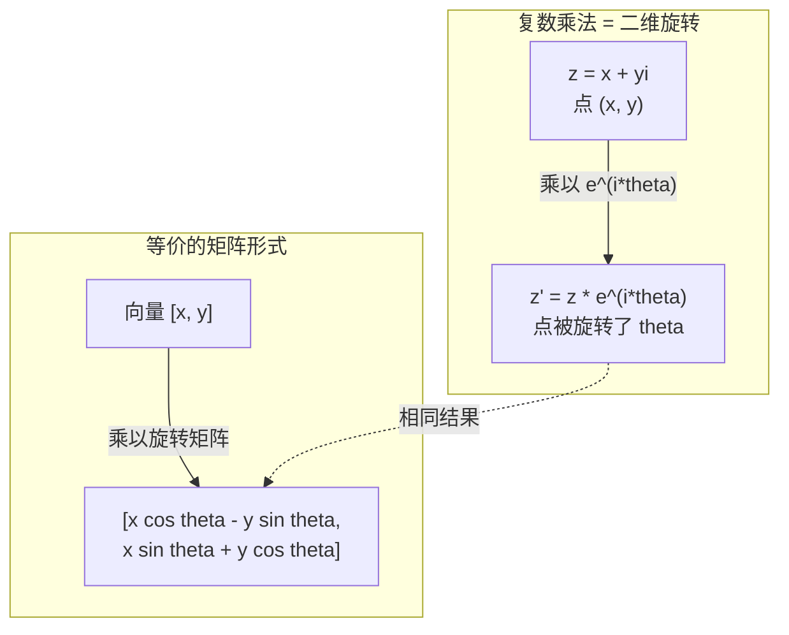
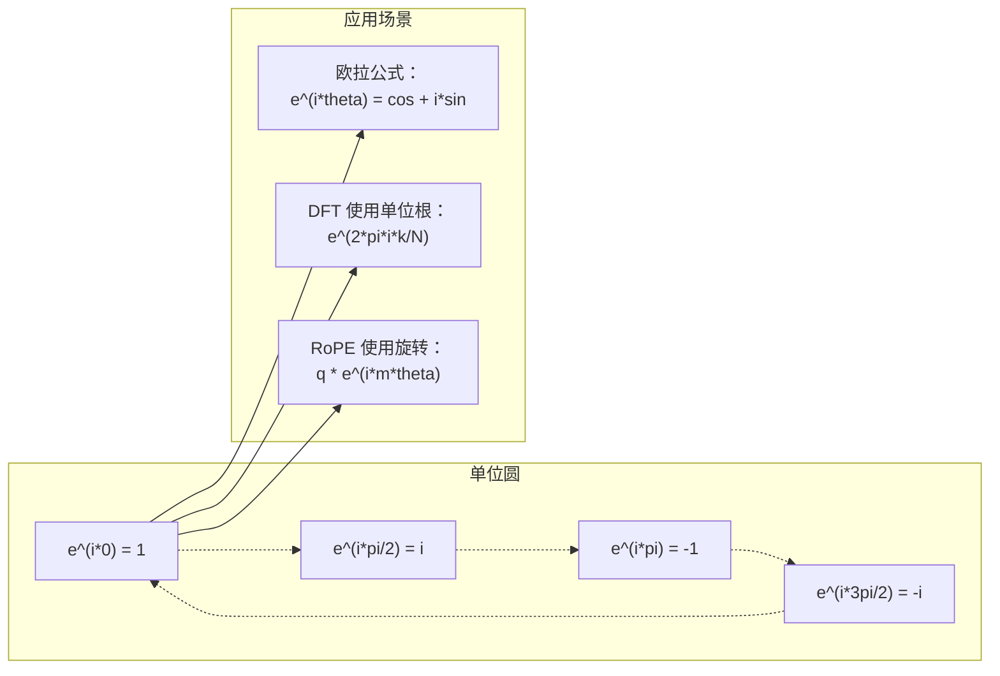

# AI 中的复数

> -1 的平方根并非"虚"构。它是旋转、频率以及半个信号处理领域的关键。

**类型：** 学习
**语言：** Python
**前置知识：** 阶段 1，课程 01-04（线性代数、微积分）
**时间：** 约 60 分钟

## 学习目标

- 用直角坐标和极坐标两种形式执行复数算术运算（加、乘、除、共轭）
- 运用欧拉公式在复指数与三角函数之间相互转换
- 使用单位根实现离散傅里叶变换（DFT）
- 解释复数旋转如何构成 Transformer 中 RoPE 和正弦位置编码的基础

## 问题所在

你打开一篇关于傅里叶变换的论文，满眼都是 `i`。你查看 Transformer 的位置编码，看到不同频率的 `sin` 和 `cos`——它们是复指数的实部和虚部。你阅读量子计算文献，发现一切都用复向量空间来表达。

复数看起来很抽象。一个建立在 -1 的平方根上的数体系感觉像是一个数学戏法。但它不是戏法。它是旋转和振荡的自然语言。任何事物只要在旋转、振动或振荡，复数就是正确的工具。

不理解复数，就无法理解离散傅里叶变换。无法理解 FFT。无法理解 RoPE（旋转位置嵌入）在现代语言模型中是如何工作的。无法理解原始 Transformer 论文中正弦位置编码为何选用那些频率。

本课程从零开始构建复数算术，将它与几何联系起来，并精确展示复数在机器学习中出现的位置。

## 核心概念

### 什么是复数？

复数有两个部分：实部和虚部。

```
z = a + bi

其中：
  a 是实部
  b 是虚部
  i 是虚数单位，定义为 i^2 = -1
```

就这样。你将数线扩展为平面。实数落在一个轴上。虚数落在另一个轴上。每个复数都是这个平面中的一个点。

### 复数算术运算

**加法。** 实部相加，虚部相加。

```
(a + bi) + (c + di) = (a + c) + (b + d)i

例：(3 + 2i) + (1 + 4i) = 4 + 6i
```

**乘法。** 运用分配律，记住 i^2 = -1。

```
(a + bi)(c + di) = ac + adi + bci + bdi^2
                 = ac + adi + bci - bd
                 = (ac - bd) + (ad + bc)i

例：(3 + 2i)(1 + 4i) = 3 + 12i + 2i + 8i^2
                            = 3 + 14i - 8
                            = -5 + 14i
```

**共轭。** 将虚部符号取反。

```
(a + bi) 的共轭 = a - bi
```

复数与其共轭的乘积永远是实数：

```
(a + bi)(a - bi) = a^2 + b^2
```

**除法。** 分子分母同时乘以分母的共轭。

```
(a + bi) / (c + di) = (a + bi)(c - di) / (c^2 + d^2)
```

这消除了分母中的虚部，给你一个干净的复数。

### 复平面

复平面将每个复数映射为二维平面上的一个点。横轴是实轴，纵轴是虚轴。

```
z = 3 + 2i  对应点 (3, 2)
z = -1 + 0i 对应点 (-1, 0)，在实轴上
z = 0 + 4i  对应点 (0, 4)，在虚轴上
```

复数同时是一个点和一个从原点出发的向量。这种双重解释使得复数在几何中非常有用。

### 极坐标形式

平面中任意一点都可以用它到原点的距离和它相对于正实轴的角度来描述。

```
z = r * (cos(theta) + i*sin(theta))

其中：
  r = |z| = sqrt(a^2 + b^2)  （模 / 幅值）
  theta = atan2(b, a)         （相位 / 辐角）
```

直角坐标形式 (a + bi) 适合加法。极坐标形式 (r, theta) 适合乘法。

**极坐标形式的乘法。** 模相乘，角度相加。

```
z1 = r1 * e^(i*theta1)
z2 = r2 * e^(i*theta2)

z1 * z2 = (r1 * r2) * e^(i*(theta1 + theta2))
```

这就是复数完美适合旋转的原因。乘以模为 1 的复数就是纯旋转。

### 欧拉公式

连接复指数与三角学的桥梁：

```
e^(i*theta) = cos(theta) + i*sin(theta)
```

这是本课程中最重要的公式。当 theta = pi 时：

```
e^(i*pi) = cos(pi) + i*sin(pi) = -1 + 0i = -1

因此：e^(i*pi) + 1 = 0
```

五个基本常数（e, i, pi, 1, 0）在一个等式中联系在一起。

### 为什么欧拉公式对机器学习重要

欧拉公式表明，当 theta 变化时，`e^(i*theta)` 描绘单位圆。当 theta = 0 时，你在 (1, 0)。当 theta = pi/2 时，你在 (0, 1)。当 theta = pi 时，你在 (-1, 0)。当 theta = 3*pi/2 时，你在 (0, -1)。一个完整的旋转对应 theta = 2*pi。

这意味着复指数就是旋转。而旋转在信号处理和机器学习中无处不在。

### 与二维旋转的联系

将复数 (x + yi) 乘以 e^(i*theta)，会将点 (x, y) 绕原点旋转 theta 角。

```
复数乘法实现的旋转：
  (x + yi) * (cos(theta) + i*sin(theta))
  = (x*cos(theta) - y*sin(theta)) + (x*sin(theta) + y*cos(theta))i

矩阵乘法实现的旋转：
  [cos(theta)  -sin(theta)] [x]   [x*cos(theta) - y*sin(theta)]
  [sin(theta)   cos(theta)] [y] = [x*sin(theta) + y*cos(theta)]
```

两者产生完全相同的结果。复数乘法就是二维旋转。旋转矩阵不过是矩阵记法下的复数乘法。



### 相量与旋转信号

复指数 e^(i*omega*t) 是一个在单位圆上以角频率 omega 旋转的点。随着 t 增大，该点描绘出一个圆。

这个旋转点的实部是 cos(omega*t)。虚部是 sin(omega*t)。正弦信号就是一个旋转复数的投影。

```
e^(i*omega*t) = cos(omega*t) + i*sin(omega*t)

实部：      cos(omega*t)    -- 余弦波
虚部：      sin(omega*t)    -- 正弦波
```

这就是相量表示法。不去追踪一条蜿蜒的正弦波，而是追踪一支平滑旋转的箭头。相位偏移变成角度偏移。幅度变化变成模变化。信号相加变成向量相加。

### 单位根

N 次单位根是 N 个在单位圆上等距分布的点：

```
w_k = e^(2*pi*i*k/N)    k = 0, 1, 2, ..., N-1
```

当 N = 4 时，单位根为：1, i, -1, -i（四个罗盘方向）。当 N = 8 时，得到四个罗盘方向加上四个对角方向。

单位根是离散傅里叶变换的基础。DFT 将信号分解为这些 N 个等距频率上的分量。

### 与 DFT 的联系

信号 x[0], x[1], ..., x[N-1] 的离散傅里叶变换为：

```
X[k] = sum_{n=0}^{N-1} x[n] * e^(-2*pi*i*k*n/N)
```

每个 X[k] 测量信号与第 k 个单位根——一个频率为 k 的复正弦波——之间的相关性。DFT 将信号分解为 N 个旋转相量，并告诉你每个相量的幅度和相位。

### 为什么 i 不是"虚"的

"虚数"一词是一个历史意外。笛卡尔用它来表示贬低。但 i 并不比负数更"虚"——负数最初出现时人们也曾拒绝接受它。负数回答"3 减 5 等于多少？"虚数单位回答"什么数的平方是 -1？"

更有用的是：i 是一个 90 度旋转操作符。将实数乘以 i 一次，你就旋转 90 度到了虚轴上。再乘以 i 一次（i^2），再旋转 90 度——现在你指向负实方向。这就是为什么 i^2 = -1。它并不神秘。它是两个四分之一圈合成了一个半圈。

这就是复数在工程中无处不在的原因。任何旋转的东西——电磁波、量子态、信号振荡、位置编码——都自然地用复数来描述。

### 复指数 vs 三角函数

在欧拉公式出现之前，工程师将信号写成 A*cos(omega*t + phi)——振幅 A、频率 omega、相位 phi。这可行，但运算很痛苦。将两个不同相位的余弦相加需要用到三角恒等式。

使用复指数，同一个信号是 A*e^(i*(omega*t + phi))。将两个信号相加就是将两个复数相加。相乘（调制）就是模相乘、角度相加。相位偏移变成角度加法。频率偏移变成乘以相量。

整个信号处理领域转向复指数记法是因为数学更简洁。"实信号"始终只是复数表示的实部。虚部作为记录保留，使所有代数自然地成立。

### 与 Transformer 的联系

**正弦位置编码**（原始 Transformer 论文）：

```
PE(pos, 2i) = sin(pos / 10000^(2i/d))
PE(pos, 2i+1) = cos(pos / 10000^(2i/d))
```

这些 sin 和 cos 对是不同频率的复指数的实部和虚部。每个频率提供不同的位置"分辨率"。低频变化缓慢（粗粒度位置）。高频变化快速（细粒度位置）。它们共同赋予每个位置一个独特的频率指纹。

**RoPE（旋转位置嵌入）** 将这个思想更进一步。它显式地将 Query 和 Key 向量乘以复数旋转矩阵。两个 token 之间的相对位置变成一个旋转角度。注意力使用这些旋转后的向量计算，使模型通过复数乘法感知相对位置。

| 运算 | 代数形式 | 几何含义 |
|-----------|---------------|-------------------|
| 加法 | (a+c) + (b+d)i | 平面中的向量加法 |
| 乘法 | (ac-bd) + (ad+bc)i | 旋转并缩放 |
| 共轭 | a - bi | 关于实轴镜像 |
| 模 | sqrt(a^2 + b^2) | 到原点的距离 |
| 相位 | atan2(b, a) | 相对于正实轴的角度 |
| 除法 | 乘以共轭 | 反向旋转并重新缩放 |
| 幂 | r^n * e^(i*n*theta) | 旋转 n 次，按 r^n 缩放 |



## 构建它

### 第 1 步：复数类

构建一个支持算术运算、模、相位以及在直角坐标与极坐标之间转换的复数类。

```python
import math

class Complex:
    def __init__(self, real, imag=0.0):
        self.real = real
        self.imag = imag

    def __add__(self, other):
        return Complex(self.real + other.real, self.imag + other.imag)

    def __mul__(self, other):
        r = self.real * other.real - self.imag * other.imag
        i = self.real * other.imag + self.imag * other.real
        return Complex(r, i)

    def __truediv__(self, other):
        denom = other.real ** 2 + other.imag ** 2
        r = (self.real * other.real + self.imag * other.imag) / denom
        i = (self.imag * other.real - self.real * other.imag) / denom
        return Complex(r, i)

    def magnitude(self):
        return math.sqrt(self.real ** 2 + self.imag ** 2)

    def phase(self):
        return math.atan2(self.imag, self.real)

    def conjugate(self):
        return Complex(self.real, -self.imag)
```

### 第 2 步：极坐标转换与欧拉公式

```python
def to_polar(z):
    return z.magnitude(), z.phase()

def from_polar(r, theta):
    return Complex(r * math.cos(theta), r * math.sin(theta))

def euler(theta):
    return Complex(math.cos(theta), math.sin(theta))
```

验证：`euler(theta).magnitude()` 应该始终为 1.0。`euler(0)` 应给出 (1, 0)。`euler(pi)` 应给出 (-1, 0)。

### 第 3 步：旋转

将点 (x, y) 旋转角度 theta 只需一次复数乘法：

```python
point = Complex(3, 4)
rotated = point * euler(math.pi / 4)
```

模保持不变。只有角度改变。

### 第 4 步：用复数算术实现 DFT

```python
def dft(signal):
    N = len(signal)
    result = []
    for k in range(N):
        total = Complex(0, 0)
        for n in range(N):
            angle = -2 * math.pi * k * n / N
            total = total + Complex(signal[n], 0) * euler(angle)
        result.append(total)
    return result
```

这是 O(N^2) 的 DFT。每个输出 X[k] 是信号样本乘以单位根的累加和。

### 第 5 步：逆 DFT

逆 DFT 从频谱重建原始信号。与正向 DFT 的区别：指数符号取反，并除以 N。

```python
def idft(spectrum):
    N = len(spectrum)
    result = []
    for n in range(N):
        total = Complex(0, 0)
        for k in range(N):
            angle = 2 * math.pi * k * n / N
            total = total + spectrum[k] * euler(angle)
        result.append(Complex(total.real / N, total.imag / N))
    return result
```

这给你完美的重建。施加 DFT，再施加 IDFT，你将精确地回到原始信号。没有信息丢失。

### 第 6 步：单位根

```python
def roots_of_unity(N):
    return [euler(2 * math.pi * k / N) for k in range(N)]
```

验证两个性质：
- 每个根的模恰好为 1。
- 所有 N 个根的和为零（它们由于对称性相互抵消）。

这些性质使得 DFT 可逆。单位根形成频域的正交基。

## 使用它

Python 内置支持复数。字面量 `j` 表示虚数单位。

```python
z = 3 + 2j
w = 1 + 4j

print(z + w)
print(z * w)
print(abs(z))

import cmath
print(cmath.phase(z))
print(cmath.exp(1j * cmath.pi))
```

对于数组，numpy 原生处理复数：

```python
import numpy as np

z = np.array([1+2j, 3+4j, 5+6j])
print(np.abs(z))
print(np.angle(z))
print(np.conj(z))
print(np.real(z))
print(np.imag(z))

signal = np.sin(2 * np.pi * 5 * np.linspace(0, 1, 128))
spectrum = np.fft.fft(signal)
freqs = np.fft.fftfreq(128, d=1/128)
```

## 交付它

运行 `code/complex_numbers.py` 生成 `outputs/skill-complex-arithmetic.md`。

## 练习

1. **手算复数运算。** 计算 (2 + 3i) * (4 - i) 并用代码验证。然后计算 (5 + 2i) / (1 - 3i)。在复平面上画出两个结果，验证乘法是否旋转并缩放了第一个数。

2. **旋转序列。** 从点 (1, 0) 开始，乘以 e^(i*pi/6) 十二次。验证经过 12 次乘法后回到 (1, 0)。打印每一步的坐标，确认它们描绘出一个正十二边形。

3. **已知信号的 DFT。** 创建一个由 sin(2*pi*3*t) + 0.5*sin(2*pi*7*t) 之和组成的信号，在 32 个点上采样。运行你的 DFT。验证幅度谱在频率 3 和 7 处有峰值，频率 7 处峰值高度是频率 3 处的一半。

4. **单位根可视化。** 计算 8 次单位根。验证它们的和为零。验证任意一个单位根乘以原始根 e^(2*pi*i/8) 得到下一个根。

5. **旋转矩阵等价性。** 对于 10 个随机角度和 10 个随机点，验证复数乘法与 2x2 旋转矩阵的矩阵-向量乘法给出相同结果。打印最大数值差异。

## 核心术语

| 术语 | 含义 |
|------|---------------|
| 复数 | 一个数 a + bi，其中 a 是实部，b 是虚部，且 i^2 = -1 |
| 虚数单位 | 数 i，定义为 i^2 = -1。它在哲学意义上并非"虚"——而是一个旋转操作符 |
| 复平面 | 二维平面，x 轴是实轴，y 轴是虚轴。也称为 Argand 平面 |
| 模（幅值） | 到原点的距离：sqrt(a^2 + b^2)。记作 |z| |
| 相位（辐角） | 相对于正实轴的角度：atan2(b, a)。记作 arg(z) |
| 共轭 | 关于实轴的镜像：a + bi 的共轭是 a - bi |
| 极坐标形式 | 将 z 表示为 r * e^(i*theta) 而不是 a + bi。乘法时很方便 |
| 欧拉公式 | e^(i*theta) = cos(theta) + i*sin(theta)。将指数与三角学联系起来 |
| 相量 | 一个旋转的复数 e^(i*omega*t)，表示正弦信号 |
| 单位根 | N 个复数 e^(2*pi*i*k/N)，k 从 0 到 N-1。在单位圆上 N 个等距分布的点 |
| DFT | 离散傅里叶变换。使用单位根将信号分解为复正弦分量 |
| RoPE | 旋转位置嵌入。使用复数乘法在 Transformer 注意力中编码相对位置 |

## 延伸阅读

- [欧拉公式的直观介绍](https://betterexplained.com/articles/intuitive-understanding-of-eulers-formula/) - 不依赖繁重记号构建几何直觉
- [Su 等：RoFormer (2021)](https://arxiv.org/abs/2104.09864) - 引入使用复数旋转的旋转位置嵌入的论文
- [Vaswani 等：Attention Is All You Need (2017)](https://arxiv.org/abs/1706.03762) - 带正弦位置编码的原始 Transformer 论文
- [3Blue1Brown：用初等群论解释欧拉公式](https://www.youtube.com/watch?v=mvmuCPvRoWQ) - 为什么 e^(i*pi) = -1 的可视化解释
- [Needham：可视化复分析](https://global.oup.com/academic/product/visual-complex-analysis-9780198534464) - 复数最好的可视化处理，满是几何洞察
- [Strang：线性代数导论，第 10 章](https://math.mit.edu/~gs/linearalgebra/) - 线性代数和特征值背景下复数的介绍