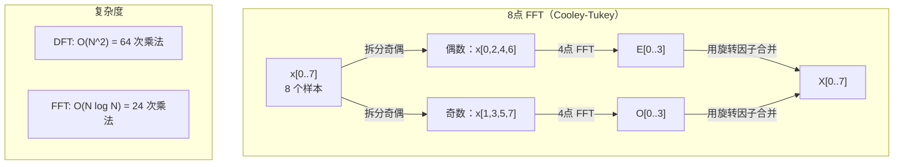
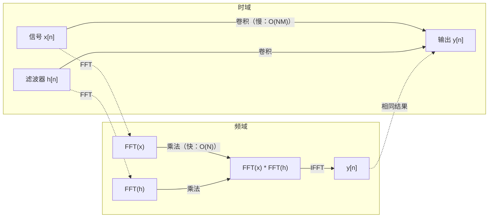

# 傅里叶变换

> 每个信号都是正弦波的叠加。傅里叶变换告诉你其中有哪些。

**类型：** 构建
**语言：** Python
**前置知识：** 阶段 1，课程 01-04、19（复数）
**时间：** 约 90 分钟

## 学习目标

- 从零实现 DFT 并验证其与 O(N log N) Cooley-Tukey FFT 的一致性
- 解读频率系数：从信号中提取幅度、相位和功率谱
- 运用卷积定理通过 FFT 乘法实现卷积
- 将傅里叶频率分解与 Transformer 位置编码和 CNN 卷积层联系起来

## 问题所在

一段音频录音是随时间变化的压力测量序列。股价是随天数变化的数值序列。图像是空间上像素强度网格。所有这些都是时域（或空域）中的数据。你看到某个指标上的值在变化。

但很多模式在时域中是不可见的。这段音频是纯音还是和弦？股价有周周期吗？这张图片有重复的纹理吗？这些问题都与频率内容有关，而时域隐藏了它。

傅里叶变换将数据从时域转换到频域。它接收一个信号并将其分解为不同频率的正弦波。每个正弦波有幅度（有多强）和相位（从哪开始）。傅里叶变换同时告诉你这两者。

这在机器学习中很重要，因为频域思维无处不在。卷积神经网络执行卷积，这在频域是乘法。Transformer 位置编码使用频率分解来表示位置。音频模型（语音识别、音乐生成）在频谱图上操作——声音的频率表示。时序模型寻找周期性模式。理解傅里叶变换赋予你处理所有这些问题的词汇。

## 核心概念

### DFT 定义

给定 N 个样本 x[0], x[1], ..., x[N-1]，离散傅里叶变换产生 N 个频率系数 X[0], X[1], ..., X[N-1]：

```
X[k] = sum_{n=0}^{N-1} x[n] * e^(-2*pi*i*k*n/N)

k = 0, 1, ..., N-1
```

每个 X[k] 是一个复数。它的模 |X[k]| 告诉你频率 k 的幅度。它的相位角(X[k]) 告诉你该频率的相位偏移。

关键洞察：`e^(-2*pi*i*k*n/N)` 是一个频率为 k 的旋转相量。DFT 计算信号与 N 个等距频率中每个频率的相关性。如果信号在频率 k 处有能量，相关性就大。如果没有，它接近零。

### 每个系数的含义

**X[0]：直流分量。** 这是所有样本的和——与均值成正比。它代表信号的常数（零频率）偏移。

```
X[0] = sum_{n=0}^{N-1} x[n] * e^0 = 所有样本之和
```

**X[k]，1 <= k <= N/2：正频率。** X[k] 代表每 N 个样本中 k 个周期的频率。k 越高意味着频率越高（振荡越快）。

**X[N/2]：奈奎斯特频率。** 用 N 个样本能表示的最高频率。高于此频率会产生混叠——高频伪装成低频。

**X[k]，N/2 < k < N：负频率。** 对于实值信号，X[N-k] = conj(X[k])。负频率是正频率的镜像。这就是为什么有用信息在前 N/2 + 1 个系数中。

### 逆 DFT

逆 DFT 从频率系数重建原始信号：

```
x[n] = (1/N) * sum_{k=0}^{N-1} X[k] * e^(2*pi*i*k*n/N)

n = 0, 1, ..., N-1
```

与正向 DFT 的区别仅在于：指数符号为正（而非负），且有 1/N 归一化因子。

逆 DFT 是完美重建。没有信息丢失。你可以从时域到频域再回来，没有任何误差。DFT 是一种基变换——在不同的坐标系中重新表达相同的信息。

### FFT：让它变快

上述定义的 DFT 是 O(N^2)：对于 N 个输出系数中的每一个，你要对 N 个输入样本求和。对于 N = 100 万，那是 10^12 次运算。

快速傅里叶变换（FFT）以 O(N log N) 计算相同结果。对于 N = 100 万，那是大约 2000 万次运算而不是一万亿次。这就是使频域分析变得实用的关键。

Cooley-Tukey 算法（最常见的 FFT）通过分治实现：

1. 将信号分成偶数索引和奇数索引的样本。
2. 递归计算每半部分的 DFT。
3. 使用"旋转因子" e^(-2*pi*i*k/N) 合并两个半尺寸 DFT。

```
X[k] = E[k] + e^(-2*pi*i*k/N) * O[k]          k = 0, ..., N/2 - 1
X[k + N/2] = E[k] - e^(-2*pi*i*k/N) * O[k]    k = 0, ..., N/2 - 1

其中 E = 偶数索引样本的 DFT
      O = 奇数索引样本的 DFT
```

对称性意味着每层递归做 O(N) 工作，且有 log2(N) 层。总计：O(N log N)。



FFT 要求信号长度为 2 的幂。实际中，信号被零填充到下一个 2 的幂。

### 频谱分析

**功率谱**是 |X[k]|^2——每个频率系数的模的平方。它显示每个频率处有多少能量。

**相位谱**是 angle(X[k])——每个频率的相位偏移。对于大多数分析任务，你关心功率谱而忽略相位。

```
频率 k 处的功率：  P[k] = |X[k]|^2 = X[k].real^2 + X[k].imag^2
频率 k 处的相位：  phi[k] = atan2(X[k].imag, X[k].real)
```

### 频率分辨率

DFT 的频率分辨率取决于样本数 N 和采样率 fs。

```
频率仓 k 的频率：     f_k = k * fs / N
频率分辨率：           delta_f = fs / N
最高频率：            f_max = fs / 2  （奈奎斯特）
```

要分辨两个相近的频率，你需要更多样本。要捕获高频，你需要更高的采样率。

### 卷积定理

这是信号处理中最重要的结论之一，与 CNN 直接相关。

**时域卷积等于频域逐点乘法。**

```
x * h = IFFT(FFT(x) . FFT(h))

其中 * 是卷积，. 是逐元素乘法
```

为什么这很重要：

- 两个长度分别为 N 和 M 的信号的直接卷积需要 O(N*M) 次运算。
- 基于 FFT 的卷积需要 O(N log N)：变换两个信号、相乘、变换回来。
- 对于大卷积核，FFT 卷积速度显著更快。
- 这正是大感受野卷积层中发生的情况。

注意：DFT 计算循环卷积（信号环绕）。对于线性卷积（无环绕），在计算前将两个信号零填充到长度 N + M - 1。



### 加窗

DFT 假定信号是周期性的——它将 N 个样本视为一个无限重复信号的一个周期。如果信号起始和结束值不相同，这会在边界处产生不连续，表现为虚假的高频内容。这称为频谱泄漏。

加窗通过在计算 DFT 前将信号两端渐变到零来减少泄漏。

常用窗函数：

| 窗函数 | 形状 | 主瓣宽度 | 旁瓣水平 | 适用场景 |
|--------|-------|----------------|-----------------|----------|
| 矩形 | 平坦（无窗） | 最窄 | 最高（-13 dB） | 信号恰好在 N 个样本中周期重复 |
| Hann | 升余弦 | 中等 | 低（-31 dB） | 通用频谱分析 |
| Hamming | 改进余弦 | 中等 | 较低（-42 dB） | 音频处理、语音分析 |
| Blackman | 三余弦 | 宽 | 非常低（-58 dB） | 旁瓣抑制至关重要的场景 |

```
Hann 窗：    w[n] = 0.5 * (1 - cos(2*pi*n / (N-1)))
Hamm 窗：    w[n] = 0.54 - 0.46 * cos(2*pi*n / (N-1))
```

在 DFT 前将窗函数逐元素乘以信号来应用：`X = DFT(x * w)`。

### DFT 性质

| 性质 | 时域 | 频域 |
|----------|-------------|-----------------|
| 线性 | a*x + b*y | a*X + b*Y |
| 时移 | x[n - k] | X[f] * e^(-2*pi*i*f*k/N) |
| 频移 | x[n] * e^(2*pi*i*f0*n/N) | X[f - f0] |
| 卷积 | x * h | X * H（逐点） |
| 乘法 | x * h（逐点） | X * H（循环卷积，缩放 1/N） |
| 帕塞瓦尔定理 | sum |x[n]|^2 | (1/N) * sum |X[k]|^2 |
| 共轭对称（实输入） | x[n] 实 | X[k] = conj(X[N-k]) |

帕塞瓦尔定理指出两个域中的总能量相同。能量通过变换守恒。

### 与位置编码的联系

原始 Transformer 使用正弦位置编码：

```
PE(pos, 2i)   = sin(pos / 10000^(2i/d_model))
PE(pos, 2i+1) = cos(pos / 10000^(2i/d_model))
```

每对维度 (2i, 2i+1) 以不同频率振荡。频率从高频（维度 0,1）到低频（最后维度）几何分布。这赋予每个位置跨越所有频段的独特模式——类似于傅里叶系数唯一标识一个信号。

它提供的主要性质：

- **唯一性：** 没有两个位置具有相同的编码。
- **有界值：** sin 和 cos 始终在 [-1, 1] 范围内。
- **相对位置：** 位置 p+k 的编码可以表示为位置 p 处编码的线性函数。模型可以学习关注相对位置。

### 与 CNN 的联系

卷积层通过在信号或图像上滑动来将学习到的滤波器（卷积核）应用到输入。数学上，这是卷积运算。

根据卷积定理，这等价于：
1. 对输入做 FFT
2. 对卷积核做 FFT
3. 在频域相乘
4. 对结果做 IFFT

标准 CNN 实现使用直接卷积（对小尺寸 3x3 卷积核更快）。但对于大卷积核或全局卷积，基于 FFT 的方法显著更快。一些架构（如 FNet）用 FFT 完全替代注意力，以 O(N log N) 而非 O(N^2) 的复杂度达到具有竞争力的准确率。

### 频谱图与短时傅里叶变换

单个 FFT 给你整个信号的频率内容，但不告诉你这些频率何时出现。啁啾（频率随时间增加的信号）和弦（所有频率同时存在）可能具有相同的幅度谱。

短时傅里叶变换（STFT）通过在信号的重叠窗口上计算 FFT 来解决这个问题。结果是一个频谱图：一个二维表示，时间在一条轴上，频率在另一条轴上。每个点处的强度显示该频率在那一时刻的能量。

```
STFT 步骤：
1. 选择窗口大小（例如，1024 个样本）
2. 选择步长（例如，256 个样本——75% 重叠）
3. 对于每个窗口位置：
   a. 提取加窗后的片段
   b. 应用 Hann/Hamming 窗
   c. 计算 FFT
   d. 将幅度谱存储为频谱图的一列
```

频谱图是音频机器学习模型的标准输入表示。语音识别模型（Whisper、DeepSpeech）在梅尔频谱图上操作——频率映射到梅尔刻度的频谱图，更好地匹配人类音高感知。

### 混叠

如果信号包含高于 fs/2（奈奎斯特频率）的频率，以采样率 fs 采样会产生混叠复制。90 Hz 的信号以 100 Hz 采样看起来与 10 Hz 信号相同。没有办法仅从样本中区分它们。

```
示例：
  真实信号：90 Hz 正弦波
  采样率：100 Hz
  表观频率：100 - 90 = 10 Hz

  以 100 Hz 采样率从 90 Hz 信号采集的样本
  与从 10 Hz 信号采集的样本完全相同。
  任何数学都无法恢复原始 90 Hz。
```

这就是为什么模数转换器包含抗混叠滤波器，在采样前去除高于奈奎斯特的频率。在机器学习中，混叠出现在下采样特征图而没有适当低通滤波时——一些架构通过抗混叠池化层来解决这个问题。

### 零填充不能提高分辨率

一个常见的误解：在 FFT 前零填充信号可以提高频率分辨率。不能。零填充在现有频率仓之间插值，给你一个看起来更平滑的频谱。但它无法揭示原始样本中不存在的频率细节。

真正的频率分辨率仅取决于观测时间 T = N / fs。要分辨两个相隔 delta_f 的频率，你需要至少 T = 1 / delta_f 秒的数据。零填充无法改变这一基本限制。

## 构建它

### 第 1 步：从零实现 DFT

O(N^2) DFT 直接来自定义。

```python
import math

class Complex:
    ...

def dft(x):
    N = len(x)
    result = []
    for k in range(N):
        total = Complex(0, 0)
        for n in range(N):
            angle = -2 * math.pi * k * n / N
            w = Complex(math.cos(angle), math.sin(angle))
            xn = x[n] if isinstance(x[n], Complex) else Complex(x[n])
            total = total + xn * w
        result.append(total)
    return result
```

### 第 2 步：逆 DFT

相同结构，指数为正，除以 N。

```python
def idft(X):
    N = len(X)
    result = []
    for n in range(N):
        total = Complex(0, 0)
        for k in range(N):
            angle = 2 * math.pi * k * n / N
            w = Complex(math.cos(angle), math.sin(angle))
            total = total + X[k] * w
        result.append(Complex(total.real / N, total.imag / N))
    return result
```

### 第 3 步：FFT（Cooley-Tukey）

递归 FFT 要求长度为 2 的幂。拆分为奇偶，递归，合并旋转因子。

```python
def fft(x):
    N = len(x)
    if N <= 1:
        return [x[0] if isinstance(x[0], Complex) else Complex(x[0])]
    if N % 2 != 0:
        return dft(x)

    even = fft([x[i] for i in range(0, N, 2)])
    odd = fft([x[i] for i in range(1, N, 2)])

    result = [Complex(0)] * N
    for k in range(N // 2):
        angle = -2 * math.pi * k / N
        twiddle = Complex(math.cos(angle), math.sin(angle))
        t = twiddle * odd[k]
        result[k] = even[k] + t
        result[k + N // 2] = even[k] - t
    return result
```

### 第 4 步：频谱分析辅助函数

```python
def power_spectrum(X):
    return [xk.real ** 2 + xk.imag ** 2 for xk in X]

def convolve_fft(x, h):
    N = len(x) + len(h) - 1
    padded_N = 1
    while padded_N < N:
        padded_N *= 2

    x_padded = x + [0.0] * (padded_N - len(x))
    h_padded = h + [0.0] * (padded_N - len(h))

    X = fft(x_padded)
    H = fft(h_padded)

    Y = [xk * hk for xk, hk in zip(X, H)]

    y = idft(Y)
    return [y[n].real for n in range(N)]
```

## 使用它

实际工作中，使用 numpy 的 FFT，它由高度优化的 C 库支持。

```python
import numpy as np

signal = np.sin(2 * np.pi * 5 * np.arange(256) / 256)
spectrum = np.fft.fft(signal)
freqs = np.fft.fftfreq(256, d=1/256)

power = np.abs(spectrum) ** 2

positive_freqs = freqs[:len(freqs)//2]
positive_power = power[:len(power)//2]
```

用于加窗和更高级频谱分析：

```python
from scipy.signal import windows, stft

window = windows.hann(256)
windowed = signal * window
spectrum = np.fft.fft(windowed)
```

用于卷积：

```python
from scipy.signal import fftconvolve

result = fftconvolve(signal, kernel, mode='full')
```

用于频谱图：

```python
from scipy.signal import stft

frequencies, times, Zxx = stft(signal, fs=sample_rate, nperseg=256)
spectrogram = np.abs(Zxx) ** 2
```

频谱图矩阵的形状是 (n_frequencies, n_time_frames)。每列是一个时间窗口的功率谱。这是音频机器学习模型消费的输入。

## 交付它

运行 `code/fourier.py` 生成 `outputs/prompt-spectral-analyzer.md`。

## 练习

1. **纯音识别。** 创建一个在未知频率（1 到 50 Hz 之间）上的单个正弦波信号，以 128 Hz 采样 1 秒。用你的 DFT 识别该频率。验证答案匹配。现在添加标准差为 0.5 的高斯噪声并重复。噪声如何影响频谱？

2. **FFT 与 DFT 验证。** 生成长度为 64 的随机信号。分别计算 DFT（O(N^2)）和 FFT。验证所有系数在 1e-10 以内匹配。在长度 256、512、1024 和 2048 的信号上计时两个函数。绘制 DFT 时间与 FFT 时间的比值图。

3. **卷积定理实例验证。** 创建信号 x = [1, 2, 3, 4, 0, 0, 0, 0] 和滤波器 h = [1, 1, 1, 0, 0, 0, 0, 0]。直接计算它们的循环卷积（嵌套循环）。然后通过 FFT 计算（变换、相乘、逆变换）。验证结果一致。现在通过适当零填充做线性卷积。

4. **加窗效果。** 创建一个由 10 Hz 和 12 Hz（非常接近）两个正弦波之和组成的信号。以 128 Hz 采样 1 秒。分别用无窗、Hann 窗和 Hamming 窗计算功率谱。哪个窗最易于区分两个峰？为什么？

5. **位置编码分析。** 为 d_model = 128 和 max_pos = 512 生成正弦位置编码。对于每对位置 (p1, p2)，计算它们编码的点积。证明点积仅取决于 |p1 - p2|，而非绝对位置。随着距离增大，点积如何变化？

## 核心术语

| 术语 | 含义 |
|------|---------------|
| DFT（离散傅里叶变换） | 将 N 个时域样本转换为 N 个频域系数。每个系数是该频率处复正弦波的相关性 |
| FFT（快速傅里叶变换） | 以 O(N log N) 计算 DFT 的算法。Cooley-Tukey 算法递归拆分奇偶索引 |
| 逆 DFT | 从频率系数重建时域信号。与 DFT 公式相同，指数符号取反并有 1/N 缩放 |
| 频率仓 | DFT 输出中每个索引 k 代表频率 k*fs/N Hz。"仓"是离散频率槽 |
| 直流分量 | X[0]，零频率系数。与信号均值成正比 |
| 奈奎斯特频率 | fs/2，在采样率 fs 下可表示的最高频率。高于此频率的频率会产生混叠 |
| 功率谱 | |X[k]|^2，每个频率系数的模的平方。显示能量在频率间的分布 |
| 相位谱 | angle(X[k])，每个频率分量的相位偏移。分析中常被忽略 |
| 频谱泄漏 | 将非周期信号当作周期处理导致的虚假频率内容。加窗可减少 |
| 窗函数 | 在 DFT 前应用的一个渐变函数（Hann、Hamming、Blackman）用于减少频谱泄漏 |
| 旋转因子 | 用于在 FFT 蝴蝶运算中合并子 DFT 的复指数 e^(-2*pi*i*k/N) |
| 卷积定理 | 时域卷积等于频域逐点乘法。信号处理和 CNN 的基础 |
| 循环卷积 | 信号环绕的卷积。这是 DFT 自然计算的卷积 |
| 线性卷积 | 无环绕的标准卷积。通过 DFT 前零填充实现 |
| 帕塞瓦尔定理 | 总能量通过傅里叶变换守恒。sum |x[n]|^2 = (1/N) sum |X[k]|^2 |
| 混叠 | 由于采样率不足，高于奈奎斯特的频率表现为较低频率 |

## 延伸阅读

- [Cooley & Tukey：复傅里叶级数机器计算算法 (1965)](https://www.ams.org/journals/mcom/1965-19-090/S0025-5718-1965-0178586-1/) - 改变了计算方式的原始 FFT 论文
- [3Blue1Brown：傅里叶变换究竟是什么？](https://www.youtube.com/watch?v=spUNpyF58BY) - 傅里叶变换最好的可视化介绍
- [Lee-Thorp 等：FNet：用傅里叶变换混合 Token (2021)](https://arxiv.org/abs/2105.03824) - 在 transformer 中用 FFT 替代自注意力
- [Smith：数字信号处理科学家与工程师指南](http://www.dspguide.com/) - 免费在线教科书，深入覆盖 FFT、加窗和频谱分析
- [Vaswani 等：Attention Is All You Need (2017)](https://arxiv.org/abs/1706.03762) - 源自傅里叶频率分解的正弦位置编码
- [Radford 等：Whisper (2022)](https://arxiv.org/abs/2212.04356) - 使用梅尔频谱图作为输入表示的语音识别