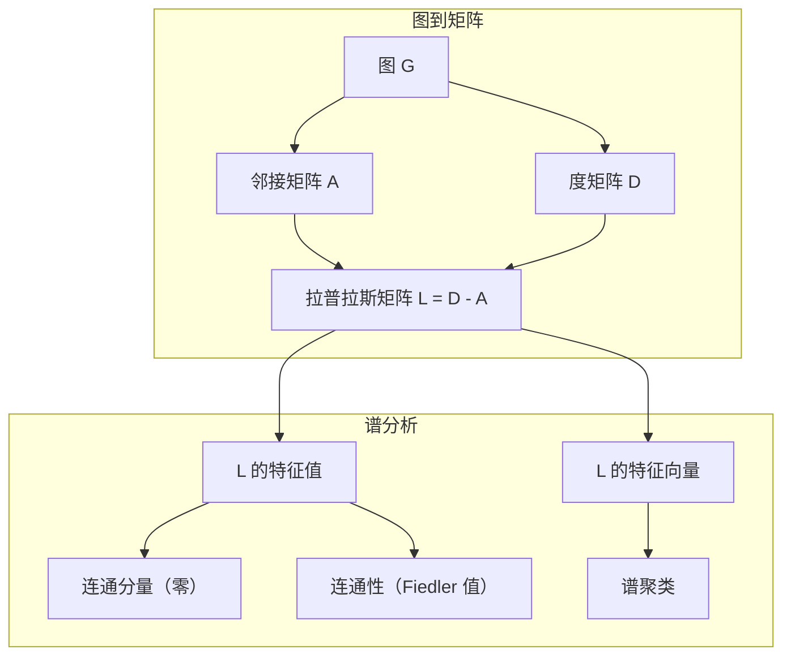
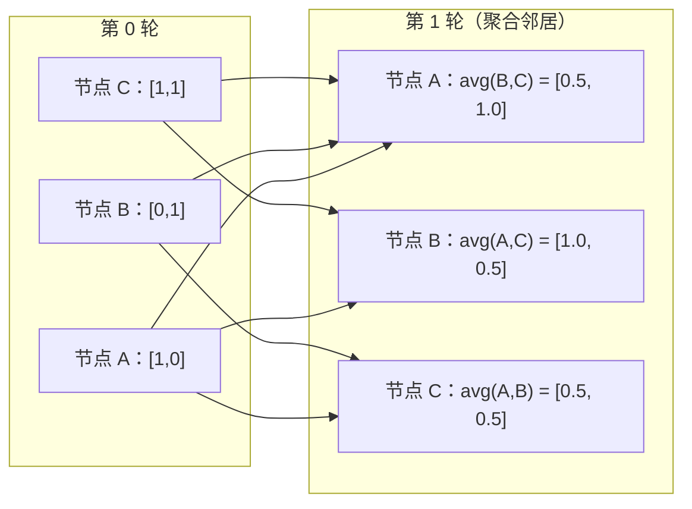

# 图论与机器学习

> 图是关系的数据结构。如果你的数据有连接，你就需要图论。

**类型：** 构建
**语言：** Python
**前置知识：** 阶段 1，课程 01-03（线性代数、矩阵）
**时间：** 约 90 分钟

## 学习目标

- 构建支持邻接矩阵/邻接表表示的图类，实现 BFS 和 DFS 遍历
- 计算图的拉普拉斯矩阵并用其特征值检测连通分量和节点聚类
- 实现一轮 GNN 风格的消息传递作为归一化邻接矩阵乘法
- 运用谱聚类利用 Fiedler 向量划分图

## 问题所在

社交网络、分子、知识库、引用网络、道路地图——都是图。传统机器学习将数据视为扁平表。每行独立。每列是一个特征。但当连接的结构重要时，表格就失效了。

考虑一个社交网络。你想预测用户会买什么产品。他们的购买历史重要。但他们朋友的购买历史更重要。连接携带着信号。

或者考虑一个分子。你想预测它是否与蛋白质结合。原子重要，但真正重要的是原子之间如何键合。结构就是数据。

图神经网络（GNN）是深度学习中增长最快的领域。它们为药物发现、社交推荐、欺诈检测和知识图谱推理提供动力。每个 GNN 都建立在相同的基础上：基本图论。

你需要四样东西：
1. 用矩阵表示图的方法（以便你可以相乘）
2. 遍历算法来探索图结构
3. 拉普拉斯矩阵——谱图论中最重要的矩阵
4. 消息传递——使 GNN 工作的操作

## 核心概念

### 图：节点和边

图 G = (V, E) 由顶点（节点）V 和边 E 组成。每条边连接两个节点。

**有向 vs 无向。** 在无向图中，边 (u, v) 意味着 u 连接到 v 且 v 连接到 u。在有向图（有向图）中，边 (u, v) 意味着 u 指向 v，但不一定是反向。

**加权 vs 无权。** 在无权图中，边要么存在要么不存在。在加权图中，每条边有一个数值权重——距离、成本或强度。

| 图类型 | 示例 |
|-----------|---------|
| 无向、无权 | Facebook 友谊网络 |
| 有向、无权 | Twitter 关注网络 |
| 无向、加权 | 道路地图（距离） |
| 有向、加权 | 网页链接（PageRank 分数） |

### 邻接矩阵

邻接矩阵 A 是核心表示。对于有 n 个节点的图：

```
A[i][j] = 1    如果从节点 i 到节点 j 存在一条边
A[i][j] = 0    否则
```

对于无向图，A 是对称的：A[i][j] = A[j][i]。对于加权图，A[i][j] = 边 (i, j) 的权重。

**示例——三角形：**

```
节点：0, 1, 2
边：(0,1), (1,2), (0,2)

A = [[0, 1, 1],
     [1, 0, 1],
     [1, 1, 0]]
```

邻接矩阵是每个 GNN 的输入。对 A 的矩阵运算对应于图上的运算。

### 度

节点的度是连接到它的边数。对于有向图，你有入度（进入的边）和出度（离开的边）。

度矩阵 D 是对角矩阵：

```
D[i][i] = 节点 i 的度
D[i][j] = 0    i != j 时
```

对于三角形示例：D = diag(2, 2, 2)，因为每个节点连接另外两个。

度告诉你节点的重要性。高度 = 枢纽节点。网络的度分布揭示其结构。社交网络服从幂律（少数枢纽节点，多数叶节点）。随机图的度服从泊松分布。

### BFS 和 DFS

两种基本的图遍历算法。你两者都需要。

**广度优先搜索（BFS）：** 先探索所有邻居，然后是邻居的邻居。使用队列（FIFO）。

```
从节点 0 开始 BFS：
  访问 0
  队列：[1, 2]        （0 的邻居）
  访问 1
  队列：[2, 3]        （添加 1 的邻居）
  访问 2
  队列：[3]           （2 的邻居已访问）
  访问 3
  队列：[]            （完成）
```

BFS 在无权图中找最短路径。从起点到任意节点的 distance 等于 BFS 层级，在该层级首次发现节点。这就是为什么 BFS 用于社交网络中的跳数距离。

**深度优先搜索（DFS）：** 尽可能深地探索，然后回溯。使用栈（LIFO）或递归。

```
从节点 0 开始 DFS：
  访问 0
  栈：[1, 2]        （0 的邻居）
  访问 2               （弹出栈）
  栈：[1, 3]         （添加 2 的邻居）
  访问 3               （弹出栈）
  栈：[1]
  访问 1               （弹出栈）
  栈：[]             （完成）
```

DFS 用于：
- 找连通分量（从未访问节点运行 DFS）
- 环检测（DFS 树中的回边）
- 拓扑排序（反向 DFS 完成顺序）

| 算法 | 数据结构 | 找什么 | 适用场景 |
|-----------|---------------|-------|----------|
| BFS | 队列 | 最短路径 | 社交网络距离、知识图谱遍历 |
| DFS | 栈 | 分量、环 | 连通性、拓扑排序 |

### 图拉普拉斯矩阵

L = D - A。谱图论中最重要的矩阵。

对于三角形：

```
D = [[2, 0, 0],    A = [[0, 1, 1],    L = [[2, -1, -1],
     [0, 2, 0],         [1, 0, 1],         [-1, 2, -1],
     [0, 0, 2]]         [1, 1, 0]]         [-1, -1,  2]]
```

拉普拉斯矩阵有卓越的性质：

1. **L 是半正定的。** 所有特征值 >= 0。

2. **零特征值的个数等于连通分量的个数。** 连通图恰好有一个零特征值。有 3 个不连通分量的图有三个零特征值。

3. **最小的非零特征值（Fiedler 值）衡量连通性。** 大的 Fiedler 值意味着图连通性好。小的 Fiedler 值意味着图有弱点——瓶颈。

4. **Fiedler 值对应的特征向量（Fiedler 向量）揭示最佳划分。** 正值节点分在一组，负值节点分在另一组。这就是谱聚类。



### 谱性质

邻接矩阵和拉普拉斯矩阵的特征值揭示结构性质，无需任何遍历。

**谱聚类**工作原理如下：
1. 计算拉普拉斯矩阵 L
2. 求 L 的 k 个最小特征向量（跳过第一个，因为连通图的全为 1）
3. 用这些特征向量作为每个节点的新坐标
4. 在这些坐标上运行 k-means

为什么有效？L 的特征向量编码图上"最平滑"的函数。连通性好的节点获得相似的特征向量值。被瓶颈分隔的节点获得不同的值。特征向量自然分离聚类。

**随机游走联系。** 归一化拉普拉斯与图上的随机游走有关。随机游走的平稳分布与节点度成正比。混合时间（游走收敛的速度）取决于谱间隙。

### 消息传递

图神经网络的核心操作。每个节点从邻居收集消息、聚合它们，并更新自己的状态。

```
h_v^(k+1) = UPDATE(h_v^(k), AGGREGATE({h_u^(k) : u in neighbors(v)}))
```

最简单的形式中，AGGREGATE = mean，UPDATE = 线性变换 + 激活：

```
h_v^(k+1) = sigma(W * mean({h_u^(k) : u in neighbors(v)}))
```

这是矩阵乘法的伪装。如果 H 是所有节点特征的矩阵，A 是邻接矩阵：

```
H^(k+1) = sigma(A_norm * H^(k) * W)
```

其中 A_norm 是归一化邻接矩阵（每行和为 1）。

一轮消息传递让每个节点"看到"其直接邻居。两轮让它看到邻居的邻居。K 轮让每个节点获得其 K 跳邻域的信息。



### 概念与机器学习应用

| 概念 | 机器学习应用 |
|---------|---------------|
| 邻接矩阵 | GNN 输入表示 |
| 图拉普拉斯矩阵 | 谱聚类、社区检测 |
| BFS/DFS | 知识图谱遍历、路径查找 |
| 度分布 | 节点重要性、特征工程 |
| 消息传递 | GNN 层（GCN、GAT、GraphSAGE） |
| L 的特征值 | 社区检测、图划分 |
| 谱聚类 | 无监督节点分组 |
| PageRank | 节点重要性、网页搜索 |

## 构建它

### 第 1 步：从零构建图类

```python
class Graph:
    def __init__(self, n_nodes, directed=False):
        self.n = n_nodes
        self.directed = directed
        self.adj = {i: {} for i in range(n_nodes)}

    def add_edge(self, u, v, weight=1.0):
        self.adj[u][v] = weight
        if not self.directed:
            self.adj[v][u] = weight

    def neighbors(self, node):
        return list(self.adj[node].keys())

    def degree(self, node):
        return len(self.adj[node])

    def adjacency_matrix(self):
        import numpy as np
        A = np.zeros((self.n, self.n))
        for u in range(self.n):
            for v, w in self.adj[u].items():
                A[u][v] = w
        return A

    def degree_matrix(self):
        import numpy as np
        D = np.zeros((self.n, self.n))
        for i in range(self.n):
            D[i][i] = self.degree(i)
        return D

    def laplacian(self):
        return self.degree_matrix() - self.adjacency_matrix()
```

邻接表（`self.adj`）高效存储邻居。邻接矩阵转换使用 numpy，因为所有谱操作需要它。

### 第 2 步：BFS 和 DFS

```python
from collections import deque

def bfs(graph, start):
    visited = set()
    order = []
    distances = {}
    queue = deque([(start, 0)])
    visited.add(start)
    while queue:
        node, dist = queue.popleft()
        order.append(node)
        distances[node] = dist
        for neighbor in graph.neighbors(node):
            if neighbor not in visited:
                visited.add(neighbor)
                queue.append((neighbor, dist + 1))
    return order, distances


def dfs(graph, start):
    visited = set()
    order = []
    stack = [start]
    while stack:
        node = stack.pop()
        if node in visited:
            continue
        visited.add(node)
        order.append(node)
        for neighbor in reversed(graph.neighbors(node)):
            if neighbor not in visited:
                stack.append(neighbor)
    return order
```

BFS 使用 deque（双端队列）实现 O(1) 的 popleft。DFS 使用列表作为栈。两者都精确访问每个节点一次——O(V + E) 时间。

### 第 3 步：连通分量和拉普拉斯特征值

```python
def connected_components(graph):
    visited = set()
    components = []
    for node in range(graph.n):
        if node not in visited:
            order, _ = bfs(graph, node)
            visited.update(order)
            components.append(order)
    return components


def laplacian_eigenvalues(graph):
    import numpy as np
    L = graph.laplacian()
    eigenvalues = np.linalg.eigvalsh(L)
    return eigenvalues
```

`eigvalsh` 用于对称矩阵——拉普拉斯矩阵对于无向图总是对称的。它按升序返回特征值。计算零的个数来找连通分量个数。

### 第 4 步：谱聚类

```python
def spectral_clustering(graph, k=2):
    import numpy as np
    L = graph.laplacian()
    eigenvalues, eigenvectors = np.linalg.eigh(L)
    features = eigenvectors[:, 1:k+1]

    labels = np.zeros(graph.n, dtype=int)
    for i in range(graph.n):
        if features[i, 0] >= 0:
            labels[i] = 0
        else:
            labels[i] = 1
    return labels
```

对于 k=2，Fiedler 向量的符号将图划分为两个聚类。对于 k>2，你可以在前 k 个特征向量（排除平凡的全 1 特征向量）上运行 k-means。

### 第 5 步：消息传递

```python
def message_passing(graph, features, weight_matrix):
    import numpy as np
    A = graph.adjacency_matrix()
    row_sums = A.sum(axis=1, keepdims=True)
    row_sums[row_sums == 0] = 1
    A_norm = A / row_sums
    aggregated = A_norm @ features
    output = aggregated @ weight_matrix
    return output
```

这是一轮 GNN 消息传递。每个节点的新特征是其邻居特征的加权平均，经权重矩阵变换。堆叠多轮以将信息传播更远。

## 使用它

使用 networkx 和 numpy，相同操作是一行代码：

```python
import networkx as nx
import numpy as np

G = nx.karate_club_graph()

A = nx.adjacency_matrix(G).toarray()
L = nx.laplacian_matrix(G).toarray()

eigenvalues = np.linalg.eigvalsh(L.astype(float))
print(f"最小特征值：{eigenvalues[:5]}")
print(f"连通分量：{nx.number_connected_components(G)}")

communities = nx.community.greedy_modularity_communities(G)
print(f"发现的社区：{len(communities)}")

pr = nx.pagerank(G)
top_nodes = sorted(pr.items(), key=lambda x: x[1], reverse=True)[:5]
print(f"PageRank 前 5 名节点：{top_nodes}")
```

networkx 用优化的 C 后端处理任意大小的图。在生产中使用它。用你从零开始的实现来理解它做了什么。

### numpy 谱分析

```python
import numpy as np

A = np.array([
    [0, 1, 1, 0, 0],
    [1, 0, 1, 0, 0],
    [1, 1, 0, 1, 0],
    [0, 0, 1, 0, 1],
    [0, 0, 0, 1, 0]
])

D = np.diag(A.sum(axis=1))
L = D - A

eigenvalues, eigenvectors = np.linalg.eigh(L)
print(f"特征值：{np.round(eigenvalues, 4)}")
print(f"Fiedler 值：{eigenvalues[1]:.4f}")
print(f"Fiedler 向量：{np.round(eigenvectors[:, 1], 4)}")

fiedler = eigenvectors[:, 1]
group_a = np.where(fiedler >= 0)[0]
group_b = np.where(fiedler < 0)[0]
print(f"聚类 A：{group_a}")
print(f"聚类 B：{group_b}")
```

Fiedler 向量完成主要工作。一组为正，另一组为负。无需迭代优化——只需一次特征分解。

## 交付它

本课程产出：
- `outputs/skill-graph-analysis.md` -- 分析图结构数据的技能参考

## 联系

| 概念 | 出现位置 |
|---------|------------------|
| 邻接矩阵 | GCN、GAT、GraphSAGE 输入 |
| 拉普拉斯矩阵 | 谱聚类、ChebNet 滤波器 |
| BFS | 知识图谱遍历、最短路径查询 |
| 消息传递 | 每个 GNN 层、神经消息传递 |
| 谱间隙 | 图连通性、随机游走混合时间 |
| 度分布 | 幂律网络、节点特征工程 |
| 连通分量 | 预处理、处理不连通图 |
| PageRank | 节点重要性排名、注意力初始化 |

GNN 值得特别提及。GCN（Kipf & Welling, 2017）中的图卷积操作使用带自环的邻接矩阵，A_hat = A + I：

```text
H^(l+1) = sigma(D_hat^(-1/2) * A_hat * D_hat^(-1/2) * H^(l) * W^(l))
```

其中 A_hat = A + I（邻接加上自环），D_hat 是 A_hat 的度矩阵。自环确保每个节点在聚合期间包含自己的特征。这正是带对称归一化的消息传递。D_hat^(-1/2) * A_hat * D_hat^(-1/2) 是归一化邻接矩阵。拉普拉斯矩阵之所以出现，是因为这种归一化与 L_sym = I - D^(-1/2) * A * D^(-1/2) 有关。理解拉普拉斯矩阵意味着理解 GCN 为何有效。

## 练习

1. **从零实现 PageRank。** 从均匀分数开始。每一步：score(v) = (1-d)/n + d * sum(score(u)/out_degree(u)) 对所有指向 v 的 u。使用 d=0.85。运行直到收敛（变化 < 1e-6）。在小规模网页图上测试。

2. **用谱聚类找社区。** 创建一个有两个明显分离聚类的图（例如，两个派系由一条边连接）。运行谱聚类并验证它找到正确的划分。随着添加更多跨聚类边会发生什么？

3. **实现 Dijkstra 算法**用于加权图中的最短路径。将结果与同一图上权重均匀的 BFS 进行比较。

4. **构建 2 层消息传递网络。** 应用消息传递两次，使用不同的权重矩阵。展示经过 2 轮后，每个节点拥有来自其 2 跳邻域的信息。

5. **分析真实世界图。** 使用 Karate Club 图（34 个节点，78 条边）。计算度分布、拉普拉斯特征值和谱聚类。将谱聚类结果与已知的真实划分进行比较。

## 核心术语

| 术语 | 人们怎么说 | 实际含义 |
|------|----------------|----------------------|
| 图 | "节点和边" | 编码成对关系的数学结构 G=(V,E) |
| 邻接矩阵 | "连接表" | n x n 矩阵，其中 A[i][j] = 1 如果节点 i 和 j 相连 |
| 度 | "节点有多连通" | 接触节点的边数 |
| 拉普拉斯矩阵 | "D 减 A" | L = D - A，其特征值揭示图结构 |
| Fiedler 值 | "代数连通性" | L 的最小非零特征值，衡量图的连通程度 |
| BFS | "逐层搜索" | 先访问所有邻居再深入的遍历，找最短路径 |
| DFS | "先深入" | 先沿一条路径走到尽头再回溯的遍历 |
| 消息传递 | "节点与邻居交谈" | 每个节点从邻居聚合信息，GNN 的核心 |
| 谱聚类 | "按特征向量聚类" | 用图的拉普拉斯矩阵的特征向量划分图 |
| 连通分量 | "一个独立的部分" | 每个节点可达其他每个节点的最大子图 |

## 延伸阅读

- **Kipf & Welling (2017)** -- "使用图卷积网络的半监督分类"。这篇论文开启了现代 GNN。展示了谱图卷积如何简化为消息传递。
- **Spielman (2012)** -- "谱图论"讲义。拉普拉斯矩阵、谱间隙和图划分的权威介绍。
- **Hamilton (2020)** -- "图表示学习"。从基础到应用的 GNN 书籍。
- **Bronstein 等 (2021)** -- "几何深度学习：网格、群、图、测地线和规范"。统一框架论文。
- **Veličković 等 (2018)** -- "图注意力网络"。用注意力机制扩展消息传递。