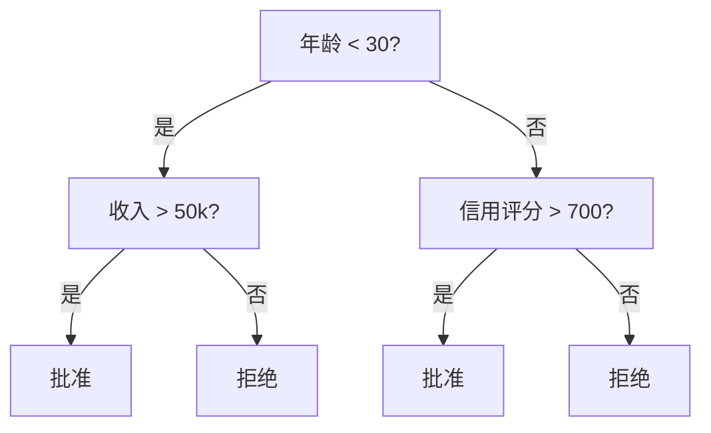
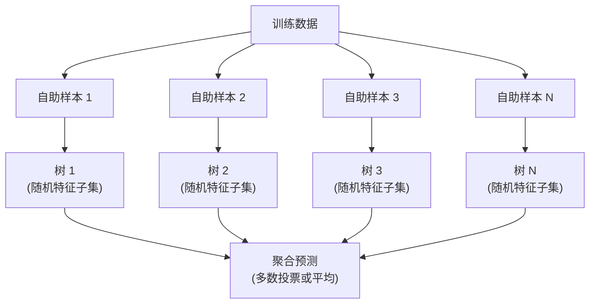

# 决策树与随机森林

> 决策树只是一个流程图。但一片森林（随机森林）是 ML 中最强大的工具之一。

**类型：** Build
**语言：** Python
**前置要求：** Phase 1（Lesson 09 信息论、06 概率）
**时长：** 约 90 分钟

## 学习目标

- 实现 Gini 不纯度、熵和信息增益计算，以找到最优决策树分裂
- 从零构建带预剪枝控制（最大深度、最少样本数）的决策树分类器
- 使用自助采样和特征随机化构建随机森林，并解释为什么它能降低方差
- 比较 MDI 特征重要性与置换重要性，并识别 MDI 何时有偏

## 问题背景

你有表格数据。行是样本，列是特征，有一个你想预测的目标列。你可以扔一个神经网络上去。但对于表格数据，基于树的方法（决策树、随机森林、梯度提升树）始终优于深度学习。结构化数据的 Kaggle 竞赛由 XGBoost 和 LightGBM 主导，而不是 Transformer。

为什么？树能原生处理混合特征类型（数值和类别）。无需特征工程即可处理非线性关系。它们可解释：你可以查看树并准确看到为什么做出预测。而随机森林，平均许多树，对中等规模数据集高度抗过拟合。

本课从零使用递归分裂构建决策树，然后在上面构建随机森林。你将实现分裂标准（Gini 不纯度、熵、信息增益）背后的数学，并理解弱学习器集合如何变成强学习器。

## 核心概念

### 决策树做什么

决策树通过一系列是/否问题将特征空间划分为矩形区域。



每个内部节点测试一个特征与阈值的比较。每个叶节点做出预测。要分类一个新数据点，从根开始，沿着分支直到到达叶。

树是从上到下构建的，在每个节点选择最好分离数据的特征和阈值。"最好"由分裂标准定义。

### 分裂标准：测量不纯度

在每个节点，我们有一组样本。我们想分裂它们，使子节点尽可能"纯"，意味着每个子节点主要包含一个类。

**Gini 不纯度**测量如果一个随机选择的样本根据该节点处的类分布被标记时被错误分类的概率。

```
Gini(S) = 1 - sum(p_k^2)

其中 p_k 是集合 S 中类 k 的比例。
```

对于纯节点（全部一个类），Gini = 0。对于 50/50 类别的二元分裂，Gini = 0.5。越低越好。

```
示例：6 只猫，4 只狗

Gini = 1 - (0.6^2 + 0.4^2) = 1 - (0.36 + 0.16) = 0.48
```

**熵**测量节点的信息内容（无序）。在 Phase 1 Lesson 09 讲过。

```
Entropy(S) = -sum(p_k * log2(p_k))
```

对于纯节点，熵 = 0。对于 50/50 二元分裂，熵 = 1.0。越低越好。

```
示例：6 只猫，4 只狗

Entropy = -(0.6 * log2(0.6) + 0.4 * log2(0.4))
        = -(0.6 * -0.737 + 0.4 * -1.322)
        = 0.442 + 0.529
        = 0.971 bits
```

**信息增益**是分裂后不纯度（熵或 Gini）的减少。

```
IG(S, feature, threshold) = Impurity(S) - weighted_avg(Impurity(S_left), Impurity(S_right))

其中权重是每个子节点中样本的比例。
```

每个节点的贪心算法：尝试每个特征和每个可能的阈值。选择最大化信息增益的（特征，阈值）对。

### 分裂如何工作

对于当前节点有 n 个特征和 m 个样本的数据集：

1. 对于每个特征 j（j = 1 到 n）：
   - 按特征 j 对样本排序
   - 尝试每个连续不同值之间的中点作为阈值
   - 计算每个阈值的信息增益
2. 选择信息增益最高的特征和阈值
3. 将数据分裂为左（特征 <= 阈值）和右（特征 > 阈值）
4. 递归到每个子节点

这种贪心方法不能保证全局最优树。找最优树是 NP 难。但贪心分裂在实践中效果很好。

### 停止条件

没有停止条件，树会一直生长，直到每个叶都是纯的（每个叶一个样本）。这完美记忆了训练数据，泛化极差。

**预剪枝**在树完全生长之前停止：
- 最大深度：当树达到设定深度时停止分裂
- 叶最小样本数：如果节点少于 k 个样本则停止
- 最小信息增益：如果最佳分裂改善不纯度小于阈值则停止
- 最大叶节点数：限制叶的总数

**后剪枝**生长完整树，然后修剪：
- 成本复杂度剪枝（scikit-learn 使用）：添加与叶数成正比的惩罚。增加惩罚得到更小的树
- 减少误差剪枝：如果验证误差不增加则删除子树

预剪枝更简单更快。后剪枝通常产生更好的树，因为它不会过早停止可能导致有用进一步分裂的分裂。

### 用于回归的决策树

对于回归，叶预测是该叶中目标值的均值。分裂标准也改变了：

**方差减少**取代信息增益：

```
VR(S, feature, threshold) = Var(S) - weighted_avg(Var(S_left), Var(S_right))
```

选择减少方差最多的分裂。树将输入空间划分为区域，在每个区域预测一个常数（均值）。

### 随机森林：集成的力量

单个决策树方差高。数据中的小变化可能产生完全不同的树。随机森林通过平均许多树来解决这个问题。



两个随机性来源使树多样化：

**Bagging（自助聚合）：** 每棵树在自助样本上训练，即从训练数据中有放回地随机抽样。每个自助样本约有 63% 的原始样本出现（其余是袋外样本，可用于验证）。

**特征随机化：** 在每次分裂时，只考虑特征的随机子集。对于分类，默认是 sqrt(n_features)。对于回归，n_features/3。这防止所有树在相同主导特征上分裂。

关键洞察：平均许多去相关树减少方差而不增加偏差。每棵单独的树可能很一般。集成却很强。

### 特征重要性

随机森林自然提供特征重要性分数。最常见的方法：

**平均不纯度减少（MDI）：** 对于每个特征，汇总该特征使用的所有树和所有节点的不纯度总减少。在较早分裂产生更大不纯度减少的特征更重要。

```
importance(feature_j) = 对所有使用 feature_j 的节点求和：
    (节点样本数 / 总样本数) * 不纯度减少
```

这很快（在训练期间计算）但对高基数特征和有更多可能分裂点的特征有偏。

**置换重要性**是替代方案：打乱一个特征的值，测量模型准确率下降多少。更可靠但更慢。

### 何时树胜于神经网络

树和森林在表格数据上主导神经网络。原因如下：

| 因素 | 树 | 神经网络 |
|------|------|----------|
| 混合类型（数值 + 类别） | 原生支持 | 需要编码 |
| 小数据集（< 10k 行） | 效果好 | 过拟合 |
| 特征交互 | 通过分裂发现 | 需要架构设计 |
| 可解释性 | 完全透明 | 黑箱 |
| 训练时间 | 分钟 | 小时 |
| 超参数敏感性 | 低 | 高 |

当数据有空间或序列结构（图像、文本、音频）时神经网络胜出。对于平坦的特征表，树是默认选择。

## 动手实现

### 步骤 1：Gini 不纯度和熵

从零构建两个分裂标准，并验证它们对好分裂的看法一致。

```python
import math

def gini_impurity(labels):
    n = len(labels)
    if n == 0:
        return 0.0
    counts = {}
    for label in labels:
        counts[label] = counts.get(label, 0) + 1
    return 1.0 - sum((c / n) ** 2 for c in counts.values())

def entropy(labels):
    n = len(labels)
    if n == 0:
        return 0.0
    counts = {}
    for label in labels:
        counts[label] = counts.get(label, 0) + 1
    return -sum(
        (c / n) * math.log2(c / n) for c in counts.values() if c > 0
    )
```

### 步骤 2：找到最佳分裂

尝试每个特征和每个阈值。返回信息增益最高的。

```python
def information_gain(parent_labels, left_labels, right_labels, criterion="gini"):
    measure = gini_impurity if criterion == "gini" else entropy
    n = len(parent_labels)
    n_left = len(left_labels)
    n_right = len(right_labels)
    if n_left == 0 or n_right == 0:
        return 0.0
    parent_impurity = measure(parent_labels)
    child_impurity = (
        (n_left / n) * measure(left_labels) +
        (n_right / n) * measure(right_labels)
    )
    return parent_impurity - child_impurity
```

### 步骤 3：构建 DecisionTree 类

递归分裂、预测和特征重要性追踪。

```python
class DecisionTree:
    def __init__(self, max_depth=None, min_samples_split=2,
                 min_samples_leaf=1, criterion="gini",
                 max_features=None):
        self.max_depth = max_depth
        self.min_samples_split = min_samples_split
        self.min_samples_leaf = min_samples_leaf
        self.criterion = criterion
        self.max_features = max_features
        self.tree = None
        self.feature_importances_ = None

    def fit(self, X, y):
        self.n_features = len(X[0])
        self.feature_importances_ = [0.0] * self.n_features
        self.n_samples = len(X)
        self.tree = self._build(X, y, depth=0)
        total = sum(self.feature_importances_)
        if total > 0:
            self.feature_importances_ = [
                fi / total for fi in self.feature_importances_
            ]

    def predict(self, X):
        return [self._predict_one(x, self.tree) for x in X]
```

### 步骤 4：构建 RandomForest 类

自助采样、特征随机化和多数投票。

```python
class RandomForest:
    def __init__(self, n_trees=100, max_depth=None,
                 min_samples_split=2, max_features="sqrt",
                 criterion="gini"):
        self.n_trees = n_trees
        self.max_depth = max_depth
        self.min_samples_split = min_samples_split
        self.max_features = max_features
        self.criterion = criterion
        self.trees = []

    def fit(self, X, y):
        n = len(X)
        for _ in range(self.n_trees):
            indices = [random.randint(0, n - 1) for _ in range(n)]
            X_boot = [X[i] for i in indices]
            y_boot = [y[i] for i in indices]
            tree = DecisionTree(
                max_depth=self.max_depth,
                min_samples_split=self.min_samples_split,
                max_features=self.max_features,
                criterion=self.criterion,
            )
            tree.fit(X_boot, y_boot)
            self.trees.append(tree)

    def predict(self, X):
        all_preds = [tree.predict(X) for tree in self.trees]
        predictions = []
        for i in range(len(X)):
            votes = {}
            for preds in all_preds:
                v = preds[i]
                votes[v] = votes.get(v, 0) + 1
            predictions.append(max(votes, key=votes.get))
        return predictions
```

完整实现见 `code/trees.py`，包含所有辅助方法。

## 用现成库

使用 scikit-learn，训练随机森林只需三行：

```python
from sklearn.ensemble import RandomForestClassifier
from sklearn.datasets import load_iris
from sklearn.model_selection import train_test_split

X, y = load_iris(return_X_y=True)
X_train, X_test, y_train, y_test = train_test_split(X, y, random_state=42)

rf = RandomForestClassifier(n_estimators=100, random_state=42)
rf.fit(X_train, y_train)
print(f"准确率: {rf.score(X_test, y_test):.4f}")
print(f"特征重要性: {rf.feature_importances_}")
```

实践中，梯度提升树（XGBoost、LightGBM、CatBoost）通常比随机森林更强，因为它们顺序构建树，每棵树纠正前一辆车的错误。但随机森林更难配置错误，几乎不需要超参数调优。

## 产出

本课产出 `outputs/prompt-tree-interpreter.md`——解释决策树分裂供业务利益相关者理解的 prompt。给它一个训练好的树的结构（深度、特征、分裂阈值、准确率），它将模型翻译成通俗语言规则，对特征重要性排序，标记过拟合或泄露，并推荐后续步骤。每当你需要向不读代码的人解释基于树的模型时使用它。

## 练习

1. 在 2D 数据集上训练单个决策树（3 类）。手动追踪分裂并绘制矩形决策边界。比较 max_depth=2 与 max_depth=10 的边界。
2. 实现回归树的方差减少分裂。为 200 个点生成 y = sin(x) + noise 并拟合你的回归树。将树的分段常数预测与真实曲线对比绘制。
3. 构建 1、5、10、50 和 200 棵树的随机森林。绘制训练准确率和测试准确率 vs 树的数量。观察测试准确率稳定但不下降（森林抗过拟合）。
4. 在 5 个不同数据集上比较 Gini 不纯度 vs 熵作为分裂标准。测量准确率和树深度。在大多数情况下，它们产生几乎相同的结果。解释原因。
5. 实现置换重要性。在一个特征是随机噪声但有高基数的数据集上与 MDI 重要性比较。MDI 会将噪声特征排名很高。置换重要性不会。

## 关键术语

| 术语 | 常见说法 | 真正含义 |
|------|----------|----------|
| 决策树 | "预测的流程图" | 通过学习一系列 if/else 分裂将特征空间划分为矩形区域的模型 |
| Gini 不纯度 | "节点有多混杂" | 在节点错误分类随机样本的概率。0 = 纯，0.5 = 二元最大不纯度 |
| 熵 | "节点的无序" | 节点的信息内容。0 = 纯，1.0 = 二元最大不确定性。来自信息论 |
| 信息增益 | "分裂有多好" | 分裂后不纯度的减少。选择分裂的贪心标准 |
| 预剪枝 | "早点停止树" | 通过设置最大深度、最少样本或最小增益阈值提前停止树生长 |
| 后剪枝 | "之后修剪树" | 生长完整树，然后删除不能改善验证性能的子树 |
| Bagging | "在随机子集上训练" | 自助聚合。在有放回的不同随机样本上训练每个模型 |
| 随机森林 | "一堆树" | 决策树集成，每棵在自助样本上训练，每次分裂使用随机特征子集 |
| 特征重要性（MDI） | "哪些特征重要" | 每个特征贡献的不纯度总减少，在所有树和节点上求和 |
| 置换重要性 | "打乱并检查" | 特征值随机打乱时准确率下降。比 MDI 对噪声特征更可靠 |
| 方差减少 | "回归版信息增益" | 信息增益的回归树类比。选择减少目标方差最多的分裂 |
| 自助样本 | "有重复的随机样本" | 从原始数据集有放回地抽取的随机样本。相同大小，但有重复 |

## 延伸阅读

- [Breiman: Random Forests (2001)](https://link.springer.com/article/10.1023/A:1010933404324) - 原始随机森林论文
- [Grinsztajn et al.: Why do tree-based models still outperform deep learning on tabular data? (2022)](https://arxiv.org/abs/2207.08815) - 树 vs 神经网络在表格任务上的严格比较
- [scikit-learn 决策树文档](https://scikit-learn.org/stable/modules/tree.html) - 带可视化工具的实践指南
- [XGBoost: A Scalable Tree Boosting System (Chen & Guestrin, 2016)](https://arxiv.org/abs/1603.02754) - 在 Kaggle 占主导地位的梯度提升论文