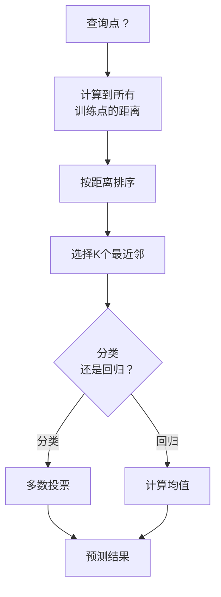
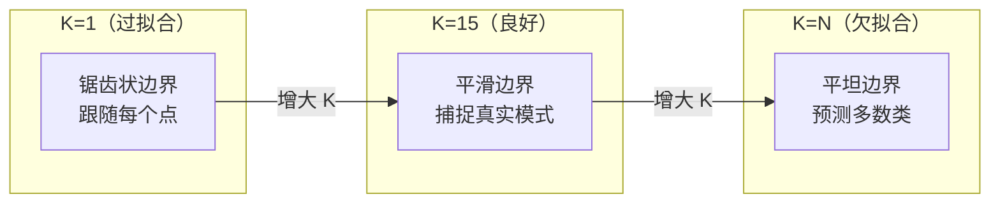
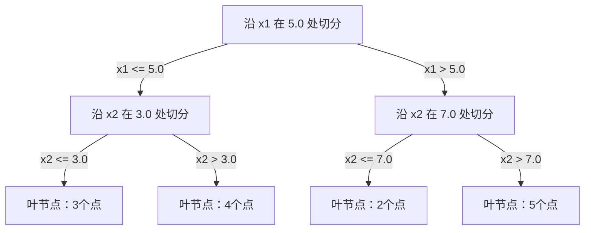

# K近邻与距离

> 存储一切，通过查看邻居来进行预测。最简单却真正有效的算法。

**类型：** 构建
**语言：** Python
**前置知识：** Phase 1（第14课 范数与距离）
**时间：** 约90分钟

## 学习目标

- 从零实现支持可配置 K 值和距离加权投票的 KNN 分类器和回归器
- 比较 L1、L2、余弦和 Minkowski 距离度量，并为给定数据类型选择合适的距离度量
- 解释维度灾难，并演示 KNN 在高维空间中性能下降的原因
- 构建 KD树以实现高效的最近邻搜索，并分析其何时优于暴力搜索

## 问题

你有一个数据集。一个新的数据点到达了。你需要对它进行分类或预测它的值。与从数据中学习参数的方法（如线性回归或 SVM）不同，你只需要找到与新点距离最近的 K 个训练点，然后让它们投票。

这就是 K近邻（KNN）。没有训练阶段。没有要学习的参数。没有要最小化的损失函数。你存储整个训练集，在预测时计算距离。

这听起来太简单了，不像是能work的算法。但 KNN 在很多问题上出奇地有竞争力，尤其是在中小型数据集上。深入理解它可以揭示一些基本概念：距离度量的选择（连接到 Phase 1 第14课）、维度灾难，以及惰性学习与积极学习的区别。

KNN 还以不同的名称广泛出现在现代 AI 中。向量数据库在嵌入向量上做 KNN 搜索。检索增强生成（RAG）找到 K 个最近的文档块。推荐系统找到相似的用户或物品。算法是相同的，规模和数据结构不同。

## 概念

### KNN 如何工作

给定一个带标签点的数据集和一个新的查询点：

1. 计算查询点到数据集中每个点的距离
2. 按距离排序
3. 取距离最近的 K 个点
4. 分类：在这 K 个邻居中多数投票
5. 回归：对 K 个邻居的值取平均（或加权平均）



这就是整个算法。不需要拟合、不需要梯度下降、不需要轮次。

### 选择 K

K 是唯一的超参数。它控制偏差-方差权衡：

| K | 行为 |
|---|------|
| K = 1 | 决策边界跟随每个点。训练误差为零。高方差。过拟合 |
| 小 K（3-5） | 对局部结构敏感。可以捕捉复杂的边界 |
| 大 K | 边界更平滑。对噪声更鲁棒。可能会欠拟合 |
| K = N | 对每个点都预测多数类。最大偏差 |

一个常见的起点是 K = sqrt(N)（N 为数据点数）。对于二分类，使用奇数 K 以避免平票。



### 距离度量

距离函数定义了什么是"近"。不同的度量产生不同的邻居和不同的预测。

**L2（欧几里得）** 是默认选项。直线距离。

```
d(a, b) = sqrt(sum((a_i - b_i)^2))
```

对特征尺度敏感。使用 L2 做 KNN 前务必对特征进行标准化。

**L1（曼哈顿）** 求绝对差之和。比 L2 更抗离群点，因为它不对差值做平方。

```
d(a, b) = sum(|a_i - b_i|)
```

**余弦距离** 测量向量之间的角度，忽略大小。对于文本和嵌入数据必不可少。

```
d(a, b) = 1 - (a . b) / (||a|| * ||b||)
```

**Minkowski** 用参数 p 将 L1 和 L2 统一推广。

```
d(a, b) = (sum(|a_i - b_i|^p))^(1/p)

p=1: 曼哈顿
p=2: 欧几里得
p->inf: 切比雪夫（最大绝对差）
```

使用哪种度量取决于数据：

| 数据类型 | 最佳度量 | 原因 |
|---------|---------|------|
| 数值特征，尺度相近 | L2（欧几里得） | 默认，适用于空间数据 |
| 数值特征，含离群点 | L1（曼哈顿） | 鲁棒，不会放大大的差异 |
| 文本嵌入 | 余弦 | 大小是噪声，方向才是语义 |
| 高维稀疏数据 | 余弦或 L1 | L2 受维度灾难影响严重 |
| 混合类型 | 自定义距离 | 按特征类型组合不同度量 |

### 加权 KNN

标准 KNN 对所有 K 个邻居给予相同权重。但距离为 0.1 的邻居应该比距离为 5.0 的邻居更重要。

**距离加权 KNN** 按距离的倒数对每个邻居加权：

```
weight_i = 1 / (distance_i + epsilon)

分类：加权投票
回归：加权平均 = sum(w_i * y_i) / sum(w_i)
```

epsilon 防止查询点与某个训练点完全匹配时分母为零。

加权 KNN 对 K 的选择不那么敏感，因为无论 K 多大，距离远的邻居贡献都非常小。

### 维度灾难

KNN 在高维空间中性能下降。这不是一个模糊的担忧，而是一个数学事实。

**问题1：距离收敛。** 随着维度增加，最大距离与最小距离的比值趋近于 1。所有点到查询点的"距离"都变得差不多。

```
在 d 维空间中，对于随机均匀分布的点：

d=2:    max_dist / min_dist = 差异很大
d=100:  max_dist / min_dist ~ 1.01
d=1000: max_dist / min_dist ~ 1.001

当所有距离几乎相等时，"最近邻"变得毫无意义。
```

**问题2：体积爆炸。** 要在数据固定比例范围内捕获 K 个邻居，你需要将搜索半径扩展到覆盖特征空间的更大比例。在高维空间中，"邻域"涵盖了大部分空间。

**问题3：角落主导。** 在 d 维单位超立方体中，大部分体积集中在角落附近，而不是中心。内接于立方体的超球体在 d 增长时只包含总体积的一个消失的分数。

实际后果：KNN 在大约 20-50 个特征以下表现良好。超过这个数量，在应用 KNN 之前需要做降维（PCA、UMAP、t-SNE），或者需要使用利用数据内在低维结构的树状搜索结构。

### KD树：快速最近邻搜索

暴力 KNN 计算查询点到每个训练点的距离。每次查询 O(n * d)。对于大数据集，这太慢了。

KD树沿特征轴递归划分空间。在每一层，它按中位数沿一个维度进行切分。



要找到最近邻，先遍历树到包含查询点的叶节点，然后回溯，只检查可能有更近点的相邻分区。

平均查询时间：低维下 O(log n)。但 KD树在高维（d > 20）下降为 O(n)，因为回溯剪枝的分支越来越少。

### 球树：更适合中等维度

球树将数据划分为嵌套的超球体，而不是轴对齐的盒子。每个节点定义一个球（圆心 + 半径），包含该子树下所有点。

相比 KD树的优势：
- 在中等维度（最高约50维）表现更好
- 能处理非轴对齐的结构
- 更紧密的边界体积意味着搜索时可以剪掉更多分支

KD树和球树都是精确算法。对于真正大规模的搜索（数百万个点、数百个维度），使用近似最近邻方法（HNSW、IVF、乘积量化）来替代。这些在 Phase 1 第14课中有介绍。

### 惰性学习 vs 积极学习

KNN 是一个惰性学习器：训练时不做事，所有工作都在预测时完成。大多数其他算法（线性回归、SVM、神经网络）是积极学习器：训练时做大量计算来构建一个紧凑的模型，之后预测很快。

| 方面 | 惰性（KNN） | 积极（SVM、神经网络） |
|-----|------------|---------------------|
| 训练时间 | O(1)，只需存储数据 | O(n * epochs) |
| 预测时间 | 每次查询 O(n * d) | O(d) 或 O(参数数量) |
| 预测时内存 | 存储整个训练集 | 只存储模型参数 |
| 适应新数据 | 即时添加点 | 重新训练模型 |
| 决策边界 | 隐式，实时计算 | 显式，训练后固定 |

惰性学习在以下情况下是理想的：
- 数据集经常变化（添加/删除点无需重新训练）
- 需要预测的查询非常少
- 希望零训练时间
- 数据集足够小，暴力搜索也很快

### KNN 回归

KNN 回归不是多数投票，而是对 K 个邻居的目标值取平均。

```
prediction = (1/K) * sum(y_i for i in K 个最近邻)

带距离加权时：
prediction = sum(w_i * y_i) / sum(w_i)
其中 w_i = 1 / distance_i
```

KNN 回归产生分段常数（或带加权时为分段平滑）的预测。它无法外推到训练数据范围之外。如果训练目标都在 0 到 100 之间，KNN 永远不会预测出 200。

## 构建

### 第1步：距离函数

实现 L1、L2、余弦和 Minkowski 距离。这些直接连接到 Phase 1 第14课。

```python
import math

def l2_distance(a, b):
    # L2 距离（欧几里得距离）
    return math.sqrt(sum((ai - bi) ** 2 for ai, bi in zip(a, b)))

def l1_distance(a, b):
    # L1 距离（曼哈顿距离）
    return sum(abs(ai - bi) for ai, bi in zip(a, b))

def cosine_distance(a, b):
    # 余弦距离
    dot_val = sum(ai * bi for ai, bi in zip(a, b))
    norm_a = math.sqrt(sum(ai ** 2 for ai in a))
    norm_b = math.sqrt(sum(bi ** 2 for bi in b))
    if norm_a == 0 or norm_b == 0:
        return 1.0
    return 1.0 - dot_val / (norm_a * norm_b)

def minkowski_distance(a, b, p=2):
    # Minkowski 距离（统一 L1 和 L2）
    if p == float('inf'):
        return max(abs(ai - bi) for ai, bi in zip(a, b))
    return sum(abs(ai - bi) ** p for ai, bi in zip(a, b)) ** (1 / p)
```

### 第2步：KNN 分类器和回归器

构建完整的 KNN，支持可配置的 K、距离度量以及可选的距离加权。

```python
class KNN:
    def __init__(self, k=5, distance_fn=l2_distance, weighted=False,
                 task="classification"):
        self.k = k
        self.distance_fn = distance_fn
        self.weighted = weighted
        self.task = task
        self.X_train = None
        self.y_train = None

    def fit(self, X, y):
        # 存储训练数据（KNN 没有真正的训练过程）
        self.X_train = X
        self.y_train = y

    def predict(self, X):
        return [self._predict_one(x) for x in X]
```

### 第3步：KD树实现高效搜索

从零构建 KD树，沿每个维度的中位数递归切分。

```python
class KDTree:
    def __init__(self, X, indices=None, depth=0):
        # 递归划分数据
        self.axis = depth % len(X[0])
        # 沿当前轴的中位数切分
        ...

    def query(self, point, k=1):
        # 遍历到叶节点，然后回溯
        ...
```

完整的实现及所有辅助方法和演示见 `code/knn.py`。

### 第4步：特征缩放

KNN 需要特征缩放，因为距离对特征量级敏感。范围为 0 到 1000 的特征会主导范围为 0 到 1 的特征。

```python
def standardize(X):
    # 标准化（z-score 标准化）
    n = len(X)
    d = len(X[0])
    means = [sum(X[i][j] for i in range(n)) / n for j in range(d)]
    stds = [
        max(1e-10, (sum((X[i][j] - means[j]) ** 2 for i in range(n)) / n) ** 0.5)
        for j in range(d)
    ]
    return [[((X[i][j] - means[j]) / stds[j]) for j in range(d)] for i in range(n)], means, stds
```

## 使用

用 scikit-learn：

```python
from sklearn.neighbors import KNeighborsClassifier
from sklearn.preprocessing import StandardScaler
from sklearn.pipeline import Pipeline

clf = Pipeline([
    ("scaler", StandardScaler()),
    ("knn", KNeighborsClassifier(n_neighbors=5, metric="euclidean")),
])
clf.fit(X_train, y_train)
print(f"Accuracy: {clf.score(X_test, y_test):.4f}")
```

scikit-learn 在数据集足够大、维度足够低时自动使用 KD树或球树。对于高维数据，它回退到暴力搜索。你可以通过 `algorithm` 参数控制这一行为。

对于大规模最近邻搜索（数百万个向量），使用 FAISS、Annoy 或向量数据库：

```python
import faiss

index = faiss.IndexFlatL2(dimension)
index.add(embeddings)
distances, indices = index.search(query_vectors, k=5)
```

## 练习

1. 在 2D 数据集（3个类别）上实现 KNN 分类。绘制 K=1、K=5、K=15 和 K=N 的决策边界。观察从过拟合到欠拟合的转变。

2. 在 2、5、10、50、100 和 500 维中分别生成 1000 个随机点。对每个维度，计算最大成对距离与最小成对距离的比值。绘制比值与维度的关系图，可视化维度灾难。

3. 对文本分类问题（使用 TF-IDF 向量）比较 L1、L2 和余弦距离的 KNN。哪种度量给出最高准确率？为什么余弦在文本上往往胜出？

4. 实现 KD树，并测量在 2D、10D 和 50D 维中，数据集规模为 1k、10k、100k 点时查询时间与暴力搜索的对比。KD树在什么维度下不再比暴力搜索快？

5. 为 y = sin(x) + noise 构建加权 KNN 回归器。将无加权 KNN 在 K=3、10、30 下进行对比。展示加权产生更平滑的预测，尤其是在大 K 时。

## 关键术语

| 术语 | 实际含义 |
|------|---------|
| K近邻 | 非参数算法，通过找到查询点最近的 K 个训练点来进行预测 |
| 惰性学习 | 训练时不计算，所有工作在预测时完成。KNN 是典型例子 |
| 积极学习 | 训练时做大量计算来构建紧凑模型。大多数 ML 算法都是积极的 |
| 维度灾难 | 在高维空间中，距离收敛，邻域扩展到覆盖大部分空间，使 KNN 失效 |
| KD树 | 二叉树，沿特征轴递归划分空间。低维下查询 O(log n) |
| 球树 | 嵌套超球体树。在中等维度（最高约50维）比 KD树表现更好 |
| 加权 KNN | 邻居按距离的倒数加权。近邻对预测的影响更大 |
| 特征缩放 | 将特征归一化到相近范围。对基于距离的方法（如 KNN）是必需的 |
| 多数投票 | 通过统计 K 个邻居中哪个类别最多来进行分类 |
| 暴力搜索 | 计算到每个训练点的距离。每次查询 O(n*d)。精确但大 n 时慢 |
| 近似最近邻 | 算法（HNSW、LSH、IVF）比精确搜索更快地找到近似最近点 |
| Voronoi 图 | 空间划分，每个区域包含到某个训练点比到其他任何点都更近的所有点。K=1 的 KNN 产生 Voronoi 边界 |

## 扩展阅读

- [Cover & Hart: Nearest Neighbor Pattern Classification (1967)](https://ieeexplore.ieee.org/document/1053964) - 开创性的 KNN 论文，证明其错误率最多为贝叶斯最优的两倍
- [Friedman, Bentley, Finkel: An Algorithm for Finding Best Matches in Logarithmic Expected Time (1977)](https://dl.acm.org/doi/10.1145/355744.355745) - 原始 KD树论文
- [Beyer et al.: When Is "Nearest Neighbor" Meaningful? (1999)](https://link.springer.com/chapter/10.1007/3-540-49257-7_15) - 最近邻维度灾难的形式化分析
- [scikit-learn Nearest Neighbors documentation](https://scikit-learn.org/stable/modules/neighbors.html) - 含算法选择指南的实用参考
- [FAISS: A Library for Efficient Similarity Search](https://github.com/facebookresearch/faiss) - Meta 的十亿级近似最近邻搜索库