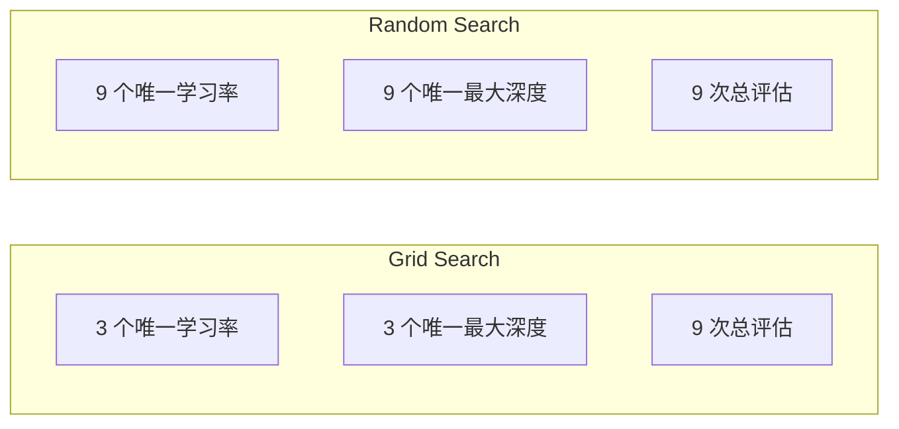
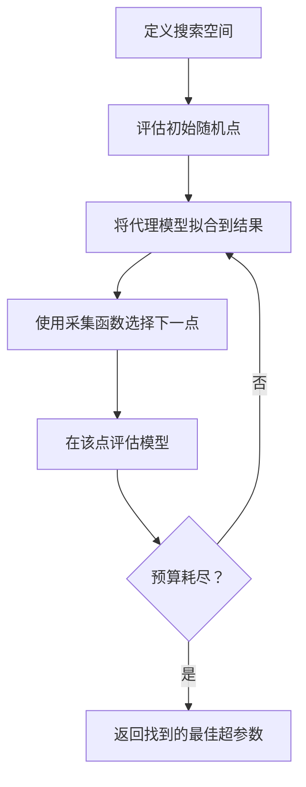
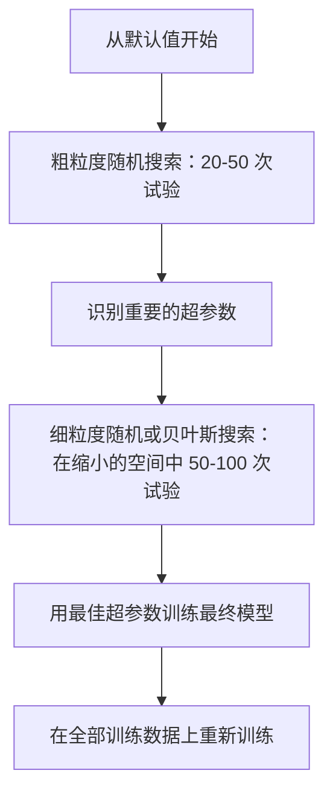
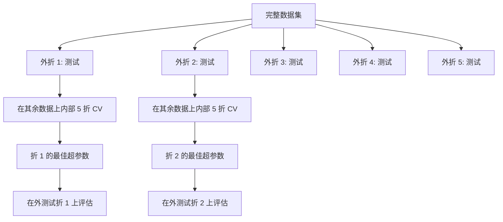

# 超参数调优

> 超参数是你在训练开始前转动的旋钮。转好它们，是普通模型和优秀模型之间的区别。

**类型：** 构建
**语言：** Python
**前置要求：** Phase 2, Lesson 11（集成方法）
**时间：** 约 90 分钟

## 学习目标

- 从零实现网格搜索、随机搜索和贝叶斯优化，并比较它们的样本效率
- 解释当大多数超参数具有低有效维度时，为什么随机搜索优于网格搜索
- 使用代理模型和采集函数构建贝叶斯优化循环来引导搜索
- 设计一个通过适当交叉验证避免过拟合验证集的超参数调优策略

## 问题

你的梯度提升模型有学习率、树数量、最大深度、每叶最小样本数、子采样比率和列采样比率。这是六个超参数。如果每个有 5 个合理值，网格有 5^6 = 15,625 种组合。训练每个需要 10 秒。全部尝试需要 43 小时的计算。

网格搜索是显而易见的方法，也是规模上最差的方法。随机搜索用更少的计算做得更好。贝叶斯优化通过从过去的评估中学习做得更好。知道使用哪种策略，以及哪些超参数真正重要，可以节省数天的浪费 GPU 时间。

## 概念

### 参数 vs 超参数

参数在训练期间学习（权重、偏置、分裂阈值）。超参数在训练开始前设置，控制学习如何发生。

| 超参数 | 控制什么 | 典型范围 |
|--------|---------|---------|
| 学习率 | 每次更新的步长 | 0.001 到 1.0 |
| 树数量/轮数 | 训练多长时间 | 10 到 10,000 |
| 最大深度 | 模型复杂度 | 1 到 30 |
| 正则化（lambda） | 防止过拟合 | 0.0001 到 100 |
| 批量大小 | 梯度估计噪声 | 16 到 512 |
| Dropout 比率 | 丢弃神经元的比例 | 0.0 到 0.5 |

### 网格搜索

网格搜索评估指定值的每个组合。它是穷尽的且易于理解，但随超参数数量指数增长。

```
2 个超参数的网格：

  learning_rate: [0.01, 0.1, 1.0]
  max_depth:     [3, 5, 7]

  评估次数：3 x 3 = 9 种组合

  (0.01, 3)  (0.01, 5)  (0.01, 7)
  (0.1,  3)  (0.1,  5)  (0.1,  7)
  (1.0,  3)  (1.0,  5)  (1.0,  7)
```

网格搜索有一个根本缺陷：如果一个超参数重要而另一个不重要，大多数评估被浪费。你从 9 次评估中只得到重要参数的唯一值。

### 随机搜索

随机搜索从分布中采样超参数，而不是网格。使用相同的 9 次评估预算，你得到每个超参数的 9 个唯一值。



为什么随机优于网格（Bergstra & Bengio, 2012）：

- 大多数超参数具有低有效维度。对于给定问题，通常只有 1-2 个（共 6 个）超参数真正重要。
- 网格搜索在不重要维度上浪费评估。
- 随机搜索以相同预算更密集地覆盖重要维度。
- 在 60 次随机试验中，你有 95% 的概率在搜索空间中找到最优点的 5% 以内（如果搜索空间中存在最优点）。

### 贝叶斯优化

随机搜索忽略结果。它不了解学习率高会导致发散，或深度 3 始终优于深度 10。贝叶斯优化使用过去的评估来决定下一步搜索哪里。



两个关键组件：

**代理模型：** 一个评估成本低（通常是高斯过程）的模型，逼近昂贵的目标函数。它在搜索空间中的任意点给出预测和不确定性估计。

**采集函数：** 通过平衡利用（搜索已知好点附近）和探索（搜索不确定性高的地方）来决定下一步评估哪里。常见选择：

- **期望改进（EI）：** 在这点上我们期望比当前最佳改进多少？
- **上置信界（UCB）：** 预测加上不确定性的一定倍数。较高的 UCB 意味着要么有前景，要么未被探索。
- **改进概率（PI）：** 这个点超过当前最佳的概率是多少？

贝叶斯优化通常以 2-5 倍更少的评估找到比随机搜索更好的超参数。拟合代理模型的开销与训练实际模型相比可以忽略不计。

### 早停

不是每个训练运行都需要完成。如果一个配置在 10 轮后明显很差，停止它并继续。这是超参数搜索背景下的早停。

策略：
- **耐心策略：** 如果验证损失连续 N 轮没有改善，停止
- **中位数剪枝：** 如果试验的中间结果差于同期完成试验的中位数，停止
- **Hyperband：** 给许多配置分配小预算，然后为最好的配置逐步增加预算

Hyperband 特别有效。它从 81 个配置各运行 1 轮开始，保留前三分之一，给它们 3 轮，保留前三分之一，以此类推。这比用完整预算评估所有配置快 10-50 倍找到好配置。

### 学习率调度器

学习率几乎总是最重要的超参数。调度器不是在训练期间保持固定，而是调整它。

| 调度器 | 公式 | 何时使用 |
|--------|------|---------|
| 步长衰减 | 每 N 轮乘以 0.1 | 经典 CNN 训练 |
| 余弦退火 | lr * 0.5 * (1 + cos(pi * t / T)) | 现代默认 |
| 预热 + 衰减 | 线性增加然后余弦衰减 | Transformer |
| 单周期 | 在一个周期内增加然后下降 | 快速收敛 |
|  plateau 时降低 | 指标停滞时按因子降低 | 安全默认 |

### 超参数重要性

并非所有超参数都同等重要。对随机森林（Probst 等人，2019）和梯度提升的研究显示了一致的模式：

**高重要性：**
- 学习率（始终首先调参）
- 树数量/轮数（使用早停而非调参）
- 正则化强度

**中等重要性：**
- 最大深度/层数
- 每叶最小样本数/权重衰减
- 子采样比率

**低重要性：**
- 最大特征数（对随机森林）
- 具体激活函数选择
- 批量大小（在合理范围内）

首先调参重要的，将其余保留为默认值。

### 实用策略



具体工作流：

1. **从库默认值开始。** 它们由经验丰富的从业者选择，通常已经达到 80% 的最优效果。
2. **粗粒度随机搜索。** 宽范围，20-50 次试验。使用早停快速终止差的运行。
3. **分析结果。** 哪些超参数与性能相关？缩小搜索空间。
4. **细搜索。** 在缩小的空间中用贝叶斯优化或聚焦的随机搜索。50-100 次试验。
5. **用找到的最佳超参数在全部训练数据上重新训练。**

### 交叉验证集成

在单一验证分割上调优超参数是冒险的。最佳超参数可能过拟合特定验证折。嵌套交叉验证通过使用两个循环来解决这个问题：

- **外循环**（评估）：将数据分割为训练+验证和测试。报告无偏性能。
- **内循环**（调参）：将训练+验证分割为训练和验证。找到最佳超参数。



每个外折独立找到自己的最佳超参数。外部分数是对泛化性能的无偏估计。

使用 sklearn：

```python
from sklearn.model_selection import cross_val_score, GridSearchCV
from sklearn.ensemble import GradientBoostingRegressor

inner_cv = GridSearchCV(
    GradientBoostingRegressor(),
    param_grid={
        "learning_rate": [0.01, 0.05, 0.1],
        "max_depth": [2, 3, 5],
        "n_estimators": [50, 100, 200],
    },
    cv=5,
    scoring="neg_mean_squared_error",
)

outer_scores = cross_val_score(
    inner_cv, X, y, cv=5, scoring="neg_mean_squared_error"
)

print(f"Nested CV MSE: {-outer_scores.mean():.4f} +/- {outer_scores.std():.4f}")
```

这是昂贵的（5 个外折 x 5 个内折 x 27 个网格点 = 675 次模型拟合），但它给你一个可信的性能估计。在论文中报告最终结果时或当决策 stakes 高时使用它。

### 实用技巧

**从学习率开始。** 它对于基于梯度的方法始终是最重要的超参数。一个差的学习率使其他一切都无关紧要。首先扫学习率，将其他超参数保持在默认值。

**对学习率和正则化使用对数均匀分布。** 0.001 和 0.01 之间的差异与 0.1 和 1.0 之间的差异同样重要。线性搜索在大的一端浪费预算。

**使用早停而非调参 n_estimators。** 对于提升和神经网络，设置高的 n_estimators 或轮数，让早停决定何时停止。这从搜索中移除一个超参数。

**预算分配。** 将调参预算的 60% 花在最重要的 2 个超参数上。其余 40% 花在其他所有上。前两个 accounted for 大多数性能变化。

**规模很重要。** 永远不要在对数尺度上搜索批量大小（16、32、64 都可以）。始终在对数尺度上搜索学习率。将搜索分布与超参数如何影响模型相匹配。

| 模型类型 | 最重要的超参数 | 建议搜索 | 预算 |
|---------|--------------|---------|------|
| 随机森林 | n_estimators, max_depth, min_samples_leaf | 随机搜索，50 次试验 | 低（训练快）|
| 梯度提升 | learning_rate, n_estimators, max_depth | 贝叶斯，100 次试验 + 早停 | 中 |
| 神经网络 | learning_rate, weight_decay, batch_size | 贝叶斯或随机，100+ 次试验 | 高（训练慢）|
| SVM | C, gamma（RBF 核）| 在对数尺度上网格，25-50 次试验 | 低（2 个参数）|
| Lasso/Ridge | alpha | 在对数尺度上 1D 搜索，20 次试验 | 非常低 |
| XGBoost | learning_rate, max_depth, subsample, colsample | 贝叶斯，100-200 次试验 + 早停 | 中 |

**有疑问时：** 用试验数量 2 倍的超参数数量进行随机搜索（例如，6 个超参数最少 12 次试验）。你会惊讶随机搜索用 50 次试验有多么频繁地打败精心设计的网格搜索。

## 构建

### 步骤 1：从零实现网格搜索

`code/tuning.py` 中的代码从头实现网格搜索、随机搜索和一个简单的贝叶斯优化器。

```python
def grid_search(model_fn, param_grid, X_train, y_train, X_val, y_val):
    keys = list(param_grid.keys())
    values = list(param_grid.values())
    best_score = -float("inf")
    best_params = None
    n_evals = 0

    for combo in itertools.product(*values):
        params = dict(zip(keys, combo))
        model = model_fn(**params)
        model.fit(X_train, y_train)
        score = evaluate(model, X_val, y_val)
        n_evals += 1

        if score > best_score:
            best_score = score
            best_params = params

    return best_params, best_score, n_evals
```

### 步骤 2：从零实现随机搜索

```python
def random_search(model_fn, param_distributions, X_train, y_train,
                  X_val, y_val, n_iter=50, seed=42):
    rng = np.random.RandomState(seed)
    best_score = -float("inf")
    best_params = None

    for _ in range(n_iter):
        params = {k: sample(v, rng) for k, v in param_distributions.items()}
        model = model_fn(**params)
        model.fit(X_train, y_train)
        score = evaluate(model, X_val, y_val)

        if score > best_score:
            best_score = score
            best_params = params

    return best_params, best_score, n_iter
```

### 步骤 3：贝叶斯优化（简化版）

核心思想：将高斯过程拟合到观察到的（超参数、分数）对，然后使用采集函数决定下一步去哪里。

```python
class SimpleBayesianOptimizer:
    def __init__(self, search_space, n_initial=5):
        self.search_space = search_space
        self.n_initial = n_initial
        self.X_observed = []
        self.y_observed = []

    def _kernel(self, x1, x2, length_scale=1.0):
        dists = np.sum((x1[:, None, :] - x2[None, :, :]) ** 2, axis=2)
        return np.exp(-0.5 * dists / length_scale ** 2)

    def _fit_gp(self, X_new):
        X_obs = np.array(self.X_observed)
        y_obs = np.array(self.y_observed)
        y_mean = y_obs.mean()
        y_centered = y_obs - y_mean

        K = self._kernel(X_obs, X_obs) + 1e-4 * np.eye(len(X_obs))
        K_star = self._kernel(X_new, X_obs)

        L = np.linalg.cholesky(K)
        alpha = np.linalg.solve(L.T, np.linalg.solve(L, y_centered))
        mu = K_star @ alpha + y_mean

        v = np.linalg.solve(L, K_star.T)
        var = 1.0 - np.sum(v ** 2, axis=0)
        var = np.maximum(var, 1e-6)

        return mu, var

    def _expected_improvement(self, mu, var, best_y):
        sigma = np.sqrt(var)
        z = (mu - best_y) / (sigma + 1e-10)
        ei = sigma * (z * norm_cdf(z) + norm_pdf(z))
        return ei

    def suggest(self):
        if len(self.X_observed) < self.n_initial:
            return sample_random(self.search_space)

        candidates = [sample_random(self.search_space) for _ in range(500)]
        X_cand = np.array([to_vector(c) for c in candidates])
        mu, var = self._fit_gp(X_cand)
        ei = self._expected_improvement(mu, var, max(self.y_observed))
        return candidates[np.argmax(ei)]

    def observe(self, params, score):
        self.X_observed.append(to_vector(params))
        self.y_observed.append(score)
```

GP 代理在每个候选点给出两样东西：预测分数（mu）和不确定性（var）。期望改进平衡这些：它青睐模型预测高分 OR 不确定性高的点。早期，大多数点有高不确定性，所以优化器探索。后期，它专注于最有前景的区域。

### 步骤 4：比较所有方法

在相同的合成目标上运行所有三种方法并比较。此比较使用一个简化的封装，调用每个优化器使用直接目标函数（无模型训练），所以 API 不同于上面的基于模型的实现：

```python
def synthetic_objective(params):
    lr = params["learning_rate"]
    depth = params["max_depth"]
    return -(np.log10(lr) + 2) ** 2 - (depth - 4) ** 2 + 10

param_grid = {
    "learning_rate": [0.001, 0.01, 0.1, 1.0],
    "max_depth": [2, 3, 4, 5, 6, 7, 8],
}

grid_best = None
grid_score = -float("inf")
grid_history = []
for combo in itertools.product(*param_grid.values()):
    params = dict(zip(param_grid.keys(), combo))
    score = synthetic_objective(params)
    grid_history.append((params, score))
    if score > grid_score:
        grid_score = score
        grid_best = params

param_dist = {
    "learning_rate": ("log_float", 0.001, 1.0),
    "max_depth": ("int", 2, 8),
}

rand_best = None
rand_score = -float("inf")
rand_history = []
rng = np.random.RandomState(42)
for _ in range(28):
    params = {k: sample(v, rng) for k, v in param_dist.items()}
    score = synthetic_objective(params)
    rand_history.append((params, score))
    if score > grid_score:
        rand_score = score
        rand_best = params

optimizer = SimpleBayesianOptimizer(param_dist, n_initial=5)
bayes_history = []
for _ in range(28):
    params = optimizer.suggest()
    score = synthetic_objective(params)
    optimizer.observe(params, score)
    bayes_history.append((params, score))
bayes_score = max(s for _, s in bayes_history)

print(f"{'Method':<20} {'Best Score':>12} {'Evaluations':>12}")
print("-" * 50)
print(f"{'Grid Search':<20} {grid_score:>12.4f} {len(grid_history):>12}")
print(f"{'Random Search':<20} {rand_score:>12.4f} {len(rand_history):>12}")
print(f"{'Bayesian Opt':<20} {bayes_score:>12.4f} {len(bayes_history):>12}")
```

使用相同预算，贝叶斯优化通常最快找到最佳分数，因为它不在明显糟糕的区域浪费评估。随机搜索比网格搜索覆盖更多区域。只有当你只有很少的超参数且可以承受穷尽时，网格搜索才会赢。

## 使用

### Optuna 实践

Optuna 是严肃超参数调优的推荐库。它开箱即用地支持剪枝、分布式搜索和可视化。

```python
import optuna

def objective(trial):
    lr = trial.suggest_float("learning_rate", 1e-4, 1e-1, log=True)
    n_est = trial.suggest_int("n_estimators", 50, 500)
    max_depth = trial.suggest_int("max_depth", 2, 10)

    model = GradientBoostingRegressor(
        learning_rate=lr,
        n_estimators=n_est,
        max_depth=max_depth,
    )
    model.fit(X_train, y_train)
    return mean_squared_error(y_val, model.predict(X_val))

study = optuna.create_study(direction="minimize")
study.optimize(objective, n_trials=100)

print(f"Best params: {study.best_params}")
print(f"Best MSE: {study.best_value:.4f}")
```

Optuna 关键特性：
- `suggest_float(..., log=True)` 用于最好在对数尺度上搜索的参数（学习率、正则化）
- `suggest_int` 用于整数参数
- `suggest_categorical` 用于离散选择
- 内置 MedianPruner 用于早停坏的试验
- `study.trials_dataframe()` 用于分析

### 带剪枝的 Optuna

剪枝提前停止无前途的试验，节省大量计算。这是模式：

```python
import optuna
from sklearn.model_selection import cross_val_score

def objective(trial):
    params = {
        "learning_rate": trial.suggest_float("lr", 1e-4, 0.5, log=True),
        "max_depth": trial.suggest_int("max_depth", 2, 10),
        "n_estimators": trial.suggest_int("n_estimators", 50, 500),
        "subsample": trial.suggest_float("subsample", 0.5, 1.0),
    }

    model = GradientBoostingRegressor(**params)
    scores = cross_val_score(model, X_train, y_train, cv=3,
                             scoring="neg_mean_squared_error")
    mean_score = -scores.mean()

    trial.report(mean_score, step=0)
    if trial.should_prune():
        raise optuna.TrialPruned()

    return mean_score

pruner = optuna.pruners.MedianPruner(n_startup_trials=10, n_warmup_steps=5)
study = optuna.create_study(direction="minimize", pruner=pruner)
study.optimize(objective, n_trials=200)
```

`MedianPruner` 如果试验的中间值差于同期所有已完成试验的中位数，则停止该试验。剪枝需要调用 `trial.report()` 报告中间指标，`trial.should_prune()` 检查试验是否应停止。`n_startup_trials=10` 确保在剪枝启动前至少 10 个试验完全完成。这通常节省总计算的 40-60%。

### sklearn 内置调参器

对于快速实验，sklearn 提供 `GridSearchCV`、`RandomizedSearchCV` 和 `HalvingRandomSearchCV`：

```python
from sklearn.model_selection import RandomizedSearchCV
from scipy.stats import loguniform, randint

param_dist = {
    "learning_rate": loguniform(1e-4, 0.5),
    "max_depth": randint(2, 10),
    "n_estimators": randint(50, 500),
}

search = RandomizedSearchCV(
    GradientBoostingRegressor(),
    param_dist,
    n_iter=100,
    cv=5,
    scoring="neg_mean_squared_error",
    random_state=42,
    n_jobs=-1,
)
search.fit(X_train, y_train)
print(f"Best params: {search.best_params_}")
print(f"Best CV MSE: {-search.best_score_:.4f}")
```

对学习率和正则化使用 scipy 的 `loguniform`。对整数超参数使用 `randint`。`n_jobs=-1` 标志跨所有 CPU 核心并行化。

### 超参数调优中的常见错误

**通过预处理的数据泄露。** 如果在交叉验证前在整个数据集上拟合 scaler，验证折的信息泄露到训练中。始终将预处理放在 `Pipeline` 内，这样它只会在训练折上拟合。

**过拟合验证集。** 运行数千次试验实际上是训练验证集。对于最终性能估计使用嵌套交叉验证，或留出一个在调参期间从不触碰的单独测试集。

**搜索范围太窄。** 如果你的最佳值在搜索空间的边界上，你搜索得不够宽。最优值可能在你的范围之外。始终检查最佳参数是否在边缘。

**忽略交互效应。** 学习率和树数量在提升中强烈交互。低学习率需要更多树。独立调参比一起调参效果差。

**对迭代模型不使用早停。** 对于梯度提升和神经网络，将 n_estimators 或轮数设置为一个高值并使用早停。这严格优于将迭代次数作为超参数调参。

## 练习

1. 用相同总预算（例如 50 次评估）运行网格搜索和随机搜索。比较找到的最佳分数。用不同种子运行实验 10 次。随机搜索赢的频率是多少？

2. 从零实现 Hyperband。从 81 个配置开始，每个训练 1 轮。在每轮保留前 1/3，并将它们的预算增加三倍。将总计算（所有配置的所有轮之和）与以完整预算运行 81 个配置进行比较。

3. 在 Lesson 11 的梯度提升实现中添加学习率调度器（余弦退火）。与固定学习率相比，它有帮助吗？

4. 使用 Optuna 在真实数据集上（例如 sklearn 的乳腺癌数据集）调优 RandomForestClassifier。使用 `optuna.visualization.plot_param_importances(study)` 查看哪些超参数最重要。它与本课的重要性排名匹配吗？

5. 实现一个简单的采集函数（期望改进）并展示探索 vs 利用。绘制代理模型的均值和不确定性，并显示 EI 选择下一步评估哪里。

## 关键术语

| 术语 | 人们怎么说 | 实际含义 |
|------|-----------|---------|
| 超参数（Hyperparameter）| "你选择的一个设置" | 训练前设置的值，控制学习过程，不从数据学习 |
| 网格搜索 | "尝试每个组合" | 在指定参数网格上的穷尽搜索。指数成本。 |
| 随机搜索 | "只是随机采样" | 从分布中采样超参数。比网格搜索更好地覆盖重要维度。 |
| 贝叶斯优化 | "智能搜索" | 使用目标函数的代理模型决定下一步评估哪里，平衡探索和利用 |
| 代理模型 | "一个廉价近似" | 一个模型（通常是高斯过程），从观察到的评估逼近昂贵的目标函数 |
| 采集函数 | "下一步去哪里" | 通过平衡期望改进与不确定性对候选点评分。EI 和 UCB 是常见选择。 |
| 早停 | "停止浪费时间" | 当验证性能停止改善时提前终止训练 |
| Hyperband | "配置的淘汰赛" | 自适应资源分配：从许多小预算的配置开始，保留最好的并增加它们的预算 |
| 学习率调度器 | "训练期间改变 lr" | 在训练过程中调整学习率的函数，以获得更好收敛 |

## 扩展阅读

- [Bergstra & Bengio: Random Search for Hyper-Parameter Optimization (2012)](https://jmlr.org/papers/v13/bergstra12a.html) -- 证明随机优于网格的论文
- [Snoek et al., Practical Bayesian Optimization of Machine Learning Algorithms (2012)](https://arxiv.org/abs/1206.2944) -- ML 贝叶斯优化
- [Li et al., Hyperband: A Novel Bandit-Based Approach (2018)](https://jmlr.org/papers/v18/16-558.html) -- Hyperband 论文
- [Optuna: A Next-generation Hyperparameter Optimization Framework](https://arxiv.org/abs/1907.10902) -- Optuna 论文
- [Probst et al., Tunability: Importance of Hyperparameters (2019)](https://jmlr.org/papers/v20/18-444.html) -- 哪些超参数重要