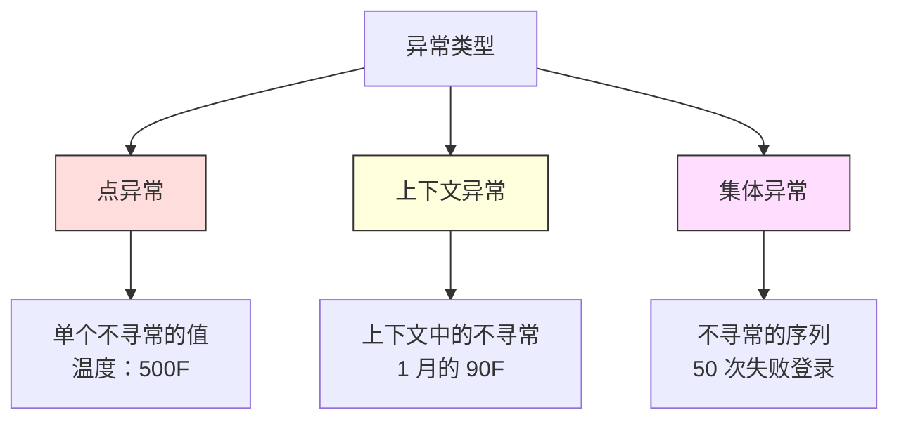
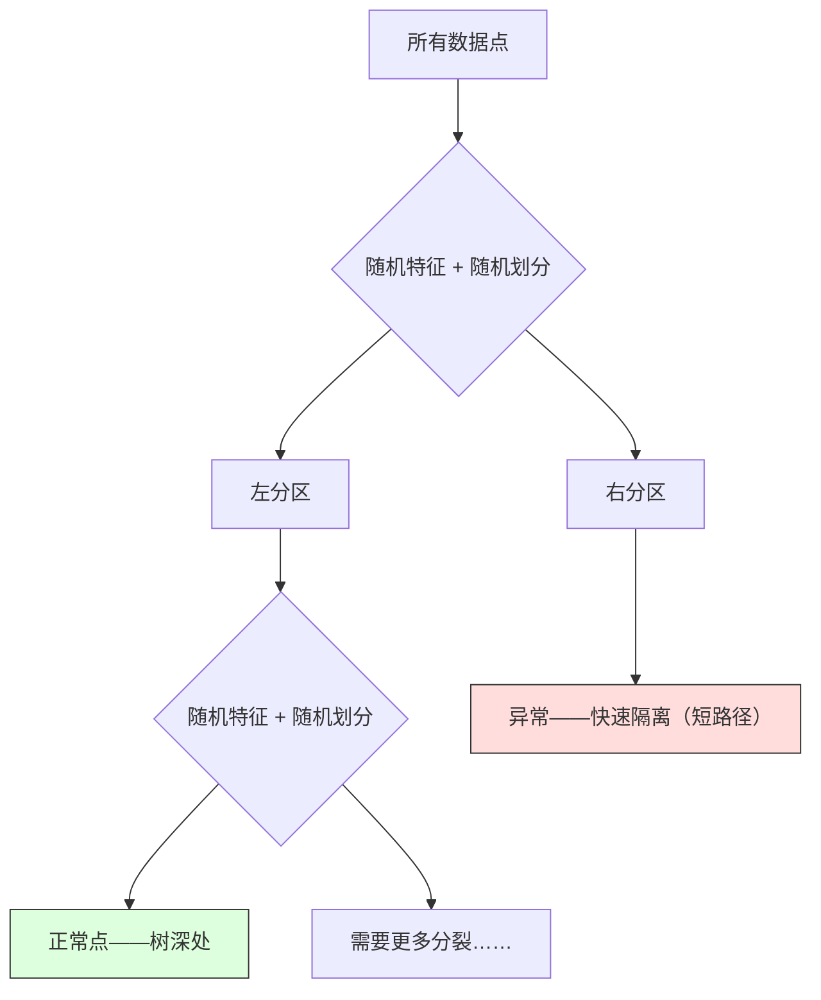

# 异常检测

> 正常很容易定义。异常就是任何不符合的东西。

**类型：** Build
**语言：** Python
**前置条件：** Phase 2, Lessons 01-09
**时间：** 约 75 分钟

## 学习目标

- 从零实现 Z-score、IQR 和孤立森林异常检测方法
- 区分点异常、上下文异常和集体异常，并为每种类型选择适当的检测方法
- 解释为什么异常检测被框定为建模正常数据而不是分类异常
- 比较无监督异常检测与有监督分类，并评估新异常覆盖率和精确率之间的权衡

## 问题背景

一张信用卡下午 2 点在纽约使用，然后 2:05 在东京使用。一个工厂传感器读数为 150 度，而正常范围是 80-120。一台服务器每秒发送 50000 个请求，而日均只有 200。

这些是异常。发现它们很重要。欺诈造成数十亿美元损失。设备故障造成停机。网络入侵造成数据泄露。

挑战在于：你很少有标注的异常示例。欺诈占交易的 0.1%。设备故障每年发生几次。你无法训练标准分类器，因为"异常"类几乎没有可学习的东西。即使你有一些标签，你见过的异常也不是你将遇到的唯一类型。明天的欺诈手段与今天不同。

异常检测翻转了问题。不去学习什么是异常的，而是去学习什么是正常的。任何偏离正常的东西都是可疑的。这不需要标签，适应新类型的异常，并可扩展到海量数据集。

## 核心概念

### 异常的类型

并非所有异常都是一样的：

- **点异常。** 一个单独的数据点，无论上下文如何都不寻常。500 度的温度读数。一笔来自通常花费 50 美元的账户的 50000 美元交易。
- **上下文异常。** 一个给定其上下文不寻常的数据点。90 度的温度在夏天是正常的，在冬天是异常的。同一个值，不同的上下文。
- **集体异常。** 一系列数据点作为整体是不寻常的，即使每个单独的点可能是正常的。五次登录失败是正常的。连续五十次是暴力攻击。

大多数方法检测点异常。上下文异常需要时间或位置特征。集体异常需要序列感知方法。



### 无监督框架

在标准分类中，你有这两个类别的标签。在异常检测中，你通常处于三种情况之一：

1. **完全无监督。** 完全没有标签。你在所有数据上拟合检测器，并希望异常足够罕见，不会破坏"正常"模型。
2. **半监督。** 你有一个只有正常数据的干净数据集。你在此干净集上拟合并对其他一切评分。这是如果有条件时最强的设置。
3. **弱监督。** 你有一些标注的异常。用它们进行评估，不用于训练。先无监督训练，然后在标注子集上测量精确率/召回率。

关键洞察：异常检测与分类有根本的不同。你是在建模正常数据的分布，而不是两个类之间的决策边界。

### 有监督 vs 无监督：权衡

如果你确实有标注的异常，你应该用它们进行训练（有监督分类）还是仅用于评估（无监督检测）？

**有监督（当作分类）：**
- 捕获你之前见过的确切异常类型
- 在已知异常类型上精确率更高
- 完全漏掉新的异常类型
- 当新异常类型出现时需要重新训练
- 需要足够的异常示例（通常太少）

**无监督（建模正常，标记偏差）：**
- 捕获任何偏离正常的情况，包括新类型
- 不需要标注的异常
- 更高的假阳性率（不是每个不寻常的都是坏的）
- 对分布偏移更鲁棒

在实践中，最好的系统结合两者：无监督检测用于广泛覆盖，有监督模型用于已知的高优先级异常类型，人类审核用于模棱两可的情况。

### Z-Score 方法

最简单的方法。计算每个特征的均值和标准差。标记超过均值 k 个标准差的任何点。

```text
z_score = (x - mean) / std
如果 |z_score| > 阈值则为异常
```

默认阈值是 3.0（对于正态分布，99.7% 的正常数据落在 3 个标准差内）。

**优势：** 简单、快速、可解释（"这个值比正常值偏离 4.5 个标准差"）。

**劣势：** 假设数据是正态分布的。对训练数据中的异常值敏感（异常值移动均值并膨胀标准差，使它们更难检测）。在多峰分布上失效。

**何时效果好：** 数据大致呈钟形分布时的单特征监控。服务器响应时间、制造公差、基线稳定的传感器读数。

**何时失败：** 多簇数据（两个办公室位置有不同的基线温度）、偏斜数据（1000 美元的交易很少见但不是异常的）、训练集中有异常值的数据。

### IQR 方法

比 Z-score 更鲁棒。使用四分位距而不是均值和标准差。

```
Q1 = 第 25 百分位数
Q3 = 第 75 百分位数
IQR = Q3 - Q1
下界 = Q1 - 因子 * IQR
上界 = Q3 + 因子 * IQR
如果 x < 下界 或 x > 上界则为异常
```

默认因子是 1.5。

**优势：** 对异常值鲁棒（百分位数不受极端值影响）。适用于偏斜分布。不需要正态性假设。

**劣势：** 只能逐特征应用（每个特征独立处理）。无法检测仅在特征一起考虑时才不寻常的异常（一个点可能在每个单独特征上都正常，但在联合空间中异常）。

**实用说明：** IQR 中的 1.5 因子对应于箱线图中的须。须外的点是潜在的异常值。使用 3.0 而不是 1.5 使检测器更保守（更少的标记，更少的假阳性）。正确的因子取决于你对误报的容忍度。

### 孤立森林

关键洞察：异常是稀少的且不同的。在随机划分数据时，异常更容易被隔离——它们需要更少的随机分裂就能与其他人分开。



**工作原理：**
1. 构建许多随机树（孤立森林）
2. 在每个节点，选择一个随机特征和该特征最小值和最大值之间的随机划分值
3. 持续划分直到每个点被隔离（在自己的叶子中）
4. 异常在所有树上有更短的平均路径长度

**为什么有效：** 正常点生活在密集区域。需要许多随机分裂才能将一个点与它的邻居隔离。异常生活在稀疏区域。一两个随机分裂就足以将它们隔离。

异常分数基于所有树的平均路径长度，通过随机二叉搜索树的预期路径长度归一化：

```
score(x) = 2^(-average_path_length(x) / c(n))
```

其中 `c(n)` 是 n 个样本的预期路径长度。分数接近 1 意味着异常。分数接近 0.5 意味着正常。分数接近 0 意味着非常正常（在密集簇深处）。

**优势：** 无分布假设。在高维中工作。扩展良好（每个树使用子样本，因此样本量是亚线性的）。处理混合特征类型。

**劣势：** 在密集区域中的异常上挣扎（掩蔽效应）。当许多特征无关时，随机分裂效果较差。

**关键超参数：**
- `n_estimators`：树的数量。通常 100 就够了。更多树给出更稳定的分数但计算更慢。
- `max_samples`：每棵树的样本数。256 是原始论文中的默认值。较小的值使单棵树不太准确但增加多样性。子采样是孤立森林快速的原因——每棵树只看到一小部分数据。
- `contamination`：预期的异常比例。仅用于设置阈值。不影响分数本身。

### 局部异常因子（LOF）

LOF 比较一个点周围的局部密度与其邻居的密度。一个位于被密集区域包围的稀疏区域中的点是异常的。

**工作原理：**
1. 对每个点，找到它的 k 个最近邻居
2. 计算局部可达密度（邻域有多密集）
3. 比较每个点的密度与其邻居的密度
4. 如果一个点的密度远低于其邻居，它就是异常值

**LOF 分数：**
- LOF 接近 1.0 意味着与邻居密度相似（正常）
- LOF 大于 1.0 意味着比邻居密度低（可能是异常的）
- LOF 远大于 1.0（例如 2.0+）意味着显著较低的密度（可能是异常）

"局部"部分是关键。考虑一个有两个簇的数据集：一个有 1000 个点的密集簇和一个有 50 个点的稀疏簇。稀疏簇边缘的一个点不是全局不寻常的——它有 50 个邻居。但如果它的紧邻比它更密集，它在局部是不寻常的。LOF 捕获了全局方法忽略的这种微妙之处。

**优势：** 检测局部异常（在其邻域中不寻常的点，即使它们不是全局不寻常的）。适用于不同密度的簇。

**劣势：** 在大数据集上慢（朴素实现 O(n^2)）。对 k 的选择敏感。在非常高维中表现不佳（维数灾难影响距离计算）。

### 比较

| 方法 | 假设 | 速度 | 处理高维 | 检测局部异常 |
|--------|------------|-------|-------------------|------------------------|
| Z-score | 正态分布 | 非常快 | 是（逐特征） | 否 |
| IQR | 无（逐特征） | 非常快 | 是（逐特征） | 否 |
| 孤立森林 | 无 | 快 | 是 | 部分 |
| LOF | 距离有意义 | 慢 | 差 | 是 |

### 评估挑战

评估异常检测器比评估分类器更难：

- **极端类别不平衡。** 在 0.1% 异常的情况下，预测所有内容为"正常"给出 99.9% 准确率。准确率是无用的。
- **AUROC 具有误导性。** 在严重不平衡下，AUROC 可能看起来很好，即使模型在实际阈值下漏掉了大多数异常。
- **更好的指标：** Precision@k（前 k 个被标记的项目中有多少是真正的异常）、AUPRC（精确率-召回率曲线下面积）、固定假阳性率下的召回率。


### 异常检测流程

在实践中，异常检测遵循此工作流：

1. **收集基线数据。** 理想情况下是一段你知道没有（或非常少）异常的时期。
2. **特征工程。** 原始特征加上派生特征（滚动统计量、时间特征、比率）。
3. **训练检测器。** 在基线数据上拟合。模型学习"正常"是什么样子。
4. **对新数据评分。** 每个新观测获得一个异常分数。
5. **选择阈值。** 选择分数截止点。这是一个业务决策：更高的阈值意味着更少的误报但更多漏掉的异常。
6. **警报和调查。** 标记的点交给人工审核或自动响应。
7. **收集反馈。** 记录被标记的项目是真异常还是误报。用此数据评估检测器并随时间调整阈值。

流程永远不会"完成"。数据分布变化，新异常类型出现，阈值需要调整。将异常检测视为一个活系统，而不是一次性模型。

## 从零构建

`code/anomaly_detection.py` 中的代码从零实现了 Z-score、IQR 和孤立森林。

### Z-Score 检测器

```python
def zscore_detect(X, threshold=3.0):
    mean = X.mean(axis=0)
    std = X.std(axis=0)
    std[std == 0] = 1.0
    z = np.abs((X - mean) / std)
    return z.max(axis=1) > threshold
```

简单且向量化。如果任何特征超过阈值则标记该点。

### IQR 检测器

```python
def iqr_detect(X, factor=1.5):
    q1 = np.percentile(X, 25, axis=0)
    q3 = np.percentile(X, 75, axis=0)
    iqr = q3 - q1
    iqr[iqr == 0] = 1.0
    lower = q1 - factor * iqr
    upper = q3 + factor * iqr
    outside = (X < lower) | (X > upper)
    return outside.any(axis=1)
```

### 从零实现孤立森林

从零实现构建随机划分特征空间的孤立树：

```python
class IsolationTree:
    def __init__(self, max_depth):
        self.max_depth = max_depth

    def fit(self, X, depth=0):
        n, p = X.shape
        if depth >= self.max_depth or n <= 1:
            self.is_leaf = True
            self.size = n
            return self
        self.is_leaf = False
        self.feature = np.random.randint(p)
        x_min = X[:, self.feature].min()
        x_max = X[:, self.feature].max()
        if x_min == x_max:
            self.is_leaf = True
            self.size = n
            return self
        self.threshold = np.random.uniform(x_min, x_max)
        left_mask = X[:, self.feature] < self.threshold
        self.left = IsolationTree(self.max_depth).fit(X[left_mask], depth + 1)
        self.right = IsolationTree(self.max_depth).fit(X[~left_mask], depth + 1)
        return self
```

隔离一个点的路径长度决定其异常分数。更短的路径意味着更异常。

`IsolationForest` 类包装多棵树：

```python
class IsolationForest:
    def __init__(self, n_estimators=100, max_samples=256, seed=42):
        self.n_estimators = n_estimators
        self.max_samples = max_samples

    def fit(self, X):
        sample_size = min(self.max_samples, X.shape[0])
        max_depth = int(np.ceil(np.log2(sample_size)))
        for _ in range(self.n_estimators):
            idx = rng.choice(X.shape[0], size=sample_size, replace=False)
            tree = IsolationTree(max_depth=max_depth)
            tree.fit(X[idx])
            self.trees.append(tree)

    def anomaly_score(self, X):
        avg_path = 所有树的平均路径长度
        scores = 2.0 ** (-avg_path / c(max_samples))
        return scores
```

归一化因子 `c(n)` 是 n 个元素的二叉搜索树中不成功搜索的预期路径长度。它等于 `2 * H(n-1) - 2*(n-1)/n`，其中 H 是调和数。这种归一化确保分数在不同大小的数据集之间可比较。

### 演示场景

代码生成多个测试场景：

1. **单簇带异常值。** 一个 2D 高斯簇，在远离中心处注入异常。所有方法都应该在这里有效。
2. **多模态数据。** 三个不同大小和密度的簇。簇之间的点是异常的。Z-score 挣扎，因为逐特征范围很宽。
3. **高维数据。** 50 个特征，但异常仅在 5 个中不同。测试方法是否能在一部分特征中找到异常。

每个演示使用精确率、召回率、F1 和 Precision@k 比较所有方法。

## 使用

用 sklearn（使用库实现，不是从零实现）：

```python
from sklearn.ensemble import IsolationForest
from sklearn.neighbors import LocalOutlierFactor

iso = IsolationForest(n_estimators=100, contamination=0.05, random_state=42)
iso.fit(X_train)
predictions = iso.predict(X_test)

lof = LocalOutlierFactor(n_neighbors=20, contamination=0.05, novelty=True)
lof.fit(X_train)
predictions = lof.predict(X_test)
```

注意 `contamination` 设置预期的异常比例。正确设置它很重要——太低会漏掉异常，太高会产生误报。

`anomaly_detection.py` 中的代码在同一数据上将从零实现与 sklearn 对比。

### sklearn contamination 参数

sklearn 中的 `contamination` 参数决定将连续异常分数转换为二元预测的阈值。它不改变底层分数。

```python
iso_5 = IsolationForest(contamination=0.05)
iso_10 = IsolationForest(contamination=0.10)
```

两者产生相同的异常分数。但 `iso_5` 标记前 5%，而 `iso_10` 标记前 10%。如果你不知道真实的异常率（你通常不知道），设置 contamination 为"auto"并直接使用原始分数。根据假阳性和假阴性之间的成本权衡设置你自己的阈值。

### 单类 SVM

另一个值得了解的无监督异常检测器。单类 SVM 在高维特征空间中使用核技巧在正常数据周围拟合一个边界。

```python
from sklearn.svm import OneClassSVM

oc_svm = OneClassSVM(kernel="rbf", gamma="auto", nu=0.05)
oc_svm.fit(X_train)
predictions = oc_svm.predict(X_test)
```

`nu` 参数近似异常比例。单类 SVM 在中小型数据集上效果良好，但无法扩展到非常大的数据（核矩阵以二次方式增长）。

### 自编码器方法（预览）

自编码器是学习压缩和重建数据的神经网络。在正常数据上训练。在测试时，异常有高重建误差，因为网络只学习了重建正常模式。

这在第 3 阶段（深度学习）中涵盖，但原理相同：建模什么是正常的，标记什么偏离的。

### 集成异常检测

就像集成方法改进分类（第 11 课）一样，组合多个异常检测器改进检测。最简单的方法：

1. 运行多个检测器（Z-score、IQR、孤立森林、LOF）
2. 将每个检测器的分数归一化到 [0, 1]
3. 对归一化分数取平均
4. 在平均分数上标记超过阈值的点

这减少了假阳性，因为不同方法有不同的失败模式。被所有四种方法标记的点几乎肯定是异常的。只被一种方法标记的点可能是该方法的怪癖。

更复杂的集成根据其估计的可靠性对每个检测器加权（如果在可用的话，用已知异常的验证集测量）。

### 生产注意事项

1. **阈值漂移。** 随着数据分布变化，固定阈值会过时。监控异常分数的分布并定期调整。
2. **警报疲劳。** 太多误报，操作员会停止关注。从高阈值开始（更少、更可靠的警报），随着信任建立降低阈值。
3. **集成方法。** 在生产中，组合多个检测器。只有当多种方法都认为某点是异常时才标记它。这显著减少假阳性。
4. **特征工程。** 原始特征很少够用。添加滚动统计量、比率、自上次事件以来的时间，以及领域特定的特征。好的特征集比检测器的选择更重要。
5. **反馈循环。** 当操作员调查被标记的项目并确认或驳回时，将其反馈到系统中。随着时间积累标注数据以评估和改进检测器。

## 交付

本课时产出：
- `outputs/skill-anomaly-detector.md` —— 选择正确检测器的决策技能
- `code/anomaly_detection.py` —— 从零实现的 Z-score、IQR 和孤立森林，带 sklearn 对比

### 选择阈值

异常分数是连续的。你需要一个阈值来做出二元决策。这是一个业务决策，而不是技术决策。

考虑两种场景：
- **欺诈检测。** 漏掉欺诈是昂贵的（拒付、客户信任）。误报需要人工分析师 5 分钟调查。设置低阈值以捕获更多欺诈，接受更多误报。
- **设备维护。** 误报意味着价值 50000 美元的不必要停机。漏掉故障意味着 500000 美元的维修。设置阈值以平衡这些成本。

在两种情况下，最佳阈值取决于假阳性和假阴性之间的成本比率。绘制不同阈值处的精确率和召回率，叠加成本函数，并选择最小成本点。

### 扩展到生产

对于生产中的实时异常检测：

1. **批量训练，在线评分。** 定期（每天、每周）在近期正常数据上训练模型。在新观测到达时对其进行评分。
2. **特征计算必须匹配。** 如果你用 30 天滚动统计量训练，你需要 30 天历史来为新观测计算特征。缓冲所需的历史。
3. **分数分布监控。** 随时间跟踪异常分数的分布。如果中位数分数向上漂移，要么数据在变化，要么模型过时了。
4. **可解释性。** 当你标记一个异常时，说明原因。Z-score："特征 X 比正常值高 4.2 个标准差。"孤立森林："该点平均在 3.1 次分裂中被隔离（正常点需要 8.5 次）。"

## 练习

1. **阈值调优。** 用 1.0 到 5.0（步长 0.5）的阈值运行 Z-score 检测器。绘制每个阈值处的精确率和召回率。对于你的数据最佳点在哪里？

2. **多变量异常。** 创建 2D 数据，其中每个特征单独看起来正常，但组合是异常的（例如，远离主簇对角线的点）。展示逐特征 Z-score 漏掉这些，但孤立森林捕获它们。

3. **从零实现 LOF。** 使用 k-最近邻实现局部异常因子。在同一数据上与 sklearn 的 LocalOutlierFactor 比较。使用 k=10 和 k=50——k 的选择如何影响结果？

4. **流式异常检测。** 修改 Z-score 检测器以在流式设置中工作：随着新点到达更新运行均值和方差（Welford 在线算法）。在同一数据上与批量 Z-score 比较。

5. **真实世界评估。** 取一个有已知异常的数据集（例如 Kaggle 的信用卡欺诈）。用 precision@100、precision@500 和 AUPRC 评估所有四种方法。哪种方法效果最好？为什么？

## 核心术语

| 术语 | 人们通常说 | 实际含义 |
|------|----------------|----------------------|
| 异常 | "异常值，不寻常的点" | 显著偏离正常数据预期模式的数据点 |
| 点异常 | "单个奇怪的值" | 无论上下文如何都不寻常的单个观测 |
| 上下文异常 | "正常值，错误上下文" | 给定其上下文（时间、位置等）不寻常的观测，但在另一上下文中可能是正常的 |
| 孤立森林 | "随机分裂以发现异常值" | 用比正常点更少的分裂隔离异常的随机树集成 |
| 局部异常因子 | "与邻居比较密度" | 标记局部密度远低于其邻居的点的方法 |
| Z-score | "距均值的标准差" | (x - mean) / std，以标准差单位测量一个点离中心有多远 |
| IQR | "四分位距" | Q3 - Q1，测量中间 50% 数据的散布，用于鲁棒的异常值检测 |
| 污染度 | "预期的异常比例" | 告诉检测器应该标记为异常的数据比例的超参数 |
| Precision@k | "前 k 个标记中有多少是真的" | 仅在最可疑的 k 个点上计算的精确率，用于不平衡的异常检测 |
| AUPRC | "精确率-召回率曲线下面积" | 跨所有阈值汇总精确率-召回率性能指标，在不平衡数据上优于 AUROC |

## 拓展阅读

- [Liu et al., Isolation Forest (2008)](https://cs.nju.edu.cn/zhouzh/zhouzh.files/publication/icdm08b.pdf) —— 原始孤立森林论文
- [Breunig et al., LOF: Identifying Density-Based Local Outliers (2000)](https://dl.acm.org/doi/10.1145/342009.335388) —— 原始 LOF 论文
- [scikit-learn 异常检测文档](https://scikit-learn.org/stable/modules/outlier_detection.html) —— 所有 sklearn 异常检测器的概述
- [Chandola et al., Anomaly Detection: A Survey (2009)](https://dl.acm.org/doi/10.1145/1541880.1541882) —— 异常检测方法的综合调查
- [Goldstein and Uchida, A Comparative Evaluation of Unsupervised Anomaly Detection Algorithms (2016)](https://journals.plos.org/plosone/article?id=10.1371/journal.pone.0152173) —— 在真实数据集上对 10 种方法的实证比较