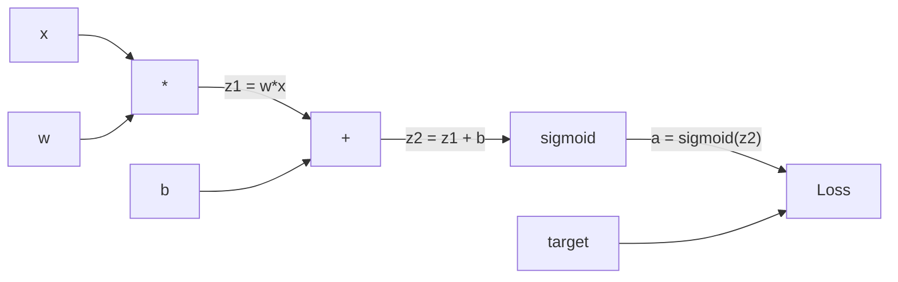
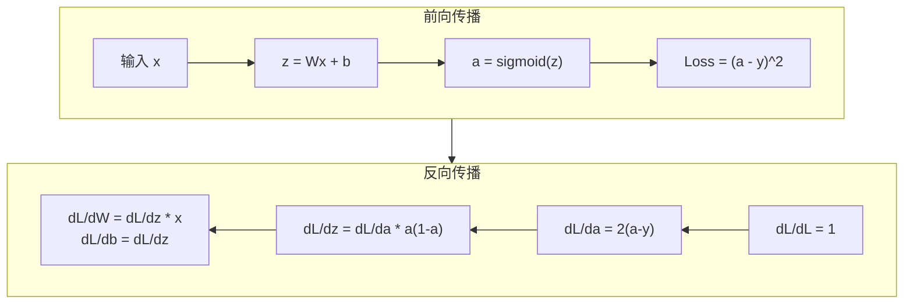
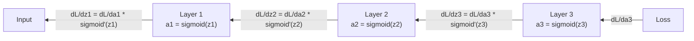

# 从零实现反向传播

> 反向传播是使学习成为可能的算法。没有它，神经网络只是昂贵的随机数生成器。

**类型：** 构建
**语言：** Python
**前置要求：** Lesson 03.02（多层网络）
**时长：** 约 120 分钟

## 学习目标

- 实现基于 Value 的自动梯度引擎，构建计算图并通过拓扑排序计算梯度
- 使用链式法则推导加法、乘法和 Sigmoid 的反向传播
- 仅使用从零实现的自定义反向传播引擎，在 XOR 和圆形分类上训练多层网络
- 识别深度 Sigmoid 网络中的梯度消失问题，并解释为什么梯度呈指数缩小

## 问题背景

你的网络有一个带有 768 个输入和 3072 个输出的单隐藏层。这是 2,359,296 个权重。它做出了错误的预测。哪些权重导致了错误？单独测试每个权重需要 230 万次前向传播。反向传播在一次反向传播中计算所有 230 万个梯度。这不是优化。这是可训练和不可训练之间的区别。

朴素方法：取一个权重，微调一小段，运行前向传播，测量损失是上升还是下降。这给了你那个权重上的梯度。现在对网络中的每个权重都这样做。乘以数千个训练步骤和数百万个数据点。你需要地质时代的时间来训练任何有用的东西。

反向传播解决了这个问题。一次前向传播，一次反向传播，所有梯度都计算出来了。诀窍是链式法则，系统地应用于计算图。这就是使深度学习变得实用的算法。没有它，我们仍然会困在玩具问题上。

## 核心概念

### 链式法则应用于网络

你在 Phase 01, Lesson 05 中见过链式法则。快速回顾：如果 y = f(g(x))，则 dy/dx = f'(g(x)) * g'(x)。你沿着链乘以导数。

在神经网络中，"链"是从输入到损失的操作序列。每一层应用权重、加偏置、通过激活函数。损失函数将最终输出与目标进行比较。反向传播追溯这条链，计算每个操作对误差的贡献。

### 计算图

每次前向传播都构建一个图。每个节点是一个操作（乘法、加法、Sigmoid）。每条边向前携带一个值，向后携带一个梯度。



前向传播：值从左向右流动。x 和 w 产生 z1 = w*x。加上 b 得到 z2。Sigmoid 给出激活 a。用损失函数将 a 与目标 y 比较。

反向传播：梯度从右向左流动。从 dL/da（损失如何随激活变化）开始。乘以 da/dz2（Sigmoid 导数）。得到 dL/dz2。分成 dL/db（等于 dL/dz2，因为 z2 = z1 + b）和 dL/dz1。然后 dL/dw = dL/dz1 * x，dL/dx = dL/dz1 * w。

图中的每个节点在反向传播中有一个任务：接收来自上方的梯度，乘以它的局部导数，然后向下传递。

### 前向传播 vs 反向传播



前向传播存储每个中间值：z、a、每层的输入。反向传播需要这些存储的值来计算梯度。这就是反向传播核心的记忆-计算权衡。你用内存（存储激活）换取速度（一次前向传播代替数百万次）。

### 梯度在网络中流动

对于一个 3 层网络，梯度链经过每一层：



在每一层，梯度乘以 Sigmoid 导数。Sigmoid 导数是 a * (1 - a)，最大值是 0.25（当 a = 0.5 时）。经过 3 层深，梯度最多乘以 0.25^3 = 0.0156。10 层深：0.25^10 = 0.000001。

### 梯度消失

这就是梯度消失问题。Sigmoid 将其输出压缩到 0 和 1 之间。它的导数始终小于 0.25。堆叠足够的 Sigmoid 层，梯度就会缩小到零。早期的层几乎不学习，因为它们接收到接近零的梯度。

```
sigmoid(z):     输出范围 [0, 1]
sigmoid'(z):    最大值 0.25（在 z = 0 处）

5 层之后：   梯度 * 0.25^5 = 0.001x 原始值
10 层之后：  梯度 * 0.25^10 = 0.000001x 原始值
```

这就是深度 Sigmoid 网络几乎无法训练的原因。解决方案——ReLU 及其变体——是 Lesson 04 的主题。现在要理解反向传播是完美工作的。问题在于它工作于其中的东西。

### 为 2 层网络推导梯度

一个带有输入 x、隐藏层 Sigmoid、输出层 Sigmoid 和 MSE 损失的网络的具体数学。

前向传播：
```
z1 = W1 * x + b1
a1 = sigmoid(z1)
z2 = W2 * a1 + b2
a2 = sigmoid(z2)
L = (a2 - y)^2
```

反向传播（逐步应用链式法则）：
```
dL/da2 = 2(a2 - y)
da2/dz2 = a2 * (1 - a2)
dL/dz2 = dL/da2 * da2/dz2 = 2(a2 - y) * a2 * (1 - a2)

dL/dW2 = dL/dz2 * a1
dL/db2 = dL/dz2

dL/da1 = dL/dz2 * W2
da1/dz1 = a1 * (1 - a1)
dL/dz1 = dL/da1 * da1/dz1

dL/dW1 = dL/dz1 * x
dL/db1 = dL/dz1
```

每个梯度都是局部导数乘积，沿路径从损失回溯。这就是反向传播的全部内容。

## 从零构建

### 步骤 1：Value 节点

我们计算中的每个数字都成为一个 Value。它存储其数据、梯度和创建方式（所以它知道如何向后计算梯度）。

```python
class Value:
    def __init__(self, data, children=(), op=''):
        self.data = data
        self.grad = 0.0
        self._backward = lambda: None
        self._children = set(children)
        self._op = op

    def __repr__(self):
        return f"Value(data={self.data:.4f}, grad={self.grad:.4f})"
```

还没有梯度（0.0）。还没有反向函数（no-op）。`_children` 追踪哪些 Value 产生了这个，以便我们稍后对图进行拓扑排序。

### 步骤 2：带反向函数的运算

每个操作创建一个新的 Value，并定义梯度如何通过它向后流动。

```python
def __add__(self, other):
    other = other if isinstance(other, Value) else Value(other)
    out = Value(self.data + other.data, (self, other), '+')

    def _backward():
        self.grad += out.grad
        other.grad += out.grad

    out._backward = _backward
    return out

def __mul__(self, other):
    other = other if isinstance(other, Value) else Value(other)
    out = Value(self.data * other.data, (self, other), '*')

    def _backward():
        self.grad += other.data * out.grad
        other.grad += self.data * out.grad

    out._backward = _backward
    return out
```

对于加法：d(a+b)/da = 1，d(a+b)/db = 1。所以两个输入直接获得输出的梯度。

对于乘法：d(a*b)/da = b，d(a*b)/db = a。每个输入获得另一个值乘以输出梯度。

`+=` 至关重要。一个 Value 可能用于多个操作。它的梯度是从所有路径的梯度之和。

### 步骤 3：Sigmoid 和损失

```python
import math

def sigmoid(self):
    x = self.data
    x = max(-500, min(500, x))
    s = 1.0 / (1.0 + math.exp(-x))
    out = Value(s, (self,), 'sigmoid')

    def _backward():
        self.grad += (s * (1 - s)) * out.grad

    out._backward = _backward
    return out
```

Sigmoid 导数：sigmoid(x) * (1 - sigmoid(x))。我们在前向传播中计算了 sigmoid(x) = s。重用它。不需要额外的工作。

```python
def mse_loss(predicted, target):
    diff = predicted + Value(-target)
    return diff * diff
```

单个输出的 MSE：(predicted - target)^2。我们用加上一个取反 Value 的加法来表示减法。

### 步骤 4：反向传播

拓扑排序确保我们以正确的顺序处理节点——一个节点的梯度在通过它传播之前完全累积。

```python
def backward(self):
    topo = []
    visited = set()

    def build_topo(v):
        if v not in visited:
            visited.add(v)
            for child in v._children:
                build_topo(child)
            topo.append(v)

    build_topo(self)
    self.grad = 1.0
    for v in reversed(topo):
        v._backward()
```

从损失开始（梯度 = 1.0，因为 dL/dL = 1）。通过排序后的图向后走。每个节点的 `_backward` 将梯度推送到其子节点。

### 步骤 5：Layer 和 Network

```python
import random

class Neuron:
    def __init__(self, n_inputs):
        scale = (2.0 / n_inputs) ** 0.5
        self.weights = [Value(random.uniform(-scale, scale)) for _ in range(n_inputs)]
        self.bias = Value(0.0)

    def __call__(self, x):
        act = sum((wi * xi for wi, xi in zip(self.weights, x)), self.bias)
        return act.sigmoid()

    def parameters(self):
        return self.weights + [self.bias]


class Layer:
    def __init__(self, n_inputs, n_outputs):
        self.neurons = [Neuron(n_inputs) for _ in range(n_outputs)]

    def __call__(self, x):
        out = [n(x) for n in self.neurons]
        return out[0] if len(out) == 1 else out

    def parameters(self):
        params = []
        for n in self.neurons:
            params.extend(n.parameters())
        return params


class Network:
    def __init__(self, sizes):
        self.layers = []
        for i in range(len(sizes) - 1):
            self.layers.append(Layer(sizes[i], sizes[i + 1]))

    def __call__(self, x):
        for layer in self.layers:
            x = layer(x)
            if not isinstance(x, list):
                x = [x]
        return x[0] if len(x) == 1 else x

    def parameters(self):
        params = []
        for layer in self.layers:
            params.extend(layer.parameters())
        return params

    def zero_grad(self):
        for p in self.parameters():
            p.grad = 0.0
```

一个 Neuron 接收输入，计算加权和加偏置，应用 Sigmoid。权重初始化按 sqrt(2/n_inputs) 缩放以防止更深网络中的 Sigmoid 饱和。一个 Layer 是 Neuron 的列表。一个 Network 是 Layer 的列表。`parameters()` 方法收集所有可学习的 Value 以便我们更新它们。

### 步骤 6：在 XOR 上训练

```python
random.seed(42)
net = Network([2, 4, 1])

xor_data = [
    ([0.0, 0.0], 0.0),
    ([0.0, 1.0], 1.0),
    ([1.0, 0.0], 1.0),
    ([1.0, 1.0], 0.0),
]

learning_rate = 1.0

for epoch in range(1000):
    total_loss = Value(0.0)
    for inputs, target in xor_data:
        x = [Value(i) for i in inputs]
        pred = net(x)
        loss = mse_loss(pred, target)
        total_loss = total_loss + loss

    net.zero_grad()
    total_loss.backward()

    for p in net.parameters():
        p.data -= learning_rate * p.grad

    if epoch % 100 == 0:
        print(f"Epoch {epoch:4d} | Loss: {total_loss.data:.6f}")

print("\nXOR 结果:")
for inputs, target in xor_data:
    x = [Value(i) for i in inputs]
    pred = net(x)
    print(f"  {inputs} -> {pred.data:.4f} (期望 {target})")
```

观察损失降低。从随机预测到正确的 XOR 输出，完全由反向传播计算梯度和向正确方向调整权重驱动。

### 步骤 7：圆形分类

在 Lesson 02 中，你手动调参了圆形分类的权重。现在让网络自己学习它们。

```python
random.seed(7)

def generate_circle_data(n=100):
    data = []
    for _ in range(n):
        x1 = random.uniform(-1.5, 1.5)
        x2 = random.uniform(-1.5, 1.5)
        label = 1.0 if x1 * x1 + x2 * x2 < 1.0 else 0.0
        data.append(([x1, x2], label))
    return data

circle_data = generate_circle_data(80)

circle_net = Network([2, 8, 1])
learning_rate = 0.5

for epoch in range(2000):
    random.shuffle(circle_data)
    total_loss_val = 0.0
    for inputs, target in circle_data:
        x = [Value(i) for i in inputs]
        pred = circle_net(x)
        loss = mse_loss(pred, target)
        circle_net.zero_grad()
        loss.backward()
        for p in circle_net.parameters():
            p.data -= learning_rate * p.grad
        total_loss_val += loss.data

    if epoch % 200 == 0:
        correct = 0
        for inputs, target in circle_data:
            x = [Value(i) for i in inputs]
            pred = circle_net(x)
            predicted_class = 1.0 if pred.data > 0.5 else 0.0
            if predicted_class == target:
                correct += 1
        accuracy = correct / len(circle_data) * 100
        print(f"Epoch {epoch:4d} | Loss: {total_loss_val:.4f} | 准确率: {accuracy:.1f}%")
```

我们在这里使用在线 SGD——在每个样本之后更新权重，而不是累积整个批次。这打破对称性更快，避免在完整损失景观上的 Sigmoid 饱和。每轮打乱数据防止网络记住顺序。

无需手动调参。网络自己发现了圆形决策边界。这就是反向传播的力量：定义架构、损失函数和数据。算法找出权重。

## 使用 PyTorch

PyTorch 用几行代码完成上述所有操作。核心思想相同——自动梯度在前向传播期间构建计算图，并向后追溯计算梯度。

```python
import torch
import torch.nn as nn

model = nn.Sequential(
    nn.Linear(2, 4),
    nn.Sigmoid(),
    nn.Linear(4, 1),
    nn.Sigmoid(),
)
optimizer = torch.optim.SGD(model.parameters(), lr=1.0)
criterion = nn.MSELoss()

X = torch.tensor([[0,0],[0,1],[1,0],[1,1]], dtype=torch.float32)
y = torch.tensor([[0],[1],[1],[0]], dtype=torch.float32)

for epoch in range(1000):
    pred = model(X)
    loss = criterion(pred, y)
    optimizer.zero_grad()
    loss.backward()
    optimizer.step()

print("PyTorch XOR 结果:")
with torch.no_grad():
    for i in range(4):
        pred = model(X[i])
        print(f"  {X[i].tolist()} -> {pred.item():.4f} (期望 {y[i].item()})")
```

`loss.backward()` 就是你的 `total_loss.backward()`。`optimizer.step()` 就是你手动的 `p.data -= lr * p.grad`。`optimizer.zero_grad()` 就是你的 `net.zero_grad()`。相同的算法，工业级实现。PyTorch 处理 GPU 加速、混合精度、梯度检查点以及数百种层类型。但反向传播是相同的链式法则应用于相同的计算图。

训练运行前向传播，然后反向传播，然后更新权重。推理只运行前向传播。不计算梯度，不更新。在生产中，推理发生在你调用 API 时。当你调用 Claude 或 GPT 时，你正在运行推理——你的提示流过网络的正向传播，tokens 从另一端出来。权重不变。理解反向传播很重要，因为它塑造了网络中每个权重。

## 发布

本课产出：
- `outputs/prompt-gradient-debugger.md` ——一个可重用的提示词，用于诊断任何神经网络中的梯度问题（消失、爆炸、NaN）

## 练习

1. 在 Value 类上添加 `__sub__` 方法（a - b = a + (-1 * b)）。然后实现一个 `__neg__` 方法。通过与简单表达式（如 (a - b)^2）的手动计算比较，验证梯度是否正确。

2. 在 Value 上添加一个 `relu` 方法（输出 max(0, x)，导数在 x > 0 时为 1，否则为 0）。在隐藏层中用 ReLU 替换 Sigmoid，再次在 XOR 上训练。比较收敛速度。你应该看到更快的训练——这是 Lesson 04 的预览。

3. 在 Value 上实现一个用于整数幂的 `__pow__` 方法。用它来用正确的 `(predicted - target) ** 2` 表达式替换 `mse_loss`。验证梯度与原始实现匹配。

4. 在训练循环中添加梯度裁剪：在调用 `backward()` 后，将所有梯度裁剪到 [-1, 1]。训练一个更深的网络（4+ 层使用 Sigmoid），比较有裁剪和无裁剪的损失曲线。这是你防止梯度爆炸的第一道防线。

5. 构建可视化：在 XOR 训练后，打印网络中每个参数的梯度。识别哪一层的梯度最小。这展示了你在概念部分读到的梯度消失问题。

## 关键术语

| 术语 | 人们常说的 | 实际含义 |
|------|----------------|----------------------|
| 反向传播 | "网络在学习" | 通过链式法则在计算图中向后应用，计算每个权重的 dL/dw 的算法 |
| 计算图 | "网络结构" | 一个有向无环图，节点是操作，边携带值（前向）和梯度（反向） |
| 链式法则 | "乘以导数" | 如果 y = f(g(x))，则 dy/dx = f'(g(x)) * g'(x)——反向传播的数学基础 |
| 梯度 | "最陡上升方向" | 损失相对于参数的偏导数——告诉你如何改变参数以减少损失 |
| 梯度消失 | "深度网络不学习" | 当激活函数的导数小于 1 时，梯度在层间呈指数缩小，使早期层无法训练 |
| 前向传播 | "运行网络" | 通过依次应用每层的操作并存储中间值，从输入计算输出 |
| 反向传播 | "计算梯度" | 按相反顺序遍历计算图，使用链式法则在每个节点累积梯度 |
| 学习率 | "学习速度" | 控制权重更新步长的标量：w_new = w_old - lr * gradient |
| 拓扑排序 | "正确的顺序" | 图节点的排序，每个节点出现在它依赖的所有节点之后——确保在传播前完全累积梯度 |
| 自动梯度 | "自动微分" | 在前向计算期间构建计算图并自动计算梯度的系统——PyTorch 引擎的工作方式 |

## 扩展阅读

- Rumelhart, Hinton & Williams, "Learning representations by back-propagating errors" (1986) ——使反向传播成为主流并解锁多层网络训练的开创性论文
- 3Blue1Brown, "Neural Networks" 系列 (https://www.youtube.com/playlist?list=PLZHQObOWTQDNU6R1_67000Dx_ZCJB-3pi) ——反向传播和梯度在网络中流动的最佳视觉解释