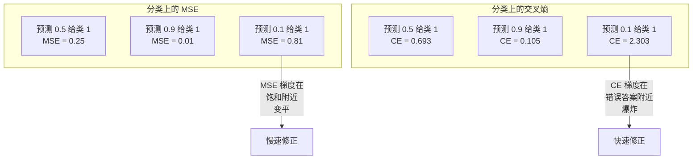
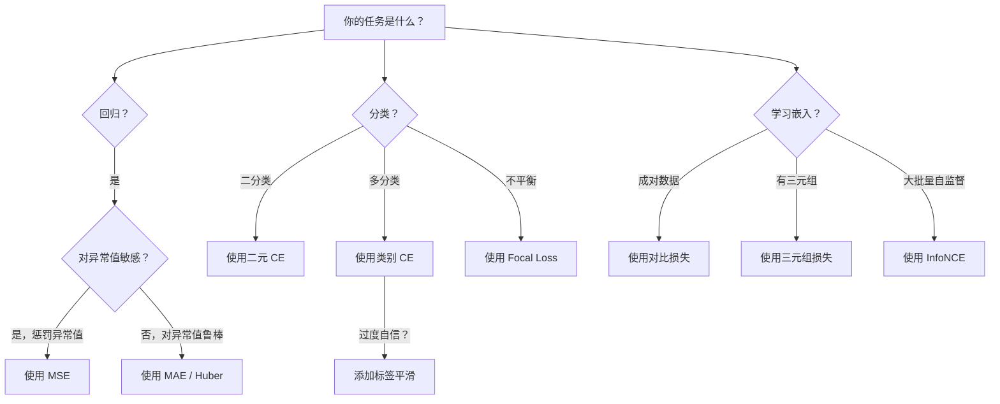
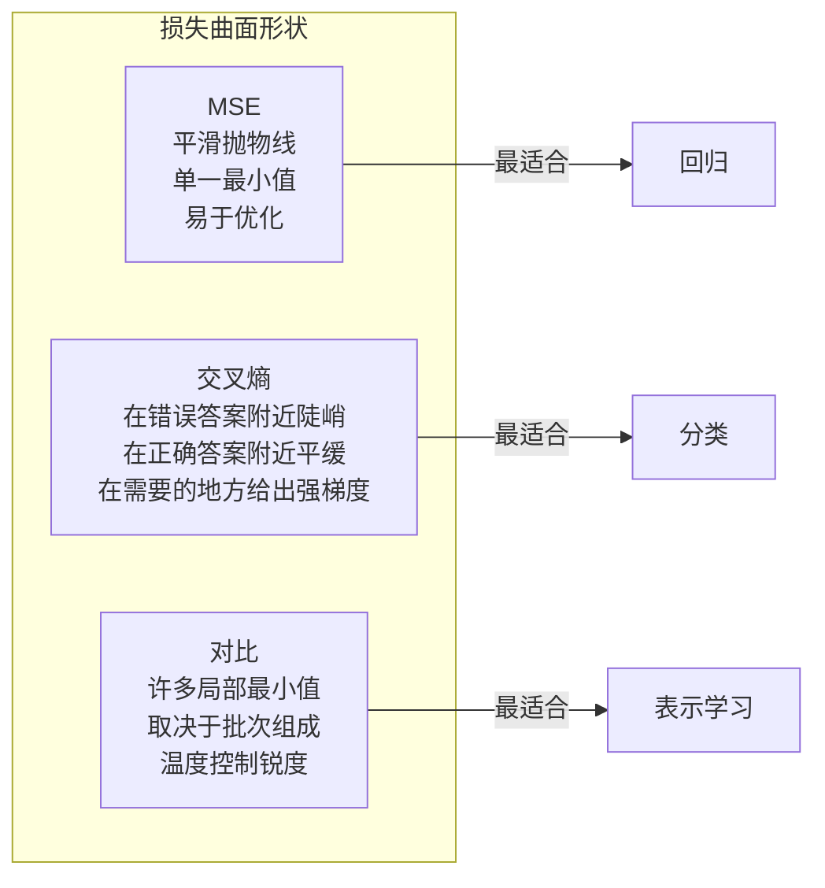

# 损失函数

> 你的网络做出了预测。真实标签说是别的东西。它有多错？这个数字就是损失。选错了损失函数，你的模型就会优化错误的东西。

**类型：** 构建
**语言：** Python
**前置要求：** Lesson 03.04（激活函数）
**时长：** 约 75 分钟

## 学习目标

- 从零实现 MSE、二元交叉熵、类别交叉熵和对比损失（InfoNCE）及其梯度
- 通过演示"对所有东西预测 0.5"的故障模式，解释为什么 MSE 对分类失败
- 将标签平滑应用于交叉熵，并描述它如何防止过度自信的预测
- 为回归、二分类、多分类和嵌入学习任务选择正确的损失函数

## 问题背景

在分类问题上用 MSE 最小化的模型会对所有输入自信地预测 0.5。它在最小化损失。它同时也是无用的。

损失函数是你的模型实际优化的唯一东西。不是准确率。不是 F1 分数。不是你向经理报告的任何指标。优化器取损失函数的梯度并调整权重使这个数字变小。如果损失函数没有捕捉到你关心的东西，模型会找到满足它数学上最便宜的方式，而这种方式几乎从来不是你想要的。

这里有一个具体的例子。你有一个二分类任务。两个类，50/50 分割。你用 MSE 作为损失。模型对每个输入都预测 0.5。平均 MSE 是 0.25，在实际上没有学到任何东西的情况下这是可能的最低值。模型没有判别能力，但技术上也最小化了你的损失函数。切换到交叉熵，同样的模型被迫将预测推向 0 或 1，因为 -log(0.5) = 0.693 是一个糟糕的损失，而 -log(0.99) = 0.01 奖励自信的正确预测。损失函数的选择是学习的模型和玩弄指标的模型之间的区别。

更糟的是。在自监督学习中，你甚至没有标签。对比损失完全定义了学习信号：什么算相似，什么算不同，以及模型应该将它们推开多远。对比损失错了，你的嵌入就会崩溃成一个点——每个输入映射到同一个向量。技术上损失为零。完全无用。

## 核心概念

### 均方误差（MSE）

回归的默认值。计算预测值和目标值之间的平方差，在所有样本上求平均。

```
MSE = (1/n) * sum((y_pred - y_true)^2)
```

为什么要平方：它对大误差进行二次方惩罚。误差为 2 的代价是误差为 1 的 4 倍。误差为 10 的代价是 100 倍。这使 MSE 对异常值敏感——一个疯狂错误的预测主导损失。

真实数字：如果你的模型预测房价，大部分房子差 10,000 美元，但一座豪宅差 200,000 美元，MSE 会积极尝试修正那座豪宅，可能会损害其他 99 座房子的表现。

MSE 相对于预测的梯度：

```
dMSE/dy_pred = (2/n) * (y_pred - y_true)
```

与误差成线性关系。更大的误差获得更大的梯度。对于回归这是一个特性（大的误差需要大的修正），对于分类是一个 bug（你想指数级地惩罚自信的错误预测，而不是线性地）。

### 交叉熵损失

分类的损失函数。根植于信息论——它测量预测概率分布和真实分布之间的差异。

**二元交叉熵（BCE）：**

```
BCE = -(y * log(p) + (1 - y) * log(1 - p))
```

其中 y 是真实标签（0 或 1），p 是预测概率。

为什么 -log(p) 有效：当真实标签是 1 且你预测 p = 0.99 时，损失是 -log(0.99) = 0.01。当预测 p = 0.01 时，损失是 -log(0.01) = 4.6。这 460 倍的差异就是交叉熵有效的原因。它严厉惩罚自信的错误预测，同时轻微惩罚自信的正确预测。

梯度讲述同样的故事：

```
dBCE/dp = -(y/p) + (1-y)/(1-p)
```

当 y = 1 且 p 接近零时，梯度是 -1/p，接近负无穷。模型收到一个巨大的信号来修正错误。当 p 接近 1 时，梯度很小。已经正确，无需修正。

**类别交叉熵：**

对于带有独热编码目标的多分类。

```
CCE = -sum(y_i * log(p_i))
```

只有真实类别贡献损失（因为所有其他的 y_i 都是零）。如果有 10 个类，正确类别得到概率 0.1（随机猜测），损失是 -log(0.1) = 2.3。如果正确类别得到概率 0.9，损失是 -log(0.9) = 0.105。模型学习将概率质量集中到正确答案上。

### 为什么 MSE 对分类失败



当预测接近 0 或 1 时，MSE 梯度变平（由于 Sigmoid 饱和）。交叉熵梯度补偿了这一点——-log 抵消了 Sigmoid 的平缓区域，在最需要的地方给出强梯度。

### 标签平滑

标准独热标签说"这是 100% 第 3 类，0% 其他任何类。"这是一个强有力的声明。标签平滑软化它：

```
smooth_label = (1 - alpha) * one_hot + alpha / num_classes
```

当 alpha = 0.1 且有 10 个类时：不是 [0, 0, 1, 0, ...]，目标变成 [0.01, 0.01, 0.91, 0.01, ...]。模型目标是 0.91 而不是 1.0。

为什么这有效：一个模型试图通过 Softmax 输出恰好 1.0 需要将 logits 推到无穷大。这导致过度自信，损害泛化，使模型对分布偏移脆弱。标签平滑将目标上限为 0.9（alpha=0.1），将 logits 保持在合理范围内。GPT 和大多数现代模型使用标签平滑或其等价物。

### 对比损失

没有标签。没有类别。只有输入对和问题：这些是相似的还是不同的？

**SimCLR 风格的对比损失（NT-Xent / InfoNCE）：**

取一张图像。创建它的两个增强视图（裁剪、旋转、颜色抖动）。这些是"正对"——它们应该有相似的嵌入。批中的每个其他图像形成"负对"——它们应该有不同的嵌入。

```
L = -log(exp(sim(z_i, z_j) / tau) / sum(exp(sim(z_i, z_k) / tau)))
```

其中 sim() 是余弦相似度，z_i 和 z_j 是正对，和是所有负对的和，tau（温度）控制分布的锐度。较低温度 = 更难的负样本 = 更积极的分离。

真实数字：批大小 256 意味着每个正对有 255 个负样本。温度 tau = 0.07（SimCLR 默认）。损失看起来像相似度上的 Softmax——它希望正对的相似度在所有 256 个选项中最高。

**三元组损失：**

取三个输入：锚、正样本（同类）、负样本（不同类）。

```
L = max(0, d(anchor, positive) - d(anchor, negative) + margin)
```

边界（通常 0.2-1.0）强制正负距离之间的最小间隙。如果负样本已经足够远，损失为零——没有梯度，没有更新。这使训练高效，但需要仔细的三元组挖掘（选择接近锚点的硬负样本）。

### Focal 损失

用于不平衡数据集。标准交叉熵对所有正确分类的样本同等对待。Focal 损失降低简单样本的权重：

```
FL = -alpha * (1 - p_t)^gamma * log(p_t)
```

其中 p_t 是真实类别的预测概率，gamma 控制聚焦。当 gamma = 0 时，这是标准交叉熵。当 gamma = 2（默认）时：

- 简单样本（p_t = 0.9）：权重 = (0.1)^2 = 0.01。基本上被忽略。
- 困难样本（p_t = 0.1）：权重 = (0.9)^2 = 0.81。完整梯度信号。

Focal 损失由 Lin 等人为目标检测引入，其中 99% 的候选区域是背景（简单负样本）。没有 Focal 损失，模型被简单的背景样本淹没，永远学不会检测物体。有了它，模型将容量集中在重要的困难、模糊的案例上。

### 损失函数决策树



### 损失景观



## 从零构建

### 步骤 1：MSE 及其梯度

```python
def mse(predictions, targets):
    n = len(predictions)
    total = 0.0
    for p, t in zip(predictions, targets):
        total += (p - t) ** 2
    return total / n

def mse_gradient(predictions, targets):
    n = len(predictions)
    grads = []
    for p, t in zip(predictions, targets):
        grads.append(2.0 * (p - t) / n)
    return grads
```

### 步骤 2：二元交叉熵

log(0) 问题是真的。如果模型对正样本预测恰好为 0，log(0) = 负无穷。裁剪防止这种情况。

```python
import math

def binary_cross_entropy(predictions, targets, eps=1e-15):
    n = len(predictions)
    total = 0.0
    for p, t in zip(predictions, targets):
        p_clipped = max(eps, min(1 - eps, p))
        total += -(t * math.log(p_clipped) + (1 - t) * math.log(1 - p_clipped))
    return total / n

def bce_gradient(predictions, targets, eps=1e-15):
    grads = []
    for p, t in zip(predictions, targets):
        p_clipped = max(eps, min(1 - eps, p))
        grads.append(-(t / p_clipped) + (1 - t) / (1 - p_clipped))
    return grads
```

### 步骤 3：带 Softmax 的类别交叉熵

Softmax 将原始 logits 转换为概率。然后我们计算与独热目标的交叉熵。

```python
def softmax(logits):
    max_val = max(logits)
    exps = [math.exp(x - max_val) for x in logits]
    total = sum(exps)
    return [e / total for e in exps]

def categorical_cross_entropy(logits, target_index, eps=1e-15):
    probs = softmax(logits)
    p = max(eps, probs[target_index])
    return -math.log(p)

def cce_gradient(logits, target_index):
    probs = softmax(logits)
    grads = list(probs)
    grads[target_index] -= 1.0
    return grads
```

Softmax + 交叉熵的梯度优美地简化了：对于真实类别只是（预测概率 - 1），对于所有其他类别只是（预测概率）。这个优雅的简化不是巧合——这就是 Softmax 和交叉熵配对的原因。

### 步骤 4：标签平滑

```python
def label_smoothed_cce(logits, target_index, num_classes, alpha=0.1, eps=1e-15):
    probs = softmax(logits)
    loss = 0.0
    for i in range(num_classes):
        if i == target_index:
            smooth_target = 1.0 - alpha + alpha / num_classes
        else:
            smooth_target = alpha / num_classes
        p = max(eps, probs[i])
        loss += -smooth_target * math.log(p)
    return loss
```

### 步骤 5：对比损失（简化版 InfoNCE）

```python
def cosine_similarity(a, b):
    dot = sum(x * y for x, y in zip(a, b))
    norm_a = math.sqrt(sum(x * x for x in a))
    norm_b = math.sqrt(sum(x * x for x in b))
    if norm_a < 1e-10 or norm_b < 1e-10:
        return 0.0
    return dot / (norm_a * norm_b)

def contrastive_loss(anchor, positive, negatives, temperature=0.07):
    sim_pos = cosine_similarity(anchor, positive) / temperature
    sim_negs = [cosine_similarity(anchor, neg) / temperature for neg in negatives]

    max_sim = max(sim_pos, max(sim_negs)) if sim_negs else sim_pos
    exp_pos = math.exp(sim_pos - max_sim)
    exp_negs = [math.exp(s - max_sim) for s in sim_negs]
    total_exp = exp_pos + sum(exp_negs)

    return -math.log(max(1e-15, exp_pos / total_exp))
```

### 步骤 6：分类上的 MSE vs 交叉熵

用两种损失函数在 lesson 04（圆形数据集）的相同网络上训练。观察交叉熵收敛更快。

```python
import random

def sigmoid(x):
    x = max(-500, min(500, x))
    return 1.0 / (1.0 + math.exp(-x))

def make_circle_data(n=200, seed=42):
    random.seed(seed)
    data = []
    for _ in range(n):
        x = random.uniform(-2, 2)
        y = random.uniform(-2, 2)
        label = 1.0 if x * x + y * y < 1.5 else 0.0
        data.append(([x, y], label))
    return data


class LossComparisonNetwork:
    def __init__(self, loss_type="bce", hidden_size=8, lr=0.1):
        random.seed(0)
        self.loss_type = loss_type
        self.lr = lr
        self.hidden_size = hidden_size

        self.w1 = [[random.gauss(0, 0.5) for _ in range(2)] for _ in range(hidden_size)]
        self.b1 = [0.0] * hidden_size
        self.w2 = [random.gauss(0, 0.5) for _ in range(hidden_size)]
        self.b2 = 0.0

    def forward(self, x):
        self.x = x
        self.z1 = []
        self.h = []
        for i in range(self.hidden_size):
            z = self.w1[i][0] * x[0] + self.w1[i][1] * x[1] + self.b1[i]
            self.z1.append(z)
            self.h.append(max(0.0, z))

        self.z2 = sum(self.w2[i] * self.h[i] for i in range(self.hidden_size)) + self.b2
        self.out = sigmoid(self.z2)
        return self.out

    def backward(self, target):
        if self.loss_type == "mse":
            d_loss = 2.0 * (self.out - target)
        else:
            eps = 1e-15
            p = max(eps, min(1 - eps, self.out))
            d_loss = -(target / p) + (1 - target) / (1 - p)

        d_sigmoid = self.out * (1 - self.out)
        d_out = d_loss * d_sigmoid

        for i in range(self.hidden_size):
            d_relu = 1.0 if self.z1[i] > 0 else 0.0
            d_h = d_out * self.w2[i] * d_relu
            self.w2[i] -= self.lr * d_out * self.h[i]
            for j in range(2):
                self.w1[i][j] -= self.lr * d_h * self.x[j]
            self.b1[i] -= self.lr * d_h
        self.b2 -= self.lr * d_out

    def compute_loss(self, pred, target):
        if self.loss_type == "mse":
            return (pred - target) ** 2
        else:
            eps = 1e-15
            p = max(eps, min(1 - eps, pred))
            return -(target * math.log(p) + (1 - target) * math.log(1 - p))

    def train(self, data, epochs=200):
        losses = []
        for epoch in range(epochs):
            total_loss = 0.0
            correct = 0
            for x, y in data:
                pred = self.forward(x)
                self.backward(y)
                total_loss += self.compute_loss(pred, y)
                if (pred >= 0.5) == (y >= 0.5):
                    correct += 1
            avg_loss = total_loss / len(data)
            accuracy = correct / len(data) * 100
            losses.append((avg_loss, accuracy))
            if epoch % 50 == 0 or epoch == epochs - 1:
                print(f"    Epoch {epoch:3d}: loss={avg_loss:.4f}, 准确率={accuracy:.1f}%")
        return losses
```

## 使用 PyTorch

PyTorch 以数值稳定性内置提供所有标准损失函数：

```python
import torch
import torch.nn as nn
import torch.nn.functional as F

predictions = torch.tensor([0.9, 0.1, 0.7], requires_grad=True)
targets = torch.tensor([1.0, 0.0, 1.0])

mse_loss = F.mse_loss(predictions, targets)
bce_loss = F.binary_cross_entropy(predictions, targets)

logits = torch.randn(4, 10)
labels = torch.tensor([3, 7, 1, 9])
ce_loss = F.cross_entropy(logits, labels)
ce_smooth = F.cross_entropy(logits, labels, label_smoothing=0.1)
```

使用 `F.cross_entropy`（不是 `F.nll_loss` 加手动 Softmax）。它在一次数值稳定的操作中结合 log-softmax 和负对数似然。分别应用 Softmax 然后取对数稳定性较差——你在大指数的减法中失去精度。

对于对比学习，大多数团队使用自定义实现或 `lightly` 或 `pytorch-metric-learning` 等库。核心循环总是一样的：计算成对相似度，在正样本和负样本上创建 Softmax，反向传播。

## 发布

本课产出：
- `outputs/prompt-loss-function-selector.md` ——选择正确损失函数的可重用提示词
- `outputs/prompt-loss-debugger.md` ——当你的损失曲线看起来错误时的诊断提示词

## 练习

1. 实现 Huber 损失（平滑 L1 损失），对小误差是 MSE，对大误差是 MAE。在 5% 训练目标添加随机噪声（异常值）的情况下，用 MSE vs Huber 训练预测 y = sin(x) 的回归网络。比较最终测试误差。

2. 将 Focal 损失添加到二分类训练循环中。创建一个不平衡数据集（90% 类 0，10% 类 1）。比较 200 轮后标准 BCE vs Focal 损失（gamma=2）对少数类的召回率。

3. 实现带有半硬负挖掘的三元组损失。为 5 个类生成 2D 嵌入数据。对于每个锚点，找到仍然比正样本远的硬负样本（半硬）。与随机三元组选择比较收敛。

4. 运行 MSE vs 交叉熵比较，但在训练期间追踪每层的梯度幅度。绘制每轮的平均梯度范数。验证交叉熵在模型最不确定的早期轮产生更大的梯度。

5. 实现 KL 散度损失，并验证当真实分布是独热时，最小化 KL(true || predicted) 给出与交叉熵相同的梯度。然后尝试软目标（如知识蒸馏），其中"真实"分布来自教师模型的 Softmax 输出。

## 关键术语

| 术语 | 人们常说的 | 实际含义 |
|------|----------------|----------------------|
| 损失函数 | "模型有多错" | 将预测和目标映射到优化器最小化的标量的可微函数 |
| MSE | "平均平方误差" | 预测和目标之间平方差的均值；对大误差进行二次方惩罚 |
| 交叉熵 | "分类损失" | 使用 -log(p) 测量预测概率分布和真实分布之间的差异 |
| 二元交叉熵 | "BCE" | 两个类的交叉熵：-(y*log(p) + (1-y)*log(1-p)) |
| 标签平滑 | "软化目标" | 用软值（如 0.1/0.9）替换硬 0/1 目标，以防止过度自信并改善泛化 |
| 对比损失 | "拉近，推开" | 通过使相似对更近、不同对更远来学习表示的损失 |
| InfoNCE | "CLIP/SimCLR 损失" | 相似度分数上的归一化温度缩放交叉熵；将对比学习视为分类 |
| Focal 损失 | "不平衡数据修复" | 由 (1-p_t)^gamma 加权的交叉熵，以降低简单样本的权重并聚焦于困难样本 |
| 三元组损失 | "锚-正-负" | 在嵌入空间中至少以边界将锚推近正样本而不是负样本 |
| 温度 | "锐度旋钮" | 控制结果分布有多尖锐的 logits/相似度标量除数；越低 = 越尖锐 |

## 扩展阅读

- Lin et al., "Focal Loss for Dense Object Detection" (2017) ——为处理目标检测中极端类别不平衡引入 Focal 损失（RetinaNet）
- Chen et al., "A Simple Framework for Contrastive Learning of Visual Representations" (SimCLR, 2020) ——用 NT-Xent 损失定义现代对比学习流程
- Szegedy et al., "Rethinking the Inception Architecture" (2016) ——将标签平滑作为正则化技术引入，现在在大多数大型模型中很标准
- Hinton et al., "Distilling the Knowledge in a Neural Network" (2015) ——使用软目标和 KL 散度的知识蒸馏，是模型压缩的基础