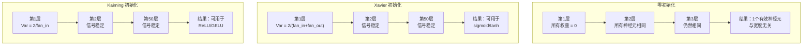
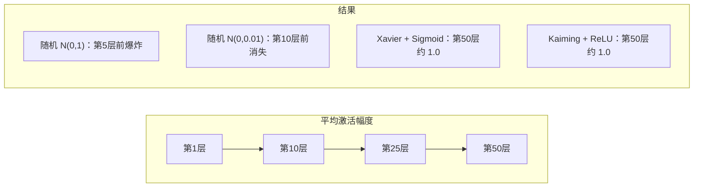
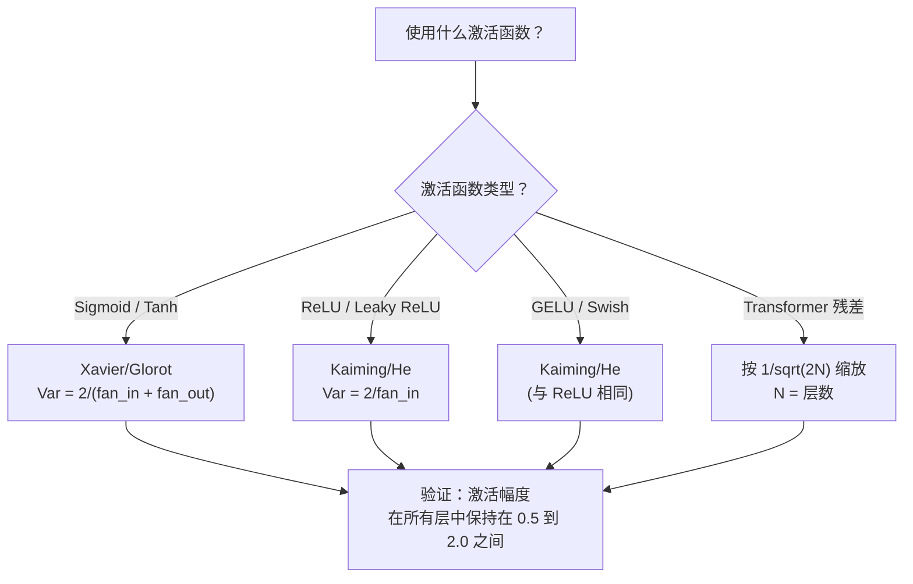

# 权重初始化与训练稳定性

> 初始化错误，训练永不启动。初始化正确，50 层和 3 层一样顺畅。

**类型：** 构建
**语言：** Python
**前置要求：** Lesson 03.04（激活函数），Lesson 03.07（正则化）
**时间：** 约 90 分钟

## 学习目标

- 实现零初始化、随机初始化、Xavier/Glorot 和 Kaiming/He 初始化策略，并测量 50 层网络中激活幅度的变化
- 推导 Xavier 初始化为何使用 Var(w) = 2/(fan_in + fan_out)，Kaiming 初始化为何使用 Var(w) = 2/fan_in
- 演示零初始化的对称问题，解释为何仅靠随机规模不足以解决问题
- 根据激活函数匹配正确的初始化策略：sigmoid/tanh 用 Xavier，ReLU/GELU 用 Kaiming

## 问题

将所有权重初始化为零。什么都学不到。每个神经元计算相同的函数，接收相同的梯度，以相同方式更新。10,000 个 epoch 后，512 个神经元的隐藏层仍然是同一个神经元的 512 份副本。你付了 512 个参数的钱，只得到 1 个。

将它们初始化得太大。激活值在网络中爆炸。到第 10 层，数值达到 1e15。到第 20 层，溢出到无穷。梯度沿相同轨迹反向爆炸。

从标准正态分布中随机初始化。3 层有效。50 层时，信号要么收缩到零，要么爆炸到无穷——取决于随机规模是略小还是略大。"能用"和"坏了"之间的边界极薄。

权重初始化是深度学习中最被低估的决策。架构出论文。优化器出博客。初始化只占一个脚注。但如果初始化错了，其他一切都不重要——你的网络在训练开始前就已经死了。

## 概念

### 对称问题

一层中每个神经元都有相同结构：输入乘以权重，加偏置，应用激活。如果所有权重从相同值开始（零是极端情况），每个神经元计算相同输出。在反向传播期间，每个神经元接收相同梯度。在更新步骤期间，每个神经元以相同量变化。

你被卡住了。网络有数百个参数，但它们全部步调一致。这叫做对称性，随机初始化是暴力破解它的方法。每个神经元从权重空间中的不同点开始，所以每个学习不同的特征。

但"随机"不够。随机性的**规模**决定了网络是否能训练。

### 方差在层间传播

考虑一个 fan_in 个输入的单一层：

```
z = w1*x1 + w2*x2 + ... + w_n*x_n
```

如果每个权重 wi 从方差为 Var(w) 的分布中抽取，每个输入 xi 方差为 Var(x)，输出方差为：

```
Var(z) = fan_in * Var(w) * Var(x)
```

如果 Var(w) = 1 且 fan_in = 512，输出方差是输入方差的 512 倍。经过 10 层：512^10 = 1.2e27。你的信号爆炸了。

如果 Var(w) = 0.001，每层输出方差缩小 0.001 * 512 = 0.512。经过 10 层：0.512^10 = 0.00013。你的信号消失了。

目标：选择 Var(w) 使 Var(z) = Var(x)。信号幅度在层间保持恒定。

### Xavier/Glorot 初始化

Glorot 和 Bengio（2010）为 sigmoid 和 tanh 激活推导了解决方案。为在前向和反向传播中保持方差恒定：

```
Var(w) = 2 / (fan_in + fan_out)
```

实践中，权重从以下分布中抽取：

```
w ~ Uniform(-limit, limit)  其中 limit = sqrt(6 / (fan_in + fan_out))
```

或：

```
w ~ Normal(0, sqrt(2 / (fan_in + fan_out)))
```

这有效，因为 sigmoid 和 tanh 在零点附近大致线性，而正确初始化的激活就在零点附近。方差在数十层中保持稳定。

### Kaiming/He 初始化

ReLU 杀死一半输出（所有负值变为零）。有效 fan_in 减半，因为平均一半输入被置零。Xavier 初始化没有考虑这一点——它低估了所需的方差。

He 等人（2015）调整了公式：

```
Var(w) = 2 / fan_in
```

权重从以下分布中抽取：

```
w ~ Normal(0, sqrt(2 / fan_in))
```

乘以 2 是为了补偿 ReLU 将一半激活置零。如果没有它，信号每层缩小约 0.5 倍。50 层：0.5^50 = 8.8e-16。Kaiming 初始化防止了这一点。

### Transformer 初始化

GPT-2 引入了一种不同模式。残差连接将每个子层的输出加到其输入上：

```
x = x + sublayer(x)
```

每次加法增加方差。有 N 个残差层时，方差随 N 成比例增长。GPT-2 将残差层的权重缩放 1/sqrt(2N)，其中 N 是层数。这使累积信号幅度保持稳定。

LLaMA 3（4050 亿参数，126 层）使用类似方案。没有这种缩放，残差流在 126 层注意力和前馈块中会无限制增长。



### 50 层激活幅度变化



### 选择正确的初始化



## 构建

### 第 1 步：初始化策略

初始化权重矩阵的四种方法。每个返回列表的列表（2D 矩阵），fan_in 列和 fan_out 行。

```python
import math
import random


def zero_init(fan_in, fan_out):
    return [[0.0 for _ in range(fan_in)] for _ in range(fan_out)]


def random_init(fan_in, fan_out, scale=1.0):
    return [[random.gauss(0, scale) for _ in range(fan_in)] for _ in range(fan_out)]


def xavier_init(fan_in, fan_out):
    std = math.sqrt(2.0 / (fan_in + fan_out))
    return [[random.gauss(0, std) for _ in range(fan_in)] for _ in range(fan_out)]


def kaiming_init(fan_in, fan_out):
    std = math.sqrt(2.0 / fan_in)
    return [[random.gauss(0, std) for _ in range(fan_in)] for _ in range(fan_out)]
```

### 第 2 步：激活函数

需要 sigmoid、tanh 和 ReLU 来测试每种初始化策略与其对应激活函数的配合。

```python
def sigmoid(x):
    x = max(-500, min(500, x))
    return 1.0 / (1.0 + math.exp(-x))


def tanh_act(x):
    return math.tanh(x)


def relu(x):
    return max(0.0, x)
```

### 第 3 步：50 层前向传播

将随机数据通过深层网络，测量每层的平均激活幅度。

```python
def forward_deep(init_fn, activation_fn, n_layers=50, width=64, n_samples=100):
    random.seed(42)
    layer_magnitudes = []

    inputs = [[random.gauss(0, 1) for _ in range(width)] for _ in range(n_samples)]

    for layer_idx in range(n_layers):
        weights = init_fn(width, width)
        biases = [0.0] * width

        new_inputs = []
        for sample in inputs:
            output = []
            for neuron_idx in range(width):
                z = sum(weights[neuron_idx][j] * sample[j] for j in range(width)) + biases[neuron_idx]
                output.append(activation_fn(z))
            new_inputs.append(output)
        inputs = new_inputs

        magnitudes = []
        for sample in inputs:
            magnitudes.append(sum(abs(v) for v in sample) / width)
        mean_mag = sum(magnitudes) / len(magnitudes)
        layer_magnitudes.append(mean_mag)

    return layer_magnitudes
```

### 第 4 步：实验

运行所有组合：零初始化、随机 N(0,1)、随机 N(0,0.01)、Xavier + sigmoid、Xavier + tanh、Kaiming + ReLU。在关键层打印幅度。

```python
def run_experiment():
    configs = [
        ("Zero init + Sigmoid（零初始化 + Sigmoid）", lambda fi, fo: zero_init(fi, fo), sigmoid),
        ("Random N(0,1) + ReLU（随机 N(0,1) + ReLU）", lambda fi, fo: random_init(fi, fo, 1.0), relu),
        ("Random N(0,0.01) + ReLU（随机 N(0,0.01) + ReLU）", lambda fi, fo: random_init(fi, fo, 0.01), relu),
        ("Xavier + Sigmoid（Xavier + Sigmoid）", xavier_init, sigmoid),
        ("Xavier + Tanh（Xavier + Tanh）", xavier_init, tanh_act),
        ("Kaiming + ReLU（Kaiming + ReLU）", kaiming_init, relu),
    ]

    print(f"{'策略':<30} {'第1层':>10} {'第5层':>10} {'第10层':>10} {'第25层':>10} {'第50层':>10}")
    print("-" * 80)

    for name, init_fn, act_fn in configs:
        mags = forward_deep(init_fn, act_fn)
        row = f"{name:<30}"
        for idx in [0, 4, 9, 24, 49]:
            val = mags[idx]
            if val > 1e6:
                row += f" {'爆炸':>10}"
            elif val < 1e-6:
                row += f" {'消失':>10}"
            else:
                row += f" {val:>10.4f}"
        print(row)
```

### 第 5 步：对称性演示

展示零初始化产生相同神经元。

```python
def symmetry_demo():
    random.seed(42)
    weights = zero_init(2, 4)
    biases = [0.0] * 4

    inputs = [0.5, -0.3]
    outputs = []
    for neuron_idx in range(4):
        z = sum(weights[neuron_idx][j] * inputs[j] for j in range(2)) + biases[neuron_idx]
        outputs.append(sigmoid(z))

    print("\n对称性演示（4 个神经元，零初始化）：")
    for i, out in enumerate(outputs):
        print(f"  神经元 {i}：输出 = {out:.6f}")
    all_same = all(abs(outputs[i] - outputs[0]) < 1e-10 for i in range(len(outputs)))
    print(f"  所有相同：{all_same}")
    print(f"  有效参数：1 个（而非 {len(weights) * len(weights[0])}）")
```

### 第 6 步：逐层幅度报告

打印 50 层激活幅度的可视化柱状图。

```python
def magnitude_report(name, magnitudes):
    print(f"\n{name}：")
    for i, mag in enumerate(magnitudes):
        if i % 5 == 0 or i == len(magnitudes) - 1:
            if mag > 1e6:
                bar = "X" * 50 + " 爆炸"
            elif mag < 1e-6:
                bar = "." + " 消失"
            else:
                bar_len = min(50, max(1, int(mag * 10)))
                bar = "#" * bar_len
            print(f"  第 {i+1:3d} 层：{bar} ({mag:.6f})")
```

## 使用

PyTorch 将这些作为内置函数提供：

```python
import torch
import torch.nn as nn

layer = nn.Linear(512, 256)

nn.init.xavier_uniform_(layer.weight)
nn.init.xavier_normal_(layer.weight)

nn.init.kaiming_uniform_(layer.weight, nonlinearity='relu')
nn.init.kaiming_normal_(layer.weight, nonlinearity='relu')

nn.init.zeros_(layer.bias)
```

当你调用 `nn.Linear(512, 256)` 时，PyTorch 默认使用 Kaiming 均匀初始化。这就是为什么大多数简单网络"开箱即用"——PyTorch 已经做出了正确选择。但当构建自定义架构或超过 20 层时，你需要理解发生了什么，并可能需要覆盖默认值。

对于 Transformer，HuggingFace 模型通常在其 `_init_weights` 方法中处理初始化。GPT-2 的实现将残差投影按 1/sqrt(N) 缩放。如果你要从头构建 Transformer，你需要自己添加这个。

## 发布

本课产出：
- `outputs/prompt-init-strategy.md` -- 一个用于诊断权重初始化问题并推荐正确策略的提示

## 练习

1. 添加 LeCun 初始化（Var = 1/fan_in，为 SELU 激活设计）。用 LeCun 初始化 + tanh 运行 50 层实验，并与 Xavier + tanh 比较。

2. 实现 GPT-2 残差缩放：在加到残差流之前将每层输出乘以 1/sqrt(2N)。分别用和不用的 50 层运行，测量残差幅度增长速度。

3. 创建一个"初始化健康检查"函数，接收网络层维度和激活函数类型，然后推荐正确的初始化，并在当前初始化会导致问题时发出警告。

4. 用 fan_in = 16 和 fan_in = 1024 运行实验。Xavier 和 Kaiming 适应 fan_in，但随机初始化不能。展示"能用"和"坏了"之间的差距如何随更大的层扩大。

5. 实现正交初始化（生成随机矩阵，计算其 SVD，使用正交矩阵 U）。在 50 层的 ReLU 网络中与 Kaiming 比较。

## 关键术语

| 术语 | 常见说法 | 实际含义 |
|------|---------|---------|
| 权重初始化（Weight initialization） | "随机设置起始权重" | 选择初始权重值的策略，决定网络是否能训练 |
| 对称性破缺（Symmetry breaking） | "让神经元不同" | 使用随机初始化确保神经元学习不同的特征，而非计算相同函数 |
| Fan-in | "神经元输入数量" | 传入连接数，决定输入方差如何在加权和中年累积 |
| Fan-out | "神经元输出数量" | 传出连接数，与反向传播期间梯度方差维护相关 |
| Xavier/Glorot 初始化 | "sigmoid 初始化" | Var(w) = 2/(fan_in + fan_out)，为保持 sigmoid 和 tanh 激活的方差而设计 |
| Kaiming/He 初始化 | "ReLU 初始化" | Var(w) = 2/fan_in，计入 ReLU 将一半激活置零的因素 |
| 方差传播（Variance propagation） | "信号在层间增长或缩小" | 基于权重规模逐层分析激活方差如何变化的数学方法 |
| 残差缩放（Residual scaling） | "GPT-2 的初始化技巧" | 通过 1/sqrt(2N) 缩放残差连接权重，防止 N 个 Transformer 层的方差增长 |
| 死亡网络（Dead network） | "什么都训练不了" | 初始化不当导致所有梯度为零或所有激活饱和的网络 |
| 激活爆炸（Exploding activations） | "值变成无穷大" | 权重方差过高，导致激活幅度在层中指数增长 |

## 延伸阅读

- Glorot & Bengio，"理解深度前馈神经网络训练的困难"（2010）——原始 Xavier 初始化论文，包含方差分析
- He 等，"深入整流器"（2015）——为 ReLU 网络引入 Kaiming 初始化
- Radford 等，"语言模型是无监督多任务学习器"（2019）——GPT-2 论文，包含残差缩放初始化
- Mishkin & Matas，"你需要的是一个好的初始化"（2016）——层序单元方差初始化，作为分析公式的经验替代方案