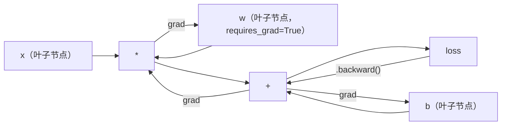
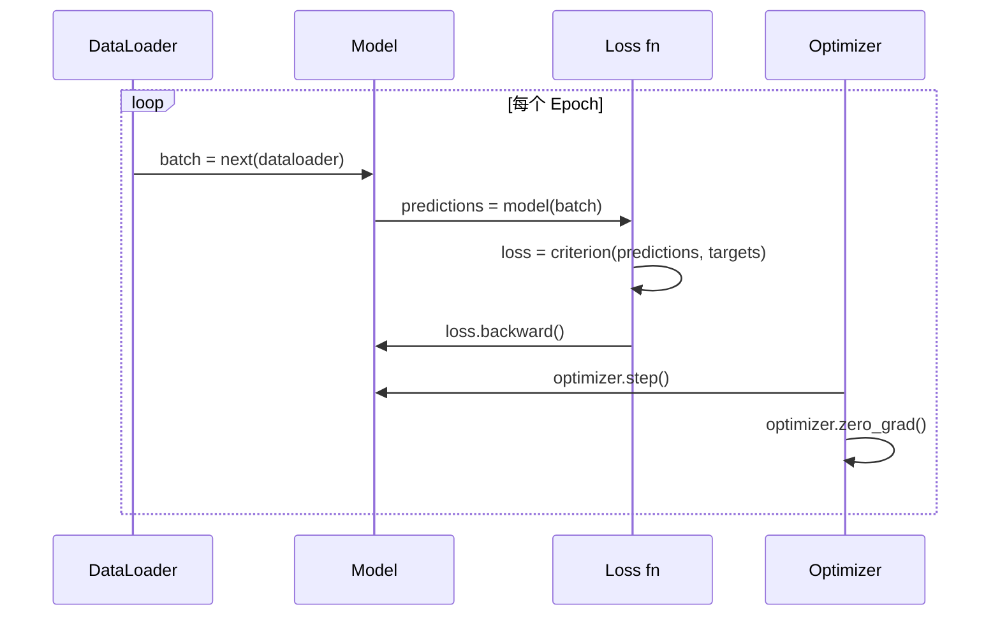

# PyTorch 入门

> 你已经从活塞和曲轴构建了发动机。现在学习每个人实际驾驶的那一个。

**类型：** 构建
**语言：** Python
**前置要求：** Lesson 03.10（从零构建迷你框架）
**时间：** 约 75 分钟

## 学习目标

- 使用 PyTorch 的 nn.Module、nn.Sequential 和 autograd 构建和训练神经网络
- 使用 PyTorch 张量、GPU 加速和标准训练循环（zero_grad、forward、loss、backward、step）
- 将从零构建的迷你框架组件转换为其 PyTorch 等价物
- 在同一任务上分析和比较纯 Python 框架与 PyTorch 的训练速度

## 问题

你有一个可用的迷你框架。Linear 层、ReLU、dropout、batch norm、Adam、DataLoader、训练循环。它在纯 Python 中用圆分类问题训练一个 4 层网络。

但在同一问题上，它比 PyTorch 慢 500 倍。

你的迷你框架用嵌套 Python 循环逐个样本处理。PyTorch 将相同操作分发到优化的 C++/CUDA 内核，在 GPU 上运行。在一块 NVIDIA A100 上，PyTorch 在 ImageNet（128 万张图像）上训练 ResNet-50（2560 万参数）约需 6 小时。你的框架在同一任务上需要约 3,000 小时——如果它不会先内存溢出的话。

速度不是唯一的差距。你的框架没有 GPU 支持。没有自动微分——你为每个模块手写了 backward()。没有序列化。没有分布式训练。没有混合精度。没有调试梯度流的简单方法（除了 print 语句）。

PyTorch 填补了所有这些空白。而且它在保持你已构建的完全相同的思维模型的同时做到了：`Module`、`forward()`、`parameters()`、`backward()`、`optimizer.step()`。概念一一对应。语法几乎相同。区别在于 PyTorch 在你从头设计的相同接口背后包装了十年的系统工程。

## 概念

### 为什么 PyTorch 赢了

2015 年，TensorFlow 要求你在运行任何东西之前定义静态计算图。你构建图，编译，然后喂数据。调试意味着盯着图可视化。改变架构意味着从头重建图。

PyTorch 于 2017 年推出，采用不同哲学：命令式执行。你写 Python。它立即运行。`y = model(x)` 现在实际计算 y，而不是"添加一个节点到稍后计算 y 的图"。这意味着标准 Python 调试工具有效。print() 有效。pdb 有效。forward pass 中的 if/else 有效。

到 2020 年，市场已经表态。PyTorch 在 ML 研究论文中的份额从 7%（2017）增长到超过 75%（2022）。Meta、Google DeepMind、OpenAI、Anthropic 和 Hugging Face 都使用 PyTorch 作为主要框架。TensorFlow 2.x 采用命令式执行作为回应——默认承认 PyTorch 的设计是正确的。

教训：开发者体验是复合的。一个慢 10% 但调试快 50% 的框架永远胜出。

### 张量（Tensor）

张量是具有三个关键属性的多维数组：shape、dtype 和 device。

```python
import torch

x = torch.zeros(3, 4)           # shape：(3, 4)，dtype：float32，device：cpu
x = torch.randn(2, 3, 224, 224) # 2 张 RGB 图像批次，224x224
x = torch.tensor([1, 2, 3])     # 从 Python 列表
```

**Shape** 是维度。标量 shape 为 ()，向量为 (n,)，矩阵为 (m, n)，图像批次为 (batch, channels, height, width)。

**Dtype** 控制精度和内存。

| dtype | 位数 | 范围 | 用途 |
|-------|------|------|------|
| float32 | 32 | 约 7 位小数 | 默认训练 |
| float16 | 16 | 约 3.3 位小数 | 混合精度 |
| bfloat16 | 16 | 与 float32 相同范围，精度更低 | LLM 训练 |
| int8 | 8 | -128 到 127 | 量化推理 |

**Device** 决定计算发生在哪里。

```python
device = torch.device("cuda" if torch.cuda.is_available() else "cpu")
x = torch.randn(3, 4, device=device)
x = x.to("cuda")
x = x.cpu()
```

每个操作要求所有张量在同一设备上。这是初学者遇到的第 1 个 PyTorch 错误：`RuntimeError: Expected all tensors to be on the same device`。修复方法是在计算前将所有内容移到同一设备。

**重塑**是常数时间——它改变元数据，不改变数据。

```python
x = torch.randn(2, 3, 4)
x.view(2, 12)      # 重塑为 (2, 12) -- 必须是连续的
x.reshape(6, 4)    # 重塑为 (6, 4) -- 总是有效
x.permute(2, 0, 1) # 重排维度
x.unsqueeze(0)     # 添加维度：(1, 2, 3, 4)
x.squeeze()        # 移除大小为 1 的维度
```

### Autograd

你的迷你框架要求你为每个模块实现 backward()。PyTorch 不需要。它将张量上的每个操作记录到有向无环图（计算图）中，然后反向遍历该图自动计算梯度。



与你的框架的关键区别：PyTorch 使用基于磁带的自动微分。每个操作在前向传播期间追加到"磁带"。调用 `.backward()` 反向重放磁带。

```python
x = torch.randn(3, requires_grad=True)
y = x ** 2 + 3 * x
z = y.sum()
z.backward()
print(x.grad)  # dz/dx = 2x + 3
```

autograd 的三条规则：

1. 只有叶子张量且 `requires_grad=True` 会累积梯度
2. 默认情况下梯度会累积——在每个反向传播前调用 `optimizer.zero_grad()`
3. `torch.no_grad()` 禁用梯度跟踪（评估期间使用）

### nn.Module

`nn.Module` 是 PyTorch 中每个神经网络组件的基类。你在第 10 课已经构建了这个抽象。PyTorch 版本增加了自动参数注册、递归模块发现、设备管理和状态字典序列化。

```python
import torch.nn as nn

class MLP(nn.Module):
    def __init__(self, input_dim, hidden_dim, output_dim):
        super().__init__()
        self.layer1 = nn.Linear(input_dim, hidden_dim)
        self.relu = nn.ReLU()
        self.layer2 = nn.Linear(hidden_dim, output_dim)

    def forward(self, x):
        x = self.layer1(x)
        x = self.relu(x)
        x = self.layer2(x)
        return x
```

当你在 `__init__` 中将 `nn.Module` 或 `nn.Parameter` 赋值作为属性时，PyTorch 会自动注册它。`model.parameters()` 递归收集每个注册参数。这就是为什么你永远不必像在迷你框架中那样手动收集权重。

关键构建块：

| Module | 功能 | 参数数量 |
|--------|------|---------|
| nn.Linear(in, out) | Wx + b | in*out + out |
| nn.Conv2d(in_ch, out_ch, k) | 2D 卷积 | in_ch*out_ch*k*k + out_ch |
| nn.BatchNorm1d(features) | 归一化激活 | 2 * features |
| nn.Dropout(p) | 随机置零 | 0 |
| nn.ReLU() | max(0, x) | 0 |
| nn.GELU() | 高斯误差线性单元 | 0 |
| nn.Embedding(vocab, dim) | 查找表 | vocab * dim |
| nn.LayerNorm(dim) | 逐样本归一化 | 2 * dim |

### 损失函数和优化器

PyTorch 提供了你所构建的一切的生产就绪版本。

**损失函数**（来自 `torch.nn`）：

| 损失 | 任务 | 输入 |
|------|------|------|
| nn.MSELoss() | 回归 | 任意形状 |
| nn.CrossEntropyLoss() | 多分类 | Logits（不是 softmax） |
| nn.BCEWithLogitsLoss() | 二分类 | Logits（不是 sigmoid） |
| nn.L1Loss() | 回归（鲁棒） | 任意形状 |
| nn.CTCLoss() | 序列对齐 | 对数概率 |

注意：`CrossEntropyLoss` 在内部组合了 `LogSoftmax` + `NLLLoss`。传入原始 logits，不是 softmax 输出。这是一个常见错误，会静默产生错误梯度。

**优化器**（来自 `torch.optim`）：

| 优化器 | 使用场景 | 典型 LR |
|--------|---------|---------|
| SGD(params, lr, momentum) | CNN、精心调优的流程 | 0.01--0.1 |
| Adam(params, lr) | 默认起点 | 1e-3 |
| AdamW(params, lr, weight_decay) | Transformer、微调 | 1e-4--1e-3 |
| LBFGS(params) | 小规模、二阶 | 1.0 |

### 训练循环

每个 PyTorch 训练循环遵循相同的 5 步模式。你已从第 10 课了解这个。



规范模式：

```python
for epoch in range(num_epochs):
    model.train()
    for inputs, targets in train_loader:
        inputs, targets = inputs.to(device), targets.to(device)
        optimizer.zero_grad()
        outputs = model(inputs)
        loss = criterion(outputs, targets)
        loss.backward()
        optimizer.step()
```

批循环内的五句话。五句话训练了 GPT-4、Stable Diffusion 和 LLaMA。架构变化。数据变化。这五句不变。

### Dataset 和 DataLoader

PyTorch 的 `Dataset` 是一个抽象类，有两个方法：`__len__` 和 `__getitem__`。`DataLoader` 用批处理、打乱和多进程数据加载包装它。

```python
from torch.utils.data import Dataset, DataLoader

class MNISTDataset(Dataset):
    def __init__(self, images, labels):
        self.images = images
        self.labels = labels

    def __len__(self):
        return len(self.labels)

    def __getitem__(self, idx):
        return self.images[idx], self.labels[idx]

loader = DataLoader(dataset, batch_size=64, shuffle=True, num_workers=4)
```

`num_workers=4` 在 GPU 训练当前批次时生成 4 个进程并行加载数据。在磁盘绑定工作负载（大图像、音频）上，这本身就可以使训练速度翻倍。

### GPU 训练

将模型移到 GPU：

```python
device = torch.device("cuda" if torch.cuda.is_available() else "cpu")
model = model.to(device)
```

这递归地将每个参数和 buffer 移到 GPU。然后在训练期间移动每个批次：

```python
inputs, targets = inputs.to(device), targets.to(device)
```

**混合精度**通过在前向/反向以 float16 运行同时将主权重保持在 float32 来将内存使用减半并将吞吐量翻倍（在 A100、H100、RTX 4090 上）：

```python
from torch.amp import autocast, GradScaler

scaler = GradScaler()
for inputs, targets in loader:
    with autocast(device_type="cuda"):
        outputs = model(inputs)
        loss = criterion(outputs, targets)
    scaler.scale(loss).backward()
    scaler.step(optimizer)
    scaler.update()
    optimizer.zero_grad()
```

### 比较：迷你框架 vs PyTorch vs JAX

| 特性 | 迷你框架（第 10 课） | PyTorch | JAX |
|------|-------------------|---------|-----|
| 自动微分 | 手动 backward() | 基于磁带的 autograd | 函数式变换 |
| 执行 | 命令式（Python 循环） | 命令式（C++ 内核） | 追踪 + JIT 编译 |
| GPU 支持 | 无 | 有（CUDA、ROCm、MPS） | 有（CUDA、TPU） |
| 速度（MNIST MLP） | ~300秒/epoch | ~0.5秒/epoch | ~0.3秒/epoch |
| 模块系统 | 自定义 Module 类 | nn.Module | 无状态函数（Flax/Equinox） |
| 调试 | print() | print()、pdb、breakpoint() | 较难（JIT 追踪破坏 print） |
| 生态 | 无 | Hugging Face、Lightning、timm | Flax、Optax、Orbax |
| 学习曲线 | 你构建了它 | 中等 | 陡峭（函数式范式） |
| 生产使用 | 玩具问题 | Meta、OpenAI、Anthropic、HF | Google DeepMind、Midjourney |

## 构建

一个 3 层 MLP，仅使用 PyTorch 原语在 MNIST 上训练。无高级包装器。无 `torchvision.datasets`。我们从原始文件下载和解析数据。

### 第 1 步：从原始文件加载 MNIST

MNIST 以 4 个 gzip 文件形式提供：训练图像（60,000 × 28 × 28）、训练标签、测试图像（10,000 × 28 × 28）、测试标签。我们下载并解析二进制格式。

```python
import torch
import torch.nn as nn
import struct
import gzip
import urllib.request
import os

def download_mnist(path="./mnist_data"):
    base_url = "https://storage.googleapis.com/cvdf-datasets/mnist/"
    files = [
        "train-images-idx3-ubyte.gz",
        "train-labels-idx1-ubyte.gz",
        "t10k-images-idx3-ubyte.gz",
        "t10k-labels-idx1-ubyte.gz",
    ]
    os.makedirs(path, exist_ok=True)
    for f in files:
        filepath = os.path.join(path, f)
        if not os.path.exists(filepath):
            urllib.request.urlretrieve(base_url + f, filepath)

def load_images(filepath):
    with gzip.open(filepath, "rb") as f:
        magic, num, rows, cols = struct.unpack(">IIII", f.read(16))
        data = f.read()
        images = torch.frombuffer(bytearray(data), dtype=torch.uint8)
        images = images.reshape(num, rows * cols).float() / 255.0
    return images

def load_labels(filepath):
    with gzip.open(filepath, "rb") as f:
        magic, num = struct.unpack(">II", f.read(8))
        data = f.read()
        labels = torch.frombuffer(bytearray(data), dtype=torch.uint8).long()
    return labels
```

### 第 2 步：定义模型

3 层 MLP：784 -> 256 -> 128 -> 10。ReLU 激活。Dropout 正则化。无 batch norm 以保持简单。

```python
class MNISTModel(nn.Module):
    def __init__(self):
        super().__init__()
        self.net = nn.Sequential(
            nn.Linear(784, 256),
            nn.ReLU(),
            nn.Dropout(0.2),
            nn.Linear(256, 128),
            nn.ReLU(),
            nn.Dropout(0.2),
            nn.Linear(128, 10),
        )

    def forward(self, x):
        return self.net(x)
```

输出层产生 10 个原始 logits（每个数字一个）。无 softmax——`CrossEntropyLoss` 在内部处理。

参数数量：784*256 + 256 + 256*128 + 128 + 128*10 + 10 = 235,146。按现代标准微乎其微。GPT-2 small 有 1.24 亿。这在几秒内训练完成。

### 第 3 步：训练循环

规范的前向-loss-反向-step 模式。

```python
def train_one_epoch(model, loader, criterion, optimizer, device):
    model.train()
    total_loss = 0
    correct = 0
    total = 0
    for images, labels in loader:
        images, labels = images.to(device), labels.to(device)
        optimizer.zero_grad()
        outputs = model(images)
        loss = criterion(outputs, labels)
        loss.backward()
        optimizer.step()
        total_loss += loss.item() * images.size(0)
        _, predicted = outputs.max(1)
        correct += predicted.eq(labels).sum().item()
        total += labels.size(0)
    return total_loss / total, correct / total


def evaluate(model, loader, criterion, device):
    model.eval()
    total_loss = 0
    correct = 0
    total = 0
    with torch.no_grad():
        for images, labels in loader:
            images, labels = images.to(device), labels.to(device)
            outputs = model(images)
            loss = criterion(outputs, labels)
            total_loss += loss.item() * images.size(0)
            _, predicted = outputs.max(1)
            correct += predicted.eq(labels).sum().item()
            total += labels.size(0)
    return total_loss / total, correct / total
```

注意评估时使用 `torch.no_grad()`。这禁用 autograd，减少内存使用并加速推理。没有它，PyTorch 会构建一个你永远不会用的计算图。

### 第 4 步：连接一切

```python
def main():
    device = torch.device("cuda" if torch.cuda.is_available() else "cpu")

    download_mnist()
    train_images = load_images("./mnist_data/train-images-idx3-ubyte.gz")
    train_labels = load_labels("./mnist_data/train-labels-idx1-ubyte.gz")
    test_images = load_images("./mnist_data/t10k-images-idx3-ubyte.gz")
    test_labels = load_labels("./mnist_data/t10k-labels-idx1-ubyte.gz")

    train_dataset = torch.utils.data.TensorDataset(train_images, train_labels)
    test_dataset = torch.utils.data.TensorDataset(test_images, test_labels)
    train_loader = torch.utils.data.DataLoader(
        train_dataset, batch_size=64, shuffle=True
    )
    test_loader = torch.utils.data.DataLoader(
        test_dataset, batch_size=256, shuffle=False
    )

    model = MNISTModel().to(device)
    criterion = nn.CrossEntropyLoss()
    optimizer = torch.optim.Adam(model.parameters(), lr=1e-3)

    num_params = sum(p.numel() for p in model.parameters())
    print(f"设备：{device}")
    print(f"参数数量：{num_params:,}")
    print(f"训练样本：{len(train_dataset):,}")
    print(f"测试样本：{len(test_dataset):,}")
    print()

    for epoch in range(10):
        train_loss, train_acc = train_one_epoch(
            model, train_loader, criterion, optimizer, device
        )
        test_loss, test_acc = evaluate(
            model, test_loader, criterion, device
        )
        print(
            f"Epoch {epoch+1:2d} | "
            f"训练 Loss：{train_loss:.4f} | 训练准确率：{train_acc:.4f} | "
            f"测试 Loss：{test_loss:.4f} | 测试准确率：{test_acc:.4f}"
        )

    torch.save(model.state_dict(), "mnist_mlp.pt")
    print(f"\n模型保存到 mnist_mlp.pt")
    print(f"最终测试准确率：{test_acc:.4f}")
```

10 个 epoch 后预期输出：约 97.8% 测试准确率。CPU 上训练时间：约 30 秒。GPU 上：约 5 秒。在相同架构的迷你框架上：约 45 分钟。

## 使用

### 快速比较：迷你框架 vs PyTorch

| 迷你框架（第 10 课） | PyTorch |
|---------------------|---------|
| `model = Sequential(Linear(784, 256), ReLU(), ...)` | `model = nn.Sequential(nn.Linear(784, 256), nn.ReLU(), ...)` |
| `pred = model.forward(x)` | `pred = model(x)` |
| `optimizer.zero_grad()` | `optimizer.zero_grad()` |
| `grad = criterion.backward()` 然后 `model.backward(grad)` | `loss.backward()` |
| `optimizer.step()` | `optimizer.step()` |
| 无 GPU | `model.to("cuda")` |
| 每个模块手动 backward | Autograd 处理一切 |

接口几乎相同。区别在于所有底层的东西。

### 保存和加载模型

```python
torch.save(model.state_dict(), "model.pt")

model = MNISTModel()
model.load_state_dict(torch.load("model.pt", weights_only=True))
model.eval()
```

始终保存 `state_dict()`（参数字典），不是模型对象。保存模型对象使用 pickle，当重构代码时会出问题。State dict 是可移植的。

### 学习率调度

```python
scheduler = torch.optim.lr_scheduler.CosineAnnealingLR(
    optimizer, T_max=10
)
for epoch in range(10):
    train_one_epoch(model, train_loader, criterion, optimizer, device)
    scheduler.step()
```

PyTorch 内置 15+ 个调度器：StepLR、ExponentialLR、CosineAnnealingLR、OneCycleLR、ReduceLROnPlateau。全部插入相同的优化器接口。

## 发布

本课产出两个工件：

- `outputs/prompt-pytorch-debugger.md` -- 一个用于诊断常见 PyTorch 训练失败的提示
- `outputs/skill-pytorch-patterns.md` -- PyTorch 训练模式的技能参考

## 练习

1. **添加批归一化。** 在每个 linear 层之后（激活之前）插入 `nn.BatchNorm1d`。比较测试准确率和训练速度与仅 dropout 版本。Batch norm 应该在更少的 epoch 内达到 98%+。

2. **实现学习率查找器。** 用指数增加的学习率（从 1e-7 到 1.0）训练一个 epoch。绘制 loss vs LR。最优 LR 在 loss 开始爬升之前。用它为 MNIST 模型选择更好的 LR。

3. **移植到 GPU 混合精度。** 在训练循环中添加 `torch.amp.autocast` 和 `GradScaler`。在 GPU 上测量有和无混合精度的吞吐量（样本/秒）。在 A100 上预期约 2 倍加速。

4. **构建自定义 Dataset。** 下载 Fashion-MNIST（与 MNIST 格式相同但有服装物品）。实现一个 `FashionMNISTDataset(Dataset)` 类，包含 `__getitem__` 和 `__len__`。训练相同的 MLP 并比较准确率。Fashion-MNIST 更难——预期约 88% vs 约 98%。

5. **用 SGD + 动量替换 Adam。** 用 `SGD(params, lr=0.01, momentum=0.9)` 训练。比较收敛曲线。然后添加 `CosineAnnealingLR` 调度器，看 SGD 是否在第 10 个 epoch 赶上 Adam。

## 关键术语

| 术语 | 常见说法 | 实际含义 |
|------|---------|---------|
| Tensor（张量） | "多维数组" | 一个带类型的、设备感知的数组，每个操作都内置自动微分支持 |
| Autograd | "自动反向传播" | 一个基于磁带的系统，在前向传播期间记录操作，然后反向重放以计算精确梯度 |
| nn.Module | "一个层" | 任何可微分计算块的基类——注册参数、支持嵌套、处理训练/评估模式 |
| state_dict | "模型权重" | 映射参数名称到张量的有序字典——训练模型的可移植、可序列化表示 |
| .backward() | "计算梯度" | 反向遍历计算图，为每个 `requires_grad=True` 的叶子张量计算并累积梯度 |
| .to(device) | "移到 GPU" | 递归传输所有参数和 buffer 到指定设备（CPU、CUDA、MPS） |
| DataLoader | "数据管道" | 一个迭代器，从 Dataset 批处理、打乱并可选并行化数据加载 |
| 混合精度（Mixed precision） | "使用 float16" | 用 float16 前向/反向训练以加速，同时保持 float32 主权重以保证数值稳定性 |
| 命令式执行（Eager execution） | "立即运行" | 操作在被调用时立即执行，而不是推迟到以后的编译步骤——将 PyTorch 与 TF 1.x 区分开来的核心设计选择 |
| zero_grad | "重置梯度" | 在下一个反向传播之前将所有参数梯度置零，因为 PyTorch 默认累积梯度 |

## 延伸阅读

- Paszke 等，"PyTorch：一种命令式风格的高性能深度学习库"（2019）——解释 PyTorch 设计权衡的原始论文
- PyTorch 教程："通过示例学习 PyTorch"（https://pytorch.org/tutorials/beginner/pytorch_with_examples.html）——从张量到 nn.Module 的官方路径
- PyTorch 性能调优指南（https://pytorch.org/tutorials/recipes/recipes/tuning_guide.html）——混合精度、DataLoader workers、pinned memory 等生产优化
- Horace He，"让深度学习 Brrrr"（https://horace.io/brrr_intro.html）——为什么 GPU 训练快速，包含 PyTorch 特定优化策略