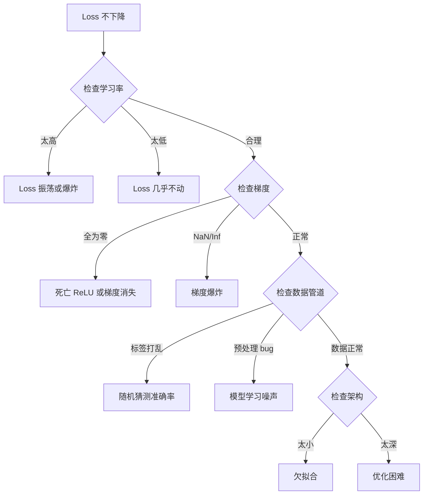
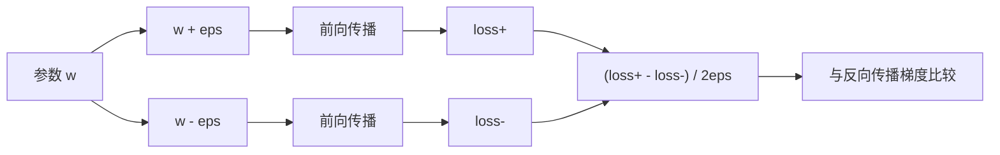
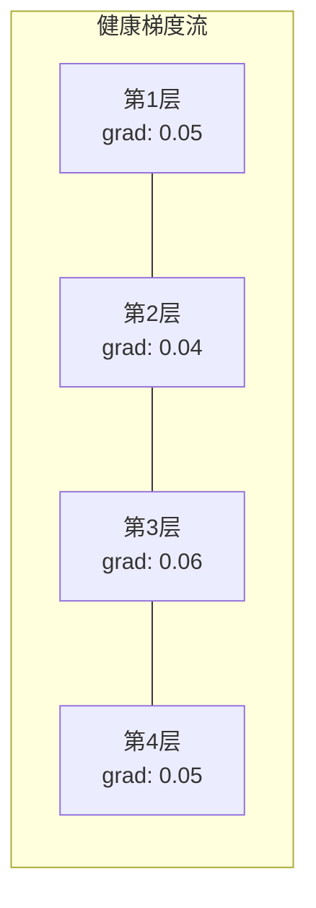
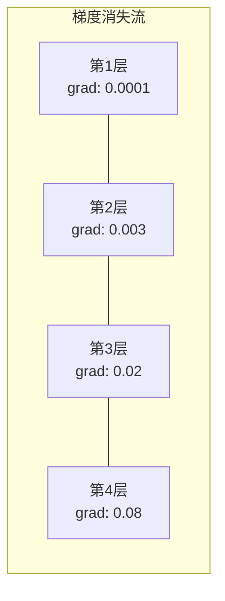
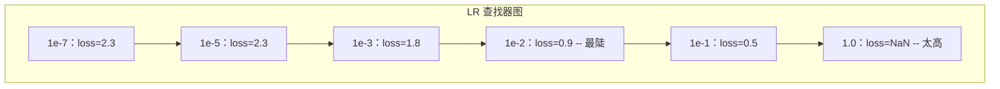

# 神经网络调试

> 你的网络编译了。它运行了。它产生了一个数字。数字是错的，但没有任何东西崩溃。欢迎来到最难调试的那种——没有任何错误信息的那种。

**类型：** 实践
**语言：** Python、PyTorch
**前置要求：** Phase 03 Lessons 01-10（尤其是反向传播、损失函数、优化器）
**时间：** 约 90 分钟

## 学习目标

- 使用系统性调试策略诊断常见的神经网络失败（NaN loss、平坦 loss 曲线、过拟合、振荡）
- 应用"过拟合一个批次"技术验证模型架构和训练循环是否正确
- 检查梯度幅度、激活分布和权重范数，以识别梯度消失/爆炸问题
- 构建一个覆盖数据管道、模型架构、损失函数、优化器和学习率问题的调试检查清单

## 问题

传统软件崩溃时是坏的。空指针抛出异常。类型不匹配在编译时失败。差一错误产生明显错误的输出。

神经网络不会给你那种奢侈。

一个坏的神经网络运行完成，打印一个 loss 值，并输出预测。Loss 可能下降。预测可能看起来合理。但模型是静默错误的——学习捷径、记忆噪声、或收敛到无用的局部最小值。Google 研究人员估计 60-70% 的 ML 调试时间花费在"静默"bug 上——不产生错误但降低模型质量。

工作模型和坏模型之间的差异通常只是一行放错位置：缺少 `zero_grad()`、转置维度、学习率差 10 倍。著名的"训练神经网络食谱"（2019）以这句话开头："最常见的神经网络错误是不崩溃的 bug。"

本课教你找到那些 bug。

## 概念

### 调试心态

忘掉祈祷式调试。神经网络调试需要系统方法，因为反馈循环慢（每次训练运行分钟到小时）且症状模糊（坏 loss 可能意味着 20 种不同的事情）。

黄金法则：**从简单开始，一次加一个复杂度，独立验证每个部分。**



### 症状 1：Loss 不下降

最常见的抱怨。训练循环运行，epoch 滴答，loss 保持平坦或疯狂振荡。

**学习率错误。** 太高：loss 振荡或跳到 NaN。太低：loss 下降如此慢以至于看起来平坦。Adam 从 1e-3 开始。SGD 从 1e-1 或 1e-2 开始。在得出其他结论前，总是要尝试三个跨越 10 倍的学习率（例如 1e-2、1e-3、1e-4）。

**死亡 ReLU。** 如果 ReLU 神经元接收大的负输入，它输出 0，梯度为 0。它永远不会再激活。如果足够多的神经元死亡，网络无法学习。检查：在每个 ReLU 层之后打印激活为恰好 0 的比例。如果超过 50% 死亡，切换到 LeakyReLU 或降低学习率。

**梯度消失。** 在使用 sigmoid 或 tanh 激活的深层网络中，梯度在反向传播时指数收缩。到它们到达第一层时，接近 0。第一层停止学习。修复：使用 ReLU/GELU、添加残差连接、或使用批归一化。

**梯度爆炸。** 相反问题——梯度指数增长。常见于 RNN 和非常深的网络。Loss 跳到 NaN。修复：梯度裁剪（`torch.nn.utils.clip_grad_norm_`）、降低学习率、或添加归一化。

### 症状 2：Loss 下降但模型坏

Loss 下降。训练准确率达到 99%。但测试准确率是 55%。或者模型在真实数据上产生荒谬输出。

**过拟合。** 模型记忆训练数据而不是学习模式。训练和验证 loss 之间的差距随时间增长。修复：更多数据、dropout、权重衰减、早停、数据增强。

**数据泄露。** 测试数据泄露到训练中。准确率高得可疑。常见原因：分割前打乱、用整个数据集的统计量预处理、分割间重复样本。修复：先分割，后预处理，检查重复。

**标签错误。** 大多数真实数据集中 5-10% 的标签是错的（Northcutt 等，2021——"测试集中的普遍标签错误"）。模型学习噪声。修复：使用置信学习找到并修复标签错误的例子，或使用损失截断忽略高损失样本。

### 症状 3：Loss 中出现 NaN 或 Inf

Loss 值变成 `nan` 或 `inf`。训练死了。

**学习率太高。** 梯度更新跃迁太远以至于权重爆炸。修复：降低 10 倍。

**log(0) 或 log(负数)。** 交叉熵损失计算 `log(p)`。如果模型输出恰好 0 或负概率，log 爆炸。修复：将预测 clamp 到 `[eps, 1-eps]`，其中 `eps=1e-7`。

**除以零。** 批归一化除以标准差。常数值的批次 std=0。修复：在分母添加 epsilon（PyTorch 默认这样做，但自定义实现可能不做）。

**数值溢出。** 大激活输入到 `exp()` 产生 Inf。Softmax 尤其容易出现。修复：在指数化前减去最大值（log-sum-exp 技巧）。

### 技术 1：梯度检查

将解析梯度（来自反向传播）与数值梯度（来自有限差分）比较。如果不一致，你的反向传播有 bug。

参数 `w` 的数值梯度：

```
grad_numerical = (loss(w + eps) - loss(w - eps)) / (2 * eps)
```

一致性指标（相对差异）：

```
rel_diff = |grad_analytical - grad_numerical| / max(|grad_analytical|, |grad_numerical|, 1e-8)
```

如果 `rel_diff < 1e-5`：正确。如果 `rel_diff > 1e-3`：几乎肯定有 bug。



### 技术 2：激活统计

在训练期间监控每层激活后的均值和标准差。健康网络保持激活均值接近 0、std 接近 1（归一化后）或至少有界。

| 健康指标 | 均值 | 标准差 | 诊断 |
|---------|------|-------|------|
| 健康 | ~0 | ~1 | 网络正常学习 |
| 饱和 | >>0 或 <<0 | ~0 | 激活卡在极值 |
| 死亡 | 0 | 0 | 神经元死亡（全零）|
| 爆炸 | >>10 | >>10 | 激活无界增长 |

### 技术 3：梯度流可视化

绘制每层的平均梯度幅度。在健康网络中，梯度幅度在各层大致相似。如果早期层的梯度比后期层小 1000 倍，你有梯度消失。





### 技术 4：过拟合一个批次测试

深度学习中最重要的调试技术。

取一个小批次（8-32 个样本）。在上面训练 100+ 步。Loss 应该接近零，训练准确率应该达到 100%。如果没有，你的模型或训练循环有根本性 bug——不要继续完整训练。

此测试捕获：
- 坏的损失函数
- 坏的向后传播
- 架构太小无法表示数据
- 优化器未连接到模型参数
- 数据和标签不对齐

这需要 30 秒运行，可以节省数小时调试完整训练运行。

### 技术 5：学习率查找器

Leslie Smith（2017）提出在一次 epoch 中将学习率从非常小（1e-7）扫到非常大（10）同时记录 loss。绘制 loss vs 学习率。最优学习率大约是 loss 开始下降最快的速率的 10 倍小。



本例中最优 LR：约 1e-3（最陡点前一个数量级）。

### 常见 PyTorch Bug

这些是浪费 PyTorch 社区最多集体时间的 bug：

| Bug | 症状 | 修复 |
|-----|------|------|
| 忘记 `optimizer.zero_grad()` | 梯度跨批次累积，loss 振荡 | 在 `loss.backward()` 前加 `optimizer.zero_grad()` |
| 忘记测试时 `model.eval()` | Dropout 和批归一化行为不同，测试准确率在运行间变化 | 加 `model.eval()` 和 `torch.no_grad()` |
| 张量形状错误 | 静默广播产生错误结果，无错误 | 调试期间在每个操作后打印形状 |
| CPU/GPU 不匹配 | `RuntimeError: expected CUDA tensor` | 在模型和数据上用 `.to(device)` |
| 未 detach 张量 | 计算图无限增长，OOM | 用 `.detach()` 或 `with torch.no_grad()` |
| 原地操作破坏 autograd | `RuntimeError: modified by in-place operation` | 将 `x += 1` 替换为 `x = x + 1` |
| 数据未归一化 | Loss 卡在随机猜测水平 | 归一化输入到均值=0，std=1 |
| 标签类型错误 | 交叉熵期望 `Long`，得到 `Float` | 转换标签：`labels.long()` |

### 主调试表

| 症状 | 可能原因 | 首先尝试 |
|--------|---------|---------|
| Loss 卡在 -log(1/num_classes) | 模型预测均匀分布 | 检查数据管道，验证标签匹配输入 |
| 几步后 Loss NaN | 学习率太高 | LR 降低 10 倍 |
| 立即 Loss NaN | log(0) 或除以零 | 在 log/除法操作中加 epsilon |
| Loss 疯狂振荡 | LR 太高或批大小太小 | 降低 LR，增大批大小 |
| Loss 下降然后平台 | 细调阶段 LR 太高 | 添加 LR 调度（余弦或阶梯衰减） |
| 训练准确率高，测试准确率低 | 过拟合 | 添加 dropout、权重衰减、更多数据 |
| 训练准确率 = 测试准确率 = 猜测 | 模型没学到任何东西 | 运行过拟合一个批次测试 |
| 训练准确率 = 测试准确率但都低 | 欠拟合 | 更大模型、更多层、更多特征 |
| 梯度全为零 | 死亡 ReLU 或 detached 计算图 | 切换到 LeakyReLU，检查 `.requires_grad` |
| 训练期间内存耗尽 | 批太大或图未释放 | 减小批大小，在评估时用 `torch.no_grad()` |

## 构建

一个诊断工具包，监控激活、梯度和 loss 曲线。你将故意破坏一个网络并使用工具包诊断每个问题。

### 第 1 步：NetworkDebugger 类

钩入 PyTorch 模型以记录每层的激活和梯度统计。

```python
import torch
import torch.nn as nn
import math


class NetworkDebugger:
    def __init__(self, model):
        self.model = model
        self.activation_stats = {}
        self.gradient_stats = {}
        self.loss_history = []
        self.lr_losses = []
        self.hooks = []
        self._register_hooks()

    def _register_hooks(self):
        for name, module in self.model.named_modules():
            if isinstance(module, (nn.Linear, nn.Conv2d, nn.ReLU, nn.LeakyReLU)):
                hook = module.register_forward_hook(self._make_activation_hook(name))
                self.hooks.append(hook)
                hook = module.register_full_backward_hook(self._make_gradient_hook(name))
                self.hooks.append(hook)

    def _make_activation_hook(self, name):
        def hook(module, input, output):
            with torch.no_grad():
                out = output.detach().float()
                self.activation_stats[name] = {
                    "mean": out.mean().item(),
                    "std": out.std().item(),
                    "fraction_zero": (out == 0).float().mean().item(),
                    "min": out.min().item(),
                    "max": out.max().item(),
                }
        return hook

    def _make_gradient_hook(self, name):
        def hook(module, grad_input, grad_output):
            if grad_output[0] is not None:
                with torch.no_grad():
                    grad = grad_output[0].detach().float()
                    self.gradient_stats[name] = {
                        "mean": grad.mean().item(),
                        "std": grad.std().item(),
                        "abs_mean": grad.abs().mean().item(),
                        "max": grad.abs().max().item(),
                    }
        return hook

    def record_loss(self, loss_value):
        self.loss_history.append(loss_value)

    def check_loss_health(self):
        if len(self.loss_history) < 2:
            return "NOT_ENOUGH_DATA"
        recent = self.loss_history[-10:]
        if any(math.isnan(v) or math.isinf(v) for v in recent):
            return "NAN_OR_INF"
        if len(self.loss_history) >= 20:
            first_half = sum(self.loss_history[:10]) / 10
            second_half = sum(self.loss_history[-10:]) / 10
            if second_half >= first_half * 0.99:
                return "NOT_DECREASING"
        if len(recent) >= 5:
            diffs = [recent[i+1] - recent[i] for i in range(len(recent)-1)]
            if max(diffs) - min(diffs) > 2 * abs(sum(diffs) / len(diffs)):
                return "OSCILLATING"
        return "HEALTHY"

    def check_activations(self):
        issues = []
        for name, stats in self.activation_stats.items():
            if stats["fraction_zero"] > 0.5:
                issues.append(f"DEAD_NEURONS：{name} 有 {stats['fraction_zero']:.0%} 的零激活")
            if abs(stats["mean"]) > 10:
                issues.append(f"EXPLODING_ACTIVATIONS：{name} mean={stats['mean']:.2f}")
            if stats["std"] < 1e-6:
                issues.append(f"COLLAPSED_ACTIVATIONS：{name} std={stats['std']:.2e}")
        return issues if issues else ["HEALTHY"]

    def check_gradients(self):
        issues = []
        grad_magnitudes = []
        for name, stats in self.gradient_stats.items():
            grad_magnitudes.append((name, stats["abs_mean"]))
            if stats["abs_mean"] < 1e-7:
                issues.append(f"VANISHING_GRADIENT：{name} abs_mean={stats['abs_mean']:.2e}")
            if stats["abs_mean"] > 100:
                issues.append(f"EXPLODING_GRADIENT：{name} abs_mean={stats['abs_mean']:.2e}")
        if len(grad_magnitudes) >= 2:
            first_mag = grad_magnitudes[0][1]
            last_mag = grad_magnitudes[-1][1]
            if last_mag > 0 and first_mag / last_mag > 100:
                issues.append(f"GRADIENT_RATIO：first/last = {first_mag/last_mag:.0f}x（消失）")
        return issues if issues else ["HEALTHY"]

    def print_report(self):
        print("\n=== 网络调试器报告 ===")
        print(f"\nLoss 健康状态：{self.check_loss_health()}")
        if self.loss_history:
            print(f"  最近 5 个 loss：{[f'{v:.4f}' for v in self.loss_history[-5:]]}")
        print("\n激活诊断：")
        for item in self.check_activations():
            print(f"  {item}")
        print("\n梯度诊断：")
        for item in self.check_gradients():
            print(f"  {item}")
        print("\n每层激活统计：")
        for name, stats in self.activation_stats.items():
            print(f"  {name}：mean={stats['mean']:.4f} std={stats['std']:.4f} zero={stats['fraction_zero']:.1%}")
        print("\n每层梯度统计：")
        for name, stats in self.gradient_stats.items():
            print(f"  {name}：abs_mean={stats['abs_mean']:.2e} max={stats['max']:.2e}")

    def remove_hooks(self):
        for hook in self.hooks:
            hook.remove()
        self.hooks.clear()
```

### 第 2 步：过拟合一个批次测试

```python
def overfit_one_batch(model, x_batch, y_batch, criterion, lr=0.01, steps=200):
    optimizer = torch.optim.Adam(model.parameters(), lr=lr)
    model.train()
    print("\n=== 过拟合一个批次测试 ===")
    print(f"批次大小：{x_batch.shape[0]}，步数：{steps}")

    for step in range(steps):
        optimizer.zero_grad()
        output = model(x_batch)
        loss = criterion(output, y_batch)
        loss.backward()
        optimizer.step()

        if step % 50 == 0 or step == steps - 1:
            with torch.no_grad():
                preds = (output > 0).float() if output.shape[-1] == 1 else output.argmax(dim=1)
                targets = y_batch if y_batch.dim() == 1 else y_batch.squeeze()
                acc = (preds.squeeze() == targets).float().mean().item()
            print(f"  步 {step:3d} | Loss：{loss.item():.6f} | 准确率：{acc:.1%}")

    final_loss = loss.item()
    if final_loss > 0.1:
        print(f"\n  失败：Loss 未收敛（{final_loss:.4f}）。模型或训练循环坏了。")
        return False
    print(f"\n  通过：Loss 收敛到 {final_loss:.6f}")
    return True
```

### 第 3 步：学习率查找器

```python
def find_learning_rate(model, x_data, y_data, criterion, start_lr=1e-7, end_lr=10, steps=100):
    import copy
    original_state = copy.deepcopy(model.state_dict())
    optimizer = torch.optim.SGD(model.parameters(), lr=start_lr)
    lr_mult = (end_lr / start_lr) ** (1 / steps)

    model.train()
    results = []
    best_loss = float("inf")
    current_lr = start_lr

    print("\n=== 学习率查找器 ===")

    for step in range(steps):
        optimizer.zero_grad()
        output = model(x_data)
        loss = criterion(output, y_data)

        if math.isnan(loss.item()) or loss.item() > best_loss * 10:
            break

        best_loss = min(best_loss, loss.item())
        results.append((current_lr, loss.item()))

        loss.backward()
        optimizer.step()

        current_lr *= lr_mult
        for param_group in optimizer.param_groups:
            param_group["lr"] = current_lr

    model.load_state_dict(original_state)

    if len(results) < 10:
        print("  无法完成 LR 扫描——loss 发散太快")
        return results

    min_loss_idx = min(range(len(results)), key=lambda i: results[i][1])
    suggested_lr = results[max(0, min_loss_idx - 10)][0]

    print(f"  从 {start_lr:.0e} 扫描到 {results[-1][0]:.0e}，共 {len(results)} 步")
    print(f"  最小 loss {results[min_loss_idx][1]:.4f} 在 lr={results[min_loss_idx][0]:.2e}")
    print(f"  建议学习率：{suggested_lr:.2e}")

    return results
```

### 第 4 步：梯度检查器

```python
def _flat_to_multi_index(flat_idx, shape):
    multi_idx = []
    remaining = flat_idx
    for dim in reversed(shape):
        multi_idx.insert(0, remaining % dim)
        remaining //= dim
    return tuple(multi_idx)


def gradient_check(model, x, y, criterion, eps=1e-4):
    model.train()
    x_double = x.double()
    y_double = y.double()
    model_double = model.double()

    print("\n=== 梯度检查 ===")
    overall_max_diff = 0
    checked = 0

    for name, param in model_double.named_parameters():
        if not param.requires_grad:
            continue

        layer_max_diff = 0

        model_double.zero_grad()
        output = model_double(x_double)
        loss = criterion(output, y_double)
        loss.backward()
        analytical_grad = param.grad.clone()

        num_checks = min(5, param.numel())
        for i in range(num_checks):
            idx = _flat_to_multi_index(i, param.shape)
            original = param.data[idx].item()

            param.data[idx] = original + eps
            with torch.no_grad():
                loss_plus = criterion(model_double(x_double), y_double).item()

            param.data[idx] = original - eps
            with torch.no_grad():
                loss_minus = criterion(model_double(x_double), y_double).item()

            param.data[idx] = original

            numerical = (loss_plus - loss_minus) / (2 * eps)
            analytical = analytical_grad[idx].item()

            denom = max(abs(numerical), abs(analytical), 1e-8)
            rel_diff = abs(numerical - analytical) / denom

            layer_max_diff = max(layer_max_diff, rel_diff)
            checked += 1

        overall_max_diff = max(overall_max_diff, layer_max_diff)
        status = "通过" if layer_max_diff < 1e-5 else "不匹配"
        print(f"  {name}：max_rel_diff={layer_max_diff:.2e} [{status}]")

    model.float()

    print(f"\n  检查了 {checked} 个参数")
    if overall_max_diff < 1e-5:
        print("  通过：梯度匹配（rel_diff < 1e-5）")
    elif overall_max_diff < 1e-3:
        print("  警告：小差异（1e-5 < rel_diff < 1e-3）")
    else:
        print("  失败：检测到梯度不匹配（rel_diff > 1e-3）")
    return overall_max_diff
```

### 第 5 步：故意破坏的网络

现在将工具包应用到破坏的网络并诊断每个。

```python
def demo_broken_networks():
    torch.manual_seed(42)
    x = torch.randn(64, 10)
    y = (x[:, 0] > 0).long()

    print("\n" + "=" * 60)
    print("Bug 1：学习率太高（lr=10）")
    print("=" * 60)
    model1 = nn.Sequential(nn.Linear(10, 32), nn.ReLU(), nn.Linear(32, 2))
    debugger1 = NetworkDebugger(model1)
    optimizer1 = torch.optim.SGD(model1.parameters(), lr=10.0)
    criterion = nn.CrossEntropyLoss()
    for step in range(20):
        optimizer1.zero_grad()
        out = model1(x)
        loss = criterion(out, y)
        debugger1.record_loss(loss.item())
        loss.backward()
        optimizer1.step()
    debugger1.print_report()
    debugger1.remove_hooks()

    print("\n" + "=" * 60)
    print("Bug 2：糟糕初始化导致死亡 ReLU")
    print("=" * 60)
    model2 = nn.Sequential(nn.Linear(10, 32), nn.ReLU(), nn.Linear(32, 32), nn.ReLU(), nn.Linear(32, 2))
    with torch.no_grad():
        for m in model2.modules():
            if isinstance(m, nn.Linear):
                m.weight.fill_(-1.0)
                m.bias.fill_(-5.0)
    debugger2 = NetworkDebugger(model2)
    optimizer2 = torch.optim.Adam(model2.parameters(), lr=1e-3)
    for step in range(50):
        optimizer2.zero_grad()
        out = model2(x)
        loss = criterion(out, y)
        debugger2.record_loss(loss.item())
        loss.backward()
        optimizer2.step()
    debugger2.print_report()
    debugger2.remove_hooks()

    print("\n" + "=" * 60)
    print("Bug 3：缺少 zero_grad（梯度累积）")
    print("=" * 60)
    model3 = nn.Sequential(nn.Linear(10, 32), nn.ReLU(), nn.Linear(32, 2))
    debugger3 = NetworkDebugger(model3)
    optimizer3 = torch.optim.SGD(model3.parameters(), lr=0.01)
    for step in range(50):
        out = model3(x)
        loss = criterion(out, y)
        debugger3.record_loss(loss.item())
        loss.backward()
        optimizer3.step()
    debugger3.print_report()
    debugger3.remove_hooks()

    print("\n" + "=" * 60)
    print("健康网络：用于比较的正确设置")
    print("=" * 60)
    model_good = nn.Sequential(nn.Linear(10, 32), nn.ReLU(), nn.Linear(32, 2))
    debugger_good = NetworkDebugger(model_good)
    optimizer_good = torch.optim.Adam(model_good.parameters(), lr=1e-3)
    for step in range(50):
        optimizer_good.zero_grad()
        out = model_good(x)
        loss = criterion(out, y)
        debugger_good.record_loss(loss.item())
        loss.backward()
        optimizer_good.step()
    debugger_good.print_report()
    debugger_good.remove_hooks()

    print("\n" + "=" * 60)
    print("过拟合一个批次测试（健康模型）")
    print("=" * 60)
    model_test = nn.Sequential(nn.Linear(10, 32), nn.ReLU(), nn.Linear(32, 2))
    overfit_one_batch(model_test, x[:8], y[:8], criterion)

    print("\n" + "=" * 60)
    print("学习率查找器")
    print("=" * 60)
    model_lr = nn.Sequential(nn.Linear(10, 32), nn.ReLU(), nn.Linear(32, 2))
    find_learning_rate(model_lr, x, y, criterion)

    print("\n" + "=" * 60)
    print("梯度检查")
    print("=" * 60)
    model_grad = nn.Sequential(nn.Linear(10, 8), nn.ReLU(), nn.Linear(8, 2))
    gradient_check(model_grad, x[:4], y[:4], criterion)
```

## 使用

### PyTorch 内置工具

```python
import torch
import torch.nn as nn

model = nn.Sequential(
    nn.Linear(768, 256),
    nn.ReLU(),
    nn.Linear(256, 10),
)

with torch.autograd.detect_anomaly():
    output = model(input_tensor)
    loss = criterion(output, target)
    loss.backward()

for name, param in model.named_parameters():
    if param.grad is not None:
        print(f"{name}：grad_mean={param.grad.abs().mean():.2e}")
```

### Weights & Biases 集成

```python
import wandb

wandb.init(project="debug-training")

for epoch in range(100):
    loss = train_one_epoch()
    wandb.log({
        "loss": loss,
        "lr": optimizer.param_groups[0]["lr"],
        "grad_norm": torch.nn.utils.clip_grad_norm_(model.parameters(), float("inf")),
    })

    for name, param in model.named_parameters():
        if param.grad is not None:
            wandb.log({f"grad/{name}": wandb.Histogram(param.grad.cpu().numpy())})
```

### TensorBoard

```python
from torch.utils.tensorboard import SummaryWriter

writer = SummaryWriter("runs/debug_experiment")

for epoch in range(100):
    loss = train_one_epoch()
    writer.add_scalar("Loss/train", loss, epoch)

    for name, param in model.named_parameters():
        writer.add_histogram(f"weights/{name}", param, epoch)
        if param.grad is not None:
            writer.add_histogram(f"gradients/{name}", param.grad, epoch)
```

### 调试检查清单（完整训练前）

1. 运行过拟合一个批次测试。如果失败，停止。
2. 打印模型摘要——验证参数数量合理。
3. 用随机数据运行单个前向传播——检查输出形状。
4. 训练 5 个 epoch——验证 loss 下降。
5. 检查激活统计——无死亡层，无爆炸。
6. 检查梯度流——无消失，无爆炸。
7. 验证数据管道——打印 5 个随机样本及标签。

## 发布

本课产出：
- `outputs/prompt-nn-debugger.md` -- 一个用于诊断神经网络训练失败的提示
- `outputs/skill-debug-checklist.md` -- 一个用于调试训练问题的决策树检查清单

调试的关键部署模式：
- 在生产训练脚本中添加监控钩子
- 每 N 步将激活和梯度统计记录到 W&B 或 TensorBoard
- 实现 NaN loss、死亡神经元（>80% 零）或梯度爆炸的自动警报
- 更改架构或数据管道时始终运行过拟合一个批次测试

## 练习

1. **添加梯度爆炸检测器。** 修改 `NetworkDebugger` 以检测梯度何时超过阈值，并自动建议梯度裁剪值。在没有归一化的 20 层网络上测试。

2. **构建死亡神经元复活器。** 编写一个函数，识别死亡 ReLU 神经元（总是输出 0）并用 Kaiming 初始化重新初始化它们的传入权重。展示这如何恢复超过 70% 神经元死亡的网络。

3. **实现带绘图的学习率查找器。** 扩展 `find_learning_rate` 将结果保存为 CSV，并编写一个独立脚本读取 CSV 并使用 matplotlib 显示 LR vs loss 曲线。在 CIFAR-10 上为 ResNet-18 识别最优 LR。

4. **创建数据管道验证器。** 编写一个函数，检查：训练/测试分割间的重复样本、标签分布不平衡（>10:1 比例）、输入归一化（均值接近 0，std 接近 1）、以及数据中的 NaN/Inf 值。在故意损坏的数据集上运行。

5. **调试真实失败。** 取第 10 课的迷你框架，引入一个微妙 bug（例如在反向传播中转置权重矩阵），并使用梯度检查精确找出哪个参数有错误梯度。记录调试过程。

## 关键术语

| 术语 | 常见说法 | 实际含义 |
|------|---------|---------|
| 静默 bug | "它运行但给出坏结果" | 不产生错误但降低模型质量的 bug——ML 中的主导失败模式 |
| 死亡 ReLU | "神经元死了" | 输入始终为负的 ReLU 神经元，因此输出 0 并永久接收 0 梯度 |
| 梯度消失 | "早期层停止学习" | 梯度在层中指数收缩，使早期层的权重实际上冻结 |
| 梯度爆炸 | "Loss 变成 NaN" | 梯度在层中指数增长，导致权重更新太大以至于溢出 |
| 梯度检查 | "验证反向传播正确" | 将反向传播的解析梯度与有限差分的数值梯度比较 |
| 过拟合一个批次 | "最重要的调试测试" | 在单个小子批次上训练以验证模型能学习——如果不能，有根本性坏了 |
| LR 查找器 | "扫描找到正确的学习率" | 在一个 epoch 中指数增加学习率并在 loss 发散之前选择速率 |
| 数据泄露 | "测试数据泄露到训练中" | 当测试集信息污染训练时，产生人为的高准确率 |
| 激活统计 | "监控层健康" | 跟踪每层输出的均值、std 和零比例，以检测死亡、饱和或爆炸的神经元 |
| 梯度裁剪 | "限制梯度幅度" | 当梯度范数超过阈值时向下缩放，防止爆炸性梯度更新 |

## 延伸阅读

- Smith，"训练神经网络的循环学习率"（2017）——引入学习率范围测试（LR 查找器）的论文
- Northcutt 等，"测试集中的普遍标签错误 destabilize 机器学习基准"（2021）——证明 ImageNet、CIFAR-10 和其他主要基准中 3-6% 标签是错的
- Zhang 等，"理解深度学习需要重新思考泛化"（2017）——显示神经网络可以记忆随机标签的论文，这就是过拟合一个批次测试有效的原因
- PyTorch 文档关于 `torch.autograd.detect_anomaly` 和 `torch.autograd.set_detect_anomaly`，用于内置 NaN/Inf 检测