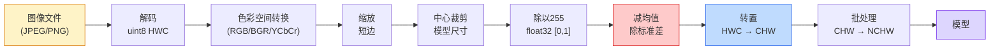
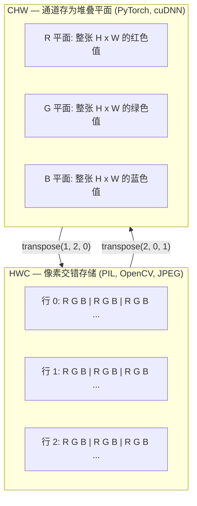

# 图像基础 — 像素、通道与色彩空间

> 一张图像是一个光样本的张量。你使用的每一个视觉模型都从这一个事实出发。

**类型:** Build
**语言:** Python
**前置要求:** Phase 1 Lesson 12 (Tensor Operations), Phase 3 Lesson 11 (Intro to PyTorch)
**时间:** ~45 分钟

## 学习目标

- 解释连续场景如何被离散化为像素，以及采样/量化决策如何为下游模型设定天花板
- 以 NumPy 数组的方式读取、切片、检验图像，并在 HWC 和 CHW 布局之间流畅切换
- 在 RGB、灰度、HSV 和 YCbCr 之间相互转换，并说明每种色彩空间存在的原因
- 按照 torchvision 期望的方式精确应用像素级预处理（归一化、标准化、缩放、通道优先）

## 问题

你读的每一篇论文、下载的每一个预训练权重、调用的每一个视觉 API，都假设输入有一种特定的编码方式。向一个需要 `float32` 的模型传入 `uint8` 图像，它仍然会运行——但会静默地产生垃圾。把 BGR 输入给一个用 RGB 训练的模型，准确率会下降十个点。把通道优先的输入交给期望通道最后的模型，第一个卷积层会把高度当作一个特征通道。这些都不会报错。它们只是毁了你的指标，然后你花一周时间追踪一个藏在"你怎么加载文件的方式"里的 bug。

卷积在知道它滑过什么之后并不复杂。难点在于"一张图像"对摄像头、JPEG 解码器、PIL、OpenCV、torchvision 和 CUDA 内核来说含义各不相同。每种堆栈都有自己的轴序、字节序和通道约定。一个搞不清这些的视觉工程师会发出破损的流水线。

本课修复这个基础，这样本 phase 的其余部分就可以在其上构建。学完之后你会知道一个像素是什么、为什么每个像素是三个数字而不是一个、"用 ImageNet 统计量归一化"实际上做了什么，以及如何在接下来几课都会用到的两三种布局之间移动。

## 概念

### 完整预处理流水线一览

每个生产级视觉系统都是同一序列的可逆变换。错了一步，模型看到的输入就与训练时的不同。



红框和蓝框是 80% 静默故障所在：缺失标准化和错误的布局。

### 像素是一个样本，不是方块

摄像头传感器对落在微小探测器网格上的光子进行计数。每个探测器积分一小段时间，然后发出一个与撞击它的光子数量成比例的电压。然后传感器把这个电压离散化为一个整数。一个探测器成为一个像素。

```
连续场景                传感器网格               数字图像
（无限细节）            (H x W 探测器)           (H x W 整数)

    ~~~~~                   +--+--+--+--+--+                210 198 180 155 120
   ~   ~   ~                 |  |  |  |  |  |                205 195 178 152 118
  ~ light ~      ---->       +--+--+--+--+--+    ---->      200 190 175 150 115
   ~~~~~                     |  |  |  |  |  |                195 185 170 148 112
                             +--+--+--+--+--+                188 180 165 145 108
```

在这一步有两个选择，它们为下游的一切设定了天花板：

- **空间采样** 决定每度场景多少个探测器。太少，边缘会变得锯齿（混叠）。太多，存储和计算爆炸。
- **强度量化** 决定电压被分进多少个桶。8 位给出 256 个级别，是显示的标准。10、12、16 位给出更平滑的渐变，对医学成像、HDR 和原始传感器流水线很重要。

像素不是有色面积方块。它是一个单一测量。当你缩放或旋转时，你是在对这个测量网格重新采样。

### 为什么是三个通道

一个探测器对整个可见光谱的光子计数——那是灰度。要得到颜色，传感器用一个红、绿、蓝滤镜的镶嵌覆盖网格。去马赛克后，每个空间位置有三个整数：红滤镜探测器、绿滤镜探测器以及附近蓝滤镜探测器的响应。这三个整数是一个像素的 RGB 三元组。

```
内存中的一个像素：

    (R, G, B) = (210, 140, 30)   <- 红橙色

一张 H x W RGB 图像：

    形状 (H, W, 3)     存储为   H 行 W 像素每像素 3 个值
                                    每个在 uint8 的 [0, 255] 范围内
```

三个不是魔法。深度摄像头加一个 Z 通道。卫星加红外和紫外波段。医学扫描通常有一个通道（X 光、CT）或多个（高光谱）。通道数是最后一个轴；卷积层学会混合它。

### 两种布局约定：HWC 和 CHW

同一张量，两种顺序。每个库选择一个。

```
HWC (高度, 宽度, 通道)           CHW (通道, 高度, 宽度)

   W ->                                H ->
  +-----+-----+-----+                +-----+-----+
H |R G B|R G B|R G B|              C |R R R R R R|
| +-----+-----+-----+              | +-----+-----+
v |R G B|R G B|R G B|              v |G G G G G G|
  +-----+-----+-----+                +-----+-----+
                                         |B B B B B B|
                                         +-----+-----+

   PIL、OpenCV、matplotlib，           PyTorch、主流深度学习
   几乎所有磁盘上的图像文件            框架、cuDNN 内核
```

CHW 存在是因为卷积核在 H 和 W 上滑动。把通道轴放在最前面意味着每个核看到一个连续的 2D 平面每通道，向量化流畅。磁盘格式保留 HWC 因为那匹配传感器出来的扫描线顺序。

你将输入一千次的一行代码：

```
img_chw = img_hwc.transpose(2, 0, 1)      # NumPy
img_chw = img_hwc.permute(2, 0, 1)        # PyTorch 张量
```

内存布局的可视化：



### 字节范围和 dtype

三种约定占主导：

| 约定 | dtype | 范围 | 你在哪里看到它 |
|------|-------|------|---------------|
| 原始 | `uint8` | [0, 255] | 磁盘上的文件、PIL、OpenCV 输出 |
| 归一化 | `float32` | [0.0, 1.0] | `img.astype('float32') / 255` 之后 |
| 标准化 | `float32` | 大约 [-2, +2] | 减均值再除标准差之后 |

卷积网络在标准化后的输入上训练。ImageNet 统计量 `mean=[0.485, 0.456, 0.406]`、`std=[0.229, 0.224, 0.225]` 是三个通道在整个 ImageNet 训练集上的算术均值和标准差，在 [0, 1] 归一化像素上计算。把原始 `uint8` 输入给一个期望标准化浮点的模型，是应用视觉中最常见的静默故障。

### 色彩空间及为何存在

RGB 是采集格式，但并非总是对模型最有用的表示。

```
 RGB               HSV                       YCbCr / YUV

 R red             H hue (角度 0-360)        Y luminance（亮度）
 G green           S saturation (0-1)        Cb chroma 蓝-黄
 B blue            V value/brightness (0-1)  Cr chroma 红-绿

 线性到             分离颜色与                 分离亮度与
 传感器输出         亮度。用于                  颜色。JPEG 和大多数视频
                  颜色阈值分割、UI             编解码器对色度
                  滑块、简单滤镜               通道压缩更狠，因为
                                             人眼对色度细节的
                                             敏感度低于对亮度。
```

对于大多数现代 CNN 你输入 RGB。你在以下情况遇到其他空间：

- **HSV** — 经典 CV 代码、基于颜色的分割、白平衡。
- **YCbCr** — 读取 JPEG 内部、视频流水线、仅在 Y 上运行的超分辨率模型。
- **灰度** — OCR、文档模型、颜色是讨厌的变量而非信号的任何情况。

从 RGB 到灰度是加权和，不是平均，因为人眼对绿色比红色或蓝色更敏感：

```
Y = 0.299 R + 0.587 G + 0.114 B       (ITU-R BT.601，经典权重)
```

### 长宽比、缩放与插值

每个模型有一个固定输入尺寸（大多数 ImageNet 分类器是 224x224，现代检测器是 384x384 或 512x512）。你的图像很少匹配。三种缩放选择重要：

- **缩放短边，然后中心裁剪** — 标准 ImageNet 配方。保持长宽比，丢弃边缘像素条。
- **缩放后填充** — 保持长宽比和每个像素，添加黑条。检测和 OCR 的标准。
- **直接缩放到目标** — 拉伸图像。便宜，扭曲几何，对许多分类任务够用。

插值方法决定当新网格与旧网格不对齐时如何计算中间像素：

```
最近邻          最快，块状，仅用于掩码/标签
双线性          快，平滑，大多数图像缩放的默认
双立方          较慢，放大时更清晰
Lanczos         最慢，质量最好，用于最终显示
```

经验法则：训练用双线性，你要看的素材用双立方或 Lanczos，包含整数类别 ID 的任何东西用最近邻。

## 构建

### 第 1 步：加载图像并检查形状

用 Pillow 加载任意 JPEG 或 PNG，转为 NumPy，打印你得到了什么。对于可离线运行的确定性示例，合成一个。

```python
import numpy as np
from PIL import Image

def synthetic_rgb(h=128, w=192, seed=0):
    rng = np.random.default_rng(seed)
    yy, xx = np.meshgrid(np.linspace(0, 1, h), np.linspace(0, 1, w), indexing="ij")
    r = (np.sin(xx * 6) * 0.5 + 0.5) * 255
    g = yy * 255
    b = (1 - yy) * xx * 255
    rgb = np.stack([r, g, b], axis=-1) + rng.normal(0, 6, (h, w, 3))
    return np.clip(rgb, 0, 255).astype(np.uint8)

arr = synthetic_rgb()
# 或从磁盘加载：
# arr = np.asarray(Image.open("your_image.jpg").convert("RGB"))

print(f"type:   {type(arr).__name__}")
print(f"dtype:  {arr.dtype}")
print(f"shape:  {arr.shape}     # (H, W, C)")
print(f"min:    {arr.min()}")
print(f"max:    {arr.max()}")
print(f"pixel at (0, 0): {arr[0, 0]}")
```

期望输出：`shape: (H, W, 3)`、`dtype: uint8`、范围 `[0, 255]`。这是磁盘上规范的表示，无论字节来自摄像头、JPEG 解码器还是合成生成器。

### 第 2 步：分离通道并重排布局

分别取出 R、G、B，然后从 HWC 转为 CHW 给 PyTorch。

```python
R = arr[:, :, 0]
G = arr[:, :, 1]
B = arr[:, :, 2]
print(f"R shape: {R.shape}, mean: {R.mean():.1f}")
print(f"G shape: {G.shape}, mean: {G.mean():.1f}")
print(f"B shape: {B.shape}, mean: {B.mean():.1f}")

arr_chw = arr.transpose(2, 0, 1)
print(f"\nHWC shape: {arr.shape}")
print(f"CHW shape: {arr_chw.shape}")
```

三个灰度平面，每个通道一个。CHW 只是重排轴；当内存布局允许时不需要严格的数据复制。

### 第 3 步：灰度和 HSV 转换

加权求和灰度，然后手动 RGB 到 HSV。

```python
def rgb_to_grayscale(rgb):
    weights = np.array([0.299, 0.587, 0.114], dtype=np.float32)
    return (rgb.astype(np.float32) @ weights).astype(np.uint8)

def rgb_to_hsv(rgb):
    rgb_f = rgb.astype(np.float32) / 255.0
    r, g, b = rgb_f[..., 0], rgb_f[..., 1], rgb_f[..., 2]
    cmax = np.max(rgb_f, axis=-1)
    cmin = np.min(rgb_f, axis=-1)
    delta = cmax - cmin

    h = np.zeros_like(cmax)
    mask = delta > 0
    rmax = mask & (cmax == r)
    gmax = mask & (cmax == g)
    bmax = mask & (cmax == b)
    h[rmax] = ((g[rmax] - b[rmax]) / delta[rmax]) % 6
    h[gmax] = ((b[gmax] - r[gmax]) / delta[gmax]) + 2
    h[bmax] = ((r[bmax] - g[bmax]) / delta[bmax]) + 4
    h = h * 60.0

    s = np.where(cmax > 0, delta / cmax, 0)
    v = cmax
    return np.stack([h, s, v], axis=-1)

gray = rgb_to_grayscale(arr)
hsv = rgb_to_hsv(arr)
print(f"gray shape: {gray.shape}, range: [{gray.min()}, {gray.max()}]")
print(f"hsv   shape: {hsv.shape}")
print(f"hue range: [{hsv[..., 0].min():.1f}, {hsv[..., 0].max():.1f}] degrees")
print(f"sat range: [{hsv[..., 1].min():.2f}, {hsv[..., 1].max():.2f}]")
print(f"val range: [{hsv[..., 2].min():.2f}, {hsv[..., 2].max():.2f}]")
```

色相以度为单位输出，饱和度和明度在 [0, 1]。这匹配 OpenCV `hsv_full` 约定。

### 第 4 步：归一化、标准化与逆操作

从原始字节到预训练 ImageNet 模型期望的精确张量，然后反回来。

```python
mean = np.array([0.485, 0.456, 0.406], dtype=np.float32)
std = np.array([0.229, 0.224, 0.225], dtype=np.float32)

def preprocess_imagenet(rgb_uint8):
    x = rgb_uint8.astype(np.float32) / 255.0
    x = (x - mean) / std
    x = x.transpose(2, 0, 1)
    return x

def deprocess_imagenet(chw_float32):
    x = chw_float32.transpose(1, 2, 0)
    x = x * std + mean
    x = np.clip(x * 255.0, 0, 255).astype(np.uint8)
    return x

x = preprocess_imagenet(arr)
print(f"preprocessed shape: {x.shape}     # (C, H, W)")
print(f"preprocessed dtype: {x.dtype}")
print(f"preprocessed mean per channel:  {x.mean(axis=(1, 2)).round(3)}")
print(f"preprocessed std  per channel:  {x.std(axis=(1, 2)).round(3)}")

roundtrip = deprocess_imagenet(x)
max_diff = np.abs(roundtrip.astype(int) - arr.astype(int)).max()
print(f"roundtrip max pixel diff: {max_diff}    # should be 0 or 1")
```

每通道均值应接近零，标准差接近一。preprocess/deprocess 对正是每个 torchvision `transforms.Normalize` 在底层所做的。

### 第 5 步：三种插值方式缩放

比较最近邻、双线和双立方在上采样上的差异，以便可见差异。

```python
target = (arr.shape[0] * 3, arr.shape[1] * 3)

nearest = np.asarray(Image.fromarray(arr).resize(target[::-1], Image.NEAREST))
bilinear = np.asarray(Image.fromarray(arr).resize(target[::-1], Image.BILINEAR))
bicubic = np.asarray(Image.fromarray(arr).resize(target[::-1], Image.BICUBIC))

def local_roughness(x):
    gy = np.diff(x.astype(float), axis=0)
    gx = np.diff(x.astype(float), axis=1)
    return float(np.abs(gy).mean() + np.abs(gx).mean())

for name, out in [("nearest", nearest), ("bilinear", bilinear), ("bicubic", bicubic)]:
    print(f"{name:>8}  shape={out.shape}  roughness={local_roughness(out):6.2f}")
```

最近邻在粗糙度上得分最高，因为它保留了硬边缘。双线性最平滑。双立方介于两者之间，在保留感知清晰度的同时没有阶梯伪影。

## 使用

`torchvision.transforms` 把上述所有东西打包成一条可组合的流水线。下面的代码精确重现了 `preprocess_imagenet` 的功能，加上 resize 和 crop。

```python
import torch
from torchvision import transforms
from PIL import Image

img = Image.fromarray(synthetic_rgb(256, 256))

pipeline = transforms.Compose([
    transforms.Resize(256),
    transforms.CenterCrop(224),
    transforms.ToTensor(),
    transforms.Normalize(mean=[0.485, 0.456, 0.406], std=[0.229, 0.224, 0.225]),
])

x = pipeline(img)
print(f"tensor type:  {type(x).__name__}")
print(f"tensor dtype: {x.dtype}")
print(f"tensor shape: {tuple(x.shape)}      # (C, H, W)")
print(f"per-channel mean: {x.mean(dim=(1, 2)).tolist()}")
print(f"per-channel std:  {x.std(dim=(1, 2)).tolist()}")

batch = x.unsqueeze(0)
print(f"\nbatched shape: {tuple(batch.shape)}   # (N, C, H, W) — 准备送入模型")
```

四步，精确按此顺序：`Resize(256)` 将短边缩放到 256；`CenterCrop(224)` 从中间取一个 224x224 块；`ToTensor()` 除以 255 并交换 HWC 到 CHW；`Normalize` 减去 ImageNet 均值并除以标准差。颠倒这个顺序会静默改变到达模型的内容。

## 交付

本课产出：

- `outputs/prompt-vision-preprocessing-audit.md` — 一个提示，将任何模型卡或数据集卡变成团队必须遵守的精确预处理不变量检查清单。
- `outputs/skill-image-tensor-inspector.md` — 一个技能，给定任意图像形状的张量或数组，报告 dtype、布局、范围，以及它看起来是原始、归一化还是标准化的。

## 练习

1. **(简单)** 用 OpenCV (`cv2.imread`) 和 Pillow 加载一张 JPEG。打印两个形状和像素 `(0, 0)`。解释通道顺序差异，然后写一行转换使 OpenCV 数组与 Pillow 数组相同。
2. **(中等)** 写 `standardize(img, mean, std)` 及其逆函数，两者一起在一个任意 uint8 图像上通过 `roundtrip_max_diff <= 1` 测试。你的函数必须在 HWC 的单张图像和 NCHW 的批量上用相同调用工作。
3. **(困难)** 取一个 3 通道 ImageNet 标准化张量，运行它通过一个 1x1 卷积，该卷积学习 RGB 到单一灰度通道的加权混合。用 `[0.299, 0.587, 0.114]` 初始化权重，冻结它们，验证输出与你的手动 `rgb_to_grayscale` 在浮点误差范围内匹配。还有哪些经典色彩空间变换可以写成 1x1 卷积？

## 关键术语

| 术语 | 人们怎么叫 | 实际含义 |
|------|-----------|---------|
| Pixel（像素） | "一个有色方块" | 一个网格位置的光强度采样——彩色三个数，灰度一个 |
| Channel（通道） | "颜色" | 堆叠到图像张量中的平行空间网格之一；HWC 中是最后轴，CHW 中是第一轴 |
| HWC / CHW | "形状" | 图像张量的轴序；磁盘和 PIL 用 HWC，PyTorch 和 cuDNN 用 CHW |
| Normalize（归一化） | "缩放图像" | 除以 255 使像素落在 [0, 1]——必要但不充分 |
| Standardize（标准化） | "零中心" | 每通道减均值再除标准差，使输入分布与模型训练时的匹配 |
| Grayscale conversion（灰度转换） | "平均通道" | 用 0.299/0.587/0.114 系数的加权和，匹配人眼亮度感知 |
| Interpolation（插值） | "resize 如何选像素" | 当新网格与旧网格不对齐时决定输出值的规则——标签用最近邻，训练用双线性，显示用双立方 |
| Aspect ratio（长宽比） | "宽高比" | 区分"缩放后填充"与"缩放后拉伸"的比例 |

## 扩展阅读

- [Charles Poynton — A Guided Tour of Color Space](https://poynton.ca/PDFs/Guided_tour.pdf) — 最清晰的技术处理，解释为何有这么多色彩空间以及何时每个重要
- [PyTorch Vision Transforms Docs](https://pytorch.org/vision/stable/transforms.html) — 你在生产中实际组合的完整 transforms 流水线
- [How JPEG Works (Colt McAnlis)](https://www.youtube.com/watch?v=F1kYBnY6mwg) — 色度子采样、DCT 以及为何 JPEG 编码 YCbCr 而非 RGB 的清晰视觉之旅
- [ImageNet Preprocessing Conventions (torchvision models)](https://pytorch.org/vision/stable/models.html) — `mean=[0.485, 0.456, 0.406]` 的来源，以及为何该模型库中每个模型都期望它