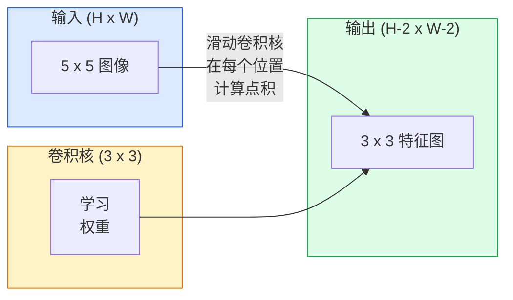
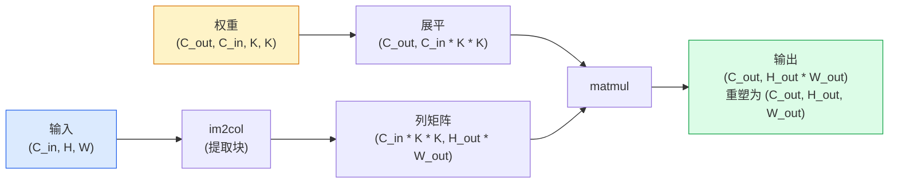

# 卷积从零实现

> 卷积就是一个你在图像上滑动的小型全连接层，在每个位置共享相同的权重。

**类型:** 构建
**语言:** Python
**前置要求:** Phase 3（深度学习核心），Phase 4 Lesson 01（图像基础）
**时长:** ~75 分钟

## 学习目标

- 仅使用 NumPy 从零实现 2D 卷积，包括嵌套循环版本和向量化 `im2col` 版本
- 计算任意输入尺寸、卷积核尺寸、填充和步长的输出空间尺寸，并解释 `(H - K + 2P) / S + 1` 公式
- 手设卷积核（边缘、模糊、锐化、Sobel）并解释每个为什么产生它那样的激活模式
- 将卷积堆叠成特征提取器，并将堆栈深度与感受野大小联系起来

## 问题所在

一个全连接层在 224×224 RGB 图像上需要 224 × 224 × 3 = 150,528 个输入权重每个神经元。一个只有 1,000 个单元的隐藏层已经是 1.5 亿参数——在你学到任何有用的东西之前。更糟糕的是，该层不知道狗在左上角和狗在右下角是同一模式。它把每个像素位置当作独立的，而这对图像来说恰恰是错误的：把一只猫平移三个像素不应该迫使网络重新学习概念。

图像模型需要的两个性质是**平移等变性**（输出随输入移动）和**参数共享**（同一特征检测器在各处运行）。全连接层两者都不提供。卷积免费提供两者。

卷积不是为深度学习发明的。它是驱动 JPEG 压缩、Photoshop 高斯模糊、工业视觉边缘检测和每个已发货音频滤波器的同一操作。CNN 在 2012 年至 2020 年主导 ImageNet 的原因是卷积是对"相邻值相关且同一模式可出现在任何地方"的数据的正确先验。

## 核心概念

### 一个卷积核，滑动

2D 卷积取一个称为卷积核（或滤波器）的小权重矩阵，在输入上滑动，在每个位置计算元素积的和。那个和成为一个输出像素。



5×5 输入上 3×3 的具体例子（无填充，步长 1）：

```
输入 X (5 x 5):                卷积核 W (3 x 3):

  1  2  0  1  2                   1  0 -1
  0  1  3  1  0                   2  0 -2
  2  1  0  2  1                   1  0 -1
  1  0  2  1  3
  2  1  1  0  1

卷积核在每个有效的 3 x 3 窗口上滑动。输出 Y 为 3 x 3:

 Y[0,0] = sum( W * X[0:3, 0:3] )
 Y[0,1] = sum( W * X[0:3, 1:4] )
 Y[0,2] = sum( W * X[0:3, 2:5] )
 Y[1,0] = sum( W * X[1:4, 0:3] )
 ... 以此类推
```

这一个公式——**共享权重、局部性、滑窗**——就是全部想法。其余都是簿记。

### 输出尺寸公式

给定输入空间尺寸 `H`、卷积核尺寸 `K`、填充 `P`、步长 `S`：

```
H_out = floor( (H - K + 2P) / S ) + 1
```

记住这个。你每设计一个架构会计算它几十次。

| 场景 | H | K | P | S | H_out |
|------|---|---|---|---|-------|
| Valid 卷积，无填充 | 32 | 3 | 0 | 1 | 30 |
| Same 卷积（保持尺寸） | 32 | 3 | 1 | 1 | 32 |
| 下采样 2 | 32 | 3 | 1 | 2 | 16 |
| 池化 2x2 | 32 | 2 | 0 | 2 | 16 |
| 大感受野 | 32 | 7 | 3 | 2 | 16 |

"Same 填充"意味着当 S == 1 时取 P 使 H_out == H。对于奇数 K，P = (K - 1) / 2。这就是为什么 3×3 卷积核占主导——它是有中心的最小的奇数卷积核。

### 填充

没有填充，每个卷积都会缩小特征图。堆叠 20 个，你的 224×224 图像变成 184×184，这浪费了边框上的计算并使需要匹配形状的残差连接复杂化。

```
在 5 x 5 输入上零填充 (P = 1):

  0  0  0  0  0  0  0
  0  1  2  0  1  2  0
  0  0  1  3  1  0  0
  0  2  1  0  2  1  0       现在卷积核可以以像素
  0  1  0  2  1  3  0       (0, 0) 为中心，仍有三个行和
  0  2  1  1  0  1  0       三列值相乘。
  0  0  0  0  0  0  0
```

实践中遇到的方式：`zero`（最常见）、`reflect`（镜像边缘，避免生成模型中的硬边框）、`replicate`（复制边缘）、`circular`（绕回，用于环面问题）。

### 步长

步长是滑动的步幅。`stride=1` 是默认。`stride=2` 减半空间尺寸，是 CNN 内下采样的经典方式，而不需要单独的池化层——每个现代架构（ResNet、ConvNeXt、MobileNet）都在某处用步长卷积代替最大池化。

```
步长 1 在 5 x 5 输入上，3 x 3 卷积核：

  起点: (0,0) (0,1) (0,2)        -> 输出行 0
          (1,0) (1,1) (1,2)        -> 输出行 1
          (2,0) (2,1) (2,2)        -> 输出行 2

  输出: 3 x 3

步长 2 在同一输入上：

  起点: (0,0) (0,2)              -> 输出行 0
          (2,0) (2,2)              -> 输出行 1

  输出: 2 x 2
```

### 多输入通道

真实图像有三个通道。RGB 输入上的 3×3 卷积实际上是一个 3×3×3 的体积：每个输入通道一个 3×3 切片。在每个空间位置，你在所有三个切片上逐元素相乘并求和，然后加一个偏置。

```
输入:   (C_in,  H,  W)        3 x 5 x 5
卷积核:  (C_in,  K,  K)        3 x 3 x 3 （一个卷积核）
输出:  (1,     H', W')       2D 特征图

对于产生 C_out 输出通道的层，堆叠 C_out 个卷积核：

权重:  (C_out, C_in, K, K)   例如 64 x 3 x 3 x 3
输出:  (C_out, H', W')       64 x 3 x 3

参数量: C_out * C_in * K * K + C_out   （+ C_out 是偏置）
```

最后一行是你规划模型时要计算的。64 通道 3×3 卷积在 3 通道输入上有 `64 * 3 * 3 * 3 + 64 = 1,792` 参数。便宜。

### im2col 技巧

嵌套循环易读但慢。GPU 想要大矩阵乘法。技巧：将输入的每个感受野窗口展平为矩阵的一列，将卷积核展平为一行，整个卷积变成一个单独的矩阵乘法。



每个生产卷积实现都是这个的变体加上缓存平铺技巧（direct conv、Winograd、FFT conv 用于大卷积核）。理解 im2col 就理解核心。

### 感受野

单个 3×3 卷积看 9 个输入像素。堆叠两个 3×3 卷积，第二层的神经元看 5×5 输入像素。三个 3×3 卷积给出 7×7。一般地：

```
L 个堆叠 K x K 卷积（步长 1）后的感受野 = 1 + L * (K - 1)

有步长时：感受野随每层的步长乘法增长。
```

"3×3 一直到底"（VGG、ResNet、ConvNeXt）有效的全部原因：两个 3×3 卷积看到与一个 5×5 卷积相同的输入区域，但参数更少且中间多了一个非线性。

## 构建

### 第 1 步：填充数组

从最小的原语开始：一个在 H × W 数组周围填充零的函数。

```python
import numpy as np

def pad2d(x, p):
    if p == 0:
        return x
    h, w = x.shape[-2:]
    out = np.zeros(x.shape[:-2] + (h + 2 * p, w + 2 * p), dtype=x.dtype)
    out[..., p:p + h, p:p + w] = x
    return out

x = np.arange(9).reshape(3, 3)
print(x)
print()
print(pad2d(x, 1))
```

尾部轴技巧 `x.shape[:-2]` 意味着同一函数无需修改即可在 `(H, W)`、`(C, H, W)` 或 `(N, C, H, W)` 上工作。

### 第 2 步：嵌套循环的 2D 卷积

参考实现——慢，但明确。这正是 `torch.nn.functional.conv2d` 原则上所做的。

```python
def conv2d_naive(x, w, b=None, stride=1, padding=0):
    c_in, h, w_in = x.shape
    c_out, c_in_w, kh, kw = w.shape
    assert c_in == c_in_w

    x_pad = pad2d(x, padding)
    h_out = (h + 2 * padding - kh) // stride + 1
    w_out = (w_in + 2 * padding - kw) // stride + 1

    out = np.zeros((c_out, h_out, w_out), dtype=np.float32)
    for oc in range(c_out):
        for i in range(h_out):
            for j in range(w_out):
                hs = i * stride
                ws = j * stride
                patch = x_pad[:, hs:hs + kh, ws:ws + kw]
                out[oc, i, j] = np.sum(patch * w[oc])
        if b is not None:
            out[oc] += b[oc]
    return out
```

四个嵌套循环（输出通道、行、列，加上 C_in、kh、kw 上的隐式求和）。这是你要检查每个更快实现的标准答案。

### 第 3 步：用手动设计的卷积核验证

构建一个垂直 Sobel 卷积核，将其应用到合成阶梯图像，观察垂直边缘亮起。

```python
def synthetic_step_image():
    img = np.zeros((1, 16, 16), dtype=np.float32)
    img[:, :, 8:] = 1.0
    return img

sobel_x = np.array([
    [[-1, 0, 1],
     [-2, 0, 2],
     [-1, 0, 1]]
], dtype=np.float32)[None]

x = synthetic_step_image()
y = conv2d_naive(x, sobel_x, padding=1)
print(y[0].round(1))
```

期望在列 7（左到右亮度增加）上有大正值，其他地方为零。单独这一行是你的数学正确性的完整性检查。

### 第 4 步：im2col

将输入中每个卷积核大小的窗口转换为矩阵的一列。对于 `C_in=3, K=3`，每列 27 个数。

```python
def im2col(x, kh, kw, stride=1, padding=0):
    c_in, h, w = x.shape
    x_pad = pad2d(x, padding)
    h_out = (h + 2 * padding - kh) // stride + 1
    w_out = (w + 2 * padding - kw) // stride + 1

    cols = np.zeros((c_in * kh * kw, h_out * w_out), dtype=x.dtype)
    col = 0
    for i in range(h_out):
        for j in range(w_out):
            hs = i * stride
            ws = j * stride
            patch = x_pad[:, hs:hs + kh, ws:ws + kw]
            cols[:, col] = patch.reshape(-1)
            col += 1
    return cols, h_out, w_out
```

它仍然是 Python 循环，但现在重活将是单个向量化矩阵乘法。

### 第 5 步：通过 im2col + matmul 快速卷积

用一次矩阵乘法替换四重循环。

```python
def conv2d_im2col(x, w, b=None, stride=1, padding=0):
    c_out, c_in, kh, kw = w.shape
    cols, h_out, w_out = im2col(x, kh, kw, stride, padding)
    w_flat = w.reshape(c_out, -1)
    out = w_flat @ cols
    if b is not None:
        out += b[:, None]
    return out.reshape(c_out, h_out, w_out)
```

正确性检查：运行两个实现并比较。

```python
rng = np.random.default_rng(0)
x = rng.normal(0, 1, (3, 16, 16)).astype(np.float32)
w = rng.normal(0, 1, (8, 3, 3, 3)).astype(np.float32)
b = rng.normal(0, 1, (8,)).astype(np.float32)

y_naive = conv2d_naive(x, w, b, padding=1)
y_im2col = conv2d_im2col(x, w, b, padding=1)

print(f"max abs diff: {np.max(np.abs(y_naive - y_im2col)):.2e}")
```

`max abs diff` 应在 `1e-5` 左右——差异是浮点累积顺序，不是 bug。

### 第 6 步：手动设计的卷积核库

五个滤波器，展示一个卷积层在任何训练之前可以表达什么。

```python
KERNELS = {
    "identity": np.array([[0, 0, 0], [0, 1, 0], [0, 0, 0]], dtype=np.float32),
    "blur_3x3": np.ones((3, 3), dtype=np.float32) / 9.0,
    "sharpen": np.array([[0, -1, 0], [-1, 5, -1], [0, -1, 0]], dtype=np.float32),
    "sobel_x": np.array([[-1, 0, 1], [-2, 0, 2], [-1, 0, 1]], dtype=np.float32),
    "sobel_y": np.array([[-1, -2, -1], [0, 0, 0], [1, 2, 1]], dtype=np.float32),
}

def apply_kernel(img2d, kernel):
    x = img2d[None].astype(np.float32)
    w = kernel[None, None]
    return conv2d_im2col(x, w, padding=1)[0]
```

应用到任意灰度图像，模糊柔化、锐化锐化边缘、Sobel-x 亮起垂直边缘、Sobel-y 亮起水平边缘。这些正是 AlexNet 和 VGG 的**第一个**训练卷积层最终学习到的模式——因为一个好的图像模型无论后续任务是什么都需要边缘和斑点检测器。

## 使用

PyTorch 的 `nn.Conv2d` 包装相同操作加上 autograd、CUDA 内核和 cuDNN 优化。形状语义相同。

```python
import torch
import torch.nn as nn

conv = nn.Conv2d(in_channels=3, out_channels=64, kernel_size=3, stride=1, padding=1)
print(conv)
print(f"weight shape: {tuple(conv.weight.shape)}   # (C_out, C_in, K, K)")
print(f"bias shape:   {tuple(conv.bias.shape)}")
print(f"param count:  {sum(p.numel() for p in conv.parameters())}")

x = torch.randn(8, 3, 224, 224)
y = conv(x)
print(f"\ninput  shape: {tuple(x.shape)}")
print(f"output shape: {tuple(y.shape)}")
```

把 `padding=1` 换成 `padding=0`，输出降到 222×222。把 `stride=1` 换成 `stride=2`，它降到 112×112。和你上面记住的公式一样。

## 交付

本课产出：

- `outputs/prompt-cnn-architect.md` — 一个 prompt，给定输入尺寸、参数预算和目标感受野，设计每步有正确 K/S/P 的 `Conv2d` 堆栈。
- `outputs/skill-conv-shape-calculator.md` — 一个 skill，逐层走网络规格并返回每个块的输出尺寸、感受野和参数量。

## 练习

1. **(简单)** 给定 128×128 灰度输入和 `[Conv3x3(s=1,p=1), Conv3x3(s=2,p=1), Conv3x3(s=1,p=1), Conv3x3(s=2,p=1)]`，手工计算每层的输出空间尺寸和感受野。用 dummy conv 的 `nn.Sequential` 验证。
2. **(中等)** 扩展 `conv2d_naive` 和 `conv2d_im2col` 接受 `groups` 参数。展示 `groups=C_in=C_out` 再现深度可分卷积，其参数量是 `C * K * K` 而不是 `C * C * K * K`。
3. **(困难)** 手工实现 `conv2d_im2col` 的反向传播：给定输出梯度，计算 `x` 和 `w` 的梯度。在相同输入和权重上用 `torch.autograd.grad` 验证。技巧：im2col 的梯度是 col2im，且必须累积重叠窗口。

## 关键术语

| 术语 | 常见说法 | 实际含义 |
|------|----------|---------|
| 卷积 | "滑动滤波器" | 在每个空间位置应用的可学习点积，共享权重；数学上是互相关，但大家都叫它卷积 |
| 卷积核 / 滤波器 | "特征检测器" | 形状为 (C_in, K, K) 的小权重张量，其与窗口的点积产生一个输出像素 |
| 步长 | "跳多远" | 连续卷积核放置之间的步幅；步长 2 使每个空间尺寸减半 |
| 填充 | "边缘加零" | 在输入周围添加额外值，使卷积核可以以边框像素为中心；`same` 填充使输出尺寸等于输入尺寸 |
| 感受野 | "神经元看到多少" | 给定输出激活所依赖的原始输入补丁，随深度和步长增长 |
| im2col | "GEMM 技巧" | 将每个感受野窗口重新排列为列，使卷积成为一个大矩阵乘法——每个快速卷积核的核心 |
| 深度可分卷积 | "每通道一个卷积核" | `groups == C_in` 的卷积，每个输出通道仅从其匹配的输入通道计算；MobileNet 和 ConvNeXt 的骨干 |
| 平移等变性 | "移入移出" | 输入平移 k 像素导致输出平移 k 像素的属性；由共享权重免费获得 |

## 延伸阅读

- [A guide to convolution arithmetic for deep learning (Dumoulin & Visin, 2016)](https://arxiv.org/abs/1603.07285) — 每个课程悄悄复制的填充/步长/膨胀的权威图表
- [CS231n: Convolutional Neural Networks for Visual Recognition](https://cs231n.github.io/convolutional-networks/) — 规范讲义，包括原始 im2col 解释
- [The Annotated ConvNet (fast.ai)](https://nbviewer.org/github/fastai/fastbook/blob/master/13_convolutions.ipynb) — 从手动卷积到训练数字分类器的笔记
- [Receptive Field Arithmetic for CNNs (Dang Ha The Hien)](https://distill.pub/2019/computing-receptive-fields/) — 感受野计算的论文级交互式解释器