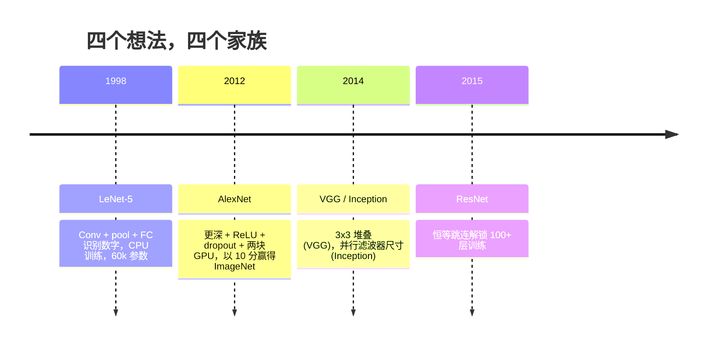
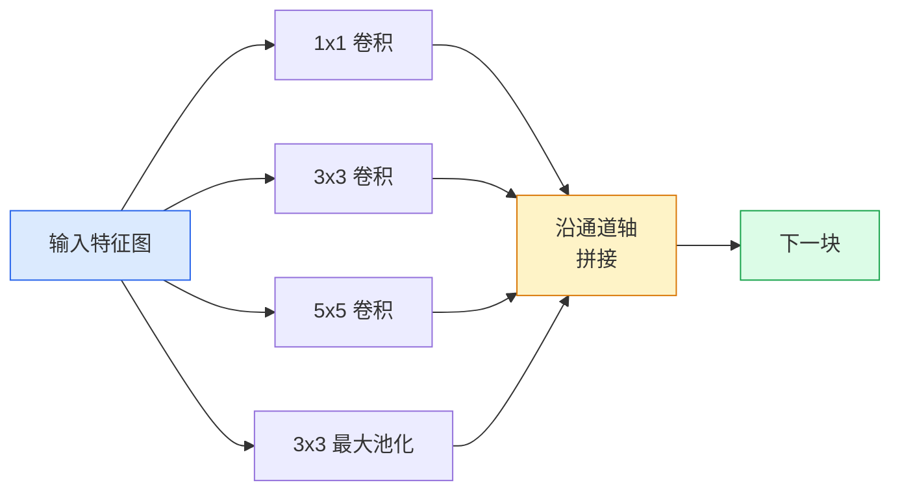
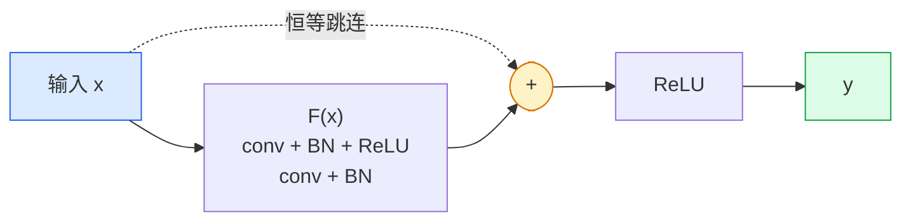

# CNNs — LeNet 到 ResNet

> 过去三十年每个主要 CNN 都是同一个 conv–非线性–下采样的配方，加上一个新想法。依次学习这些想法。

**类型:** 学习 + 构建
**语言:** Python
**前置要求:** Phase 3 Lesson 11（PyTorch），Phase 4 Lesson 01（图像基础），Phase 4 Lesson 02（卷积从零实现）
**时长:** ~75 分钟

## 学习目标

- 追踪架构血统 LeNet-5 -> AlexNet -> VGG -> Inception -> ResNet，说出每个家族贡献的单一新想法
- 在 PyTorch 中实现 LeNet-5、VGG 风格块和 ResNet BasicBlock，每个不超过 40 行
- 解释为什么残差连接将 1,000 层网络从不可训练变成当前最优
- 阅读现代骨干（ResNet-18、ResNet-50）并在查看源码之前预测其输出形状、感受野和参数量

## 问题所在

2011 年，最好的 ImageNet 分类器 top-5 准确率约 74%。2012 年 AlexNet 85%。2015 年 ResNet 96%。没有新数据。没有新 GPU 代际。收益来自架构想法。一个工作的视觉工程师必须知道哪个想法来自哪篇论文，因为 2026 年你交付的每个生产骨干都是那些相同部分的重新组合——而且因为这些想法不断迁移：分组卷积从 CNN 到 transformer，残差连接从 ResNet 到每个 LLM，批标准化活在扩散模型中。

按顺序研究这些网络也会使你免疫一个常见错误：当 LeNet 大小的网络就能解决问题时，却去拿最大的可用模型。MNIST 不需要 ResNet。知道每个家族的扩展曲线告诉你该坐在哪里。

## 核心概念

### 改变视觉的四个想法



经典视觉中没有任何其他东西比这四个飞跃更重要。

### LeNet-5 (1998)

Yann LeCun 的数字识别器。60,000 参数。两个 conv-pool 块，两个全连接层，tanh 激活。它定义了每个 CNN 继承的模板：

```
input (1, 32, 32)
  conv 5x5 -> (6, 28, 28)
  avg pool 2x2 -> (6, 14, 14)
  conv 5x5 -> (16, 10, 10)
  avg pool 2x2 -> (16, 5, 5)
  flatten -> 400
  dense -> 120
  dense -> 84
  dense -> 10
```

现代世界称为 CNN 的全部——交替的卷积和下采样馈入一个小型分类头——都是参数更多、通道更大、激活更好的 LeNet。

### AlexNet (2012)

三个一起打破 ImageNet 的变化：

1. **ReLU** 而非 tanh。梯度停止消失。训练加速六倍。
2. **Dropout** 在全连接头。正则化成为一个层，不是一个技巧。
3. **深度和宽度**。五个卷积层，三个密集层，60M 参数，在两块 GPU 上训练，模型在它们之间分开。

论文的 Figure 2 仍将 GPU 分隔显示为两个并行流。这种并行是硬件变通，不是架构洞察——但上面三个想法仍在每个你使用的模型中。

### VGG (2014)

VGG 问：如果只用 3×3 卷积而且走得很深会怎样？

```
stack:   conv 3x3 -> conv 3x3 -> pool 2x2
repeat:  16 或 19 个卷积层
```

两个 3×3 看与一个 5×5 相同的 5×5 输入区域，但参数量更少（2*9*C^2 = 18C^2 vs 25*C^2），且中间多了一个 ReLU。VGG 将这个观察变成一个完整架构。简洁性——一种块类型，重复——使它成为之后一切的标准参考。

代价：138M 参数，训练慢，推理贵。

### Inception（2014，同年）

Google 对"我应该用多大卷积核？"的回答是：全部，并行。



每个分支专攻——1×1 做通道混合，3×3 做局部纹理，5×5 做更大模式，池化做平移不变特征——拼接让下一层挑选有用的分支。Inception v1 在每个分支内使用 1×1 卷积作为瓶颈以保持参数量合理。

### 退化问题

到 2015 年，VGG-19 可行，VGG-32 不可行。深度应该有帮助，但超过约 20 层后训练和测试损失都变差。那不是过拟合。是优化器找不到有用权重，因为梯度在每层乘法缩小。

```
普通深度网络：
  y = f_L( f_{L-1}( ... f_1(x) ... ) )

对早期层的梯度：
  dL/dW_1 = dL/dy * df_L/df_{L-1} * ... * df_2/df_1 * df_1/dW_1

每个乘法项的量级大约为（权重量级）×（激活增益）。
堆叠 100 个增益 < 1 的项，梯度有效为零。
```

VGG 在 19 层有效是因为批标准化（同期发布）保持激活良好缩放。但即使批标准化也无法在超过约 30 层后拯救深度。

### ResNet (2015)

He、Zhang、Ren、Sun 提出一个改变一切的改变：

```
标准块:   y = F(x)
残差块:   y = F(x) + x
```

`+ x` 意味着该层总可以选择什么都不做——将 `F(x)` 驱动到零。一个 1,000 层 ResNet 现在最多和一个 1 层网络一样差，因为每个额外的块都有一个平凡的逃生口。有了这个保证，优化器愿意让每个块*稍微*有用——而稍微有用，堆叠 100 次，就是当前最优。



块的两种变体到处出现：

- **BasicBlock**（ResNet-18、ResNet-34）：两个 3×3 卷积，跳连绕过两者。
- **Bottleneck**（ResNet-50、-101、-152）：1×1 下、3×3 中间、1×1 上，跳连绕过 trio。当通道数高时更便宜。

当跳连必须跨过下采样（stride=2）时，恒等路径被替换为 1×1 stride=2 卷积以匹配形状。

### 为什么残差在视觉之外重要

这个想法实际上不是关于图像分类的。是关于将深度网络从"交叉手指希望梯度存活"变成一个可靠、可扩展的工程工具。每个你将在下一 phase 读到的 transformer 在每个块中都有完全相同的跳连。没有 ResNet，就没有 GPT。

## 构建

### 第 1 步：LeNet-5

最小、忠实的 LeNet。Tanh 激活，平均池化。唯一对现代性的让步是我们在下游使用 `nn.CrossEntropyLoss` 而不是原始的高斯连接。

```python
import torch
import torch.nn as nn
import torch.nn.functional as F

class LeNet5(nn.Module):
    def __init__(self, num_classes=10):
        super().__init__()
        self.conv1 = nn.Conv2d(1, 6, kernel_size=5)
        self.conv2 = nn.Conv2d(6, 16, kernel_size=5)
        self.pool = nn.AvgPool2d(2)
        self.fc1 = nn.Linear(16 * 5 * 5, 120)
        self.fc2 = nn.Linear(120, 84)
        self.fc3 = nn.Linear(84, num_classes)

    def forward(self, x):
        x = self.pool(torch.tanh(self.conv1(x)))
        x = self.pool(torch.tanh(self.conv2(x)))
        x = torch.flatten(x, 1)
        x = torch.tanh(self.fc1(x))
        x = torch.tanh(self.fc2(x))
        return self.fc3(x)

net = LeNet5()
x = torch.randn(1, 1, 32, 32)
print(f"output: {net(x).shape}")
print(f"params: {sum(p.numel() for p in net.parameters()):,}")
```

期望输出：`output: torch.Size([1, 10])`，`params: 61,706`。这就是开启现代视觉的完整数字分类器。

### 第 2 步：VGG 块

一个可重用块：两个 3×3 卷积、ReLU、批标准化、最大池化。

```python
class VGGBlock(nn.Module):
    def __init__(self, in_c, out_c):
        super().__init__()
        self.conv1 = nn.Conv2d(in_c, out_c, kernel_size=3, padding=1)
        self.bn1 = nn.BatchNorm2d(out_c)
        self.conv2 = nn.Conv2d(out_c, out_c, kernel_size=3, padding=1)
        self.bn2 = nn.BatchNorm2d(out_c)
        self.pool = nn.MaxPool2d(2)

    def forward(self, x):
        x = F.relu(self.bn1(self.conv1(x)))
        x = F.relu(self.bn2(self.conv2(x)))
        return self.pool(x)

class MiniVGG(nn.Module):
    def __init__(self, num_classes=10):
        super().__init__()
        self.stack = nn.Sequential(
            VGGBlock(3, 32),
            VGGBlock(32, 64),
            VGGBlock(64, 128),
        )
        self.head = nn.Sequential(
            nn.AdaptiveAvgPool2d(1),
            nn.Flatten(),
            nn.Linear(128, num_classes),
        )

    def forward(self, x):
        return self.head(self.stack(x))

net = MiniVGG()
x = torch.randn(1, 3, 32, 32)
print(f"output: {net(x).shape}")
print(f"params: {sum(p.numel() for p in net.parameters()):,}")
```

三个 VGG 块在 CIFAR 尺寸输入上，自适应池化，一个线性层。约 290k 参数。CIFAR-10 足够了。

### 第 3 步：ResNet BasicBlock

ResNet-18 和 ResNet-34 的核心构建块。

```python
class BasicBlock(nn.Module):
    def __init__(self, in_c, out_c, stride=1):
        super().__init__()
        self.conv1 = nn.Conv2d(in_c, out_c, kernel_size=3, stride=stride, padding=1, bias=False)
        self.bn1 = nn.BatchNorm2d(out_c)
        self.conv2 = nn.Conv2d(out_c, out_c, kernel_size=3, stride=1, padding=1, bias=False)
        self.bn2 = nn.BatchNorm2d(out_c)
        if stride != 1 or in_c != out_c:
            self.shortcut = nn.Sequential(
                nn.Conv2d(in_c, out_c, kernel_size=1, stride=stride, bias=False),
                nn.BatchNorm2d(out_c),
            )
        else:
            self.shortcut = nn.Identity()

    def forward(self, x):
        out = F.relu(self.bn1(self.conv1(x)))
        out = self.bn2(self.conv2(out))
        out = out + self.shortcut(x)
        return F.relu(out)
```

`bias=False` 在卷积层上是批标准化的约定——BN 的 beta 参数已经处理偏置，所以同时携带卷积偏置是浪费。当 stride 或通道数变化时 shortcut 才需要真实卷积；否则是 no-op 恒等。

### 第 4 步：一个微型 ResNet

堆叠四组 BasicBlock 得到一个在 CIFAR 尺寸输入上可用的 ResNet。

```python
class TinyResNet(nn.Module):
    def __init__(self, num_classes=10):
        super().__init__()
        self.stem = nn.Sequential(
            nn.Conv2d(3, 32, kernel_size=3, stride=1, padding=1, bias=False),
            nn.BatchNorm2d(32),
            nn.ReLU(inplace=True),
        )
        self.layer1 = self._make_group(32, 32, num_blocks=2, stride=1)
        self.layer2 = self._make_group(32, 64, num_blocks=2, stride=2)
        self.layer3 = self._make_group(64, 128, num_blocks=2, stride=2)
        self.layer4 = self._make_group(128, 256, num_blocks=2, stride=2)
        self.head = nn.Sequential(
            nn.AdaptiveAvgPool2d(1),
            nn.Flatten(),
            nn.Linear(256, num_classes),
        )

    def _make_group(self, in_c, out_c, num_blocks, stride):
        blocks = [BasicBlock(in_c, out_c, stride=stride)]
        for _ in range(num_blocks - 1):
            blocks.append(BasicBlock(out_c, out_c, stride=1))
        return nn.Sequential(*blocks)

    def forward(self, x):
        x = self.stem(x)
        x = self.layer1(x)
        x = self.layer2(x)
        x = self.layer3(x)
        x = self.layer4(x)
        return self.head(x)

net = TinyResNet()
x = torch.randn(1, 3, 32, 32)
print(f"output: {net(x).shape}")
print(f"params: {sum(p.numel() for p in net.parameters()):,}")
```

四组，每组两个块。第 2、3、4 组开始处 stride 2。通道数在每次下采样时翻倍。约 2.8M 参数。这是可干净扩展到 ResNet-152 的标准配方。

### 第 5 步：比较参数-特征效率

用相同输入运行所有三个网络并比较参数量。

```python
def summary(name, net, x):
    y = net(x)
    params = sum(p.numel() for p in net.parameters())
    print(f"{name:12s}  input {tuple(x.shape)} -> output {tuple(y.shape)}  params {params:>10,}")

x = torch.randn(1, 3, 32, 32)
summary("LeNet5",     LeNet5(),       torch.randn(1, 1, 32, 32))
summary("MiniVGG",    MiniVGG(),      x)
summary("TinyResNet", TinyResNet(),   x)
```

三个模型，三个时代，三个数量级的参数量。CIFAR-10 准确率，你大约需要：LeNet 60%，MiniVGG 89%，TinyResNet 93%——训练几个 epoch 后。

## 使用

`torchvision.models` 提供上述所有内容的预训练版本。调用签名在家族之间相同，这是骨干抽象的重点。

```python
from torchvision.models import resnet18, ResNet18_Weights, vgg16, VGG16_Weights

r18 = resnet18(weights=ResNet18_Weights.IMAGENET1K_V1)
r18.eval()

print(f"ResNet-18 params: {sum(p.numel() for p in r18.parameters()):,}")
print(r18.layer1[0])
print()

v16 = vgg16(weights=VGG16_Weights.IMAGENET1K_V1)
v16.eval()
print(f"VGG-16   params: {sum(p.numel() for p in v16.parameters()):,}")
```

ResNet-18 有 11.7M 参数。VGG-16 有 138M。相似的 ImageNet top-1 准确率（69.8% vs 71.6%）。残差连接为你赢得 12 倍参数效率。这就是 ResNet 变体从 2016 年到 ViT 2021 年到来期间占主导的原因——在计算是约束的现实世界部署中仍然占主导。

对于迁移学习，配方总是一样的：加载预训练，冻结骨干，替换分类头。

```python
for p in r18.parameters():
    p.requires_grad = False
r18.fc = nn.Linear(r18.fc.in_features, 10)
```

三行。你现在有一个继承 ImageNet 付费表示的 10 类 CIFAR 分类器。

## 交付

本课产出：

- `outputs/prompt-backbone-selector.md` — 一个 prompt，给定任务、数据集规模和计算预算，挑选正确的 CNN 家族（LeNet/VGG/ResNet/MobileNet/ConvNeXt）。
- `outputs/skill-residual-block-reviewer.md` — 一个 skill，读取 PyTorch 模块并标记跳连错误（stride 变化时缺少 shortcut、shortcut 激活顺序、加法相对 BN 的位置）。

## 练习

1. **(简单)** 手工逐层计数 `TinyResNet` 的参数量。与 `sum(p.numel() for p in net.parameters())` 比较。参数预算的主要部分在哪里——卷积、BN 还是分类头？
2. **(中等)** 实现 Bottleneck 块（1×1 -> 3×3 -> 1×1 跳连）并用它构建一个用于 CIFAR 的 ResNet-50 风格网络。比较与 `TinyResNet` 的参数量。
3. **(困难)** 从 `BasicBlock` 移除跳连，在 CIFAR-10 上各训练 10 个 epoch 的 34 块"普通"网络和 34 块 ResNet。绘制两者的训练损失 vs epoch。复现 He 等人 Figure 1 的结果，其中普通深度网络收敛到比其更浅的双胞胎更高的损失。

## 关键术语

| 术语 | 常见说法 | 实际含义 |
|------|----------|---------|
| 骨干 | "模型" | 产生馈入任务头特征图的卷积块堆栈 |
| 残差连接 | "跳连" | `y = F(x) + x`；让优化器通过将 F 设为零来学习恒等，这使任意深度可训练 |
| BasicBlock | "两个 3×3 加跳连" | ResNet-18/34 的构建块：conv-BN-ReLU-conv-BN-加-ReLU |
| Bottleneck | "1×1 下，3×3，1×1 上" | ResNet-50/101/152 块；当通道数高时更便宜，因为 3×3 运行在缩放后的宽度上 |
| 退化问题 | "更深更差" | 超过约 20 层普通卷积后，训练和测试误差都增加；由残差连接解决，不是更多数据 |
| Stem | "第一层" | 将 3 通道输入转换为基本特征宽度的初始卷积；对 ImageNet 通常 7×7 stride 2，对 CIFAR 通常 3×3 stride 1 |
| Head | "分类器" | 最终骨干块之后的层：自适应池化、展平、线性层 |
| 迁移学习 | "预训练权重" | 加载在 ImageNet 上训练的骨干并在你的任务上只微调头 |

## 延伸阅读

- [Deep Residual Learning for Image Recognition (He et al., 2015)](https://arxiv.org/abs/1512.03385) — ResNet 论文；每个图都值得研究
- [Very Deep Convolutional Networks (Simonyan & Zisserman, 2014)](https://arxiv.org/abs/1409.1556) — VGG 论文；"为什么是 3×3" 的最佳参考
- [ImageNet Classification with Deep CNNs (Krizhevsky et al., 2012)](https://papers.nips.cc/paper_files/paper/2012/hash/c399862d3b9d6b76c8436e924a68c45b-Abstract.html) — AlexNet；终结手工特征时代的论文
- [Going Deeper with Convolutions (Szegedy et al., 2014)](https://arxiv.org/abs/1409.4842) — Inception v1；仍在视觉 transformer 中出现的并行滤波器想法