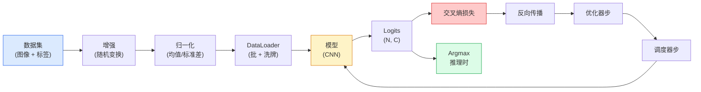

# 图像分类

> 分类器是一个从像素到类别概率分布的函数。其他一切都是管道。

**类型:** 构建
**语言:** Python
**前置要求:** Phase 2 Lesson 09（模型评估），Phase 3 Lesson 10（迷你框架），Phase 4 Lesson 03（CNN）
**时长:** ~75 分钟

## 学习目标

- 在 CIFAR-10 上构建端到端图像分类流水线：数据集、增强、模型、训练循环、评估
- 解释每个组件的作用（dataloader、损失、优化器、调度器、增强），并预测打破其中任何一个如何在损失曲线上表现出来
- 从零实现 mixup、cutout 和标签平滑，并说明何时值得添加
- 阅读混淆矩阵和每类 precision/recall 表，诊断超出 aggregate 准确率的 dataset 和模型失败

## 问题所在

每个交付的视觉任务都在某个层面归结为图像分类。检测对区域分类。分割对像素分类。检索按与类中心的相似度排序。正确掌握分类——数据集循环、增强策略、损失、评估——是迁移到 phase 中每个其他任务的技能。

大多数分类 bug 不在模型中。它们在流水线里：损坏的归一化、未打乱训练集、增强扭曲标签、被训练数据污染的验证集、第 30 个 epoch 后静默发散的学习率。一个在正确设置下 CIFAR-10 上可达 93% 的 CNN 在损坏设置下通常只得到 70-75%，而损失曲线全程看起来合理。

本课手工连接整个流水线，这样每个部分都是可检查的。你不会使用任何可能隐藏 bug 的 `torchvision.datasets`。

## 核心概念

### 分类流水线



这个循环中每一步都可能藏 bug。交叉熵取原始 logits，不取 softmax 输出，所以在损失前 `model(x).softmax()` 悄悄计算出错误梯度。增强只应用于输入，不应用于标签——除了 mixup，它混合两者。`optimizer.zero_grad()` 必须在每步做一次；跳过它会累积梯度，看起来像狂野不稳定的 learning rate。这些 bug 每一个都会压平学习曲线而不抛出错误。

### 交叉熵、logits 和 softmax

分类器为每张图像产生 C 个数，称为 logits。应用 softmax 将它们转换为概率分布：

```
softmax(z)_i = exp(z_i) / sum_j exp(z_j)
```

交叉熵度量正确类的负对数概率：

```
CE(z, y) = -log( softmax(z)_y )
        = -z_y + log( sum_j exp(z_j) )
```

右式是数值稳定的形式（log-sum-exp）。PyTorch 的 `nn.CrossEntropyLoss` 将 softmax + NLL 融合在一个 op 中并直接取原始 logits。先自己应用 softmax 几乎总是一个 bug——你计算 log(softmax(softmax(z)))，一个无意义的量。

### 为什么增强有效

CNN 对平移有归纳偏置（来自权重共享）但对裁剪、翻转、颜色抖动或遮挡没有内置不变性。教它这些不变性的唯一方法是在训练时向它展示行使它们的像素。每个随机变换都是在说："这两张图像有相同标签；学习忽略差异的特征。"

```
原始裁剪:  "狗朝左"
翻转:       "狗朝右"       <- 相同标签，不同像素
旋转(+15):  "狗，轻微倾斜"
颜色抖动:    "狗在更暖的光线下"
RandomErasing:  "狗缺了一块"
```

规则：增强必须保持标签。数字上的 cutout 和旋转可能把 "6" 翻成 "9"；对那个数据集用更小的旋转范围并选择尊重数字特定不变性的增强。

### Mixup 和 Cutmix

普通增强变换像素但保持标签 one-hot。**Mixup** 和 **cutmix** 通过插值两者来打破它。

```
Mixup:
  lambda ~ Beta(a, a)
  x = lambda * x_i + (1 - lambda) * x_j
  y = lambda * y_i + (1 - lambda) * y_j

Cutmix:
  将 x_j 的随机矩形粘贴到 x_i
  y = 面积加权混合 y_i 和 y_j
```

为什么有帮助：模型停止记忆尖锐 one-hot 目标，学会在类之间插值。训练损失上升，测试准确率上升。对任何分类器，这是最便宜的鲁棒性升级。

### 标签平滑

Mixup 的表亲。不是训练 `[0, 0, 1, 0, 0]`，而是训练 `[eps/C, eps/C, 1-eps, eps/C, eps/C]` 对小 eps 如 0.1。阻止模型产生任意尖锐的 logits，几乎零成本改善校准。自 PyTorch 1.10 起内置于 `nn.CrossEntropyLoss(label_smoothing=0.1)`。

### 超越准确率的评估

Aggregate 准确率掩盖不平衡。一个总是预测多数类的 90-10 二分类器得分 90%。真正告诉你发生了什么工具：

- **每类准确率** — 每类一个数字；立即暴露表现不佳的类。
- **混淆矩阵** — C × C 网格，行 i 列 j = 真实类 i 预测为类 j 的计数；对角线正确，非对角线是你的模型所在。
- **Top-1 / Top-5** — 正确类是否在前 1 或前 5 预测中；Top-5 对 ImageNet 重要，因为像 "Norwich terrier" vs "Norfolk terrier" 的类真的是歧义的。
- **校准（ECE）** — 0.8 置信度预测 80% 的时间正确吗？现代网络系统性地过于自信；用温度缩放或标签平滑修复。

## 构建

### 第 1 步：确定性合成数据集

CIFAR-10 在磁盘上。为使本课可复现和快速，我们构建一个看起来像 CIFAR 的合成数据集——32×32 RGB 图像，有类特定结构模型必须学习。完全相同的流水线在真实 CIFAR-10 上不变地工作。

```python
import numpy as np
import torch
from torch.utils.data import Dataset


def synthetic_cifar(num_per_class=1000, num_classes=10, seed=0):
    rng = np.random.default_rng(seed)
    X = []
    Y = []
    for c in range(num_classes):
        centre = rng.uniform(0, 1, (3,))
        freq = 2 + c
        for _ in range(num_per_class):
            yy, xx = np.meshgrid(np.linspace(0, 1, 32), np.linspace(0, 1, 32), indexing="ij")
            r = np.sin(xx * freq) * 0.5 + centre[0]
            g = np.cos(yy * freq) * 0.5 + centre[1]
            b = (xx + yy) * 0.5 * centre[2]
            img = np.stack([r, g, b], axis=-1)
            img += rng.normal(0, 0.08, img.shape)
            img = np.clip(img, 0, 1)
            X.append(img.astype(np.float32))
            Y.append(c)
    X = np.stack(X)
    Y = np.array(Y)
    idx = rng.permutation(len(X))
    return X[idx], Y[idx]


class ArrayDataset(Dataset):
    def __init__(self, X, Y, transform=None):
        self.X = X
        self.Y = Y
        self.transform = transform

    def __len__(self):
        return len(self.X)

    def __getitem__(self, i):
        img = self.X[i]
        if self.transform is not None:
            img = self.transform(img)
        img = torch.from_numpy(img).permute(2, 0, 1)
        return img, int(self.Y[i])
```

每个类获得自己的调色板和频率模式，加上高斯噪声以强制模型学习信号而非记忆像素。十类，每类一千张图像，乱序。

### 第 2 步：归一化和增强

每个视觉流水线都有的两个变换。

```python
def standardize(mean, std):
    mean = np.array(mean, dtype=np.float32)
    std = np.array(std, dtype=np.float32)
    def _fn(img):
        return (img - mean) / std
    return _fn


def random_hflip(p=0.5):
    def _fn(img):
        if np.random.random() < p:
            return img[:, ::-1, :].copy()
        return img
    return _fn


def random_crop(pad=4):
    def _fn(img):
        h, w = img.shape[:2]
        padded = np.pad(img, ((pad, pad), (pad, pad), (0, 0)), mode="reflect")
        y = np.random.randint(0, 2 * pad)
        x = np.random.randint(0, 2 * pad)
        return padded[y:y + h, x:x + w, :]
    return _fn


def compose(*fns):
    def _fn(img):
        for fn in fns:
            img = fn(img)
        return img
    return _fn
```

裁剪前反射填充，不是零填充，因为黑边框是模型会以非有用方式学会忽略的信号。

### 第 3 步：Mixup

在训练步内混合两张图像和两个标签。实现为批变换，这样它位于前向传递旁边而不是数据集内部。

```python
def mixup_batch(x, y, num_classes, alpha=0.2):
    if alpha <= 0:
        return x, torch.nn.functional.one_hot(y, num_classes).float()
    lam = float(np.random.beta(alpha, alpha))
    idx = torch.randperm(x.size(0), device=x.device)
    x_mixed = lam * x + (1 - lam) * x[idx]
    y_onehot = torch.nn.functional.one_hot(y, num_classes).float()
    y_mixed = lam * y_onehot + (1 - lam) * y_onehot[idx]
    return x_mixed, y_mixed


def soft_cross_entropy(logits, soft_targets):
    log_probs = torch.log_softmax(logits, dim=-1)
    return -(soft_targets * log_probs).sum(dim=-1).mean()
```

`soft_cross_entropy` 是对软标签分布的交叉熵。当目标是精确 one-hot 时，它退化为通常的 one-hot 情况。

### 第 4 步：训练循环

完整配方：一次数据遍历，每批梯度一次，每 epoch 调度器步一次。

```python
import torch
import torch.nn as nn
from torch.utils.data import DataLoader
from torch.optim import SGD
from torch.optim.lr_scheduler import CosineAnnealingLR

def train_one_epoch(model, loader, optimizer, device, num_classes, use_mixup=True):
    model.train()
    total, correct, loss_sum = 0, 0, 0.0
    for x, y in loader:
        x, y = x.to(device), y.to(device)
        if use_mixup:
            x_m, y_soft = mixup_batch(x, y, num_classes)
            logits = model(x_m)
            loss = soft_cross_entropy(logits, y_soft)
        else:
            logits = model(x)
            loss = nn.functional.cross_entropy(logits, y, label_smoothing=0.1)
        optimizer.zero_grad()
        loss.backward()
        optimizer.step()
        loss_sum += loss.item() * x.size(0)
        total += x.size(0)
        # 当 mixup 开启时，训练准确率只是对未混合标签 `y` 的近似
        #（模型看到软目标，不是 y）。把它当作粗略进度信号；
        # 依赖 val 准确率获得真实性能。
        with torch.no_grad():
            pred = logits.argmax(dim=-1)
            correct += (pred == y).sum().item()
    return loss_sum / total, correct / total


@torch.no_grad()
def evaluate(model, loader, device, num_classes):
    model.eval()
    total, correct = 0, 0
    loss_sum = 0.0
    cm = torch.zeros(num_classes, num_classes, dtype=torch.long)
    for x, y in loader:
        x, y = x.to(device), y.to(device)
        logits = model(x)
        loss = nn.functional.cross_entropy(logits, y)
        pred = logits.argmax(dim=-1)
        for t, p in zip(y.cpu(), pred.cpu()):
            cm[t, p] += 1
        loss_sum += loss.item() * x.size(0)
        total += x.size(0)
        correct += (pred == y).sum().item()
    return loss_sum / total, correct / total, cm
```

每次写训练循环时检查的五个不变量：

1. 训练前 `model.train()`，评估前 `model.eval()` — 翻转 dropout 和 batchnorm 行为。
2. `.zero_grad()` 在 `.backward()` 之前。
3. 累积指标时用 `.item()` 这样计算图不会保持活跃。
4. 评估时用 `@torch.no_grad()` — 节省内存和时间，防止微妙事故。
5. 对原始 logits 取 argmax，不对 softmax — 结果相同，少一个 op。

### 第 5 步：组合

用前课的 `TinyResNet`，训练几个 epoch，评估。

```python
from main import synthetic_cifar, ArrayDataset
from main import standardize, random_hflip, random_crop, compose
from main import mixup_batch, soft_cross_entropy
from main import train_one_epoch, evaluate
# TinyResNet 来自前课 (03-cnns-lenet-to-resnet)。
# 调整导入路径到你存储前课代码的地方。
from cnns_lenet_to_resnet import TinyResNet  # 示例占位符

X, Y = synthetic_cifar(num_per_class=500)
split = int(0.9 * len(X))
X_train, Y_train = X[:split], Y[:split]
X_val, Y_val = X[split:], Y[split:]

mean = [0.5, 0.5, 0.5]
std = [0.25, 0.25, 0.25]
train_tf = compose(random_hflip(), random_crop(pad=4), standardize(mean, std))
eval_tf = standardize(mean, std)

train_ds = ArrayDataset(X_train, Y_train, transform=train_tf)
val_ds = ArrayDataset(X_val, Y_val, transform=eval_tf)

train_loader = DataLoader(train_ds, batch_size=128, shuffle=True, num_workers=0)
val_loader = DataLoader(val_ds, batch_size=256, shuffle=False, num_workers=0)

device = "cuda" if torch.cuda.is_available() else "cpu"
model = TinyResNet(num_classes=10).to(device)
optimizer = SGD(model.parameters(), lr=0.1, momentum=0.9, weight_decay=5e-4, nesterov=True)
scheduler = CosineAnnealingLR(optimizer, T_max=10)

for epoch in range(10):
    tr_loss, tr_acc = train_one_epoch(model, train_loader, optimizer, device, 10, use_mixup=True)
    va_loss, va_acc, _ = evaluate(model, val_loader, device, 10)
    scheduler.step()
    print(f"epoch {epoch:2d}  lr {scheduler.get_last_lr()[0]:.4f}  "
          f"train {tr_loss:.3f}/{tr_acc:.3f}  val {va_loss:.3f}/{va_acc:.3f}")
```

在合成数据集上，这五个 epoch 内达到接近完美的验证准确率——重点是：流水线正确，模型能学到可学的。换数据集为真实 CIFAR-10，相同循环训练到约 90% 无需更改。

### 第 6 步：读混淆矩阵

单独准确率永远不会告诉你模型在哪里失败。混淆矩阵可以。

```python
def print_confusion(cm, labels=None):
    c = cm.shape[0]
    labels = labels or [str(i) for i in range(c)]
    print(f"{'':>6}" + "".join(f"{l:>5}" for l in labels))
    for i in range(c):
        row = cm[i].tolist()
        print(f"{labels[i]:>6}" + "".join(f"{v:>5}" for v in row))
    print()
    tp = cm.diag().float()
    fp = cm.sum(dim=0).float() - tp
    fn = cm.sum(dim=1).float() - tp
    prec = tp / (tp + fp).clamp_min(1)
    rec = tp / (tp + fn).clamp_min(1)
    f1 = 2 * prec * rec / (prec + rec).clamp_min(1e-9)
    for i in range(c):
        print(f"{labels[i]:>6}  prec {prec[i]:.3f}  rec {rec[i]:.3f}  f1 {f1[i]:.3f}")

_, _, cm = evaluate(model, val_loader, device, 10)
print_confusion(cm)
```

行是真实类，列是预测。类 3 和 5 之间的非对角线计数簇意味着模型混淆那两个，给你一个针对性数据收集或类特定增强的起点。

## 使用

`torchvision` 将以上全部包装成惯用组件。对真实 CIFAR-10，完整流水线四行加一个训练循环。

```python
from torchvision.datasets import CIFAR10
from torchvision.transforms import Compose, RandomCrop, RandomHorizontalFlip, ToTensor, Normalize

mean = (0.4914, 0.4822, 0.4465)
std = (0.2470, 0.2435, 0.2616)
train_tf = Compose([
    RandomCrop(32, padding=4, padding_mode="reflect"),
    RandomHorizontalFlip(),
    ToTensor(),
    Normalize(mean, std),
])
eval_tf = Compose([ToTensor(), Normalize(mean, std)])

train_ds = CIFAR10(root="./data", train=True,  download=True, transform=train_tf)
val_ds   = CIFAR10(root="./data", train=False, download=True, transform=eval_tf)
```

两件事要注意：均值/标准差是**数据集特定的**——在 CIFAR-10 训练集上计算，不是 ImageNet——反射填充是社区默认 crop 策略。在这里复制 ImageNet 统计量是一个没人直到有人分析模型才注意到的约 1% 准确率泄漏。

## 交付

本课产出：

- `outputs/prompt-classifier-pipeline-auditor.md` — 一个 prompt，审计训练脚本的五个不变量并暴露第一个违规。
- `outputs/skill-classification-diagnostics.md` — 一个 skill，给定混淆矩阵和类名列表，总结每类失败并提出单一最有影响的修复。

## 练习

1. **(简单)** 在合成数据集上有无 mixup 各训练相同模型五个 epoch。绘制两者的训练和 val 损失。解释为什么 mixup 时训练损失更高而 val 准确率相似或更好。
2. **(中等)** 实现 Cutout——在每张训练图像中零出一个随机 8×8 方块——并运行消融 vs 无增强、hflip+crop、hflip+crop+cutout、hflip+crop+mixup。报告每个的 val 准确率。
3. **(困难)** 构建 CIFAR-100 流水线（100 类，相同输入尺寸）并在已发布准确率的 1% 内复现 ResNet-34 训练运行。额外：扫描三个学习率和两个权重衰减，记录到本地 CSV，生成最终混淆矩阵-最混淆表。

## 关键术语

| 术语 | 常见说法 | 实际含义 |
|------|----------|---------|
| Logits | "原始输出" | 每张图像的 C 个 pre-softmax 向量；交叉熵期望这些，不期望 softmax 后的值 |
| 交叉熵 | "损失" | 正确类的负对数概率；将 log-softmax 和 NLL 合并为一个稳定 op |
| DataLoader | "批处理器" | 包装数据集并提供洗牌、批处理和（可选）多工作进程加载；被归咎于一半训练 bug |
| 增强 | "随机变换" | 训练时保留标签的任何像素级变换；教 CNN 没有原生具有的不变性 |
| Mixup / Cutmix | "混合两张图像" | 混合输入和标签，使分类器学习平滑插值而不是硬边界 |
| 标签平滑 | "更软目标" | 用 (1-eps, eps/(C-1), ...) 替换 one-hot；改善校准并略微提升准确率 |
| Top-k 准确率 | "Top-5" | 正确类在前 k 个最高概率预测中；对真有歧义的类数据集使用 |
| 混淆矩阵 | "错误在哪里" | C × C 表，条目 (i, j) 计数真实类 i 预测为 j 的图像数；对角线正确，非对角线告诉你修复什么 |

## 延伸阅读

- [CS231n: Training Neural Networks](https://cs231n.github.io/neural-networks-3/) — 在单页上对训练流水线最清晰的 tour
- [Bag of Tricks for Image Classification (He et al., 2019)](https://arxiv.org/abs/1812.01187) — 每一个小技巧加起来在 ImageNet 上为 ResNet 准确率额外提升 3-4%
- [mixup: Beyond Empirical Risk Minimization (Zhang et al., 2017)](https://arxiv.org/abs/1710.09412) — 原始 mixup 论文；三页理论加上令人信服的实验
- [Why temperature scaling matters (Guo et al., 2017)](https://arxiv.org/abs/1706.04599) — 证明现代网络校准不良并用一个标量参数修复它的论文