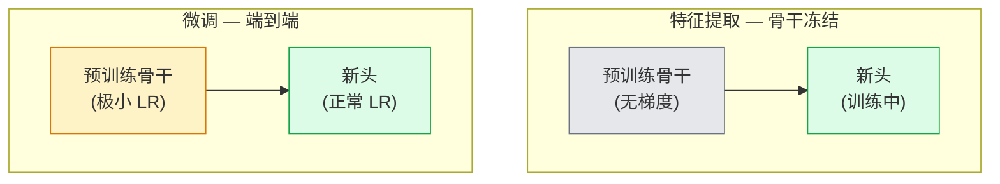

# 迁移学习与微调

> 其他人花了百万 GPU 小时教一个网络认识边缘、纹理和物体部件的样子。你应该在训练自己的之前借用那些特征。

**类型:** 构建
**语言:** Python
**前置要求:** Phase 4 Lesson 03（CNN），Phase 4 Lesson 04（图像分类）
**时长:** ~75 分钟

## 学习目标

- 区分特征提取和微调，并根据数据集规模、领域距离和计算预算选择正确的一个
- 加载预训练骨干，替换其分类头，只训练头到可用基线，20 行以内
- 用判别学习率逐步解冻层，使早期通用特征比晚期任务特定特征获得更小更新
- 诊断三个常见失败：解冻块上过高 LR 导致的特征漂移、小数据集上的 BN 统计量崩溃，以及灾难性遗忘

## 问题所在

在 ImageNet 上训练 ResNet-50 成本约 2,000 GPU 小时。很少有团队对每个交付任务都有那个预算。实际上几乎每个团队交付的是一个预训练骨干加一个在新任务几百或几千张特定图像上训练的新头。

这不是捷径。任何 ImageNet 训练的 CNN 的第一个卷积块学习边缘和类 Gabor 滤波器。接下来的几个块学习纹理和简单图案。中层块学习物体部件。最终块学习开始看起来像 1,000 个 ImageNet 类别的组合。那前 90% 几乎不变地迁移到医学成像、工业检测、卫星数据和每个其他视觉任务——因为自然界有边缘和纹理的有限词汇。第 10% 是你实际训练的。

正确迁移有三个等着你的 bug：用过高学习率摧毁预训练特征、用过多冻结使模型信息饥渴，以及让 BatchNorm 的运行统计量漂移到一个小数据集，而网络的其余部分从未从中学习。本课逐个踩这些坑。

## 核心概念

### 特征提取 vs 微调

两种机制，由你对预训练特征的信任程度和数据量决定。



经验法则：

| 数据集规模 | 领域距离 | 配方 |
|------------|---------|------|
| < 1k 图像 | 接近 ImageNet | 冻结骨干，只训练头 |
| 1k-10k | 接近 | 冻结前 2-3 阶段，微调其余 |
| 10k-100k | 任意 | 用判别 LR 端到端微调 |
| 100k+ | 远 | 微调全部；如果领域足够远考虑从零训练 |

"接近 ImageNet" 大致意思是自然 RGB 照片与类物体内容。医学 CT 扫描、卫星俯拍和显微镜是远领域——特征仍然有帮助，但你需要让更多层适应。

### 为什么冻结有效

CNN 在 ImageNet 上学习的特征不专门针对那 1,000 个类。它们专门针对自然图像的统计量：特定方向的边缘、纹理、对比度图案、形状基元。这些统计量在人类能命名的几乎每个视觉域中都是稳定的。这就是为什么在 ImageNet 上训练的模型在零样本评估 CIFAR-10 时仅用新线性头（不微调骨干）达到 80%+ 准确率。头在学习对已学特征加权哪些用于此任务。

### 判别学习率

解冻时，早期层应比晚期层训练更慢。早期层编码你希望保留的通用特征；晚期层编码你需要移动很多的任务特定结构。

```
典型配方：

  stage 0 (stem + 第一组): lr = base_lr / 100    （基本固定）
  stage 1:                       lr = base_lr / 10
  stage 2:                       lr = base_lr / 3
  stage 3 (最后骨干组): lr = base_lr
  head:                          lr = base_lr  （或略高）
```

在 PyTorch 中这只是传给优化器的参数组列表。一个模型，五个学习率，零额外代码。

### BatchNorm 问题

BN 层持有在 ImageNet 上计算的 `running_mean` 和 `running_var` 缓冲区。如果你的任务有不同的像素分布——不同照明、不同传感器、不同色彩空间——那些缓冲区是错的。三种选择，按优先级：

1. **用 BN 在训练模式微调。** 让 BN 与其他所有内容一起更新其运行统计量。当任务数据集为中等规模（>= 5k 样本）时的默认选择。
2. **在 eval 模式冻结 BN。** 保持 ImageNet 统计量，只训练权重。当你的数据集小到 BN 移动平均会很吵时正确。
3. **替换 BN 为 GroupNorm。** 完全消除移动平均问题。在检测和分割骨干中使用，因为每 GPU 批大小很小。

做错会静默将准确率降低 5-15%。

### Head 设计

分类头是 1-3 个线性层加可选 dropout。每个 torchvision 骨干都带有一个你要替换的默认头：

```
backbone.fc = nn.Linear(backbone.fc.in_features, num_classes)          # ResNet
backbone.classifier[1] = nn.Linear(..., num_classes)                    # EfficientNet, MobileNet
backbone.heads.head = nn.Linear(..., num_classes)                       # torchvision ViT
```

对小数据集，单个线性层通常足够。当任务分布离骨干训练分布更远时，添加隐藏层（Linear -> ReLU -> Dropout -> Linear）有帮助。

### 层间 LR 衰减

判别 LR 的更平滑版本，用于现代微调（BEiT、DINOv2、ViT-B 微调）。不是将层分组为阶段，而是给每层一个比上一层略小的 LR：

```
lr_layer_k = base_lr * decay^(L - k)
```

decay = 0.75 且 L = 12 transformer 块时，第一块以 `0.75^11 ≈ 0.04x` 头的 LR 训练。对 transformer 微调比 CNN 更重要，其中阶段分组的 LR 通常足够。

### 评估什么

迁移学习运行需要两个你在从头训练运行中不会追踪的数字：

- **仅预训练准确率** — 骨干冻结时头的准确率。这是你的下限。
- **微调后准确率** — 端到端训练后相同模型。这是你的上限。

如果微调后低于仅预训练，你有学习率或 BN bug。总是打印两者。

## 构建

### 第 1 步：加载预训练骨干并检查

```python
import torch
import torch.nn as nn
from torchvision.models import resnet18, ResNet18_Weights

backbone = resnet18(weights=ResNet18_Weights.IMAGENET1K_V1)
print(backbone)
print()
print("classifier head:", backbone.fc)
print("feature dim:", backbone.fc.in_features)
```

`ResNet18` 有四个阶段（`layer1..layer4`）加一个 stem 和一个 `fc` 头。每个 torchvision 分类骨干都有类似结构。

### 第 2 步：特征提取 — 冻结一切，替换头

```python
def make_feature_extractor(num_classes=10):
    model = resnet18(weights=ResNet18_Weights.IMAGENET1K_V1)
    for p in model.parameters():
        p.requires_grad = False
    model.fc = nn.Linear(model.fc.in_features, num_classes)
    return model

model = make_feature_extractor(num_classes=10)
trainable = sum(p.numel() for p in model.parameters() if p.requires_grad)
frozen = sum(p.numel() for p in model.parameters() if not p.requires_grad)
print(f"trainable: {trainable:>10,}")
print(f"frozen:    {frozen:>10,}")
```

只有 `model.fc` 是可训练的。骨干是一个冻结的特征提取器。

### 第 3 步：判别微调

构建具有阶段特定学习率的参数组的工具。

```python
def discriminative_param_groups(model, base_lr=1e-3, decay=0.3):
    stages = [
        ["conv1", "bn1"],
        ["layer1"],
        ["layer2"],
        ["layer3"],
        ["layer4"],
        ["fc"],
    ]
    groups = []
    for i, names in enumerate(stages):
        lr = base_lr * (decay ** (len(stages) - 1 - i))
        params = [p for n, p in model.named_parameters()
                  if any(n.startswith(k) for k in names)]
        if params:
            groups.append({"params": params, "lr": lr, "name": "_".join(names)})
    return groups

model = resnet18(weights=ResNet18_Weights.IMAGENET1K_V1)
model.fc = nn.Linear(model.fc.in_features, 10)
for p in model.parameters():
    p.requires_grad = True

groups = discriminative_param_groups(model)
for g in groups:
    print(f"{g['name']:>10s}  lr={g['lr']:.2e}  params={sum(p.numel() for p in g['params']):>8,}")
```

`decay=0.3` 意味着每阶段以比下一阶段低 30% 的速率训练。`fc` 获得 `base_lr`，`layer4` 获得 `0.3 * base_lr`，`conv1` 获得 `0.3^5 * base_lr ≈ 0.00243 * base_lr`。听起来极端；实证上它有效。

### 第 4 步：BatchNorm 处理

冻结 BN 运行统计量而不冻结其权重的辅助函数。

```python
def freeze_bn_stats(model):
    for m in model.modules():
        if isinstance(m, (nn.BatchNorm1d, nn.BatchNorm2d, nn.BatchNorm3d)):
            m.eval()
            for p in m.parameters():
                p.requires_grad = False
    return model
```

在每个 epoch 开始时 `model.train()` 后调用。`model.train()` 将一切翻转到训练模式；这将其反转只针对 BN 层。

### 第 5 步：最小端到端微调循环

```python
from torch.optim import SGD
from torch.utils.data import DataLoader
from torch.optim.lr_scheduler import CosineAnnealingLR
import torch.nn.functional as F

def fine_tune(model, train_loader, val_loader, device, epochs=5, base_lr=1e-3, freeze_bn=False):
    model = model.to(device)
    groups = discriminative_param_groups(model, base_lr=base_lr)
    optimizer = SGD(groups, momentum=0.9, weight_decay=1e-4, nesterov=True)
    scheduler = CosineAnnealingLR(optimizer, T_max=epochs)

    for epoch in range(epochs):
        model.train()
        if freeze_bn:
            freeze_bn_stats(model)
        tr_loss, tr_correct, tr_total = 0.0, 0, 0
        for x, y in train_loader:
            x, y = x.to(device), y.to(device)
            logits = model(x)
            loss = F.cross_entropy(logits, y, label_smoothing=0.1)
            optimizer.zero_grad()
            loss.backward()
            optimizer.step()
            tr_loss += loss.item() * x.size(0)
            tr_total += x.size(0)
            tr_correct += (logits.argmax(-1) == y).sum().item()
        scheduler.step()

        model.eval()
        va_total, va_correct = 0, 0
        with torch.no_grad():
            for x, y in val_loader:
                x, y = x.to(device), y.to(device)
                pred = model(x).argmax(-1)
                va_total += x.size(0)
                va_correct += (pred == y).sum().item()
        print(f"epoch {epoch}  train {tr_loss/tr_total:.3f}/{tr_correct/tr_total:.3f}  "
              f"val {va_correct/va_total:.3f}")
    return model
```

五个 epoch 用上述配方在 CIFAR-10 上，`ResNet18-IMAGENET1K_V1` 从零样本线性探测准确率约 70% 到微调后准确率约 93%。只带头而不碰骨干会停滞在约 86%。

### 第 6 步：渐进解冻

从尾到头每 epoch 解冻一阶段的计划。以额外 epoch 为代价缓解特征漂移。

```python
def progressive_unfreeze_schedule(model):
    stages = ["layer4", "layer3", "layer2", "layer1"]
    yielded = set()

    def start():
        for p in model.parameters():
            p.requires_grad = False
        for p in model.fc.parameters():
            p.requires_grad = True

    def unfreeze(epoch):
        if epoch < len(stages):
            name = stages[epoch]
            yielded.add(name)
            for n, p in model.named_parameters():
                if n.startswith(name):
                    p.requires_grad = True
            return name
        return None

    return start, unfreeze
```

在第一个 epoch 前调用一次 `start()`。在每个 epoch 开始时调用 `unfreeze(epoch)`。可训练参数集改变时重建优化器，否则冻结参数仍持有搞混它的缓存动量。

## 使用

对大多数真实任务，`torchvision.models` + 三行就够了。上面较重的机械在遇到库默认无法修复的问题时重要。

```python
from torchvision.models import resnet50, ResNet50_Weights

model = resnet50(weights=ResNet50_Weights.IMAGENET1K_V2)
model.fc = nn.Linear(model.fc.in_features, num_classes)
optimizer = torch.optim.AdamW(model.parameters(), lr=1e-4, weight_decay=1e-4)
```

其他两个生产级默认值：

- `timm` 船运 ~800 个预训练视觉骨干和一致 API（`timm.create_model("resnet50", pretrained=True, num_classes=10)`）。对 torchvision zoo 之外的任何微调，它是标准。
- 对 transformer，`transformers.AutoModelForImageClassification.from_pretrained(name, num_labels=N)` 给你带与文本模型相同加载语义的 ViT / BEiT / DeiT。

## 交付

本课产出：

- `outputs/prompt-fine-tune-planner.md` — 一个 prompt，根据数据集规模、领域距离和计算预算选择特征提取 vs 渐进 vs 端到端微调。
- `outputs/skill-freeze-inspector.md` — 一个 skill，给定 PyTorch 模型，报告哪些参数可训练、哪些 BatchNorm 层处于 eval 模式，以及优化器是否实际被喂入可训练参数。

## 练习

1. **(简单)** 在同一合成 CIFAR 数据集上训练 `ResNet18` 为线性探测（骨干冻结）和全微调。报告两边准确率并列。解释哪个差距告诉你特征迁移良好，哪个告诉你它们不迁移。
2. **(中等)** 故意引入 bug：将 `base_lr = 1e-1` 设置在骨干阶段而不是头上。展示训练损失爆炸，然后通过应用 `discriminative_param_groups` 辅助函数恢复。记录每阶段开始发散的 LR。
3. **(困难)** 取一个医学成像数据集（例如 CheXpert-small、PatchCamelyon 或 HAM10000）并比较三种机制：（a）ImageNet 预训练冻结骨干 + 线性头；（b）ImageNet 预训练端到端微调；（c）从零训练。报告每个的准确率和计算成本。在什么数据集规模下从零训练变得有竞争力？

## 关键术语

| 术语 | 常见说法 | 实际含义 |
|------|----------|---------|
| 特征提取 | "冻结并训练头" | 骨干参数冻结，只有新分类头接收梯度 |
| 微调 | "端到端重训练" | 所有参数可训练，通常比从零训练小得多的 LR |
| 判别 LR | "早期层更小 LR" | 优化器参数组，早期阶段 LR 是晚期阶段 LR 的一个分数 |
| 层间 LR 衰减 | "平滑 LR 梯度" | 每层 LR 乘以 decay^(L - k)；在 transformer 微调中常见 |
| 灾难性遗忘 | "模型丢失 ImageNet" | 过高的 LR 在新任务信号被学习前覆盖预训练特征 |
| BN 统计量漂移 | "运行均值错误" | BatchNorm 的 running_mean/var 在与当前任务不同的分布上计算，静默损害准确率 |
| 线性探测 | "冻结骨干 + 线性头" | 评估预训练特征——冻结表示顶部最佳线性分类器的准确率 |
| 灾难性崩溃 | "一切都预测一类" | 在梯度从头建立稳定前 LR 高到足以摧毁特征时发生 |

## 延伸阅读

- [How transferable are features in deep neural networks? (Yosinski et al., 2014)](https://arxiv.org/abs/1411.1792) — 量化学征跨层迁移性的论文
- [Universal Language Model Fine-tuning (ULMFiT, Howard & Ruder, 2018)](https://arxiv.org/abs/1801.06146) — 原始判别 LR / 渐进解冻配方；想法直接迁移到视觉
- [timm documentation](https://huggingface.co/docs/timm) — 现代视觉骨干的参考以及它们被训练时确切微调默认值
- [A Simple Framework for Linear-Probe Evaluation (Kornblith et al., 2019)](https://arxiv.org/abs/1805.08974) — 为什么线性探测准确率重要以及如何正确报告