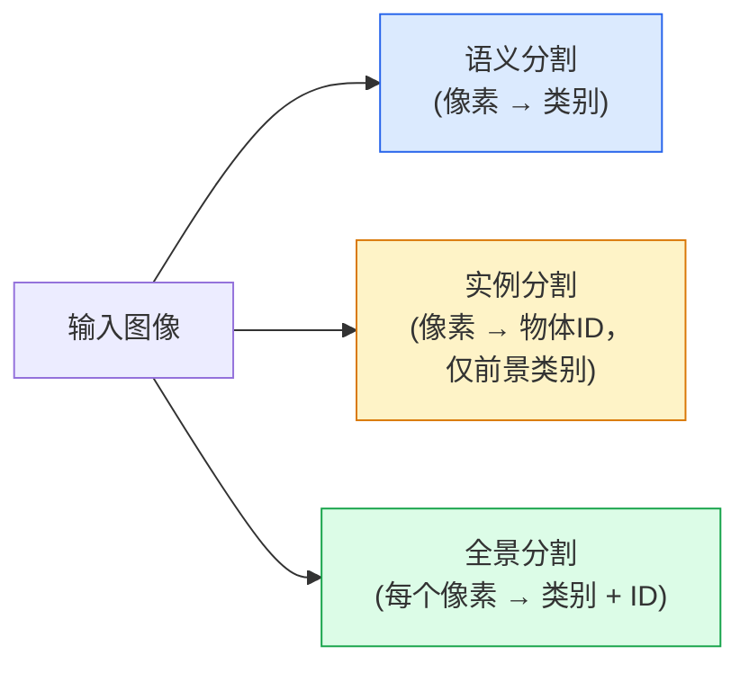
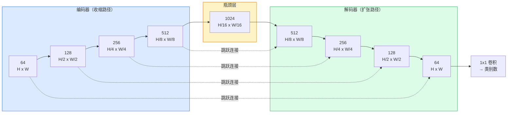

# 语义分割 — U-Net

> 分割就是对每一个像素做分类。U-Net 通过将下采样编码器与上采样解码器配对，并在它们之间架设跳跃连接，让这一切成为可能。

**类型:** Build
**语言:** Python
**前置要求:** Phase 4 Lesson 03 (CNNs), Phase 4 Lesson 04 (图像分类)
**时长:** 约 75 分钟

## 学习目标

- 区分语义分割、实例分割和全景分割，并为给定任务选择正确的类型
- 在 PyTorch 中从头构建 U-Net，包含编码器块、瓶颈层、使用转置卷积的上采样解码器和跳跃连接
- 实现逐像素交叉熵、Dice 损失及组合损失——这是当前医学和工业分割的默认配置
- 读取每个类别的 IoU 和 Dice 指标，诊断分数低是因为小物体召回率、边界精度还是类别不平衡

## 问题背景

分类任务每张图像输出一个标签。检测任务每张图像输出少量边界框。分割任务每个像素输出一个标签。对于 `H x W` 大小的输入，输出是一个形状为 `H x W`（语义分割）或 `H x W x N_instances`（实例分割）的张量。这意味着每张图像有数百万个预测，而非一个。

分割的结构解释了为什么它支撑了几乎所有密集预测类视觉产品：医学影像（肿瘤掩码）、自动驾驶（道路、车道、障碍物）、卫星图像（建筑轮廓、农作物边界）、文档解析（布局区域）、机器人（可抓取区域）。这些任务没有一个可以用边界框解决问题——它们需要精确的轮廓。

架构问题说起来简单但解决不易：网络需要同时看到图像的全局上下文（这是什么样的场景）和局部像素细节（究竟是哪个像素属于道路，哪个属于人行道）。标准 CNN 会在空间上压缩以获得上下文，这样就丢失了细节。U-Net 是第一个同时解决这两个问题的设计。

## 核心概念

### 语义分割 vs 实例分割 vs 全景分割



- **语义分割** 说："这个像素是道路，那个像素是汽车。"两个并排的汽车会被合并为一个区域。
- **实例分割** 说："这个像素是 3 号汽车，那个像素是 5 号汽车。"忽略背景物体（"物料"=天空、道路、草地）。
- **全景分割** 统一了两者：每个像素获得一个类别标签，每个实例物体获得一个唯一 ID，物料和实例都被分割。

本课覆盖语义分割。下一课（Mask R-CNN）覆盖实例分割。

### U-Net 的形状



编码器将空间分辨率减半四次，同时通道数翻倍。解码器则反向操作：空间分辨率翻倍四次，同时通道数减半。跳跃连接在每个分辨率层级将编码器特征与解码器特征进行拼接。最后的 1x1 卷积在完整分辨率下将 `64 → num_classes`。

为什么跳跃连接是必要的：解码器在尝试输出像素级预测时已经只看到了小的特征图。如果没有跳跃连接，它无法准确定位边缘，因为这些信息在编码器中已经被压缩掉了。跳跃连接将编码器在下采样过程中计算的高分辨率特征图交给了解码器。

### 转置卷积 vs 双线性插值上采样

解码器需要扩展空间维度。有两种选择：

- **转置卷积**（`nn.ConvTranspose2d`）——可学习的上采样。历史悠久的 U-Net 默认选项。如果步幅和核大小不能整除，可能会产生棋盘格伪影。
- **双线性插值 + 3x3 卷积**——先平滑上采样，再接卷积。伪影更少，参数更少，现在是现代默认选项。

两者都有使用。对于第一个 U-Net，双线性插值更安全。

### 像素网格上的交叉熵

对于 C 类别的语义分割，模型输出是 `(N, C, H, W)`。目标标签是 `(N, H, W)`，其中是整数类别 ID。交叉熵与分类情况相同，只是作用于每个空间位置：

```
Loss = mean over (n, h, w) of -log( softmax(logits[n, :, h, w])[target[n, h, w]] )
```

PyTorch 中的 `F.cross_entropy` 原生支持这个形状，无需重塑。

### Dice 损失及为什么你需要它

交叉熵对每个像素一视同仁。当某一类占据了画面的大部分时（医学影像：99% 背景，1% 肿瘤），这是错误的。网络可以通过预测全背景获得 99% 的准确率，但实际上毫无用处。

Dice 损失通过直接优化预测掩码与真实掩码之间的重叠度来解决这个问题：

```
Dice(p, y) = 2 * sum(p * y) / (sum(p) + sum(y) + epsilon)
Dice_loss = 1 - Dice
```

其中 `p` 是某类别的 sigmoid/softmax 概率图，`y` 是二值真实掩码。只有当重叠完美时损失才为零。由于它是有比率的，类别不平衡无关紧要。

实践中，使用**组合损失**：

```
L = L_cross_entropy + lambda * L_dice       (lambda ~ 1)
```

交叉熵在训练早期提供稳定梯度；Dice 将训练后期聚焦在实际匹配掩码形状上。这种组合是医学影像的默认配置，在任何类别不平衡的数据集上都难以被超越。

### 评估指标

- **像素准确率**——正确预测的像素百分比。计算成本低。在不平衡数据上与分类中的准确率有同样的问题。
- **各类别 IoU**——每个类别掩码的交并比；跨类别平均后得到 mIoU。
- **Dice（F1 像素版）**——与 IoU 近似；`Dice = 2 * IoU / (1 + IoU)`。医学影像偏好 Dice，驾驶领域偏好 IoU；它们是单调相关的。
- **边界 F1**——衡量预测边界与真实边界之间的接近程度，即使微小的偏移也会被惩罚。对于半导体检测等高精度任务尤为重要。

报告各类别 IoU，不要只报告 mIoU。当九个类别都在 85% 而有一个类别只有 15% 时，平均 IoU 会掩盖这个问题。

### 输入分辨率的权衡

U-Net 编码器将分辨率减半四次，因此输入必须能被 16 整除。医学图像通常是 512x512 或 1024x1024。自动驾驶裁剪图是 2048x1024。U-Net 的内存消耗与 `H * W * C_max` 成正比，在 1024x1024 输入且瓶颈通道为 1024 时，前向传播已经消耗数 GB 的显存。

两种标准解决方案：
1. 瓦片化输入——用重叠的 256x256 瓦片处理，再拼接。
2. 用空洞卷积替换瓶颈，保持更高空间分辨率的同时扩大感受野（DeepLab 系列）。

对于第一个模型，256x256 输入配合 base=64 的 U-Net 在 8 GB 显存上可以舒适地训练。

## 构建过程

### 步骤 1：编码器块

两个 3x3 卷积接批归一化和 ReLU。第一个卷积改变通道数；第二个保持不变。

```python
import torch
import torch.nn as nn
import torch.nn.functional as F

class DoubleConv(nn.Module):
    def __init__(self, in_c, out_c):
        super().__init__()
        self.net = nn.Sequential(
            nn.Conv2d(in_c, out_c, kernel_size=3, padding=1, bias=False),
            nn.BatchNorm2d(out_c),
            nn.ReLU(inplace=True),
            nn.Conv2d(out_c, out_c, kernel_size=3, padding=1, bias=False),
            nn.BatchNorm2d(out_c),
            nn.ReLU(inplace=True),
        )

    def forward(self, x):
        return self.net(x)
```

这个块在整个网络中复用。`bias=False` 因为 BN 的 beta 已经处理了偏置。

### 步骤 2：下采样和上采样块

```python
class Down(nn.Module):
    def __init__(self, in_c, out_c):
        super().__init__()
        self.net = nn.Sequential(
            nn.MaxPool2d(2),
            DoubleConv(in_c, out_c),
        )

    def forward(self, x):
        return self.net(x)


class Up(nn.Module):
    def __init__(self, in_c, out_c):
        super().__init__()
        self.up = nn.Upsample(scale_factor=2, mode="bilinear", align_corners=False)
        self.conv = DoubleConv(in_c, out_c)

    def forward(self, x, skip):
        x = self.up(x)
        if x.shape[-2:] != skip.shape[-2:]:
            x = F.interpolate(x, size=skip.shape[-2:], mode="bilinear", align_corners=False)
        x = torch.cat([skip, x], dim=1)
        return self.conv(x)
```

仅检查空间维度的形状（`shape[-2:]`）是为了处理输入尺寸不能被 16 整除的情况；用安全的 `F.interpolate` 在拼接前对齐张量。如果比较完整形状，通道数的差异也会触发插值，而这应该是一个大声的报错，而不是静默插值。

### 步骤 3：U-Net

```python
class UNet(nn.Module):
    def __init__(self, in_channels=3, num_classes=2, base=64):
        super().__init__()
        self.inc = DoubleConv(in_channels, base)
        self.d1 = Down(base, base * 2)
        self.d2 = Down(base * 2, base * 4)
        self.d3 = Down(base * 4, base * 8)
        self.d4 = Down(base * 8, base * 16)
        self.u1 = Up(base * 16 + base * 8, base * 8)
        self.u2 = Up(base * 8 + base * 4, base * 4)
        self.u3 = Up(base * 4 + base * 2, base * 2)
        self.u4 = Up(base * 2 + base, base)
        self.outc = nn.Conv2d(base, num_classes, kernel_size=1)

    def forward(self, x):
        x1 = self.inc(x)
        x2 = self.d1(x1)
        x3 = self.d2(x2)
        x4 = self.d3(x3)
        x5 = self.d4(x4)
        x = self.u1(x5, x4)
        x = self.u2(x, x3)
        x = self.u3(x, x2)
        x = self.u4(x, x1)
        return self.outc(x)

net = UNet(in_channels=3, num_classes=2, base=32)
x = torch.randn(1, 3, 256, 256)
print(f"output: {net(x).shape}")
print(f"params: {sum(p.numel() for p in net.parameters()):,}")
```

输出形状 `(1, 2, 256, 256)`——与输入空间尺寸相同，`num_classes` 个通道。`base=32` 时约 7.7M 参数。

### 步骤 4：损失函数

```python
def dice_loss(logits, targets, num_classes, eps=1e-6):
    probs = F.softmax(logits, dim=1)
    targets_one_hot = F.one_hot(targets, num_classes).permute(0, 3, 1, 2).float()
    dims = (0, 2, 3)
    intersection = (probs * targets_one_hot).sum(dim=dims)
    denom = probs.sum(dim=dims) + targets_one_hot.sum(dim=dims)
    dice = (2 * intersection + eps) / (denom + eps)
    return 1 - dice.mean()


def combined_loss(logits, targets, num_classes, lam=1.0):
    ce = F.cross_entropy(logits, targets)
    dc = dice_loss(logits, targets, num_classes)
    return ce + lam * dc, {"ce": ce.item(), "dice": dc.item()}
```

Dice 在每个类别上计算然后取平均（macro Dice）。`eps` 防止批次中不存在的类别出现除以零的情况。

### 步骤 5：IoU 指标

```python
@torch.no_grad()
def iou_per_class(logits, targets, num_classes):
    preds = logits.argmax(dim=1)
    ious = torch.zeros(num_classes)
    for c in range(num_classes):
        pred_c = (preds == c)
        true_c = (targets == c)
        inter = (pred_c & true_c).sum().float()
        union = (pred_c | true_c).sum().float()
        ious[c] = (inter / union) if union > 0 else torch.tensor(float("nan"))
    return ious
```

返回一个长度为 C 的向量。`nan` 标记批次中不存在的类别——计算 mIoU 时不要对这些取平均。

### 步骤 6：用于端到端验证的合成数据集

在彩色背景上生成几何形状，这样网络需要学习形状而非像素颜色。

```python
import numpy as np
from torch.utils.data import Dataset, DataLoader

def synthetic_segmentation(num_samples=200, size=64, seed=0):
    rng = np.random.default_rng(seed)
    images = np.zeros((num_samples, size, size, 3), dtype=np.float32)
    masks = np.zeros((num_samples, size, size), dtype=np.int64)
    for i in range(num_samples):
        bg = rng.uniform(0, 1, (3,))
        images[i] = bg
        masks[i] = 0
        num_shapes = rng.integers(1, 4)
        for _ in range(num_shapes):
            cls = int(rng.integers(1, 3))
            color = rng.uniform(0, 1, (3,))
            cx, cy = rng.integers(10, size - 10, size=2)
            r = int(rng.integers(4, 12))
            yy, xx = np.meshgrid(np.arange(size), np.arange(size), indexing="ij")
            if cls == 1:
                mask = (xx - cx) ** 2 + (yy - cy) ** 2 < r ** 2
            else:
                mask = (np.abs(xx - cx) < r) & (np.abs(yy - cy) < r)
            images[i][mask] = color
            masks[i][mask] = cls
        images[i] += rng.normal(0, 0.02, images[i].shape)
        images[i] = np.clip(images[i], 0, 1)
    return images, masks


class SegDataset(Dataset):
    def __init__(self, images, masks):
        self.images = images
        self.masks = masks

    def __len__(self):
        return len(self.images)

    def __getitem__(self, i):
        img = torch.from_numpy(self.images[i]).permute(2, 0, 1).float()
        mask = torch.from_numpy(self.masks[i]).long()
        return img, mask
```

三个类别：背景（0）、圆形（1）、方形（2）。网络必须学会区分形状。

### 步骤 7：训练循环

```python
def train_one_epoch(model, loader, optimizer, device, num_classes):
    model.train()
    loss_sum, total = 0.0, 0
    iou_sum = torch.zeros(num_classes)
    for x, y in loader:
        x, y = x.to(device), y.to(device)
        logits = model(x)
        loss, _ = combined_loss(logits, y, num_classes)
        optimizer.zero_grad()
        loss.backward()
        optimizer.step()
        loss_sum += loss.item() * x.size(0)
        total += x.size(0)
        iou_sum += iou_per_class(logits, y, num_classes).nan_to_num(0)
    return loss_sum / total, iou_sum / len(loader)
```

在合成数据集上运行 10-30 个 epoch，观察形状类别的 mIoU 超过 0.9。注意 `nan_to_num(0)` 将批次中不存在的类别视为零；对于准确的各类别 IoU，在评估时按存在情况屏蔽并使用 `torch.nanmean` 跨批次计算，而不是在这里取平均。

## 应用

生产环境中，`segmentation_models_pytorch`（"smp"）用任意 torchvision 或 timm 主干网包装了所有标准分割架构。三行代码：

```python
import segmentation_models_pytorch as smp

model = smp.Unet(
    encoder_name="resnet34",
    encoder_weights="imagenet",
    in_channels=3,
    classes=3,
)
```

实际工作中还需要了解：
- **DeepLabV3+** 用空洞卷积替换基于最大池化的下采样，使瓶颈保持更高分辨率；在卫星和自动驾驶数据上边界效果更好。
- **SegFormer** 用层次化 Transformer 替换卷积编码器；在许多基准测试上是当前 SOTA。
- **Mask2Former / OneFormer** 在单一架构中统一了语义、实例和全景分割。

这三个都可以作为 `smp` 或 `transformers` 的直接替代品，数据加载器不变。

## 交付物

本课产出：

- `outputs/prompt-segmentation-task-picker.md`——一个提示词，用于在语义分割、实例分割和全景分割之间选择，并为给定任务指定架构。
- `outputs/skill-segmentation-mask-inspector.md`——一个技能，报告类别分布、预测掩码统计量以及预测不足或边界模糊的类别。

## 练习

1. **(简单)** 为二分类分割任务（前景 vs 背景）实现 `bce_dice_loss`。在合成二分类数据集上验证，当前景只占 5% 像素时，组合损失比单独使用 BCE 收敛更快。
2. **(中等)** 将上采样块从 `nn.Upsample + conv` 替换为 `nn.ConvTranspose2d`。在合成数据集上训练两个版本并比较 mIoU。观察转置卷积版本中棋盘格伪影出现的位置。
3. **(困难)** 在真实分割数据集（Oxford-IIIT Pets、Cityscapes 迷你分割集或医学子集）上训练 U-Net，使其达到 `smp.Unet` 参考模型的 2 个 IoU 点以内。报告各类别 IoU，并确定哪些类别从 Dice 损失的添加中获益最大。

## 核心术语

| 术语 | 常见说法 | 实际含义 |
|------|---------|---------|
| 语义分割 | "给每个像素打标签" | 逐像素分类为 C 个类别；同类别的实例会合并 |
| 实例分割 | "给每个物体打标签" | 分离同类的不同实例；仅限前景物体 |
| 全景分割 | "语义 + 实例" | 每个像素获得类别；每个实例物体还获得唯一 ID |
| 跳跃连接 | "U-Net 桥" | 将编码器特征拼接到对应分辨率的解码器特征；保留高频细节 |
| 转置卷积 | "反卷积" | 可学习的上采样；可能产生棋盘格伪影 |
| Dice 损失 | "重叠损失" | 1 - 2\|A ∩ B\| / (\|A\| + \|B\|)；直接优化掩码重叠，对类别不平衡有鲁棒性 |
| mIoU | "平均交并比" | 跨类别的平均 IoU；是分割领域标准的评估指标 |
| 边界 F1 | "边界精度" | 仅在边界像素上计算的 F1 分数；对精度敏感任务很重要 |

## 延伸阅读

- [U-Net: Convolutional Networks for Biomedical Image Segmentation (Ronneberger et al., 2015)](https://arxiv.org/abs/1505.04597)——原始论文；每个人都在复制的图在第 2 页
- [Fully Convolutional Networks (Long et al., 2015)](https://arxiv.orgabs/1411.4038)——首次将分割变成端到端卷积问题的论文
- [segmentation_models_pytorch](https://github.com/qubvel/segmentation_models.pytorch)——生产级分割的参考库；所有标准架构和标准损失
- [Lessons learned from training SOTA segmentation (kaggle.com competitions)](https://www.kaggle.com/code/iafoss/carvana-unet-pytorch)——关于为什么 TTA、伪标签和类别权重在真实数据上很重要的实践总结