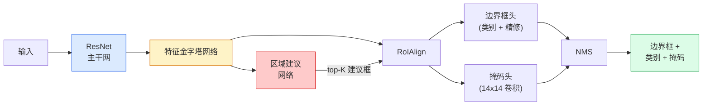

# 实例分割 — Mask R-CNN

> 在 Faster R-CNN 检测器上增加一个微小的掩码分支，就得到了实例分割。难点在于 RoIAlign，而且它比看起来更难。

**类型:** Build + Learn
**语言:** Python
**前置要求:** Phase 4 Lesson 06 (YOLO), Phase 4 Lesson 07 (U-Net)
**时长:** 约 75 分钟

## 学习目标

- 追踪 Mask R-CNN 架构端到端：主干网、FPN、RPN、RoIAlign、边界框头、掩码头
- 从头实现 RoIAlign，并解释为什么 RoIPool 已不再使用
- 使用 torchvision 预训练模型 `maskrcnn_resnet50_fpn_v2` 获得生产级实例掩码，并正确读取其输出格式
- 通过替换边界框头和掩码头并冻结主干网，在小型自定义数据集上微调 Mask R-CNN

## 问题背景

语义分割每类给出一个掩码。实例分割每个物体给出一个掩码，即使两个物体属于同一类。统计个体、跨帧跟踪、测量物体（墙上每块砖的边界框、显微镜图像中每个细胞的大小）都需要实例分割。

Mask R-CNN（He et al., 2017）通过将实例分割重新表述为"检测 + 掩码"来解决这个问题。设计非常简洁，以至于在接下来五年里几乎每篇实例分割论文都是 Mask R-CNN 的变体，torchvision 的实现仍然是中小型数据集的生产默认配置。

困难的工程问题在于采样：如何从一个角落不与像素边界对齐的建议框中裁剪出固定大小的特征区域？做错了会在各处损失零点几个 mAP。RoIAlign 就是答案。

## 核心概念

### 架构



需要理解五个组成部分：

1. **主干网**——在 ImageNet 上训练的 ResNet-50 或 ResNet-101。产生stride为 4、8、16、32 的特征图层级。
2. **FPN（特征金字塔网络）**——自顶向下 + 横向连接，为每个层级提供 C 个通道的语义丰富特征。检测查询与物体大小匹配的 FPN 层级。
3. **RPN（区域建议网络）**——一个小型卷积头，在每个锚点位置预测"这里有物体吗？"和"如何将锚点精修为更贴合的框？"。每张图像产生约 1000 个建议框。
4. **RoIAlign**——从任意框的任意 FPN 层级采样固定大小（如 7x7）的特征块。双线性采样，无量化。
5. **头**——两层边界框头，精修边界框并选择类别；一个小型卷积头，为每个建议框输出 `28x28` 二值掩码。

### 为什么用 RoIAlign 而不用 RoIPool

原始的 Fast R-CNN 使用 RoIPool，将建议框分割为网格，取每个单元格中的最大特征，并将所有坐标四舍五入到整数。这种舍入导致特征图与输入像素坐标之间的偏差达到一个特征图像素那么大——在 224x224 图像上很小，但在 stride 为 32 的特征图上则是灾难性的。

```
RoIPool:
  框 (34.7, 51.3, 98.2, 142.9)
  四舍五入 -> (34, 51, 98, 142)
  分割网格 -> 每个单元格边界四舍五入
  错位在每一步累积

RoIAlign:
  框 (34.7, 51.3, 98.2, 142.9)
  使用双线性插值在精确的浮点坐标处采样
  任何地方都不舍入
```

RoIAlign 在 COCO 上将掩码 AP 免费提升 3-4 个点。所有在乎定位精度的检测器现在都使用它——YOLOv7 seg、RT-DETR、Mask2Former 概莫能外。

### RPN 一段话说清

在特征图的每个位置，放置 K 个不同大小和形状的锚框。预测每个锚框的物体性分数，以及将锚框回归为更贴合框的偏移量。按分数取前约 1000 个框，在 IoU 0.7 下应用 NMS，将存活的框交给头。RPN 用自己的小损失训练——与 Lesson 6 的 YOLO 损失结构相同，只是两类（物体/非物体）。

### 掩码头

对于每个建议框（RoIAlign 之后），掩码头是一个微小的 FCN：四个 3x3 卷积，一个 2x 上卷积，一个最终 1x1 卷积，输出 `num_classes` 个通道、分辨率 `28x28` 的结果。只保留与预测类别对应的通道；其他通道忽略。这将掩码预测与分类解耦。

将 28x28 掩码上采样到建议框的原始像素大小，产生最终的二值掩码。

### 损失函数

Mask R-CNN 有四个相加的损失：

```
L = L_rpn_cls + L_rpn_box + L_box_cls + L_box_reg + L_mask
```

- `L_rpn_cls`, `L_rpn_box`——RPN 建议框的物体性 + 边界框回归。
- `L_box_cls`——头部分类器上（C+1）类的交叉熵（包含背景）。
- `L_box_reg`——头部边界框精修上的 smooth L1。
- `L_mask`——28x28 掩码输出上逐像素的二值交叉熵。

每个损失有其自己的默认权重；torchvision 实现将它们作为构造函数参数暴露出来。

### 输出格式

`torchvision.models.detection.maskrcnn_resnet50_fpn_v2` 返回一个列表，每张图像一个字典：

```
{
    "boxes":  (N, 4) 格式为 (x1, y1, x2, y2) 像素坐标，
    "labels": (N,) 类别 ID，0 = 背景，因此索引是 1-based 的，
    "scores": (N,) 置信度分数，
    "masks":  (N, 1, H, W) [0, 1] 范围的浮点掩码——阈值 0.5 得到二值掩码，
}
```

掩码已经是完整图像分辨率。28x28 头输出已在内部上采样。

## 构建过程

### 步骤 1：从头实现 RoIAlign

这是 Mask R-CNN 中唯一一个用代码比用文字更容易理解的组件。

```python
import torch
import torch.nn.functional as F

def roi_align_single(feature, box, output_size=7, spatial_scale=1 / 16.0):
    """
    feature: (C, H, W) 单张图像的特征图
    box: (x1, y1, x2, y2) 原始图像像素坐标
    output_size: 输出网格的边长（边界框头为 7，掩码头为 14）
    spatial_scale: 特征图步幅的倒数
    """
    C, H, W = feature.shape
    x1, y1, x2, y2 = [c * spatial_scale - 0.5 for c in box]
    bin_w = (x2 - x1) / output_size
    bin_h = (y2 - y1) / output_size

    grid_y = torch.linspace(y1 + bin_h / 2, y2 - bin_h / 2, output_size)
    grid_x = torch.linspace(x1 + bin_w / 2, x2 - bin_w / 2, output_size)
    yy, xx = torch.meshgrid(grid_y, grid_x, indexing="ij")

    gx = 2 * (xx + 0.5) / W - 1
    gy = 2 * (yy + 0.5) / H - 1
    grid = torch.stack([gx, gy], dim=-1).unsqueeze(0)
    sampled = F.grid_sample(feature.unsqueeze(0), grid, mode="bilinear",
                            align_corners=False)
    return sampled.squeeze(0)
```

每个数值都在双线性采样的位置上。没有舍入，没有量化，没有梯度损失。

### 步骤 2：与 torchvision 的 RoIAlign 对比

```python
from torchvision.ops import roi_align

feature = torch.randn(1, 16, 50, 50)
boxes = torch.tensor([[0, 10, 20, 100, 90]], dtype=torch.float32)  # (batch_idx, x1, y1, x2, y2)

ours = roi_align_single(feature[0], boxes[0, 1:].tolist(), output_size=7, spatial_scale=1/4)
theirs = roi_align(feature, boxes, output_size=(7, 7), spatial_scale=1/4, sampling_ratio=1, aligned=True)[0]

print(f"shape ours:   {tuple(ours.shape)}")
print(f"shape theirs: {tuple(theirs.shape)}")
print(f"max|diff|:    {(ours - theirs).abs().max().item():.3e}")
```

使用 `sampling_ratio=1` 和 `aligned=True`，两者在 `1e-5` 范围内匹配。

### 步骤 3：加载预训练 Mask R-CNN

```python
import torch
from torchvision.models.detection import maskrcnn_resnet50_fpn_v2, MaskRCNN_ResNet50_FPN_V2_Weights

model = maskrcnn_resnet50_fpn_v2(weights=MaskRCNN_ResNet50_FPN_V2_Weights.DEFAULT)
model.eval()
print(f"params: {sum(p.numel() for p in model.parameters()):,}")
print(f"classes (including background): {len(model.roi_heads.box_predictor.cls_score.out_features * [0])}")
```

46M 参数，91 个类别（COCO）。第一个类别（id 0）是背景；模型实际检测的所有物体从 id 1 开始。

### 步骤 4：推理

```python
with torch.no_grad():
    x = torch.randn(3, 400, 600)
    predictions = model([x])
p = predictions[0]
print(f"boxes:  {tuple(p['boxes'].shape)}")
print(f"labels: {tuple(p['labels'].shape)}")
print(f"scores: {tuple(p['scores'].shape)}")
print(f"masks:  {tuple(p['masks'].shape)}")
```

掩码张量形状为 `(N, 1, H, W)`。阈值 0.5 得到每个物体的二值掩码：

```python
binary_masks = (p['masks'] > 0.5).squeeze(1)  # (N, H, W) 布尔值
```

### 步骤 5：为自定义类别数替换头

常见微调方案：复用主干网、FPN 和 RPN；替换两个分类头。

```python
from torchvision.models.detection.faster_rcnn import FastRCNNPredictor
from torchvision.models.detection.mask_rcnn import MaskRCNNPredictor

def build_custom_maskrcnn(num_classes):
    model = maskrcnn_resnet50_fpn_v2(weights=MaskRCNN_ResNet50_FPN_V2_Weights.DEFAULT)
    in_features = model.roi_heads.box_predictor.cls_score.in_features
    model.roi_heads.box_predictor = FastRCNNPredictor(in_features, num_classes)
    in_features_mask = model.roi_heads.mask_predictor.conv5_mask.in_channels
    hidden_layer = 256
    model.roi_heads.mask_predictor = MaskRCNNPredictor(in_features_mask, hidden_layer, num_classes)
    return model

custom = build_custom_maskrcnn(num_classes=5)
print(f"custom cls_score.out_features: {custom.roi_heads.box_predictor.cls_score.out_features}")
```

`num_classes` 必须包含背景类，因此有 4 个物体类别的数据集应使用 `num_classes=5`。

### 步骤 6：冻结不需要训练的部分

在小型数据集上，冻结主干网和 FPN。只有 RPN 物体性 + 回归以及两个头学习。

```python
def freeze_backbone_and_fpn(model):
    # torchvision Mask R-CNN 将 FPN 打包在 `model.backbone` 中（作为
    # `model.backbone.fpn`），因此遍历 `model.backbone.parameters()` 覆盖
    # ResNet 特征层和 FPN 横向/输出卷积。
    for p in model.backbone.parameters():
        p.requires_grad = False
    return model

custom = freeze_backbone_and_fpn(custom)
trainable = sum(p.numel() for p in custom.parameters() if p.requires_grad)
print(f"trainable after freeze: {trainable:,}")
```

在 500 张图像的数据集上，这决定了是收敛还是过拟合。

## 应用

torchvision 中 Mask R-CNN 的完整训练循环是 40 行，且在不同任务之间没有实质性变化——替换数据集就开始。

```python
def train_step(model, images, targets, optimizer):
    model.train()
    loss_dict = model(images, targets)
    losses = sum(loss for loss in loss_dict.values())
    optimizer.zero_grad()
    losses.backward()
    optimizer.step()
    return {k: v.item() for k, v in loss_dict.items()}
```

`targets` 列表必须为每张图像提供包含 `boxes`、`labels` 和 `masks`（格式为 `(num_instances, H, W)` 二值张量）的字典。模型在训练时返回四个损失的字典，在评估时返回预测列表，键为 `model.training`。

`pycocotools` 评估器输出边界框和掩码的 mAP@IoU=0.5:0.95；你需要两个数字才能知道是边界框头还是掩码头是瓶颈。

## 交付物

本课产出：

- `outputs/prompt-instance-vs-semantic-router.md`——一个提示词，提出三个问题，在实例分割 vs 语义分割 vs 全景分割之间选择，并确定具体的起始模型。
- `outputs/skill-mask-rcnn-head-swapper.md`——一个技能，给定新的 `num_classes`，生成 10 行代码来在任何 torchvision 检测模型上替换头。

## 练习

1. **(简单)** 在 100 个随机框上验证你的 RoIAlign 与 `torchvision.ops.roi_align` 的对比。报告最大绝对差异。同时运行 RoIPool（2017 年前的行为），显示它在靠近边界的框上偏差约 1-2 个特征图像素。
2. **(中等)** 在 50 张图像的自定义数据集（任意两类：气球、鱼、坑洞、Logo）上微调 `maskrcnn_resnet50_fpn_v2`。冻结主干网，训练 20 个 epoch，报告掩码 AP@0.5。
3. **(困难)** 将 Mask R-CNN 的掩码头替换为预测 56x56 而非 28x28 的版本。测量前后的 mAP@IoU=0.75。解释增益（或没有增益）如何符合预期的边界精度 / 内存权衡。

## 核心术语

| 术语 | 常见说法 | 实际含义 |
|------|---------|---------|
| Mask R-CNN | "检测 + 掩码" | Faster R-CNN + 一个小型 FCN 头，为每个建议框、每类预测 28x28 掩码 |
| FPN | "特征金字塔" | 自顶向下 + 横向连接，为每个 stride 层级提供 C 个通道的语义丰富特征 |
| RPN | "区域建议器" | 一个小卷积头，每张图像产生约 1000 个物体/非物体建议框 |
| RoIAlign | "无舍入裁剪" | 从任意浮点坐标框中双线性采样固定大小特征网格 |
| RoIPool | "2017 年前的裁剪" | 与 RoIAlign 目的相同但舍入框坐标；已过时 |
| 掩码 AP | "实例 mAP" | 使用掩码 IoU 而非边界框 IoU 计算的平均精度；COCO 实例分割指标 |
| 二值掩码头 | "每类掩码" | 为每个建议框的每个类别预测一个二值掩码；只保留预测类别的通道 |
| 背景类 | "第 0 类" | "无物体"的总类别；真实类别的索引从 1 开始 |

## 延伸阅读

- [Mask R-CNN (He et al., 2017)](https://arxiv.org/abs/1703.06870)——原始论文；第 3 节关于 RoIAlign 的内容是必读
- [FPN: Feature Pyramid Networks (Lin et al., 2017)](https://arxiv.org/abs/1612.03144)——FPN 论文；每个现代检测器都使用它
- [torchvision Mask R-CNN 教程](https://pytorch.org/tutorials/intermediate/torchvision_tutorial.html)——微调循环的参考实现
- [Detectron2 模型库](https://github.com/facebookresearch/detectron2/blob/main/MODEL_ZOO.md)——几乎所有检测和分割变体的生产实现及训练权重