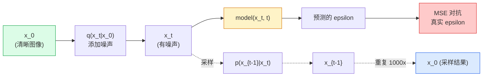

# 图像生成 — 扩散模型

> 扩散模型学会了去噪。训练它从有噪图像中移除微量噪声，重复一千次反向过程，你就得到了一台图像生成器。

**类型:** Build
**语言:** Python
**前置要求:** Phase 4 Lesson 07 (U-Net), Phase 1 Lesson 06 (概率), Phase 3 Lesson 06 (优化器)
**时长:** 约 75 分钟

## 学习目标

- 推导正向加噪过程 `x_0 -> x_1 -> ... -> x_T`，并解释为什么对任意 t 闭合形式的 `q(x_t | x_0)` 成立
- 实现 DDPM 风格的训练目标——在每个步骤回归添加的噪声，以及一个从纯噪声反向走到图像的采样器
- 构建一个时间条件化 U-Net（小到可以在 CPU 上训练），用于预测任意时间步的噪声
- 解释 DDPM 和 DDIM 采样的区别，以及各自适用的场景（Lesson 23 深入讲解流匹配和整流流）

## 问题背景

GAN 是单次生成：噪声进，图像出，一次前向传播。速度快但训练困难。扩散模型是迭代生成：从纯噪声出发，小步去噪，图像逐步显现。速度慢但训练容易。过去五年，后者特性占了主导：任何小团队都能训练一个扩散模型并获得合理的样本；而 GAN 训练是一门需要多年失败经验才能掌握的技艺。

除了训练稳定性之外，扩散的迭代结构是现代图像生成一切能力的来源：文本条件化、局部重绘、图像编辑、超分辨率、可控风格。采样循环的每一步都是注入新约束的地方。这就是 Stable Diffusion、Imagen、DALL-E 3、Midjourney 以及你将使用的每个可控图像模型都是扩散模型的原因。

本课构建最小化 DDPM：正向加噪、反向去噪、训练循环。下一课（Stable Diffusion）将其接入生产系统，包含 VAE、文本编码器和无分类器引导。

## 核心概念

### 正向过程

取一张图像 `x_0`。添加少量高斯噪声得到 `x_1`。再添加少量得到 `x_2`。如此进行 T 步，直到 `x_T` 与纯高斯噪声几乎无法区分。

```
q(x_t | x_{t-1}) = N(x_t; sqrt(1 - beta_t) * x_{t-1},  beta_t * I)
```

`beta_t` 是一个小方差时间表，通常在线性时间表上从 0.0001 到 0.02（T=1000 步）。每一步略微缩小信号并注入新噪声。

### 闭合形式的跳跃

逐步加噪是一个马尔可夫链，但数学上可以折叠：你可以一步从 `x_0` 直接采样 `x_t`。

```
定义 alpha_t = 1 - beta_t
定义 alpha_bar_t = prod_{s=1..t} alpha_s

则：
  q(x_t | x_0) = N(x_t; sqrt(alpha_bar_t) * x_0,  (1 - alpha_bar_t) * I)

等价于：
  x_t = sqrt(alpha_bar_t) * x_0 + sqrt(1 - alpha_bar_t) * epsilon
  其中 epsilon ~ N(0, I)
```

这个方程就是扩散实用的全部原因。训练时，你随机选择一个 `t`，直接从 `x_0` 采样 `x_t`，一步完成训练——无需模拟完整的马尔可夫链。

### 反向过程

正向过程是固定的。反向过程 `p(x_{t-1} | x_t)` 是神经网络需要学习的。扩散模型不直接预测 `x_{t-1}`；它们预测在步骤 t 添加的噪声 `epsilon`，然后数学推导出 `x_{t-1}`。



### 训练损失

每个训练步骤：

1. 采样一张真实图像 `x_0`。
2. 从 [1, T] 均匀采样一个时间步 `t`。
3. 采样噪声 `epsilon ~ N(0, I)`。
4. 计算 `x_t = sqrt(alpha_bar_t) * x_0 + sqrt(1 - alpha_bar_t) * epsilon`。
5. 用网络预测 `epsilon_theta(x_t, t)`。
6. 最小化 `|| epsilon - epsilon_theta(x_t, t) ||^2`。

就这样。神经网络学习预测任意时间步的噪声。损失是 MSE。没有对抗博弈，没有崩溃，没有振荡。

### 采样器（DDPM）

生成时：从 `x_T ~ N(0, I)` 开始，一步一步往回走。

```
for t = T, T-1, ..., 1:
    eps = model(x_t, t)
    x_{t-1} = (1 / sqrt(alpha_t)) * (x_t - (beta_t / sqrt(1 - alpha_bar_t)) * eps) + sqrt(beta_t) * z
    其中 z ~ N(0, I) 如果 t > 1，否则为 0
return x_0
```

关键是，尽管一般来说反向条件分布没有闭合形式，但对于这个特定的高斯正向过程是有闭合形式的。那个看起来复杂的系数是贝叶斯法则给你的结果。

### 为什么需要 1000 步

正向噪声时间表被选择为每一步只添加刚好足够的噪声，使反向步接近高斯分布。步数太少，反向步远离高斯，网络无法很好地建模。步数太多，采样成本昂贵但增益递减。T=1000 配合线性时间表是 DDPM 的默认配置。

### DDIM：采样快 20 倍

训练相同。采样不同。DDIM（Song et al., 2020）定义了一个确定性反向过程，可以跳过时间步而无需重新训练。用 DDIM 采样 50 步就能达到接近 1000 步 DDPM 的质量。每个生产系统都使用 DDIM 或更快的变体（DPM-Solver、Euler ancestor）。

### 时间条件化

网络 `epsilon_theta(x_t, t)` 需要知道它在哪个时间步去噪。现代扩散模型通过正弦时间嵌入（与 Transformer 中位置编码相同的思路）注入 `t`，这些嵌入被添加到每个 U-Net 层级的特征图上。

```
t_embedding = sinusoidal(t)
feature_map += MLP(t_embedding)
```

没有时间条件化，网络必须从图像本身猜测噪声水平，这可行但样本效率低得多。

## 构建过程

### 步骤 1：噪声时间表

```python
import torch

def linear_beta_schedule(T=1000, beta_start=1e-4, beta_end=2e-2):
    return torch.linspace(beta_start, beta_end, T)


def precompute_schedule(betas):
    alphas = 1.0 - betas
    alphas_cumprod = torch.cumprod(alphas, dim=0)
    return {
        "betas": betas,
        "alphas": alphas,
        "alphas_cumprod": alphas_cumprod,
        "sqrt_alphas_cumprod": torch.sqrt(alphas_cumprod),
        "sqrt_one_minus_alphas_cumprod": torch.sqrt(1.0 - alphas_cumprod),
        "sqrt_recip_alphas": torch.sqrt(1.0 / alphas),
    }

schedule = precompute_schedule(linear_beta_schedule(T=1000))
```

预计算一次，训练和采样时按索引查表。

### 步骤 2：正向扩散（q_sample）

```python
def q_sample(x0, t, noise, schedule):
    sqrt_a = schedule["sqrt_alphas_cumprod"][t].view(-1, 1, 1, 1)
    sqrt_one_minus_a = schedule["sqrt_one_minus_alphas_cumprod"][t].view(-1, 1, 1, 1)
    return sqrt_a * x0 + sqrt_one_minus_a * noise
```

一行闭合形式。`t` 是一批时间步，批次中每张图像对应一个。

### 步骤 3：小型时间条件化 U-Net

```python
import torch.nn as nn
import torch.nn.functional as F
import math

def timestep_embedding(t, dim=64):
    half = dim // 2
    freqs = torch.exp(-math.log(10000) * torch.arange(half, device=t.device) / half)
    args = t[:, None].float() * freqs[None]
    emb = torch.cat([args.sin(), args.cos()], dim=-1)
    return emb


class TinyUNet(nn.Module):
    def __init__(self, img_channels=3, base=32, t_dim=64):
        super().__init__()
        self.t_mlp = nn.Sequential(
            nn.Linear(t_dim, base * 4),
            nn.SiLU(),
            nn.Linear(base * 4, base * 4),
        )
        self.t_dim = t_dim
        self.enc1 = nn.Conv2d(img_channels, base, 3, padding=1)
        self.enc2 = nn.Conv2d(base, base * 2, 4, stride=2, padding=1)
        self.mid = nn.Conv2d(base * 2, base * 2, 3, padding=1)
        self.dec1 = nn.ConvTranspose2d(base * 2, base, 4, stride=2, padding=1)
        self.dec2 = nn.Conv2d(base * 2, img_channels, 3, padding=1)
        self.time_proj = nn.Linear(base * 4, base * 2)

    def forward(self, x, t):
        t_emb = timestep_embedding(t, self.t_dim)
        t_emb = self.t_mlp(t_emb)
        t_proj = self.time_proj(t_emb)[:, :, None, None]

        h1 = F.silu(self.enc1(x))
        h2 = F.silu(self.enc2(h1)) + t_proj
        h3 = F.silu(self.mid(h2))
        d1 = F.silu(self.dec1(h3))
        d2 = torch.cat([d1, h1], dim=1)
        return self.dec2(d2)
```

两级 U-Net，时间条件化注入在瓶颈处。扩大到真实图像需要增加深度和宽度。

### 步骤 4：训练循环

```python
def train_step(model, x0, schedule, optimizer, device, T=1000):
    model.train()
    x0 = x0.to(device)
    bs = x0.size(0)
    t = torch.randint(0, T, (bs,), device=device)
    noise = torch.randn_like(x0)
    x_t = q_sample(x0, t, noise, schedule)
    pred = model(x_t, t)
    loss = F.mse_loss(pred, noise)
    optimizer.zero_grad()
    loss.backward()
    optimizer.step()
    return loss.item()
```

这就是整个训练循环。没有 GAN 博弈，没有专门损失，只是一次 MSE 调用。

### 步骤 5：采样器（DDPM）

```python
@torch.no_grad()
def sample(model, schedule, shape, T=1000, device="cpu"):
    model.eval()
    x = torch.randn(shape, device=device)
    betas = schedule["betas"].to(device)
    sqrt_one_minus_a = schedule["sqrt_one_minus_alphas_cumprod"].to(device)
    sqrt_recip_alphas = schedule["sqrt_recip_alphas"].to(device)

    for t in reversed(range(T)):
        t_batch = torch.full((shape[0],), t, dtype=torch.long, device=device)
        eps = model(x, t_batch)
        coef = betas[t] / sqrt_one_minus_a[t]
        mean = sqrt_recip_alphas[t] * (x - coef * eps)
        if t > 0:
            x = mean + torch.sqrt(betas[t]) * torch.randn_like(x)
        else:
            x = mean
    return x
```

生成一批样本需要 1000 次前向传播。在真实代码中你会将其替换为 DDIM 50 步采样器。

### 步骤 6：DDIM 采样器（确定性，快约 20 倍）

```python
@torch.no_grad()
def sample_ddim(model, schedule, shape, steps=50, T=1000, device="cpu", eta=0.0):
    model.eval()
    x = torch.randn(shape, device=device)
    alphas_cumprod = schedule["alphas_cumprod"].to(device)

    ts = torch.linspace(T - 1, 0, steps + 1).long()
    for i in range(steps):
        t = ts[i]
        t_prev = ts[i + 1]
        t_batch = torch.full((shape[0],), t, dtype=torch.long, device=device)
        eps = model(x, t_batch)
        a_t = alphas_cumprod[t]
        a_prev = alphas_cumprod[t_prev] if t_prev >= 0 else torch.tensor(1.0, device=device)
        x0_pred = (x - torch.sqrt(1 - a_t) * eps) / torch.sqrt(a_t)
        sigma = eta * torch.sqrt((1 - a_prev) / (1 - a_t) * (1 - a_t / a_prev))
        dir_xt = torch.sqrt(1 - a_prev - sigma ** 2) * eps
        noise = sigma * torch.randn_like(x) if eta > 0 else 0
        x = torch.sqrt(a_prev) * x0_pred + dir_xt + noise
    return x
```

`eta=0` 是完全确定性的（相同的噪声输入总是产生相同的输出）。`eta=1` 恢复 DDPM。

## 应用

生产工作中，使用 `diffusers`：

```python
from diffusers import DDPMScheduler, UNet2DModel

unet = UNet2DModel(sample_size=32, in_channels=3, out_channels=3, layers_per_block=2)
scheduler = DDPMScheduler(num_train_timesteps=1000)
```

该库提供了现成的调度器（DDPM、DDIM、DPM-Solver、Euler、Heun）、可配置的 U-Net、文生图和图生图流水线，以及 LoRA 微调辅助工具。

对于研究，`k-diffusion`（Katherine Crowson）有最忠实的参考实现和最好的采样变体。

## 交付物

本课产出：

- `outputs/prompt-diffusion-sampler-picker.md`——一个提示词，根据质量目标、延迟预算和条件化类型选择 DDPM / DDIM / DPM-Solver / Euler。
- `outputs/skill-noise-schedule-designer.md`——一个技能，给定 T 和目标腐蚀水平，生成线性、余弦或 S 形 beta 时间表，加上信噪比随时间变化的可视化诊断图。

## 练习

1. **(简单)** 可视化正向过程：取一张图像，绘制 `t in [0, 100, 250, 500, 750, 1000]` 时的 `x_t`。验证 `x_1000` 看起来像纯高斯噪声。
2. **(中等)** 在合成圆数据集上训练 TinyUNet 20 个 epoch，采样 16 个圆。比较 DDPM（1000 步）和 DDIM（50 步）采样——从相同噪声种子出发，它们产生相似的图像吗？
3. **(困难)** 实现余弦噪声时间表（Nichol & Dhariwal, 2021）：`alpha_bar_t = cos^2((t/T + s) / (1 + s) * pi / 2)`。分别用线性和余弦时间表训练相同模型，并展示余弦在低步数时给出更好的样本。

## 核心术语

| 术语 | 常见说法 | 实际含义 |
|------|---------|---------|
| 正向过程 | "随时间加噪" | 固定的马尔可夫链，在 T 步内将图像腐蚀为高斯噪声 |
| 反向过程 | "逐步去噪" | 学到的分布，从噪声逐步走回图像 |
| epsilon 预测 | "预测噪声" | 训练目标：`epsilon_theta(x_t, t)` 预测在步骤 t 添加的噪声 |
| Beta 时间表 | "噪声量" | T 个小方差的序列，定义每步进入的噪声量 |
| alpha_bar_t | "累积保留因子" | 到时间 t 为止的 (1 - beta_s) 乘积；t 越大，信号越少 |
| DDPM 采样器 | "祖先式、随机" | 从其条件高斯分布中采样每个 x_{t-1}；1000 步 |
| DDIM 采样器 | "确定性、快" | 将采样重写为确定性 ODE；20-100 步达到类似质量 |
| 时间条件化 | "告诉模型当前是哪个 t" | t 的正弦嵌入注入 U-Net，使网络知道噪声水平 |

## 延伸阅读

- [Denoising Diffusion Probabilistic Models (Ho et al., 2020)](https://arxiv.org/abs/2006.11239)——使扩散变得实用并在 FID 上击败 GANs 的论文
- [Improved DDPM (Nichol & Dhariwal, 2021)](https://arxiv.org/abs/2102.09672)——余弦时间表和 v 参数化
- [DDIM (Song, Meng, Ermon, 2020)](https://arxiv.org/abs/2010.02502)——使实时推理成为可能的确定性采样器
- [Elucidating the Design Space of Diffusion (Karras et al., 2022)](https://arxiv.org/abs/2206.00364)——对每个扩散设计选择的统一视角；当前最佳参考