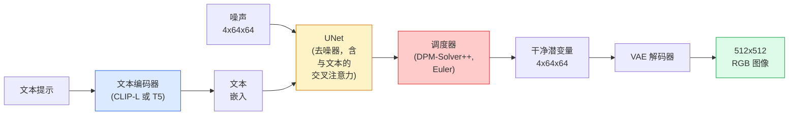

# Stable Diffusion — 架构与微调

> Stable Diffusion 是一个在预训练 VAE 潜空间中运行的 DDPM，通过交叉注意力以文本为条件，用快速确定性 ODE 求解器采样，并由无分类器引导控制。

**类型:** Learn + Use
**语言:** Python
**前置要求:** Phase 4 Lesson 10 (Diffusion), Phase 7 Lesson 02 (自注意力)
**时长:** 约 75 分钟

## 学习目标

- 追踪 Stable Diffusion 管线的五个组成部分：VAE、文本编码器、U-Net、调度器、安全检查器——以及每个组件的实际作用
- 解释潜扩散，以及为什么在 4x64x64 潜空间（而非 3x512x512 图像）中训练可将计算量减少 48 倍而不损失质量
- 使用 `diffusers` 生成图像、执行图生图、局部重绘和 ControlNet 引导生成
- 在小型自定义数据集上用 LoRA 微调 Stable Diffusion，并在推理时加载 LoRA 适配器

## 问题背景

直接在 512x512 RGB 图像上训练 DDPM 是昂贵的。每一步训练都要通过一个看到 3x512x512 = 786,432 个输入值的 U-Net 进行反向传播，而且采样需要 50+ 次前向传播。在 Stable Diffusion 1.5（2022 年发布）的质量水平上，像素空间扩散大约需要 256 GPU-月的训练时间和消费级 GPU 上每张图像 10-30 秒。

使开源文生图变得实用的技巧是**潜扩散**（Rombach et al., CVPR 2022）。训练一个 VAE 将 3x512x512 图像映射到 4x64x64 潜张量并还原，然后在潜空间中进行扩散。计算量减少 `(3*512*512)/(4*64*64) = 48` 倍。在相同 GPU 上采样从数十秒减少到不足两秒。

几乎每个现代图像生成模型——SDXL、SD3、FLUX、HunyuanDiT、Wan-Video——都是潜扩散模型，区别在于自编码器、去噪器（U-Net 或 DiT）和文本条件化的变体。学习 Stable Diffusion 就学会了模板。

## 核心概念

### 管线



- **VAE**——冻结的自编码器。编码器将图像转换为潜变量（用于图生图和训练）。解码器将潜变量还原为图像。
- **文本编码器**——CLIP 文本编码器（SD 1.x/2.x）、CLIP-L + CLIP-G（SDXL）或 T5-XXL（SD3/FLUX）。产生一序列 token 嵌入。
- **U-Net**——去噪器。在每个分辨率层级都有交叉注意力层，注意力从潜变量指向文本嵌入。
- **调度器**——采样算法（DDIM、Euler、DPM-Solver++）。选择 sigma，将预测的噪声混合回潜变量。
- **安全检查器**——对输出图像的可选 NSFW/非法内容过滤器。

### 无分类器引导（CFG）

普通文本条件化对每个提示 `c` 学习 `epsilon_theta(x_t, t, c)`。CFG 以 10% 的概率丢弃 `c`（替换为空嵌入）来训练同一网络，使单一模型同时预测条件和无条件噪声。推理时：

```
eps = eps_uncond + w * (eps_cond - eps_uncond)
```

`w` 是引导比例尺。`w=0` 是无条件的，`w=1` 是普通条件化的，`w>1` 推动输出"更贴合提示"，代价是多样性降低。SD 默认值是 `w=7.5`。

CFG 是文生图达到生产质量的原因。没有它，提示只能弱地偏置输出；有了它，提示占主导地位。

### 潜空间几何

VAE 的 4 通道潜变量不仅仅是一张压缩图像。它是一个流形，其中算术运算大致对应语义编辑（提示工程 + 插值都在这里），扩散 U-Net 的整个建模预算都花在这个流形上。解码一个随机的 4x64x64 潜变量不会产生看起来随机的图像——它会产生垃圾，因为只有潜变量的特定子流形才能解码为有效图像。

两个推论：

1. **图生图** = 将图像编码到潜变量，添加部分噪声，运行去噪器，解码。图像结构得以保留，因为编码是近乎可逆的；内容根据提示变化。
2. **局部重绘** = 与图生图相同，但去噪器只更新被遮罩区域；未遮罩区域保持在编码潜变量处。

### U-Net 架构

SD U-Net 是 Lesson 10 中 TinyUNet 的大号版本，加上三个 additions：

- 每个空间分辨率上的**Transformer 块**，包含自注意力 + 交叉注意力（指向文本嵌入）。
- 通过 MLP 对正弦编码的**时间嵌入**。
- 在编码器和解码器对应分辨率之间的**跳跃连接**。

SD 1.5 总参数：约 860M。SDXL：约 2.6B。FLUX：约 12B。参数跃升主要来自注意力层。

### LoRA 微调

完整微调 Stable Diffusion 需要 20+ GB 显存，更新 860M 参数。LoRA（低秩适配）保持基础模型冻结，向注意力层注入小的秩分解矩阵。SD 的 LoRA 适配器通常只有 10-50 MB，在单块消费级 GPU 上 10-60 分钟即可训练完成，推理时可作为即插即用的修改来加载。

```
原始：W_q : (d_in, d_out)   冻结
LoRA：W_q + alpha * (A @ B)   其中 A : (d_in, r), B : (r, d_out)

r 通常为 4-32。
```

LoRA 是几乎所有社区微调分发的方式。CivitAI 和 Hugging Face 上托管了数百万个。

### 你会遇到的调度器

- **DDIM**——确定性，约 50 步，简洁。
- **Euler ancestor**——随机性，30-50 步，样本略有创意。
- **DPM-Solver++ 2M Karras**——确定性，20-30 步，生产默认。
- **LCM / TCD / Turbo**——一致性模型和蒸馏变体；1-4 步，代价是一些质量。

在 `diffusers` 中切换调度器是一行代码的改动，有时可以在不重新训练的情况下修复采样问题。

## 构建过程

本课使用 `diffusers` 端到端，而不是从头重建 Stable Diffusion。你需要重建的组件（VAE、文本编码器、U-Net、调度器）各有自己的课程；这里的目标是熟练使用生产 API。

### 步骤 1：文生图

```python
import torch
from diffusers import StableDiffusionPipeline

pipe = StableDiffusionPipeline.from_pretrained(
    "runwayml/stable-diffusion-v1-5",
    torch_dtype=torch.float16,
).to("cuda")

image = pipe(
    prompt="a dog riding a skateboard in tokyo, studio ghibli style",
    guidance_scale=7.5,
    num_inference_steps=25,
    generator=torch.Generator("cuda").manual_seed(42),
).images[0]
image.save("dog.png")
```

`float16` 将显存减半且没有可见的质量损失。默认 DPM-Solver++ 下 `num_inference_steps=25` 等效于 DDIM 下 `num_inference_steps=50`。

### 步骤 2：切换调度器

```python
from diffusers import DPMSolverMultistepScheduler, EulerAncestralDiscreteScheduler

pipe.scheduler = DPMSolverMultistepScheduler.from_config(pipe.scheduler.config)
pipe.scheduler = EulerAncestralDiscreteScheduler.from_config(pipe.scheduler.config)
```

调度器状态与 U-Net 权重解耦。你可以在 DDPM 上训练，用任意调度器采样。

### 步骤 3：图生图

```python
from diffusers import StableDiffusionImg2ImgPipeline
from PIL import Image

img2img = StableDiffusionImg2ImgPipeline.from_pretrained(
    "runwayml/stable-diffusion-v1-5",
    torch_dtype=torch.float16,
).to("cuda")

init_image = Image.open("dog.png").convert("RGB").resize((512, 512))
out = img2img(
    prompt="a dog riding a skateboard, oil painting",
    image=init_image,
    strength=0.6,
    guidance_scale=7.5,
).images[0]
```

`strength` 是去噪前添加多少噪声（0.0 = 不变，1.0 = 完全重新生成）。0.5-0.7 是风格迁移的标准范围。

### 步骤 4：局部重绘

```python
from diffusers import StableDiffusionInpaintPipeline

inpaint = StableDiffusionInpaintPipeline.from_pretrained(
    "runwayml/stable-diffusion-inpainting",
    torch_dtype=torch.float16,
).to("cuda")

image = Image.open("dog.png").convert("RGB").resize((512, 512))
mask = Image.open("dog_mask.png").convert("L").resize((512, 512))

out = inpaint(
    prompt="a cat",
    image=image,
    mask_image=mask,
    guidance_scale=7.5,
).images[0]
```

遮罩中的白色像素是要重新生成的区域。黑色像素被保留。

### 步骤 5：加载 LoRA

```python
pipe.load_lora_weights("sayakpaul/sd-lora-ghibli")
pipe.fuse_lora(lora_scale=0.8)

image = pipe(prompt="a village square in ghibli style").images[0]
```

`lora_scale` 控制强度；0.0 = 无效果，1.0 = 完全效果。`fuse_lora` 将适配器融合到权重中以提高速度，但之后无法切换。先调用 `pipe.unfuse_lora()` 再加载不同的适配器。

### 步骤 6：LoRA 训练（概要）

真正的 LoRA 训练在 `peft` 或 `diffusers.training` 中。轮廓如下：

```python
# 伪代码
for step, batch in enumerate(dataloader):
    images, prompts = batch
    latents = vae.encode(images).latent_dist.sample() * 0.18215

    t = torch.randint(0, num_train_timesteps, (batch_size,))
    noise = torch.randn_like(latents)
    noisy_latents = scheduler.add_noise(latents, noise, t)

    text_emb = text_encoder(tokenizer(prompts))

    pred_noise = unet(noisy_latents, t, text_emb)  # LoRA 权重在这里注入

    loss = F.mse_loss(pred_noise, noise)
    loss.backward()
    optimizer.step()
```

只有 LoRA 矩阵接收梯度；基础 U-Net、VAE 和文本编码器都是冻结的。batch size 为 1 且使用梯度检查点时，这可以在 8 GB 显存中运行。

## 应用

生产中你实际做出的决策：

- **模型家族**：SD 1.5 用于开源社区微调，SDXL 用于更高保真度，SD3 / FLUX 用于最新技术水平和严格的许可要求。
- **调度器**：DPM-Solver++ 2M Karras 用于 20-30 步，延迟要求低于 1 秒时用 LCM-LoRA。
- **精度**：4080/4090 上用 `float16`，A100 及更新显卡上用 `bfloat16`，显存紧张时用 `int8`（通过 `bitsandbytes` 或 `compel`）。
- **条件化**：纯文本可用；需要更强控制时，在基础管线上叠加 ControlNet（canny、深度、姿态）。

批量生成时，社区工具是 `AUTO1111` / `ComfyUI`；生产 API 用 `diffusers` + `accelerate` 或带 TensorRT 编译的 `optimum-nvidia`。

## 交付物

本课产出：

- `outputs/prompt-sd-pipeline-planner.md`——一个提示词，根据延迟预算、保真度目标和许可限制选择 SD 1.5 / SDXL / SD3 / FLUX 以及调度器和精度。
- `outputs/skill-lora-training-setup.md`——一个技能，为自定义数据集编写完整的 LoRA 训练配置，包含标题、秩、batch size 和学习率。

## 练习

1. **(简单)** 用 `guidance_scale` 在 `[1, 3, 5, 7.5, 10, 15]` 范围内生成相同提示。描述图像如何变化。在什么引导值时出现伪影？
2. **(中等)** 取任意真实照片，在 `strength` 为 `[0.2, 0.4, 0.6, 0.8, 1.0]` 时通过 `StableDiffusionImg2ImgPipeline` 处理。哪个强度在改变风格的同时保留了构图？为什么 1.0 完全忽略输入？
3. **(困难)** 在 10-20 张单一主体（宠物、Logo、角色）的图像上训练 LoRA，并在包含该主体的新场景中生成图像。报告产生了最佳身份保持且未对输入图像过拟合的 LoRA 秩和训练步数。

## 核心术语

| 术语 | 常见说法 | 实际含义 |
|------|---------|---------|
| 潜扩散 | "在潜变量中扩散" | 在 VAE 潜空间（4x64x64）而非像素空间（3x512x512）中运行整个 DDPM；节省 48 倍计算量 |
| VAE 缩放因子 | "0.18215" | 将 VAE 原始潜变量重新缩放为大致单位方差的常数；每个 SD 管线中硬编码 |
| 无分类器引导 | "CFG" | 混合条件和无条件噪声预测；单一最有影响力的推理旋钮 |
| 调度器 | "采样器" | 将噪声 + 模型预测转化为去噪潜变量轨迹的算法 |
| LoRA | "低秩适配器" | 微调注意力层而不触及基础权重的小秩分解矩阵 |
| 交叉注意力 | "文本-图像注意力" | 从潜变量 token 到文本 token 的注意力；在每个 U-Net 层级注入提示信息 |
| ControlNet | "结构条件化" | 一个单独训练的适配器，用额外输入（canny、深度、姿态、分割）引导 SD |
| DPM-Solver++ | "默认调度器" | 二阶确定性 ODE 求解器；在 2026 年的低步数（20-30）下达到最佳质量 |

## 延伸阅读

- [High-Resolution Image Synthesis with Latent Diffusion (Rombach et al., 2022)](https://arxiv.org/abs/2112.10752)——Stable Diffusion 论文；包含每个证明该设计的消融实验
- [Classifier-Free Diffusion Guidance (Ho & Salimans, 2022)](https://arxiv.org/abs/2207.12598)——CFG 论文
- [LoRA: Low-Rank Adaptation of Large Language Models (Hu et al., 2021)](https://arxiv.org/abs/2106.09685)——LoRA 最初来自 NLP；几乎不加改动地迁移到了 SD
- [diffusers 文档](https://huggingface.co/docs/diffusers)——每个 SD / SDXL / SD3 / FLUX 管线的参考文档