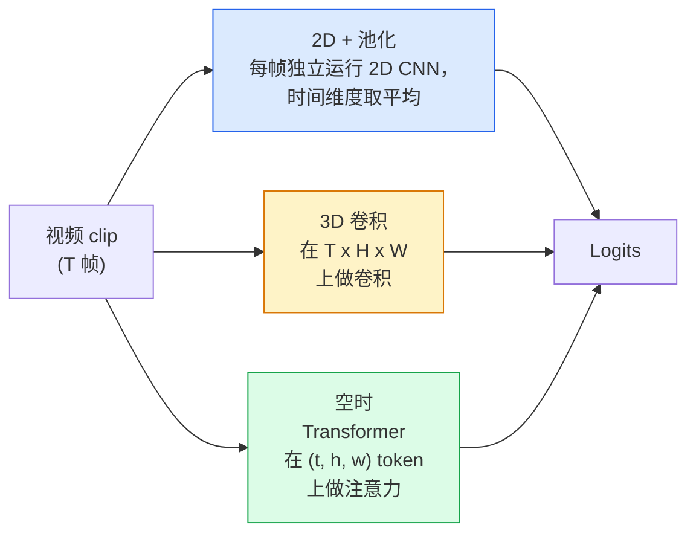

# 视频理解 — 时序建模

> 视频是一系列图像加上连接它们的物理规律。每种视频模型要么将时间视为额外轴（3D 卷积）、要么视为需要关注的序列（Transformer）、要么视为提取一次后池化的特征（2D+池化）。

**类型:** Learn + Build
**语言:** Python
**前置要求:** Phase 4 Lesson 03 (CNNs), Phase 4 Lesson 04 (图像分类)
**时长:** 约 45 分钟

## 学习目标

- 区分三种主要视频建模方法（2D+池化、3D 卷积、空时 Transformer），并预测它们的成本和精度权衡
- 在 PyTorch 中实现帧采样、时序池化和 2D+池化基线分类器
- 解释 I3D 的"膨胀"3D 内核为何能从 ImageNet 权重很好地迁移，以及分解式 (2+1)D 卷积有何不同
- 阅读标准动作识别数据集和指标：Kinetics-400/600、UCF101、Something-Something V2； clip 级别和视频级别的 top-1 准确率

## 问题背景

30 秒 30 fps 的视频是 900 张图像。朴素地看，视频分类就是运行 900 次图像分类，然后做某种聚合。当动作在几乎每一帧都可见时（体育、烹饪、健身视频），这是可行的；当动作本身由运动定义时则完全失败："从左向右推某物"在每一帧看来都是两个静止的物体。

每个视频架构的核心问题是：时序结构何时被建模，以及如何建模？答案决定了其他一切——计算成本、预训练策略、是否可以复用 ImageNet 权重、模型在什么数据集上训练。

本课故意比静态图像课程短。核心图像 machinery 已经就位，视频理解主要讲的是时序故事：采样、建模和聚合。

## 核心概念

### 三种架构家族



### 2D + 池化

取一个 2D CNN（ResNet、EfficientNet、ViT）。在每个采样的帧上独立运行它。对帧级嵌入取平均（或最大池化，或注意力池化）。将池化后的向量送入分类器。

优点：
- ImageNet 预训练直接迁移。
- 最容易实现。
- 成本低：T 帧 × 单张图像推理成本。

缺点：
- 无法建模运动。动作 = 外观的聚合。
- 时序池化是顺序不变的；"开门"和"关门"看起来一样。

何时使用：外观主导的任务、小型视频数据集上的迁移学习、初始基线。

### 3D 卷积

将 2D (H, W) 内核替换为 3D (T, H, W) 内核。网络在空间和时间上同时做卷积。早期家族：C3D、I3D、SlowFast。

I3D 技巧：取一个预训练的 2D ImageNet 模型，"膨胀"每个 2D 内核——沿新的时间轴复制。3x3 2D 卷积变成 3x3x3 3D 卷积。这给 3D 模型提供了强的预训练权重，而不是从头训练。

优点：
- 直接建模运动。
- I3D 膨胀提供了免费的迁移学习。

缺点：
- 比 2D 对应物多 T/8 的 FLOPs（对于时间核堆叠 3 次）。
- 时间核较小；长程运动需要金字塔或双流方法。

何时使用：运动即信号的动作识别（Something-Something V2、运动密集的 Kinetics 类别）。

### 空时 Transformer

将视频标记化为空时补丁网格，在所有补丁上做注意力。TimeSformer、ViViT、Video Swin、VideoMAE。

重要的注意力模式：
- **联合注意力**——一个大的 (t, h, w) 注意力。在 `T*H*W` 上是二次方；昂贵。
- **分解注意力**——每个块两次注意力：一次对时间，一次对空间。大致线性扩展。
- **分解式**——时间注意力和空间注意力在块间交替。

优点：
- 在每个主要基准测试上达到 SOTA 准确率。
- 通过补丁膨胀从图像 Transformer（ViT）迁移。
- 通过稀疏注意力支持长上下文视频。

缺点：
- 计算量大。
- 需要谨慎选择注意力模式，否则运行时急剧膨胀。

何时使用：大型数据集、高保真度视频理解、多模态视频+文本任务。

### 帧采样

30 fps 下 10 秒 clip 是 300 帧；将全部 300 帧输入任何模型是浪费。标准策略：

- **均匀采样**——在 clip 上均匀选取 T 帧。2D+池化的默认选项。
- **密集采样**——随机连续 T 帧窗口。3D 卷积的常见选项，因为运动需要相邻帧。
- **多 clip**——从同一视频中采样多个 T 帧窗口，分别分类，测试时平均预测。

T 通常是 8、16、32 或 64。T 越高，时间信号越丰富，但计算量越大。

### 评估

两个层级：
- **Clip 级准确率**——模型看到一个 T 帧 clip，报告 top-k。
- **视频级准确率**——对每视频的多个 clip 的 clip 级预测取平均；更高更稳定。

始终同时报告两个。一个模型 clip 级 78% / 视频级 82% 高度依赖测试时平均；80% / 81% 的模型每个 clip 更鲁棒。

### 你会遇到的数据集

- **Kinetics-400 / 600 / 700**——通用动作数据集。40 万 clip；YouTube 链接（许多现已失效）。
- **Something-Something V2**——由运动定义的动作（"将 X 从左向右移动"）。2D+池化无法解决。
- **UCF-101**、**HMDB-51**——更老、更小，但仍在报告。
- **AVA**——时空中动作*定位*；比分类更难。

## 构建过程

### 步骤 1：帧采样器

在帧列表（或视频张量）上工作的均匀和密集采样器。

```python
import numpy as np

def sample_uniform(num_frames_total, T):
    if num_frames_total <= T:
        return list(range(num_frames_total)) + [num_frames_total - 1] * (T - num_frames_total)
    step = num_frames_total / T
    return [int(i * step) for i in range(T)]


def sample_dense(num_frames_total, T, rng=None):
    rng = rng or np.random.default_rng()
    if num_frames_total <= T:
        return list(range(num_frames_total)) + [num_frames_total - 1] * (T - num_frames_total)
    start = int(rng.integers(0, num_frames_total - T + 1))
    return list(range(start, start + T))
```

两者都返回 `T` 个索引，用于切分视频张量。

### 步骤 2：2D+池化基线

在每帧上运行 2D ResNet-18，平均池化特征，分类。

```python
import torch
import torch.nn as nn
from torchvision.models import resnet18, ResNet18_Weights

class FramePool(nn.Module):
    def __init__(self, num_classes=400, pretrained=True):
        super().__init__()
        weights = ResNet18_Weights.IMAGENET1K_V1 if pretrained else None
        backbone = resnet18(weights=weights)
        self.features = nn.Sequential(*(list(backbone.children())[:-1]))  # 保留全局平均池化
        self.head = nn.Linear(512, num_classes)

    def forward(self, x):
        # x: (N, T, 3, H, W)
        N, T = x.shape[:2]
        x = x.view(N * T, *x.shape[2:])
        feats = self.features(x).view(N, T, -1)
        pooled = feats.mean(dim=1)
        return self.head(pooled)

model = FramePool(num_classes=10)
x = torch.randn(2, 8, 3, 224, 224)
print(f"output: {model(x).shape}")
print(f"params: {sum(p.numel() for p in model.parameters()):,}")
```

1100 万参数，ImageNet 预训练，逐帧运行，取平均，分类。在外观主导的任务上，这个基线通常在 proper 3D 模型的 5-10 个点以内——有时更好，因为它复用一个更强的 ImageNet 主干网。

### 步骤 3：I3D 风格的膨胀 3D 卷积

通过沿新时间轴重复权重将单个 2D 卷积转换为 3D 卷积。

```python
def inflate_2d_to_3d(conv2d, time_kernel=3):
    out_c, in_c, kh, kw = conv2d.weight.shape
    weight_3d = conv2d.weight.data.unsqueeze(2)  # (out, in, 1, kh, kw)
    weight_3d = weight_3d.repeat(1, 1, time_kernel, 1, 1) / time_kernel
    conv3d = nn.Conv3d(in_c, out_c, kernel_size=(time_kernel, kh, kw),
                        padding=(time_kernel // 2, conv2d.padding[0], conv2d.padding[1]),
                        stride=(1, conv2d.stride[0], conv2d.stride[1]),
                        bias=False)
    conv3d.weight.data = weight_3d
    return conv3d

conv2d = nn.Conv2d(3, 64, kernel_size=3, padding=1, bias=False)
conv3d = inflate_2d_to_3d(conv2d, time_kernel=3)
print(f"2D weight shape:  {tuple(conv2d.weight.shape)}")
print(f"3D weight shape:  {tuple(conv3d.weight.shape)}")
x = torch.randn(1, 3, 8, 56, 56)
print(f"3D output shape:  {tuple(conv3d(x).shape)}")
```

除以 `time_kernel` 保持激活值大小大致恒定——对于不破坏第一次前向传播的批归一化统计量很重要。

### 步骤 4：分解式 (2+1)D 卷积

将一个 3D 卷积分解为 2D（空间）和 1D（时间）卷积。相同感受野，更少参数，在某些基准测试上精度更好。

```python
class Conv2Plus1D(nn.Module):
    def __init__(self, in_c, out_c, kernel_size=3):
        super().__init__()
        mid_c = (in_c * out_c * kernel_size * kernel_size * kernel_size) \
                // (in_c * kernel_size * kernel_size + out_c * kernel_size)
        self.spatial = nn.Conv3d(in_c, mid_c, kernel_size=(1, kernel_size, kernel_size),
                                 padding=(0, kernel_size // 2, kernel_size // 2), bias=False)
        self.bn = nn.BatchNorm3d(mid_c)
        self.act = nn.ReLU(inplace=True)
        self.temporal = nn.Conv3d(mid_c, out_c, kernel_size=(kernel_size, 1, 1),
                                  padding=(kernel_size // 2, 0, 0), bias=False)

    def forward(self, x):
        return self.temporal(self.act(self.bn(self.spatial(x))))

c = Conv2Plus1D(3, 64)
x = torch.randn(1, 3, 8, 56, 56)
print(f"(2+1)D output: {tuple(c(x).shape)}")
```

完整的 R(2+1)D 网络等同于一个 ResNet-18，其中每个 3x3 卷积都替换为 `Conv2Plus1D`。

## 应用

两个库覆盖生产视频工作：

- `torchvision.models.video`——R(2+1)D、MViT、Swin3D 配合预训练 Kinetics 权重。与图像模型相同的 API。
- `pytorchvideo`（Meta）——模型库、Kinetics / SSv2 / AVA 的数据加载器、标准变换。

对于视觉-语言视频模型（视频字幕、视频问答），使用 `transformers`（`VideoMAE`、`VideoLLaMA`、`InternVideo`）。

## 交付物

本课产出：

- `outputs/prompt-video-architecture-picker.md`——一个提示词，基于外观 vs 运动、数据集大小和计算预算选择 2D+池化 / I3D / (2+1)D / transformer。
- `outputs/skill-frame-sampler-auditor.md`——一个技能，检查视频流水线的采样器，标记常见 bug：差一索引、当 `num_frames < T` 时不均匀采样、缺少保持长宽比的裁剪等。

## 练习

1. **(简单)** 计算 FramePool（T=8）与 I3D 风格 3D ResNet（T=8）的大致 FLOPs。论证为什么 2D+池化便宜 3-5 倍。
2. **(中等)** 生成一个合成视频数据集：随机小球沿随机方向运动，用运动方向（"从左到右"、"从右到左"、"对角线向上"）打标签。在其上训练 FramePool。展示它达到接近随机的准确率，证明仅靠外观不足以处理运动任务。
3. **(困难)** 通过将 ResNet-18 中每个 Conv2d 替换为 `Conv2Plus1D` 来构建 R(2+1)D-18。从 ImageNet 预训练 ResNet-18 膨胀第一个卷积的权重。在练习 2 的运动数据集上训练，击败 FramePool。

## 核心术语

| 术语 | 常见说法 | 实际含义 |
|------|---------|---------|
| 2D + 池化 | "逐帧分类器" | 在每个采样帧上运行 2D CNN，时间维度平均池化特征，然后分类 |
| 3D 卷积 | "空时核" | 在 (T, H, W) 上做卷积的核；可原生建模运动 |
| 膨胀 | "将 2D 权重升至 3D" | 通过沿新时间轴重复 2D 卷积的权重来初始化 3D 卷积权重，然后除以 kernel_T 以保持激活尺度 |
| (2+1)D | "分解卷积" | 将 3D 分解为 2D 空间 + 1D 时间；参数更少，中间有额外非线性 |
| 分解注意力 | "先时间后空间" | Transformer 块每层两次注意力：一次对同帧 token，一次对同位置 token |
| Clip | "T 帧窗口" | T 帧的采样子序列；视频模型消费的单元 |
| Clip vs 视频准确率 | "两种评估设置" | Clip = 每视频一个样本，Video = 多个采样 clip 的平均 |
| Kinetics | "视频界的 ImageNet" | 400-700 个动作类别，30 万+ YouTube clip，标准视频预训练语料 |

## 延伸阅读

- [I3D: Quo Vadis, Action Recognition (Carreira & Zisserman, 2017)](https://arxiv.org/abs/1705.07750)——引入膨胀和 Kinetics 数据集
- [R(2+1)D: A Closer Look at Spatiotemporal Convolutions (Tran et al., 2018)](https://arxiv.org/abs/1711.11248)——分解卷积，至今仍是强基线
- [TimeSformer: Is Space-Time Attention All You Need? (Bertasius et al., 2021)](https://arxiv.org/abs/2102.05095)——第一个强的视频 Transformer
- [VideoMAE (Tong et al., 2022)](https://arxiv.org/abs/2203.12602)——视频 masked autoencoder 预训练；当前主要的预训练方案