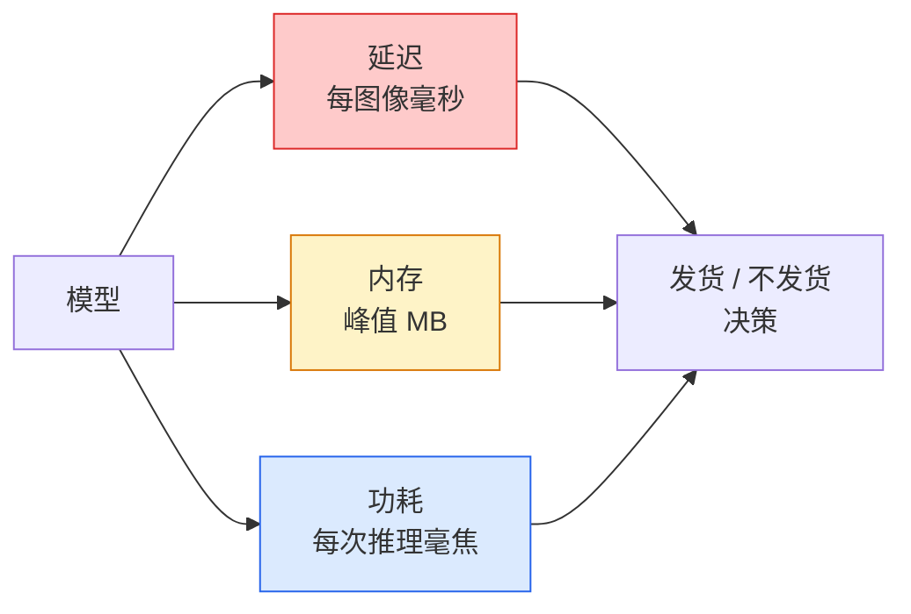

# 实时视觉 — 边缘部署

> 边缘推理是将一个 90 准确率的模型在 2 GB RAM 设备上运行到 30 fps 的学科。每一个准确率百分点都以毫秒延迟为代价换取。

**类型:** Learn + Build
**语言:** Python
**前置要求:** Phase 4 Lesson 04 (图像分类), Phase 10 Lesson 11 (量化)
**时长:** 约 75 分钟

## 学习目标

- 测量任何 PyTorch 模型的推理延迟、峰值内存和吞吐量，并解读 FLOPs / 参数量 / 延迟的权衡
- 使用 PyTorch 的训练后量化将视觉模型量化为 INT8，并验证精度损失 < 1%
- 导出到 ONNX 并用 ONNX Runtime 或 TensorRT 编译；说出三种最常见的导出失败及其修复方法
- 解释何时为边缘约束选择 MobileNetV3、EfficientNet-Lite、ConvNeXt-Tiny 或 MobileViT

## 问题背景

训练时的视觉模型是一个浮点怪物。100M 参数，每次前向传播 10 GFLOPs，2 GB 显存。这些都装不进手机、汽车信息娱乐单元、工业相机或无人机。发布视觉系统意味着将相同的预测塞进小 100 倍的预算。

三个旋钮做了大部分工作：模型选择（相同配方下更小的架构）、量化（INT8 而非 FP32）、推理运行时（ONNX Runtime、TensorRT、Core ML、TFLite）。用对它们是 demo 在工作站上运行与产品发货在 30 美元相机模块上的区别。

本课先建立测量规范（你无法优化你无法测量的东西），然后走三个旋钮。目标不是学习每个边缘运行时，而是知道存在哪些杠杆，以及如何验证每个杠杆做了你认为它做的事。

## 核心概念

### 三个预算



- **延迟**：p50、p95、p99。仅报告 p50 的均值会掩盖实时系统很重要的尾部行为。
- **峰值内存**：设备曾经看到的最大值，不是稳态平均值。这很重要，因为在嵌入式目标上 OOM 是致命的。
- **功耗/能量**：电池供电设备上每次推理的毫焦耳。通常用 CPU/GPU 利用率 × 时间代理。

一张 (model, latency, memory, accuracy) 表格是边缘决策的依据。每个单元格都是在目标设备上测量的，而非工作站上。

### 测量规范

每个边缘 profile 应遵循的三条规则：

1. **热身**：在测量前用 5-10 次虚拟前向传播热身模型。冷缓存和 JIT 编译产生不具代表性的初始数字。
2. **同步**：在计时块前后用 `torch.cuda.synchronize()` 同步 GPU 工作负载。没有这个，你测量的是内核调度，而非内核执行。
3. **固定输入尺寸**：固定为生产分辨率。224x224 上的延迟不是 512x512 上的延迟。

### FLOPs 作为代理

FLOPs（每次推理的浮点运算数）是延迟的廉价、设备无关代理。对架构比较有用，作为绝对时钟时间具有误导性。一个 FLOPs 多 10% 的模型实际上可能快 2 倍，因为它使用了硬件友好的算子（深度可分离卷积编译良好，大的 7x7 卷积则不然）。

规则：用 FLOPs 做架构搜索，用设备延迟做部署决策。

### 一段话讲清量化

将 FP32 权重和激活替换为 INT8。模型大小减少 4 倍，内存带宽减少 4 倍，在有 INT8 内核的硬件上计算减少 2-4 倍（每个现代移动 SoC、每个带 Tensor Core 的 NVIDIA GPU）。视觉任务的训练后静态量化精度损失通常为 0.1-1 个百分点。

类型：

- **动态量化**——将权重量化为 INT8，激活以 FP 计算。简单，加速小。
- **静态（训练后）量化**——量化权重 + 在小校准集上校准激活范围。比动态快得多。
- **量化感知训练（QAT）**——在训练期间模拟量化，使模型学会适应。精度最好，需要标注数据。

对于视觉，训练后静态量化用 5% 的努力获得 95% 的收益。只有当 PTQ 的精度损失不可接受时才使用 QAT。

### 剪枝和蒸馏

- **剪枝**——移除不重要的权重（基于幅值的）或通道（结构化的）。在过参数化模型上效果好；在已经紧凑的架构上用处较小。
- **蒸馏**——训练小模型模仿大模型的 logits。通常能恢复因模型缩小而损失的大部分精度。生产边缘模型的标准方法。

### 推理运行时

- **PyTorch eager**——慢，不用于部署。仅用于开发。
- **TorchScript**——已过时。被 `torch.compile` 和 ONNX 导出取代。
- **ONNX Runtime**——中立的运行时。CPU、CUDA、CoreML、TensorRT、OpenVINO 都有 ONNX 提供商。从这里开始。
- **TensorRT**——NVIDIA 的编译器。在 NVIDIA GPU（工作站和 Jetson）上延迟最低。可与 ONNX Runtime 集成或独立使用。
- **Core ML**——Apple 的 iOS/macOS 运行时。需要 `.mlmodel` 或 `.mlpackage`。
- **TFLite**——Google 的 Android/ARM 运行时。需要 `.tflite`。
- **OpenVINO**——Intel 的 CPU/VPU 运行时。需要 `.xml` + `.bin`。

实践中：导出 PyTorch -> ONNX -> 为目标选择运行时。ONNX 是通用语言。

### 边缘架构选择器

| 预算 | 模型 | 原因 |
|--------|-------|-----|
| < 3M 参数 | MobileNetV3-Small | 处处可编译，好基线 |
| 3-10M | EfficientNet-Lite-B0 | TFLite 上最佳精度/参数比 |
| 10-20M | ConvNeXt-Tiny | 最佳精度/参数比，CPU 友好 |
| 20-30M | MobileViT-S 或 EfficientViT | 达到 ImageNet 精度的 Transformer |
| 30-80M | Swin-V2-Tiny | 如果栈支持窗口注意力 |

除非有特定原因，否则将所有模型量化为 INT8。

## 构建过程

### 步骤 1：正确测量延迟

```python
import time
import torch

def measure_latency(model, input_shape, device="cpu", warmup=10, iters=50):
    model = model.to(device).eval()
    x = torch.randn(input_shape, device=device)
    with torch.no_grad():
        for _ in range(warmup):
            model(x)
        if device == "cuda":
            torch.cuda.synchronize()
        times = []
        for _ in range(iters):
            if device == "cuda":
                torch.cuda.synchronize()
            t0 = time.perf_counter()
            model(x)
            if device == "cuda":
                torch.cuda.synchronize()
            times.append((time.perf_counter() - t0) * 1000)
    times.sort()
    return {
        "p50_ms": times[len(times) // 2],
        "p95_ms": times[int(len(times) * 0.95)],
        "p99_ms": times[int(len(times) * 0.99)],
        "mean_ms": sum(times) / len(times),
    }
```

热身、同步、使用 `time.perf_counter()`。报告百分位数，而不仅仅是均值。

### 步骤 2：参数量和 FLOPs 计数

```python
def parameter_count(model):
    return sum(p.numel() for p in model.parameters())

def flops_estimate(model, input_shape):
    """
    对纯 conv/linear 模型的大致 FLOP 计数。生产项目用 `fvcore` 或 `ptflops`。
    """
    total = 0
    def conv_hook(m, inp, out):
        nonlocal total
        c_out, c_in, kh, kw = m.weight.shape
        h, w = out.shape[-2:]
        total += 2 * c_in * c_out * kh * kw * h * w
    def linear_hook(m, inp, out):
        nonlocal total
        total += 2 * m.in_features * m.out_features
    hooks = []
    for m in model.modules():
        if isinstance(m, torch.nn.Conv2d):
            hooks.append(m.register_forward_hook(conv_hook))
        elif isinstance(m, torch.nn.Linear):
            hooks.append(m.register_forward_hook(linear_hook))
    model.eval()
    with torch.no_grad():
        model(torch.randn(input_shape))
    for h in hooks:
        h.remove()
    return total
```

真实项目使用 `fvcore.nn.FlopCountAnalysis` 或 `ptflops`；它们正确处理每种模块类型。

### 步骤 3：训练后静态量化

```python
def quantise_ptq(model, calibration_loader, backend="x86"):
    import torch.ao.quantization as tq
    model = model.eval().cpu()
    model.qconfig = tq.get_default_qconfig(backend)
    tq.prepare(model, inplace=True)
    with torch.no_grad():
        for x, _ in calibration_loader:
            model(x)
    tq.convert(model, inplace=True)
    return model
```

三步：配置、准备（插入观察器）、用真实数据校准、转换（融合 + 量化）。需要模型被融合（`Conv -> BN -> ReLU` -> `ConvBnReLU`），`torch.ao.quantization.fuse_modules` 处理此事。

### 步骤 4：导出到 ONNX

```python
def export_onnx(model, sample_input, path="model.onnx"):
    model = model.eval()
    torch.onnx.export(
        model,
        sample_input,
        path,
        input_names=["input"],
        output_names=["output"],
        dynamic_axes={"input": {0: "batch"}, "output": {0: "batch"}},
        opset_version=17,
    )
    return path
```

`opset_version=17` 是 2026 年的安全默认值。`dynamic_axes` 让你用任意 batch size 运行 ONNX 模型。

### 步骤 5：基准测试和比较方案

```python
import torch.nn as nn
from torchvision.models import mobilenet_v3_small

def compare_regimes():
    model = mobilenet_v3_small(weights=None, num_classes=10)
    params = parameter_count(model)
    flops = flops_estimate(model, (1, 3, 224, 224))
    lat_fp32 = measure_latency(model, (1, 3, 224, 224), device="cpu")
    print(f"FP32 MobileNetV3-Small: {params:,} params  {flops/1e9:.2f} GFLOPs  "
          f"p50={lat_fp32['p50_ms']:.2f}ms  p95={lat_fp32['p95_ms']:.2f}ms")
```

对 `resnet50`、`efficientnet_v2_s` 和 `convnext_tiny` 运行相同函数，你就有了部署决策所需的比较表。

## 应用

生产栈收敛到三条路径之一：

- **Web / 无服务器**：PyTorch -> ONNX -> ONNX Runtime（CPU 或 CUDA 提供商）。最简单，对大多数足够。
- **NVIDIA 边缘（Jetson、GPU 服务器）**：PyTorch -> ONNX -> TensorRT。延迟最佳，工程工作量最大。
- **移动端**：PyTorch -> ONNX -> Core ML（iOS）或 TFLite（Android）。导出前量化。

对于测量，`torch-tb-profiler`、`nvprof` / `nsys` 和 macOS 上的 Instruments 给出逐层分解。`benchmark_app`（OpenVINO）和 `trtexec`（TensorRT）给出独立的 CLI 数字。

## 交付物

本课产出：

- `outputs/prompt-edge-deployment-planner.md`——一个提示词，给定目标设备和延迟 SLA，选择主干网、量化策略和运行时。
- `outputs/skill-latency-profiler.md`——一个技能，编写完整的延迟基准测试脚本，包含热身、同步、百分位数和内存跟踪。

## 练习

1. **(简单)** 在 CPU 上 224x224 测量 `resnet18`、`mobilenet_v3_small`、`efficientnet_v2_s` 和 `convnext_tiny` 的 p50 延迟。报告表格并确定哪个架构有最佳精度/毫秒。
2. **(中等)** 对 `mobilenet_v3_small` 应用训练后静态量化。报告 FP32 vs INT8 延迟和在 CIFAR-10 留出子集上的精度损失。
3. **(困难)** 将 `convnext_tiny` 导出到 ONNX，通过 `onnxruntime` 的 `CPUExecutionProvider` 运行，并与 PyTorch eager 基线比较延迟。找出 ONNX Runtime 首次更快的那一层并解释原因。

## 核心术语

| 术语 | 常见说法 | 实际含义 |
|------|---------|---------|
| 延迟 | "有多快" | 从输入到输出的时间；p50/p95/p99 百分位数，而非均值 |
| FLOPs | "模型大小" | 每次前向传播的浮点运算数；计算成本的粗略代理 |
| INT8 量化 | "8 位" | 将 FP32 权重/激活替换为 8 位整数；约小 4 倍，快 2-4 倍 |
| PTQ | "训练后量化" | 不重新训练地量化已训练模型；简单，通常够用 |
| QAT | "量化感知训练" | 在训练期间模拟量化；精度最好，需要标注数据 |
| ONNX | "中性格式" | 每个主流推理运行时都支持的模型交换格式 |
| TensorRT | "NVIDIA 编译器" | 将 ONNX 编译为 NVIDIA GPU 的优化引擎 |
| 蒸馏 | "教师 -> 学生" | 训练小模型模仿大模型的 logits；恢复大部分损失的精度 |

## 延伸阅读

- [EfficientNet (Tan & Le, 2019)](https://arxiv.org/abs/1905.11946)——高效架构的复合缩放
- [MobileNetV3 (Howard et al., 2019)](https://arxiv.org/abs/1905.02244)——移动优先架构，带 h-swish 和 Squeeze-and-Excitation
- [A Practical Guide to TensorRT Optimization (NVIDIA)](https://developer.nvidia.com/blog/accelerating-model-inference-with-tensorrt-tips-and-best-practices-for-pytorch-users/)——如何实际获得论文中的吞吐量数字
- [ONNX Runtime 文档](https://onnxruntime.ai/docs/)——量化、图优化、提供商选择