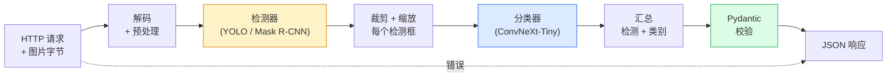

# 构建完整视觉流水线 ——  capstone 项目

> 产品级视觉系统是一串由数据契约串联起来的模型与规则的链条。所有组件都在本章出现过；capstone 把它们端到端串联起来。

**类型:** Build
**语言:** Python
**前置要求:** Phase 4 Lessons 01-15
**时长:** 约 120 分钟

## 学习目标

- 设计一个能检测物体、分类并输出结构化 JSON 的产品级视觉流水线——每条失败路径都要处理
- 将检测器（Mask R-CNN 或 YOLO）、分类器（ConvNeXt-Tiny）和数据契约（Pydantic）接入一个服务
- 基准测试端到端流水线，找出第一个瓶颈（通常是预处理，其次是检测器）
- 交付一个最小 FastAPI 服务：接受图片上传，运行流水线，返回带分类结果的检测

## 问题背景

单个视觉模型有用；视觉产品是它们的链条。零售货架审计 = 检测器 + 商品分类器 + 价格 OCR 流水线。自动驾驶 = 2D 检测器 + 3D 检测器 + 分割器 + 追踪器 + 规划器。医学初筛 = 分割器 + 区域分类器 + 临床医生界面。

串联这些链条，是 ML 原型与产品之间的分水岭。模型之间的每个接口都是一个新的潜在 bug。每一次坐标变换、归一化、mask 缩放，都是静默失败的候选。一条流水线有多强，取决于它最弱的接口。

本 capstone 搭建最小可行流水线：检测 + 分类 + 结构化输出 + 服务层。Phase 4 其余内容都可以插进这个框架：把 Mask R-CNN 换成 YOLOv8，加 OCR head，加分割分支，加追踪器。架构稳定，组件可插拔。

## 核心概念

### 流水线结构



七个阶段。两个模型阶段开销大；另外五个阶段才是 bug 的藏身之处。

### 数据契约与 Pydantic

每个模型边界都变成一个带类型的对象。这把静默失败变成显式报错。

```
Detection(
    box: tuple[float, float, float, float],   # (x1, y1, x2, y2)，绝对像素
    score: float,                              # [0, 1]
    class_id: int,                             # 来自检测器的标签映射
    mask: Optional[list[list[int]]],           # 有则返回 RLE 编码
)

PipelineResult(
    image_id: str,
    detections: list[Detection],
    classifications: list[Classification],
    inference_ms: float,
)
```

当检测器返回的是 `(cx, cy, w, h)` 而非 `(x1, y1, x2, y2)` 时，Pydantic 校验在边界处立即失败，而不是让你在下游裁剪出空区域时花一个小时调试。

### 延迟去哪了

几乎所有视觉流水线都符合三条规律：

1. **预处理往往是最耗时的单一块**。JPEG 解码、色彩空间转换、缩放——这些是 CPU 密集型，容易被忽略。
2. **检测器主导 GPU 时间**。70-90% 的 GPU 时间花在前向传播。
3. **后处理（NMS、RLE 编解码）在 GPU 上便宜，在 CPU 上贵**。一定要用实际目标设备做 profile。

知道这个分布，优化就变成了优先级列表。

### 失败模式

- **空检测** —— 返回空列表，不要崩溃。记录日志。
- **越界框** —— 裁剪前 clamp 到图像尺寸。
- **过小裁剪** —— 框小于分类器最小输入就跳过分类。
- **上传文件损坏** —— 400 响应带具体错误码，不要 500。
- **模型加载失败** —— 在服务启动时失败，不要在第一次请求时才失败。

产品级流水线对每种情况都有具体处理，而不是写泛用 `try/except` 来掩盖失败。每个失败都有名称代码和响应。

### 批处理

产品服务要服务多个客户端。跨请求批处理检测和分类可以倍增吞吐量。代价：等待批填满带来的额外延迟。典型配置：聚合请求最多 20ms，批量处理，分发响应。`torchserve` 和 `triton` 原生支持批处理；负载可预测的小服务通常自己实现 micro-batcher。

## 动手实现

### 步骤 1：数据契约

```python
from pydantic import BaseModel, Field
from typing import List, Optional, Tuple

class Detection(BaseModel):
    box: Tuple[float, float, float, float]
    score: float = Field(ge=0, le=1)
    class_id: int = Field(ge=0)
    mask_rle: Optional[str] = None


class Classification(BaseModel):
    detection_index: int
    class_id: int
    class_name: str
    score: float = Field(ge=0, le=1)


class PipelineResult(BaseModel):
    image_id: str
    detections: List[Detection]
    classifications: List[Classification]
    inference_ms: float
```

五行代码，省一个小时调试。

### 步骤 2：最小 Pipeline 类

```python
import time
import numpy as np
import torch
from PIL import Image

class VisionPipeline:
    def __init__(self, detector, classifier, class_names,
                 device="cpu", min_crop=32):
        self.detector = detector.to(device).eval()
        self.classifier = classifier.to(device).eval()
        self.class_names = class_names
        self.device = device
        self.min_crop = min_crop

    def preprocess(self, image):
        """
        image: PIL.Image 或 np.ndarray (H, W, 3) uint8
        returns: CHW float tensor，落在 device 上
        """
        if isinstance(image, Image.Image):
            image = np.asarray(image.convert("RGB"))
        tensor = torch.from_numpy(image).permute(2, 0, 1).float() / 255.0
        return tensor.to(self.device)

    @torch.no_grad()
    def detect(self, image_tensor):
        return self.detector([image_tensor])[0]

    @torch.no_grad()
    def classify(self, crops):
        if len(crops) == 0:
            return []
        batch = torch.stack(crops).to(self.device)
        logits = self.classifier(batch)
        probs = logits.softmax(-1)
        scores, cls = probs.max(-1)
        return list(zip(cls.tolist(), scores.tolist()))

    def run(self, image, image_id="anonymous"):
        t0 = time.perf_counter()
        tensor = self.preprocess(image)
        det = self.detect(tensor)

        crops = []
        detections = []
        valid_indices = []
        for i, (box, score, cls) in enumerate(zip(det["boxes"], det["scores"], det["labels"])):
            x1, y1, x2, y2 = [max(0, int(b)) for b in box.tolist()]
            x2 = min(x2, tensor.shape[-1])
            y2 = min(y2, tensor.shape[-2])
            detections.append(Detection(
                box=(x1, y1, x2, y2),
                score=float(score),
                class_id=int(cls),
            ))
            if (x2 - x1) < self.min_crop or (y2 - y1) < self.min_crop:
                continue
            crop = tensor[:, y1:y2, x1:x2]
            crop = torch.nn.functional.interpolate(
                crop.unsqueeze(0),
                size=(224, 224),
                mode="bilinear",
                align_corners=False,
            )[0]
            crops.append(crop)
            valid_indices.append(i)

        class_preds = self.classify(crops)

        classifications = []
        for valid_idx, (cls_id, cls_score) in zip(valid_indices, class_preds):
            classifications.append(Classification(
                detection_index=valid_idx,
                class_id=int(cls_id),
                class_name=self.class_names[cls_id],
                score=float(cls_score),
            ))

        return PipelineResult(
            image_id=image_id,
            detections=detections,
            classifications=classifications,
            inference_ms=(time.perf_counter() - t0) * 1000,
        )
```

每个接口都有类型。每个失败路径都有具体处理决策。

### 步骤 3：接入检测器与分类器

```python
from torchvision.models.detection import maskrcnn_resnet50_fpn_v2
from torchvision.models import convnext_tiny

# 用 ImageNet 预训练权重，无需训练即可跑完整流水线
detector = maskrcnn_resnet50_fpn_v2(weights="DEFAULT")
classifier = convnext_tiny(weights="DEFAULT")
class_names = [f"imagenet_class_{i}" for i in range(1000)]

pipe = VisionPipeline(detector, classifier, class_names)

# 用合成图像冒烟测试
test_image = (np.random.rand(400, 600, 3) * 255).astype(np.uint8)
result = pipe.run(test_image, image_id="demo")
print(result.model_dump_json(indent=2)[:500])
```

### 步骤 4：FastAPI 服务

```python
from fastapi import FastAPI, UploadFile, HTTPException
from io import BytesIO

app = FastAPI()
pipe = None  # 启动时初始化

@app.on_event("startup")
def load():
    global pipe
    detector = maskrcnn_resnet50_fpn_v2(weights="DEFAULT").eval()
    classifier = convnext_tiny(weights="DEFAULT").eval()
    pipe = VisionPipeline(detector, classifier, class_names=[f"c{i}" for i in range(1000)])

@app.post("/detect")
async def detect_endpoint(file: UploadFile):
    if file.content_type not in {"image/jpeg", "image/png", "image/webp"}:
        raise HTTPException(status_code=400, detail="unsupported image type")
    data = await file.read()
    try:
        img = Image.open(BytesIO(data)).convert("RGB")
    except Exception:
        raise HTTPException(status_code=400, detail="cannot decode image")
    result = pipe.run(img, image_id=file.filename or "upload")
    return result.model_dump()
```

启动命令：`uvicorn main:app --host 0.0.0.0 --port 8000`。测试：`curl -F 'file=@dog.jpg' http://localhost:8000/detect`。

### 步骤 5：流水线基准测试

```python
import time

def benchmark(pipe, num_runs=20, image_size=(400, 600)):
    img = (np.random.rand(*image_size, 3) * 255).astype(np.uint8)
    pipe.run(img)  # 热身

    stages = {"preprocess": [], "detect": [], "classify": [], "total": []}
    for _ in range(num_runs):
        t0 = time.perf_counter()
        tensor = pipe.preprocess(img)
        t1 = time.perf_counter()
        det = pipe.detect(tensor)
        t2 = time.perf_counter()
        crops = []
        for box in det["boxes"]:
            x1, y1, x2, y2 = [max(0, int(b)) for b in box.tolist()]
            x2 = min(x2, tensor.shape[-1])
            y2 = min(y2, tensor.shape[-2])
            if (x2 - x1) >= pipe.min_crop and (y2 - y1) >= pipe.min_crop:
                crop = tensor[:, y1:y2, x1:x2]
                crop = torch.nn.functional.interpolate(
                    crop.unsqueeze(0), size=(224, 224), mode="bilinear", align_corners=False
                )[0]
                crops.append(crop)
        pipe.classify(crops)
        t3 = time.perf_counter()
        stages["preprocess"].append((t1 - t0) * 1000)
        stages["detect"].append((t2 - t1) * 1000)
        stages["classify"].append((t3 - t2) * 1000)
        stages["total"].append((t3 - t0) * 1000)

    for stage, times in stages.items():
        times.sort()
        print(f"{stage:12s}  p50={times[len(times)//2]:7.1f} ms  p95={times[int(len(times)*0.95)]:7.1f} ms")
```

CPU 上的典型输出：预处理约 3ms，检测 300-500ms，分类 20-40ms，总计 350-550ms。GPU 上检测降到 20-40ms，预处理和分类在相对时间中占比更大。

## 用现成库

产品模板最终趋同于相同结构，另加：

- **模型版本管理** —— 响应中始终记录模型名称和权重哈希。
- **每请求 Trace ID** —— 每个阶段计时都记录，便于关联慢请求与具体阶段。
- **降级路径** —— 分类器超时时返回不含分类结果的检测，而非整个请求失败。
- **安全过滤** —— NSFW/PII 过滤在分类后、响应发出前运行。
- **批处理端点** —— `/detect_batch` 接受图片 URL 列表，支持批量处理。

产品级服务：`torchserve`、`Triton Inference Server`、`BentoML` 原生支持批处理、版本管理、指标和健康检查。直接跑 `FastAPI` 适合原型和小规模产品。

## 产出

本课产出：

- `outputs/prompt-vision-service-shape-reviewer.md` —— 审查视觉服务代码中合约/响应结构违规，并指出第一个破坏性 bug。
- `outputs/skill-pipeline-budget-planner.md` —— 给定目标延迟和吞吐量，为每个流水线阶段分配时间预算，并标记哪个阶段会率先超时。

## 练习

1. **(简单)** 在任意开放数据集的 10 张图片上运行流水线。报告各阶段平均耗时和每张图检测数量的分布。
2. **(中等)** 给 `Detection` 添加 mask 输出字段并编码为 RLE。验证即使 10 个目标图像的 JSON 也不超过 1MB。
3. **(困难)** 在分类器前加 micro-batcher：等待最多 10ms 收集一批裁剪图，一次 GPU 调用全部处理完，按请求分发结果。测量 5 并发请求/秒下的吞吐量增益和额外延迟。

## 关键术语

| 英文 | 中文 | 实际含义 |
|------|------|---------|
| Pipeline | 流水线 | 预处理、推理、后处理的有序链条，相邻阶段间有类型化接口 |
| Data contract | 数据契约 | 每个阶段的输入输出所遵循的 Pydantic/dataclass 定义；在边界处捕获集成 bug |
| Preprocessing | 预处理 | 解码、色彩转换、缩放、归一化；通常是最大 CPU 时间消耗 |
| Postprocessing | 后处理 | NMS、mask 缩放、阈值过滤、RLE 编解码；GPU 上便宜，CPU 上贵 |
| Microbatcher | 微批处理器 | 等待固定时间窗口聚合多个请求，一次批处理前向传播 |
| Trace ID | 追踪 ID | 每请求标识符，在每个阶段记录，方便端到端追溯慢请求 |
| Failure code | 失败代码 | 每类失败对应具体错误码而非泛 500；支持客户端重试逻辑 |
| Health check | 健康检查 | 报告服务能否响应的廉价端点；负载均衡器依赖此接口 |

## 延伸阅读

- [Full Stack Deep Learning — Deploying Models](https://fullstackdeeplearning.com/course/2022/lecture-5-deployment/) —— 产品级 ML 部署的权威概览
- [BentoML docs](https://docs.bentoml.com) —— 带批处理、版本管理、指标的Serving框架
- [torchserve docs](https://pytorch.org/serve/) —— PyTorch 官方Serving库
- [NVIDIA Triton Inference Server](https://developer.nvidia.com/triton-inference-server) —— 高吞吐Serving，支持批处理和多模型