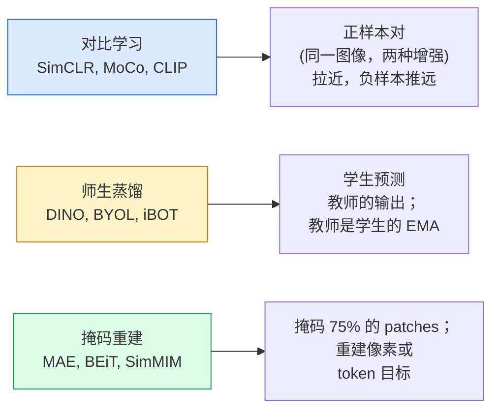

# 自监督视觉 —— SimCLR、DINO、MAE

> 标签是监督视觉的瓶颈。自监督预训练去掉标签：从 1 亿张无标注图像学习视觉特征，在 1 万张带标签图像上微调。

**类型:** Learn + Build
**语言:** Python
**前置要求:** Phase 4 Lesson 04 (图像分类), Phase 4 Lesson 14 (ViT)
**时长:** 约 75 分钟

## 学习目标

- 梳理三大自监督家族——对比学习（SimCLR）、师生蒸馏（DINO）、掩码重建（MAE）——并说出每个的优化目标
- 从零实现 InfoNCE 损失，解释为什么 batch=512 可以但 batch=32 失败
- 解释 MAE 的 75% 掩码比例不是随意设定的，以及它与 BERT 文本 15% 的区别
- 用 DINOv2 或 MAE ImageNet 检查点做线性探测和零样本检索

## 问题背景

有监督 ImageNet 有 130 万张标注图像，标注成本估计约 1000 万美元。医学和工业数据集更小，标注更贵。每个视觉团队都会问：能不能在廉价的无标注数据（YouTube 帧、网页爬取、摄像头画面、卫星扫描）上预训练，然后在少量带标签集上微调？

自监督学习就是答案。在 LAION 或 JFT 上训练的现代自监督 ViT，微调后可达到或超过有监督 ImageNet 准确率。它的下游任务迁移效果（检测、分割、深度估计）也优于有监督预训练。DINOv2（Meta，2023）和 MAE（Meta，2022）是 2026 年可迁移视觉特征的生产默认值。

概念上的转变是：前置任务（训练模型做的事）不必须是下游任务。重要的是它迫使模型学到有用的特征。给灰度图像上色、旋转图像并让模型预测角度、掩码 patches 并重建——这些都奏效过。真正能 scale 的三路方法是：对比学习、师生蒸馏、掩码重建。

## 核心概念

### 三大范式



### 对比学习（SimCLR）

取一张图像，应用两种随机增强，得到两个视图。两者经过同一个编码器加投影头。最小化损失：使"这两个嵌入应该相近"且"该嵌入应该与批次中所有其他图像嵌入远离"。

```
batch 中 2N 个视图的正样本对 (z_i, z_j) 的损失：

   L_ij = -log( exp(sim(z_i, z_j) / tau) / sum_k in batch \ {i} exp(sim(z_i, z_k) / tau) )

sim = 余弦相似度
tau = 温度（标准值 0.1）
```

这就是 InfoNCE 损失。它需要每个正样本有多个负样本，所以 batch 大小很重要——SimCLR 需要 512-8192。MoCo 引入动量队列来解耦负样本数量与 batch 大小。

### 师生蒸馏（DINO）

两个结构相同的网络：学生和教师。教师的权重是学生权重的指数移动平均（EMA）。两者都看到增强后的图像视图。学生的输出被训练为匹配教师的输出——无需显式负样本。

```
loss = CE( student_output(view_1),  teacher_output(view_2) )
     + CE( student_output(view_2),  teacher_output(view_1) )

teacher_weights = m * teacher_weights + (1 - m) * student_weights   (m ≈ 0.996)
```

为什么不崩溃为"预测一个常数"：教师的输出做了中心化（减去每维均值）和锐化（除以小温度）。中心化防止某一维主导；锐化防止输出塌缩为均匀分布。

DINO 是 DINOv2 在 1.42 亿张精选图像上的扩展。所得特征是 2026 年零样本视觉检索和密集预测的当前 SOTA。

### 掩码重建（MAE）

掩码 ViT 输入 75% 的 patches。仅将可见的 25% 送入编码器。小型解码器接收编码器输出加掩码位置的 mask tokens，训练为重建被掩码 patches 的像素。

```
编码器：可见 25% 的 patches -> 特征
解码器：特征 + 掩码位置的 mask tokens -> 重建的像素
损失：仅在被掩码 patches 上计算重建像素与原像素的 MSE
```

让 MAE 有效的关键设计选择：

- **75% 掩码比例** —— 很高。迫使编码器学习语义特征；重建 25% 几乎是小菜一碟（邻像素相关性太强，CNN 就能搞定）。
- **非对称编码器/解码器** —— 大型 ViT 编码器仅看到可见 patches；小型解码器（8 层，512 维）负责重建。比朴素 BEiT 快 3 倍预训练。
- **像素空间重建目标** —— 比 BEiT 的 token 化目标简单，效果也更好。

预训练后丢弃解码器。编码器就是特征提取器。

### 为什么是 75% 而非 15%

BERT 掩码 15% 的 tokens。MAE 掩码 75%。差别在于信息密度。

- 自然语言每 token 熵高。预测 15% 的 tokens 仍然很难，因为每个掩码位置有多种合理补全。
- 图像 patches 熵低——邻域未掩码像素通常几乎精确决定了被掩码 patch 的像素。要让预测需要语义理解，必须激进地掩码。

75% 高到简单空间外推无法解决任务；编码器必须表示图像内容。

### 线性探测评估

自监督预训练后，标准评估是**线性探测**：冻结编码器，在 ImageNet 标签上只训练一个线性分类器。报告 top-1 准确率。

- SimCLR ResNet-50: ~71%（2020）
- DINO ViT-S/16: ~77%（2021）
- MAE ViT-L/16: ~76%（2022）
- DINOv2 ViT-g/14: ~86%（2023）

线性探测是特征质量的纯度量；微调通常额外加 2-5 分，但也混入了头重训练的效应。

## 动手实现

### 步骤 1：双视图增强流水线

```python
import torch
import torchvision.transforms as T

two_view_train = lambda: T.Compose([
    T.RandomResizedCrop(96, scale=(0.2, 1.0)),
    T.RandomHorizontalFlip(),
    T.ColorJitter(0.4, 0.4, 0.4, 0.1),
    T.RandomGrayscale(p=0.2),
    T.ToTensor(),
])


class TwoViewDataset(torch.utils.data.Dataset):
    def __init__(self, base):
        self.base = base
        self.aug = two_view_train()

    def __len__(self):
        return len(self.base)

    def __getitem__(self, i):
        img, _ = self.base[i]
        v1 = self.aug(img)
        v2 = self.aug(img)
        return v1, v2
```

每个 `__getitem__` 返回同一图像的两个增强视图；不需要标签。

### 步骤 2：InfoNCE 损失

```python
import torch.nn.functional as F

def info_nce(z1, z2, tau=0.1):
    """
    z1, z2: (N, D) L2 归一化的配对视图嵌入
    """
    N, D = z1.shape
    z = torch.cat([z1, z2], dim=0)  # (2N, D)
    sim = z @ z.T / tau              # (2N, 2N)

    mask = torch.eye(2 * N, dtype=torch.bool, device=z.device)
    sim = sim.masked_fill(mask, float("-inf"))

    targets = torch.cat([torch.arange(N, 2 * N), torch.arange(0, N)]).to(z.device)
    return F.cross_entropy(sim, targets)
```

调用前先 L2 归一化嵌入。`tau=0.1` 是 SimCLR 默认值；更低则损失更尖锐，需要更多负样本。

### 步骤 3：InfoNCE 合理性检查

```python
z1 = F.normalize(torch.randn(16, 32), dim=-1)
z2 = z1.clone()
loss_same = info_nce(z1, z2, tau=0.1).item()
z2_random = F.normalize(torch.randn(16, 32), dim=-1)
loss_random = info_nce(z1, z2_random, tau=0.1).item()
print(f"InfoNCE with identical pairs:  {loss_same:.3f}")
print(f"InfoNCE with random pairs:     {loss_random:.3f}")
```

完全相同的配对应给出低损失（大 batch、冷温度时接近 0）。随机配对在 batch 为 16-pair 时应给出 `log(2N-1) = log(31) ≈ 3.4`。

### 步骤 4：MAE 风格掩码

```python
def random_mask_indices(num_patches, mask_ratio=0.75, seed=0):
    g = torch.Generator().manual_seed(seed)
    n_keep = int(num_patches * (1 - mask_ratio))
    perm = torch.randperm(num_patches, generator=g)
    visible = perm[:n_keep]
    masked = perm[n_keep:]
    return visible.sort().values, masked.sort().values


num_patches = 196
visible, masked = random_mask_indices(num_patches, mask_ratio=0.75)
print(f"visible: {len(visible)} / {num_patches}")
print(f"masked:  {len(masked)} / {num_patches}")
```

简单、快速、对给定种子确定。真实 MAE 实现会批处理并保留每个样本的掩码。

## 用现成库

2026 年 DINOv2 是生产标准：

```python
import torch
from transformers import AutoImageProcessor, AutoModel

processor = AutoImageProcessor.from_pretrained("facebook/dinov2-base")
model = AutoModel.from_pretrained("facebook/dinov2-base")
model.eval()

# 每图像嵌入，用于零样本检索
with torch.no_grad():
    inputs = processor(images=[pil_image], return_tensors="pt")
    outputs = model(**inputs)
    embedding = outputs.last_hidden_state[:, 0]  # CLS token
```

768 维嵌入是现代图像检索、密集对应、零样本迁移流水线的主干。微调下游任务通常只需要一个线性头。

图文嵌入：SigLIP 或 OpenCLIP；MAE 风格微调：`timm` 仓库提供所有 MAE 检查点。

## 产出

本课产出：

- `outputs/prompt-ssl-pretraining-picker.md` —— 给定数据集大小、算力和下游任务，选择 SimCLR / MAE / DINOv2 的 prompt。
- `outputs/skill-linear-probe-runner.md` —— 对任意冻结编码器 + 带标签数据集写线性探测评估的 skill。

## 练习

1. **(简单)** 验证 InfoNCE 损失在嵌入对齐良好时随温度降低而下降，在随机嵌入时随温度降低而上升。绘制 `tau in [0.05, 0.1, 0.2, 0.5]` vs 损失的关系图。
2. **(中等)** 实现 DINO 风格的 center buffer。展示没有中心化时学生会在几个 epoch 内塌缩为常数向量。
3. **(困难)** 用 Lesson 10 的 TinyUNet 作为 backbone 在 CIFAR-100 上训练 MAE。报告 10、50、200 epochs 时的线性探测准确率。证明 MAE 预训练的线性探测在相同 1000 图像子集上击败从头开始的有监督线性探测。

## 关键术语

| 英文 | 中文 | 实际含义 |
|------|------|---------|
| Self-supervised | 自监督 | 从无标注数据中产生有用表征的前置任务 |
| Pretext task | 前置任务 | SSL 期间使用的目标（重建 patches、匹配视图）；预训练后丢弃 |
| Linear probe | 线性探测 | 标准 SSL 评估：在冻结特征上只训练一个线性分类器 |
| InfoNCE | InfoNCE 损失 | 余弦相似度上的 softmax；正样本对是目标类，其余都是负样本 |
| EMA teacher | EMA 教师 | 权重是学生指数移动平均的教师；用于 BYOL、MoCo、DINO |
| Mask ratio | 掩码比例 | MAE 期间掩码的 patch 比例；视觉 75%，文本 15% |
| Representation collapse | 表征塌缩 | SSL 失败：编码器对所有输入输出常数向量；通过中心化、锐化或负样本防止 |
| DINOv2 | DINOv2 | Meta 2023 年自监督 ViT；2026 年最强的通用图像特征 |

## 延伸阅读

- [SimCLR (Chen et al., 2020)](https://arxiv.org/abs/2002.05709) —— 对比学习基准
- [DINO (Caron et al., 2021)](https://arxiv.org/abs/2104.14294) —— 带动量、中心化、锐化的师生蒸馏
- [MAE (He et al., 2022)](https://arxiv.org/abs/2111.06377) —— ViT 的掩码自编码器预训练
- [DINOv2 (Oquab et al., 2023)](https://arxiv.org/abs/2304.07193) —— 将自监督 ViT scale 到生产特征