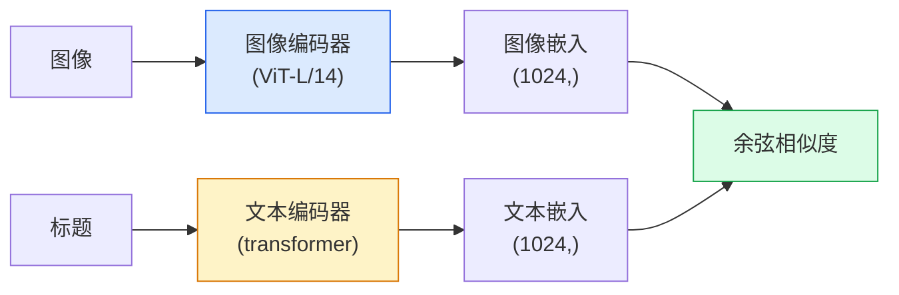

# 开放词汇视觉 —— CLIP

> 训练图像编码器和文本编码器，使匹配的（图像，标题）对落在共享空间的同一点。这就是全部技巧。

**类型:** Build + Use
**语言:** Python
**前置要求:** Phase 4 Lesson 14 (ViT), Phase 4 Lesson 17 (自监督)
**时长:** 约 45 分钟

## 学习目标

- 解释 CLIP 的双塔架构和对比训练目标
- 用预训练 CLIP（或 SigLIP）实现零样本分类，无需任何任务相关训练
- 从零实现零样本分类：编码类别 prompt，计算余弦相似度，取 argmax
- 区分 CLIP、SigLIP、OpenCLIP 和 LLaVA/LLaMA-vision 模型——2026 年各自用在何处

## 问题背景

传统分类器是封闭词汇的：1000 类 ImageNet 模型只能预测 1000 个标签。每个新类别都需要标注数据和重新训练的头。

CLIP（Radford et al., OpenAI 2021）证明在从网页爬取的 4 亿对（图像，标题）上训练，得到的模型可以在推理时用自然语言描述的任意类别集合进行分类。写一句话就能给出新类别。

这就是零样本迁移——2026 年每个现代视觉系统都以 CLIP 家族检查点为起点。检测（Grounding DINO、OWL-ViT）、分割（CLIPSeg、SAM）、检索、内容审核、VLMs、图文生成都在 CLIP 风格的联合嵌入上构建。

## 核心概念

### 双塔架构



两个编码器末端都有线性投影到相同嵌入维度（CLIP-B/32 为 512，CLIP-L/14 为 1024）。L2 归一化后计算余弦相似度。

### 训练目标

给定 N 对（图像，标题）的 batch，构建 NxN 相似度矩阵。训练两个编码器使对角线（匹配的 pairs）相似度高，非对角线（不匹配的）相似度低。

```
sim_matrix = image_embeddings @ text_embeddings.T / tau

loss_i2t = cross_entropy(sim_matrix,       targets=arange(N))
loss_t2i = cross_entropy(sim_matrix.T,     targets=arange(N))
loss = (loss_i2t + loss_t2i) / 2
```

对称的，因为图文双向检索都应该能工作。`tau`（温度）通常作为标量学习，初始化为 0.07。

### SigLIP：更好的损失

SigLIP（Zhai et al., 2023）将 softmax 替换为逐对 sigmoid：

```
loss = 对所有 pairs 平均 log(1 + exp(-y_ij * sim_ij))
y_ij = 匹配则为 +1，否则为 -1
```

逐对损失去掉了 CLIP 所需的 batch 级归一化。SigLIP 在小 batch 时训练更好，数据相同时匹配或超越 CLIP。

### 零样本分类

给定训练好的 CLIP：

1. 对每个类别，组合一个 prompt："a photo of a {class}"（一张 {类别} 的照片）。
2. 用文本编码器编码所有类别 prompt -> `T` shape (C, d)。
3. 编码测试图像 -> `I` shape (1, d)。
4. 相似度 = `I @ T.T` shape (1, C)。
5. Argmax -> 预测类别。

Prompt 工程很重要。OpenAI 为 ImageNet 发布了 80 个 prompt 模板（"a photo of a {}"、"a blurry photo of a {}"、"a sketch of a {}"...）。每个类别的所有模板嵌入取平均可额外提升 1-3% top-1 准确率。

### 2026 年 CLIP 风格模型用在哪

- **零样本分类** —— 直接使用。
- **图像检索** —— 一次性编码所有图像，推理时嵌入查询。
- **文本条件检测** —— Grounding DINO、OWL-ViT 在检测器外包装 CLIP 文本塔。
- **文本条件分割** —— CLIPSeg；SAM 通过 CLIP 接收文本 prompt 输入。
- **VLMs** —— LLaVA、Qwen-VL、InternVL 将 CLIP 家族视觉编码器接入 LLM。
- **图文生成** —— Stable Diffusion、DALL-E 3 以 CLIP 文本嵌入为条件。

一旦有了共享嵌入空间，每个视觉+语言任务都变成距离计算。

## 动手实现

### 步骤 1：小型双塔模型

真实 CLIP 是 ViT + transformer。本课两个塔是在预提取特征上的小型 MLP，使训练信号在 CPU 上可见。

```python
import torch
import torch.nn as nn
import torch.nn.functional as F


class TwoTower(nn.Module):
    def __init__(self, img_in=128, txt_in=64, emb=64):
        super().__init__()
        self.image_proj = nn.Sequential(nn.Linear(img_in, 128), nn.ReLU(), nn.Linear(128, emb))
        self.text_proj = nn.Sequential(nn.Linear(txt_in, 128), nn.ReLU(), nn.Linear(128, emb))
        self.logit_scale = nn.Parameter(torch.ones([]) * 2.6592)  # ln(1/0.07)

    def forward(self, img_feats, txt_feats):
        i = F.normalize(self.image_proj(img_feats), dim=-1)
        t = F.normalize(self.text_proj(txt_feats), dim=-1)
        return i, t, self.logit_scale.exp()
```

两个投影，共享维度输出，可学习温度。与真实 CLIP API 形状相同。

### 步骤 2：对比损失

```python
def clip_loss(image_emb, text_emb, logit_scale):
    N = image_emb.size(0)
    sim = logit_scale * image_emb @ text_emb.T
    targets = torch.arange(N, device=sim.device)
    l_i = F.cross_entropy(sim, targets)
    l_t = F.cross_entropy(sim.T, targets)
    return (l_i + l_t) / 2
```

对称的。logit_scale 越高，softmax 越尖锐，越自信，但有不稳定风险。

### 步骤 3：零样本分类器

```python
@torch.no_grad()
def zero_shot_classify(model, image_feats, class_text_feats, class_names):
    """
    image_feats:      (N, img_in)
    class_text_feats: (C, txt_in)   每个类别取平均的一个嵌入
    """
    i = F.normalize(model.image_proj(image_feats), dim=-1)
    t = F.normalize(model.text_proj(class_text_feats), dim=-1)
    sim = i @ t.T
    pred = sim.argmax(dim=-1)
    return [class_names[p] for p in pred.tolist()]
```

每步一行。这就是在生产 CLIP 检查点中使用的零样本流程。

### 步骤 4：合理性检查

```python
torch.manual_seed(0)
model = TwoTower()

img = torch.randn(8, 128)
txt = torch.randn(8, 64)
i, t, scale = model(img, txt)
loss = clip_loss(i, t, scale)
print(f"batch size: {i.size(0)}   loss: {loss.item():.3f}")
```

损失应接近 `log(N) = log(8) = 2.08`——随机初始化的模型在还没学到任何结构时的对称交叉熵目标。

## 用现成库

OpenCLIP 是 2026 年社区默认值：

```python
import open_clip
import torch
from PIL import Image

model, _, preprocess = open_clip.create_model_and_transforms("ViT-B-32", pretrained="laion2b_s34b_b79k")
tokenizer = open_clip.get_tokenizer("ViT-B-32")

image = preprocess(Image.open("dog.jpg")).unsqueeze(0)
text = tokenizer(["a photo of a dog", "a photo of a cat", "a photo of a car"])

with torch.no_grad():
    image_features = model.encode_image(image)
    text_features = model.encode_text(text)
    image_features = image_features / image_features.norm(dim=-1, keepdim=True)
    text_features = text_features / text_features.norm(dim=-1, keepdim=True)
    probs = (100.0 * image_features @ text_features.T).softmax(dim=-1)

print(probs)
```

SigLIP 是更新版本，小规模下训练更好，新工作推荐：`google/siglip-base-patch16-224`。Hugging Face 同时支持两者。

## 产出

本课产出：

- `outputs/prompt-zero-shot-class-picker.md` —— 给定类别列表和领域，设计零样本 CLIP 类别模板的 prompt。
- `outputs/skill-image-text-retriever.md` —— 用任意 CLIP 检查点构建图像嵌入索引，支持文本查询和图像查询。

## 练习

1. **(简单)** 用预训练 OpenCLIP ViT-B/32 在 CIFAR-10 上做零样本分类，使用 80-template prompt 集。报告 top-1 准确率；应约在 85-90%。
2. **(中等)** 在同一 CIFAR-10 任务上比较单模板（"a photo of a {}"）与 80 模板平均嵌入。量化差距并解释模板为什么有帮助。
3. **(困难)** 构建零样本图像检索索引：用 CLIP 嵌入 1000 张图像，构建 FAISS 索引，用自然语言描述查询。报告 20 个手写查询的 recall@5。

## 关键术语

| 英文 | 中文 | 实际含义 |
|------|------|---------|
| Two-tower | 双塔 | 分离的图像和文本编码器，末端有共享维度的投影头 |
| Zero-shot | 零样本 | 仅在推理时用文本描述的类别进行分类；不接触任何标签 |
| Temperature / logit_scale | 温度 / logit_scale | 学习标量，在 softmax 前缩放相似度矩阵 |
| Prompt template | Prompt 模板 | 类别名称的自然语言包装；平均多个模板可提升零样本准确率 |
| CLIP | CLIP | OpenAI 2021 年模型；2026 年领域词汇 |
| SigLIP | SigLIP | 将 softmax 替换为逐对 sigmoid；小 batch 训练更好 |
| OpenCLIP | OpenCLIP | 社区在 LAION 上训练的 CLIP 变体；开源流水线的生产默认值 |
| VLM | 视觉-语言模型 | CLIP 家族编码器加 LLM，训练用于回答图像相关问题 |

## 延伸阅读

- [CLIP: Learning Transferable Visual Models from Natural Language Supervision (Radford et al., 2021)](https://arxiv.org/abs/2103.00020)
- [SigLIP: Sigmoid Loss for Language-Image Pre-Training (Zhai et al., 2023)](https://arxiv.org/abs/2303.15343)
- [OpenCLIP](https://github.com/mlfoundations/open_clip) —— 社区代码库
- [DINOv2 vs CLIP vs MAE: a features comparison](https://huggingface.co/blog/dinov2) —— HF 指南，含各任务用例横向比较