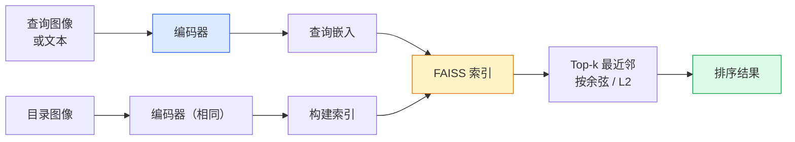

# 图像检索与度量学习

> 检索系统用嵌入空间中距离对候选排序。度量学习是塑造该空间使距离反映你所愿的学科。

**类型:** Build
**语言:** Python
**前置要求:** Phase 4 Lesson 14 (ViT), Phase 4 Lesson 18 (CLIP)
**时长:** 约 45 分钟

## 学习目标

- 解释三元组、对比和代理三类度量学习损失，为给定数据集选择正确的损失
- 正确实现 L2 归一化和余弦相似度，审计"同条目"与"同类"检索的差异
- 构建 FAISS 索引，通过文本和图像查询，报告留出查询集的 recall@K
- 用 DINOv2、CLIP、SigLIP 作为现成嵌入骨架，知道各自何时胜出

## 问题背景

检索在产品视觉中无处不在：重复检测、以图搜图、视觉搜索（"找相似商品"）、人脸重识别、行人重ID（监控）、电商实例匹配。产品的核心问题总是一样的："给定这个查询图像，给我的目录排序。"

两个设计决策决定整个系统。嵌入——什么模型产生向量。索引——如何大规模找最近邻。2026 年两者都是commodity（DINOv2 做嵌入，FAISS 做索引），这提高了门槛：难点在于为你的应用定义*什么是相似的*，然后塑造嵌入空间使距离匹配。

这就是度量学习。一个小而高效的学科。

## 核心概念

### 检索全览



### 四类损失

| 损失 | 需要 | 优点 | 缺点 |
|------|------|------|------|
| **对比损失** | (anchor, positive) + 负样本 | 简单，任意配对标签都能用 | 负样本不够时收敛慢 |
| **三元组损失** | (anchor, positive, negative) | 直观；直接控制间隔 | 困难三元组挖掘成本高 |
| **NT-Xent / InfoNCE** | 配对 + batch挖掘负样本 | 能 scale 到大 batch | 需要大 batch 或动量队列 |
| **代理损失（ProxyNCA）** | 仅类别标签 | 快、稳定、无需挖掘 | 小数据集上可能对代理过拟合 |

大多数产品用例，从预训练 backbone 开始，只有现成嵌入在测试集上表现不佳时才加度量学习微调。

### 三元组损失的形式化

```
L = max(0, ||f(a) - f(p)||^2 - ||f(a) - f(n)||^2 + margin)
```

将 anchor `a` 与 positive `p` 拉近，与 negative `n` 推远，用 `margin` 确保间隙。三个图像的结构泛化到任意相似性排序。

挖掘很重要：简单三元组（`n` 已经离 `a` 很远）对损失贡献为 0；只有困难三元组才能教网络。半困难挖掘（`n` 比 `p` 远但在 margin 内）是 2016 年 FaceNet 配方，至今仍占主导。

### 余弦相似度 vs L2

两个指标，两种约定：

- **余弦**：向量夹角。需要 L2 归一化的嵌入。
- **L2**：欧氏距离。适用于原始或归一化嵌入，但通常搭配 L2 归一化 + 平方 L2 使用。

对大多数现代网络两者等价：当 `||a|| = ||b|| = 1` 时，`||a - b||^2 = 2 - 2 cos(a, b)`。选择与嵌入训练相同的约定；混用会悄悄改变"最近"的含义。

### Recall@K

标准检索指标：

```
recall@K = 查询中至少有一个正确匹配在前 K 结果中的比例
```

并排报告 recall@1、@5、@10。recall@10 高于 0.95 但 recall@1 低于 0.5 意味着嵌入空间结构正确但排序有噪声——尝试更长的微调或重排步骤。

重复检测中 precision@K 更重要，因为每个误报都是用户可见的错误。视觉搜索中 recall@K 是产品信号。

### FAISS 一段

Facebook AI Similarity Search。最近邻搜索的事实标准库。三种索引选择：

- `IndexFlatIP` / `IndexFlatL2` —— 暴力搜索，精确，无训练。最多约 100 万向量。
- `IndexIVFFlat` —— 分成 K 个单元，只搜索最近几个单元。近似，快速，需训练数据。
- `IndexHNSW` —— 基于图，最适合多查询，大索引体积。

10 万向量可能要用 `IndexFlatIP` + 余弦相似度。1000 万向量用 `IndexIVFFlat`。1 亿以上配合乘积量化（`IndexIVFPQ`）。

### 实例级 vs 类别级检索

同名下的两个截然不同问题：

- **类别级** —— "在目录里找猫"。类别条件相似；现成 CLIP/DINOv2 嵌入效果良好。
- **实例级** —— "在目录里找*这 exact 产品*"。需要同类视觉相似物体的细粒度区分；现成嵌入表现不佳；度量学习微调有意义。

选择模型前先明确是哪种。

## 动手实现

### 步骤 1：三元组损失

```python
import torch
import torch.nn.functional as F

def triplet_loss(anchor, positive, negative, margin=0.2):
    d_ap = F.pairwise_distance(anchor, positive, p=2)
    d_an = F.pairwise_distance(anchor, negative, p=2)
    return F.relu(d_ap - d_an + margin).mean()
```

一行。在 L2 归一化或原始嵌入上都可用。

### 步骤 2：半困难挖掘

给定一批嵌入和标签，找每个 anchor 最难的半困难负样本。

```python
def semi_hard_negatives(emb, labels, margin=0.2):
    dist = torch.cdist(emb, emb)
    same_class = labels[:, None] == labels[None, :]
    diff_class = ~same_class
    N = emb.size(0)

    positives = dist.clone()
    positives[~same_class] = float("-inf")
    positives.fill_diagonal_(float("-inf"))
    pos_idx = positives.argmax(dim=1)

    semi_hard = dist.clone()
    semi_hard[same_class] = float("inf")
    d_ap = dist[torch.arange(N), pos_idx].unsqueeze(1)
    semi_hard[dist <= d_ap] = float("inf")
    neg_idx = semi_hard.argmin(dim=1)

    fallback_mask = semi_hard[torch.arange(N), neg_idx] == float("inf")
    if fallback_mask.any():
        hardest = dist.clone()
        hardest[same_class] = float("inf")
        neg_idx = torch.where(fallback_mask, hardest.argmin(dim=1), neg_idx)
    return pos_idx, neg_idx
```

每个 anchor 获得类内最难的正样本和比正样本远但又在 margin 内的半困难负样本。

### 步骤 3：Recall@K

```python
def recall_at_k(query_emb, gallery_emb, query_labels, gallery_labels, k=1):
    sim = query_emb @ gallery_emb.T
    _, top_k = sim.topk(k, dim=-1)
    matches = (gallery_labels[top_k] == query_labels[:, None]).any(dim=-1)
    return matches.float().mean().item()
```

L2 归一化嵌入的 top-k 内积等价于 top-k 余弦。报告有至少一个正确邻居的查询的平均比例。

### 步骤 4：组装

```python
import torch
import torch.nn as nn
from torch.optim import Adam

class Encoder(nn.Module):
    def __init__(self, in_dim=128, emb_dim=64):
        super().__init__()
        self.net = nn.Sequential(
            nn.Linear(in_dim, 128), nn.ReLU(),
            nn.Linear(128, emb_dim),
        )

    def forward(self, x):
        return F.normalize(self.net(x), dim=-1)

torch.manual_seed(0)
num_classes = 6
protos = F.normalize(torch.randn(num_classes, 128), dim=-1)

def sample_batch(bs=32):
    labels = torch.randint(0, num_classes, (bs,))
    x = protos[labels] + 0.15 * torch.randn(bs, 128)
    return x, labels

enc = Encoder()
opt = Adam(enc.parameters(), lr=3e-3)

for step in range(200):
    x, y = sample_batch(32)
    emb = enc(x)
    pos_idx, neg_idx = semi_hard_negatives(emb, y)
    loss = triplet_loss(emb, emb[pos_idx], emb[neg_idx])
    opt.zero_grad(); loss.backward(); opt.step()
```

几百步后嵌入聚类形成每类一个簇。

## 用现成库

2026 年生产栈：

- **DINOv2 + FAISS** —— 通用视觉检索。开箱即用。
- **CLIP + FAISS** —— 查询是文本时用。
- **微调 DINOv2 + FAISS** —— 实例级检索、人脸重ID、时尚、电商。
- **Milvus / Weaviate / Qdrant** —— 托管向量数据库，底层封装 FAISS 或 HNSW。

SOTA 实例检索配方：DINOv2 主干，加嵌入头，在实例标注对上用三元组或 InfoNCE 损失微调，FAISS 建索引。

## 产出

本课产出：

- `outputs/prompt-retrieval-loss-picker.md` —— 给定检索问题，选择三元组 / InfoNCE / ProxyNCA 的 prompt。
- `outputs/skill-recall-at-k-runner.md` —— 写干净 recall@K 评估框架的 skill，含 train/val/gallery 分割和正确数据契约。

## 练习

1. **(简单)** 运行上面的玩具示例。训练前后用 PCA 绘图，看六个簇如何形成。
2. **(中等)** 添加 ProxyNCA 损失实现：每类一个可学习"代理"，在余弦相似度上用标准交叉熵。与三元组损失在玩具数据上比较收敛速度。
3. **(困难)** 取 ImageNet 验证集 1000 张图像，用 HuggingFace 通过 DINOv2 嵌入，构建 FAISS flat 索引，对相同图像（应为 1.0）和用 ImageNet 标签作真值的留出分割报告 recall@{1,5,10}。

## 关键术语

| 英文 | 中文 | 实际含义 |
|------|------|---------|
| Metric learning | 度量学习 | 训练编码器使其输出空间的距离反映目标相似性 |
| Triplet loss | 三元组损失 | L = max(0, d(a, p) - d(a, n) + margin)；度量学习标准损失 |
| Semi-hard mining | 半困难挖掘 | 比 anchor 的正样本远但又在 margin 内的负样本；经验上信息量最大 |
| Proxy-based loss | 代理损失 | 每类一个可学习代理；在代理相似度上用交叉熵；无需配对挖掘 |
| Recall@K | Recall@K | 查询中有至少一个正确结果在前 K 中的比例 |
| Instance retrieval | 实例检索 | 细粒度匹配；现成特征通常表现不佳 |
| FAISS | FAISS | Facebook 的最近邻库；支持精确和近似索引 |
| HNSW | HNSW | 分层可导航小世界；小内存开销的快速近似 NN |

## 延伸阅读

- [FaceNet: A Unified Embedding for Face Recognition (Schroff et al., 2015)](https://arxiv.org/abs/1503.03832) —— 三元组损失 / 半困难挖掘论文
- [In Defense of the Triplet Loss for Person Re-Identification (Hermans et al., 2017)](https://arxiv.org/abs/1703.07737) —— 三元组微调实践指南
- [FAISS documentation](https://github.com/facebookresearch/faiss/wiki) —— 每种索引及其权衡
- [SMoT: Metric Learning Taxonomy (Kim et al., 2021)](https://arxiv.org/abs/2010.06927) —— 现代损失及其联系综述