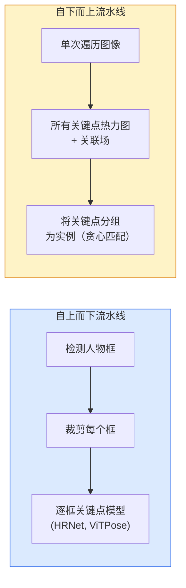

# 关键点检测与姿态估计

> 姿态是一组有序的关键点。关键点检测器是热力图回归器。其余都是琐碎的事务性工作。

**类型:** Build
**语言:** Python
**前置要求:** Phase 4 Lesson 06 (检测), Phase 4 Lesson 07 (U-Net)
**时长:** 约 45 分钟

## 学习目标

- 区分自上而下和自下而上姿态估计，说出各自适用场景
- 用每个关键点一个高斯目标回归 K 个关键点的热力图，并在推理时提取关键点坐标
- 解释部位亲和场（PAFs）以及自下而上流水线如何将关键点关联到实例
- 使用 MediaPipe Pose 或 MMPose 做产品级关键点估计，理解其输出格式

## 问题背景

关键点任务有很多名字：人体姿态（17 个身体关节）、人脸关键点（68 或 478 点）、手势（21 点）、动物姿态、机械物体姿态、医学解剖标志。每一个都有相同结构：检测物体上的 K 个离散点，输出其 (x, y) 坐标。

姿态估计是动作捕捉、健身应用、体育分析、手势控制、动画、AR 试穿、机器人抓取的基础。2D 情况已成熟；3D 姿态（从单个相机估计世界坐标中的关节位置）是当前研究前沿。

工程问题是扩展。单图像单人姿态是 20ms 的问题。人群场景 30fps 多人姿态是不同架构的不同问题。

## 核心概念

### 自上而下 vs 自下而上



- **自上而下** —— 先检测人，再在每个人crop上跑逐人关键点模型。最高准确率；随人数线性增长。
- **自下而上** —— 一次前向传播预测所有关键点加关联场；分组。常数时间，不随人群规模变化。

自上而下（HRNet、ViTPose）是准确率leader；自下而上（OpenPose、HigherHRNet）是拥挤场景吞吐量leader。

### 热力图回归

不直接回归 `(x, y)`，而是对每个关键点预测一个 HxW 热力图，热力图上在高斯 blob 中心为真实位置。

```
target[k, y, x] = exp(-((x - cx_k)^2 + (y - cy_k)^2) / (2 sigma^2))
```

推理时，每个热力图的 argmax 就是预测的关键点位置。

热力图比直接回归效果更好的原因：网络的空间结构（卷积特征图）与空间输出自然对齐。高斯目标也有正则化效果——小定位误差产生小损失，而非零。

### 子像素定位

Argmax 给整数坐标。要子像素精度，在 argmax 及其邻域上拟合抛物线，或用已知偏移量 `(dx, dy) = 0.25 * (heatmap[y, x+1] - heatmap[y, x-1], ...)` 方向。

### 部位亲和场（PAFs）

OpenPose 的自下而上关联技巧。对每对有关联的关键点（如左肩到左肘），预测一个 2 通道场，编码从一端指向另一端的单位向量。要将肩与其肘关联，在候选对连线上对PAF做线积分；积分最高的候选对就是匹配。

```
对每个连接（肢体）：
  PAF 通道：2（单位向量 x, y）
  线积分：沿采样点对 (PAF . line_direction) 求和
  积分越高 = 匹配越强
```

优雅，scale 到任意人群规模，无需逐人crop。

### COCO 关键点

标准人体姿态数据集：每人 17 个关键点，用 PCK（正确关键点百分比）和 OKS（物体关键点相似度）作为指标。OKS 是关键点版的 IoU，也是 COCO mAP@OKS 报告的指标。

### 2D vs 3D

- **2D 姿态** —— 图像坐标；已产品化（MediaPipe、HRNet、ViTPose）。
- **3D 姿态** —— 世界/相机坐标；仍是活跃研究。常见方法：
  - 用小型 MLP 将 2D 预测 lift 到 3D（VideoPose3D）。
  - 从图像直接 3D 回归（PyMAF、MHFormer）。
  - 多视角设置（CMU Panoptic）获取真值。

## 动手实现

### 步骤 1：高斯热力图目标

```python
import numpy as np
import torch

def gaussian_heatmap(size, cx, cy, sigma=2.0):
    yy, xx = np.meshgrid(np.arange(size), np.arange(size), indexing="ij")
    return np.exp(-((xx - cx) ** 2 + (yy - cy) ** 2) / (2 * sigma ** 2)).astype(np.float32)

hm = gaussian_heatmap(64, 32, 32, sigma=2.0)
print(f"peak: {hm.max():.3f} at ({hm.argmax() % 64}, {hm.argmax() // 64})")
```

沿通道轴堆叠每个关键点热力图得到完整目标张量。

### 步骤 2：微型关键点头

U-Net 风格的模型，输出 K 个热力图通道。

```python
import torch.nn as nn
import torch.nn.functional as F

class TinyKeypointNet(nn.Module):
    def __init__(self, num_keypoints=4, base=16):
        super().__init__()
        self.down1 = nn.Sequential(nn.Conv2d(3, base, 3, 2, 1), nn.ReLU(inplace=True))
        self.down2 = nn.Sequential(nn.Conv2d(base, base * 2, 3, 2, 1), nn.ReLU(inplace=True))
        self.mid = nn.Sequential(nn.Conv2d(base * 2, base * 2, 3, 1, 1), nn.ReLU(inplace=True))
        self.up1 = nn.ConvTranspose2d(base * 2, base, 2, 2)
        self.up2 = nn.ConvTranspose2d(base, num_keypoints, 2, 2)

    def forward(self, x):
        h1 = self.down1(x)
        h2 = self.down2(h1)
        h3 = self.mid(h2)
        u1 = self.up1(h3)
        return self.up2(u1)
```

输入 `(N, 3, H, W)`，输出 `(N, K, H, W)`。损失是对高斯目标的逐像素 MSE。

### 步骤 3：推理——提取关键点坐标

```python
def heatmap_to_coords(heatmaps):
    """
    heatmaps: (N, K, H, W)
    returns:  (N, K, 2) float image pixels 中的坐标
    """
    N, K, H, W = heatmaps.shape
    hm = heatmaps.reshape(N, K, -1)
    idx = hm.argmax(dim=-1)
    ys = (idx // W).float()
    xs = (idx % W).float()
    return torch.stack([xs, ys], dim=-1)

coords = heatmap_to_coords(torch.randn(2, 4, 32, 32))
print(f"coords: {coords.shape}")  # (2, 4, 2)
```

推理只需一行。子像素精调：在 argmax 附近插值。

### 步骤 4：合成关键点数据集

简单：白底画四个点，学着预测它们。

```python
def make_synthetic_sample(size=64):
    img = np.ones((3, size, size), dtype=np.float32)
    rng = np.random.default_rng()
    kps = rng.integers(8, size - 8, size=(4, 2))
    for cx, cy in kps:
        img[:, cy - 2:cy + 2, cx - 2:cx + 2] = 0.0
    hms = np.stack([gaussian_heatmap(size, cx, cy) for cx, cy in kps])
    return img, hms, kps
```

小到模型一分钟就能学会。

### 步骤 5：训练

```python
model = TinyKeypointNet(num_keypoints=4)
opt = torch.optim.Adam(model.parameters(), lr=3e-3)

for step in range(200):
    batch = [make_synthetic_sample() for _ in range(16)]
    imgs = torch.from_numpy(np.stack([b[0] for b in batch]))
    hms = torch.from_numpy(np.stack([b[1] for b in batch]))
    pred = model(imgs)
    # 上采样 pred 到完整分辨率
    pred = F.interpolate(pred, size=hms.shape[-2:], mode="bilinear", align_corners=False)
    loss = F.mse_loss(pred, hms)
    opt.zero_grad(); loss.backward(); opt.step()
```

## 用现成库

- **MediaPipe Pose** —— Google 的产品级姿态估计器；带 WebGL + 移动端运行时，延迟低于 10ms。
- **MMPose**（OpenMMLab）—— 综合研究代码库；每个 SOTA 架构带预训练权重。
- **YOLOv8-pose** —— 单次前向pass最快实时多人姿态。
- **Transformers HumanDPT / PoseAnything** —— 更新颖的视觉-语言方法，支持开放词汇姿态（任意物体、任意关键点集）。

## 产出

本课产出：

- `outputs/prompt-pose-stack-picker.md` —— 给定延迟、人群规模和 2D vs 3D 需求，选择 MediaPipe / YOLOv8-pose / HRNet / ViTPose 的 prompt。
- `outputs/skill-heatmap-to-coords.md` —— 写每个产品级姿态模型使用的子像素热力图转坐标例程的 skill。

## 练习

1. **(简单)** 在合成 4 点数据集上训练微型关键点模型。报告 200 步后预测与真实关键点之间的平均 L2 误差。
2. **(中等)** 添加子像素精调：在 argmax 位置，沿 x 和 y 从邻像素拟合 1D 抛物线。报告相对整数 argmax 的精度增益。
3. **(困难)** 构建 2 人合成数据集，每张图显示两个 4 关键点模式实例。训练带 PAF 的自下而上流水线，预测每个关键点属于哪个实例，并评估 OKS。

## 关键术语

| 英文 | 中文 | 实际含义 |
|------|------|---------|
| Keypoint | 关键点 | 物体上特定有序点（关节、角点、特征点） |
| Pose | 姿态 | 属于同一实例的一组有序关键点 |
| Top-down | 自上而下 | 两阶段流水线：人体检测器 + 逐crop关键点模型；最高准确率 |
| Bottom-up | 自下而上 | 单次预测所有关键点再分组；时间复杂度不随人群规模变化 |
| Heatmap | 热力图 | 每关键点一个 HxW 张量，在真实位置有峰值；偏好的回归目标 |
| PAF | 部位亲和场 | 编码肢体方向的 2 通道单位向量场；用于将关键点分组为实例 |
| OKS | OKS | 物体关键点相似度；COCO 姿态估计指标 |
| HRNet | HRNet | 高分辨率网络；主导的自上而下关键点架构；全程保持高分辨率特征 |

## 延伸阅读

- [OpenPose (Cao et al., 2017)](https://arxiv.org/abs/1812.08008) —— 带 PAF 的自下而上；方法论仍是最佳阐述
- [HRNet (Sun et al., 2019)](https://arxiv.org/abs/1902.09212) —— 自上而下基准架构
- [ViTPose (Xu et al., 2022)](https://arxiv.org/abs/2204.12484) —— 纯 ViT 作为姿态 backbone；在多个基准上当前 SOTA
- [MediaPipe Pose](https://developers.google.com/mediapipe/solutions/vision/pose_landmarker) —— 产品级实时姿态；2026 年部署最快的栈