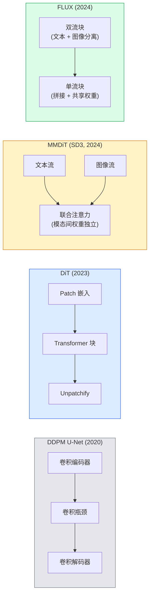

# 扩散 Transformer 与整流流

> U-Net 不是扩散的秘密。用 Transformer 替换它，把噪声调度换成直线流，突然间你就有了 SD3、FLUX 和每一个 2026 年的文生图模型。

**类型:** 学习 + 动手实现
**语言:** Python
**前置要求:** Phase 4 Lesson 10 (DDPM 扩散)、Phase 4 Lesson 14 (ViT)、Phase 7 Lesson 02 (自注意力)
**时间:** ~75 分钟

## 学习目标

- 追踪从 U-Net DDPM（Lesson 10）到 DiT、MMDiT（SD3）和单+双流 DiT（FLUX）的演进
- 解释整流流：为什么从噪声到数据的直线轨迹让模型可以用 20 步采样而非 1000 步
- 实现一个微型 DiT 块和整流流训练循环，均在 100 行以内
- 通过架构、参数量和许可区分模型变体（SD3、FLUX.1-dev、FLUX.1-schnell、Z-Image、Qwen-Image）

## 问题

Lesson 10 构建了一个带 U-Net 去噪器的 DDPM。那个配方在 2020-2023 年占主导：U-Net + beta 调度 + 噪声预测损失。它产出了 Stable Diffusion 1.5 和 2.1 以及 DALL-E 2。

每一个 2026 年最先进的文生图模型都已超越它。Stable Diffusion 3、FLUX、SD4、Z-Image、Qwen-Image、Hunyuan-Image——都不再使用 U-Net。它们使用扩散 Transformer（DiT）。SD3 和 FLUX 还把 DDPM 噪声调度换成了整流流，将噪声到数据的路径拉直，使 1-4 步推理成为可能（通过一致性或蒸馏变体）。

这一转变很重要，因为它正是扩散图像生成变得可控、提示准确（SD3/SD4 解决了文字渲染）和生产快速的原因。理解 DiT + 整流流就是理解 2026 年生成图像技术栈。

## 概念

### 从 U-Net 到 Transformer



- **DiT**（Peebles & Xie, 2023）——用类 ViT 的 Transformer 替换 U-Net，处理潜在 patch。条件化通过自适应层归一化（AdaLN）。
- **MMDiT**（SD3，Esser et al., 2024）——两个流，文本和图像 token 权重独立，共享一个联合自注意力。
- **FLUX**（Black Forest Labs，2024）——前 N 个块双流（与 SD3 类似），后面的块拼接并共享权重（单流），以在更高深度提高效率。
- **Z-Image**（2025）——一个高效的 6B 参数单流 DiT，挑战"不惜一切代价扩大规模"的做法。

### 整流流一段话

DDPM 将前向过程定义为噪声 SDE，其中 `x_t` 越来越被破坏。学习到的反向是第二个 SDE，通过 1000 小步求解。

整流流定义从干净数据到纯噪声的**直线**插值：

```
x_t = (1 - t) * x_0 + t * epsilon,     t in [0, 1]
```

训练网络预测速度 `v_theta(x_t, t) = epsilon - x_0`——沿从干净数据到噪声的直线路径的前进方向（`dx_t/dt`）。采样时，积分这个速度从噪声向后步进到数据。得到的 ODE 更接近直线，因此采样所需积分步数大大减少。

SD3 称之为 **整流流匹配**。FLUX、Z-Image 和大多数 2026 年模型使用相同的目标。典型推理：20-30 步 Euler（确定性）vs 旧 DDPM 体制的 50+ DDIM 步。蒸馏 / turbo / schnell / LCM 变体降至 1-4 步。

### AdaLN 条件化

DiT 通过**自适应层归一化**对时间步和类别/文本进行条件化：从条件向量预测 `scale` 和 `shift`，然后在 LayerNorm 之后应用。比 U-Net 中的 FiLM 风格调制更简洁，是每个现代 DiT 的默认选择。

```
cond -> MLP -> (scale, shift, gate)
norm(x) * (1 + scale) + shift，然后残差加 * gate
```

### SD3 和 FLUX 中的文本编码器

- **SD3** 使用三个文本编码器：两个 CLIP 模型 + T5-XXL。嵌入拼接后作为文本条件输入图像流。
- **FLUX** 使用一个 CLIP-L + T5-XXL。
- **Qwen-Image / Z-Image** 变体使用与各自基础 LLM 对齐的自研文本编码器。

文本编码器是 SD3/FLUX 比 SD1.5 更好地理解提示的重要原因。仅 T5-XXL 就有 4.7B 参数。

### 无分类器引导仍然有效

整流流改变了采样器，没有改变条件化。无分类器引导（在训练时以 10% 概率丢弃文本，推理时混合条件和非条件预测）在整流流上效果完全相同。大多数 2026 年模型使用引导尺度 3.5-5——低于 SD1.5 的 7.5，因为整流流模型默认更严格地遵循提示。

### 一致性、Turbo、Schnell、LCM

四个名字，同一个思想：将一个慢速多步模型蒸馏成一个快速少步模型。

- **LCM（潜在一致性模型）**——训练一个学生模型，从任意中间 `x_t` 在一步内预测最终 `x_0`。
- **SDXL Turbo / FLUX schnell**——通过对抗扩散蒸馏训练 1-4 步模型。
- **SD Turbo**——OpenAI 风格的一致性模型，适配到潜在扩散。

任何新模型的生产服务同时发布"全质量"检查点和"turbo / schnell"变体。Schnell（德语"快速"，Black Forest Labs 的约定）以 1-4 步运行，适合实时流水线。

### 2026 年模型格局

| 模型 | 规模 | 架构 | 许可 |
|------|------|------|------|
| Stable Diffusion 3 Medium | 2B | MMDiT | SAI Community |
| Stable Diffusion 3.5 Large | 8B | MMDiT | SAI Community |
| FLUX.1-dev | 12B | 双流 + 单流 DiT | 非商业 |
| FLUX.1-schnell | 12B | 同上，蒸馏 | Apache 2.0 |
| FLUX.2 | — | 迭代 FLUX.1 | 混合 |
| Z-Image | 6B | S3-DiT（可扩展单流） | 宽松 |
| Qwen-Image | ~20B | DiT + Qwen 文本塔 | Apache 2.0 |
| Hunyuan-Image-3.0 | ~80B | DiT | 研究 |
| SD4 Turbo | 3B | DiT + 蒸馏 | SAI Commercial |

FLUX.1-schnell 是 2026 年开源默认。Z-Image 是效率领导者。FLUX.2 和 SD4 是当前质量顶尖。

### 为什么这一相位转变很重要

DDPM + U-Net 有用。DiT + 整流流**更好、更快、更易扩展**。这一转变类似于 NLP 中从 RNN 到 Transformer：两个架构解决同一问题，但 Transformer 可扩展，现在占据主导。每一篇 2026 年关于图像、视频或 3D 生成的论文都使用 DiT 形状的去噪器，通常使用整流流目标。U-Net DDPM 现在主要是教学用（Lesson 10）。

## 动手实现

### 步骤 1：一个带 AdaLN 的 DiT 块

```python
import torch
import torch.nn as nn


class AdaLNZero(nn.Module):
    """
    带门的自适应层归一化。根据条件预测（scale, shift, gate）。
    初始化使整个块作为恒等映射（"zero init"）。
    """

    def __init__(self, dim, cond_dim):
        super().__init__()
        self.norm = nn.LayerNorm(dim, elementwise_affine=False)
        self.mlp = nn.Linear(cond_dim, dim * 3)
        nn.init.zeros_(self.mlp.weight)
        nn.init.zeros_(self.mlp.bias)

    def forward(self, x, cond):
        scale, shift, gate = self.mlp(cond).chunk(3, dim=-1)
        h = self.norm(x) * (1 + scale.unsqueeze(1)) + shift.unsqueeze(1)
        return h, gate.unsqueeze(1)


class DiTBlock(nn.Module):
    def __init__(self, dim=192, heads=3, mlp_ratio=4, cond_dim=192):
        super().__init__()
        self.adaln1 = AdaLNZero(dim, cond_dim)
        self.attn = nn.MultiheadAttention(dim, heads, batch_first=True)
        self.adaln2 = AdaLNZero(dim, cond_dim)
        self.mlp = nn.Sequential(
            nn.Linear(dim, dim * mlp_ratio),
            nn.GELU(),
            nn.Linear(dim * mlp_ratio, dim),
        )

    def forward(self, x, cond):
        h, gate1 = self.adaln1(x, cond)
        a, _ = self.attn(h, h, h, need_weights=False)
        x = x + gate1 * a
        h, gate2 = self.adaln2(x, cond)
        x = x + gate2 * self.mlp(h)
        return x
```

`AdaLNZero` 初始化为恒等映射，因为它的 MLP 权重初始化为零。训练推动块偏离恒等映射；这大大稳定了深度 Transformer 扩散模型。

### 步骤 2：一个微型 DiT

```python
def timestep_embedding(t, dim):
    import math
    half = dim // 2
    freqs = torch.exp(-math.log(10000) * torch.arange(half, device=t.device) / half)
    args = t[:, None].float() * freqs[None]
    return torch.cat([args.sin(), args.cos()], dim=-1)


class TinyDiT(nn.Module):
    def __init__(self, image_size=16, patch_size=2, in_channels=3, dim=96, depth=4, heads=3):
        super().__init__()
        self.patch_size = patch_size
        self.num_patches = (image_size // patch_size) ** 2
        self.patch = nn.Conv2d(in_channels, dim, kernel_size=patch_size, stride=patch_size)
        self.pos = nn.Parameter(torch.zeros(1, self.num_patches, dim))
        self.time_mlp = nn.Sequential(
            nn.Linear(dim, dim * 2),
            nn.SiLU(),
            nn.Linear(dim * 2, dim),
        )
        self.blocks = nn.ModuleList([DiTBlock(dim, heads, cond_dim=dim) for _ in range(depth)])
        self.norm_out = nn.LayerNorm(dim, elementwise_affine=False)
        self.head = nn.Linear(dim, patch_size * patch_size * in_channels)

    def forward(self, x, t):
        n = x.size(0)
        x = self.patch(x)
        x = x.flatten(2).transpose(1, 2) + self.pos
        t_emb = self.time_mlp(timestep_embedding(t, self.pos.size(-1)))
        for blk in self.blocks:
            x = blk(x, t_emb)
        x = self.norm_out(x)
        x = self.head(x)
        return self._unpatchify(x, n)

    def _unpatchify(self, x, n):
        p = self.patch_size
        h = w = int(self.num_patches ** 0.5)
        x = x.view(n, h, w, p, p, -1).permute(0, 5, 1, 3, 2, 4).reshape(n, -1, h * p, w * p)
        return x
```

### 步骤 3：整流流训练

```python
import torch.nn.functional as F

def rectified_flow_train_step(model, x0, optimizer, device):
    model.train()
    x0 = x0.to(device)
    n = x0.size(0)
    t = torch.rand(n, device=device)
    epsilon = torch.randn_like(x0)
    x_t = (1 - t[:, None, None, None]) * x0 + t[:, None, None, None] * epsilon

    target_velocity = epsilon - x0
    pred_velocity = model(x_t, t)

    loss = F.mse_loss(pred_velocity, target_velocity)
    optimizer.zero_grad()
    loss.backward()
    optimizer.step()
    return loss.item()
```

与 DDPM 的噪声预测损失比较（Lesson 10）：相同结构，不同目标。不是预测噪声 `epsilon`，而是预测**速度** `epsilon - x_0`，即沿直线插值从数据指向噪声的方向。

### 步骤 4：Euler 采样器

整流流是一个 ODE。Euler 法最简单，对于训练良好的整流流模型，在 20+ 步时与高阶求解器几乎同样准确。

```python
@torch.no_grad()
def rectified_flow_sample(model, shape, steps=20, device="cpu"):
    model.eval()
    x = torch.randn(shape, device=device)
    dt = 1.0 / steps
    t = torch.ones(shape[0], device=device)
    for _ in range(steps):
        v = model(x, t)
        x = x - dt * v
        t = t - dt
    return x
```

20 步。在训练好的模型上产生的样本可与 1000 步 DDPM 媲美。

### 步骤 5：端到端冒烟测试

```python
import numpy as np

def synthetic_blobs(num=200, size=16, seed=0):
    rng = np.random.default_rng(seed)
    out = np.zeros((num, 3, size, size), dtype=np.float32)
    yy, xx = np.meshgrid(np.arange(size), np.arange(size), indexing="ij")
    for i in range(num):
        cx, cy = rng.uniform(4, size - 4, size=2)
        r = rng.uniform(2, 4)
        mask = (xx - cx) ** 2 + (yy - cy) ** 2 < r ** 2
        colour = rng.uniform(-1, 1, size=3)
        for c in range(3):
            out[i, c][mask] = colour[c]
    return torch.from_numpy(out)
```

在合成 blob 上训练 `TinyDiT`。500 步后，采样输出应看起来像模糊的彩色斑点。

## 用现成库

对于真实图像生成（FLUX / SD3 / Z-Image），`diffusers` 以统一 API 提供所有模型：

```python
from diffusers import FluxPipeline, StableDiffusion3Pipeline
import torch

pipe = FluxPipeline.from_pretrained(
    "black-forest-labs/FLUX.1-schnell",
    torch_dtype=torch.bfloat16,
).to("cuda")

out = pipe(
    prompt="a golden retriever surfing a tsunami, hyperrealistic, studio lighting",
    guidance_scale=0.0,           # schnell 训练时无 CFG
    num_inference_steps=4,
    max_sequence_length=256,
).images[0]
out.save("surf.png")
```

三行代码。`FLUX.1-schnell` 四步完成。换模型 ID 为 `black-forest-labs/FLUX.1-dev` 可得更高质量，20-30 步加 CFG。

对于 SD3：

```python
pipe = StableDiffusion3Pipeline.from_pretrained(
    "stabilityai/stable-diffusion-3.5-large",
    torch_dtype=torch.bfloat16,
).to("cuda")
out = pipe(prompt, guidance_scale=3.5, num_inference_steps=28).images[0]
```

## 产出

本课产出：

- `outputs/prompt-dit-model-picker.md` — 根据质量、延迟和许可约束在 SD3、FLUX.1-dev、FLUX.1-schnell、Z-Image、SD4 Turbo 之间选择。
- `outputs/skill-rectified-flow-trainer.md` — 写出带 AdaLN DiT 和 Euler 采样的完整整流流训练循环。

## 练习

1. **（简单）** 在合成 blob 数据集上训练上面的 TinyDiT 500 步。比较 10、20 和 50 Euler 步生成的样本。
2. **（中等）** 通过将学习的类别嵌入拼接到时间嵌入来添加文本条件（按颜色区分 10 个 blob"类别"）。用类别 0、5 和 9 采样，验证颜色匹配。
3. **（困难）** 计算同规模网络在同数据同步数下训练的整流流和 DDPM 版本生成样本之间的 Fréchet 距离（FID 代理）。报告哪个收敛更快。

## 关键术语

| 术语 | 行话 | 实际含义 |
|------|------|----------|
| DiT | "扩散 transformer" | 替换 U-Net 作为扩散去噪器的 Transformer；在 patchified 潜在上操作 |
| AdaLN | "自适应层归一化" | 通过学习的 scale、shift、gate 在 LayerNorm 之后应用时间/文本条件；每个现代 DiT 的标准 |
| MMDiT | "多模态 DiT (SD3)" | 文本和图像 token 权重独立但共享联合自注意力的独立权重流 |
| 单流 / 双流 | "FLUX 技巧" | 前 N 个块双流（模态间权重独立），后面的块单流（拼接 + 共享权重）以提高效率 |
| 整流流 | "噪声到数据的直线" | 数据和噪声之间的线性插值；网络预测速度；推理时需要更少的 ODE 步 |
| 速度目标 | "epsilon - x_0" | 整流流中的回归目标；指向从干净数据到噪声的方向 |
| CFG 引导 | "无分类器引导" | 混合条件和非条件预测；仍在整流流模型中使用 |
| Schnell / turbo / LCM | "1-4 步蒸馏" | 从全质量模型蒸馏的小步变体；生产实时用 |

## 扩展阅读

- [Scalable Diffusion Models with Transformers (Peebles & Xie, 2023)](https://arxiv.org/abs/2212.09748) — DiT 论文
- [Scaling Rectified Flow Transformers (Esser et al., SD3 paper)](https://arxiv.org/abs/2403.03206) — MMDiT 和大规模整流流
- [FLUX.1 model card and technical report (Black Forest Labs)](https://huggingface.co/black-forest-labs/FLUX.1-dev) — 双流 + 单流细节
- [Z-Image: Efficient Image Generation Foundation Model (2025)](https://arxiv.org/html/2511.22699v1) — 6B 单流 DiT
- [Elucidating the Design Space of Diffusion (Karras et al., 2022)](https://arxiv.org/abs/2206.00364) — 每个扩散设计权衡的参考
- [Latent Consistency Models (Luo et al., 2023)](https://arxiv.org/abs/2310.04378) — LCM-LoRA 如何实现 4 步推理