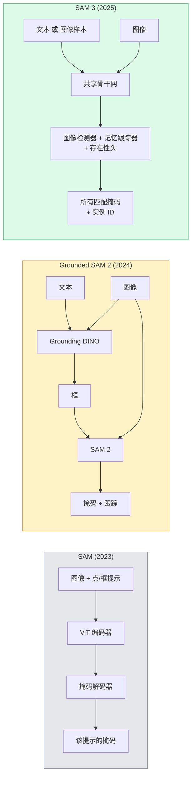

# SAM 3 与开放词汇分割

> 给模型一个文本提示和一张图像，得到每个匹配对象的掩码。SAM 3 让这成为单次前向传播。

**类型:** 用现成库 + 动手实现
**语言:** Python
**前置要求:** Phase 4 Lesson 07 (U-Net)、Phase 4 Lesson 08 (Mask R-CNN)、Phase 4 Lesson 18 (CLIP)
**时间:** ~60 分钟

## 学习目标

- 区分 SAM（仅视觉提示）、Grounded SAM / SAM 2（检测器 + SAM）和 SAM 3（通过 Promptable Concept Segmentation 原生文本提示）
- 解释 SAM 3 架构：共享骨干网 + 图像检测器 + 基于记忆的视频跟踪器 + 存在性头 + 解耦检测器-跟踪器设计
- 使用 Hugging Face `transformers` SAM 3 集成进行文本提示检测、分割和视频跟踪
- 根据延迟、概念复杂度和部署目标在 SAM 3、Grounded SAM 2、YOLO-World 和 SAM-MI 之间选择

## 问题

2023 年的 SAM 是一个仅视觉提示的模型：你点击一个点或画一个框，它返回一个掩码。对于"给我找出这张照片中所有的橙子"，你需要用一个检测器（Grounding DINO）生成框，然后用 SAM 分割每个。Grounded SAM 将这变成一个流水线，但它是两个冻结模型的级联，存在不可避免的误差累积。

SAM 3（Meta，2025 年 11 月，ICLR 2026）合并了这个级联。它接受一个短名词短语或一个图像样本作为提示，在单次前向传播中返回所有匹配掩码和实例 ID。这就是 **Promptable Concept Segmentation（PCS）**。结合 2026 年 3 月的 Object Multiplex 更新（SAM 3.1），它高效地跟踪视频中同一概念的多个实例。

本课关于这一转变所代表结构变化。2D 分割、检测和文本-图像对齐已合并到一个模型中。生产问题不再是"我应该链接哪个流水线"，而是"哪个可提示模型端到端处理我的用例"。

## 概念

### 三代演进



### Promptable Concept Segmentation

一个"概念提示"是一个短名词短语（`"yellow school bus"`、`"striped red umbrella"`、`"hand holding a mug"`）或一个图像样本。模型返回图像中匹配该概念的每个实例的分割掩码，加上每个匹配的独特实例 ID。

这与经典视觉提示 SAM 在三方面不同：

1. 无需逐实例提示——一个文本提示返回所有匹配。
2. 开放词汇——概念可以是任何可以用自然语言描述的东西。
3. 同时返回多个实例，而非每个提示一个掩码。

### 关键架构组件

- **共享骨干网**——单个 ViT 处理图像。检测器头和基于记忆的跟踪器都从它读取。
- **存在性头**——预测概念是否存在于图像中。将"这里有吗？"从"它在哪里？"解耦。减少对不存在概念的误报。
- **解耦检测器-跟踪器**——图像级检测和视频级跟踪有独立的头，互不干扰。
- **记忆银行**——跨帧存储逐实例特征，用于视频跟踪（与 SAM 2 使用的机制相同）。

### 大规模训练

SAM 3 在 **400 万个独特概念**上训练，数据引擎通过 AI + 人工审查迭代标注和纠正生成。新 **SA-CO 基准**包含 27 万个独特概念，比之前的基准大 50 倍。SAM 3 在 SA-CO 上达到人类表现的 75-80%，在图像 + 视频 PCS 上比现有系统高出一倍。

### SAM 3.1 Object Multiplex

2026 年 3 月更新：**Object Multiplex** 为同时联合跟踪同一概念的许多实例引入共享记忆机制。之前，跟踪 N 个实例意味着 N 个独立记忆银行。Multiplex 将其合并为一个带逐实例查询的共享记忆。结果：大幅加速多目标跟踪而不牺牲准确率。

### 2026 年 Grounded SAM 仍然重要的场景

- 当你需要换入一个特定开放词汇检测器（DINO-X、Florence-2）时。
- 当 SAM 3 许可（托管在 HF 上）是障碍时。
- 当你需要比 SAM 3 暴露的更高检测器阈值控制时。
- 用于检测器组件的研究/消融实验。

模块化流水线仍然有一席之地。对于大多数生产工作，SAM 3 是更简单的答案。

### YOLO-World vs SAM 3

- **YOLO-World**——仅开放词汇检测器（无掩码）。实时。需要在高 fps 获得框时最好。
- **SAM 3**——完整分割 + 跟踪。较慢但输出更丰富。

生产划分：YOLO-World 用于快速仅检测流水线（机器人导航、快速仪表板），SAM 3 用于任何需要掩码或跟踪的场景。

### SAM-MI 效率

SAM-MI（2025-2026）解决 SAM 的解码器瓶颈。关键思想：

- **稀疏点提示**——使用几个精心选择的点而非密集提示；减少 96% 的解码器调用。
- **浅层掩码聚合**——将粗糙掩码预测合并为一个更清晰的掩码。
- **解耦掩码注入**——解码器接收预计算的掩码特征，而非重新运行。

结果：开放词汇基准上比 Grounded-SAM 提速约 1.6 倍。

### 三种模型的输出格式

都返回相同的一般结构（框 + 标签 + 分数 + 掩码 + ID），这很有帮助——下游流水线不需要根据哪个模型运行来分支。

## 动手实现

### 步骤 1：提示构建

构建一个辅助函数，将用户句子转换为 SAM 3 概念提示列表。这是"用户输入"遇到"模型消费"的边界。

```python
def split_concepts(sentence):
    """
    多概念提示的启发式分词器。
    返回短名词短语列表。
    """
    for sep in [",", ";", "and", "or", "&"]:
        if sep in sentence:
            parts = [p.strip() for p in sentence.replace("and ", ",").split(",")]
            return [p for p in parts if p]
    return [sentence.strip()]

print(split_concepts("cats, dogs and balloons"))
```

SAM 3 每前向传播接受一个概念；多概念查询时循环或批处理。

### 步骤 2：后处理辅助函数

将 SAM 3 的原始输出转换为符合 Phase 4 Lesson 16 流水线契约的干净检测列表。

```python
from dataclasses import dataclass
from typing import List

@dataclass
class ConceptDetection:
    concept: str
    instance_id: int
    box: tuple          # (x1, y1, x2, y2)
    score: float
    mask_rle: str       # 游程编码


def rle_encode(binary_mask):
    flat = binary_mask.flatten().astype("uint8")
    runs = []
    prev, count = flat[0], 0
    for v in flat:
        if v == prev:
            count += 1
        else:
            runs.append((int(prev), count))
            prev, count = v, 1
    runs.append((int(prev), count))
    return ";".join(f"{v}x{c}" for v, c in runs)
```

RLE 保持响应有效载荷小，即使对于许多高分辨率掩码。相同格式适用于 SAM 2、SAM 3、Grounded SAM 2。

### 步骤 3：统一开放词汇分割接口

在单个方法后封装你拥有的任何后端（SAM 3、Grounded SAM 2、YOLO-World + SAM 2）。下游代码在后端切换时不变。

```python
from abc import ABC, abstractmethod
import numpy as np

class OpenVocabSeg(ABC):
    @abstractmethod
    def detect(self, image: np.ndarray, concept: str) -> List[ConceptDetection]:
        ...


class StubOpenVocabSeg(OpenVocabSeg):
    """
    在真实模型未加载时用于流水线测试的确定性存根。
    """
    def detect(self, image, concept):
        h, w = image.shape[:2]
        return [
            ConceptDetection(
                concept=concept,
                instance_id=0,
                box=(w * 0.2, h * 0.3, w * 0.5, h * 0.8),
                score=0.89,
                mask_rle="0x100;1x50;0x200",
            ),
            ConceptDetection(
                concept=concept,
                instance_id=1,
                box=(w * 0.55, h * 0.25, w * 0.85, h * 0.75),
                score=0.74,
                mask_rle="0x80;1x40;0x220",
            ),
        ]
```

真实的 `SAM3OpenVocabSeg` 子类包装 `transformers.Sam3Model` 和 `Sam3Processor`。

### 步骤 4：Hugging Face SAM 3 用法（参考）

对于真实模型，`transformers` 集成：

```python
from transformers import Sam3Processor, Sam3Model
import torch

processor = Sam3Processor.from_pretrained("facebook/sam3")
model = Sam3Model.from_pretrained("facebook/sam3").eval()

inputs = processor(images=pil_image, return_tensors="pt")
inputs = processor.set_text_prompt(inputs, "yellow school bus")

with torch.no_grad():
    outputs = model(**inputs)

masks = processor.post_process_masks(
    outputs.masks, inputs.original_sizes, inputs.reshaped_input_sizes
)
boxes = outputs.boxes
scores = outputs.scores
```

一个提示，单次调用返回所有匹配。

### 步骤 5：衡量 Grounded SAM 2 免费给你的东西

诚实的基准：将真实流水线中的 Grounded SAM 2 替换为 SAM 3 时会发生什么？

- 延迟：SAM 3 节省一次前向传播（无单独检测器）但模型本身更重；通常净中性或略有提升。
- 准确率：SAM 3 在罕见或组合概念（"条纹红色雨伞"）上明显更好。在常见单词概念上相似。
- 灵活性：Grounded SAM 2 允许换检测器（DINO-X、Florence-2、Grounding DINO 1.5）；SAM 3 是整体的。

结论：SAM 3 是 2026 年开放词汇分割的默认。Grounded SAM 2 在需要检测器灵活性或不同许可条款时仍然是正确答案。

## 用现成库

生产部署模式：

- **实时标注**——SAM 3 + CVAT 的 label-as-text-prompt 功能。标注者选择标签名称；SAM 3 预标注每个匹配实例。审查并纠正。
- **视频分析**——SAM 3.1 Object Multiplex 用于多目标跟踪；将帧输入基于记忆的跟踪器。
- **机器人**——SAM 3 用于开放词汇操作（"拿起红杯子"）；作为规划原语运行。
- **医学影像**——SAM 3 在医学概念上微调；需要在 HF 上请求访问权限。

Ultralytics 在其 Python 包中封装了 SAM 3：

```python
from ultralytics import SAM

model = SAM("sam3.pt")
results = model(image_path, prompts="yellow school bus")
```

与 YOLO 和 SAM 2 相同的接口。

## 产出

本课产出：

- `outputs/prompt-open-vocab-stack-picker.md` — 一个 prompt，根据延迟、概念复杂度和许可在 SAM 3 / Grounded SAM 2 / YOLO-World / SAM-MI 之间选择。
- `outputs/skill-concept-prompt-designer.md` — 一个 skill，将用户话语转换为格式良好的 SAM 3 概念提示（分词、消歧、回退）。

## 练习

1. **（简单）** 在 10 张图像上用你选择的概念提示运行 SAM 3。与同一图像上的 SAM 2 + Grounding DINO 1.5 比较。报告每个模型漏掉了哪些概念。
2. **（中等）** 在 SAM 3 之上构建"点击包含 / 点击排除"UI：文本提示返回候选实例；用户点击保留哪些作为正向。输出最终概念集为 JSON。
3. **（困难）** 在自定义概念集（例如 5 种电子元件）上用每种 20 张标注图像微调 SAM 3。与同测试集上的零样本 SAM 3 比较；测量掩码 IoU 改进。

## 关键术语

| 术语 | 行话 | 实际含义 |
|------|------|----------|
| 开放词汇分割 | "按文本分割" | 为自然语言描述的对象生成掩码，而非固定标签集 |
| PCS | "可提示概念分割" | SAM 3 的核心任务——给定名词短语或图像样本，分割所有匹配实例 |
| 概念提示 | "文本输入" | 短名词短语或图像样本；不是完整句子 |
| 存在性头 | "它在这里吗？" | SAM 3 模块，在定位前判断概念是否存在于图像中 |
| SA-CO | "SAM 3 基准" | 27 万概念开放词汇分割基准；比之前的开放词汇基准大 50 倍 |
| Object Multiplex | "SAM 3.1 更新" | 共享记忆多目标跟踪；快速联合跟踪许多实例 |
| Grounded SAM 2 | "模块化流水线" | 检测器 + SAM 2 级联；当需要检测器替换时仍然相关 |
| SAM-MI | "高效 SAM 变体" | Mask Injection 比 Grounded-SAM 快 1.6 倍 |

## 扩展阅读

- [SAM 3: Segment Anything with Concepts (arXiv 2511.16719)](https://arxiv.org/abs/2511.16719)
- [SAM 3.1 Object Multiplex (Meta AI, March 2026)](https://ai.meta.com/blog/segment-anything-model-3/)
- [SAM 3 model page on Hugging Face](https://huggingface.co/facebook/sam3)
- [Grounded SAM 2 tutorial (PyImageSearch)](https://pyimagesearch.com/2026/01/19/grounded-sam-2-from-open-set-detection-to-segmentation-and-tracking/)
- [Ultralytics SAM 3 docs](https://docs.ultralytics.com/models/sam-3/)
- [SAM3-I: Instruction-aware SAM (arXiv 2512.04585)](https://arxiv.org/abs/2512.04585)