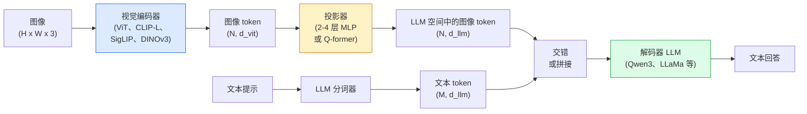

# 视觉-语言模型 — ViT-MLP-LLM 模式

> 视觉编码器将图像转换为 token。MLP 投影器将这些 token 映射到 LLM 的嵌入空间。语言模型完成其余工作。这个模式——ViT-MLP-LLM——是 2026 年每一个生产级 VLM。

**类型:** 学习 + 用现成库
**语言:** Python
**前置要求:** Phase 4 Lesson 14 (ViT)、Phase 4 Lesson 18 (CLIP)、Phase 7 Lesson 02 (自注意力)
**时间:** ~75 分钟

## 学习目标

- 说出 ViT-MLP-LLM 架构并解释三个组件各自贡献什么
- 比较 Qwen3-VL、InternVL3.5、LLaVA-Next 和 GLM-4.6V 的参数量、上下文长度和基准性能
- 解释 DeepStack：为什么多级 ViT 特征比单一最终层特征更能收紧视觉-语言对齐
- 在生产中用跨模态错误率（CMER）测量 VLM 幻觉，并利用该信号采取行动

## 问题

CLIP（Phase 4 Lesson 18）给你一个图像和文本的共享嵌入空间，足以进行零样本分类和检索。它无法回答"这张图像中有多少辆红色汽车？"因为 CLIP 不生成文本——它只评分相似度。

视觉-语言模型（VLM）——Qwen3-VL、InternVL3.5、LLaVA-Next、GLM-4.6V——将 CLIP 系列图像编码器与完整语言模型连接。模型看到一张图像加一个问题并生成答案。2026 年开源 VLM 在多模态基准（MMMU、MMBench、DocVQA、ChartQA、MathVista、OSWorld）上匹敌或超越 GPT-5 和 Gemini-2.5-Pro。

三组件（ViT、投影器、LLM）是标准。模型之间的差异在于：哪个 ViT、哪个投影器、哪个 LLM、训练数据和对齐方案。一旦理解了这个模式，交换任何组件都是机械的。

## 概念

### ViT-MLP-LLM 架构



1. **视觉编码器**——预训练 ViT（CLIP-L/14、SigLIP、DINOv3 或微调变体）。生成 patch token。
2. **投影器**——一个小型模块（2-4 层 MLP 或 Q-former），将视觉 token 映射到 LLM 的嵌入维度。这是大部分微调发生的地方。
3. **LLM**——仅解码器语言模型（Qwen3、Llama、Mistral、GLM、InternLM）。按顺序读取视觉 + 文本 token，生成文本。

三个组件原则上都可训练。实际上，视觉编码器和 LLM 大多保持冻结，只训练投影器——用少量信号换取数十亿参数。

### DeepStack

普通投影仅使用最后一个 ViT 层。DeepStack（Qwen3-VL）从多个 ViT 深度采样特征并堆叠它们。深层携带高级语义；浅层携带细粒度空间和纹理信息。将两者都输入 LLM 弥合了"图像包含什么"（语义）和"具体在哪里"（空间定位）之间的差距。

### 三个训练阶段

现代 VLM 分阶段训练：

1. **对齐**——冻结 ViT 和 LLM。仅在图像-标题对上训练投影器。教投影器将视觉空间映射到语言空间。
2. **预训练**——解冻所有。在大规模交错的图像-文本数据（5 亿+ 对）上训练。建立模型的视觉知识。
3. **指令微调**——在精心策划的（图像、问题、回答）三元组上微调。教授对话行为和任务格式。这是将"视觉感知 LM"变成可用助手的关键。

大多数 LoRA 微调针对第三阶段，使用小型标注数据集。

### 模型家族对比（2026 年初）

| 模型 | 参数量 | 视觉编码器 | LLM | 上下文 | 优势 |
|------|--------|----------------|-----|---------|-----------|
| Qwen3-VL-235B-A22B (MoE) | 235B（22B 活跃） | 自研 ViT + DeepStack | Qwen3 | 256K | 通用 SOTA，GUI agent |
| Qwen3-VL-30B-A3B (MoE) | 30B（3B 活跃） | 自研 ViT + DeepStack | Qwen3 | 256K | 更小的 MoE 选择 |
| Qwen3-VL-8B（dense） | 8B | 自研 ViT | Qwen3 | 128K | 生产 dense 默认 |
| InternVL3.5-38B | 38B | InternViT-6B | Qwen3 + GPT-OSS | 128K | MMBench / MMVet 强 |
| InternVL3.5-241B-A28B | 241B（28B 活跃） | InternViT-6B | Qwen3 | 128K | 与 GPT-4o 竞争 |
| LLaVA-Next 72B | 72B | SigLIP | Llama-3 | 32K | 开源，易微调 |
| GLM-4.6V | ~70B | 自研 | GLM | 64K | 开源，强 OCR |
| MiniCPM-V-2.6 | 8B | SigLIP | MiniCPM | 32K | 边缘友好 |

### 视觉 Agent

Qwen3-VL-235B 在 OSWorld 上达到全球最高性能——这是一个**视觉 Agent**操作 GUI（桌面、移动端、Web）的基准。模型看到截图，理解 UI，发出动作（点击、输入、滚动）。结合工具，在常见桌面任务上形成闭环。2026 年大多数"AI PC"演示在底层运行它。

### Agent 能力 + RoPE 变体

VLM 需要知道视频中哪一帧在**哪个时间**。Qwen3-VL 从 T-RoPE（时序旋转位置嵌入）演化为**基于文本的时间对齐**——与视频帧交错的显式时间戳文本 token。模型看到"`00:32` 时间戳帧，提示"即可推理时序关系。

### 对齐问题

爬取数据集中 12% 的图像-文本对包含不完全基于图像的描述。在其上训练的 VLM 静默学习幻觉——捏造对象、误读数字、编造关系。在生产中这是主导失败模式。

Skywork.ai 引入了**跨模态错误率（CMER）**来追踪它：

```
CMER = 文本置信度高但图像-文本相似度（通过 CLIP 系列检查器）低的输出比例
```

高 CMER 意味着模型在自信地说不在图像中的事情。监控 CMER 并将其作为生产 KPI 处理，使幻觉率降低约 35%。诀窍不是"修复模型"而是"将高 CMER 输出路由到人工审查"。

### 用 LoRA / QLoRA 微调

70B VLM 的全量微调对大多数团队来说是无法承受的。LoRA（rank 16-64）在 attention + 投影层，或带 4 位基础权重的 QLoRA，可以放在单张 A100 / H100 上。成本：5000-50000 个样本，100-5000 美元计算费用，2-10 小时训练。

### 空间推理仍然弱

当前 VLM 在空间推理基准（上-下、左-右、计数、距离）上得分 50-60%。如果你的用例取决于"哪个对象在另一个上面"，请大量验证——通用 VLM 性能低于人类。纯空间任务的优于 VLM 的替代方案：专用关键点 / 姿态估计器、深度模型，或带框几何后处理的检测模型。

## 动手实现

### 步骤 1：投影器

你将最常训练的部分。2-4 层 MLP + GELU。

```python
import torch
import torch.nn as nn


class Projector(nn.Module):
    def __init__(self, vit_dim=768, llm_dim=4096, hidden=4096):
        super().__init__()
        self.net = nn.Sequential(
            nn.Linear(vit_dim, hidden),
            nn.GELU(),
            nn.Linear(hidden, llm_dim),
        )

    def forward(self, x):
        return self.net(x)
```

输入是 `(N_patches, d_vit)` token 张量。输出是 `(N_patches, d_llm)`。LLM 将每个输出行视为另一个 token。

### 步骤 2：组装 ViT-MLP-LLM 端到端

最小 VLM 前向传递的骨架。真实代码使用 `transformers`；这是概念布局。

```python
class MinimalVLM(nn.Module):
    def __init__(self, vit, projector, llm, image_token_id):
        super().__init__()
        self.vit = vit
        self.projector = projector
        self.llm = llm
        self.image_token_id = image_token_id  # 文本提示中的占位符 token

    def forward(self, image, input_ids, attention_mask):
        # 1. 视觉特征
        vision_tokens = self.vit(image)                     # (B, N_patches, d_vit)
        vision_embeds = self.projector(vision_tokens)       # (B, N_patches, d_llm)

        # 2. 文本嵌入
        text_embeds = self.llm.get_input_embeddings()(input_ids)  # (B, M, d_llm)

        # 3. 用视觉嵌入替换图像占位符 token
        merged = self._merge(text_embeds, vision_embeds, input_ids)

        # 4. 运行 LLM
        return self.llm(inputs_embeds=merged, attention_mask=attention_mask)

    def _merge(self, text_embeds, vision_embeds, input_ids):
        out = text_embeds.clone()
        expected = vision_embeds.size(1)
        for b in range(input_ids.size(0)):
            positions = (input_ids[b] == self.image_token_id).nonzero(as_tuple=True)[0]
            if len(positions) != expected:
                raise ValueError(
                    f"batch item {b} has {len(positions)} image tokens but vision_embeds has {expected} patches."
                    " Every sample in the batch must be pre-padded to the same number of image placeholder tokens.")
            out[b, positions] = vision_embeds[b]
        return out
```

文本中的 `<image>` 占位符 token 被替换为真实图像嵌入——LLaVA、Qwen-VL 和 InternVL 使用的相同模式。

### 步骤 3：CMER 计算

轻量级运行时检查。

```python
import torch.nn.functional as F


def cross_modal_error_rate(image_emb, text_emb, text_confidence, sim_threshold=0.25, conf_threshold=0.8):
    """
    image_emb, text_emb: 图像和生成文本的嵌入（内部归一化）
    text_confidence:     平均逐 token 概率，范围 [0, 1]
    Returns:             高置信度输出中低图像-文本对齐的比例
    """
    image_emb = F.normalize(image_emb, dim=-1)
    text_emb = F.normalize(text_emb, dim=-1)
    sim = (image_emb * text_emb).sum(dim=-1)        # 余弦相似度
    high_conf_low_sim = (text_confidence > conf_threshold) & (sim < sim_threshold)
    return high_conf_low_sim.float().mean().item()
```

将 CMER 作为生产 KPI。监控每个端点、每种提示类型、每个客户的 CMER。CMER 上升表明模型开始对某些输入分布产生幻觉。

### 步骤 4：玩具 VLM 分类器（可运行）

演示投影器可以训练。假"ViT 特征"输入；一个小型类 LLM token 预测类别。

```python
class ToyVLM(nn.Module):
    def __init__(self, vit_dim=32, llm_dim=64, num_classes=5):
        super().__init__()
        self.projector = Projector(vit_dim, llm_dim, hidden=64)
        self.head = nn.Linear(llm_dim, num_classes)

    def forward(self, vision_tokens):
        projected = self.projector(vision_tokens)
        pooled = projected.mean(dim=1)
        return self.head(pooled)
```

可以在合成（特征，类别）对上在 200 步内拟合——足以展示投影器模式有效。

## 用现成库

2026 年生产团队使用 VLM 的三种方式：

- **托管 API**——OpenAI Vision、Anthropic Claude Vision、Google Gemini Vision。零基础设施，供应商风险。
- **开源自托管**——Qwen3-VL 或 InternVL3.5 通过 `transformers` 和 `vllm`。完全控制，更高前期工作量。
- **领域微调**——加载 Qwen2.5-VL-7B 或 LLaVA-1.6-7B，用 5k-50k 自定义样本 LoRA，在 `vllm` 或 `TGI` 上服务。

```python
from transformers import AutoProcessor, AutoModelForVision2Seq
import torch
from PIL import Image

model_id = "Qwen/Qwen3-VL-8B-Instruct"
processor = AutoProcessor.from_pretrained(model_id)
model = AutoModelForVision2Seq.from_pretrained(model_id, torch_dtype=torch.bfloat16, device_map="auto")

messages = [{
    "role": "user",
    "content": [
        {"type": "image", "image": Image.open("plot.png")},
        {"type": "text", "text": "What does this chart show?"},
    ],
}]
inputs = processor.apply_chat_template(messages, add_generation_prompt=True, tokenize=True, return_dict=True, return_tensors="pt").to("cuda")
generated = model.generate(**inputs, max_new_tokens=256)
answer = processor.decode(generated[0][inputs["input_ids"].shape[1]:], skip_special_tokens=True)
```

`apply_chat_template` 隐藏了 `<image>` 占位符分词；模型在内部处理合并。

## 产出

本课产出：

- `outputs/prompt-vlm-selector.md` — 根据准确率、延迟、上下文长度和预算在 Qwen3-VL / InternVL3.5 / LLaVA-Next / API 之间选择。
- `outputs/skill-cmer-monitor.md` — 发出代码以用跨模态错误率、逐端点仪表板和告警阈值检测生产 VLM 端点。

## 练习

1. **（简单）** 在五张图像上运行三个提示（"这是什么？"、"数物体数量"、"描述场景"）。手动将每个答案评为正确 / 部分正确 / 幻觉。计算首次近似的类 CMER 比率。
2. **（中等）** 用 LoRA（rank 16）在 500 张目标域图像及其标题上微调 Qwen2.5-VL-3B 或 LLaVA-1.6-7B。比较零样本 vs 微调的 MMBench 风格准确率。
3. **（困难）** 将 VLM 的图像编码器替换为 DINOv3 而非默认 SigLIP/CLIP。仅训练投影器（冻结 LLM + 冻结 DINOv3）。测量密集预测任务（计数、空间推理）是否改善。

## 关键术语

| 术语 | 行话 | 实际含义 |
|------|------|----------|
| ViT-MLP-LLM | "VLM 模式" | 视觉编码器 + 投影器 + 语言模型；2026 年每个 VLM |
| 投影器 | "桥梁" | 2-4 层 MLP（或 Q-former），将视觉 token 映射到 LLM 嵌入空间 |
| DeepStack | "Qwen3-VL 特征技巧" | 多级 ViT 特征堆叠而非仅用最后一层 |
| 图像 token | "<image> 占位符" | 文本流中被投影视觉嵌入替换的特殊 token |
| CMER | "幻觉 KPI" | 跨模态错误率；当文本置信度高但图像-文本相似度低时高 |
| 视觉 Agent | "会点击的 VLM" | 操作 GUI（OSWorld、移动端、Web）的 VLM，带工具调用 |
| Q-former | "固定数量 token 桥" | BLIP-2 风格投影器，产生固定数量的视觉查询 token |
| 对齐 / 预训练 / 指令微调 | "三个阶段" | 标准 VLM 训练流水线 |

## 扩展阅读

- [Qwen3-VL Technical Report (arXiv 2511.21631)](https://arxiv.org/abs/2511.21631)
- [InternVL3.5 Advancing Open-Source Multimodal Models (arXiv 2508.18265)](https://arxiv.org/html/2508.18265v1)
- [LLaVA-Next series](https://llava-vl.github.io/blog/2024-05-10-llava-next-stronger-llms/)
- [BentoML: Best Open-Source VLMs 2026](https://www.bentoml.com/blog/multimodal-ai-a-guide-to-open-source-vision-language-models)
- [MMMU: Multi-discipline Multimodal Understanding benchmark](https://mmmu-benchmark.github.io/)
- [VLMs in manufacturing (Robotics Tomorrow, March 2026)](https://www.roboticstomorrow.com/story/2026/03/when-machines-learn-to-see-like-experts-the-rise-of-vision-language-models-in-manufacturing/26335/)