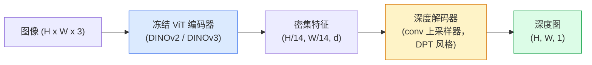

# 单目深度估计与几何

> 深度图是一个单通道图像，其中每个像素是到相机的距离。从一个 RGB 帧预测它曾被认为不可能——没有立体或 LiDAR。2026 年一个冻结的 ViT 编码器加一个轻量头，距离真实值仅差几个百分点。

**类型:** 动手实现 + 用现成库
**语言:** Python
**前置要求:** Phase 4 Lesson 14 (ViT)、Phase 4 Lesson 17 (自监督视觉)、Phase 4 Lesson 07 (U-Net)
**时间:** ~60 分钟

## 学习目标

- 区分相对深度和度量深度，并说出每个生产模型（MiDaS、Marigold、Depth Anything V3、ZoeDepth）解决的是哪个
- 使用 Depth Anything V3（DINOv2 骨干网）预测任意单张图像的深度，无需校准
- 解释为什么单目深度仅从一张图像就能工作（透视线索、纹理梯度、学习到的先验），以及它无法恢复什么（绝对尺度、被遮挡的几何）
- 使用深度图和针孔相机内参将 2D 检测提升到 3D 点

## 问题

深度是 2D 计算机视觉中缺失的轴。给定 RGB，你知道物体在图像平面上的位置；你不知道它们有多远。深度传感器（立体 rigs、LiDAR、ToF）直接解决这一问题，但昂贵、脆弱且范围有限。

单目深度估计——从单个 RGB 帧预测深度——曾产生模糊、不可靠的输出。截至 2026 年，大型预训练编码器改变了这一状况：Depth Anything V3 使用冻结的 DINOv2 骨干网，产生跨室内、室外、医学和卫星领域泛化的深度图。Marigold 将深度重新定义为条件扩散问题。ZoeDepth 回归真实度量距离。

深度也是 2D 检测和 3D 理解之间的桥梁：将检测框的像素乘以深度，你就把 2D 对象提升到 3D 点云。这是每个 AR 遮挡系统、每个障碍物规避流水线和每个"拿起杯子"机器人的核心。

## 概念

### 相对深度 vs 度量深度

- **相对深度**——有序的 `z` 值，没有真实世界单位。"像素 A 比像素 B 近，但距离比值未锚定到米。"
- **度量深度**——相机以米为单位的绝对距离。需要模型学习图像线索与真实距离之间的统计关系。

MiDaS 和 Depth Anything V3 产生相对深度。Marigold 产生相对深度。ZoeDepth、UniDepth 和 Metric3D 产生度量深度。度量模型对相机内参敏感；相对模型不敏感。

### 编码器-解码器模式



Depth Anything V3 冻结编码器，仅训练 DPT 风格解码器。编码器提供丰富特征；解码器将其插值回图像分辨率并回归深度。

### 为什么单张图像能产生深度

2D 图像包含许多与深度相关的单目线索：

- **透视**——3D 中的平行线在 2D 中汇聚。
- **纹理梯度**——远处的表面纹理更小、更密集。
- **遮挡顺序**——近处物体遮挡远处物体。
- **大小恒常性**——已知物体（汽车、人类）给出近似尺度。
- **大气透视**——在户外场景中远处物体看起来更模糊、更蓝。

在数十亿图像上训练的 ViT 内部化了这些线索。有了足够的数据和强骨干网，单目深度在没有显式 3D 监督的情况下达到合理准确率。

### 单目深度做不到的

- **绝对度量尺度**——没有内参或场景中已知物体。网络可以预测"杯子是勺子的两倍远"，但不知道杯子是 1 米还是 10 米。
- **被遮挡的几何**——椅子的背面看不见，无法可靠推断。
- **真正无纹理 / 反射表面**——镜子、玻璃、均匀墙壁。网络报告看似合理但错误的深度。

### 2026 年的 Depth Anything V3

- 原始 DINOv2 ViT-L/14 作为编码器（冻结）。
- DPT 解码器。
- 在来自不同来源的姿态图像对训练（不需要超越光度一致性的显式深度监督）。
- 从任意数量的视觉输入（有无已知相机姿态）预测空间一致的几何。
- 在单目深度、任意视角几何、视觉渲染、相机姿态估计上达到 SOTA。

这是 2026 年需要深度时的直接调用模型。

### Marigold——扩散做深度

Marigold（Ke et al., CVPR 2024）将深度估计重新定义为条件图像到图像扩散。条件：RGB。目标：深度图。使用预训练 Stable Diffusion 2 U-Net 作为骨干网。输出深度图在物体边界处异常清晰。权衡：比前馈模型推理更慢（10-50 去噪步）。

### 内参和针孔相机

将像素 `(u, v)` 和深度 `d` 提升到相机坐标系中的 3D 点 `(X, Y, Z)`：

```
fx, fy, cx, cy = 相机内参
X = (u - cx) * d / fx
Y = (v - cy) * d / fy
Z = d
```

内参来自 EXIF 元数据、校准图案或单目内参估计器（Perspective Fields、UniDepth）。没有内参，仍然可以通过假设 60-70° FOV 和中等等效主点渲染点云——用于可视化，不用于测量。

### 评估

两个标准指标：

- **AbsRel**（绝对相对误差）：`mean(|d_pred - d_gt| / d_gt)`。越低越好。生产模型在 0.05-0.1 范围。
- **delta < 1.25**（阈值准确率）：`max(d_pred/d_gt, d_gt/d_pred) < 1.25` 的像素比例。越高越好。SOTA 在 0.9+。

对于相对深度（Depth Anything V3、MiDaS），评估使用两个指标的尺度和平移不变版本。

## 动手实现

### 步骤 1：深度指标

```python
import torch

def abs_rel_error(pred, target, mask=None):
    if mask is not None:
        pred = pred[mask]
        target = target[mask]
    return (torch.abs(pred - target) / target.clamp(min=1e-6)).mean().item()


def delta_accuracy(pred, target, threshold=1.25, mask=None):
    if mask is not None:
        pred = pred[mask]
        target = target[mask]
    ratio = torch.maximum(pred / target.clamp(min=1e-6), target / pred.clamp(min=1e-6))
    return (ratio < threshold).float().mean().item()
```

求值前始终掩膜无效深度像素（零、NaN、饱和）。

### 步骤 2：尺度和平移对齐

对于相对深度模型，在计算指标前将预测与真值对齐。最优拟合 `a * pred + b = target`：

```python
def align_scale_shift(pred, target, mask=None):
    if mask is not None:
        p = pred[mask]
        t = target[mask]
    else:
        p = pred.flatten()
        t = target.flatten()
    A = torch.stack([p, torch.ones_like(p)], dim=1)
    coeffs, *_ = torch.linalg.lstsq(A, t.unsqueeze(-1))
    a, b = coeffs[:2, 0]
    return a * pred + b
```

评估 MiDaS / Depth Anything 时，在 `abs_rel_error` 前运行 `align_scale_shift`。

### 步骤 3：将深度提升到点云

```python
import numpy as np

def depth_to_point_cloud(depth, intrinsics):
    H, W = depth.shape
    fx, fy, cx, cy = intrinsics
    v, u = np.meshgrid(np.arange(H), np.arange(W), indexing="ij")
    z = depth
    x = (u - cx) * z / fx
    y = (v - cy) * z / fy
    return np.stack([x, y, z], axis=-1)


depth = np.random.uniform(0.5, 4.0, (240, 320))
intr = (320.0, 320.0, 160.0, 120.0)
pc = depth_to_point_cloud(depth, intr)
print(f"point cloud shape: {pc.shape}  (H, W, 3)")
```

一个函数，每个 3D 提升应用。导出为 `.ply` 并在 MeshLab 或 CloudCompare 中打开。

### 步骤 4：合成深度场景冒烟测试

```python
def synthetic_depth(size=96):
    yy, xx = np.meshgrid(np.arange(size), np.arange(size), indexing="ij")
    # 地板：从近（顶部）到远（底部）的线性梯度
    depth = 1.0 + (yy / size) * 4.0
    # 中间盒子：更近
    mask = (np.abs(xx - size / 2) < size / 6) & (np.abs(yy - size * 0.6) < size / 6)
    depth[mask] = 2.0
    return depth.astype(np.float32)


gt = torch.from_numpy(synthetic_depth(96))
pred = gt + 0.3 * torch.randn_like(gt)  # 模拟预测
aligned = align_scale_shift(pred, gt)
print(f"对齐前  absRel = {abs_rel_error(pred, gt):.3f}")
print(f"对齐后  absRel = {abs_rel_error(aligned, gt):.3f}")
```

### 步骤 5：Depth Anything V3 用法（参考）

```python
import torch
from transformers import pipeline
from PIL import Image

pipe = pipeline(task="depth-estimation", model="LiheYoung/depth-anything-v2-large")

image = Image.open("street.jpg").convert("RGB")
out = pipe(image)
depth_np = np.array(out["depth"])
```

三行。`out["depth"]` 是一个 PIL 灰度图；转换为 numpy 以进行计算。Depth Anything V3 发布后换模型 ID；API 不变。

## 用现成库

- **Depth Anything V3**（Meta AI / ByteDance，2024-2026）——相对深度的默认。生产中最快的 ViT-large 骨干网模型。
- **Marigold**（ETH，2024）——最高视觉质量，推理较慢。
- **UniDepth**（ETH，2024）——带相机内参估计的度量深度。
- **ZoeDepth**（Intel，2023）——度量深度；较老，仍可靠。
- **MiDaS v3.1**——遗留但稳定；比较的良好基准。

典型集成模式：

1. RGB 帧到达。
2. 深度模型生成深度图。
3. 检测器生成框。
4. 通过深度将框质心提升到 3D；如有可用点云则合并。
5. 下游：AR 遮挡、路径规划、物体大小估计、立体替代。

对于实时使用，Depth Anything V2 Small（INT8 量化）在 518x518 分辨率下消费 GPU 上达到约 30 fps。

## 产出

本课产出：

- `outputs/prompt-depth-model-picker.md` — 根据延迟、度量 vs 相对需求和场景类型在 Depth Anything V3、Marigold、UniDepth、MiDaS 之间选择。
- `outputs/skill-depth-to-pointcloud.md` — 一个 skill，用正确的内参处理和 `.ply` 导出从深度图构建点云。

## 练习

1. **（简单）** 在桌上任意 10 张图像上运行 Depth Anything V2。保存深度为灰度 PNG 并检查。识别一个预测深度看起来错误的物体，并解释为什么单目线索失败。
2. **（中等）** 给定来自 Depth Anything V2 的 RGB + 深度，提升到点云并用 `open3d` 渲染。比较两个场景（室内 / 室外），注意哪个看起来更逼真。
3. **（困难）** 取五对仅因已知物体位置不同的图像（例如瓶子移动 30 cm 更近）。用 UniDepth 预测两者的度量深度。报告预测距离增量 vs 真实 30 cm。

## 关键术语

| 术语 | 行话 | 实际含义 |
|------|------|----------|
| 单目深度 | "单图像深度" | 从一个 RGB 帧估计深度，无需立体或 LiDAR |
| 相对深度 | "有序深度" | 有序 z 值，没有真实世界单位 |
| 度量深度 | "绝对距离" | 以米为单位的深度；需要校准或带度量监督训练的模型 |
| AbsRel | "绝对相对误差" | |d_pred - d_gt| / d_gt 的均值；标准深度指标 |
| Delta 准确率 | "delta < 1.25" | 预测在真值 25% 以内的像素比例 |
| 针孔相机 | "fx, fy, cx, cy" | 用于将 (u, v, d) 提升到 (X, Y, Z) 的相机模型 |
| DPT | "密集预测 Transformer" | 在冻结 ViT 编码器之上使用的基于卷积的解码器，用于深度 |
| DINOv2 骨干网 | "它起作用的原因" | 自监督特征，跨领域泛化，无需深度标签 |

## 扩展阅读

- [Depth Anything V3 paper page](https://depth-anything.github.io/) — DINOv2 编码器的 SOTA 单目深度
- [Marigold (Ke et al., CVPR 2024)](https://marigoldmonodepth.github.io/) — 基于扩散的深度估计
- [UniDepth (Piccinelli et al., 2024)](https://arxiv.org/abs/2403.18913) — 带内参的度量深度
- [MiDaS v3.1 (Intel ISL)](https://github.com/isl-org/MiDaS) — 经典相对深度基准
- [DINOv3 blog post (Meta)](https://ai.meta.com/blog/dinov3-self-supervised-vision-model/) — 提升深度准确率的编码器家族