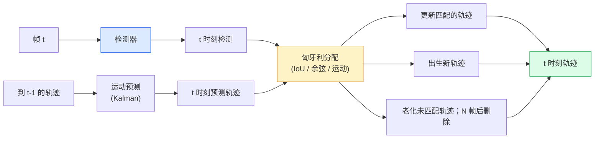

# 多目标跟踪与视频记忆

> 跟踪就是检测加关联。每帧检测。将这一帧的检测与上一帧的轨迹按 ID 匹配。

**类型:** 动手实现
**语言:** Python
**前置要求:** Phase 4 Lesson 06 (YOLO 检测)、Phase 4 Lesson 08 (Mask R-CNN)、Phase 4 Lesson 24 (SAM 3)
**时间:** ~60 分钟

## 学习目标

- 区分检测后跟踪和基于查询的跟踪，并说出算法家族（SORT、DeepSORT、ByteTrack、BoT-SORT、SAM 2 记忆跟踪器、SAM 3.1 Object Multiplex）
- 从零实现 IoU + 匈牙利分配，用于经典检测后跟踪
- 解释 SAM 2 的记忆银行以及为什么它比基于 IoU 的关联更好地处理遮挡
- 阅读三个跟踪指标（MOTA、IDF1、HOTA）并为给定用例选择哪个指标重要

## 问题

检测器告诉你单帧中物体在哪里。跟踪器告诉你帧 `t` 中的哪个检测与帧 `t-1` 中的检测是同一个物体。没有这个，你就无法计算过线物体数量、跟踪球穿过遮挡或知道"车 #4 已在车道 8 秒"。

跟踪对于每个面向视频的产品都是必不可少的：体育分析、监控、自动驾驶、医学视频分析、野生动物监测、文字标记计数。核心构建块是共享的：逐帧检测器、运动模型（Kalman 滤波器或更丰富的）、关联步骤（IoU / 余弦相似度 / 学习特征的匈牙利算法）和轨迹生命周期（出生、更新、消亡）。

2026 年带来了两个新模式：**SAM 2 基于记忆的跟踪**（特征记忆而非运动模型关联）和 **SAM 3.1 Object Multiplex**（同一概念的许多实例共享记忆）。本课先走经典技术栈，然后走基于记忆的方法。

## 概念

### 检测后跟踪



2026 年你将遇到的每个跟踪器都是这个循环的变体。差异：

- **SORT**（2016）：Kalman 滤波器 + IoU 匈牙利。简单、快速、无外观模型。
- **DeepSORT**（2017）：SORT + 逐轨迹基于 CNN 的外观特征（ReID 嵌入）。更好地处理交叉。
- **ByteTrack**（2021）：第二阶段关联低置信度检测；不需要外观特征但在 MOT17 上表现最佳。
- **BoT-SORT**（2022）：Byte + 相机运动补偿 + ReID。
- **StrongSORT / OC-SORT**——ByteTrack 后代，更好的运动和外观。

### Kalman 滤波器一段话

Kalman 滤波器维护逐轨迹状态 `(x, y, w, h, dx, dy, dw, dh)` 和协方差。每帧，**预测**状态使用恒速模型，然后**更新**匹配的检测。当预测不确定性高时更新更信任检测。这给出平滑轨迹，并在短遮挡（1-5 帧）时保持轨迹继续。

每个经典跟踪器在运动预测步骤中使用 Kalman 滤波器。

### 匈牙利算法

给定 `M x N` 成本矩阵（轨迹 × 检测），找到使总成本最小的一对一分配。成本通常是 `1 - IoU(track_bbox, detection_bbox)` 或外观特征的负余弦相似度。运行时 O((M+N)^3)；对于 M, N 约 1000 以内在 Python 中通过 `scipy.optimize.linear_sum_assignment` 很快。

### ByteTrack 的关键思想

标准跟踪器丢弃低置信度检测（< 0.5）。ByteTrack 将它们保留为**第二阶段候选**：在将轨迹与高置信度检测匹配后，未匹配轨迹尝试用稍宽松的 IoU 阈值匹配低置信度检测。恢复短遮挡，减少拥挤处 ID 切换。

### SAM 2 基于记忆的跟踪

SAM 2 通过维护逐实例时空特征的**记忆银行**来处理视频。给定一帧上的提示（点击、框、文本），它将实例编码为记忆。在后续帧上，记忆与新帧的特征交叉注意力，解码器为同一实例在新帧中产生掩码。

无 Kalman 滤波器，无匈牙利分配。关联隐式在记忆-注意力操作中。

优点：
- 对大遮挡鲁棒（记忆跨多帧携带实例标识）。
- 与 SAM 3 文本提示结合时开放词汇。
- 无需单独的运动模型。

缺点：
- 比 ByteTrack 慢用于多目标跟踪。
- 记忆银行增长；限制上下文窗口。

### SAM 3.1 Object Multiplex

之前的 SAM 2 / SAM 3 跟踪为每个实例维护独立记忆银行。对于 50 个对象，50 个记忆银行。Object Multiplex（2026 年 3 月）将它们合并为一个带**逐实例查询 token**的共享记忆。成本随实例数量次线性增长。

Multiplex 是 2026 年人群跟踪的新默认：音乐会人群、仓库工人、交通路口。

### 需要了解的三个指标

- **MOTA（多目标跟踪准确率）**——1 - (FN + FP + ID 切换) / GT。加权按错误类型；单一指标混合检测和关联失败。
- **IDF1（ID F1）**——ID 精确率和召回率的调和平均。专门关注每个真值轨迹随时间保持其 ID 的程度。在 ID 切换敏感任务上优于 MOTA。
- **HOTA（高阶跟踪准确率）**——分解为检测准确率（DetA）和关联准确率（AssA）。2020 年以来的社区标准；最全面。

监控（谁是谁）：报告 IDF1。体育（计数传球）：HOTA。学术比较：HOTA。

## 动手实现

### 步骤 1：基于 IoU 的成本矩阵

```python
import numpy as np


def bbox_iou(a, b):
    """
    a, b: (N, 4) 数组，格式 [x1, y1, x2, y2]。
    返回 (N_a, N_b) IoU 矩阵。
    """
    ax1, ay1, ax2, ay2 = a[:, 0], a[:, 1], a[:, 2], a[:, 3]
    bx1, by1, bx2, by2 = b[:, 0], b[:, 1], b[:, 2], b[:, 3]
    inter_x1 = np.maximum(ax1[:, None], bx1[None, :])
    inter_y1 = np.maximum(ay1[:, None], by1[None, :])
    inter_x2 = np.minimum(ax2[:, None], bx2[None, :])
    inter_y2 = np.minimum(ay2[:, None], by2[None, :])
    inter = np.clip(inter_x2 - inter_x1, 0, None) * np.clip(inter_y2 - inter_y1, 0, None)
    area_a = (ax2 - ax1) * (ay2 - ay1)
    area_b = (bx2 - bx1) * (by2 - by1)
    union = area_a[:, None] + area_b[None, :] - inter
    return inter / np.clip(union, 1e-8, None)
```

### 步骤 2：最小 SORT 风格跟踪器

为简洁省略固定恒速 Kalman——这里使用简单 IoU 关联；生产中 Kalman 预测是必不可少的。`sort` Python 包提供完整版本。

```python
from scipy.optimize import linear_sum_assignment


class Track:
    def __init__(self, tid, bbox, frame):
        self.id = tid
        self.bbox = bbox
        self.last_frame = frame
        self.hits = 1

    def update(self, bbox, frame):
        self.bbox = bbox
        self.last_frame = frame
        self.hits += 1


class SimpleTracker:
    def __init__(self, iou_threshold=0.3, max_age=5):
        self.tracks = []
        self.next_id = 1
        self.iou_threshold = iou_threshold
        self.max_age = max_age

    def step(self, detections, frame):
        if not self.tracks:
            for d in detections:
                self.tracks.append(Track(self.next_id, d, frame))
                self.next_id += 1
            return [(t.id, t.bbox) for t in self.tracks]

        track_boxes = np.array([t.bbox for t in self.tracks])
        det_boxes = np.array(detections) if len(detections) else np.empty((0, 4))

        iou = bbox_iou(track_boxes, det_boxes) if len(det_boxes) else np.zeros((len(track_boxes), 0))
        cost = 1 - iou
        cost[iou < self.iou_threshold] = 1e6

        matched_track = set()
        matched_det = set()
        if cost.size > 0:
            row, col = linear_sum_assignment(cost)
            for r, c in zip(row, col):
                if cost[r, c] < 1.0:
                    self.tracks[r].update(det_boxes[c], frame)
                    matched_track.add(r); matched_det.add(c)

        for i, d in enumerate(det_boxes):
            if i not in matched_det:
                self.tracks.append(Track(self.next_id, d, frame))
                self.next_id += 1

        self.tracks = [t for t in self.tracks if frame - t.last_frame <= self.max_age]
        return [(t.id, t.bbox) for t in self.tracks]
```

60 行。接受逐帧检测，返回逐帧轨迹 ID。真实系统添加 Kalman 预测、ByteTrack 的第二阶段重匹配和外观特征。

### 步骤 3：合成轨迹测试

```python
def synthetic_frames(num_frames=20, num_objects=3, H=240, W=320, seed=0):
    rng = np.random.default_rng(seed)
    starts = rng.uniform(20, 200, size=(num_objects, 2))
    velocities = rng.uniform(-5, 5, size=(num_objects, 2))
    frames = []
    for f in range(num_frames):
        dets = []
        for i in range(num_objects):
            cx, cy = starts[i] + f * velocities[i]
            dets.append([cx - 10, cy - 10, cx + 10, cy + 10])
        frames.append(dets)
    return frames


tracker = SimpleTracker()
for f, dets in enumerate(synthetic_frames()):
    tracks = tracker.step(dets, f)
```

三个物体沿直线移动应在所有 20 帧中保持其 ID。

### 步骤 4：ID 切换指标

```python
def count_id_switches(tracks_per_frame, gt_per_frame):
    """
    tracks_per_frame:  逐帧的 (track_id, bbox) 列表
    gt_per_frame:      逐帧的 (gt_id, bbox) 列表
    返回 ID 切换次数。
    """
    prev_assignment = {}
    switches = 0
    for tracks, gts in zip(tracks_per_frame, gt_per_frame):
        if not tracks or not gts:
            continue
        t_boxes = np.array([b for _, b in tracks])
        g_boxes = np.array([b for _, b in gts])
        iou = bbox_iou(g_boxes, t_boxes)
        for g_idx, (gt_id, _) in enumerate(gts):
            j = iou[g_idx].argmax()
            if iou[g_idx, j] > 0.5:
                t_id = tracks[j][0]
                if gt_id in prev_assignment and prev_assignment[gt_id] != t_id:
                    switches += 1
                prev_assignment[gt_id] = t_id
    return switches
```

这是简化的类 IDF1 指标：计算真值对象改变其分配预测轨迹 ID 的次数。真实 MOTA / IDF1 / HOTA 工具在 `py-motmetrics` 和 `TrackEval` 中。

## 用现成库

2026 年生产跟踪器：

- `ultralytics`——YOLOv8 + 内置 ByteTrack / BoT-SORT。`results = model.track(source, tracker="bytetrack.yaml")`。默认。
- `supervision`（Roboflow）——ByteTrack 包装器加标注工具。
- SAM 2 / SAM 3.1——通过 `processor.track()` 的基于记忆的跟踪。
- 自定义栈：检测器（YOLOv8 / RT-DETR）+ `sort-tracker` / `OC-SORT` / `StrongSORT`。

选择：

- 行人 / 汽车 / 框，30+ fps：**ultralytics 的 ByteTrack**。
- 人群中一个类的许多实例：**SAM 3.1 Object Multiplex**。
- 强遮挡与可识别外观：**DeepSORT / StrongSORT**（ReID 特征）。
- 体育 / 复杂交互：**BoT-SORT** 或学习型跟踪器（MOTRv3）。

## 产出

本课产出：

- `outputs/prompt-tracker-picker.md` — 根据场景类型、遮挡模式和延迟预算在 SORT / ByteTrack / BoT-SORT / SAM 2 / SAM 3.1 之间选择。
- `outputs/skill-mot-evaluator.md` — 写出 MOTA / IDF1 / HOTA 相对于真值轨迹的完整评估工具。

## 练习

1. **（简单）** 用 3、10 和 30 个对象运行上面的合成跟踪器。报告每种情况的 ID 切换次数。找出简单仅 IoU 关联开始失效的地方。
2. **（中等）** 在关联前添加恒速 Kalman 预测步骤。展示短（2-3 帧）遮挡不再导致 ID 切换。
3. **（困难）** 通过 `transformers` 集成 SAM 2 的基于记忆的跟踪器作为替代跟踪器后端。在 30 秒人群片段上运行 SimpleTracker 和 SAM 2，比较 ID 切换次数，人工为 5 个显著人物标注真值 ID。

## 关键术语

| 术语 | 行话 | 实际含义 |
|------|------|----------|
| 检测后跟踪 | "检测然后关联" | 逐帧检测器 + 在 IoU / 外观上的匈牙利分配 |
| Kalman 滤波器 | "运动预测" | 线性动力学 + 协方差，用于平滑轨迹预测和处理遮挡 |
| 匈牙利算法 | "最优分配" | 求解最小成本二部匹配问题；`scipy.optimize.linear_sum_assignment` |
| ByteTrack | "低置信度第二遍" | 未匹配轨迹与低置信度检测重新匹配以恢复短遮挡 |
| DeepSORT | "SORT + 外观" | 添加 ReID 特征用于跨帧匹配；更好地保持 ID |
| 记忆银行 | "SAM 2 技巧" | 跨帧存储的逐实例时空特征；交叉注意力替换显式关联 |
| Object Multiplex | "SAM 3.1 共享记忆" | 带逐实例查询的单一共享记忆，用于快速多目标跟踪 |
| HOTA | "现代跟踪指标" | 分解为检测和关联准确率；社区标准 |

## 扩展阅读

- [SORT (Bewley et al., 2016)](https://arxiv.org/abs/1602.00763) — 最小检测后跟踪论文
- [DeepSORT (Wojke et al., 2017)](https://arxiv.org/abs/1703.07402) — 添加外观特征
- [ByteTrack (Zhang et al., 2022)](https://arxiv.org/abs/2110.06864) — 低置信度第二遍
- [BoT-SORT (Aharon et al., 2022)](https://arxiv.org/abs/2206.14651) — 相机运动补偿
- [HOTA (Luiten et al., 2020)](https://arxiv.org/abs/2009.07736) — 分解的跟踪指标
- [SAM 2 video segmentation (Meta, 2024)](https://ai.meta.com/sam2/) — 基于记忆的跟踪器
- [SAM 3.1 Object Multiplex (Meta, March 2026)](https://ai.meta.com/blog/segment-anything-model-3/)