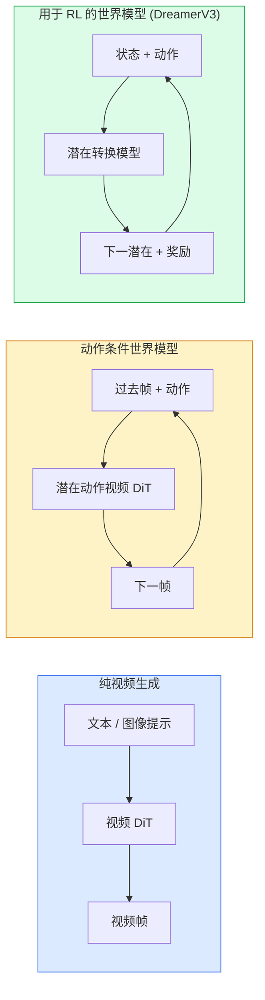

# 世界模型与视频扩散

> 一个能预测场景接下来几秒的视频模型是一个世界模拟器。将预测以动作为条件，你就拥有了一个可学习的游戏引擎。

**类型:** 学习 + 动手实现
**语言:** Python
**前置要求:** Phase 4 Lesson 10 (扩散)、Phase 4 Lesson 12 (视频理解)、Phase 4 Lesson 23 (DiT + 整流流)
**时间:** ~75 分钟

## 学习目标

- 解释纯视频生成模型（Sora 2）和动作条件世界模型（Genie 3、DreamerV3）之间的区别
- 描述视频 DiT：时空 patch、3D 位置编码、在 (T, H, W) token 上的联合注意力
- 追踪世界模型如何接入机器人：VLM 规划 → 视频模型模拟 → 逆动力学发出动作
- 根据给定用例（创意视频、交互式仿真、自动驾驶合成）在 Sora 2、Genie 3、Runway GWM-1 Worlds、Wan-Video 和 HunyuanVideo 之间选择

## 问题

视频生成和世界建模在 2026 年合流。能生成一分钟连贯视频的模型，在某种意义上，已经学会了世界如何运动：物体恒常性、重力、因果性、风格。如果你将预测以动作为条件（向左走、开门），视频模型就变成了一个可学习的模拟器，可以替代游戏引擎、驾驶模拟器或机器人环境。

赌注是具体的。Genie 3 从单张图像生成可玩游戏环境。Runway GWM-1 Worlds 合成无限可探索场景。Sora 2 产生带同步音频和物理建模的分钟长视频。NVIDIA Cosmos-Drive、Wayve Gaia-2 和 Tesla DrivingWorld 为自动驾驶训练数据生成逼真驾驶视频。世界模型范式正在悄悄接管机器人学的 sim-to-real。

本课是 Phase 4 的"大局"课。它将图像生成、视频理解和 Agent 推理连接到主导研究正走向的架构模式。

## 概念

### 世界建模的三个家族



- **Sora 2** 是以提示为条件的纯视频生成。无动作接口。你无法在 rollout 中途"操控"它。
- **Genie 3**、**GWM-1 Worlds**、**Mirage / Magica** 是动作条件世界模型。从观察到的视频中推断潜在动作，然后以动作条件化未来帧预测。交互式——你按键或移动相机，场景响应。
- **DreamerV3** 和经典 RL 世界模型族在带有显式动作条件的潜在空间预测，用奖励信号训练。不那么视觉化；对样本高效 RL 更有用。

### 视频 DiT 架构

```
视频潜变量:          (C, T, H, W)
Patchify（空间）:    每帧 P_h x P_w 个 patch 的网格
Patchify（时间）:    将 P_t 帧分组为一个时间 patch
结果 token:           (T / P_t) * (H / P_h) * (W / P_w) 个 token
```

位置编码是 3D 的：每个 (t, h, w) 坐标的旋转或学习嵌入。注意力可以是：

- **完全联合**——所有 token 互相注意。O(N^2)，N 是 token 数。对长视频不可行。
- **分段**——交替时间注意力（同一空间位置，跨时间：`(H*W) * T^2`）和空间注意力（同一时间步，跨空间：`T * (H*W)^2`）。TimeSformer 和大多数视频 DiT 使用。
- **窗口**——(t, h, w) 中的局部窗口。Video Swin 使用。

每个 2026 年视频扩散模型使用这三种模式之一，加上 AdaLN 条件化（Lesson 23）和整流流。

### 动作条件化：潜在动作模型

Genie 通过辨别性地预测一对连续帧之间的动作来学习每帧的**潜在动作**。模型的解码器然后以推断的潜在动作为条件——而非显式键盘键。在推理时，用户可以指定一个潜在动作（或从新的先验采样），模型生成与该动作一致的下一帧。

Sora 完全跳过动作接口。其解码器从过去时空 token 预测下一时空 token。提示条件化开始；生成中途无操控。

### 物理合理性

Sora 2 的 2026 年发布明确宣传**物理合理性**：重量、平衡、物体恒常性、因果。通过团队手动评定的合理性分数测量；与 Sora 1 相比，模型在掉落物体、人物碰撞和故意失败（跳跃失误）上明显改进。

合理性仍然是主要失败模式。2024-2025 年人们吃意大利面或用杯子喝水的视频暴露了模型缺乏持久物体表示。2026 年模型（Sora 2、Runway Gen-5、HunyuanVideo）减少了但不消除这些问题。

### 自动驾驶世界模型

驾驶世界模型以轨迹、边界框或导航地图为条件生成逼真路景。用途：

- **Cosmos-Drive-Dreams**（NVIDIA）——为 RL 训练生成分钟级驾驶视频。
- **Gaia-2**（Wayve）——用于策略评估的轨迹条件场景合成。
- **DrivingWorld**（Tesla）——模拟多样天气、一天中不同时间、交通状况。
- **Vista**（ByteDance）——反应式驾驶场景合成。

它们替代昂贵的真实世界数据采集——角案例（行人夜间乱穿马路、结冰路口、特殊车型）否则需要数百万英里驾驶。

### 机器人技术栈：VLM + 视频模型 + 逆动力学

新兴的三组件机器人循环：

1. **VLM** 解析目标（"拿起红杯子"），规划高级动作序列。
2. **视频生成模型** 模拟执行每个动作会是什么样子——预测 N 帧后的观测。
3. **逆动力学模型** 提取产生那些观测的具体电机命令。

这替代了奖励塑造和样本密集的 RL。世界模型做想象；逆动力学在执行上闭环。Genie Envisioner 是一个实例化；许多研究团队正在向这个结构收敛。

### 评估

- **视觉质量**——FVD（Fréchet 视频距离）、用户研究。
- **提示对齐**——逐帧 CLIPScore、VQA 风格评估。
- **物理合理性**——在基准套件上手动评定（Sora 2 内部基准、VBench）。
- **可控性**（对于交互式世界模型）——动作 → 观测一致性；你能回到之前状态吗？

### 2026 年模型格局

| 模型 | 用途 | 参数量 | 输出 | 许可 |
|------|-----|------------|--------|---------|
| Sora 2 | 文生视频，音频 | — | 1 分钟 1080p + 音频 | 仅 API |
| Runway Gen-5 | 文/图生视频 | — | 10 秒片段 | API |
| Runway GWM-1 Worlds | 交互式世界 | — | 无限 3D rollout | API |
| Genie 3 | 从图像生成交互式世界 | 11B+ | 可玩游戏帧 | 研究预览 |
| Wan-Video 2.1 | 开源文生视频 | 14B | 高质量片段 | 非商业 |
| HunyuanVideo | 开源文生视频 | 13B | 10 秒片段 | 宽松 |
| Cosmos / Cosmos-Drive | 自动驾驶仿真 | 7-14B | 驾驶场景 | NVIDIA 开源 |
| Magica / Mirage 2 | AI 原生游戏引擎 | — | 可修改世界 | 产品 |

## 动手实现

### 步骤 1：视频的 3D patchify

```python
import torch
import torch.nn as nn


class VideoPatch3D(nn.Module):
    def __init__(self, in_channels=4, dim=64, patch_t=2, patch_h=2, patch_w=2):
        super().__init__()
        self.proj = nn.Conv3d(
            in_channels, dim,
            kernel_size=(patch_t, patch_h, patch_w),
            stride=(patch_t, patch_h, patch_w),
        )
        self.patch_t = patch_t
        self.patch_h = patch_h
        self.patch_w = patch_w

    def forward(self, x):
        # x: (N, C, T, H, W)
        x = self.proj(x)
        n, c, t, h, w = x.shape
        tokens = x.reshape(n, c, t * h * w).transpose(1, 2)
        return tokens, (t, h, w)
```

步长等于核大小的 3D 卷积充当时空 patchifier。`(T, H, W) -> (T/2, H/2, W/2)` token 网格。

### 步骤 2：3D 旋转位置编码

沿 `t`、`h`、`w` 轴分别应用的旋转位置嵌入（RoPE）：

```python
def rope_3d(tokens, t_dim, h_dim, w_dim, grid):
    """
    tokens: (N, T*H*W, D)
    grid: (T, H, W) sizes
    t_dim + h_dim + w_dim == D
    """
    T, H, W = grid
    n, seq, d = tokens.shape
    if t_dim + h_dim + w_dim != d:
        raise ValueError(f"t_dim+h_dim+w_dim ({t_dim}+{h_dim}+{w_dim}) must equal D={d}")
    assert seq == T * H * W
    t_idx = torch.arange(T, device=tokens.device).repeat_interleave(H * W)
    h_idx = torch.arange(H, device=tokens.device).repeat_interleave(W).repeat(T)
    w_idx = torch.arange(W, device=tokens.device).repeat(T * H)
    # 简化：仅按频率缩放通道。真实 RoPE 旋转配对通道。
    freqs_t = torch.exp(-torch.log(torch.tensor(10000.0)) * torch.arange(t_dim // 2, device=tokens.device) / (t_dim // 2))
    freqs_h = torch.exp(-torch.log(torch.tensor(10000.0)) * torch.arange(h_dim // 2, device=tokens.device) / (h_dim // 2))
    freqs_w = torch.exp(-torch.log(torch.tensor(10000.0)) * torch.arange(w_dim // 2, device=tokens.device) / (w_dim // 2))
    emb_t = torch.cat([torch.sin(t_idx[:, None] * freqs_t), torch.cos(t_idx[:, None] * freqs_t)], dim=-1)
    emb_h = torch.cat([torch.sin(h_idx[:, None] * freqs_h), torch.cos(h_idx[:, None] * freqs_h)], dim=-1)
    emb_w = torch.cat([torch.sin(w_idx[:, None] * freqs_w), torch.cos(w_idx[:, None] * freqs_w)], dim=-1)
    return tokens + torch.cat([emb_t, emb_h, emb_w], dim=-1)
```

简化加法形式。真实 RoPE 按频率旋转配对通道；位置信息相同。

### 步骤 3：分段注意力块

```python
class DividedAttentionBlock(nn.Module):
    def __init__(self, dim=64, heads=2):
        super().__init__()
        self.time_attn = nn.MultiheadAttention(dim, heads, batch_first=True)
        self.space_attn = nn.MultiheadAttention(dim, heads, batch_first=True)
        self.ln1 = nn.LayerNorm(dim)
        self.ln2 = nn.LayerNorm(dim)
        self.ln3 = nn.LayerNorm(dim)
        self.mlp = nn.Sequential(nn.Linear(dim, 4 * dim), nn.GELU(), nn.Linear(4 * dim, dim))

    def forward(self, x, grid):
        T, H, W = grid
        n, seq, d = x.shape
        # 时间注意力：同一 (h, w)，跨时间
        xt = x.view(n, T, H * W, d).permute(0, 2, 1, 3).reshape(n * H * W, T, d)
        a, _ = self.time_attn(self.ln1(xt), self.ln1(xt), self.ln1(xt), need_weights=False)
        xt = (xt + a).reshape(n, H * W, T, d).permute(0, 2, 1, 3).reshape(n, seq, d)
        # 空间注意力：同一 t，跨 (h, w)
        xs = xt.view(n, T, H * W, d).reshape(n * T, H * W, d)
        a, _ = self.space_attn(self.ln2(xs), self.ln2(xs), self.ln2(xs), need_weights=False)
        xs = (xs + a).reshape(n, T, H * W, d).reshape(n, seq, d)
        xs = xs + self.mlp(self.ln3(xs))
        return xs
```

时间注意力在每个空间位置内跨时间注意；空间注意力在每帧内跨位置注意。两个 O(T^2 + (HW)^2) 操作代替一个 O((THW)^2)。这是 TimeSformer 和每个现代视频 DiT 的核心。

### 步骤 4：组合微型视频 DiT

```python
class TinyVideoDiT(nn.Module):
    def __init__(self, in_channels=4, dim=64, depth=2, heads=2):
        super().__init__()
        self.patch = VideoPatch3D(in_channels=in_channels, dim=dim, patch_t=2, patch_h=2, patch_w=2)
        self.blocks = nn.ModuleList([DividedAttentionBlock(dim, heads) for _ in range(depth)])
        self.out = nn.Linear(dim, in_channels * 2 * 2 * 2)

    def forward(self, x):
        tokens, grid = self.patch(x)
        for blk in self.blocks:
            tokens = blk(tokens, grid)
        return self.out(tokens), grid
```

不是一个可用的视频生成器；是一个结构性演示，显示每个部件如何正确形状。

### 步骤 5：检查形状

```python
vid = torch.randn(1, 4, 8, 16, 16)  # (N, C, T, H, W)
model = TinyVideoDiT()
out, grid = model(vid)
print(f"input  {tuple(vid.shape)}")
print(f"tokens grid {grid}")
print(f"output {tuple(out.shape)}")
```

期望 `grid = (4, 8, 8)` 和 `out = (1, 256, 32)` 在 patchify 后；然后 head 投影到逐 token 时空 patch，准备 un-patchify 回视频。

## 用现成库

2026 年生产接入模式：

- **Sora 2 API**（OpenAI）——文生视频，同步音频。高端定价。
- **Runway Gen-5 / GWM-1**（Runway）——图生视频，交互式世界。
- **Wan-Video 2.1 / HunyuanVideo**——开源自托管。
- **Cosmos / Cosmos-Drive**（NVIDIA）——驾驶仿真开源权重。
- **Genie 3**——研究预览，请求访问。

构建交互式世界模型演示：从 Wan-Video 开始获得质量，在其上叠加潜在动作适配器以实现交互性。对于自动驾驶仿真：Cosmos-Drive 是 2026 年开源参考。

对于机器人，真实世界的栈：

1. 语言目标 -> VLM（Qwen3-VL）-> 高级计划。
2. 计划 -> 潜在动作视频模型 -> 想象 rollout。
3. Rollout -> 逆动力学模型 -> 低级动作。
4. 动作执行 -> 观测反馈回步骤 1。

## 产出

本课产出：

- `outputs/prompt-video-model-picker.md` ——根据任务、许可和延迟在 Sora 2 / Runway / Wan / HunyuanVideo / Cosmos 之间选择。
- `outputs/skill-physical-plausibility-checks.md` ——一个 skill，定义在发货前对任何生成视频运行的自动化检查（物体恒常性、重力、连续性）。

## 练习

1. **（简单）** 计算 5 秒 360p 视频在 patch-t=2、patch-h=8、patch-w=8 下的 token 数量。思考此规模下注意力的内存。
2. **（中等）** 将上面的分段注意力块替换为完全联合注意力块，测量形状和参数量。解释为什么分段注意力对真实视频模型是必要的。
3. **（困难）** 构建一个最小潜在动作视频模型：取（frame_t, action_t, frame_{t+1}）三元组的数据集（任何简单 2D 游戏），训练一个以动作嵌入为条件的微型视频 DiT，并展示不同动作产生不同的下一帧。

## 关键术语

| 术语 | 行话 | 实际含义 |
|------|------|----------|
| 世界模型 | "可学习模拟器" | 给定状态和动作预测未来观测的模型 |
| 视频 DiT | "时空 transformer" | 带 3D patchify 和分段注意力的扩散 transformer |
| 潜在动作 | "推断的控制" | 从帧对推断的离散或连续动作潜变量；用于条件化下一帧生成 |
| 分段注意力 | "先时间后空间" | 每块两次注意力操作——先跨时间再跨空间——使 O(N^2) 可控 |
| 物体恒常性 | "事物保持真实" | 视频模型必须学习的场景属性；食物、玻璃器皿上的经典失败模式 |
| FVD | "Fréchet 视频距离" | FID 的视频等价物；主要视觉质量指标 |
| 逆动力学模型 | "观测到动作" | 给定（状态，下一状态），输出连接它们的动作；闭环机器人循环 |
| Cosmos-Drive | "NVIDIA 驾驶仿真" | 用于 RL 和评估的开源权重自动驾驶世界模型 |

## 扩展阅读

- [Sora technical report (OpenAI)](https://openai.com/index/video-generation-models-as-world-simulators/)
- [Genie: Generative Interactive Environments (Bruce et al., 2024)](https://arxiv.org/abs/2402.15391) — 潜在动作世界模型
- [TimeSformer (Bertasius et al., 2021)](https://arxiv.org/abs/2102.05095) — 视频 transformer 分段注意力
- [DreamerV3 (Hafner et al., 2023)](https://arxiv.org/abs/2301.04104) — 用于 RL 的世界模型
- [Cosmos-Drive-Dreams (NVIDIA, 2025)](https://research.nvidia.com/labs/toronto-ai/cosmos-drive-dreams/) — 驾驶世界模型
- [Top 10 Video Generation Models 2026 (DataCamp)](https://www.datacamp.com/blog/top-video-generation-models)
- [From Video Generation to World Model — survey repo](https://github.com/ziqihuangg/Awesome-From-Video-Generation-to-World-Model/)