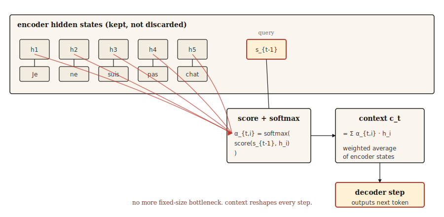

# 注意力机制——突破

> 解码器不再眯着眼睛看压缩摘要，开始看整个源。之后的everything都是注意力加工程。

**类型：** 构建
**语言：** Python
**先修课程：** Phase 5 · 09（序列到序列模型）
**耗时：** 约 45 分钟

## 问题

第 09 课以可衡量的失败告终。在玩具复制任务上训练的 GRU 编码器-解码器，长度从 5 的 89% 准确率到长度 80 的接近随机。原因是结构性的，不是训练 bug：编码器提取的每一点信息都必须装入一个固定大小的隐藏状态，而解码器从不看别的东西。

Bahdanau、Cho 和 Bengio 在 2014 年发表了仅仅三行的修复。不再只给解码器最终编码器状态，而是保留每个编码器状态。在每个解码器步，计算编码器状态的加权平均，其中权重说"解码器现在需要多少关注编码器位置 `i`？"那个加权平均就是上下文向量，它在每个解码器步都会变化。

这就是全部想法。Transformer 扩展了它。自注意力将它应用于单一序列。多头注意力并行运行它。但 2014 版本已经打破了瓶颈，一旦你有了它，转向 Transformer 就是工程问题，不是概念问题。

## 概念



在每个解码器步 `t`：

1. 使用前一个解码器隐藏状态 `s_{t-1}` 作为**查询（Query）**。
2. 对每个编码器隐藏状态 `h_1, ..., h_T` 打分。每个编码器位置一个标量。
3. Softmax 分数得到注意力权重 `α_{t,1}, ..., α_{t,T}`，加起来为 1。
4. 上下文向量 `c_t = Σ α_{t,i} * h_i`。编码器状态的加权平均。
5. 解码器取 `c_t` 加上前一个输出 token，产生下一个 token。

加权平均是关键。当解码器需要将 "Je" 翻译为 "I" 时，它将编码器状态 over "Je" 权重设高，其他设低。当需要 "not" 时，将 "pas" 权重设高。上下文向量在每一步重塑。

## 形状（每个人都会踩坑的地方）

这是每个注意力实现第一次都会出错的地方。慢慢读。

| 事物 | 形状 | 说明 |
|------|------|------|
| 编码器隐藏状态 `H` | `(T_enc, d_h)` | 如果是 BiLSTM，`d_h = 2 * d_hidden` |
| 解码器隐藏状态 `s_{t-1}` | `(d_s,)` | 一个向量 |
| 注意力分数 `e_{t,i}` | 标量 | 每个编码器位置一个 |
| 注意力权重 `α_{t,i}` | 标量 | 在所有 `i` 上 softmax 后 |
| 上下文向量 `c_t` | `(d_h,)` | 与编码器状态形状相同 |

**Bahdanau（加性）分数。** `e_{t,i} = v_α^T * tanh(W_a * s_{t-1} + U_a * h_i)`。

- `s_{t-1}` 形状为 `(d_s,)`，`h_i` 形状为 `(d_h,)`。
- `W_a` 形状为 `(d_attn, d_s)`。`U_a` 形状为 `(d_attn, d_h)`。
- 它们在 tanh 内的和形状为 `(d_attn,)`。
- `v_α` 形状为 `(d_attn,)`。与 `v_α` 的内积塌缩为标量。**这就是 `v_α` 做的事。** 不是魔法。它是将注意力维度向量投影为标量分数的投影。

**Luong（乘性）分数。** 三种变体：

- `dot`: `e_{t,i} = s_t^T * h_i`。要求 `d_s == d_h`。硬约束。如果编码器是双向的，跳过这个。
- `general`: `e_{t,i} = s_t^T * W * h_i`，`W` 形状为 `(d_s, d_h)`。消除等维度约束。
- `concat`: 本质上是 Bahdanau 形式。自从前两种更便宜后就很少用了。

**一个值得指出的 Bahdanau / Luong 陷阱。** Bahdanau 使用 `s_{t-1}`（解码器状态*在生成当前词*之前）。Luong 使用 `s_t`（状态*在生成之后*）。混淆它们会产生微妙错误的梯度，极难调试。选择一篇论文并坚持其约定。

## 构建

### 步骤 1：加性（Bahdanau）注意力

```python
import numpy as np


def additive_attention(decoder_state, encoder_states, W_a, U_a, v_a):
    projected_dec = W_a @ decoder_state
    projected_enc = encoder_states @ U_a.T
    combined = np.tanh(projected_enc + projected_dec)
    scores = combined @ v_a
    weights = softmax(scores)
    context = weights @ encoder_states
    return context, weights


def softmax(x):
    x = x - np.max(x)
    e = np.exp(x)
    return e / e.sum()
```

根据上表检查形状。`encoder_states` 形状为 `(T_enc, d_h)`。`projected_enc` 形状为 `(T_enc, d_attn)`。`projected_dec` 形状为 `(d_attn,)` 并广播。`combined` 形状为 `(T_enc, d_attn)`。`scores` 形状为 `(T_enc,)`。`weights` 形状为 `(T_enc,)`。`context` 形状为 `(d_h,)`。可以交付。

### 步骤 2：Luong dot 和 general

```python
def dot_attention(decoder_state, encoder_states):
    scores = encoder_states @ decoder_state
    weights = softmax(scores)
    return weights @ encoder_states, weights


def general_attention(decoder_state, encoder_states, W):
    projected = W.T @ decoder_state
    scores = encoder_states @ projected
    weights = softmax(scores)
    return weights @ encoder_states, weights
```

各三行。这就是为什么 Luong 的论文受到关注。大多数任务上相同准确率，代码少很多。

### 步骤 3：数值示例

给定三个编码器状态（大致"cat"、"sat"、"mat"）和一个与第一个最对齐的解码器状态，注意力分布集中在位置 0。如果解码器状态移动到与第三个编码器状态更近，注意力移动到位置 2。上下文向量跟踪。

```python
H = np.array([
    [1.0, 0.0, 0.2],
    [0.5, 0.5, 0.1],
    [0.1, 0.9, 0.3],
])

s_close_to_cat = np.array([0.9, 0.1, 0.2])
ctx, w = dot_attention(s_close_to_cat, H)
print("weights:", w.round(3))
```

```
weights: [0.464 0.305 0.231]
```

第一行赢了。然后将解码器状态移近第三个编码器状态，看权重移动。就这样。注意力是显式的对齐。

### 步骤 4：为什么这是通往 Transformer 的桥梁

将上面的语言转化为 Q/K/V：

- **查询（Query）** = 解码器状态 `s_{t-1}`
- **键（Key）** = 编码器状态（我们要打分的对象）
- **值（Value）** = 编码器状态（我们要加权求和的对象）

在经典注意力中，键和值是一样的东西。自注意力分开了它们：你可以用不同的学习投影查 K 和 V 来查询序列本身。多头注意力用不同学习投影并行运行。Transformer 将整个阶段堆叠多次并丢弃 RNN。

数学相同。形状相同。从 Bahdanau 注意力到缩放点积注意力的教学跳跃大部分是记号上的。

## 使用

PyTorch 和 TensorFlow 直接提供注意力。

```python
import torch
import torch.nn as nn

mha = nn.MultiheadAttention(embed_dim=128, num_heads=8, batch_first=True)
query = torch.randn(2, 5, 128)
key = torch.randn(2, 10, 128)
value = torch.randn(2, 10, 128)

output, weights = mha(query, key, value)
print(output.shape, weights.shape)
```

```
torch.Size([2, 5, 128]) torch.Size([2, 5, 10])
```

这是一个 Transformer 注意力层。查询批量 5 个位置，键/值批量 10 个位置，各 128 维，8 个头。`output` 是新的上下文增强查询。`weights` 是 5×10 的对齐矩阵，可以可视化。

### 何时经典注意力仍然重要

- 教学。单头、单层、基于 RNN 的版本使每个概念都可见。
- 设备上的序列任务，Transformer 放不下。
- 2014-2017 年的任何论文。不知道 Bahdanau 的约定你会误读它。
- MT 中的细粒度对齐分析。在 Transformer 模型上原始注意力权重是可解释性工具，读懂它们需要知道它们是什么。

### 注意力权重作为解释的陷阱

注意力权重看起来可解释。它们是加和为 1 的位置权重；你可以绘制它们；高意味着"看了这个"。审稿人喜欢它们。

它们不像看起来那么可解释。Jain 和 Wallace（2019）证明注意力分布可以被置换并被任意替代替换，而不改变某些任务的模型预测。永远不要在没有消融或反事实检查的情况下将注意力权重作为推理证据报告。

## 交付

保存为 `outputs/prompt-attention-shapes.md`：

```markdown
---
name: attention-shapes
description: 调试注意力实现中的形状 bug。
phase: 5
lesson: 10
---

给定一个损坏的注意力实现，你识别形状不匹配。输出：

1. 哪个矩阵形状错误。命名张量。
2. 它应该是什么形状，从 (d_s, d_h, d_attn, T_enc, T_dec, batch_size) 推导。
3. 一行修复。转置、重塑或投影。
4. 捕获回归的测试。通常：`assert output.shape == (batch, T_dec, d_h)` 和 `weights.shape == (batch, T_dec, T_enc)` 和 `weights.sum(dim=-1) close to 1`。

拒绝推荐静默广播的修复。广播隐藏的 bug 在之后作为静默准确率下降浮现，是最糟糕的注意力 bug。

对于 Bahdanau 混淆，坚持解码器输入是 `s_{t-1}`（前一步状态）。对于 Luong，是 `s_t`（后一步状态）。对于点积，标记查询和键之间的维度不匹配为最常见的初次错误。
```

## 练习

1. **简单。** 实现 `softmax` 掩码，使编码器中的填充 token 得到零注意力权重。在有可变长度序列的批上测试。
2. **中等。** 在 Luong `general` 形式中添加多头注意力。将 `d_h` 分成 `n_heads` 组，每头运行注意力，拼接。验证单头情况与之前的实现匹配。
3. **困难。** 在第 09 课的玩具复制任务上训练带 Bahdanau 注意力的 GRU 编码器-解码器。绘制准确率 vs 序列长度。与无注意力基线比较。你应该看到随着长度增长差距扩大，确认注意力提升了瓶颈。

## 关键术语

| 术语 | 常见说法 | 实际含义 |
|------|---------|---------|
| 注意力 | 看东西 | 值序列的加权平均，权重由查询-键相似度计算。 |
| Query, Key, Value | QKV | 三个投影：Q 提问，K 是要匹配的，V 是要返回的。 |
| 加性注意力 | Bahdanau | 前馈分数：`v^T tanh(W q + U k)`。 |
| 乘性注意力 | Luong dot / general | 分数是 `q^T k` 或 `q^T W k`。更便宜，大多数任务相同准确率。 |
| 对齐矩阵 | 那个漂亮的图 | 注意力权重作为 `(T_dec, T_enc)` 网格。读它可以看到模型关注了什么。 |

## 延伸阅读

- [Bahdanau, Cho, Bengio (2014). Neural Machine Translation by Jointly Learning to Align and Translate](https://arxiv.org/abs/1409.0473) —— 那篇论文。
- [Luong, Pham, Manning (2015). Effective Approaches to Attention-based Neural Machine Translation](https://arxiv.org/abs/1508.04025) —— 三种分数变体及其比较。
- [Jain and Wallace (2019). Attention is not Explanation](https://arxiv.org/abs/1902.10186) —— 可解释性警告。
- [Dive into Deep Learning — Bahdanau Attention](https://d2l.ai/chapter_attention-mechanisms-and-transformers/bahdanau-attention.html) —— 带 PyTorch 的可运行演练。