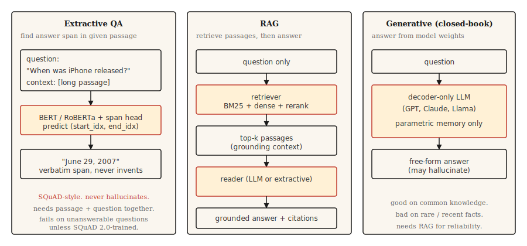

# 问答系统

> 三种系统塑造了现代 QA。抽取式找到跨度。检索增强使它们扎根于文档。生成式产生答案。每个现代 AI 助手都是三者的混合。

**类型：** 构建
**语言：** Python
**先修课程：** Phase 5 · 11（机器翻译）、Phase 5 · 10（注意力机制）
**耗时：** 约 75 分钟

## 问题

用户输入"什么时候发布的第一款 iPhone？"期望"2007 年 6 月 29 日"。不是"苹果公司的历史漫长而多样"。不是"2007"孤立存在没有句子。直接、有据、正确的答案。

过去十年中三种架构主导了 QA。

- **抽取式 QA。** 给定一个问题和一个已知包含答案的段落，找出答案跨度在段落中的起始和结束索引。SQuAD 是规范基准。
- **开放域 QA。** 不给定段落。先检索相关段落，然后抽取或生成答案。这是今天每个 RAG 流水线的基石。
- **生成式/闭卷 QA。** 大型语言模型从其参数记忆中回答。无检索。推理最快，事实最不可靠。

2026 年的趋势是混合：检索最好的几个段落，然后提示生成模型在这些段落中有据可查地回答。那就是 RAG，第 14 课深度涵盖检索的一半。本课构建 QA 的一半。

## 概念



**抽取式。** 用 Transformer（BERT 系列）一起编码问题和段落。训练两个头预测答案跨度的起始和结束 token 索引。损失是有效位置上的交叉熵。输出是段落中的一个跨度。按结构永不合幻觉（第 11 课），按结构不处理段落无法回答的问题。

**检索增强（RAG）。** 两个阶段。首先，检索器从语料库中找到 top-`k` 个段落。其次，阅读器（抽取式或生成式）使用这些段落产生答案。检索器-阅读器分离让每个都可以独立训练和评估。现代 RAG 通常在两者之间添加重排器。

**生成式。** 一个仅解码器的 LLM（GPT、Claude、Llama）从学习权重中回答。无检索步骤。在常识上出色，在罕见或近期事实上灾难性。幻觉率与预训练数据中事实频率负相关。

## 构建

### 步骤 1：用预训练模型做抽取式 QA

```python
from transformers import pipeline

qa = pipeline("question-answering", model="deepset/roberta-base-squad2")

passage = (
    "Apple Inc. released the first iPhone on June 29, 2007. "
    "The device was announced by Steve Jobs at Macworld in January 2007."
)
question = "When was the first iPhone released?"

answer = qa(question=question, context=passage)
print(answer)
```

```python
{'score': 0.98, 'start': 57, 'end': 70, 'answer': 'June 29, 2007'}
```

`deepset/roberta-base-squad2` 在 SQuAD 2.0 上训练，包括不可回答的问题。默认情况下，`question-answering` 流水线即使在模型的空分数获胜时也返回得分最高的跨度——它*不会*自动返回空答案。要获得明确的"无答案"行为，在流水线调用中传入 `handle_impossible_answer=True`：然后只有当空分数超过每个跨度分数时，流水线才返回空答案。无论哪种方式，始终检查 `score` 字段。

### 步骤 2：检索增强流水线（概述）

```python
from sentence_transformers import SentenceTransformer
import numpy as np

encoder = SentenceTransformer("sentence-transformers/all-MiniLM-L6-v2")

corpus = [
    "Apple Inc. released the first iPhone on June 29, 2007.",
    "Macworld 2007 featured the iPhone announcement by Steve Jobs.",
    "Android launched in 2008 as Google's mobile operating system.",
    "The first iPod was released in 2001.",
]
corpus_embeddings = encoder.encode(corpus, normalize_embeddings=True)


def retrieve(question, top_k=2):
    q_emb = encoder.encode([question], normalize_embeddings=True)
    sims = (corpus_embeddings @ q_emb.T).squeeze()
    order = np.argsort(-sims)[:top_k]
    return [corpus[i] for i in order]


def answer(question):
    passages = retrieve(question, top_k=2)
    combined = " ".join(passages)
    return qa(question=question, context=combined)


print(answer("When was the first iPhone released?"))
```

两阶段流水线。密集检索器（Sentence-BERT）通过语义相似度找到相关段落。抽取式阅读器（RoBERTa-SQuAD）从组合的 top 段落中拉取答案跨度。适用于小型语料库。对于百万文档语料库，使用 FAISS 或向量数据库。

### 步骤 3：带 RAG 的生成式

```python
def rag_generate(question, llm):
    passages = retrieve(question, top_k=3)
    prompt = f"""Context:
{chr(10).join('- ' + p for p in passages)}

Question: {question}

Answer using only the context above. If the context does not contain the answer, say "I don't know."
"""
    return llm(prompt)
```

提示模式很重要。明确告诉模型扎根于上下文并在上下文不足时返回"I don't know"，与朴素提示相比将幻觉率降低 40-60%。更复杂的模式添加引用、置信度分数和结构化抽取。

### 步骤 4：反映真实世界的评估

SQuAD 使用 **精确匹配（EM）** 和 **token 级 F1**。EM 是在归一化后（转小写、去标点、去冠词）的严格匹配——预测要么完全匹配要么得 0。F1 在预测和参考之间的 token 重叠上计算，给予部分分数。两者都低估改写："June 29, 2007" vs "June 29th, 2007" 通常得 0 EM（序数词破坏归一化）但从重叠 token 中获得相当可观的 F1。

对于生产 QA：

- **答案准确率**（LLM 判断或人工判断，因为指标不能捕捉语义等价）。
- **引用准确率。** 引用的段落是否实际支持答案？通过生成引用和检索段落之间的字符串匹配可以自动轻松检查。
- **拒绝校准。** 当答案不在检索段落中时，系统是否正确说"I don't know"？测量虚假置信率。
- **检索召回率。** 在评估阅读器之前，测量检索器是否将正确答案段落放入 top-`k`。阅读器无法修复缺失的段落。

### RAGAS：2026 年生产评估框架

`RAGAS` 为 RAG 系统量身打造，是 2026 年的上线默认。它在不要求黄金参考的情况下评分四个维度：

- **忠实度。** 答案中的每个声明是否来自检索的上下文？通过基于 NLI 的蕴含关系测量。你主要的幻觉指标。
- **答案相关性。** 答案是否回答了问题？通过从答案生成假设性问题并与真实问题比较来测量。
- **上下文精确率。** 检索的块中有多大比例实际相关？低精确率 = 提示中的噪音。
- **上下文召回率。** 检索集是否包含所有需要的信息？低召回率 = 阅读器无法成功。

无参考评分让你可以在实时生产流量上评估，无需精心策划的黄金答案。在开放式问题（精确匹配指标无用）上叠加 LLM 即评判。

`pip install ragas`。插入你的检索器 + 阅读器。每个查询得到四个标量。警惕回归。

## 使用

2026 年技术栈。

| 用途 | 推荐 |
|------|------|
| 给定段落，找答案跨度 | `deepset/roberta-base-squad2` |
| 在固定语料库上，不可接受闭卷 | RAG：密集检索器 + LLM 阅读器 |
| 实时跨文档存储 | 带混合（BM25 + 密集）检索器的 RAG + 重排器（第 14 课） |
| 对话 QA（后续问题） | 带对话历史的 LLM + 每轮 RAG |
| 高事实性、受监管领域 | 在权威语料库上的抽取式；永远不要单独生成式 |

2026 年由于带 LLM 的 RAG 处理更多情况，抽取式 QA 已过时。它仍然在需要逐字引用的情况下线：法律研究、监管合规、审计工具。

## 交付

保存为 `outputs/skill-qa-architect.md`：

```markdown
---
name: qa-architect
description: 选择 QA 架构、检索策略和评估计划。
version: 1.0.0
phase: 5
lesson: 13
tags: [nlp, qa, rag]
---

给定需求（语料库大小、问题类型、事实性约束、延迟预算），输出：

1. 架构。抽取式、带抽取式阅读器的 RAG、带生成式阅读器的 RAG 或闭卷 LLM。一句话理由。
2. 检索器。无、BM25、密集（命名编码器）或混合。
3. 阅读器。SQuAD 调优模型、按名称的 LLM 或"领域微调 DistilBERT"。
4. 评估。抽取式基准的 EM + F1；生产用的答案准确率 + 引用准确率 + 拒绝校准。命名你在测量什么以及如何测量。

对于监管或合规敏感问题，拒绝闭卷 LLM 回答。拒绝没有任何检索召回率基线的 QA 系统（你无法评估阅读器而不知道检索器是否浮现了正确答案段落）。标记需要多跳推理的问题为需要专门的 Multi-hop 检索器（如 HotpotQA 训练的系统）。
```

## 练习

1. **简单。** 在 10 篇维基百科段落上设置上面的 SQuAD 抽取式流水线。手工制作 10 个问题。测量答案正确的频率。如果段落和问题干净，你应该看到 7-9 个正确。
2. **中等。** 添加拒绝分类器。当 top 检索分数低于阈值（例如 0.3 余弦）时，返回"I don't know"而不是调用阅读器。在留出集上调优阈值。
3. **困难。** 在你选择的 10,000 文档语料库上构建 RAG 流水线。实现带 RRF 融合的混合检索（BM25 + 密集）（见第 14 课）。在有和没有混合步骤的情况下测量答案准确率。记录哪种问题类型受益最多。

## 关键术语

| 术语 | 常见说法 | 实际含义 |
|------|---------|---------|
| 抽取式 QA | 找答案跨度 | 在给定段落内预测答案的起始和结束索引。 |
| 开放域 QA | 在语料库上 QA | 无给定段落；必须先检索后回答。 |
| RAG | 先检索后生成 | 检索增强生成。检索器 + 阅读器流水线。 |
| SQuAD | 规范基准 | 斯坦福问答数据集。EM + F1 指标。 |
| 幻觉 | 编造答案 | 阅读器输出不被检索上下文支持。 |
| 拒绝校准 | 知道何时闭嘴 | 系统在无法回答时正确说"I don't know"。 |

## 延伸阅读

- [Rajpurkar et al. (2016). SQuAD: 100,000+ Questions for Machine Comprehension of Text](https://arxiv.org/abs/1606.05250) —— 基准论文。
- [Karpukhin et al. (2020). Dense Passage Retrieval for Open-Domain QA](https://arxiv.org/abs/2004.04906) —— QA 规范密集检索器 DPR。
- [Lewis et al. (2020). Retrieval-Augmented Generation for Knowledge-Intensive NLP Tasks](https://arxiv.org/abs/2005.11401) —— 命名 RAG 的论文。
- [Gao et al. (2023). Retrieval-Augmented Generation for Large Language Models: A Survey](https://arxiv.org/abs/2312.10997) —— 综合 RAG 综述。