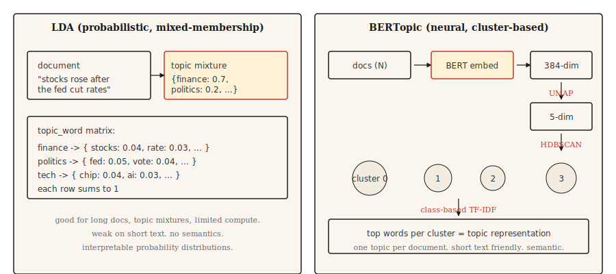

# 主题建模——LDA 与 BERTopic

> LDA：文档是主题的混合，每个主题是词的分布。BERTopic：文档在嵌入空间中聚类，簇是主题。同一个目标，不同的原语。

**类型：** 学习
**语言：** Python
**先修课程：** Phase 5 · 02（BoW + TF-IDF）、Phase 5 · 03（Word2Vec）
**耗时：** 约 45 分钟

## 问题

你有 10,000 张客户支持工单、50,000 篇新闻文章或 200,000 条推文。你需要知道集合是关于什么的，而无需阅读它。你没有标注类别。你甚至不知道有多少类别。

主题建模无需监督地回答这个问题。给它一个语料库，得到一组小而连贯的主题，对每个文档得到在这些主题上的分布。

两种算法家族主导。LDA（2003）将每个文档视为隐主题的混合，每个主题是词的分布。推理是贝叶斯的。当你在生产中需要混合成员主题分配和可解释的词级概率分布时，它仍然在使用。

BERTopic（2020）用 BERT 编码文档，用 UMAP 降维，用 HDBSCAN 聚类，用类 TF-IDF 提取主题词。它在短文本、社交媒体以及语义相似度比词重叠更重要的地方胜出。一个文档得到一个主题，这对长篇内容是一个限制。

本课为两者构建直觉，并命名对于给定语料库选哪个。

## 概念



**LDA 生成故事。** 每个主题是词的分布。每个文档是主题的混合。要在文档中生成一个词，从文档的混合中采样一个主题，然后从该主题的分布中采样一个词。推理反转这个：给定观察到的词，推断每个文档的主题分布和每个主题的词分布。折叠吉布斯采样或变分贝叶斯做数学。

关键 LDA 输出：

- `doc_topic`：矩阵 `(n_docs, n_topics)`，每行和为 1（文档的主题混合）。
- `topic_word`：矩阵 `(n_topics, vocab_size)`，每行和为 1（主题的词分布）。

**BERTopic 流水线。**

1. 用句子 Transformer（例如 `all-MiniLM-L6-v2`）编码每个文档。384 维向量。
2. 用 UMAP 降维到约 5 维。BERT 嵌入对聚类来说维度太高。
3. 用 HDBSCAN 聚类。基于密度，产生可变大小簇和一个"离群"标签。
4. 对每个簇，计算簇中文档的类 TF-IDF 以提取顶部词。

输出是每个文档一个主题（加 -1 离群标签）。可选地，通过 HDBSCAN 的概率向量的软成员资格。

## 构建

### 步骤 1：通过 scikit-learn 做 LDA

```python
from sklearn.feature_extraction.text import CountVectorizer
from sklearn.decomposition import LatentDirichletAllocation
import numpy as np


def fit_lda(documents, n_topics=5, max_features=1000):
    cv = CountVectorizer(
        max_features=max_features,
        stop_words="english",
        min_df=2,
        max_df=0.9,
    )
    X = cv.fit_transform(documents)
    lda = LatentDirichletAllocation(
        n_components=n_topics,
        random_state=42,
        max_iter=50,
        learning_method="online",
    )
    doc_topic = lda.fit_transform(X)
    feature_names = cv.get_feature_names_out()
    return lda, cv, doc_topic, feature_names


def print_top_words(lda, feature_names, n_top=10):
    for idx, topic in enumerate(lda.components_):
        top_idx = np.argsort(-topic)[:n_top]
        words = [feature_names[i] for i in top_idx]
        print(f"topic {idx}: {' '.join(words)}")
```

注意：去掉停用词，`min_df` 和 `max_df` 过滤稀有和 ubiquitous 词，CountVectorizer（不是 TfidfVectorizer），因为 LDA 期望原始计数。

### 步骤 2：BERTopic（生产）

```python
from bertopic import BERTopic

topic_model = BERTopic(
    embedding_model="sentence-transformers/all-MiniLM-L6-v2",
    min_topic_size=15,
    verbose=True,
)

topics, probs = topic_model.fit_transform(documents)
info = topic_model.get_topic_info()
print(info.head(20))
valid_topics = info[info["Topic"] != -1]["Topic"].tolist()
for topic_id in valid_topics[:5]:
    print(f"topic {topic_id}: {topic_model.get_topic(topic_id)[:10]}")
```

对 `Topic != -1` 的过滤丢弃 BERTopic 的离群桶（HDBSCAN 无法聚类的文档）。`min_topic_size` 控制 HDBSCAN 的最小簇大小；BERTopic 的库默认值是 10。本例为课程规模明确设为 15。对于超过 10,000 文档的语料库，增至 50 或 100。

### 步骤 3：评估

两种方法都输出主题词。问题是这些词是否连贯。

- **主题连贯性（c_v）。** 在滑动窗口上下文中组合顶部词对的 NPMI（归一化逐点互信息），将分数聚合成主题向量，并通过余弦相似度比较这些向量。越高越好。使用 `gensim.models.CoherenceModel` 的 `coherence="c_v"`。
- **主题多样性。** 所有主题顶部词中独特词的比例。越高越好（主题不重叠）。
- **定性检查。** 阅读每个主题的顶部词。它们命名真实的东西吗？人类判断仍然是最后防线。

## 何时选哪个

| 场景 | 选择 |
|------|------|
| 短文本（推文、评论、标题） | BERTopic |
| 有主题混合的长文档 | LDA |
| 无 GPU / 有限算力 | LDA 或 NMF |
| 需要文档级多主题分布 | LDA |
| LLM 集成用于主题标注 | BERTopic（直接支持） |
| 资源受限的边缘部署 | LDA |
| 最大语义连贯性 | BERTopic |

最大的实际考虑是文档长度。BERT 嵌入会截断；LDA 计数适用于任意长度。对于长于嵌入模型上下文的文档，要么分块 + 聚合，要么用 LDA。

## 使用

2026 年技术栈：

- **BERTopic。** 短文本和语义重要的默认。
- **`gensim.models.LdaModel`。** 生产用经典 LDA，成熟、久经考验。
- **`sklearn.decomposition.LatentDirichletAllocation`。** 实验用简单 LDA。
- **NMF。** 非负矩阵分解。LDA 的快速替代方案，在短文本上质量相当。
- **Top2Vec。** 与 BERTopic 类似的设计。社区较小但在某些基准测试上表现良好。
- **FASTopic。** 更新、比 BERTopic 在超大型语料库上更快。
- **基于 LLM 的标注。** 运行任何聚类，然后提示模型命名每个簇。

## 交付

保存为 `outputs/skill-topic-picker.md`：

```markdown
---
name: topic-picker
description: 为语料库选择 LDA 或 BERTopic。指定库、旋钮、评估。
version: 1.0.0
phase: 5
lesson: 15
tags: [nlp, topic-modeling]
---

给定语料库描述（文档数量、平均长度、领域、语言、算力预算），输出：

1. 算法。LDA / NMF / BERTopic / Top2Vec / FASTopic。一句话理由。
2. 配置。主题数量：`recommended = max(5, round(sqrt(n_docs)))`，在 40,000 文档以下的语料库上限制为 200；只有当语料库真正大（>40k）时才允许 >200，并注意增加的计算成本。`min_df` / `max_df` 过滤和神经方法的嵌入模型也在这里。
3. 评估。通过 `gensim.models.CoherenceModel` 的主题连贯性（c_v）、主题多样性和 20 样本人工阅读。
4. 要探查的失败模式。对于 LDA，吸收停用词和常见词的"垃圾主题"。对于 BERTopic，-1 离群簇吞噬歧义文档。

当文档长于嵌入模型上下文窗口且没有分块策略时，拒绝使用 BERTopic。在短文本（推文、10 token 以下的评论）上拒绝使用 LDA，因为连贯性崩溃。标记任何低于 5 的 n_topics 选择为可能是错的；标记在 40k 以下文档的语料库上 >200 为可能是过度分割。
```

## 练习

1. **简单。** 在 20 Newsgroups 数据集上用 5 个主题拟合 LDA。打印每个主题的前 10 个词。手工标记每个主题。算法找到了真实类别吗？
2. **中等。** 在相同的 20 Newsgroups 子集上拟合 BERTopic。比较发现的主题数量、顶部词和定性连贯性 vs LDA。哪个更清晰地呈现真实类别？
3. **困难。** 在你的语料库上计算 LDA 和 BERTopic 的 c_v 连贯性。每个用 5、10、20、50 个主题运行。绘制连贯性 vs 主题数量。报告哪种方法在主题数量上更稳定。

## 关键术语

| 术语 | 常见说法 | 实际含义 |
|------|---------|---------|
| Topic | 语料库是关于什么的 | 词的概率分布（LDA）或相似文档的簇（BERTopic）。 |
| 混合成员资格 | 文档属于多个主题 | LDA 为每个文档分配所有主题上的分布。 |
| UMAP | 降维 | 流形学习，保留局部结构；用于 BERTopic。 |
| HDBSCAN | 密度聚类 | 找可变大小簇；为离群产生"噪声"标签（-1）。 |
| c_v 连贯性 | 主题质量指标 | 滑动窗口内顶部主题词的逐点互信息平均值。 |

## 延伸阅读

- [Blei, Ng, Jordan (2003). Latent Dirichlet Allocation](https://www.jmlr.org/papers/volume3/blei03a/blei03a.pdf) —— LDA 论文。
- [Grootendorst (2022). BERTopic: Neural topic modeling with a class-based TF-IDF procedure](https://arxiv.org/abs/2203.05794) —— BERTopic 论文。
- [Röder, Both, Hinneburg (2015). Exploring the Space of Topic Coherence Measures](https://svn.aksw.org/papers/2015/WSDM_Topic_Evaluation/public.pdf) —— 引入 c_v 及相关指标的论文。
- [BERTopic documentation](https://maartengr.github.io/BERTopic/) —— 生产参考。示例优秀。