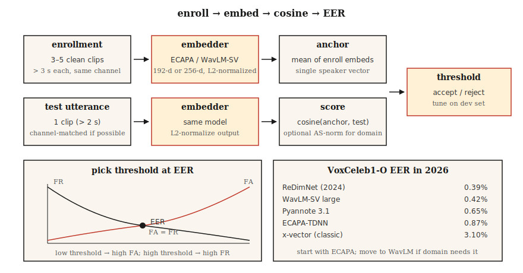

# 说话人识别与验证

> ASR 问"他们说了什么？"说话人识别问"是谁说的？"数学看起来一样——嵌入加余弦——但每个生产决策都取决于一个 EER 数字。

**类型：** 构建
**语言：** Python
**前置知识：** Phase 6 · 02（频谱图与梅尔）、Phase 5 · 22（嵌入模型）
**时间：** 约 45 分钟

## 问题

用户说一个密码。你想知道：这是他们声称的那个人吗（*验证*，1:1），还是注册库中的第一个人（*识别*，1:N）？或者都不是——这是一个未知说话人（*开放集*）？

2018 年之前：GMM-UBM + i-向量。合理的 EER 但对通道偏移（手机 vs 笔记本）和情绪脆弱。2018–2022：x-向量（TDNN 主干，角度 margin 训练）。2022+：ECAPA-TDNN 和 WavLM-large 嵌入。到 2026 年该领域由三个模型和一个指标主导。

该指标是 **EER** — 等错误率。设置决策阈值使虚警率 = 漏警率。交叉点是 EER。每篇论文、每个排行榜、每次采购通话都使用它。

## 概念



**管道。** 注册：记录目标说话人的 5–30 秒；计算固定维度嵌入（ECAPA-TDNN 为 192 维，WavLM-large 为 256 维）。验证：获取测试话语的嵌入；计算余弦相似度；与阈值比较。

**ECAPA-TDNN（2020，2026 年仍主导）。** 强调通道注意力、传播和聚合——时间延迟神经网络。1D 卷积块带压缩-激励、多头注意力池化，然后线性层到 192 维。在 VoxCeleb 1+2（2,700 说话人，110 万话语）上用加性角度 margin 损失（AAM-softmax）训练。

**WavLM-SV（2022+）。** 用 AAM 损失微调预训练 WavLM-large SSL 主干。更高质量但更慢——300+ MB vs 15 MB。

**x-向量（基线）。** TDNN + 统计池化。经典；仍可用于 CPU/边缘。

**AAM-softmax。** 标准 softmax 在角度空间增加 margin `m`：`cos(θ + m)` 用于正确类。强制类间角度分离。典型 `m=0.2`，scale `s=30`。

### 评分

- **余弦**在注册和测试嵌入之间。基于阈值的决策。
- **PLDA（概率 LDA）。** 将嵌入投影到潜在空间，其中同说话人 vs 不同说话人有封闭形式的似然比。在余弦之上额外加 10–20% EER 降低。2020 年前的标准；现在仅用于闭集设置。
- **分数归一化。** `S-norm` 或 `AS-norm`：相对于一组冒充者的均值和标准差归一化每个分数。对跨域评估至关重要。

### 需要知道的数字（2026）

| 模型 | VoxCeleb1-O EER | 参数 | 吞吐量（A100） |
|-------|-----------------|--------|----------------|
| x-向量（经典） | 3.10% | 5 M | 400× 实时 |
| ECAPA-TDNN | 0.87% | 15 M | 200× 实时 |
| WavLM-SV large | 0.42% | 316 M | 20× 实时 |
| Pyannote 3.1 分段 + 嵌入 | 0.65% | 6 M | 100× 实时 |
| ReDimNet（2024） | 0.39% | 24 M | 100× 实时 |

### 说话人日志

多说话人片段中"谁在何时说话"。管道：VAD → 分段 → 每个分段嵌入 → 聚类（凝聚或谱） → 平滑边界。现代栈：`pyannote.audio` 3.1，它将说话人分段 + 嵌入 + 聚类打包到一个调用后面。2026 年 AMI 上 SOTA DER 约 15%（2022 年为 23%）。

## 构建

### 步骤 1：MFCC 统计的玩具嵌入

```python
def embed_mfcc_stats(signal, sr):
    frames = featurize_mfcc(signal, sr, n_mfcc=13)
    mean = [sum(f[i] for f in frames) / len(frames) for i in range(13)]
    std = [
        math.sqrt(sum((f[i] - mean[i]) ** 2 for f in frames) / len(frames))
        for i in range(13)
    ]
    return mean + std  # 26-d
```

离 SOTA 很远——仅用于教学。`code/main.py` 在合成说话人数据上用作概念验证。

### 步骤 2：余弦相似度 + 阈值

```python
def cosine(a, b):
    dot = sum(x * y for x, y in zip(a, b))
    na = math.sqrt(sum(x * x for x in a))
    nb = math.sqrt(sum(x * x for x in b))
    return dot / (na * nb) if na and nb else 0.0

def verify(enroll, test, threshold=0.75):
    return cosine(enroll, test) >= threshold
```

### 步骤 3：从相似度对计算 EER

```python
def eer(same_scores, diff_scores):
    thresholds = sorted(set(same_scores + diff_scores))
    best = (1.0, 1.0, 0.0)  # (fa, fr, threshold)
    for t in thresholds:
        fr = sum(1 for s in same_scores if s < t) / len(same_scores)
        fa = sum(1 for s in diff_scores if s >= t) / len(diff_scores)
        if abs(fa - fr) < abs(best[0] - best[1]):
            best = (fa, fr, t)
    return (best[0] + best[1]) / 2, best[2]
```

返回 (eer, threshold_at_eer)。两者都报告。

### 步骤 4：使用 SpeechBrain 生产

```python
from speechbrain.pretrained import EncoderClassifier

clf = EncoderClassifier.from_hparams(source="speechbrain/spkrec-ecapa-voxceleb")

# 注册：平均 3-5 个干净样本的嵌入
enroll = torch.stack([clf.encode_batch(load(x)) for x in enrollment_clips]).mean(0)
# 验证
score = clf.similarity(enroll, clf.encode_batch(load("test.wav"))).item()
verdict = score > 0.25   # ECAPA 典型阈值；在你的数据上调优
```

### 步骤 5：使用 pyannote 做日志

```python
from pyannote.audio import Pipeline

pipe = Pipeline.from_pretrained("pyannote/speaker-diarization-3.1")
diarization = pipe("meeting.wav", num_speakers=None)
for turn, _, speaker in diarization.itertracks(yield_label=True):
    print(f"{turn.start:.1f}–{turn.end:.1f}  {speaker}")
```

## 使用

2026 年栈：

| 场景 | 选择 |
|------|------|
| 闭集 1:1 验证，边缘 | ECAPA-TDNN + 余弦阈值 |
| 开放集验证，云 | WavLM-SV + AS-norm |
| 日志（会议、播客） | `pyannote/speaker-diarization-3.1` |
| 反欺骗（重放 / deepfake 检测） | AASIST 或 RawNet2 |
| 小型嵌入式（KWS + 注册） | Titanet-Small（NeMo） |

## 坑

- **通道不匹配。** 在 VoxCeleb（网络视频）上训练的模型 ≠ 电话音频。始终在目标通道上评估。
- **短话语。** 测试音频低于 3 秒时 EER 急剧下降。
- **有噪声的注册。** 一个有噪声的注册会毒害锚点。使用 ≥3 个干净样本并取平均。
- **跨条件固定阈值。** 始终在来自目标域的留存开发集上调优阈值。
- **非归一化嵌入上的余弦。** 先 L2 归一化；否则幅度主导。

## 发货

保存为 `outputs/skill-speaker-verifier.md`。为给定任务选择模型、注册协议、阈值调优计划和欺诈保护措施。

## 练习

1. **简单。** 运行 `code/main.py`。构建合成"说话人"（不同音调轮廓），注册，在 100 对试验列表上计算 EER。
2. **中等。** 使用 SpeechBrain ECAPA 在 30 个 VoxCeleb1 话语上（5 说话人 × 6）。用余弦 vs PLDA 计算 EER。
3. **困难。** 构建完整的注册 → 日志 → 验证管道使用 `pyannote.audio`。在 AMI dev 集上评估 DER。

## 关键术语

| 术语 | 大家怎么说 | 实际含义 |
|------|-----------|--------|
| EER | 标题指标 | 虚警 = 漏警的阈值。 |
| 验证 | 1:1 | "这是 Alice 吗？" |
| 识别 | 1:N | "谁在说话？" |
| 开放集 | 可能未知 | 测试集可包含未注册说话人。 |
| 注册 | 注册 | 计算说话人的参考嵌入。 |
| AAM-softmax | 损失 | 带加性角度 margin 的 softmax；强制聚类分离。 |
| PLDA | 经典评分 | 概率 LDA；在嵌入之上做似然比评分。 |
| DER | 日志指标 | 日志错误率——漏报 + 虚警 + 混淆。 |

## 延伸阅读

- [Snyder et al. (2018). X-Vectors: Robust DNN Embeddings for Speaker Recognition](https://www.danielpovey.com/files/2018_icassp_xvectors.pdf) — 经典深度嵌入论文。
- [Desplanques et al. (2020). ECAPA-TDNN](https://arxiv.org/abs/2005.07143) — 2020–2026 年主导架构。
- [Chen et al. (2022). WavLM: Large-Scale Self-Supervised Pre-Training for Full Stack Speech Processing](https://arxiv.org/abs/2110.13900) — SV 和日志的 SSL 主干。
- [Bredin et al. (2023). pyannote.audio 3.1](https://github.com/pyannote/pyannote-audio) — 生产日志 + 嵌入栈。
- [VoxCeleb 排行榜（2026 年更新）](https://www.robots.ox.ac.uk/~vgg/data/voxceleb/) — 跨模型当前 EER 排名。