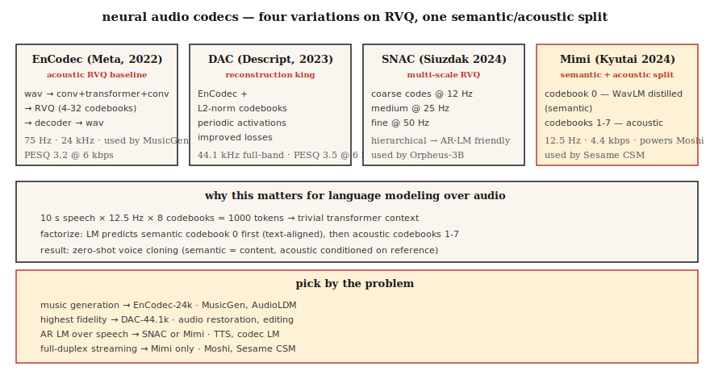

# 神经音频编解码器 — EnCodec、SNAC、Mimi、DAC 和语义-声学分 split

> 2026 年音频生成几乎全是 token。EnCodec、SNAC、Mimi 和 DAC 将连续波形转换为离散序列，Transformer 可以预测。语义 vs 声学 token split——第一码本作为语义，其余作为声学——是自 Transformer 以来音频领域最重要的架构转变。

**类型：** 学习
**语言：** Python
**前置知识：** Phase 6 · 02（频谱图）、Phase 10 · 11（量化）、Phase 5 · 19（子词分词）
**时间：** 约 60 分钟

## 问题

语言模型处理离散 token。音频是连续的。如果你想做语音/音乐的风格 LLM——MusicGen、Moshi、Sesame CSM、VibeVoice、Orpheus——首先需要一个**神经音频编解码器**：一个学习到的编码器将音频离散化为小型 token 词汇，和一个匹配的解码器重建波形。

出现了两个家族：

1. **重建优先编解码器** — EnCodec、DAC。优化感知音频质量。Token 是"声学的"——它们捕获一切包括说话人身份、音色、背景噪声。
2. **语义优先编解码器** — Mimi（Kyutai）、SpeechTokenizer。强制第一个码本编码语言/语音内容（通常通过从 WavLM 蒸馏）。后续码本是声学残差。

2024–2026 年的洞见：**从文本尝试生成时，纯重建编解码器给你模糊语音。** LLM over 码本 token 必须同时学习语言结构和声学结构在同一个码本里，不能扩展。将它们分开——语义码本 0，声学码本 1-N——这就是 Moshi 和 Sesame CSM 工作的原因。

## 概念



### 核心技巧：残差向量量化（RVQ）

与其一个大码本（需要数百万码本才能有好的质量），所有现代音频编解码器使用 **RVQ**：级联的小码本。第一个码本量化编码器输出；第二个量化残差；等等。每个码本 1024 个码。8 个码本 = 有效词汇 1024^8 = 10^24。

推理时，解码器将所有选中的码本求和来重建每帧。

### 2026 年重要的四个编解码器

**EnCodec（Meta，2022）。** 基线。编码器-解码器 over 波形，RVQ 瓶颈。24 kHz，可能 32 个码本，默认 4 个码本 @ 1.5 kbps。使用 `1D conv + transformer + 1D conv` 架构。MusicGen 使用。

**DAC（Descript，2023）。** L2 归一化码本、周期激活函数、改进损失的 RVQ。在感知质量上最高保真——有时与原始语音无法区分（12 个码本）。44.1 kHz 全频段。

**SNAC（Hubert Siuzdak，2024）。** 多尺度 RVQ——粗码本以比细码本更低的帧率运行。有效分层建模音频：~12 Hz 的粗"草图"加上 50 Hz 的细节。用于 Orpheus-3B，因为分层结构很好地映射到基于 LM 的生成。

**Mimi（Kyutai，2024）。** 2026 年的改变者。12.5 Hz 帧率（极低），8 个码本 @ 4.4 kbps。码本 0 **从 WavLM 蒸馏**——训练预测 WavLM 的语音内容特征。码本 1-7 是声学残差。这个 split 为 Moshi（Lesson 15）和 Sesame CSM 赋能。

### 帧率对语言建模很重要

帧率越低 = 序列越短 = LM 越快。

| 编解码器 | 帧率 | 1 秒 = N 帧 | 适用于 |
|---------|------|-------------|--------|
| EnCodec-24k | 75 Hz | 75 | 音乐、通用音频 |
| DAC-44.1k | 86 Hz | 86 | 高保真音乐 |
| SNAC-24k（粗） | ~12 Hz | 12 | AR-LM 高效 |
| Mimi | 12.5 Hz | 12.5 | 流式语音 |

在 12.5 Hz，10 秒话语仅 125 个编解码帧——一个 transformer 可以轻松预测它们。

### 语义 vs 声学 token

```
frame_t → [semantic_token_t, acoustic_token_0_t, acoustic_token_1_t, ..., acoustic_token_6_t]
```

- **语义 token（Mimi 的码本 0）。** 编码说了什么——音素、词、内容。从 WavLM 通过辅助预测损失蒸馏。
- **声学 token（码本 1-7）。** 编码音色、说话人身份、韵律、背景噪声、细节。

AR LM 首先预测语义 token（以文本为条件），然后预测声学 token（以语义 + 说话人参考为条件）。这种因子分解是现代 TTS 可以零镜头克隆声音的原因：语义模型处理内容；声学模型处理音色。

### 2026 年重建质量（比特率，越低越好）

| 编解码器 | 比特率 | PESQ | ViSQOL |
|---------|--------|------|--------|
| Opus-20kbps | 20 kbps | 4.0 | 4.3 |
| EnCodec-6kbps | 6 kbps | 3.2 | 3.8 |
| DAC-6kbps | 6 kbps | 3.5 | 4.0 |
| SNAC-3kbps | 3 kbps | 3.3 | 3.8 |
| Mimi-4.4kbps | 4.4 kbps | 3.1 | 3.7 |

Opus 等传统编解码器在每比特感知质量上仍然胜出。神经编解码器胜在**离散 token**（Opus 不产生）和**生成模型质量**（LM 可以用这些 token 做什么）。

## 构建

### 步骤 1：用 EnCodec 编码

```python
from encodec import EncodecModel
import torch

model = EncodecModel.encodec_model_24khz()
model.set_target_bandwidth(6.0)  # kbps

wav = torch.randn(1, 1, 24000)
with torch.no_grad():
    encoded = model.encode(wav)
codes, scale = encoded[0]
# codes: (1, n_codebooks, n_frames), dtype=int64
```

`n_codebooks=8` @ 6 kbps。每个码是 0-1023（10 位）。

### 步骤 2：解码并测量重建

```python
with torch.no_grad():
    wav_recon = model.decode([(codes, scale)])

from torchaudio.functional import compute_deltas
import torch.nn.functional as F

mse = F.mse_loss(wav_recon[:, :, :wav.shape[-1]], wav).item()
```

### 步骤 3：语义-声学分 split（Mimi 风格）

```python
from moshi.models import loaders
mimi = loaders.get_mimi()

with torch.no_grad():
    codes = mimi.encode(wav)  # shape (1, 8, frames@12.5Hz)

semantic = codes[:, 0]
acoustic = codes[:, 1:]
```

语义码本 0 与 WavLM 对齐。你可以训练一个文本到语义的 transformer——比直接到音频小得多的词汇量。然后一个单独的声学到波形解码器以说话人参考为条件。

### 步骤 4：为什么 AR LM over 码本 token 有效

对于 10 秒语音片段 @ Mimi 的 12.5 Hz × 8 个码本：

```
N_tokens = 10 * 12.5 * 8 = 1000 tokens
```

1000 个 token 对一个 transformer 来说微不足道的上下文。一个 256M 参数的 transformer 可以在现代 GPU 上毫秒级生成 10 秒语音。

## 使用

将问题映射到编解码器：

| 任务 | 编解码器 |
|------|---------|
| 通用音乐生成 | EnCodec-24k |
| 最高保真重建 | DAC-44.1k |
| AR LM over 语音（TTS） | SNAC 或 Mimi |
| 流式全双工语音 | Mimi（12.5 Hz） |
| 带文本的音效库 | EnCodec + T5 条件 |
| 细粒度音频编辑 | DAC + 修补 |

经验法则：**如果你在构建生成模型，从 Mimi 或 SNAC 开始。如果你在构建压缩管道，使用 Opus。**

## 坑

- **太多码本。** 添加码本线性增加保真度但 LM 序列长度也线性增加。停在 8-12。
- **帧率不匹配。** 在 12.5 Hz Mimi 上训练 LM 然后在 50 Hz EnCodec 上微调会静默失败。
- **假设所有码本相等。** 在 Mimi 中，码本 0 携带内容；失去它会破坏可懂度。失去码本 7 几乎注意不到。
- **仅以重建质量作为唯一指标。** 编解码器可以有很好的重建但如果语义结构差就对 LM 生成无用。

## 发货

保存为 `outputs/skill-codec-picker.md`。为给定的生成或压缩任务选择编解码器。

## 练习

1. **简单。** 运行 `code/main.py`。它实现了一个玩具标量 + 残差量化器，并在添加码本时测量重建误差。
2. **中等。** 安装 `encodec` 并比较 1、4、8、32 个码本在留存语音片段上的表现。绘制 PESQ 或 MSE vs 比特率。
3. **困难。** 加载 Mimi。编码一个片段。将码本 0 替换为随机整数；解码。然后类似地替换码本 7。比较两种损坏——码本 0 损坏应该破坏可懂度；码本 7 损坏应该几乎不改变任何东西。

## 关键术语

| 术语 | 大家怎么说 | 实际含义 |
|------|-----------|--------|
| RVQ | 残差量化 | 小码本级联；每个量化前一个残差。 |
| 帧率 | 编解码器速度 | 每秒多少 token 帧。越低 = LM 越快。 |
| 语义码本 | 码本 0（Mimi） | 从 SSL 特征蒸馏的码本；编码内容。 |
| 声学码本 | 其余所有 | 音色、韵律、噪声、细节。 |
| PESQ / ViSQOL | 感知质量 | 与 MOS 相关联的客观指标。 |
| EnCodec | Meta 编解码器 | RVQ 基线；MusicGen 使用。 |
| Mimi | Kyutai 编解码器 | 12.5 Hz 帧率；语义-声学分 split；驱动 Moshi。 |

## 延伸阅读

- [Défossez et al. (2023). EnCodec](https://arxiv.org/abs/2210.13438) — RVQ 基线。
- [Kumar et al. (2023). Descript Audio Codec (DAC)](https://arxiv.org/abs/2306.06546) — 最高保真开源。
- [Siuzdak (2024). SNAC](https://arxiv.org/abs/2410.14411) — 多尺度 RVQ。
- [Kyutai (2024). Mimi codec](https://kyutai.org/codec-explainer) — 语义-声学分 split，WavLM 蒸馏。
- [Borsos et al. (2023). AudioLM](https://arxiv.org/abs/2209.03143) — 两阶段语义/声学范式。
- [Zeghidour et al. (2021). SoundStream](https://arxiv.org/abs/2107.03312) — 原始可流式 RVQ 编解码器。