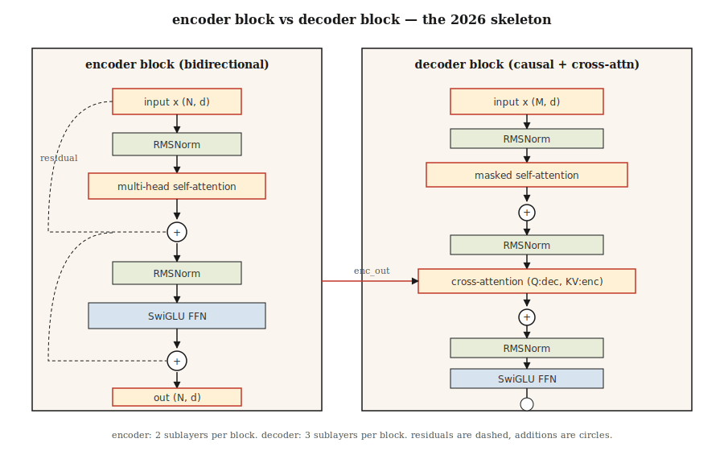

# 完整 Transformer — 编码器 + 解码器

> 注意力是明星。其他一切——残差、归一化、前馈、交叉注意力——是将深度堆叠起来的脚手架。

**类型：** 构建
**语言：** Python
**前置知识：** Phase 7 第 2 课（自注意力）、Phase 7 第 3 课（多头注意力）、Phase 7 第 4 课（位置编码）
**时长：** ~75 分钟

## 问题

单个注意力层是特征提取器，不是模型。每层一次矩阵乘法对语言没有足够容量。你需要深度——而深度没有正确 plumbing 会崩溃。

2017 年 Vaswani 论文打包了六个设计决策，将一个注意力层变成可堆叠块。此后每个 transformer——纯编码器（BERT）、纯解码器（GPT）、编码器-解码器（T5）——都继承了相同的骨架。2026 年这些块已经改进（RMSNorm、SwiGLU、pre-norm、RoPE），但骨架是一样的。

本课就是骨架。后续课程将其专门化——第 6 课针对编码器，第 7 课针对解码器，第 8 课针对编码器-解码器。

## 概念



### 六个组件

1. **嵌入 + 位置信号。** Token → 向量。通过 RoPE（现代）或正弦（经典）注入位置。
2. **自注意力。** 每个位置关注所有其他位置。解码器中带掩码。
3. **前馈网络（FFN）。** 逐位两层 MLP：`W_2 · activation(W_1 · x)`。扩展比默认 4×。
4. **残差连接。** `x + sublayer(x)`。没有这个，梯度在 ~6 层后消失。
5. **层归一化。** `LayerNorm` 或 `RMSNorm`（现代）。稳定残差流。
6. **交叉注意力（仅解码器）。** Query 来自解码器，Key 和 Value 来自编码器输出。

### 编码器块（BERT、T5 编码器使用）

```
x → LN → MHA(self) → + → LN → FFN → + → out
                     ^              ^
                     |              |
                     └── residual ──┘
```

编码器是双向的。无掩码。所有位置看到所有位置。

### 解码器块（GPT、T5 解码器使用）

```
x → LN → MHA(masked self) → + → LN → MHA(cross to encoder) → + → LN → FFN → + → out
```

解码器每块有三个子层。中间那个——交叉注意力——是编码器信息进入解码器的唯一地方。在纯解码器架构（GPT）中，交叉注意力被省略，你只有带掩码的自注意力 + FFN。

### Pre-norm vs post-norm

原始论文：`x + sublayer(LN(x))` vs `LN(x + sublayer(x))`。Post-norm 在 2019 年左右失宠——没有仔细预热难以训练深度。Pre-norm（`LN` *在*子层*之前*）是 2026 年的默认：Llama、Qwen、GPT-3+、Mistral 都使用它。

### 2026 年现代化块

Vaswani 2017 发货 LayerNorm + ReLU。现代堆栈替换了这两个。生产块实际长这样：

| 组件 | 2017 | 2026 |
|------|------|------|
| 归一化 | LayerNorm | RMSNorm |
| FFN 激活 | ReLU | SwiGLU |
| FFN 扩展 | 4× | 2.6×（SwiGLU 使用三个矩阵，总参数匹配） |
| 位置 | 正弦绝对 | RoPE |
| 注意力 | 完整 MHA | GQA（或 MLA） |
| 偏置项 | 有 | 无 |

RMSNorm 丢弃 LayerNorm 的均值居中（少一次减法），节省计算，经验上至少同样稳定。SwiGLU (`Swish(W1 x) ⊙ W3 x`) 在 Llama、PaLM 和 Qwen 论文中持续优于 ReLU/GELU FFN 约 0.5 点 ppl。

### 参数计数

对于 d_model = d 和 FFN 扩展 r 的一块：

- MHA：`4 · d²`（Q、K、V、O 投影）
- FFN（SwiGLU）：`3 · d · (r · d)` ≈ `3rd²`
- 归一化：可忽略

在 `d = 4096, r = 2.6, layers = 32`（大约 Llama 3 8B）：总计 `32 · (4·4096² + 3·2.6·4096²) ≈ 32 · (16 + 32) M = ~1.5B 每层 × 32 ≈ 7B`（加上嵌入和 head）。与发布计数匹配。

## 构建

### 第一步：构建块

使用第 3 课的小型 `Matrix` 类（复制到此文件以保持独立）：

- `layer_norm(x, eps=1e-5)` — 减去均值，除以标准差。
- `rms_norm(x, eps=1e-6)` — 除以 RMS。无均值减去。
- `gelu(x)` 和 `silu(x) * W3 x`（SwiGLU）。
- `ffn_swiglu(x, W1, W2, W3)`。
- `encoder_block(x, params)` 和 `decoder_block(x, enc_out, params)`。

见 `code/main.py` 完整连接。

### 第二步：连接一个 2 层编码器和一个 2 层解码器

堆叠它们。将编码器输出传入每个解码器交叉注意力。在输出投影前添加最终 LN。

```python
def encode(tokens, params):
    x = embed(tokens, params.emb) + sinusoidal(len(tokens), params.d)
    for block in params.encoder_blocks:
        x = encoder_block(x, block)
    return x

def decode(target_tokens, encoder_out, params):
    x = embed(target_tokens, params.emb) + sinusoidal(len(target_tokens), params.d)
    for block in params.decoder_blocks:
        x = decoder_block(x, encoder_out, block)
    return x
```

### 第三步：在玩具示例上运行前向传播

输入 6-token 源和 5-token 目标。验证输出形状为 `(5, vocab)`。不训练——本课是关于架构，不是损失。

### 第四步：换入 RMSNorm + SwiGLU

用 RMSNorm 和 SwiGLU 替换 LayerNorm 和 ReLU-FFN。确认形状仍然匹配。这是 2026 年现代化，一个函数替换即可。

## 使用

PyTorch/TF 参考实现：`nn.TransformerEncoderLayer`、`nn.TransformerDecoderLayer`。但大多数 2026 年生产代码自己造块，因为：

- Flash Attention 在注意力内部调用，不通过 `nn.MultiheadAttention`。
- GQA / MLA 不在 stdlib 参考中。
- RoPE、RMSNorm、SwiGLU 不是 PyTorch 默认值。

HF `transformers` 有你应阅读的干净参考块：`modeling_llama.py` 是标准的 2026 纯解码器块。它约 500 行，值得走查一遍。

**编码器 vs 解码器 vs 编码器-解码器——何时选哪个：**

| 需求 | 选择 | 示例 |
|------|------|------|
| 文本分类、嵌入、问答 | 纯编码器 | BERT、DeBERTa、ModernBERT |
| 文本生成、聊天、代码、推理 | 纯解码器 | GPT、Llama、Claude、Qwen |
| 结构化输入 → 结构化输出（翻译、摘要） | 编码器-解码器 | T5、BART、Whisper |

纯解码器因最干净地扩展并同时处理理解和生成而赢得语言。编码器-解码器在输入有明确"源序列"身份（翻译、语音识别、结构化任务）时仍然是最好的。

## 交付

见 `outputs/skill-transformer-block-reviewer.md`。该 skill 审查新的 transformer 块实现是否符合 2026 年默认配置，并标记缺失组件（pre-norm、RoPE、RMSNorm、GQA、FFN 扩展比）。

## 练习

1. **简单。** 计算 `d_model=512, n_heads=8, ffn_expansion=4, swiglu=True` 时 encoder_block 的参数数。通过实现块并使用 `sum(p.numel() for p in block.parameters())` 验证。
2. **中等。** 从 post-norm 切换到 pre-norm。初始化两者并在随机输入上测量 12 个堆叠层后的激活范数。Post-norm 的激活应该爆炸；pre-norm 的应该保持有界。
3. **困难。** 在玩具复制任务上实现 4 层编码器-解码器（复制 `x` 倒序）。训练 100 步。报告损失。换入 RMSNorm + SwiGLU + RoPE——损失下降了吗？

## 关键术语

| 术语 | 大家怎么说 | 实际含义 |
|------|----------|---------|
| 块 | "一个 transformer 层" | 归一化 + 注意力 + 归一化 + FFN 的堆叠，包裹在残差连接中。 |
| 残差 | "跳跃连接" | `x + f(x)` 输出；使梯度通过深度堆叠流动。 |
| Pre-norm | "之前归一化，不是之后" | 现代：`x + sublayer(LN(x))`。无需预热 gymnastics 训练更深。 |
| RMSNorm | "没有均值的 LayerNorm" | 除以 RMS；少一个操作，经验稳定性相同。 |
| SwiGLU | "每个人切换到的 FFN" | `Swish(W1 x) ⊙ W3 x → W2`。在 LM ppl 上优于 ReLU/GELU。 |
| 交叉注意力 | "解码器如何看待编码器" | Q 来自解码器、K/V 来自编码器输出的 MHA。 |
| FFN 扩展 | "中间 MLP 有多宽" | 隐藏大小与 d_model 的比率，通常为 4（LayerNorm）或 2.6（SwiGLU）。 |
| 无偏置 | "去掉 +b 项" | 现代堆栈在线性层中省略偏置；轻微 ppl 改善，模型更小。 |

## 延伸阅读

- [Vaswani et al. (2017). Attention Is All You Need](https://arxiv.org/abs/1706.03762) — 原始块规格。
- [Xiong et al. (2020). On Layer Normalization in the Transformer Architecture](https://arxiv.org/abs/2002.04745) — 为什么 pre-norm 在深度上优于 post-norm。
- [Zhang, Sennrich (2019). Root Mean Square Layer Normalization](https://arxiv.org/abs/1910.07467) — RMSNorm。
- [Shazeer (2020). GLU Variants Improve Transformer](https://arxiv.org/abs/2002.05202) — SwiGLU 论文。
- [HuggingFace `modeling_llama.py`](https://github.com/huggingface/transformers/blob/main/src/transformers/models/llama/modeling_llama.py) — 标准的 2026 纯解码器块。