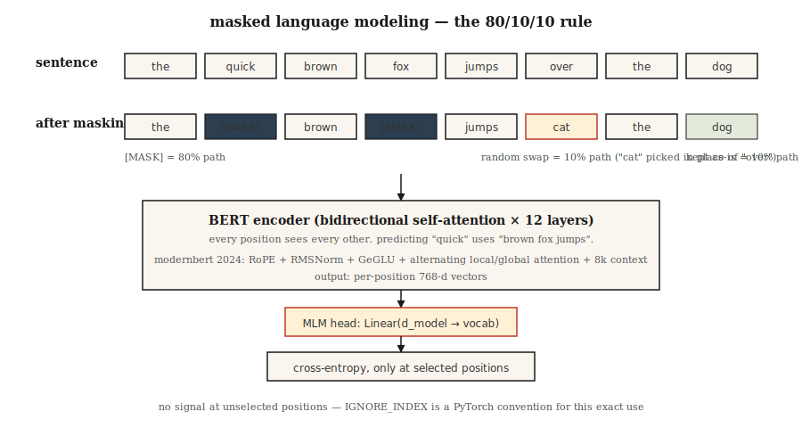

# BERT — 掩码语言建模

> GPT 预测下一个词。BERT 预测缺失的词。一句话的差异——以及半代一切嵌入形状化的时代。

**类型：** 构建
**语言：** Python
**前置知识：** Phase 7 · 05（完整 Transformer），Phase 5 · 02（文本表示）
**时长：** ~45 分钟

## 问题

2018 年，每个 NLP 任务——情感、NER、QA、蕴含——都在自己的标注数据上从头训练自己的模型。没有可微调的预训练"理解英语"检查点。ELMo（2018）表明可以用双向 LSTM 预训练上下文嵌入；它有帮助但不通用。

BERT（Devlin et al. 2018）问：如果我们拿一个 transformer 编码器，在互联网上每个句子上训练它，强迫它从两侧上下文预测缺失的词呢？然后在下游任务上微调一个 head。参数效率是颠覆性的。

结果：18 个月内 BERT 及其变体（RoBERTa、ALBERT、ELECTRA）主导了所有存在的 NLP 排行榜。到 2020 年，地球上的每个搜索引擎、内容审核流程和语义搜索系统都有一个 BERT 在里面。

2026 年，纯编码器模型仍然是分类、检索和结构化提取的正确工具——它们每 token 比解码器快 5–10×，它们的嵌入是每个现代检索栈的支柱。ModernBERT（2024 年 12 月）通过 Flash Attention + RoPE + GeGLU 将架构推向 8K 上下文。

## 概念



### 训练信号

取一个句子：`the quick brown fox jumps over the lazy dog`。

随机掩码 15% 的 token：

```
输入：  the [MASK] brown fox jumps [MASK] the lazy dog
目标： the  quick brown fox jumps  over  the lazy dog
```

训练模型预测掩码位置上的原始 token。因为编码器是双向的，在位置 1 预测 `[MASK]` 可以使用位置 2+ 的 `brown fox jumps`。这是 GPT 做不到的事。

### BERT 掩码规则

在选择用于预测的 15% token 中：

- 80% 替换为 `[MASK]`。
- 10% 替换为随机 token。
- 10% 保持不变。

为什么不总是 `[MASK]`？因为 `[MASK]` 在推理时从不出现。训练模型期望 100% 的掩码位置都有 `[MASK]` 会在预训练和微调之间造成分布偏移。10% 随机 + 10% 不变使模型保持诚实。

### 下一句预测（NSP）——以及为什么它被丢弃

原始 BERT 也在 NSP 上训练：给定两个句子 A 和 B，预测 B 是否跟随 A。RoBERTa（2019）消融了它，表明 NSP 有害无益。现代编码器跳过它。

### 2026 年的变化：ModernBERT

2024 年 ModernBERT 论文用 2026 年的原语重建了块：

| 组件 | 原始 BERT（2018） | ModernBERT（2024） |
|------|------------------|-------------------|
| 位置 | 学习绝对 | RoPE |
| 激活 | GELU | GeGLU |
| 归一化 | LayerNorm | Pre-norm RMSNorm |
| 注意力 | 完整密集 | 交替局部（128）+ 全局 |
| 上下文长度 | 512 | 8192 |
| 分词器 | WordPiece | BPE |

并且与 2018 年堆栈不同，它是 Flash-Attention-native。在序列长度 8K 上比 DeBERTa-v3 快 2–3×，GLUE 分数更好。

### 2026 年仍选编码器的用例

| 任务 | 为什么编码器胜过解码器 |
|------|----------------------|
| 检索/语义搜索嵌入 | 双向上下文 = 每 token 更好的嵌入质量 |
| 分类（情感、意图、毒性） | 一次前向传播；无生成开销 |
| NER / token 标注 | 每位置输出，原生双向 |
| 零样本蕴含（NLI） | 编码器顶部的分类器 head |
| RAG 排序器 | 交叉编码器评分，比 LLM 排序器快 10 倍 |

## 构建

### 第一步：掩码逻辑

见 `code/main.py`。函数 `create_mlm_batch` 接受 token ID 列表、词表大小和掩码概率。返回输入 ID（应用掩码后）和标签（仅在掩码位置有值，其他地方为 -100——PyTorch 的忽略索引约定）。

```python
def create_mlm_batch(tokens, vocab_size, mask_prob=0.15, rng=None):
    input_ids = list(tokens)
    labels = [-100] * len(tokens)
    for i, t in enumerate(tokens):
        if rng.random() < mask_prob:
            labels[i] = t
            r = rng.random()
            if r < 0.8:
                input_ids[i] = MASK_ID
            elif r < 0.9:
                input_ids[i] = rng.randrange(vocab_size)
            # else: 保持原样
    return input_ids, labels
```

### 第二步：在小型语料上运行 MLM 预测

在 20 个词、200 个句子的词汇上训练 2 层编码器 + MLM head。无梯度——我们做前向传播健全性检查。完整训练需要 PyTorch。

### 第三步：比较掩码类型

展示三路规则如何在没有 `[MASK]` 的情况下保持模型可用。在未掩码句子和已掩码句子上预测。两者都应该产生合理的 token 分布，因为模型在训练中见过两种模式。

### 第四步：微调 head

将 MLM head 替换为玩具情感数据集上的分类 head。只有 head 训练；编码器冻结。这是每个 BERT 应用遵循的模式。

## 使用

```python
from transformers import AutoModel, AutoTokenizer

tok = AutoTokenizer.from_pretrained("answerdotai/ModernBERT-base")
model = AutoModel.from_pretrained("answerdotai/ModernBERT-base")

text = "Attention is all you need."
inputs = tok(text, return_tensors="pt")
out = model(**inputs).last_hidden_state   # (1, N, 768)
```

**嵌入模型是微调的 BERT。** `sentence-transformers` 模型如 `all-MiniLM-L6-v2` 是用对比损失训练的 BERT。编码器相同。损失变了。

**交叉编码器排序器也是微调的 BERT。** `[CLS] query [SEP] doc [SEP]` 上的配对分类。query 和 doc 之间的双向注意力正是交叉编码器比双编码器质量领先的原因。

**2026 年何时不选 BERT。** 任何生成性的。编码器没有合理的方式自回归生成 token。同样：任何 1B 参数以下，其中小型解码器可以用更多灵活性匹配质量（Phi-3-Mini、Qwen2-1.5B）。

## 交付

见 `outputs/skill-bert-finetuner.md`。该 skill 为新的分类或提取任务规划 BERT 微调（骨干选择、head 规格、数据、评估、停止）。

## 练习

1. **简单。** 运行 `code/main.py` 并打印 10,000 token 上的掩码分布。确认约 15% 被选中，其中约 80% 变为 `[MASK]`。
2. **中等。** 实现整词掩码：如果一个词被分成子词，则掩码所有子词或全部不掩码。测量这是否在 500 句子上改善 MLM 准确性。
3. **困难。** 在公开数据集的 10,000 个句子上训练一个微型（2 层，d=64）BERT。在 SST-2 情感上微调 `[CLS]` token。在匹配参数下与纯解码器基线比较——谁赢了？

## 关键术语

| 术语 | 大家怎么说 | 实际含义 |
|------|----------|---------|
| MLM | "掩码语言建模" | 训练信号：随机将 15% 的 token 替换为 `[MASK]`，预测原文。 |
| 双向 | "双向看" | 编码器注意力没有因果掩码——每个位置看到每个其他位置。 |
| `[CLS]` | "池化 token" | 前置到每个序列的特殊 token；其最终嵌入用作句子级表示。 |
| `[SEP]` | "分段分隔符" | 分隔配对序列（例如 query/doc、句子 A/B）。 |
| NSP | "下一句预测" | BERT 的第二个预训练任务；在 RoBERTa 中被证明无用，2019 年后丢弃。 |
| 微调 | "适应任务" | 保持编码器大部分冻结；在下游任务顶部训练一个小 head。 |
| 交叉编码器 | "排序器" | 接受 query 和 doc 都作为输入的 BERT，输出相关性分数。 |
| ModernBERT | "2024 年刷新" | 用 RoPE、RMSNorm、GeGLU、交替局部/全局注意力、8K 上下文重建的编码器。 |

## 延伸阅读

- [Devlin et al. (2018). BERT: Pre-training of Deep Bidirectional Transformers for Language Understanding](https://arxiv.org/abs/1810.04805) — 原始论文。
- [Liu et al. (2019). RoBERTa: A Robustly Optimized BERT Pretraining Approach](https://arxiv.org/abs/1907.11692) — 如何正确训练 BERT；杀死 NSP。
- [Clark et al. (2020). ELECTRA: Pre-training Text Encoders as Discriminators Rather Than Generators](https://arxiv.org/abs/2003.10555) — 替换 token 检测在匹配计算上优于 MLM。
- [Warner et al. (2024). Smarter, Better, Faster, Longer: A Modern Bidirectional Encoder](https://arxiv.org/abs/2412.13663) — ModernBERT 论文。
- [HuggingFace `modeling_bert.py`](https://github.com/huggingface/transformers/blob/main/src/transformers/models/bert/modeling_bert.py) — 标准的编码器参考。