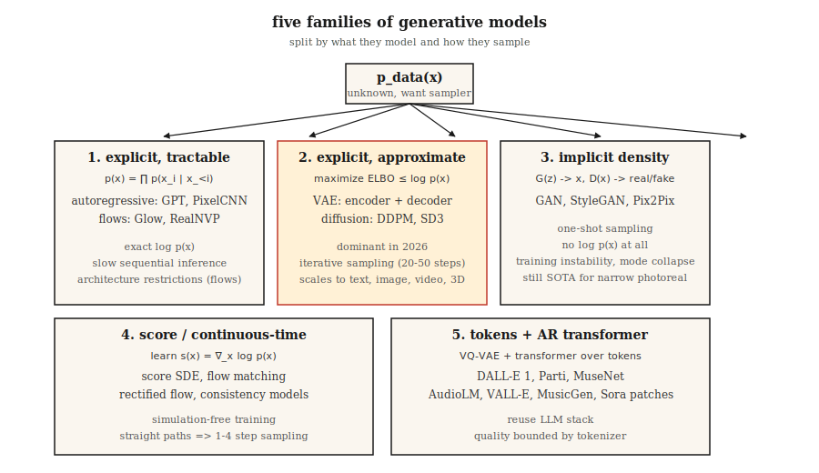

# 生成模型 — 分类与历史

> 每一种图像模型、文本模型、视频模型和 3D 模型都属于五个类别之一。选错类别，你将与数学搏斗数周。选对类别，过去十二年的进展将清晰地在你的脑海中层层叠加。

**类型：** Learn
**语言：** Python
**前置知识：** Phase 2（机器学习基础），Phase 3（深度学习核心），Phase 7 · 14（Transformer）
**时间：** 约 45 分钟

## 问题

生成模型的核心任务：给定从某个未知分布 `p_data(x)` 中采样的训练样本，输出看起来来自同一分布的新样本。人脸、句子、MIDI 文件、蛋白质结构——如果你眯着眼睛看，都是同一类问题。

难点在于：`p_data` 存在于数百万维的空间中（一张 512×512 的 RGB 图像约有 786k 维），样本落在这个空间内的一个低维流形上，而你可能只有约 1000 万个样本。暴力计算密度是不现实的。每一种生成模型都是一种折中方案，把一个难题换成一个稍容易一点的难题。

五大模型族在过去十二年里存活了下来。了解每种模型族做出的折中，就能理解为什么它在某些任务上表现出色而在其他任务上崩溃。

## 核心概念



**1. 显式密度，可 tractable。** 将 `log p(x)` 写成一个可以实际求值的求和式。自回归模型（PixelCNN、WaveNet、GPT）将 `p(x) = ∏ p(x_i | x_<i)` 分解因式。正规化流（RealNVP、Glow）将 `p(x)` 构建为简单基分布的可逆变换。优点：精确似然，训练损失干净。缺点：自回归推理是顺序的（长序列慢），流模型需要可逆架构（架构限制大）。

**2. 显式密度，近似。** 从下方约束 `log p(x)`（ELBO）并优化该下界。VAE（Kingma 2013）使用带变分后验的编码器-解码器。扩散模型（DDPM，Ho 2020）训练一个去噪器，隐式地优化加权的 ELBO。扩散是 2026 年主导的图像、视频和 3D backbone。

**3. 隐式密度。** 完全跳过密度；学习一个生成器 `G(z)` 产生样本，一个判别器 `D(x)` 区分真假。GAN（Goodfellow 2014）。推理速度快（一次前向传播），但训练过程极不稳定。StyleGAN 1/2/3 在固定领域的逼真感（人脸、卧室）上至今仍是 SOTA，即使在 2026 年。

**4. 基于分数 / 连续时间。** 直接学习对数密度 `∇_x log p(x)`（分数）。Song & Ermon（2019）证明分数匹配将扩散泛化到 SDE。Flow matching（Lipman 2023）是 2024-2026 的热点：无需模拟的训练、更直的路径、比 DDPM 快 4-10 倍的采样。Stable Diffusion 3、Flux、AudioCraft 2 都采用了 flow matching。

**5. 离散码上的 token 自回归。** 用 VQ-VAE 或残差量化器将高维数据压缩为短的离散 token 序列，然后用 Transformer 建模 token 序列。Parti、MuseNet、AudioLM、VALL-E、Sora 的 patch tokenizer 都用了这个方案。这是第 1 类加上一个学到的 tokenizer。

## 简要历史

| 年份 | 模型 | 重要意义 |
|------|------|---------|
| 2013 | VAE（Kingma） | 第一个有可用训练损失的深度生成模型。 |
| 2014 | GAN（Goodfellow） | 隐式密度，无需似然——样本异常清晰。 |
| 2015 | DRAW、PixelCNN | 序列图像生成。 |
| 2017 | Glow、RealNVP | 可逆流；深度精确似然。 |
| 2017 | Progressive GAN | 首个百万像素人脸。 |
| 2019 | StyleGAN / StyleGAN2 | 在该单一领域，逼真感人脸至今仍难超越。 |
| 2020 | DDPM（Ho） | 扩散变得实用。 |
| 2021 | CLIP、DALL-E 1、VQGAN | 文生图进入主流。 |
| 2022 | Imagen、Stable Diffusion 1、DALL-E 2 | 潜在扩散 + 文本条件 = 商品化。 |
| 2022 | ControlNet、LoRA | 对预训练扩散进行精细控制。 |
| 2023 | SDXL、Midjourney v5、Flow matching | 规模 + 更好的训练动态。 |
| 2024 | Sora、Stable Diffusion 3、Flux.1 | 视频扩散；flow matching 胜出。 |
| 2025 | Veo 2、Kling 1.5、Runway Gen-3、Nano Banana | 量产级视频。 |
| 2026 | Consistency + Rectified Flow | 从扩散 backbone 实现一步采样。 |

## 五问分类法

当一篇新的生成模型论文发布时，在阅读方法部分之前先回答这五个问题。

1. **建模的是什么？** 像素、潜在变量、离散 token、3D Gaussian、网格、波形的哪一种？
2. **密度是显式还是隐式？** 他们是否写下了 `log p(x)`？
3. **采样：一次性还是迭代？** 迭代意味着推理慢；一次性通常意味着对抗性或蒸馏。
4. **条件化：无条件、类别、文本、图像、姿态？** 这决定了损失函数和架构脚手架。
5. **评估：FID、CLIP 分数、IS、人工偏好、任务准确率？** 每种都有已知的失败模式（见 Lesson 14）。

你将在 Phase 8 的每一课中重新回答这五个问题。到最后，它们将成为本能反应。

## 构建

本课的代码是一个轻量级可视化：用三种玩具方法（核密度估计、离散直方图和一个近邻样本"类 GAN"生成器）从一个混合高斯分布中拟合 1-D 样本，这样你可以在一个屏幕上可视化的问题上看到显式密度与隐式密度的区别。

运行 `code/main.py`。它从双峰高斯混合分布中抽取 2000 个样本，然后打印：

```
显式密度（直方图）：p(x 在 [-0.5, 0.5] 内) ≈ 0.38
近似密度（KDE）：    p(x 在 [-0.5, 0.5] 内) ≈ 0.41
隐式（近邻样本生成器）：打印 20 个新样本，无 p(x)
```

注意：前两者可以让你问"这个点有多可能？"第三种则不能。这就是"显式 vs 隐式"的区别，它将在未来的每一课中变得重要。

## 使用

哪个模型族，在 2026 年用于哪个任务？

| 任务 | 最佳模型族 | 原因 |
|------|----------|------|
| 逼真人脸，窄领域 | StyleGAN 2/3 | 仍然最锐利，推理最快。 |
| 通用文生图 | 潜在扩散 + flow matching | SD3、Flux.1、DALL-E 3。 |
| 快速文生图 | Rectified flow + 蒸馏 | SDXL-Turbo、SD3-Turbo、LCM。 |
| 文生视频 | Diffusion Transformer + flow matching | Sora、Veo 2、Kling。 |
| 语音 + 音乐 | Token 自回归（AudioLM、VALL-E、MusicGen）或 flow matching（AudioCraft 2） | 离散 token 成本低。 |
| 3D 场景 | Gaussian Splatting 拟合，扩散先验 | 3D-GS 用于重建，扩散用于新视角。 |
| 密度估计（无采样） | Flows | 唯一有精确 `log p(x)` 的模型族。 |
| 模拟 / 物理 | Flow matching，score SDE | 直线路径，平滑向量场。 |

## 发布

保存为 `outputs/skill-model-chooser.md`。

该 skill 接收任务描述并输出：（1）使用的模型族，（2）三个开源和三个托管选项的排名列表，（3）你应该注意的可能的失败模式，（4）计算 / 时间预算。

## 练习

1. **简单。** 对于以下五种产品，识别其模型族和 backbone：ChatGPT 图像、Midjourney v7、Sora、Runway Gen-3、ElevenLabs。证据应来自公开技术报告。
2. **中等。** 你明天要读的论文声称比扩散快 100 倍。写下三个问题，检查提速在有条件化和高分辨率下是否仍然成立。
3. **困难。** 选择一个你关心的领域（如蛋白质结构、CAD、分子、轨迹）。回答该领域当前 SOTA 模型五问分类，并草拟一个更好的模型会改变什么。

## 关键术语

| 术语 | 常见说法 | 实际含义 |
|------|---------|---------|
| 生成模型 | "它能生成新东西" | 学习 `p_data(x)` 的采样器，可选择暴露 `log p(x)`。 |
| 显式密度 | "你可以求值它" | 模型提供闭式或可处理的 `log p(x)`。 |
| 隐式密度 | "GAN 风格" | 只有一个采样器——无法评估某点的 `p(x)`。 |
| ELBO | "证据下界" | `log p(x)` 的可处理下界；VAE 和扩散优化它。 |
| Score | "对数密度的梯度" | `∇_x log p(x)`；扩散和 SDE 模型学习这个场。 |
| 流形假设 | "数据落在一个曲面上" | 高维数据集中在低维流形上；这是降维有效的原因。 |
| 自回归 | "预测下一个片段" | 分解为条件概率的乘积。 |
| Latent | "压缩码" | 解码器可以从中重建输入的低维表示。 |

## 生产笔记：五种模型族，五种推理成本曲线

每种模型族对应不同的推理服务器成本曲线。生产推理文献将 LLM 推理分解为 prefill + decode；同样的分解在这里适用：

- **自回归（第 1 类和第 5 类）。** 顺序 decode 主导延迟；KV-cache、连续批处理和投机解码都直接适用。
- **VAE / 扩散 / flow matching（第 2 类和第 4 类）。** 没有 LLM 意义上的 decode。成本 = `步数 × 每步成本`，其中 `每步成本` 是 transformer 或 U-Net 在完整潜在分辨率上的一次前向传播。生产旋钮包括步数（DDIM / DPM-Solver / 蒸馏）、batch size 和精度（bf16 / fp8 / int4）。
- **GAN（第 3 类）。** 一次前向传播。没有调度，没有 KV-cache。TTFT ≈ 总延迟。这就是 StyleGAN 在窄领域 UX 上仍然胜出的原因。

当你在论文摘要中看到"比扩散更快"时，把它翻译成"更少步数 × 相同每步成本"或"相同步数 × 更低每步成本"。其他都是营销。

## 进一步阅读

- [Goodfellow et al. (2014). Generative Adversarial Nets](https://arxiv.org/abs/1406.2661) — GAN 论文。
- [Kingma & Welling (2013). Auto-Encoding Variational Bayes](https://arxiv.org/abs/1312.6114) — VAE 论文。
- [Ho, Jain, Abbeel (2020). Denoising Diffusion Probabilistic Models](https://arxiv.org/abs/2006.11239) — DDPM 论文。
- [Song et al. (2021). Score-Based Generative Modeling through SDEs](https://arxiv.org/abs/2011.13456) — 扩散作为 SDE。
- [Lipman et al. (2023). Flow Matching for Generative Modeling](https://arxiv.org/abs/2210.02747) — flow matching 论文。
- [Esser et al. (2024). Scaling Rectified Flow Transformers for High-Resolution Image Synthesis](https://arxiv.org/abs/2403.03206) — Stable Diffusion 3。